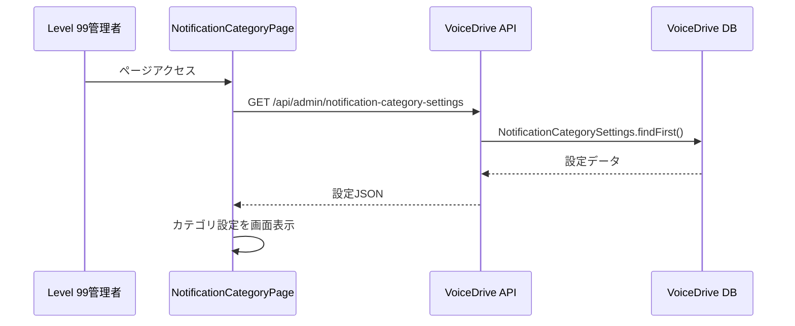
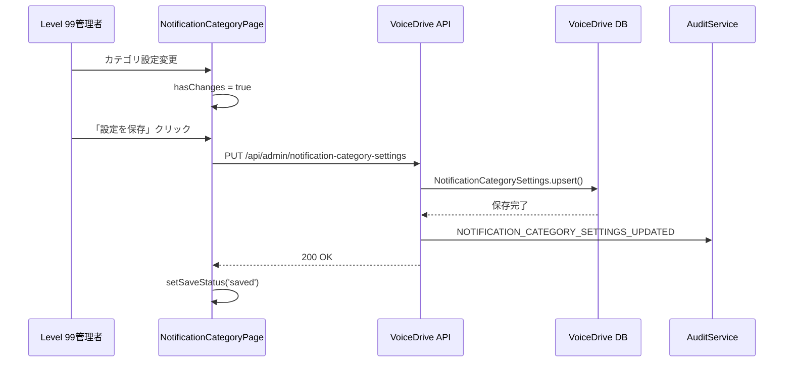
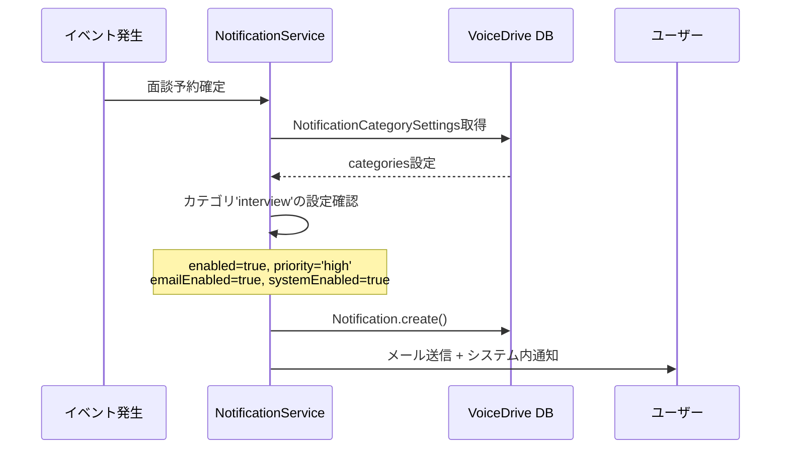

# NotificationCategoryPage DB要件分析

**文書番号**: DB-REQ-2025-1028-002
**作成日**: 2025年10月28日
**対象ページ**: https://voicedrive-v100.vercel.app/admin/notification-category
**権限レベル**: Level 99（システムオペレーター専用）
**参照文書**:
- [データ管理責任分界点定義書_20251008.md](../mcp-shared/docs/データ管理責任分界点定義書_20251008.md)
- [PersonalStation_DB要件分析_20251008.md](../mcp-shared/docs/PersonalStation_DB要件分析_20251008.md)
- [notifications_DB要件分析_20251022.md](../mcp-shared/docs/notifications_DB要件分析_20251022.md)

---

## 📋 分析サマリー

### ページ概要
**NotificationCategoryPage**（通知カテゴリ管理ページ）は、Level 99ユーザー専用の管理画面で、VoiceDriveの通知システムのカテゴリ別設定を管理します。

### 主要機能
1. **通知カテゴリ管理**: 8つの通知カテゴリの有効化/無効化
2. **配信方法設定**: カテゴリごとにメール通知・システム内通知の切り替え
3. **優先度設定**: カテゴリごとの優先度（低/通常/高/緊急）設定
4. **全般設定**: 通知保存期間、夜間モード、即時配信ルール

### 結論
NotificationCategoryPageは**VoiceDrive側で100%完結**します。医療システムからのデータ依存は一切ありません。

#### ✅ 現在の実装状況
- **データ保存**: ❌ **未実装**（現在はReact stateのみ）
- **API**: ❌ **未実装**（保存処理はモック）
- **監査ログ**: ✅ **実装済み**（AuditService.log()呼び出し）

#### 🔴 必要な追加実装（優先度: 高）
1. **NotificationCategorySettingsテーブル**の追加
2. **設定保存API**の実装
3. **設定読み込みAPI**の実装

---

## 🎯 ページ機能の詳細分析

### 機能1: 通知カテゴリ設定（38-127行目）

#### 表示内容
```typescript
const categories: NotificationCategory[] = [
  {
    id: 'interview',
    name: '面談・予約通知',
    description: '面談予約、リマインダー、キャンセル通知',
    icon: Calendar,
    color: '#2196F3',
    enabled: true,
    emailEnabled: true,
    systemEnabled: true,
    priority: 'high'
  },
  // ... 8カテゴリ
];
```

#### 必要なデータソース

| データ項目 | データ管理責任 | 現在の状態 | 必要なテーブル | 状態 |
|-----------|--------------|-----------|--------------|------|
| カテゴリ設定 | VoiceDrive | ❌ React state | `NotificationCategorySettings` | 🔴 **要追加** |
| enabled（有効化） | VoiceDrive | ❌ React state | `NotificationCategorySettings` | 🔴 **要追加** |
| emailEnabled | VoiceDrive | ❌ React state | `NotificationCategorySettings` | 🔴 **要追加** |
| systemEnabled | VoiceDrive | ❌ React state | `NotificationCategorySettings` | 🔴 **要追加** |
| priority | VoiceDrive | ❌ React state | `NotificationCategorySettings` | 🔴 **要追加** |

**評価**: 🔴 **データベース実装が必須**

- 現在はReact stateのみで、ページリロードで設定が消失
- 設定の永続化が必要
- VoiceDrive側で完全に管理

---

### 機能2: 全般設定（130-139行目）

#### 表示内容
```typescript
const generalSettings = {
  retentionDays: 30,                    // 通知保存期間（日）
  criticalPriorityImmediate: true,      // 緊急通知の即時配信
  highPriorityImmediate: true,          // 高優先度通知の即時配信
  normalPriorityBatch: false,           // 通常優先度のバッチ配信
  lowPriorityBatch: true,               // 低優先度のバッチ配信
  nightModeStart: '22:00',              // 夜間モード開始時刻
  nightModeEnd: '07:00',                // 夜間モード終了時刻
  nightModeSilent: true                 // 夜間モードで通知を抑制
};
```

#### 必要なデータソース

| データ項目 | データ管理責任 | 現在の状態 | 必要なテーブル | 状態 |
|-----------|--------------|-----------|--------------|------|
| 全般設定 | VoiceDrive | ❌ React state | `NotificationCategorySettings` | 🔴 **要追加** |
| 保存期間 | VoiceDrive | ❌ React state | `NotificationCategorySettings` | 🔴 **要追加** |
| 配信ルール | VoiceDrive | ❌ React state | `NotificationCategorySettings` | 🔴 **要追加** |
| 夜間モード | VoiceDrive | ❌ React state | `NotificationCategorySettings` | 🔴 **要追加** |

**評価**: 🔴 **データベース実装が必須**

---

### 機能3: 保存処理（163-188行目）

#### 現在の実装
```typescript
const handleSave = async () => {
  setSaveStatus('saving');

  setTimeout(() => {
    setSaveStatus('saved');
    setHasChanges(false);

    AuditService.log({
      userId: user?.id || '',
      action: 'NOTIFICATION_CATEGORY_SETTINGS_UPDATED',
      details: {
        categories: categories.map(c => ({
          id: c.id,
          enabled: c.enabled,
          emailEnabled: c.emailEnabled,
          systemEnabled: c.systemEnabled,
          priority: c.priority
        })),
        generalSettings
      },
      severity: 'medium'
    });

    setTimeout(() => setSaveStatus('idle'), 3000);
  }, 1000);
};
```

#### 問題点
- **モック処理**: `setTimeout`で疑似的に保存したように見せているだけ
- **データ永続化なし**: 実際にはDBに保存されていない
- **監査ログのみ記録**: AuditServiceのログは記録されるが、設定自体は保存されない

#### 必要な対応
```typescript
const handleSave = async () => {
  setSaveStatus('saving');

  try {
    // 🆕 実際のAPI呼び出し
    const response = await fetch('/api/admin/notification-category-settings', {
      method: 'PUT',
      headers: { 'Content-Type': 'application/json' },
      body: JSON.stringify({
        categories,
        generalSettings
      })
    });

    if (!response.ok) throw new Error('保存に失敗しました');

    setSaveStatus('saved');
    setHasChanges(false);

    AuditService.log({
      userId: user?.id || '',
      action: 'NOTIFICATION_CATEGORY_SETTINGS_UPDATED',
      details: { categories, generalSettings },
      severity: 'medium'
    });

    setTimeout(() => setSaveStatus('idle'), 3000);
  } catch (error) {
    setSaveStatus('error');
    console.error('保存エラー:', error);
  }
};
```

---

## 📊 データ管理責任の分析

### VoiceDrive側の責任（100%）

| データカテゴリ | 管理責任 | 理由 |
|--------------|---------|------|
| 通知カテゴリ設定 | ✅ VoiceDrive | VoiceDrive内部の通知ロジック制御 |
| 配信方法設定 | ✅ VoiceDrive | VoiceDrive内部の通知配信制御 |
| 優先度設定 | ✅ VoiceDrive | VoiceDrive内部の通知ルール |
| 全般設定 | ✅ VoiceDrive | VoiceDrive内部のシステム設定 |
| 夜間モード設定 | ✅ VoiceDrive | VoiceDrive内部の配信制御 |

### 医療システム側の責任（0%）

NotificationCategoryPageは**VoiceDrive内部の管理画面**であり、医療システムからのデータ依存は一切ありません。

**理由**:
1. 通知カテゴリはVoiceDriveの内部ロジック
2. 配信方法の制御はVoiceDriveが担当
3. 医療システムは通知の**送信側**であり、配信ルールは関与しない

---

## 📋 必要な追加テーブル

### 🔴 優先度: 高（即対応必要）

#### A. NotificationCategorySettings（通知カテゴリ設定）

```prisma
// VoiceDrive: prisma/schema.prisma
model NotificationCategorySettings {
  id            String   @id @default(cuid())

  // カテゴリ設定（JSON形式）
  categories    Json     @map("categories")
  // [
  //   {
  //     id: 'interview',
  //     name: '面談・予約通知',
  //     description: '...',
  //     enabled: true,
  //     emailEnabled: true,
  //     systemEnabled: true,
  //     priority: 'high'
  //   },
  //   ...
  // ]

  // 全般設定
  retentionDays              Int      @default(30) @map("retention_days")
  criticalPriorityImmediate  Boolean  @default(true) @map("critical_priority_immediate")
  highPriorityImmediate      Boolean  @default(true) @map("high_priority_immediate")
  normalPriorityBatch        Boolean  @default(false) @map("normal_priority_batch")
  lowPriorityBatch           Boolean  @default(true) @map("low_priority_batch")

  // 夜間モード設定
  nightModeStart   String?  @map("night_mode_start")      // '22:00'
  nightModeEnd     String?  @map("night_mode_end")        // '07:00'
  nightModeSilent  Boolean  @default(true) @map("night_mode_silent")

  // メタデータ
  updatedBy  String?   @map("updated_by")
  createdAt  DateTime  @default(now()) @map("created_at")
  updatedAt  DateTime  @updatedAt @map("updated_at")

  @@index([updatedAt])
  @@map("notification_category_settings")
}
```

**理由**:
- NotificationCategoryPageの設定を永続化
- カテゴリ設定はJSON形式で柔軟に管理
- 全般設定は個別フィールドで管理（クエリ最適化）

**影響範囲**:
- NotificationCategoryPage: 全機能（38-393行目）
- 通知配信ロジック: 設定に基づいた配信制御

---

## 🔄 データフロー図

### フロー1: ページ初期表示



### フロー2: 設定変更・保存



### フロー3: 通知配信時の設定参照



---

## 🔌 必要なAPI仕様

### API 1: 通知カテゴリ設定取得

**エンドポイント**: `GET /api/admin/notification-category-settings`

**リクエスト**:
```http
GET /api/admin/notification-category-settings
Authorization: Bearer {jwt_token}
X-Permission-Level: 99
```

**レスポンス**:
```json
{
  "id": "ncs-001",
  "categories": [
    {
      "id": "interview",
      "name": "面談・予約通知",
      "description": "面談予約、リマインダー、キャンセル通知",
      "enabled": true,
      "emailEnabled": true,
      "systemEnabled": true,
      "priority": "high"
    },
    {
      "id": "hr",
      "name": "人事お知らせ",
      "description": "人事からの重要なお知らせ、評価通知",
      "enabled": true,
      "emailEnabled": true,
      "systemEnabled": true,
      "priority": "high"
    }
    // ... 8カテゴリ
  ],
  "generalSettings": {
    "retentionDays": 30,
    "criticalPriorityImmediate": true,
    "highPriorityImmediate": true,
    "normalPriorityBatch": false,
    "lowPriorityBatch": true,
    "nightModeStart": "22:00",
    "nightModeEnd": "07:00",
    "nightModeSilent": true
  },
  "updatedBy": "OH-ADMIN-001",
  "updatedAt": "2025-10-28T10:00:00Z"
}
```

---

### API 2: 通知カテゴリ設定保存

**エンドポイント**: `PUT /api/admin/notification-category-settings`

**リクエスト**:
```http
PUT /api/admin/notification-category-settings
Authorization: Bearer {jwt_token}
X-Permission-Level: 99
Content-Type: application/json
```

```json
{
  "categories": [
    {
      "id": "interview",
      "name": "面談・予約通知",
      "description": "面談予約、リマインダー、キャンセル通知",
      "enabled": true,
      "emailEnabled": true,
      "systemEnabled": true,
      "priority": "high"
    }
    // ... 8カテゴリ
  ],
  "generalSettings": {
    "retentionDays": 30,
    "criticalPriorityImmediate": true,
    "highPriorityImmediate": true,
    "normalPriorityBatch": false,
    "lowPriorityBatch": true,
    "nightModeStart": "22:00",
    "nightModeEnd": "07:00",
    "nightModeSilent": true
  }
}
```

**レスポンス**:
```json
{
  "success": true,
  "message": "通知カテゴリ設定を保存しました",
  "updatedAt": "2025-10-28T10:15:00Z"
}
```

**エラーレスポンス**:
```json
{
  "success": false,
  "error": "権限レベルが不足しています（Level 99が必要）"
}
```

---

## 🎯 実装優先順位

### Phase 1: データベーステーブル追加（1日）

**目標**: NotificationCategorySettingsテーブルの実装

1. 🔴 **Prismaスキーマ更新**
   ```prisma
   model NotificationCategorySettings { /* 前述の定義 */ }
   ```

2. 🔴 **マイグレーション実行**
   ```bash
   npx prisma migrate dev --name add_notification_category_settings
   ```

3. 🔴 **初期データ投入**
   ```typescript
   // prisma/seed.ts
   await prisma.notificationCategorySettings.create({
     data: {
       categories: [/* 8カテゴリのデフォルト設定 */],
       retentionDays: 30,
       criticalPriorityImmediate: true,
       highPriorityImmediate: true,
       normalPriorityBatch: false,
       lowPriorityBatch: true,
       nightModeStart: '22:00',
       nightModeEnd: '07:00',
       nightModeSilent: true
     }
   });
   ```

**このPhaseで達成**:
- ✅ 設定データの永続化が可能に
- ✅ テーブル構造確定

---

### Phase 2: API実装（1-2日）

**目標**: 設定の取得・保存APIを実装

1. 🔴 **GET API実装**
   ```typescript
   // src/api/routes/admin/notificationCategorySettings.routes.ts
   router.get('/', authenticateToken, requirePermissionLevel(99), async (req, res) => {
     const settings = await prisma.notificationCategorySettings.findFirst({
       orderBy: { updatedAt: 'desc' }
     });

     if (!settings) {
       // デフォルト設定を返す
       return res.json(getDefaultSettings());
     }

     res.json(settings);
   });
   ```

2. 🔴 **PUT API実装**
   ```typescript
   router.put('/', authenticateToken, requirePermissionLevel(99), async (req, res) => {
     const { categories, generalSettings } = req.body;

     const settings = await prisma.notificationCategorySettings.upsert({
       where: { id: 'singleton' }, // 単一レコード
       create: {
         id: 'singleton',
         categories,
         ...generalSettings,
         updatedBy: req.user.id
       },
       update: {
         categories,
         ...generalSettings,
         updatedBy: req.user.id
       }
     });

     res.json({ success: true, message: '設定を保存しました', updatedAt: settings.updatedAt });
   });
   ```

**このPhaseで達成**:
- ✅ 設定の取得・保存が可能に
- ✅ 権限チェック（Level 99）実装

---

### Phase 3: フロントエンド連携（1日）

**目標**: NotificationCategoryPageをAPIに接続

1. 🔴 **useEffect追加（初期読み込み）**
   ```typescript
   useEffect(() => {
     const fetchSettings = async () => {
       try {
         const response = await fetch('/api/admin/notification-category-settings');
         const data = await response.json();
         setCategories(data.categories);
         setGeneralSettings(data.generalSettings);
       } catch (error) {
         console.error('設定の取得に失敗しました', error);
       }
     };

     fetchSettings();
   }, []);
   ```

2. 🔴 **handleSave修正（実際の保存）**
   ```typescript
   const handleSave = async () => {
     setSaveStatus('saving');

     try {
       const response = await fetch('/api/admin/notification-category-settings', {
         method: 'PUT',
         headers: { 'Content-Type': 'application/json' },
         body: JSON.stringify({
           categories,
           generalSettings
         })
       });

       if (!response.ok) throw new Error('保存に失敗しました');

       setSaveStatus('saved');
       setHasChanges(false);

       AuditService.log({
         userId: user?.id || '',
         action: 'NOTIFICATION_CATEGORY_SETTINGS_UPDATED',
         details: { categories, generalSettings },
         severity: 'medium'
       });

       setTimeout(() => setSaveStatus('idle'), 3000);
     } catch (error) {
       setSaveStatus('error');
       console.error('保存エラー:', error);
     }
   };
   ```

**このPhaseで達成**:
- ✅ ページリロードしても設定が保持される
- ✅ Level 99ユーザーが設定変更可能

---

### Phase 4: 通知配信ロジックへの統合（1-2日）

**目標**: 設定に基づいた通知配信制御

1. 🔴 **NotificationService修正**
   ```typescript
   // src/services/NotificationService.ts
   export async function sendNotification(
     category: string,
     userId: string,
     title: string,
     content: string
   ) {
     // 設定取得
     const settings = await prisma.notificationCategorySettings.findFirst();
     const categoryConfig = settings?.categories.find((c: any) => c.id === category);

     if (!categoryConfig || !categoryConfig.enabled) {
       console.log(`カテゴリ ${category} は無効化されています`);
       return;
     }

     // 夜間モードチェック
     const now = new Date();
     const currentTime = `${now.getHours().toString().padStart(2, '0')}:${now.getMinutes().toString().padStart(2, '0')}`;
     if (settings?.nightModeSilent && isNightMode(currentTime, settings.nightModeStart, settings.nightModeEnd)) {
       console.log('夜間モードのため通知を抑制します');
       return;
     }

     // 通知作成
     const notification = await prisma.notification.create({
       data: {
         category,
         priority: categoryConfig.priority,
         title,
         content,
         senderId: 'system',
         target: `user:${userId}`
       }
     });

     // 配信方法に基づいた送信
     if (categoryConfig.emailEnabled) {
       await sendEmail(userId, title, content);
     }

     if (categoryConfig.systemEnabled) {
       await createNotificationRecipient(notification.id, userId);
     }
   }
   ```

**このPhaseで達成**:
- ✅ カテゴリ設定に基づいた配信制御
- ✅ 夜間モード対応
- ✅ 優先度に基づいた即時/バッチ配信

---

## ✅ 実装チェックリスト

### データベース
- [ ] NotificationCategorySettingsテーブル追加
- [ ] マイグレーション実行
- [ ] 初期データ投入（8カテゴリのデフォルト設定）

### API実装
- [ ] GET /api/admin/notification-category-settings 実装
- [ ] PUT /api/admin/notification-category-settings 実装
- [ ] 権限チェック（Level 99）実装
- [ ] エラーハンドリング実装

### フロントエンド実装
- [ ] NotificationCategoryPageにuseEffect追加（初期読み込み）
- [ ] handleSave修正（実際のAPI呼び出し）
- [ ] エラー表示UI追加
- [ ] 読み込み中表示追加

### 通知配信ロジック統合
- [ ] NotificationServiceに設定参照機能追加
- [ ] カテゴリ有効化チェック実装
- [ ] 夜間モードチェック実装
- [ ] 優先度別配信ロジック実装

### テスト
- [ ] 設定取得APIの単体テスト
- [ ] 設定保存APIの単体テスト
- [ ] NotificationCategoryPageのE2Eテスト
- [ ] 通知配信ロジックの統合テスト
- [ ] 夜間モードの動作テスト

---

## 🔗 関連ドキュメント

- [データ管理責任分界点定義書](../mcp-shared/docs/データ管理責任分界点定義書_20251008.md)
- [notifications_DB要件分析](../mcp-shared/docs/notifications_DB要件分析_20251022.md)
- [PersonalStation_DB要件分析](../mcp-shared/docs/PersonalStation_DB要件分析_20251008.md)

---

**文書終了**

最終更新: 2025年10月28日
バージョン: 1.0
次回レビュー: Phase 1実装後
