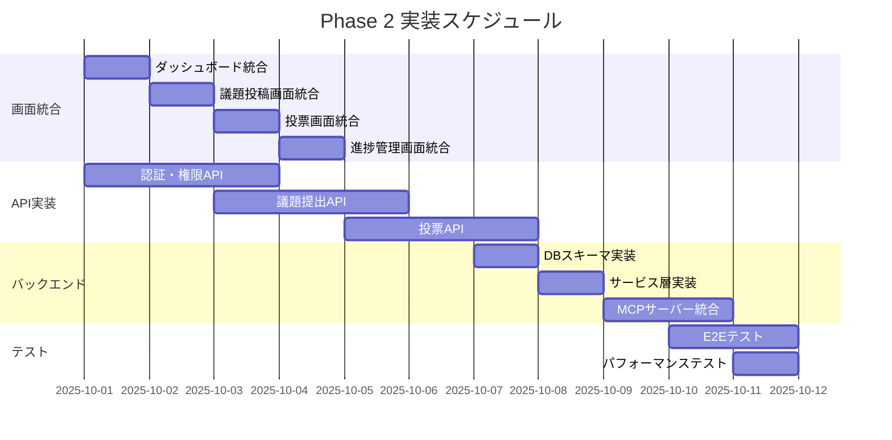

# Phase 2 実装計画書 - VoiceDrive統合作業

**作成日**: 2025年9月25日
**作成者**: VoiceDrive開発チーム
**対象期間**: 2025年10月第1週～第2週

## 1. Phase 2 概要

### 1.1 目的
Phase 1で実装した18段階権限システムと議題提出エスカレーションエンジンを、実際のアプリケーション画面に統合し、医療チームシステムとのAPI連携を実装する。

### 1.2 スコープ
- ✅ Phase 1で完了したコンポーネントの画面統合
- 🔄 APIエンドポイントの実装
- 🔄 フロントエンド・バックエンド接続
- 🔄 MCPサーバー経由のデータ同期
- 🔄 統合テスト実施

## 2. 実装タスク詳細

### 2.1 画面統合作業（Week 1: 10/1-10/4）

#### Day 1 (10/1) - ダッシュボード統合
```typescript
// タスク内容
- [ ] src/pages/Dashboard.tsxに権限レベル表示を統合
- [ ] PermissionLevelBadgeコンポーネントの配置
- [ ] 権限に基づくメニュー制御の実装
- [ ] ユーザーコンテキストフックの作成

// 成果物
- Dashboard.tsx (更新)
- useUserPermission.ts (新規)
- UserContext.tsx (新規)
```

#### Day 2 (10/2) - 議題投稿画面の統合
```typescript
// タスク内容
- [ ] アイデアボイス投稿フォームの更新
- [ ] ProposalEscalationEngineの統合
- [ ] リアルタイム投票重み計算の表示
- [ ] カテゴリ別重み付けUIの実装

// 成果物
- IdeaVoiceForm.tsx (更新)
- ProposalSubmission.tsx (新規)
- VoteWeightPreview.tsx (新規)
```

#### Day 3 (10/3) - 投票画面の統合
```typescript
// タスク内容
- [ ] 投票権限チェックの実装
- [ ] VotingPermissionMatrixの統合
- [ ] 投票範囲（部署/施設/法人）の表示制御
- [ ] リアクションボタンの権限制御

// 成果物
- VotingInterface.tsx (更新)
- VotingPermissionCheck.tsx (新規)
- VotingScopeIndicator.tsx (新規)
```

#### Day 4 (10/4) - 進捗管理画面の統合
```typescript
// タスク内容
- [ ] ProposalLevelIndicatorの統合
- [ ] エスカレーション状況の可視化
- [ ] 委員会提出状況の表示
- [ ] 議題ステータストラッキング

// 成果物
- ProposalProgress.tsx (新規)
- CommitteeSubmissionStatus.tsx (新規)
- EscalationTimeline.tsx (新規)
```

### 2.2 APIエンドポイント実装（Week 1-2: 10/1-10/8）

#### 認証・権限API
```typescript
// POST /api/auth/login
interface LoginResponse {
  token: string;
  user: {
    staffId: string;
    name: string;
    accountLevel: PermissionLevel | SpecialPermissionLevel;
    facility: string;
    department: string;
  };
}

// GET /api/users/permissions/:staffId
interface PermissionResponse {
  level: number;
  metadata: PermissionMetadata;
  nursingLeaderBonus: boolean;
  calculatedLevel: number;
}
```

#### 議題提出API
```typescript
// POST /api/proposals/submit
interface ProposalSubmitRequest {
  title: string;
  description: string;
  category: string;
  attachments?: string[];
}

// GET /api/proposals/:proposalId/escalation
interface EscalationStatusResponse {
  currentScore: number;
  adjustedScore: number;
  votingScope: 'department' | 'facility' | 'corporation';
  targetCommittee?: Committee;
  nextThreshold: number;
}
```

#### 投票API
```typescript
// POST /api/votes/calculate-weight
interface VoteWeightRequest {
  staffId: string;
  proposalId: string;
  voteType: string;
}

// POST /api/votes/submit
interface VoteSubmitRequest {
  proposalId: string;
  voteType: string;
  comment?: string;
}

// GET /api/votes/permission-check
interface VotingPermissionRequest {
  staffId: string;
  proposalId: string;
}
```

### 2.3 バックエンド実装（Week 2: 10/7-10/11）

#### Day 5 (10/7) - データベーススキーマ実装
```sql
-- 権限レベルマスタ
CREATE TABLE permission_levels (
  level_value DECIMAL(3,1) PRIMARY KEY,
  level_name VARCHAR(50),
  description TEXT,
  weight_multiplier DECIMAL(3,1)
);

-- スタッフ権限拡張
ALTER TABLE staff ADD COLUMN
  account_level DECIMAL(3,1),
  can_perform_leader_duty BOOLEAN DEFAULT FALSE,
  calculated_level DECIMAL(3,1) GENERATED ALWAYS AS (
    CASE
      WHEN can_perform_leader_duty AND profession = '看護師'
      THEN account_level + 0.5
      ELSE account_level
    END
  ) STORED;

-- 議題エスカレーション
CREATE TABLE proposal_escalation (
  proposal_id INT PRIMARY KEY,
  raw_score INT,
  department_size INT,
  size_multiplier DECIMAL(3,2),
  adjusted_score INT,
  voting_scope VARCHAR(20),
  target_committee_id INT,
  escalation_level INT
);
```

#### Day 6 (10/8) - サービス層実装
```typescript
// src/backend/services/PermissionService.ts
export class PermissionService {
  async calculateUserLevel(staffId: string): Promise<number>;
  async getPermissionMetadata(level: number): Promise<PermissionMetadata>;
  async checkVotingPermission(staffId: string, proposalId: string): Promise<VotingPermission>;
}

// src/backend/services/ProposalService.ts
export class ProposalService {
  async submitProposal(data: ProposalSubmitRequest): Promise<Proposal>;
  async calculateEscalation(proposalId: string): Promise<EscalationStatus>;
  async escalateToCommittee(proposalId: string): Promise<void>;
}

// src/backend/services/VotingService.ts
export class VotingService {
  async calculateVoteWeight(staffId: string, proposalId: string): Promise<VoteWeight>;
  async submitVote(staffId: string, voteData: VoteSubmitRequest): Promise<void>;
  async aggregateVotes(proposalId: string): Promise<VoteAggregation>;
}
```

#### Day 7-8 (10/9-10/10) - MCPサーバー統合
```typescript
// MCPサーバー連携エンドポイント
// GET /api/mcp/sync/staff
// 医療チームシステムからスタッフマスタを同期

// POST /api/mcp/webhook/staff-update
// スタッフ情報更新のWebhook受信

// GET /api/mcp/health
// MCPサーバー疎通確認

interface MCPSyncConfig {
  endpoint: 'http://localhost:8080',
  syncInterval: 600000, // 10分
  retryPolicy: {
    maxAttempts: 3,
    backoffMs: 1000
  }
}
```

### 2.4 フロントエンド・バックエンド接続（Week 2: 10/7-10/11）

#### API クライアント実装
```typescript
// src/services/api/ApiClient.ts
export class ApiClient {
  private baseURL = process.env.REACT_APP_API_URL;

  async fetchWithAuth(endpoint: string, options?: RequestInit);
  async handleResponse<T>(response: Response): Promise<T>;
  async handleError(error: Error): Promise<void>;
}

// src/services/api/PermissionApi.ts
export const permissionApi = {
  getUserPermissions: async (staffId: string) => {},
  calculateLevel: async (staffData: StaffData) => {},
};

// src/services/api/ProposalApi.ts
export const proposalApi = {
  submit: async (data: ProposalSubmitRequest) => {},
  getEscalationStatus: async (proposalId: string) => {},
};

// src/services/api/VotingApi.ts
export const votingApi = {
  calculateWeight: async (staffId: string, proposalId: string) => {},
  submitVote: async (voteData: VoteSubmitRequest) => {},
};
```

#### State Management（Redux実装）
```typescript
// src/store/slices/permissionSlice.ts
interface PermissionState {
  userLevel: PermissionLevel | SpecialPermissionLevel | null;
  metadata: PermissionMetadata | null;
  loading: boolean;
  error: string | null;
}

// src/store/slices/proposalSlice.ts
interface ProposalState {
  proposals: Proposal[];
  escalationStatus: Map<string, EscalationStatus>;
  loading: boolean;
  error: string | null;
}

// src/store/slices/votingSlice.ts
interface VotingState {
  voteWeights: Map<string, VoteWeight>;
  userVotes: Map<string, Vote>;
  permissions: Map<string, VotingPermission>;
  loading: boolean;
  error: string | null;
}
```

## 3. 統合テスト計画

### 3.1 E2Eテストシナリオ（Week 2: 10/10-10/11）

#### シナリオ1: 権限レベル表示
```typescript
describe('権限レベル表示E2E', () => {
  test('ログイン後、正しい権限レベルが表示される', async () => {
    // 1. ログイン
    // 2. ダッシュボード確認
    // 3. バッジ表示確認
    // 4. メニュー表示確認
  });

  test('看護師リーダーの0.5レベル加算が反映される', async () => {
    // 1. 看護師（リーダー可）でログイン
    // 2. レベル表示確認（例: 2.5）
    // 3. 権限メタデータ確認
  });
});
```

#### シナリオ2: 議題提出フロー
```typescript
describe('議題提出フローE2E', () => {
  test('議題提出から部署レベル投票まで', async () => {
    // 1. 議題作成
    // 2. カテゴリ選択
    // 3. 提出確認
    // 4. エスカレーションステータス確認
    // 5. 投票開始
  });

  test('スコア100点超えで施設全体投票に拡大', async () => {
    // 1. 複数ユーザーで投票
    // 2. スコア蓄積確認
    // 3. 100点到達
    // 4. 投票範囲拡大確認
  });
});
```

#### シナリオ3: 投票権限チェック
```typescript
describe('投票権限チェックE2E', () => {
  test('同部署の議題に投票可能', async () => {
    // 1. 同部署ユーザーでログイン
    // 2. 議題一覧表示
    // 3. 投票ボタン有効確認
    // 4. 投票実行
  });

  test('法人レベル議題は中堅以上のみ投票可能', async () => {
    // 1. 若手ユーザー（Level 2）でログイン
    // 2. 法人レベル議題表示
    // 3. 投票ボタン無効確認
    // 4. 権限不足メッセージ確認
  });
});
```

### 3.2 パフォーマンステスト

#### 負荷テスト項目（医療チーム合意済み）
```yaml
scenarios:
  - name: "同時投票負荷テスト"
    concurrent_users: 100  # ピーク時想定（投票締切前）
    duration: 60s
    target_endpoint: "/api/votes/submit"
    expected_response_time: < 200ms  # 95%ile目標値

  - name: "権限計算負荷テスト（最優先API）"
    concurrent_users: 50
    duration: 30s
    target_endpoint: "/api/v1/calculate-level"
    expected_response_time: < 100ms  # 高速応答必須

  - name: "議題一覧取得"
    concurrent_users: 100  # 通常時想定
    duration: 120s
    target_endpoint: "/api/proposals"
    expected_response_time: < 200ms  # 95%ile目標値

  - name: "Webhook処理"
    concurrent_requests: 20
    duration: 30s
    target_endpoint: "/webhook/staff-change"
    expected_response_time: < 50ms  # 非同期処理
```

## 4. デプロイメント計画

### 4.1 環境構成
```yaml
development:
  frontend: http://localhost:3001
  backend: http://localhost:4000
  mcp_server: http://localhost:8080
  database: PostgreSQL 14 (Docker)

staging:
  frontend: https://staging.voicedrive.ohara-hospital.jp
  backend: https://api-staging.voicedrive.ohara-hospital.jp
  mcp_server: https://mcp-staging.ohara-hospital.jp
  database: PostgreSQL 14 (AWS RDS)

production:
  frontend: https://voicedrive.ohara-hospital.jp
  backend: https://api.voicedrive.ohara-hospital.jp
  mcp_server: https://mcp.ohara-hospital.jp
  database: PostgreSQL 14 (AWS RDS - Multi-AZ)
```

### 4.2 デプロイメントステップ
1. **10/11（金）**: Staging環境へのデプロイ
2. **10/14（月）**: 医療チームとの統合テスト
3. **10/15（火）**: パフォーマンステスト
4. **10/16（水）**: セキュリティ監査
5. **10/17（木）**: 最終調整
6. **10/18（金）**: 本番環境デプロイ（小原病院限定）

## 5. リスク管理

### 5.1 技術的リスク
| リスク | 影響 | 軽減策 |
|--------|------|--------|
| MCPサーバー接続障害 | データ同期不可 | フォールバック機構、キャッシュ活用 |
| 高負荷時のパフォーマンス劣化 | UX低下 | スケーリング設定、CDN活用 |
| 権限計算の不整合 | 投票結果への影響 | 二重チェック機構、監査ログ |

### 5.2 運用リスク
| リスク | 影響 | 軽減策 |
|--------|------|--------|
| スタッフの権限レベル理解不足 | 利用率低下 | 研修実施、ヘルプ機能強化 |
| 医療チームとの連携遅延 | スケジュール遅延 | 毎日のスタンドアップ、早期エスカレーション |

## 6. 成功基準

### 6.1 機能要件
- ✅ 全18レベル+Xの権限が正しく動作
- ✅ 投票重み計算が設計通りに実行
- ✅ エスカレーション機能が閾値通りに動作
- ✅ MCPサーバー経由でデータ同期が成功

### 6.2 非機能要件
- ✅ API応答時間: 95%ile < 200ms
- ✅ 同時接続: 500ユーザー以上対応
- ✅ 可用性: 99.5%以上
- ✅ セキュリティ: OWASP Top 10対応

## 7. タイムライン



## 8. チーム体制

### 開発チーム
- **フロントエンド**: 2名
  - React/TypeScript統合
  - UI/UXテスト

- **バックエンド**: 2名
  - API実装
  - データベース設計

- **インフラ/DevOps**: 1名
  - MCPサーバー連携
  - デプロイメント

- **QA**: 1名
  - 統合テスト
  - パフォーマンステスト

### 医療チーム連携
- **窓口**: プロジェクトマネージャー
- **技術連携**: MCPサーバー担当
- **定例会議**: 月・木 10:00-11:00

## 9. 次のアクション

### 今週（9/25-9/27）
1. ✅ 実装計画書の作成（本書）
2. 🔄 医療チームとの技術仕様レビュー会議
3. 🔄 開発環境のセットアップ確認

### 来週（9/30-10/4）
1. 🔄 Phase 2キックオフミーティング
2. 🔄 画面統合作業開始
3. 🔄 API仕様の最終確認

---

**VoiceDrive開発チーム**
最終更新: 2025年9月25日