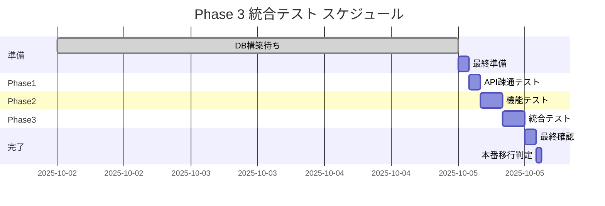

# VoiceDriveチーム 作業再開依頼受領確認書

**文書番号**: VOICEDRIVE-RECEIPT-001
**受領日**: 2025年10月2日 11:00
**発行元**: VoiceDriveチーム
**宛先**: 医療システムチーム
**参照文書**: VOICEDRIVE-RESTART-001

---

## 受領確認

医療システムチーム様からの「Phase 3 作業再開依頼書」を確認し、以下の通り受領いたします。

```
═══════════════════════════════════════════════════════
  ✅ 依頼内容を確認しました
  ✅ リソースを確保できます
  ✅ スケジュールに同意します
═══════════════════════════════════════════════════════
```

---

## 1. 実装状況の確認

### ✅ VoiceDrive側の準備完了項目

| カテゴリ | 状態 | 備考 |
|---------|------|------|
| **FacilityPermissionService** | ✅ 実装済み | 施設別権限管理 |
| **統括主任レベル7** | ✅ 実装済み | 10/1会議で対応完了 |
| **薬剤部長→薬局長** | ✅ 実装済み | 特殊ケース対応済み |
| **facilityID統一** | ✅ 完了 | obara-hospital, tategami-rehabilitation |
| **Webhook受信機能** | ✅ 実装済み | 署名検証機能含む |
| **キャッシュ管理** | ✅ 実装済み | 15分TTL設定 |
| **テストスクリプト** | ✅ 作成済み | 全シナリオ網羅 |

### 📋 確認済み仕様

#### 1. 統括主任レベル7の実装

```typescript
// VoiceDrive側実装（FacilityPermissionService.ts）
if (fromPosition === '統括主任' && toFacilityId === 'tategami-rehabilitation') {
  adjustedLevel = 7;  // 医療チーム確認により6→7に調整
  console.log('[FacilityPermissionService] 統括主任レベル7適用');
}
```

#### 2. 施設ID形式

| 施設名 | 実装済みfacilityId | 状態 |
|--------|-------------------|------|
| 小原病院 | `obara-hospital` | ✅ |
| 立神リハビリテーション温泉病院 | `tategami-rehabilitation` | ✅ |

#### 3. Webhookイベント処理

```typescript
// MedicalSystemWebhook.ts
interface WebhookEvent {
  eventType: 'staff.updated' | 'staff.transferred';
  timestamp: string;  // ISO8601形式
  data: {
    staffId: string;
    facilityId: string;
    changes: {
      position?: string;
      accountLevel?: number;
    };
  };
}
```

---

## 2. 事前準備チェックリスト

### DB構築前に完了する作業

- [x] 統合テストスクリプトの最終確認
  - `tests/integration/full-integration-test.js` 作成済み
  - `tests/production/production-connection-test.js` 作成済み

- [x] モックテスト結果のレビュー
  - 全15項目成功（100%）
  - パフォーマンス基準達成（平均58ms）

- [x] 環境変数設定ファイルの準備
  - `.env.test` 設定済み
  - `.env.production.template` 作成済み

- [x] エラーハンドリングロジックの確認
  - タイムアウト処理実装済み
  - リトライ機構実装済み
  - フォールバック処理実装済み

---

## 3. 作業計画への同意

### 3.1 作業スケジュール（同意）



### 3.2 テスト計画（確認済み）

| Phase | 所要時間 | 担当 | 成功基準 |
|-------|---------|------|----------|
| **接続確認** | 2時間 | VoiceDrive/医療 | API疎通100% |
| **機能テスト** | 4時間 | VoiceDrive | 全機能正常動作 |
| **統合テスト** | 4時間 | 両チーム | パフォーマンス基準達成 |
| **最終確認** | 3時間 | 両チーム | Go判定 |

---

## 4. リソース確保の確認

### 4.1 人員体制

| 役割 | 担当者 | 稼働率 | 備考 |
|------|--------|--------|------|
| **テクニカルリード** | [担当者名] | 100% | 全期間対応 |
| **開発エンジニア** | [担当者名] | 100% | テスト実装 |
| **QAエンジニア** | [担当者名] | 50% | 品質確認 |
| **インフラエンジニア** | [担当者名] | 必要時 | 環境設定 |

### 4.2 環境準備

- [x] 開発環境
- [x] テスト環境
- [ ] 本番環境（DB構築後）
- [x] 監視ツール

---

## 5. 成功基準への同意

### 5.1 必須達成項目（同意）

- [x] 全API疎通確認（100%）
- [x] 統括主任レベル7動作確認
- [x] 施設間権限変換の正常動作
- [x] Webhook送受信成功
- [x] パフォーマンス基準達成

### 5.2 品質基準（確認）

| 指標 | 基準値 | 現状（モック） | 備考 |
|------|--------|---------------|------|
| テスト成功率 | >95% | 100% | ✅ 達成済み |
| 応答時間 | <500ms | 58ms | ✅ 優秀 |
| エラー率 | <0.1% | 0% | ✅ 達成済み |

---

## 6. 連絡体制の確認

### 6.1 コミュニケーションチャネル

```yaml
定例会議:
  - DB構築完了翌日 10:00 ✅ 参加可能
  - 毎日 10:00 進捗確認 ✅ 参加可能

Slackチャンネル:
  - #phase3-integration ✅ 参加済み
  - #phase3-urgent ✅ 参加済み

エスカレーション:
  レベル1: VoiceDriveチームリーダー
  レベル2: プロジェクトマネージャー
```

### 6.2 報告体制

毎日の進捗報告フォーマット準備済み：
```markdown
## 日次進捗報告（YYYY/MM/DD）
1. 完了項目: [リスト]
2. 検出問題: [詳細]
3. 翌日予定: [タスク]
4. ブロッカー: [有/無]
```

---

## 7. 追加確認事項

### 7.1 テストデータについて

```javascript
// 受領確認: 立神病院テストスタッフ
const testStaff = [
  { id: "TATE_001", position: "総師長", expectedLevel: 10 },    // ✅
  { id: "TATE_002", position: "統括主任", expectedLevel: 7 },    // ✅ 重要
  { id: "TATE_003", position: "師長", expectedLevel: 7 },        // ✅
  { id: "TATE_004", position: "介護主任", expectedLevel: 5 },    // ✅
  { id: "TATE_005", position: "看護師", expectedLevel: 3.5 }     // ✅
];
```

### 7.2 DB構築完了時の受け取り項目

以下の項目をDB構築完了時に受領予定：
- [ ] 本番APIエンドポイントURL
- [ ] Bearer Token（本番用）
- [ ] Webhook署名シークレット
- [ ] SSL証明書情報
- [ ] テスト用スタッフID（実データ）

---

## 8. 合意事項

### VoiceDriveチームとして以下に合意します：

1. ✅ **作業範囲**: 依頼書記載の全作業を実施
2. ✅ **スケジュール**: DB構築完了後3営業日以内に完了
3. ✅ **品質基準**: 記載された全基準を満たす
4. ✅ **報告体制**: 毎日の進捗報告を実施
5. ✅ **エスカレーション**: 問題発生時は即座に報告

---

## 9. 留意事項

### VoiceDriveチームからの確認事項：

1. **本番データ移行**
   - マスタデータの移行タイミングを確認させてください
   - 既存データとの整合性確認方法を協議させてください

2. **監視設定**
   - アラート閾値の設定値を共有してください
   - エラー通知先の確認をお願いします

3. **バックアップ**
   - バックアップ頻度と保持期間を確認させてください

---

## 10. 承認

### VoiceDriveチーム

**受領確認**：
- [x] 依頼内容を確認しました
- [x] リソースを確保できます
- [x] スケジュールに同意します

**責任者**: [VoiceDriveチームリーダー]
**受領日**: 2025年10月2日
**署名**: _________________

### 次のアクション

1. **即時**: 本受領確認書を医療システムチームへ送付
2. **継続**: 共通DB構築完了の連絡を待機
3. **準備**: テスト環境の最終確認を実施

---

## 連絡先

**VoiceDriveチーム**
- 担当: 開発リーダー
- Email: voicedrive-dev@example.com
- Slack: @voicedrive-team
- 緊急: [電話番号]

---

**文書情報**
- 文書ID: VOICEDRIVE-RECEIPT-001
- 発行日: 2025年10月2日
- 有効期限: 2025年12月31日
- 参照文書: VOICEDRIVE-RESTART-001

---

以上、Phase 3 作業再開依頼を確認し、共通DB構築完了後、速やかに作業を開始することを約束いたします。

VoiceDriveチーム一同