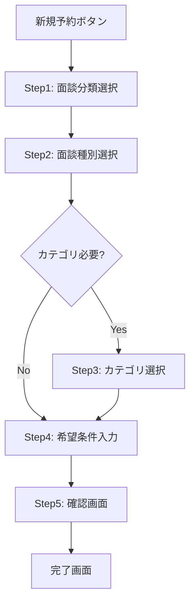

# 面談予約システム 詳細設計書

## 文書情報
- 作成日: 2025年9月14日
- 作成者: VoiceDriveチーム
- 文書番号: VDDD-2025-001
- バージョン: 1.0

---

## 1. システム概要

### 1.1 目的
医療職員500名の面談予約を効率的に管理し、人事部の少数精鋭運営を支援する統一予約システムの構築。

### 1.2 主要機能
- 統一された面談予約フロー
- スマートフォン最適化UI
- 希望条件ベースの予約システム
- AI最適化による担当者マッチング

### 1.3 システム構成
```
┌─────────────────────────────────────┐
│     VoiceDrive フロントエンド        │
│         (React/TypeScript)           │
└──────────────┬──────────────────────┘
               │
               ▼
┌─────────────────────────────────────┐
│      統合API Gateway                 │
│    (/api/v1/interviews/*)            │
└──────────────┬──────────────────────┘
               │
       ┌───────┴────────┬──────────┐
       ▼                ▼          ▼
┌─────────────┐ ┌──────────┐ ┌──────────┐
│医療システム │ │AI最適化  │ │MCP統合   │
│    API      │ │エンジン  │ │サーバー  │
└─────────────┘ └──────────┘ └──────────┘
```

---

## 2. 画面フロー設計

### 2.1 全体フロー


### 2.2 画面遷移詳細

#### Step 1: 面談分類選択
- **URL**: `/interview/booking/classification`
- **コンポーネント**: `InterviewClassificationSelector.tsx`
- **選択肢**: 定期面談 / サポート面談 / 特別面談

#### Step 2: 面談種別選択
- **URL**: `/interview/booking/type`
- **コンポーネント**: `InterviewTypeSelector.tsx`
- **動的選択肢**: 分類に応じた種別表示

#### Step 3: カテゴリ選択（条件付き）
- **URL**: `/interview/booking/category`
- **コンポーネント**: `InterviewCategorySelector.tsx`
- **表示条件**: サポート面談選択時のみ

#### Step 4: 希望条件入力
- **URL**: `/interview/booking/preferences`
- **コンポーネント**: `InterviewPreferencesForm.tsx`
- **入力項目**: 希望時期、時間帯、曜日、担当者、場所、その他

#### Step 5: 確認画面
- **URL**: `/interview/booking/confirm`
- **コンポーネント**: `InterviewBookingConfirm.tsx`
- **機能**: 入力内容確認、修正、申込

#### 完了画面
- **URL**: `/interview/booking/complete`
- **コンポーネント**: `InterviewBookingComplete.tsx`
- **表示**: 受付番号、次のステップ案内

---

## 3. コンポーネント設計

### 3.1 コンポーネント構成
```
src/components/interview/
├── unified/
│   ├── InterviewFlowContainer.tsx      # フロー全体管理
│   ├── InterviewProgressIndicator.tsx  # 進捗表示
│   └── InterviewNavigationButtons.tsx  # ナビゲーション
├── steps/
│   ├── InterviewClassificationSelector.tsx
│   ├── InterviewTypeSelector.tsx
│   ├── InterviewCategorySelector.tsx
│   ├── InterviewPreferencesForm.tsx
│   ├── InterviewBookingConfirm.tsx
│   └── InterviewBookingComplete.tsx
└── shared/
    ├── InterviewCard.tsx               # 選択カード
    ├── InterviewFormField.tsx          # フォーム部品
    └── InterviewMobileOptimized.tsx    # モバイル最適化
```

### 3.2 主要コンポーネント仕様

#### InterviewFlowContainer
```typescript
interface InterviewFlowState {
  currentStep: 1 | 2 | 3 | 4 | 5;
  classification?: 'regular' | 'support' | 'special';
  type?: string;
  category?: string;
  preferences?: InterviewPreferences;
}

interface InterviewPreferences {
  timing: 'urgent' | 'this_week' | 'next_week' | 'this_month' | 'specific';
  specificDate?: string;
  timeSlot: 'morning' | 'afternoon' | 'evening' | 'anytime';
  weekdays?: string[];
  interviewer: 'anyone' | 'previous' | 'specific';
  interviewerId?: string;
  location: 'inside' | 'outside';
  notes?: string;
}
```

---

## 4. API設計

### 4.1 エンドポイント一覧

#### 面談予約申込
```
POST /api/v1/interviews/request
```

**リクエスト**:
```json
{
  "classification": "support",
  "type": "career",
  "category": "skill_development",
  "preferences": {
    "timing": "next_week",
    "timeSlot": "afternoon",
    "weekdays": ["mon", "wed", "fri"],
    "interviewer": "anyone",
    "location": "inside",
    "notes": "資格取得について相談したい"
  }
}
```

**レスポンス**:
```json
{
  "success": true,
  "data": {
    "requestId": "REQ-2025-0914-001",
    "status": "pending",
    "estimatedResponse": "1-2営業日",
    "message": "仮予約を受け付けました"
  }
}
```

#### 担当者一覧取得
```
GET /api/v1/interviewers/available
```

**レスポンス**:
```json
{
  "success": true,
  "data": [
    {
      "id": "INT-001",
      "name": "山田太郎",
      "department": "人事部",
      "specialties": ["キャリア相談", "メンタルヘルス"]
    }
  ]
}
```

#### 予約状態確認
```
GET /api/v1/interviews/request/{requestId}/status
```

---

## 5. データベース設計

### 5.1 テーブル構成

#### interview_requests（面談予約申込）
| カラム名 | 型 | 説明 |
|---------|-----|------|
| id | UUID | 主キー |
| request_id | VARCHAR(50) | 受付番号 |
| employee_id | UUID | 職員ID |
| classification | ENUM | 面談分類 |
| type | VARCHAR(50) | 面談種別 |
| category | VARCHAR(50) | カテゴリ |
| preferences | JSONB | 希望条件 |
| status | ENUM | ステータス |
| created_at | TIMESTAMP | 作成日時 |
| updated_at | TIMESTAMP | 更新日時 |

#### interview_assignments（面談割当）
| カラム名 | 型 | 説明 |
|---------|-----|------|
| id | UUID | 主キー |
| request_id | UUID | 申込ID |
| interviewer_id | UUID | 担当者ID |
| scheduled_date | DATE | 予定日 |
| scheduled_time | TIME | 予定時刻 |
| location | VARCHAR(100) | 場所 |
| status | ENUM | 確定状態 |

---

## 6. UI/UX設計

### 6.1 デザイン原則
- **モバイルファースト**: スマートフォン画面を基準
- **1画面1タスク**: スクロール不要な設計
- **親指操作**: 重要ボタンは画面下部配置
- **視認性**: 最小タッチターゲット44px

### 6.2 レスポンシブ対応

#### ブレークポイント
```css
/* スマートフォン */
@media (max-width: 640px) {
  /* 縦1列レイアウト */
}

/* タブレット */
@media (min-width: 641px) and (max-width: 1024px) {
  /* 2列グリッド */
}

/* デスクトップ */
@media (min-width: 1025px) {
  /* 3列グリッド、サイドバー表示 */
}
```

### 6.3 アクセシビリティ
- **ARIA属性**: 適切なラベル付け
- **キーボード操作**: Tab/Enter/Escapeサポート
- **スクリーンリーダー**: 読み上げ対応
- **コントラスト比**: WCAG AA準拠

---

## 7. セキュリティ設計

### 7.1 認証・認可
- JWT トークンによる認証
- ロールベースアクセス制御
- セッションタイムアウト: 30分

### 7.2 データ保護
- HTTPS通信必須
- 個人情報の暗号化
- SQLインジェクション対策
- XSS対策（React自動エスケープ）

---

## 8. パフォーマンス要件

### 8.1 レスポンス時間
- 画面遷移: 1秒以内
- API応答: 3秒以内
- 初回ロード: 5秒以内

### 8.2 最適化施策
- コード分割（Code Splitting）
- 遅延ロード（Lazy Loading）
- キャッシュ活用
- 画像最適化（WebP形式）

---

## 9. エラー処理

### 9.1 エラー種別
```typescript
enum ErrorType {
  NETWORK_ERROR = 'ネットワークエラー',
  VALIDATION_ERROR = '入力エラー',
  SERVER_ERROR = 'サーバーエラー',
  TIMEOUT_ERROR = 'タイムアウト'
}
```

### 9.2 ユーザー通知
- トースト通知（一時的エラー）
- モーダル表示（重要エラー）
- インライン表示（入力エラー）

---

## 10. テスト計画

### 10.1 単体テスト
- Jest + React Testing Library
- カバレッジ目標: 80%以上

### 10.2 統合テスト
- E2Eテスト（Cypress）
- APIモックテスト
- ブラウザ互換性テスト

### 10.3 負荷テスト
- 同時接続: 100ユーザー
- レスポンス時間維持

---

## 11. 移行計画

### 11.1 データ移行
- 既存予約データの移行
- 担当者マスタの統合
- 履歴データの保持

### 11.2 段階的リリース
1. **Phase 1**: 新規予約のみ新システム
2. **Phase 2**: 既存予約も統合
3. **Phase 3**: 旧システム廃止

---

## 12. 運用・保守

### 12.1 監視項目
- エラー率
- レスポンス時間
- 予約完了率
- ユーザー満足度

### 12.2 バックアップ
- データベース: 日次
- アプリケーション: リリース時
- 設定ファイル: 変更時

---

## 改訂履歴
| バージョン | 日付 | 変更内容 | 作成者 |
|-----------|------|----------|--------|
| 1.0 | 2025/09/14 | 初版作成 | VoiceDriveチーム |