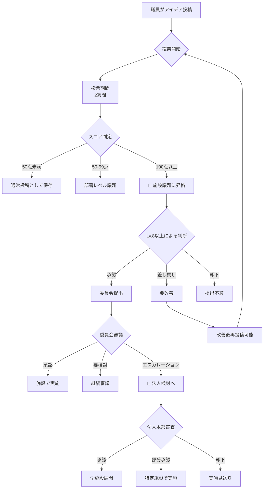

# アイデアボイス投稿から法人検討までの完全プロセス

**作成日**: 2025年9月28日
**対象**: 全職員・管理職
**システム**: VoiceDrive アイデアボイス機能

---

## 📋 目次

1. [システム概要](#1-システム概要)
2. [プロセスフロー](#2-プロセスフロー)
3. [権限レベル別の役割](#3-権限レベル別の役割)
4. [投票制度の詳細](#4-投票制度の詳細)
5. [閲覧・コメント権限](#5-閲覧コメント権限)
6. [各段階の詳細説明](#6-各段階の詳細説明)
7. [実例シナリオ](#7-実例シナリオ)

---

## 1. システム概要

### 1.1 アイデアボイスとは
職員の改善提案や革新的なアイデアを組織全体で評価し、優れた提案を実際の施策として実現するためのデジタル民主主義システムです。

### 1.2 特徴
- **透明性**: すべての投票と評価プロセスが可視化
- **公平性**: 権限レベルに応じた適切な重み付け
- **実効性**: 明確な基準による委員会提出と実施

### 1.3 基本的な流れ
```
投稿 → 投票 → 施設議題(100点) → 委員会審査 → 実施または法人検討
```

---

## 2. プロセスフロー

### 📊 完全プロセス図



---

## 3. 権限レベル別の役割

### 3.1 権限レベル一覧と責任範囲

| レベル | 役職 | 投稿 | 投票 | コメント | 判断権限 | 閲覧範囲 |
|--------|------|------|------|----------|----------|----------|
| **Lv.1** | 一般職員 | ✅ | ✅ | ✅ | - | 同部署 |
| **Lv.2** | チーフ・主任 | ✅ | ✅ | ✅ | - | 同部署+関連部署 |
| **Lv.3** | 係長・マネージャー | ✅ | ✅ | ✅ | 部署議題の推薦 | 同施設全体 |
| **Lv.4** | 課長 | ✅ | ✅ | ✅ | 部署議題の承認 | 同施設全体 |
| **Lv.5** | 統括・企画 | ✅ | ✅ | ✅ | 施設間調整 | 全施設 |
| **Lv.6** | 部長代理 | ✅ | ✅ | ✅ | 予算仮承認 | 全施設 |
| **Lv.7** | 部長 | ✅ | ✅ | ✅ | 予算承認 | 全施設 |
| **Lv.8** | 事業部長 | ✅ | ✅ | ✅ | 🔴 **委員会提出判断** | 全施設 |
| **Lv.9** | 統括部長 | ✅ | ✅ | ✅ | 委員会提出判断 | 全施設 |
| **Lv.10** | 施設長代理 | ✅ | ✅ | ✅ | 委員会運営 | 全施設 |
| **Lv.11** | 副施設長 | ✅ | ✅ | ✅ | 委員会決定 | 全施設 |
| **Lv.12** | 施設長 | ✅ | ✅ | ✅ | 法人提出判断 | 全施設 |
| **Lv.13** | 理事長・院長 | ✅ | ✅ | ✅ | 最終決定 | 全施設 |

### 3.2 重要な権限の境界線

#### 🔴 レベル8以上：委員会提出権限
- 100点以上の施設議題を委員会へ提出するか判断
- 差し戻しや却下の権限も保有
- 提出先委員会の選定

#### 🔵 レベル12以上：法人エスカレーション権限
- 委員会決定事項を法人本部へ上申
- 全施設展開の推薦

---

## 4. 投票制度の詳細

### 4.1 投票の種類と配点

| 投票タイプ | アイコン | 基本ポイント | 意味 |
|------------|---------|--------------|------|
| 強く賛成 | 😍 | 10ポイント | 素晴らしい提案、即実施すべき |
| 賛成 | 😊 | 5ポイント | 良い提案、実施を支持 |
| 中立 | 😐 | 2ポイント | 判断保留、更なる検討が必要 |
| 反対 | 😕 | 1ポイント | 現状では問題あり |
| 強く反対 | 😠 | 0.5ポイント | 実施すべきでない |

### 4.2 投票の重み付け計算

#### 計算式
```
最終スコア = 基本ポイント × 職種係数 × 権限係数 × 経験年数係数
```

#### 職種係数
```
医師: 3.0
看護師・薬剤師: 2.5
准看護師・介護福祉士・リハビリ職: 2.0
看護補助者・介護士: 1.5
事務職員: 1.0
```

#### 権限係数
```
Lv.1-2: 1.0
Lv.3-4: 1.5
Lv.5-6: 2.0
Lv.7-8: 3.0
Lv.9-10: 4.0
Lv.11-12: 5.0
Lv.13: 10.0
```

#### 経験年数係数
```
0-4年: 1.0
5-9年: 1.1
10-14年: 1.2
15-19年: 1.3
20年以上: 1.5
```

### 4.3 スコア閾値と議題レベル

| スコア | レベル | 次のアクション | 決定権者 |
|--------|--------|---------------|----------|
| 0-49点 | 通常投稿 | アーカイブ保存 | - |
| 50-99点 | 部署議題 | 部署内で検討 | 課長(Lv.4) |
| **100-299点** | **施設議題** | **委員会提出検討** | **事業部長(Lv.8)** |
| 300-599点 | 重要施設議題 | 優先的に委員会審議 | 統括部長(Lv.9) |
| 600点以上 | 法人候補議題 | 法人検討を前提に審議 | 施設長(Lv.12) |

---

## 5. 閲覧・コメント権限

### 5.1 投稿の公開範囲

#### カテゴリー別の初期公開範囲

| カテゴリー | 初期公開範囲 | 拡大条件 |
|------------|------------|----------|
| 業務改善 | 同部署 | 50点で同施設、100点で全施設 |
| 患者サービス | 同施設 | 100点で全施設 |
| 働き方改革 | 同部署 | 部署長承認で同施設 |
| イノベーション | 全施設 | 初めから全施設公開 |
| 経営戦略 | Lv.5以上 | 施設長承認で全職員 |
| コンプライアンス | Lv.7以上 | 委員会決定で公開 |

### 5.2 コメント権限

#### コメントの種類と権限

| コメント種別 | 可能な職員 | 表示 |
|--------------|-----------|------|
| 一般コメント | 閲覧権限を持つ全員 | 実名表示 |
| 専門的助言 | 関連部署の専門職 | 職種・部署付き表示 |
| 公式見解 | Lv.8以上 | 「管理職見解」タグ付き |
| 判断理由 | 判断権限者のみ | 「公式判断」タグ付き |

### 5.3 匿名性の扱い

- **投稿**: 実名（所属・職種は表示）
- **投票**: 匿名（集計結果のみ表示）
- **コメント**: 実名（建設的な議論のため）
- **判断**: 実名（責任の明確化）

---

## 6. 各段階の詳細説明

### 6.1 投稿段階

#### 投稿時の必須項目
1. **タイトル**: 30文字以内で要約
2. **カテゴリー**: 6つから選択
3. **現状の課題**: 具体的な問題点
4. **改善提案**: 実現可能な解決策
5. **期待効果**: 定量的・定性的な効果
6. **必要リソース**: 人員・予算・期間の概算

#### 投稿のコツ
- データや事例を含める
- 実現可能性を考慮
- 影響範囲を明確に
- 段階的な実施計画を提示

### 6.2 投票段階（2週間）

#### 1週目：初期評価期間
- 同部署職員による評価
- 専門的な観点からのコメント
- 提案者による補足説明

#### 2週目：拡大評価期間
- 他部署への公開（50点到達時）
- 管理職による評価
- 最終調整とブラッシュアップ

### 6.3 施設議題昇格（100点到達）

#### 自動通知
- Lv.8以上の管理職全員に通知
- 関連委員会の事務局に通知
- 投稿者に昇格通知

#### 72時間以内の初期判断
- 緊急性の評価
- 委員会マッピング
- 追加情報の要請

### 6.4 委員会提出判断（Lv.8以上）

#### 判断の選択肢

##### ✅ 承認（委員会提出）
- 提出先委員会の選定
- 議題資料の作成指示
- 審議日程の調整

##### 🔄 差し戻し（要改善）
- 具体的な改善点の指摘
- 再投稿への助言
- メンター職員の指定

##### ❌ 却下（提出不適）
- 却下理由の明記
- 代替案の提示
- 今後の方向性助言

### 6.5 委員会審議

#### 審議プロセス
1. **事前資料配布**: 1週間前
2. **当事者ヒアリング**: 必要に応じて
3. **審議**: 月次定例会議
4. **決定**: 多数決または委員長決定

#### 決定の種類

##### 🎯 実施決定
- 実施責任者の任命
- 予算配分
- 実施スケジュール策定
- KPI設定

##### 🔄 継続審議
- 追加調査の指示
- ワーキンググループ設置
- 次回審議日の設定

##### ⬆️ 法人エスカレーション
- 他施設への影響評価
- 法人本部への提出資料作成
- 全施設展開の提案

### 6.6 法人検討（エスカレーション案件）

#### 法人本部での検討プロセス

##### 事前評価（2週間）
- 全施設の意見収集
- 費用対効果分析
- リスク評価
- 法的確認

##### 経営会議での審議
- 月次経営会議で審議
- 各施設長の意見聴取
- 財務影響の評価

##### 最終決定
- **全施設展開**: 標準化して導入
- **選択的導入**: 希望施設のみ
- **パイロット実施**: 特定施設で試行
- **却下**: 実施見送り

---

## 7. 実例シナリオ

### 📌 ケース1: 業務改善提案の成功例

#### 投稿内容
**タイトル**: 「薬剤部の在庫管理システム自動化提案」
**投稿者**: 薬剤師（Lv.2、勤続8年）

#### プロセス経過
```
Day 1: 投稿
- 初期スコア: 15点（同部署3名が即賛成）

Day 3: 部署内共感
- スコア: 48点（薬剤部全員が投票）

Day 5: 施設公開
- スコア: 52点（50点突破で施設公開）

Day 8: 管理職注目
- スコア: 89点（看護部長が強く賛成）

Day 12: 施設議題到達
- スコア: 112点（事務長が賛成で100点突破）

Day 14: 投票終了
- 最終スコア: 128点
```

#### 委員会提出判断
- **判断者**: 事業部長（Lv.8）
- **決定**: 承認
- **提出先**: 病院機能向上委員会、業務負担軽減委員会

#### 委員会決定
- **結果**: 実施承認
- **予算**: 150万円
- **期間**: 6ヶ月
- **効果測定**: 在庫回転率20%改善目標

### 📌 ケース2: 法人検討への発展例

#### 投稿内容
**タイトル**: 「全施設共通の職員健康管理アプリ導入」
**投稿者**: 産業保健師（Lv.3、勤続12年）

#### 特徴的な経過
- 初日で200点突破（全施設の保健職が賛成）
- 1週間で500点到達（経営層も高評価）
- 最終: 680点（法人候補議題レベル）

#### 委員会から法人へ
- **労働衛生委員会**: 全施設展開を推奨
- **施設長判断**: 法人本部へエスカレーション
- **法人決定**: 全3施設で統一導入決定

---

## 8. よくある質問

### Q1: 投票は変更できますか？
**A**: 投票期間中は1回だけ変更可能です。ただし、最初の投票から24時間は変更できません。

### Q2: 却下された提案は再投稿できますか？
**A**: 差し戻しの場合は改善後に再投稿可能です。却下の場合は3ヶ月後に大幅な改善を加えて再投稿できます。

### Q3: 匿名での投稿はできますか？
**A**: コンプライアンス案件を除き、原則実名投稿です。内部告発等は別途コンプライアンス窓口をご利用ください。

### Q4: 他施設の職員も投票できますか？
**A**: 施設議題（100点）に到達し、全施設公開となった場合は可能です。

### Q5: 委員会審議の結果はどこで確認できますか？
**A**: VoiceDriveシステム上でリアルタイムに更新されます。また、月次の委員会議事録でも確認できます。

---

## 9. 成功のためのヒント

### 💡 投稿者へのアドバイス
1. **具体的なデータを示す**: 数値や事例で説得力UP
2. **小さく始める提案**: 段階的実施で実現可能性UP
3. **関係部署と事前調整**: 投票前の根回しで支持獲得
4. **コメントに真摯に対応**: 建設的な議論で提案改善

### 💡 投票者へのアドバイス
1. **早めの投票**: 初期の勢いが重要
2. **コメントを添える**: 賛成理由を明確に
3. **部署を超えた視点**: 組織全体への影響を考慮
4. **建設的な反対**: 単なる否定ではなく代替案を

### 💡 管理職へのアドバイス
1. **迅速な判断**: 72時間以内の初期対応
2. **透明な理由説明**: 判断根拠を明確に
3. **育成の視点**: 若手の提案を育てる姿勢
4. **横断的な調整**: 部署間連携を促進

---

## 10. お問い合わせ

### システムに関する質問
- **VoiceDrive管理者**: admin@voicedrive.com
- **内線**: 5555
- **Slack**: #voicedrive-support

### 委員会に関する質問
- **各委員会事務局**: 別紙参照
- **総務部企画課**: 内線3333

### 研修・説明会
- 毎月第2火曜日 15:00-16:00
- オンライン参加可能
- 録画視聴あり

---

## 付録

### A. 委員会一覧と担当領域

| 委員会名 | 担当領域 | 開催頻度 |
|----------|---------|----------|
| 医療安全管理委員会 | インシデント、医療事故防止 | 月1回 |
| 院内感染対策委員会 | 感染予防、対策 | 月1回 |
| 診療録管理委員会 | カルテ、記録 | 隔月 |
| 病院機能向上委員会 | 業務効率、品質向上 | 月1回 |
| 看護業務改善委員会 | 看護業務全般 | 月1回 |
| 業務負担軽減委員会 | 働き方改革、負担軽減 | 月1回 |
| 患者サービス向上委員会 | 患者満足度、サービス | 月1回 |
| 労働衛生委員会 | 職員健康、労働環境 | 月1回 |
| 福利厚生委員会 | 職員福利厚生 | 隔月 |
| 病院運営委員会 | 経営、戦略 | 月2回 |

### B. 権限レベル詳細定義

[別紙: 18段階権限レベル詳細一覧.md 参照]

### C. 投票重み付け計算例

#### 例1: ベテラン看護師
- 基本投票: 賛成（5ポイント）
- 職種係数: 2.5（看護師）
- 権限係数: 1.0（Lv.1）
- 経験係数: 1.3（勤続15年）
- **最終: 5 × 2.5 × 1.0 × 1.3 = 16.25ポイント**

#### 例2: 若手医師
- 基本投票: 強く賛成（10ポイント）
- 職種係数: 3.0（医師）
- 権限係数: 1.0（Lv.2）
- 経験係数: 1.0（勤続3年）
- **最終: 10 × 3.0 × 1.0 × 1.0 = 30ポイント**

#### 例3: 事業部長
- 基本投票: 賛成（5ポイント）
- 職種係数: 1.0（事務職）
- 権限係数: 3.0（Lv.8）
- 経験係数: 1.5（勤続25年）
- **最終: 5 × 1.0 × 3.0 × 1.5 = 22.5ポイント**

---

**文書管理番号**: VD-IDEA-PROCESS-001
**最終更新日**: 2025年9月28日
**次回レビュー**: 2025年12月28日

---

*本文書は定期的に更新されます。最新版はVoiceDriveシステム内でご確認ください。*