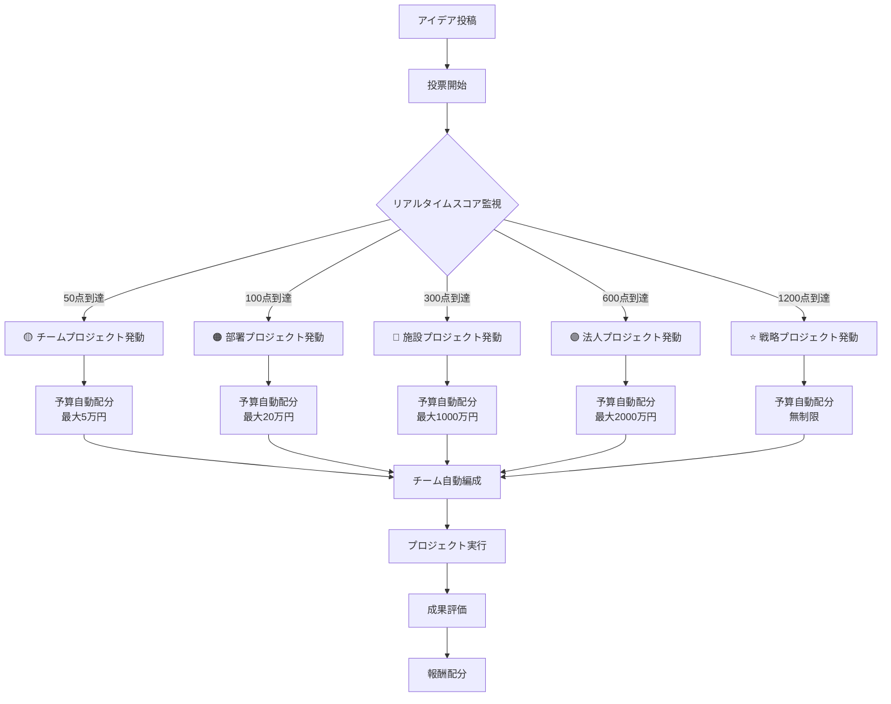

# アイデアボイス投稿から自動プロジェクト化までの完全システム（将来版）

**作成日**: 2025年9月28日
**システムステータス**: 将来実装予定（Phase 5以降）
**現在の運用**: 委員会提出方式を採用中

---

## 🚀 はじめに

本文書は、VoiceDriveの将来構想である「**自動プロジェクト化システム**」について説明します。
現在は組織の成熟度を考慮し、既存の委員会体制を活用した方式を採用していますが、組織が十分に活性化した段階で、より革新的な自動プロジェクト化システムへの移行を予定しています。

### 現在と将来の比較

| 項目 | 現在（委員会方式） | 将来（プロジェクト化） |
|------|-------------------|---------------------|
| 100点到達時 | 委員会への議題提出 | 自動的にプロジェクト化 |
| 意思決定 | 委員会での審議 | 承認権限者の即断 |
| 予算配分 | 委員会で決定 | スコアに応じて自動配分 |
| チーム編成 | 委員会が指名 | 志願者から自動編成 |
| 実行速度 | 月次会議後 | 即座に開始可能 |

---

## 📋 目次

1. [システム概要](#1-システム概要)
2. [プロジェクト化の仕組み](#2-プロジェクト化の仕組み)
3. [プロジェクトレベルと予算](#3-プロジェクトレベルと予算)
4. [自動チーム編成システム](#4-自動チーム編成システム)
5. [プロジェクト実行プロセス](#5-プロジェクト実行プロセス)
6. [成果評価と報酬制度](#6-成果評価と報酬制度)
7. [移行計画](#7-移行計画)

---

## 1. システム概要

### 1.1 自動プロジェクト化とは
投票スコアが一定の閾値を超えた瞬間に、提案が自動的にプロジェクトとして承認され、予算が配分され、チームが編成される革新的なシステムです。

### 1.2 特徴
- **即座の実行**: 閾値到達と同時にプロジェクト開始
- **自動予算配分**: スコアに応じた予算の自動割り当て
- **志願制チーム**: やりたい人が集まるチーム編成
- **成果連動報酬**: 成功度に応じたインセンティブ

### 1.3 必要な組織条件
- 提案文化の定着（月間50件以上の投稿）
- 投票参加率60%以上
- 管理職の理解度80%以上
- 成功事例10件以上

---

## 2. プロジェクト化の仕組み

### 2.1 自動プロジェクト化フロー



### 2.2 スコアとプロジェクトの関係

#### リアルタイム昇格システム
```
0点 → 投稿開始
↓ （投票が集まる）
50点 → 💡 チームプロジェクトに昇格！
↓ （さらに投票）
100点 → 🏢 部署プロジェクトに昇格！
↓ （部署を超えた支持）
300点 → 🏥 施設プロジェクトに昇格！
↓ （施設全体の支持）
600点 → 🏢 法人プロジェクトに昇格！
↓ （全施設の支持）
1200点 → ⭐ 戦略プロジェクトに昇格！
```

---

## 3. プロジェクトレベルと予算

### 3.1 プロジェクトレベル詳細

| レベル | 必要スコア | 予算範囲 | 期間 | チーム規模 | 決裁権限 |
|--------|-----------|----------|------|------------|----------|
| **チーム** | 50-99点 | 1-5万円 | 1ヶ月 | 3-5名 | Lv.2（主任） |
| **部署** | 100-299点 | 5-20万円 | 3ヶ月 | 5-10名 | Lv.3（係長） |
| **施設** | 300-599点 | 20-1000万円 | 6ヶ月 | 10-20名 | Lv.4（課長） |
| **法人** | 600-1199点 | 100-2000万円 | 12ヶ月 | 20-50名 | Lv.5（統括） |
| **戦略** | 1200点以上 | 無制限 | 無期限 | 無制限 | Lv.13（理事長） |

### 3.2 予算配分の計算式

```
配分予算 = 基礎予算 × スコア係数 × 緊急度係数 × 実績係数
```

#### 基礎予算
- チーム: 1万円
- 部署: 5万円
- 施設: 100万円
- 法人: 500万円
- 戦略: 1000万円

#### スコア係数
```
スコア係数 = 実際のスコア ÷ 必要最低スコア
（例：150点の部署プロジェクト = 150 ÷ 100 = 1.5倍）
```

#### 緊急度係数
- 緊急: 1.5倍
- 通常: 1.0倍
- 長期: 0.8倍

#### 実績係数（提案者の過去の成功率）
- 成功率80%以上: 1.2倍
- 成功率60-79%: 1.0倍
- 成功率60%未満: 0.8倍
- 初回提案: 1.0倍

### 3.3 予算使用ルール

#### 使用可能な項目
✅ 人件費（プロジェクトメンバーの時間外手当）
✅ 物品購入（機器、ソフトウェア、消耗品）
✅ 外注費（専門家への相談、開発委託）
✅ 研修費（必要なスキル習得）
✅ 実証実験費

#### 使用不可な項目
❌ 通常業務の経費
❌ 個人的な報酬
❌ 他プロジェクトへの流用
❌ 接待費

---

## 4. 自動チーム編成システム

### 4.1 チーム編成の流れ

#### Step 1: 志願者募集（24時間）
```javascript
// プロジェクト化通知
{
  "title": "新プロジェクト始動！",
  "project": "薬剤部在庫管理システム",
  "level": "部署プロジェクト",
  "budget": "15万円",
  "required_skills": ["Excel", "在庫管理", "システム設計"],
  "deadline": "24時間後"
}
```

#### Step 2: 自動マッチング
```
必須メンバー:
- プロジェクトリーダー（提案者 or 指名）
- スポンサー（承認権限者）
- 専門家（必要スキル保有者）

追加メンバー:
- 志願者から自動選定
- スキルマッチ度
- 稼働可能時間
- 過去の実績
```

#### Step 3: チーム確定
```
最小構成:
- チーム: 3名
- 部署: 5名
- 施設: 10名
- 法人: 20名
```

### 4.2 役割分担

| 役割 | 責任 | 必要レベル | 工数配分 |
|------|------|-----------|----------|
| **プロジェクトオーナー** | 最終責任・成果 | 提案者 | 30% |
| **プロジェクトマネージャー** | 進捗管理・調整 | Lv.2以上 | 20% |
| **テクニカルリード** | 技術的判断 | 専門職 | 20% |
| **メンバー** | 実作業 | 全レベル | 10% |
| **アドバイザー** | 助言・支援 | Lv.5以上 | 5% |

### 4.3 工数管理

#### 業務時間内での活動
- チーム: 週2時間まで
- 部署: 週4時間まで
- 施設: 週8時間まで
- 法人: 週16時間まで
- 戦略: フルタイム可能

#### 時間外活動の扱い
- 自主的な活動は手当支給
- プロジェクト予算から支出
- 成果連動ボーナスあり

---

## 5. プロジェクト実行プロセス

### 5.1 キックオフ（プロジェクト開始）

#### 自動生成される文書
1. **プロジェクト憲章**
   - ミッション
   - スコープ
   - 成功基準
   - 制約事項

2. **実行計画書**
   - マイルストーン
   - タスク分解
   - リスク分析
   - 予算配分

3. **コミュニケーション計画**
   - 報告頻度
   - ステークホルダー
   - エスカレーション

### 5.2 実行フェーズ

#### 週次サイクル
```
月曜: 週次計画会議（30分）
↓
火-木: 実作業
↓
金曜: 進捗報告（システム自動生成）
↓
土日: 自主活動（任意）
```

#### 進捗の可視化
```typescript
interface ProjectDashboard {
  completion: number;        // 完了率 (%)
  budget_usage: number;      // 予算消化率 (%)
  timeline: number;          // 期限までの日数
  risks: Risk[];            // 顕在化リスク
  blockers: Issue[];        // 阻害要因
  next_milestone: string;    // 次のマイルストーン
}
```

### 5.3 品質管理

#### ゲートレビュー
| タイミング | レビュー内容 | 承認者 |
|-----------|-------------|--------|
| 25%完了時 | 方向性確認 | スポンサー |
| 50%完了時 | 中間成果 | 承認権限者 |
| 75%完了時 | 最終調整 | ステークホルダー |
| 100%完了時 | 最終承認 | 経営層 |

#### 品質基準
- 成果物の完成度
- ステークホルダー満足度
- 予算遵守率
- スケジュール遵守率
- リスク管理状況

---

## 6. 成果評価と報酬制度

### 6.1 成果評価基準

#### 定量評価（60%）
| 項目 | 配点 | 測定方法 |
|------|------|----------|
| 目標達成度 | 30% | KPI達成率 |
| ROI（投資対効果） | 15% | 効果金額÷投資額 |
| 期限遵守 | 10% | 予定との差異 |
| 予算遵守 | 5% | 予算との差異 |

#### 定性評価（40%）
| 項目 | 配点 | 評価者 |
|------|------|--------|
| イノベーション性 | 10% | イノベーション委員会 |
| 組織への影響 | 10% | 経営層 |
| 横展開可能性 | 10% | 他部署責任者 |
| チームワーク | 10% | メンバー相互評価 |

### 6.2 報酬制度

#### 基本報酬
```
基本報酬 = プロジェクト予算 × 10% × 個人貢献度
```

#### 成功報酬
| 評価ランク | 倍率 | 条件 |
|-----------|------|------|
| S（卓越） | 3.0倍 | 評価90%以上 |
| A（優秀） | 2.0倍 | 評価80-89% |
| B（良好） | 1.5倍 | 評価70-79% |
| C（標準） | 1.0倍 | 評価60-69% |
| D（要改善） | 0.5倍 | 評価60%未満 |

#### 報酬配分例
```
プロジェクト予算: 100万円
基本報酬枠: 10万円

【Aランク達成時】
- オーナー（貢献30%）: 3万円 × 2.0 = 6万円
- PM（貢献20%）: 2万円 × 2.0 = 4万円
- メンバー（貢献10%）: 1万円 × 2.0 = 2万円
```

### 6.3 非金銭的報酬

#### キャリアポイント
- プロジェクト完了: 10pt
- S評価獲得: +20pt
- A評価獲得: +10pt

#### 特典
- 100pt: 次回提案の優先権
- 200pt: 研修受講権
- 500pt: 人事評価加点
- 1000pt: 昇進推薦

---

## 7. 移行計画

### 7.1 段階的導入スケジュール

#### Phase 1: 現在（委員会方式）
**期間**: 2025年9月〜2026年3月
- 委員会での議題審議
- 投票文化の醸成
- 成功事例の蓄積

#### Phase 2: 試験導入
**期間**: 2026年4月〜9月
- 一部部署でパイロット実施
- チームレベル（50点）のみ自動化
- フィードバック収集

#### Phase 3: 部分導入
**期間**: 2026年10月〜2027年3月
- 部署レベル（100点）まで自動化
- 予算配分ルールの検証
- チーム編成の最適化

#### Phase 4: 本格導入
**期間**: 2027年4月〜
- 全レベルで自動化
- 成果連動報酬の開始
- 横展開の推進

#### Phase 5: 完全移行
**期間**: 2027年10月〜
- 委員会方式の廃止
- 完全自動化システム
- AIによる最適化

### 7.2 移行の判断基準

#### 必須条件（すべて満たす）
- [ ] 月間投稿数50件以上が3ヶ月連続
- [ ] 投票参加率60%以上
- [ ] プロジェクト成功率70%以上
- [ ] 管理職の支持率80%以上

#### 望ましい条件
- [ ] 他施設からの見学依頼
- [ ] メディア掲載実績
- [ ] 職員満足度向上
- [ ] 離職率の低下

### 7.3 リスクと対策

| リスク | 影響度 | 対策 |
|--------|-------|------|
| 予算の濫用 | 高 | 段階的な権限付与、監査機能 |
| 品質の低下 | 中 | ゲートレビュー、品質基準 |
| 本業への影響 | 高 | 工数上限設定、優先順位 |
| 不公平感 | 中 | 透明な評価、相互レビュー |

---

## 8. システムの利点と課題

### 8.1 期待される利点

#### 組織にとって
- **イノベーション加速**: アイデアの即実行
- **エンゲージメント向上**: 職員の主体性
- **コスト削減**: 改善による効率化
- **ブランド向上**: 先進的な組織イメージ

#### 職員にとって
- **自己実現**: アイデアの具現化
- **スキルアップ**: プロジェクト経験
- **収入増**: 成果報酬
- **キャリア形成**: 実績の蓄積

### 8.2 想定される課題

#### 技術的課題
- システムの複雑性
- 自動化の限界
- セキュリティリスク

#### 組織的課題
- 文化の変革抵抗
- 権限の再定義
- 評価の公平性

#### 解決アプローチ
- 段階的導入による学習
- 継続的な改善
- フィードバックループ
- 外部専門家の活用

---

## 9. 成功事例シミュレーション

### 📌 ケース1: 小規模改善の迅速実行

**提案**: 「職員休憩室にコーヒーマシン設置」
```
Day 1: 投稿（事務職員）
Day 2: 50点到達 → チームプロジェクト自動発動
Day 3: 予算3万円配分、3名チーム結成
Day 7: 機種選定完了
Day 14: 設置完了
Day 21: 満足度調査実施
Day 30: プロジェクト完了、報酬配分
```
**成果**: 職員満足度15%向上、休憩時間の有効活用

### 📌 ケース2: 大規模システム改革

**提案**: 「AI診療支援システム導入」
```
Day 1: 投稿（医師）
Day 3: 300点到達 → 施設プロジェクト
Day 7: 600点到達 → 法人プロジェクト
Day 14: 1200点到達 → 戦略プロジェクト
Day 15: 予算5000万円配分、50名体制
Month 3: プロトタイプ完成
Month 6: パイロット運用
Month 12: 全施設展開
```
**成果**: 診断精度20%向上、医師業務負担30%削減

---

## 10. よくある質問（FAQ）

### Q1: プロジェクトが失敗したらペナルティはありますか？
**A**: 基本的にペナルティはありません。失敗も学習機会と考えます。ただし、3回連続で失敗した場合は、一定期間プロジェクトオーナーになれません。

### Q2: 本業が忙しくてプロジェクトに参加できません
**A**: 参加は任意です。また、アドバイザーとして限定的に関わることも可能です（週1時間程度）。

### Q3: 予算が足りなくなったらどうなりますか？
**A**: 追加投票で支持を集めれば、追加予算の配分が可能です。ただし、当初予算の150%が上限です。

### Q4: 他施設の職員も参加できますか？
**A**: 法人プロジェクト（600点）以上であれば、全施設から参加可能です。

### Q5: プロジェクトの知的財産権は誰のものですか？
**A**: 基本的に法人に帰属しますが、特許等の場合は発明者にも報奨金が支払われます。

---

## 11. 準備チェックリスト

### 個人の準備
- [ ] プロジェクトマネジメント基礎研修受講
- [ ] システム操作研修受講
- [ ] アイデア創出ワークショップ参加
- [ ] 投票への積極参加

### 組織の準備
- [ ] 就業規則の改定
- [ ] 予算管理システムの構築
- [ ] 評価制度の見直し
- [ ] 研修プログラムの整備

### システムの準備
- [ ] 自動化プラットフォーム構築
- [ ] API連携開発
- [ ] セキュリティ強化
- [ ] バックアップ体制

---

## 12. 未来への展望

### 2030年の姿
- **完全AI化**: 提案の実現可能性をAIが事前評価
- **グローバル展開**: 世界中の医療機関との連携
- **起業支援**: 優秀なプロジェクトのスピンオフ支援
- **社会実装**: 医療業界全体への波及

### メッセージ
```
「すべての職員がイノベーターになれる組織へ」

一人ひとりのアイデアが、
組織を変え、医療を変え、社会を変える。

そんな未来を、VoiceDriveで実現します。
```

---

## 付録

### A. 投票重み付け早見表

| 職種 | Lv.1 | Lv.2 | Lv.3 | Lv.4 | Lv.5 |
|------|------|------|------|------|------|
| 医師 | 3.0 | 4.5 | 6.0 | 7.5 | 9.0 |
| 看護師 | 2.5 | 3.75 | 5.0 | 6.25 | 7.5 |
| 事務職 | 1.0 | 1.5 | 2.0 | 2.5 | 3.0 |

### B. プロジェクト予算シミュレーター

```javascript
function calculateBudget(score, category, urgency) {
  const baseBudget = getBaseBudget(score);
  const scoreRatio = score / getThreshold(score);
  const categoryRatio = getCategoryRatio(category);
  const urgencyRatio = getUrgencyRatio(urgency);

  return baseBudget * scoreRatio * categoryRatio * urgencyRatio;
}

// 使用例
calculateBudget(150, '業務改善', '緊急');
// => 112,500円（基礎5万 × 1.5 × 1.0 × 1.5）
```

### C. 関連資料
- [現行版] アイデアボイス投稿から法人検討までの完全プロセス.md
- [参考] 18段階権限レベル詳細一覧.md
- [計画] Phase5_プロジェクト化システム導入計画.md

---

**文書管理番号**: VD-PROJECT-FUTURE-001
**機密レベル**: 内部限定
**最終更新**: 2025年9月28日
**次回レビュー**: 2026年3月31日

---

*本システムは組織の成熟度に応じて段階的に導入される予定です。*
*現在は委員会方式で運用中ですが、将来の完全自動化を目指して準備を進めています。*