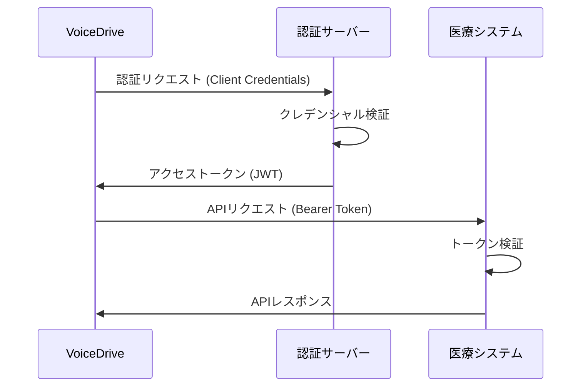

# コンプライアンス窓口 API仕様書

## 📅 作成日：2025年9月24日
## 📌 文書番号：API-COMP-SPEC-001
## 🔄 バージョン：1.0.0
## 🎯 対象システム：VoiceDrive ⇔ 医療職員管理システム

---

## 1. 概要

### 1.1 目的
本文書は、VoiceDriveシステムと医療職員管理システム間のコンプライアンス窓口機能に関するAPI仕様を定義します。

### 1.2 スコープ
- 通報データの送受信
- ステータス管理
- 進捗確認
- セキュリティ要件

### 1.3 API基本情報

| 項目 | 内容 |
|------|------|
| プロトコル | HTTPS (TLS 1.3) |
| データ形式 | JSON |
| 文字コード | UTF-8 |
| 認証方式 | Bearer Token (JWT RS256) |
| タイムゾーン | UTC (ISO 8601) |
| APIバージョン | v3 |

---

## 2. 認証とセキュリティ

### 2.1 認証フロー



### 2.2 JWT構造

```json
{
  "header": {
    "alg": "RS256",
    "typ": "JWT",
    "kid": "2025-09-key-01"
  },
  "payload": {
    "iss": "https://auth.medical-system.jp",
    "sub": "voicedrive-compliance-client",
    "aud": "https://api.medical-system.jp",
    "exp": 1727123456,
    "iat": 1727119856,
    "jti": "550e8400-e29b-41d4-a716-446655440000",
    "scope": "compliance:write compliance:read",
    "client_id": "voicedrive-prod-001"
  },
  "signature": "..."
}
```

### 2.3 セキュリティヘッダー

**必須ヘッダー：**

```http
Authorization: Bearer {jwt_token}
X-Request-ID: {uuid_v4}
X-Timestamp: {iso_8601_timestamp}
X-Client-Version: 1.0.0
Content-Type: application/json
Accept: application/json
```

**セキュリティヘッダー（レスポンス）：**

```http
X-Content-Type-Options: nosniff
X-Frame-Options: DENY
X-XSS-Protection: 1; mode=block
Strict-Transport-Security: max-age=31536000; includeSubDomains
Content-Security-Policy: default-src 'none'
```

---

## 3. エンドポイント一覧

### 3.1 基本URL

| 環境 | URL |
|------|-----|
| 開発 | `https://api-dev.medical-system.jp/v3` |
| ステージング | `https://api-stg.medical-system.jp/v3` |
| 本番 | `https://api.medical-system.jp/v3` |

### 3.2 エンドポイント概要

| メソッド | パス | 説明 | 認証 |
|---------|------|------|------|
| POST | `/compliance/receive` | 通報受信 | 必須 |
| GET | `/compliance/status/{anonymousId}` | 進捗確認 | 必須 |
| POST | `/compliance/additional-info` | 追加情報送信 | 必須 |
| GET | `/compliance/categories` | カテゴリ一覧取得 | 必須 |
| POST | `/webhooks/register` | Webhook登録 | 必須 |
| DELETE | `/webhooks/{webhookId}` | Webhook削除 | 必須 |

---

## 4. API詳細仕様

### 4.1 通報受信API

#### `POST /compliance/receive`

**概要：** VoiceDriveから暗号化された通報データを受信し、医療システムに登録

**リクエスト：**

```typescript
interface ComplianceReceiveRequest {
  // メタデータ（暗号化なし）
  version: "1.0";
  source: "voicedrive";
  timestamp: string;  // ISO 8601

  // 暗号化ペイロード
  payload: {
    encrypted: string;    // Base64エンコードされた暗号文
    iv: string;          // 初期化ベクトル (hex)
    authTag: string;     // 認証タグ (hex)
    algorithm: "aes-256-gcm";
  };

  // 検証用
  checksum: string;      // SHA-256 (hex)

  // 緊急度情報（即座の振り分け用）
  metadata: {
    reportId: string;    // VD-2025-XXXX
    anonymousId: string; // ANON-XXXXXX
    severity: "low" | "medium" | "high" | "critical";
    category: string;
    requiresImmediateAction: boolean;
  };
}
```

**暗号化前のペイロード構造：**

```typescript
interface DecryptedPayload {
  report: {
    reportId: string;
    anonymousId: string;
    submittedAt: string;

    // 通報者情報
    reporter: {
      disclosureLevel: "full_anonymous" | "conditional" | "disclosed";
      consentToDisclose?: {
        granted: boolean;
        conditions?: string[];
      };
      attributes?: {
        employmentType?: string;
        yearsOfService?: string;
        ageGroup?: string;
        gender?: string;
      };
    };

    // カテゴリ
    category: {
      main: string;
      sub?: string;
      details?: {
        harassmentType?: string;
        violationType?: string;
      };
    };

    // 事案詳細
    incident: {
      description: string;
      location: {
        general: string;
        specific?: string;
      };
      timeline: {
        occurredAt?: string;
        startedAt?: string;
        frequency?: string;
        isOngoing: boolean;
      };
      accused?: {
        count: number;
        relationship: string;
        position?: string;
      };
    };

    // 証拠
    evidence: {
      hasEvidence: boolean;
      types: string[];
      files: Array<{
        id: string;
        fileName: string;
        mimeType: string;
        size: number;
        checksum: string;
        encryptedUrl: string;
      }>;
      witnessCount?: number;
    };

    // 緊急度評価
    assessment: {
      severity: string;
      urgencyScore: number;
      riskFactors: string[];
      requiresImmediateAction: boolean;
    };
  };
}
```

**レスポンス（成功 200）：**

```json
{
  "success": true,
  "caseNumber": "MED-2025-0001",
  "acknowledgementId": "ack-550e8400-e29b-41d4",
  "receivedAt": "2025-09-24T10:30:00Z",
  "message": "Report received and processing initiated",
  "estimatedResponseTime": {
    "value": 24,
    "unit": "hours"
  },
  "status": "received",
  "nextSteps": "担当者が割り当てられ次第、調査を開始します"
}
```

**レスポンス（エラー 400）：**

```json
{
  "success": false,
  "error": {
    "code": "INVALID_CHECKSUM",
    "message": "Checksum verification failed",
    "details": {
      "expected": "a665a45920422f9d417e4867efdc4fb8",
      "received": "b123c45920422f9d417e4867efdc4fb8"
    }
  },
  "requestId": "req-550e8400",
  "timestamp": "2025-09-24T10:30:00Z"
}
```

**エラーコード：**

| コード | HTTPステータス | 説明 |
|--------|---------------|------|
| INVALID_CHECKSUM | 400 | チェックサム不一致 |
| DECRYPTION_FAILED | 400 | 復号化失敗 |
| INVALID_PAYLOAD | 400 | ペイロード形式エラー |
| DUPLICATE_REPORT | 409 | 重複通報 |
| AUTHENTICATION_FAILED | 401 | 認証失敗 |
| RATE_LIMIT_EXCEEDED | 429 | レート制限超過 |
| INTERNAL_ERROR | 500 | サーバーエラー |

**実装サンプル（VoiceDrive側）：**

```typescript
// VoiceDrive側の送信実装
class ComplianceAPIClient {
  private readonly apiBase = process.env.MEDICAL_API_BASE;
  private readonly apiKey = process.env.MEDICAL_API_KEY;

  async submitReport(report: ComplianceReport): Promise<SubmissionResult> {
    // 1. ペイロードの準備
    const payload = this.preparePayload(report);

    // 2. 暗号化
    const encrypted = await this.encryptPayload(payload);

    // 3. チェックサム生成
    const checksum = this.generateChecksum(encrypted);

    // 4. リクエスト構築
    const request = {
      version: "1.0",
      source: "voicedrive",
      timestamp: new Date().toISOString(),
      payload: encrypted,
      checksum,
      metadata: {
        reportId: report.reportId,
        anonymousId: report.anonymousId,
        severity: report.assessment.severity,
        category: report.category.main,
        requiresImmediateAction: report.assessment.requiresImmediateAction
      }
    };

    // 5. API呼び出し
    const response = await fetch(`${this.apiBase}/compliance/receive`, {
      method: 'POST',
      headers: {
        'Authorization': `Bearer ${await this.getToken()}`,
        'Content-Type': 'application/json',
        'X-Request-ID': crypto.randomUUID(),
        'X-Timestamp': new Date().toISOString()
      },
      body: JSON.stringify(request)
    });

    if (!response.ok) {
      throw new APIError(await response.json());
    }

    return await response.json();
  }

  private async encryptPayload(data: any): Promise<EncryptedPayload> {
    const algorithm = 'aes-256-gcm';
    const key = Buffer.from(process.env.ENCRYPTION_KEY, 'hex');
    const iv = crypto.randomBytes(16);
    const cipher = crypto.createCipheriv(algorithm, key, iv);

    let encrypted = cipher.update(JSON.stringify(data), 'utf8', 'base64');
    encrypted += cipher.final('base64');

    return {
      encrypted,
      iv: iv.toString('hex'),
      authTag: cipher.getAuthTag().toString('hex'),
      algorithm
    };
  }
}
```

---

### 4.2 進捗確認API

#### `GET /compliance/status/{anonymousId}`

**概要：** 匿名IDを使用して通報の進捗状況を確認

**リクエスト：**

```http
GET /compliance/status/ANON-A8B9C2
Authorization: Bearer {token}
X-Request-ID: 550e8400-e29b-41d4
```

**レスポンス（成功 200）：**

```json
{
  "success": true,
  "anonymousId": "ANON-A8B9C2",
  "caseNumber": "MED-2025-0001",
  "currentStatus": {
    "code": "investigating",
    "label": "調査中",
    "description": "担当者が事実確認を行っています",
    "since": "2025-09-24T14:00:00Z"
  },
  "progress": {
    "percentage": 45,
    "phase": "事実確認",
    "estimatedCompletion": "2025-09-27T17:00:00Z"
  },
  "history": [
    {
      "status": "received",
      "timestamp": "2025-09-24T10:30:00Z",
      "note": "通報を受付しました"
    },
    {
      "status": "triaging",
      "timestamp": "2025-09-24T11:00:00Z",
      "note": "内容を確認し、担当者を割り当てています"
    },
    {
      "status": "investigating",
      "timestamp": "2025-09-24T14:00:00Z",
      "note": "調査を開始しました"
    }
  ],
  "actions": {
    "canProvideAdditionalInfo": true,
    "canWithdraw": false,
    "canViewDetails": false,
    "canContact": true
  },
  "nextSteps": "調査完了後、対応方針を決定します",
  "lastUpdated": "2025-09-24T15:30:00Z"
}
```

**レスポンス（エラー 404）：**

```json
{
  "success": false,
  "error": {
    "code": "REPORT_NOT_FOUND",
    "message": "指定された匿名IDの通報が見つかりません"
  },
  "requestId": "req-550e8400",
  "timestamp": "2025-09-24T10:30:00Z"
}
```

---

### 4.3 追加情報送信API

#### `POST /compliance/additional-info`

**概要：** 通報者が追加情報を提供

**リクエスト：**

```json
{
  "anonymousId": "ANON-A8B9C2",
  "type": "clarification",
  "content": {
    "message": "追加の詳細情報です...",
    "attachments": [
      {
        "fileName": "evidence2.pdf",
        "mimeType": "application/pdf",
        "size": 2048576,
        "encryptedUrl": "https://secure-storage/..."
      }
    ]
  },
  "submittedAt": "2025-09-25T10:00:00Z"
}
```

**レスポンス（成功 200）：**

```json
{
  "success": true,
  "message": "追加情報を受け付けました",
  "referenceId": "info-123456",
  "receivedAt": "2025-09-25T10:00:00Z"
}
```

---

### 4.4 Webhook仕様

#### ステータス更新通知

**医療システム → VoiceDrive**

**エンドポイント：** VoiceDriveが登録したURL

**リクエスト：**

```json
{
  "webhookType": "status_update",
  "timestamp": "2025-09-24T15:00:00Z",
  "signature": "sha256=...",
  "data": {
    "reportId": "VD-2025-0001",
    "caseNumber": "MED-2025-0001",
    "anonymousId": "ANON-A8B9C2",
    "previousStatus": "triaging",
    "currentStatus": "investigating",
    "changedAt": "2025-09-24T14:00:00Z",
    "changedBy": {
      "role": "investigator",
      "department": "Compliance Team"
    },
    "message": "調査を開始しました",
    "estimatedCompletion": "2025-09-27T17:00:00Z",
    "requiresAction": false
  }
}
```

**署名検証：**

```typescript
// Webhook署名の検証
function verifyWebhookSignature(
  payload: string,
  signature: string,
  secret: string
): boolean {
  const expectedSignature = crypto
    .createHmac('sha256', secret)
    .update(payload)
    .digest('hex');

  return `sha256=${expectedSignature}` === signature;
}
```

---

## 5. データ暗号化仕様

### 5.1 暗号化アルゴリズム

| 用途 | アルゴリズム | 鍵長 | モード |
|------|-------------|------|--------|
| データ暗号化 | AES | 256bit | GCM |
| 鍵交換 | RSA | 4096bit | OAEP |
| ハッシュ | SHA | 256bit | - |
| HMAC | SHA | 256bit | - |

### 5.2 暗号化実装例

```typescript
// 暗号化
function encryptData(plaintext: string, key: Buffer): EncryptedData {
  const iv = crypto.randomBytes(16);
  const cipher = crypto.createCipheriv('aes-256-gcm', key, iv);

  let encrypted = cipher.update(plaintext, 'utf8', 'base64');
  encrypted += cipher.final('base64');

  return {
    encrypted,
    iv: iv.toString('hex'),
    authTag: cipher.getAuthTag().toString('hex'),
    algorithm: 'aes-256-gcm'
  };
}

// 復号化
function decryptData(encryptedData: EncryptedData, key: Buffer): string {
  const decipher = crypto.createDecipheriv(
    'aes-256-gcm',
    key,
    Buffer.from(encryptedData.iv, 'hex')
  );

  decipher.setAuthTag(Buffer.from(encryptedData.authTag, 'hex'));

  let decrypted = decipher.update(encryptedData.encrypted, 'base64', 'utf8');
  decrypted += decipher.final('utf8');

  return decrypted;
}
```

---

## 6. レート制限

### 6.1 制限値

| エンドポイント | 制限 | ウィンドウ | 超過時の待機時間 |
|---------------|------|-----------|----------------|
| POST /compliance/receive | 100回 | 1時間 | 1時間 |
| GET /compliance/status/* | 1000回 | 1時間 | 5分 |
| POST /compliance/additional-info | 50回 | 1時間 | 30分 |
| その他 | 500回 | 1時間 | 10分 |

### 6.2 レート制限ヘッダー

```http
X-RateLimit-Limit: 100
X-RateLimit-Remaining: 95
X-RateLimit-Reset: 1727123456
```

---

## 7. エラーハンドリング

### 7.1 標準エラーレスポンス

```json
{
  "success": false,
  "error": {
    "code": "ERROR_CODE",
    "message": "Human readable error message",
    "details": {},
    "documentation": "https://docs.medical-system.jp/errors/ERROR_CODE"
  },
  "requestId": "req-uuid",
  "timestamp": "2025-09-24T10:30:00Z",
  "retryAfter": 60
}
```

### 7.2 HTTPステータスコード

| ステータス | 説明 | 対処法 |
|-----------|------|--------|
| 200 | 成功 | - |
| 400 | 不正なリクエスト | パラメータを確認 |
| 401 | 認証エラー | トークンを再取得 |
| 403 | 権限不足 | 権限を確認 |
| 404 | リソースなし | IDを確認 |
| 409 | 競合 | 重複を確認 |
| 429 | レート制限 | 待機後リトライ |
| 500 | サーバーエラー | サポートに連絡 |
| 503 | メンテナンス | 後でリトライ |

### 7.3 リトライ戦略

```typescript
// 指数バックオフでのリトライ実装
async function retryWithBackoff<T>(
  fn: () => Promise<T>,
  maxRetries: number = 3,
  baseDelay: number = 1000
): Promise<T> {
  let lastError: Error;

  for (let i = 0; i < maxRetries; i++) {
    try {
      return await fn();
    } catch (error) {
      lastError = error;

      if (!isRetryable(error)) {
        throw error;
      }

      const delay = baseDelay * Math.pow(2, i);
      const jitter = Math.random() * 1000;

      await sleep(delay + jitter);
    }
  }

  throw lastError;
}

function isRetryable(error: any): boolean {
  const retryableStatuses = [429, 500, 502, 503, 504];
  return retryableStatuses.includes(error.status);
}
```

---

## 8. テスト環境

### 8.1 テスト用エンドポイント

| 環境 | URL | 用途 |
|------|-----|------|
| Sandbox | `https://sandbox.medical-system.jp/v3` | 機能テスト |
| Mock | `https://mock.medical-system.jp/v3` | 開発時モック |

### 8.2 テスト用認証情報

```json
{
  "client_id": "voicedrive-test",
  "client_secret": "*** 別途提供 ***",
  "scope": "compliance:write compliance:read",
  "grant_type": "client_credentials"
}
```

### 8.3 テストシナリオ

```typescript
// E2Eテストサンプル
describe('Compliance API E2E Tests', () => {
  it('should submit and track report', async () => {
    // 1. 通報送信
    const submission = await api.submitReport(testReport);
    expect(submission.success).toBe(true);
    expect(submission.caseNumber).toMatch(/^MED-\d{4}-\d{4}$/);

    // 2. ステータス確認
    const status = await api.getStatus(submission.anonymousId);
    expect(status.currentStatus.code).toBe('received');

    // 3. Webhook受信待機
    const webhook = await waitForWebhook(submission.reportId);
    expect(webhook.data.currentStatus).toBe('triaging');
  });
});
```

---

## 9. 移行計画

### 9.1 段階的移行

| Phase | 期間 | 内容 | 環境 |
|-------|------|------|------|
| Phase 1 | 2週間 | 開発・単体テスト | Sandbox |
| Phase 2 | 1週間 | 統合テスト | Staging |
| Phase 3 | 3日 | 受入テスト | Staging |
| Phase 4 | 1日 | 本番移行 | Production |

### 9.2 後方互換性

- APIバージョン: v3（v2は2026年3月まで維持）
- 非推奨機能の通知: 6ヶ月前
- サンセット期間: 3ヶ月

---

## 10. SLA（Service Level Agreement）

### 10.1 可用性

| 項目 | 目標値 | 測定方法 |
|------|--------|---------|
| 月間稼働率 | 99.9% | 正常応答率 |
| 応答時間 | 200ms以内（p99） | API応答時間 |
| エラー率 | 0.1%以下 | 5xx応答率 |

### 10.2 サポート

| 優先度 | 初回応答 | 解決目標 |
|--------|---------|---------|
| Critical | 1時間 | 4時間 |
| High | 4時間 | 1営業日 |
| Medium | 1営業日 | 3営業日 |
| Low | 3営業日 | 5営業日 |

---

## 11. 変更履歴

| バージョン | 日付 | 変更内容 | 作成者 |
|-----------|------|---------|--------|
| 1.0.0 | 2025-09-24 | 初版作成 | VoiceDrive開発チーム |

---

## 12. 付録

### 12.1 用語集

| 用語 | 説明 |
|------|------|
| Anonymous ID | 通報者を特定しない一意の識別子 |
| Case Number | 医療システム側の管理番号 |
| Disclosure Level | 実名開示レベル |
| GCM | Galois/Counter Mode（認証付き暗号） |
| JWT | JSON Web Token |

### 12.2 参考資料

- [RFC 7519 - JSON Web Token](https://tools.ietf.org/html/rfc7519)
- [RFC 8018 - PKCS #5](https://tools.ietf.org/html/rfc8018)
- [NIST SP 800-38D - GCM](https://nvlpubs.nist.gov/nistpubs/Legacy/SP/nistspecialpublication800-38d.pdf)

### 12.3 問い合わせ先

**API技術サポート:**
- Email: api-support@medical-system.jp
- Slack: #compliance-api-support

**ドキュメント修正依頼:**
- GitHub: medical-system/api-docs
- Email: docs@medical-system.jp

---

**本仕様書は機密情報を含みます。取り扱いには十分注意してください。**

**Copyright © 2025 Medical System & VoiceDrive. All rights reserved.**