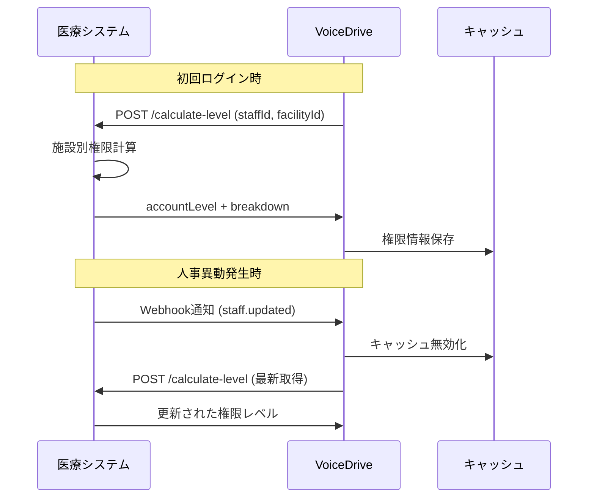

# 医療職員管理システム - VoiceDrive 施設別権限レベル連携仕様書

## 1. 背景と目的

### 1.1 現状の課題
- 小原病院と立神リハビリテーション温泉病院では指揮系統・組織構造が異なる
- 同じ役職名でも施設により権限範囲が異なる（例：師長の管理範囲）
- 今後も施設追加の可能性があり、拡張性が必要

### 1.2 連携目的
- 各施設の組織構造を尊重しながら、統一的な権限管理を実現
- 施設間の人事異動時もスムーズな権限移行を可能に
- システム間でリアルタイムな権限同期を実現

## 2. 権限レベル体系の定義

### 2.1 法人共通権限レベル（基本18段階）

```
レベル1-4: 一般職員層
  - レベル1: 新人職員（経験1年未満）
  - レベル2: 若手職員（経験2-3年）
  - レベル3: 中堅職員（経験4-10年）
  - レベル4: ベテラン職員（経験11年以上）
  ※看護職のリーダー業務は+0.5で対応

レベル5-7: 中間管理職層
  - レベル5: 主任クラス
  - レベル6: 係長・副師長クラス
  - レベル7: 師長・課長クラス

レベル8-10: 上級管理職層
  - レベル8: 科長・部門長クラス
  - レベル9: 副部長クラス
  - レベル10: 部長クラス

レベル11-13: 施設経営層
  - レベル11: 事務長
  - レベル12: 副院長
  - レベル13: 院長・施設長

レベル14-18: 法人本部層
  - レベル14: 人財統括本部 一般職員
  - レベル15: 人財統括本部 部門長
  - レベル16: 人財統括本部 統括管理職
  - レベル17: 法人事務局長
  - レベル18: 理事長
```

### 2.2 立神リハビリテーション温泉病院の役職マッピング

#### 組織図に基づく権限レベル割当（案）

```json
{
  "facility_id": "tategami_rehabilitation",
  "facility_name": "立神リハビリテーション温泉病院",
  "position_mapping": {
    // 経営層
    "院長": 13,

    // 看護部門
    "総師長": 10,
    "副総師長": 9,
    "師長": 7,
    "主任": 5,
    "介護主任": 5,

    // 診療技術部
    "統括主任": 6,  // 複数部門を統括

    // 事務部門
    "事務長": 11,
    "薬局長": 8,

    // 各部門主任
    "リハビリテーション部門主任": 5,
    "放射線部門主任": 5,
    "栄養部門主任": 5,
    "医事課主任": 5,
    "総務課主任": 5,

    // 一般職員（経験年数により1-4）
    "看護師": "1-4（経験年数により決定）",
    "介護職員": "1-4（経験年数により決定）",
    "リハビリテーション職員": "1-4（経験年数により決定）",
    "事務職員": "1-4（経験年数により決定）"
  }
}
```

### 2.3 小原病院との比較表

| 役職カテゴリ | 小原病院 | 立神リハビリテーション | 権限レベル差異 |
|------------|---------|---------------------|--------------|
| 施設長 | 院長（レベル13） | 院長（レベル13） | 同等 |
| 看護部門トップ | 看護部長（レベル10） | 総師長（レベル10） | 同等 |
| 病棟責任者 | 病棟師長（レベル7） | 師長（レベル7） | 同等 |
| 部門責任者 | 薬剤部長（レベル10） | 薬局長（レベル8） | 施設規模により調整 |

## 3. API連携仕様

### 3.1 権限レベル取得API（既存）

**エンドポイント**: `POST /api/v1/calculate-level`

**リクエスト**:
```json
{
  "staffId": "string",
  "facilityId": "string"  // 新規追加フィールド
}
```

**レスポンス**:
```json
{
  "staffId": "string",
  "facilityId": "string",
  "position": "string",
  "accountLevel": "number",
  "breakdown": {
    "baseLevel": "number",
    "experienceBonus": "number",
    "leaderBonus": "number",
    "facilityAdjustment": "number"  // 新規追加
  }
}
```

### 3.2 施設別役職マッピング取得API（新規提案）

**エンドポイント**: `GET /api/v1/facilities/{facilityId}/position-mapping`

**レスポンス**:
```json
{
  "facilityId": "string",
  "facilityName": "string",
  "lastUpdated": "datetime",
  "positions": [
    {
      "positionName": "string",
      "baseLevel": "number",
      "departmentScope": "string",
      "managementScope": "number"  // 管理対象人数
    }
  ]
}
```

### 3.3 職員情報更新通知Webhook（新規提案）

**エンドポイント**: VoiceDrive側で用意
`POST https://voicedrive.example.com/api/webhook/staff-update`

**ペイロード**:
```json
{
  "eventType": "staff.updated",
  "timestamp": "datetime",
  "data": {
    "staffId": "string",
    "facilityId": "string",
    "changes": {
      "position": "string",
      "accountLevel": "number",
      "effectiveDate": "date"
    }
  }
}
```

## 4. 実装要件

### 4.1 医療職員管理システム側の実装事項

1. **施設別役職マスタの管理**
   - 各施設の組織図に基づく役職定義
   - 役職と権限レベルのマッピングテーブル
   - 経験年数による自動レベル調整ロジック

2. **API拡張**
   - facilityIdパラメータの追加
   - 施設別調整値の計算ロジック
   - マッピング情報取得APIの新規実装

3. **Webhook実装**
   - 職員情報変更時の自動通知
   - リトライ機構の実装
   - 配信ログの管理

### 4.2 VoiceDrive側の実装事項

1. **施設別権限マッピングテーブル**
   ```typescript
   interface FacilityPositionMapping {
     facilityId: string;
     facilityName: string;
     positions: Map<string, number>;
     lastSyncedAt: Date;
   }
   ```

2. **権限同期サービスの拡張**
   - 施設IDを考慮した権限取得
   - キャッシュ戦略の見直し
   - フォールバック機構の強化

3. **Webhook受信機能**
   - リアルタイム更新処理
   - イベント検証機構
   - エラーハンドリング

## 5. データ同期フロー



## 6. 移行計画

### Phase 1（2週間）
- API仕様の最終確認
- 立神リハビリテーション温泉病院の役職マッピング確定
- テスト環境での検証

### Phase 2（1週間）
- 本番環境での段階的導入
- 小原病院での動作確認
- 立神リハビリテーション温泉病院の追加

### Phase 3（継続的）
- 他施設の順次追加
- 運用モニタリング
- 改善点の洗い出し

## 7. 確認・調整事項

### 7.1 至急確認が必要な事項

1. **立神リハビリテーション温泉病院の役職マッピング**
   - 上記の権限レベル割当案で問題ないか
   - 統括主任の権限範囲の詳細
   - 介護主任と看護主任の権限差異

2. **API仕様**
   - facilityIdの形式（例：tategami_rehabilitation）
   - 既存APIへの影響範囲
   - Webhook実装の優先度

3. **データ移行**
   - 既存職員データへのfacilityId付与方法
   - 権限レベルの再計算タイミング

### 7.2 今後の検討事項

1. 施設間異動時の権限調整ルール
2. 臨時的な権限付与の仕組み
3. 権限履歴の管理方法

## 連絡先

VoiceDrive開発チーム
- 技術担当：[担当者名]
- Slack：#voicedrive-integration
- Email：voicedrive-dev@example.com

---

作成日：2025年9月26日
次回定例会議：2025年9月30日（月）10:00