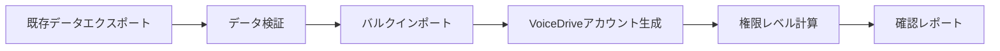

# VoiceDrive技術仕様回答書

**作成日**: 2025年9月26日
**宛先**: 医療チーム職員カルテシステム開発担当者様
**作成者**: VoiceDrive開発チーム

## 1. API仕様の詳細

### 1.1 認証方式
```typescript
// JWT Bearer Token方式を採用
{
  "authentication": "Bearer Token (JWT)",
  "tokenLifetime": "1 hour",
  "refreshTokenLifetime": "7 days",
  "algorithm": "HS256"
}
```

### 1.2 エラーレスポンスフォーマット
```json
{
  "error": {
    "code": "ERROR_CODE",
    "message": "エラーメッセージ（日本語）",
    "details": {
      "field": "詳細情報"
    },
    "timestamp": "2025-09-26T10:00:00Z",
    "traceId": "trace-id-12345"
  }
}
```

### 1.3 レート制限
| エンドポイントタイプ | 制限値 |
|----------------------|--------|
| 認証 (/auth/*) | 5 req/min |
| 権限計算 (/calculate-level) | 100 req/min |
| Webhook | 20 req/sec |
| その他GET | 100 req/min |
| その他POST/PUT | 50 req/min |

### 1.4 タイムアウト設定
```yaml
defaultTimeout: 30s  # デフォルト30秒
endpoints:
  /api/v1/calculate-level: 5s  # 高速応答必須
  /api/v1/staff/bulk: 60s  # 大量データ処理
  /webhook/*: 10s
```

## 2. Webhook通知のタイミング

### 2.1 通知対象イベント
```typescript
enum WebhookEventType {
  // 必須通知
  STAFF_CREATED = "staff.created",           // 新規登録時
  STAFF_LEVEL_CHANGED = "staff.level_changed", // 権限レベル変更時
  STAFF_LEADER_FLAG_CHANGED = "staff.leader_flag_changed", // リーダー業務フラグ変更時
  STAFF_DELETED = "staff.deleted",           // 退職時

  // オプション通知
  STAFF_DEPARTMENT_CHANGED = "staff.department_changed", // 部署異動
  STAFF_POSITION_CHANGED = "staff.position_changed",     // 役職変更
}
```

### 2.2 Webhookペイロード
```json
{
  "event": "staff.level_changed",
  "timestamp": "2025-09-26T10:00:00Z",
  "data": {
    "staffId": "STAFF001",
    "changes": {
      "accountLevel": {
        "old": 1,
        "new": 2
      }
    },
    "changedBy": "admin_user",
    "reason": "定期昇格"
  },
  "signature": "HMAC-SHA256署名"
}
```

### 2.3 リトライポリシー
```yaml
retryPolicy:
  maxAttempts: 3
  backoffStrategy: "exponential"
  initialDelay: 1000ms
  maxDelay: 30000ms
  retryableStatuses: [500, 502, 503, 504]
```

### 2.4 通知失敗時の対処
```typescript
interface FailureHandling {
  deadLetterQueue: true,           // 失敗したWebhookをDLQに保存
  alertThreshold: 5,                // 5回連続失敗でアラート
  fallbackNotification: "email",    // メール通知にフォールバック
  manualRetryEndpoint: "/api/webhook/retry/:webhookId"
}
```

## 3. 初期データ移行

### 3.1 移行フロー


### 3.2 バルクAPI仕様
```typescript
POST /api/v1/staff/bulk-import
{
  "maxRecordsPerRequest": 1000,  // 1回あたり最大1000件
  "format": "JSON",
  "validation": "strict",         // 厳格なバリデーション
  "dryRun": true                 // テスト実行オプション
}
```

### 3.3 移行時のアカウント作成
```typescript
interface MigrationAccount {
  // 自動生成項目
  voiceDriveId: string,           // "VD-" + staffId
  initialPassword: string,        // ランダム16文字
  passwordResetRequired: true,    // 初回ログイン時変更必須

  // 権限計算
  accountLevel: number,            // 経験年数から自動計算
  canPerformLeaderDuty: boolean,  // デフォルトfalse（後で更新）

  // 通知設定
  welcomeEmailSent: boolean,
  activationLink: string
}
```

### 3.4 移行バッチ処理
```yaml
batchConfiguration:
  chunkSize: 100
  parallelWorkers: 5
  progressReporting: true
  rollbackOnError: true
  validationReport: "/reports/migration-{timestamp}.csv"
```

## 4. セキュリティ要件

### 4.1 API通信の暗号化
```typescript
interface SecurityConfig {
  protocol: "HTTPS only",
  tlsVersion: "1.3",
  cipherSuites: [
    "TLS_AES_256_GCM_SHA384",
    "TLS_AES_128_GCM_SHA256"
  ],
  hsts: {
    enabled: true,
    maxAge: 31536000,
    includeSubDomains: true
  }
}
```

### 4.2 IPホワイトリスト設定
```json
{
  "ipWhitelist": {
    "enabled": true,
    "allowedIPs": [
      "192.168.1.0/24",     // 医療チーム内部ネットワーク
      "10.0.0.0/16",        // VPN接続
      "203.0.113.0/24"      // MCPサーバー
    ],
    "bypassForHealthCheck": true,
    "dynamicUpdate": "/api/admin/whitelist"
  }
}
```

### 4.3 監査ログ要件
```typescript
interface AuditLog {
  // 必須記録項目
  timestamp: Date,
  userId: string,
  action: string,
  resource: string,
  ipAddress: string,
  userAgent: string,
  result: "success" | "failure",

  // オプション項目
  changes?: object,
  errorDetails?: string,
  duration?: number,

  // 保存要件
  retention: "3 years",
  storage: "encrypted",
  immutable: true,
  searchable: true
}
```

### 4.4 追加セキュリティ対策
```yaml
additionalSecurity:
  # APIキー管理
  apiKeyRotation: "quarterly"
  apiKeyScopes: ["read", "write", "admin"]

  # 認証強化
  mfa:
    enabled: true
    methods: ["totp", "sms"]
    requiredForAdmin: true

  # データ保護
  encryption:
    atRest: "AES-256"
    inTransit: "TLS 1.3"
    keyManagement: "AWS KMS"

  # 脆弱性対策
  security headers:
    - X-Content-Type-Options: nosniff
    - X-Frame-Options: DENY
    - X-XSS-Protection: 1; mode=block
    - Content-Security-Policy: default-src 'self'
```

## 5. 実装優先順位（再確認）

基づき、以下の優先順位で実装を進めます：

### 🔴 最優先（9/26-9/27）
1. JWT認証の実装
2. エラーハンドリングの標準化
3. `/api/v1/calculate-level` エンドポイント

### 🟡 高優先（9/30-10/2）
1. Webhook通知システム
2. バルクインポートAPI
3. セキュリティヘッダー実装

### 🟢 標準（10/3-10/4）
1. IPホワイトリスト
2. 監査ログシステム
3. レート制限実装

## 6. 質問事項への追加回答

### Q: VoiceDrive側で既に実装済みの仕様は？

以下が実装済みです：
- ✅ 18段階権限システム（PermissionLevel enum）
- ✅ ハイブリッド投票計算エンジン
- ✅ 議題エスカレーションエンジン
- ✅ 投票権限マトリックス
- ✅ 議題提案書編集機能

未実装（これから実装）：
- ⏳ JWT認証システム
- ⏳ RESTful API エンドポイント
- ⏳ Webhook通知
- ⏳ バルクインポート

## 7. 次のアクション

### 本日（9/26）の会議で確認したい事項
1. IP ホワイトリストの具体的なIPレンジ
2. 監査ログの出力形式（JSON/CSV/その他）
3. 初期データ移行のスケジュール
4. MFA（多要素認証）の必要性

### 実装開始項目
会議後、即座に以下の実装を開始します：
- JWT認証ミドルウェア
- 標準エラーハンドラー
- `/api/v1/calculate-level` エンドポイント

---

**VoiceDrive開発チーム**
連絡先: [開発チームSlack]
最終更新: 2025年9月26日 09:00