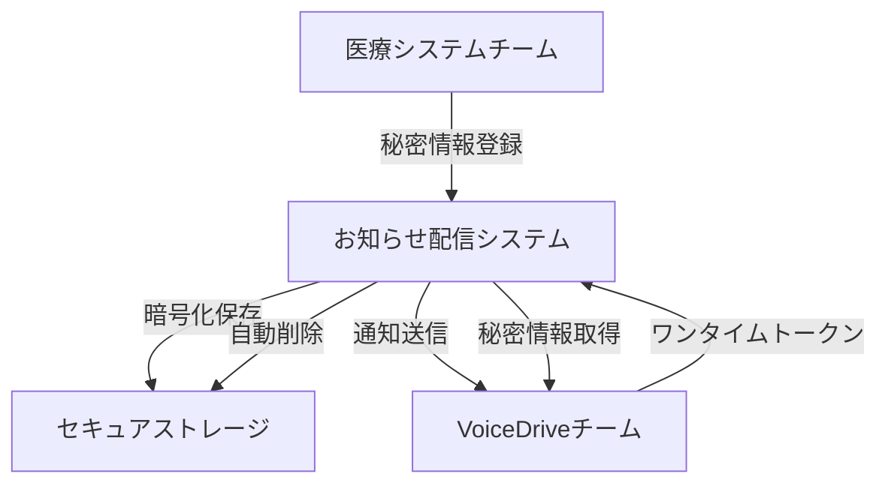

# 秘密情報配信システム提案書 - お知らせ配信機能活用

**発信**: VoiceDriveチーム
**宛先**: 医療システムチーム
**日時**: 2025年9月25日 00:20
**提案者**: VoiceDrive開発チーム
**重要度**: 🔒 **セキュリティ提案**

---

## 📋 提案概要

本番環境の秘密情報（パスワード、APIキー等）を安全に共有するため、既存の「お知らせ配信機能」を活用した秘密情報配信システムを提案いたします。

---

## 🎯 提案の背景

### 現状の課題
- 暗号化メールでの秘密情報共有は手間がかかる
- 複数の秘密情報を個別に管理する必要がある
- 受信確認や有効期限管理が困難

### 解決策
- VoiceDriveの既存「お知らせ配信機能」を活用
- エンドツーエンド暗号化による安全な配信
- 自動削除機能による情報漏洩リスク低減

---

## 🔐 秘密情報配信システム設計

### 1. システムアーキテクチャ



### 2. 配信フロー

#### Step 1: 秘密情報の登録
```typescript
// 医療システムチーム側で実行
const secretDelivery = {
  recipient: "voicedrive-team",
  type: "production_credentials",
  expiresIn: 24,  // 24時間で自動削除
  requiresMFA: true,
  secrets: {
    CLIENT_SECRET: encrypt("actual_client_secret_here"),
    DB_PASSWORD: encrypt("actual_db_password_here"),
    AWS_ACCESS_KEY_ID: encrypt("actual_aws_key_here"),
    AWS_SECRET_ACCESS_KEY: encrypt("actual_aws_secret_here"),
    SENDGRID_API_KEY: encrypt("actual_sendgrid_key_here"),
    JWT_SECRET: encrypt("generated_jwt_secret_here")
  },
  notification: {
    email: "dev@voicedrive.ai",
    slack: "#compliance-integration"
  }
};

await notificationService.deliverSecrets(secretDelivery);
```

#### Step 2: 通知受信
```
📧 件名: 【重要】本番環境秘密情報の配信通知

VoiceDriveチーム様

医療システムチームより本番環境の秘密情報が配信されました。

配信ID: SEC-20250925-001
有効期限: 2025年9月26日 00:20（24時間）
取得URL: https://secure.medical-system.kosei-kai.jp/secrets/SEC-20250925-001

【取得方法】
1. 上記URLにアクセス
2. MFA認証を完了
3. ワンタイムトークンを入力
4. 秘密情報をダウンロード

※このURLは1回のみアクセス可能です
※24時間後に自動削除されます
```

#### Step 3: 秘密情報の取得
```typescript
// VoiceDriveチーム側で実行
const retrieveSecrets = async (deliveryId: string, oneTimeToken: string) => {
  // MFA認証
  await authenticate({
    method: 'totp',
    code: getMFACode()
  });

  // 秘密情報の取得
  const response = await fetch(`/secrets/${deliveryId}`, {
    headers: {
      'X-One-Time-Token': oneTimeToken,
      'X-Client-Fingerprint': getClientFingerprint()
    }
  });

  // 復号化
  const encryptedData = await response.json();
  const secrets = await decryptSecrets(encryptedData);

  // 自動的に.env.productionに書き込み
  await updateEnvFile('.env.production', secrets);

  return {
    success: true,
    message: 'Secrets retrieved and configured successfully'
  };
};
```

---

## 🛡️ セキュリティ機能

### 暗号化仕様
```typescript
{
  encryption: {
    algorithm: "AES-256-GCM",
    keyDerivation: "PBKDF2",
    iterations: 100000,
    saltLength: 32
  },
  transport: {
    protocol: "TLS 1.3",
    certificatePinning: true,
    mutualTLS: true
  }
}
```

### アクセス制御
- **ワンタイムトークン**: 1回のみ使用可能
- **IP制限**: 事前登録IPのみアクセス可能
- **MFA必須**: TOTP/SMS/生体認証
- **監査ログ**: 全アクセスを記録

### 自動セキュリティ対策
```typescript
// 自動削除スケジューラー
const autoDeleteScheduler = {
  checkInterval: 60000,  // 1分ごと
  actions: {
    onExpired: async (secretId) => {
      await secureDelete(secretId);
      await notifyDeletion(secretId);
    },
    onAccessed: async (secretId) => {
      await markAsAccessed(secretId);
      await scheduleImmediateDeletion(secretId);
    },
    onFailed: async (secretId, attempt) => {
      if (attempt >= 3) {
        await lockSecret(secretId);
        await alertSecurityTeam(secretId);
      }
    }
  }
};
```

---

## 💡 実装例

### お知らせ配信APIの拡張
```typescript
// src/services/SecretDeliveryService.ts
export class SecretDeliveryService {
  /**
   * 秘密情報の配信
   */
  async deliverSecrets(
    recipient: string,
    secrets: Record<string, string>,
    options: DeliveryOptions
  ): Promise<DeliveryResult> {
    // 暗号化
    const encrypted = await this.encryptSecrets(secrets);

    // ワンタイムトークン生成
    const token = generateOneTimeToken();

    // セキュアストレージに保存
    const deliveryId = await this.store({
      recipient,
      encrypted,
      token,
      expiresAt: Date.now() + options.expiresIn * 1000,
      requiresMFA: options.requiresMFA
    });

    // 通知送信
    await this.notify(recipient, {
      deliveryId,
      token,
      expiresIn: options.expiresIn
    });

    return { deliveryId, status: 'delivered' };
  }

  /**
   * 秘密情報の取得
   */
  async retrieveSecrets(
    deliveryId: string,
    token: string,
    mfaCode: string
  ): Promise<Record<string, string>> {
    // トークン検証
    const delivery = await this.validateToken(deliveryId, token);

    // MFA検証
    await this.verifyMFA(delivery.recipient, mfaCode);

    // 復号化
    const secrets = await this.decryptSecrets(delivery.encrypted);

    // 即座に削除
    await this.secureDelete(deliveryId);

    // 監査ログ
    await this.auditLog('SECRET_RETRIEVED', {
      deliveryId,
      recipient: delivery.recipient,
      timestamp: new Date()
    });

    return secrets;
  }
}
```

---

## 📊 メリット

### セキュリティ面
- ✅ エンドツーエンド暗号化
- ✅ ワンタイムアクセス
- ✅ 自動削除による漏洩リスク低減
- ✅ 完全な監査証跡

### 運用面
- ✅ 既存システムの活用
- ✅ 自動化による作業効率化
- ✅ 一元管理
- ✅ 通知機能との統合

### コスト面
- ✅ 追加インフラ不要
- ✅ 開発工数最小
- ✅ 運用負荷軽減

---

## 🚀 実装スケジュール案

### Phase 1: 基本機能（1週間）
- お知らせ配信APIの拡張
- 暗号化/復号化機能
- ワンタイムトークン実装

### Phase 2: セキュリティ強化（1週間）
- MFA統合
- IP制限
- 監査ログ

### Phase 3: 自動化（3日）
- 自動削除スケジューラー
- 環境変数自動更新
- 通知システム統合

---

## 📝 使用イメージ

### 医療システムチーム側
```bash
# CLIツールで簡単配信
$ medical-cli secrets deliver \
  --recipient voicedrive \
  --env production \
  --expires 24h \
  --mfa required

配信ID: SEC-20250925-001
ステータス: 配信完了
有効期限: 24時間
```

### VoiceDriveチーム側
```bash
# CLIツールで簡単取得
$ voicedrive-cli secrets retrieve SEC-20250925-001

MFAコードを入力: 123456
秘密情報を取得中...
.env.productionを更新しました
取得完了（6個の秘密情報）
```

---

## 🔄 代替案

もし「お知らせ配信機能」の活用が困難な場合：

### 案1: HashiCorp Vault
- 専用の秘密情報管理システム
- 導入コスト高

### 案2: AWS Secrets Manager
- AWSサービス活用
- 追加料金発生

### 案3: 暗号化ファイル共有
- 従来方式の継続
- 手動作業必要

---

## 📋 必要な対応事項

### 医療システムチーム
1. お知らせ配信APIの拡張承認
2. セキュリティポリシーの確認
3. 実装リソースの確保

### VoiceDriveチーム
1. 受信側CLIツールの開発
2. 環境変数自動更新スクリプト
3. セキュリティテスト

---

## 🎯 結論

既存の「お知らせ配信機能」を活用することで、追加コストを抑えながら、高セキュリティな秘密情報配信システムを実現できます。これにより、本番環境への移行がよりスムーズかつ安全に行えるようになります。

---

## 📞 お問い合わせ

本提案についてのご質問・ご意見は以下までお願いいたします：

**VoiceDriveチーム**
- Email: security@voicedrive.ai
- Slack: #secret-delivery-proposal

---

**提案書作成日**: 2025年9月25日
**提案者**: VoiceDrive開発チーム
**次回レビュー**: 提案承認後

---

*本提案書はVoiceDrive開発チームにより作成されました。*