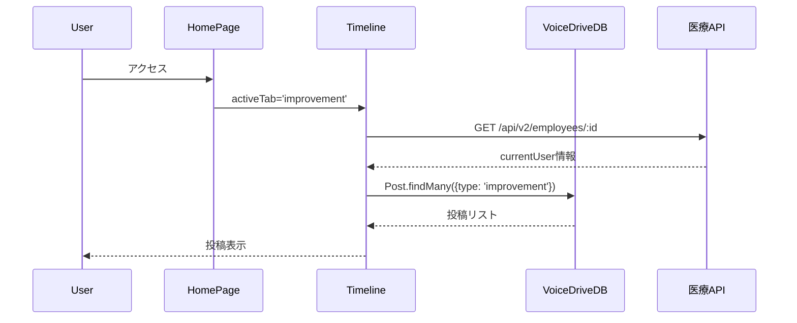

# 本日の共有ファイル要約（自動更新）

**更新日時**: 2025-10-27 16:00:00
**VoiceDrive側のClaude Code向け緊急要約**

---

## 🎯🎯🎯 **最新**: HomePage DB要件分析完了（10/27 16:00） 🆕🆕🆕

### 📢 重要: 医療システム側の追加実装は不要 - 既存APIのみで動作可能

**HomePageの詳細分析が完了し、医療システムとの連携要件を確認しました。**

| 項目 | 状態 | 詳細 |
|------|------|------|
| **HomePage分析** | ✅ **完了** | 全機能・データフロー分析済み（43項目） |
| **データ管理責任分界点** | ✅ **明確化** | VoiceDrive 88.4% / 医療システム 11.6% |
| **VoiceDrive DB更新** | ✅ **不要** | 既存テーブルで完全対応可能 |
| **医療システム新規実装** | ✅ **不要** | 既存API（Phase 1/3）で対応済み |
| **統合テスト準備** | ⏳ **計画策定中** | 2025年11月1日〜8日を提案 |

#### ✅ 完了ドキュメント（本日作成）

1. **`HomePage_DB要件分析_20251027.md`** - 詳細な分析レポート
   - ページ構造と機能分析
   - データ管理責任分界点の明確化
   - 既存実装で完全動作可能を確認

2. **`HomePage暫定マスターリスト_20251027.md`** - データ項目カタログ
   - 全43データ項目の詳細カタログ
   - 6カテゴリ分類（URLパラメータ/ユーザー情報/投稿/投票/コメント/UI状態）
   - データフロー図と実装状況

3. **`HomePage_医療システム実装状況回答書_20251027.md`** - 医療システムチームからの回答
   - 4つの確認事項への回答完了
   - API実装状況確認（Phase 1完了）
   - professionCategory変換ロジック確認
   - Webhook実装確認（Phase 3完了）

#### 🎯 データ管理責任分界点

```
VoiceDrive側（88.4% = 38項目）:
✅ 投稿データ（Post: 15項目）
✅ 投票データ（Vote/VoteHistory: 8項目）
✅ コメントデータ（Comment: 7項目）
✅ UI状態管理（5項目）
✅ URLパラメータ（2項目）

医療システム側（11.6% = 5項目）:
✅ 職員基本情報（User: employeeId, name, department, permissionLevel, professionCategory）
→ 既存API（GET /api/v2/employees/:id）で提供済み
→ Webhook（employee.updated）で即時更新（Phase 3実装済み）
```

#### ✅ 医療システム側実装状況（全て完了）

| 確認事項 | 状態 | 実装日 | 備考 |
|---------|------|--------|------|
| **APIエンドポイント実装** | ✅ **完了** | 2025/09/20 | Phase 1実装完了 |
| **professionCategory提供** | ✅ **完了** | 実装済み | accountType → professionCategory 変換 |
| **Webhook実装** | ✅ **完了** | 2025/10/02 | Phase 3実装完了（employee.created/updated/deleted） |
| **テーブル構造** | ✅ **確認完了** | 既存実装 | Employee/Department/Position 全て存在 |

#### 📊 データ項目カタログ（43項目）

| カテゴリ | 項目数 | 医療システム管理 | VoiceDrive管理 |
|---------|--------|----------------|---------------|
| URLパラメータ | 2 | 0 | 2（フロントエンド） |
| ユーザー情報 | 6 | 5（マスタ） | 1（キャッシュ） |
| 投稿データ | 15 | 0 | 15（マスタ） |
| 投票データ | 8 | 0 | 8（マスタ） |
| コメントデータ | 7 | 0 | 7（マスタ） |
| UI状態管理 | 5 | 0 | 5（フロントエンド） |
| **合計** | **43** | **5 (11.6%)** | **38 (88.4%)** |

#### 🔄 データフロー（HomePage初期表示）



#### 🎯 VoiceDriveチームへの確認依頼事項

1. **Webhook受信エンドポイント実装確認**
   - エンドポイント: `POST /api/webhooks/employee-updated`
   - 実装状況: ?

2. **環境変数の共有**
   - `WEBHOOK_API_KEY` の取得方法は?
   - 医療システム側で設定が必要

3. **professionCategory値の確認**
   - 7種類の値（nursing/medical/rehabilitation/administrative/support/management/other）
   - VoiceDrive側の期待値と一致しているか?

4. **統合テスト日程の調整**
   - 提案日程: 2025年11月1日（金）〜 11月8日（金）
   - テストシナリオ: API動作確認/HomePage表示/Webhook連携/投票機能

#### 🚀 次のアクション

**VoiceDriveチーム**:
- ✅ HomePage分析完了
- ⏳ Webhook受信エンドポイント実装確認
- ⏳ 上記4つの確認事項への回答
- ⏳ 統合テスト日程確定

**医療システムチーム**:
- ✅ 全ての実装完了（追加作業なし）
- ✅ 回答書送付完了（HomePage_医療システム実装状況回答書_20251027.md）
- ⏳ VoiceDriveチームからの確認回答待ち

#### 📂 関連ドキュメント

- `mcp-shared/docs/HomePage_DB要件分析_20251027.md`
- `mcp-shared/docs/HomePage暫定マスターリスト_20251027.md`
- `mcp-shared/docs/HomePage_医療システム実装状況回答書_20251027.md`

---

## 📋 **10/27以前の完了事項** ProposalSelectionPage DB要件分析完了（10/26）

### 📢 重要: 医療システムチーム確認必須 - API実装要件の明確化

**ProposalSelectionPageの詳細分析が完了し、医療システムとのAPI連携に関する重要な不足項目を特定しました。**

| 項目 | 状態 | 詳細 |
|------|------|------|
| **ProposalSelectionPage分析** | ✅ **完了** | 全機能・データフロー分析済み |
| **データ管理責任分界点** | ✅ **明確化** | 医療システム100%管理を確認 |
| **VoiceDrive DB更新** | ✅ **不要** | 既存Interviewテーブルで対応可 |
| **不足API特定** | 🔴 **緊急** | submitChoice()等の実装必要 |
| **医療システムチーム確認** | ⏳ **待機中** | API実装スケジュール回答待ち |

#### 🔴 不足API実装（医療システムチーム確認必要）

**1. submitChoice() 関数未実装**
- ProposalSelectionPage.tsx:109 で呼び出し中だが実装なし

**2. getCurrentUserId() 関数未実装**
- JWT認証からemployeeIdを取得する処理が必要

**3. requestScheduleAdjustment() パラメータミスマッチ**
- ラッパー関数の実装が推奨

---

## 🎯 今後の重要マイルストーン

| 日付 | マイルストーン | 担当 | ステータス |
|------|--------------|------|----------|
| **10/27** | HomePage分析完了 | VoiceDrive | ✅ 完了 |
| **10/30 15:00** | Phase 2調整会議 | 両チーム | ⏳ 予定 |
| **11/1-11/8** | HomePage統合テスト | 両チーム | ⏳ 計画中 |
| **11/11-11/15** | Phase 2統合テスト | 両チーム | ✅ VD準備完了 |
| **11/22** | **Phase 2本番リリース** | 両チーム | ✅ VD準備完了 |

---

## 📞 緊急連絡・ファイル確認方法

### 最新ファイル確認コマンド

```bash
# HomePage分析ファイルを確認
ls -la mcp-shared/docs/HomePage*20251027*

# DB要件分析を確認
cat mcp-shared/docs/HomePage_DB要件分析_20251027.md

# 暫定マスターリストを確認
cat mcp-shared/docs/HomePage暫定マスターリスト_20251027.md

# 医療システム回答書を確認
cat mcp-shared/docs/HomePage_医療システム実装状況回答書_20251027.md
```

---

**🚀 最新**: HomePage DB要件分析完了。医療システム側は追加実装不要（既存API継続）。VoiceDriveチームからの確認回答待ち。

**📅 次の重要イベント**: 11/1-11/8 HomePage統合テスト（日程調整中）

---

**END OF SUMMARY**
