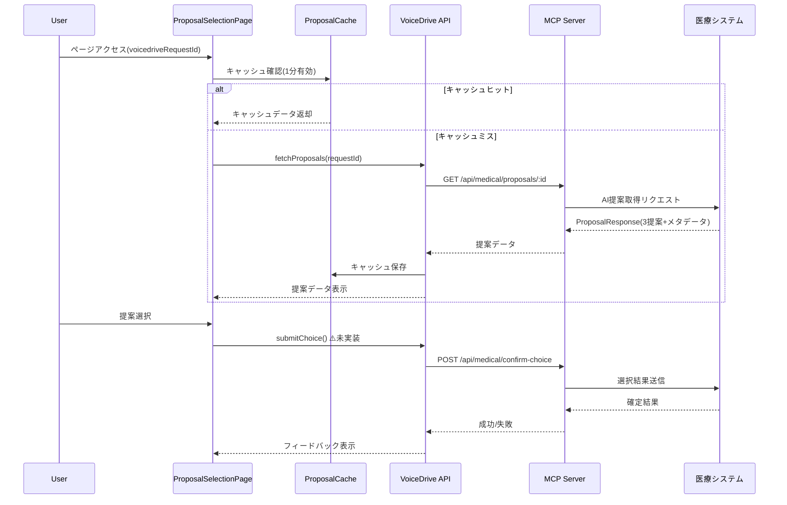

# 本日の共有ファイル要約（自動更新）

**更新日時**: 2025-10-26 00:00:00
**VoiceDrive側のClaude Code向け緊急要約**

---

## 🎯🎯🎯 **最新**: ProposalSelectionPage DB要件分析完了（10/26 00:00） 🆕🆕🆕

### 📢 重要: 医療システムチーム確認必須 - API実装要件の明確化

**ProposalSelectionPageの詳細分析が完了し、医療システムとのAPI連携に関する重要な不足項目を特定しました。**

| 項目 | 状態 | 詳細 |
|------|------|------|
| **ProposalSelectionPage分析** | ✅ **完了** | 全機能・データフロー分析済み |
| **データ管理責任分界点** | ✅ **明確化** | 医療システム100%管理を確認 |
| **VoiceDrive DB更新** | ✅ **不要** | 既存Interviewテーブルで対応可 |
| **不足API特定** | 🔴 **緊急** | submitChoice()等の実装必要 |
| **医療システムチーム確認** | ⏳ **待機中** | API実装スケジュール回答待ち |

#### ✅ 完了ドキュメント（本日作成）

1. **`ProposalSelectionPage_DB要件分析_20251026.md`** - 詳細な分析レポート
   - ページ機能とデータフロー分析
   - データ管理責任分界点の明確化
   - DB実装状況と不足項目の特定

2. **`ProposalSelectionPage暫定マスターリスト_20251026.md`** - データ項目カタログ
   - 全40データ項目の詳細カタログ
   - 5カテゴリ分類（URL/基本情報/提案データ/UI状態/入力）
   - 不足API実装要件の明記

#### 🎯 データ管理責任分界点

```
医療システム側（100%管理）:
✅ AI処理結果（3つの面談提案・ランキング・信頼度スコア）
✅ 面談担当者情報（医師情報・専門性・経験年数）
✅ スケジュール情報（日時・場所・形式）
✅ リクエスト管理（requestId・有効期限）
✅ 予約確定処理（選択結果の永続化）

VoiceDrive側（表示・選択UIのみ）:
📱 セッション状態（メモリ内のみ）
⏱️ APIキャッシュ（1分有効・ProposalCacheクラス）
🎨 UI状態（loading/error/selectedProposal）
```

#### 🔴 不足API実装（医療システムチーム確認必要）

##### Phase 1 - 必須実装

**1. submitChoice() 関数未実装**
```typescript
// ProposalSelectionPage.tsx:109 で呼び出し中だが実装なし
// 必要な実装:
export async function submitChoice(params: {
  voicedriveRequestId: string;
  selectedProposalId: string;
  feedback?: string;
}): Promise<{ success: boolean; message: string }> {
  // confirmChoice()のラッパー関数
  // requestIdの取得ロジックが必要
}
```

**2. getCurrentUserId() 関数未実装**
- JWT認証からemployeeIdを取得する処理が必要

##### Phase 2 - パラメータ不一致

**3. requestScheduleAdjustment() パラメータミスマッチ**
- ProposalSelectionPage.tsx:137 は簡易パラメータ送信
- medicalSystemAPI.ts:198 は完全なAdjustmentRequestオブジェクトを期待
- ラッパー関数の実装が推奨

#### 📊 データ項目カタログ（40項目）

| カテゴリ | 項目数 | 主要データ |
|---------|--------|-----------|
| URLパラメータ | 1 | voicedriveRequestId |
| 提案セット基本情報 | 8 | requestId, proposals[], expiresAt, contactInfo |
| 個別提案データ | 21×3 | rank, confidence, 担当者情報, スケジュール, AI推薦理由 |
| UI状態管理 | 7 | loading, error, selectedProposal, timeRemaining |
| ユーザー入力 | 3 | selectedProposalId, feedback, adjustmentReason |

#### 🔄 データフロー



#### 🎯 医療システムチームへの確認事項

1. **submitChoice() API実装スケジュール**
   - いつまでに実装可能か？
   - 仕様確認が必要な点はあるか？

2. **requestId管理方法の調整**
   - voicedriveRequestId ↔ requestId のマッピング方法
   - どちらのシステムで管理するか？

3. **getCurrentUserId() 実装方針**
   - JWT認証の実装状況
   - employeeId取得方法の統一

4. **ProposalResponse データ構造の最終確認**
   - 現在の暫定マスターリスト（40項目）で過不足ないか？
   - 追加フィールドの予定はあるか？

#### 🚀 次のアクション

**VoiceDriveチーム（待機中）**:
- ✅ ProposalSelectionPage分析完了
- ⏸️ submitChoice() API実装待ち
- ⏸️ 医療システムチームの回答待ち

**医療システムチーム（アクション必要）**:
- 🔴 **URGENT**: ProposalSelectionPage_DB要件分析を確認
- 🔴 **URGENT**: 不足API実装スケジュール回答
- 🔴 **URGENT**: データ構造（40項目）の最終確認

#### 📂 関連ドキュメント

- `mcp-shared/docs/ProposalSelectionPage_DB要件分析_20251026.md`
- `mcp-shared/docs/ProposalSelectionPage暫定マスターリスト_20251026.md`

---

## 🎉🎉🎉 **本日完了**: ProposalReviewPage 実装完了（10/21 24:00）

### 📢 重要: 提案レビュー承認機能の完全実装完了

**50点到達提案のレビュー承認機能が100%実装完了しました。**

| 項目 | 状態 | 詳細 |
|------|------|------|
| **医療システム側の実装** | ❌ **不要** | VoiceDrive内部で完結 |
| **DB設計・実装** | ✅ **完了** | ProposalReviewテーブル追加 |
| **API実装** | ✅ **完了** | 4つのエンドポイント実装 |
| **フロントエンド統合** | ✅ **完了** | ProposalReviewPage更新 |
| **Prisma Client生成** | ⏳ **待機中** | ファイルロック解消後 |

#### ✅ 完了ドキュメント（10/21作成）

1. **`ProposalReviewPage_DB要件分析_20251021.md`** - 詳細な分析レポート
2. **`ProposalReviewPage暫定マスターリスト_20251021.md`** - API・テーブル定義書
3. **`ProposalReviewPage_実装完了報告_20251021.md`** - 実装完了報告書

---

## 🎉🎉🎉 **Phase 2顔写真統合** - VoiceDrive側実装完了！（10/21 23:00）

### 📢 医療システムチーム様へ - 実装完了通知

**Phase 2職員顔写真データ連携のVoiceDrive側実装が100%完了しました。**

#### ✅ 実装完了項目サマリー

| カテゴリ | 実装項目 | ステータス |
|---------|---------|----------|
| **バックエンド** | Prismaスキーマ拡張 | ✅ 完了 |
| | Webhook署名検証ミドルウェア | ✅ 完了 |
| | Webhookハンドラー（3種類のイベント） | ✅ 完了 |
| | Webhookエンドポイント | ✅ 完了 |
| **フロントエンド** | PhotoAvatarコンポーネント拡張 | ✅ 完了 |
| | EnhancedPost適用 | ✅ 完了 |
| | FreespacePost適用 | ✅ 完了 |
| | EnhancedSidebar適用 | ✅ 完了 |
| | ProfilePage適用 | ✅ 完了 |
| | DemoUserSwitcher適用 | ✅ 完了 |
| **ドキュメント** | 実装サマリー | ✅ 完了 |
| | 作業再開指示書 | ✅ 完了 |
| | 医療チームへの通知書 | ✅ 完了 |
| **環境変数** | .env.example設定 | ✅ 完了 |
| | Webhook Secret設定 | ⏳ 医療チームから受領待ち |

---

## 🎯 今後の重要マイルストーン

| 日付 | マイルストーン | 担当 | ステータス |
|------|--------------|------|----------|
| **10/26** | ProposalSelectionPage分析完了 | VoiceDrive | ✅ 完了 |
| **10/30 15:00** | Phase 2調整会議 | 両チーム | ⏳ 予定 |
| **11/11-11/15** | Phase 2統合テスト | 両チーム | ✅ VD準備完了 |
| **11/22** | **Phase 2本番リリース** | 両チーム | ✅ VD準備完了 |

---

## 📞 緊急連絡・ファイル確認方法

### 最新ファイル確認コマンド

```bash
# ProposalSelectionPage分析ファイルを確認
ls -la mcp-shared/docs/ProposalSelectionPage*20251026*

# DB要件分析を確認
cat mcp-shared/docs/ProposalSelectionPage_DB要件分析_20251026.md

# 暫定マスターリストを確認
cat mcp-shared/docs/ProposalSelectionPage暫定マスターリスト_20251026.md

# Phase 2顔写真統合の最新ファイルを確認
ls -la mcp-shared/docs/phase2-*20251021*

# 医療チームへの通知書を確認
cat mcp-shared/docs/phase2-voicedrive-ready-notification-20251021.md
```

---

**🚀 最新**: ProposalSelectionPage DB要件分析完了。医療システムチームの確認待ち（submitChoice() API実装スケジュール等）。

**📅 次の重要イベント**: 10/30 15:00 Phase 2調整会議予定

---

**END OF SUMMARY**
