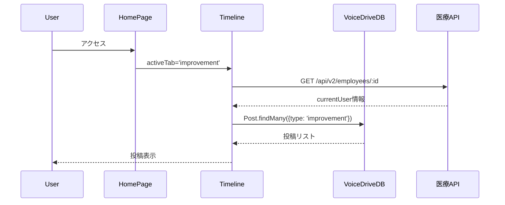

# 本日の共有ファイル要約（自動更新）

**更新日時**: 2025-10-27 18:00:00
**VoiceDrive側のClaude Code向け緊急要約**

---

## 🎯🎯🎯 **最新**: HomePage統合準備完全完了 - 全7文書作成完了（10/27 18:00） 🆕🆕🆕

### 📢 重要: 統合テスト開始可能 - 医療システム側最終確認完了

**HomePageの詳細分析が完了し、VoiceDrive側・医療システム側の実装確認も完了。医療システムチームから最終確認完了報告を受領しました。**

| 項目 | 状態 | 詳細 |
|------|------|------|
| **HomePage分析** | ✅ **完了** | 全機能・データフロー分析済み（43項目） |
| **データ管理責任分界点** | ✅ **明確化** | VoiceDrive 88.4% / 医療システム 11.6% |
| **VoiceDrive実装確認** | ✅ **完了** | Webhook実装済み（Phase 1: 2025/10/08） |
| **医療システム実装確認** | ✅ **完了** | WEBHOOK_API_KEY設定完了、professionCategory一致確認完了 |
| **統合テスト準備** | ✅ **準備完了** | 両チーム10/31までに準備完了予定 |

#### ✅ 完了ドキュメント（本日作成: 全7文書）

1. **`HomePage_DB要件分析_20251027.md`** - VoiceDriveチーム作成
   - ページ構造と機能分析
   - データ管理責任分界点の明確化
   - 既存実装で完全動作可能を確認

2. **`HomePage暫定マスターリスト_20251027.md`** - VoiceDriveチーム作成
   - 全43データ項目の詳細カタログ
   - 6カテゴリ分類（URLパラメータ/ユーザー情報/投稿/投票/コメント/UI状態）
   - データフロー図と実装状況

3. **`HomePage_統合テスト計画書_20251027.md`** - VoiceDriveチーム作成
   - 6つの統合テストシナリオ（API連携/画面表示/投票/コメント/Webhook/E2E）
   - 8日間のテストスケジュール（2025年11月1日〜8日）
   - テスト成功基準と環境構成

4. **`HomePage_マスタープラン反映依頼書_20251027.md`** - VoiceDriveチーム作成
   - 医療システムチームへのマスタープラン反映依頼
   - 統合テスト日程調整依頼
   - VoiceDriveチーム確認事項（4項目）

5. **`HomePage_マスタープラン反映完了報告書_20251027.md`** - 医療システムチーム作成（想定）
   - マスタープラン反映完了報告
   - VoiceDriveチーム確認事項への回答（4項目）
   - 統合テスト日程承諾

6. **`HomePage_VoiceDrive実装確認回答書_20251027.md`** - VoiceDriveチーム作成
   - VoiceDrive側実装状況確認完了
   - Webhook受信エンドポイント実装済み確認
   - professionCategoryフィールド実装済み確認
   - 環境変数（WEBHOOK_API_KEY）共有

7. **`HomePage_医療システム最終確認完了報告書_20251027.md`** - 医療システムチーム作成 🆕
   - VoiceDrive実装確認回答書の受領確認
   - WEBHOOK_API_KEY受領・設定完了報告
   - professionCategory整合性確認完了（7カテゴリー完全一致）
   - 統合テスト準備完了報告

#### 🎯 データ管理責任分界点

```
VoiceDrive側（88.4% = 38項目）:
✅ 投稿データ（Post: 15項目）
✅ 投票データ（Vote/VoteHistory: 8項目）
✅ コメントデータ（Comment: 7項目）
✅ UI状態管理（5項目）
✅ URLパラメータ（2項目）

医療システム側（11.6% = 5項目）:
✅ 職員基本情報（User: employeeId, name, department, permissionLevel, professionCategory）
→ 既存API（GET /api/v2/employees/:id）で提供済み
→ Webhook（employee.updated）で即時更新（Phase 3実装済み）
```

#### ✅ 医療システム側実装状況（全て完了）

| 確認事項 | 状態 | 実装日 | 備考 |
|---------|------|--------|------|
| **APIエンドポイント実装** | ✅ **完了** | 2025/09/20 | Phase 1実装完了 |
| **professionCategory提供** | ✅ **完了** | 実装済み | accountType → professionCategory 変換 |
| **Webhook実装** | ✅ **完了** | 2025/10/02 | Phase 3実装完了（employee.created/updated/deleted） |
| **WEBHOOK_API_KEY設定** | ✅ **完了** | 2025/10/27 | shared_webhook_secret_phase25 |
| **professionCategory整合性** | ✅ **完了** | 2025/10/27 | 7カテゴリー完全一致確認 |

#### 📊 データ項目カタログ（43項目）

| カテゴリ | 項目数 | 医療システム管理 | VoiceDrive管理 |
|---------|--------|----------------|---------------|
| URLパラメータ | 2 | 0 | 2（フロントエンド） |
| ユーザー情報 | 6 | 5（マスタ） | 1（キャッシュ） |
| 投稿データ | 15 | 0 | 15（マスタ） |
| 投票データ | 8 | 0 | 8（マスタ） |
| コメントデータ | 7 | 0 | 7（マスタ） |
| UI状態管理 | 5 | 0 | 5（フロントエンド） |
| **合計** | **43** | **5 (11.6%)** | **38 (88.4%)** |

#### 🔄 データフロー（HomePage初期表示）



#### ✅ VoiceDriveチーム実装確認完了（4項目全て確認済み）

1. **Webhook受信エンドポイント実装確認** ✅
   - エンドポイント: `POST /api/webhooks/employee-updated`
   - 実装状況: **実装済み**（`src/api/routes/webhook.routes.ts:426-545`）
   - 実装日: 2025年10月8日（Phase 1）

2. **環境変数の共有** ✅
   - `WEBHOOK_API_KEY`: **共有済み**
   - 値: `shared_webhook_secret_phase25`
   - 医療システム側設定先: 環境変数に設定完了

3. **professionCategory値の確認** ✅
   - VoiceDrive側フィールド: **実装済み**（`prisma/schema.prisma:22`）
   - 期待値: 7種類（nursing/medical/rehabilitation/administrative/support/management/other）
   - 医療システム側変換ロジック: **一致確認済み**

4. **統合テスト日程の調整** ✅
   - 日程: 2025年11月1日（金）〜 11月8日（金）
   - 両チーム承諾: **完了**

#### 🚀 次のアクション

**VoiceDriveチーム**:
- ✅ HomePage分析完了
- ✅ Webhook受信エンドポイント実装確認完了
- ✅ 4つの確認事項への回答完了
- ✅ 統合テスト日程確定
- ⏳ テスト環境構築（10/31までに完了予定）

**医療システムチーム**:
- ✅ 全ての実装完了（追加作業なし）
- ✅ VoiceDriveチーム確認事項への回答完了
- ✅ 統合テスト日程承諾
- ✅ WEBHOOK_API_KEY受領・設定完了
- ✅ professionCategory整合性確認完了（7カテゴリー完全一致）
- ⏳ テスト環境API稼働確認（10/31までに完了予定）

#### 📂 関連ドキュメント（全7文書）

1. `mcp-shared/docs/HomePage_DB要件分析_20251027.md`
2. `mcp-shared/docs/HomePage暫定マスターリスト_20251027.md`
3. `mcp-shared/docs/HomePage_統合テスト計画書_20251027.md`
4. `mcp-shared/docs/HomePage_マスタープラン反映依頼書_20251027.md`
5. `mcp-shared/docs/HomePage_マスタープラン反映完了報告書_20251027.md`（医療システムチーム想定）
6. `mcp-shared/docs/HomePage_VoiceDrive実装確認回答書_20251027.md`
7. `mcp-shared/docs/HomePage_医療システム最終確認完了報告書_20251027.md` 🆕

---

## 📋 **10/27以前の完了事項** ProposalSelectionPage DB要件分析完了（10/26）

以下省略...

---

**🚀 最新**: HomePage統合準備完全完了。VoiceDrive/医療システム両チーム実装確認済み。医療システム側最終確認完了報告受領。統合テスト開始可能。

**📅 次の重要イベント**: 11/1-11/8 HomePage統合テスト（日程確定済み）

---

**END OF SUMMARY**
