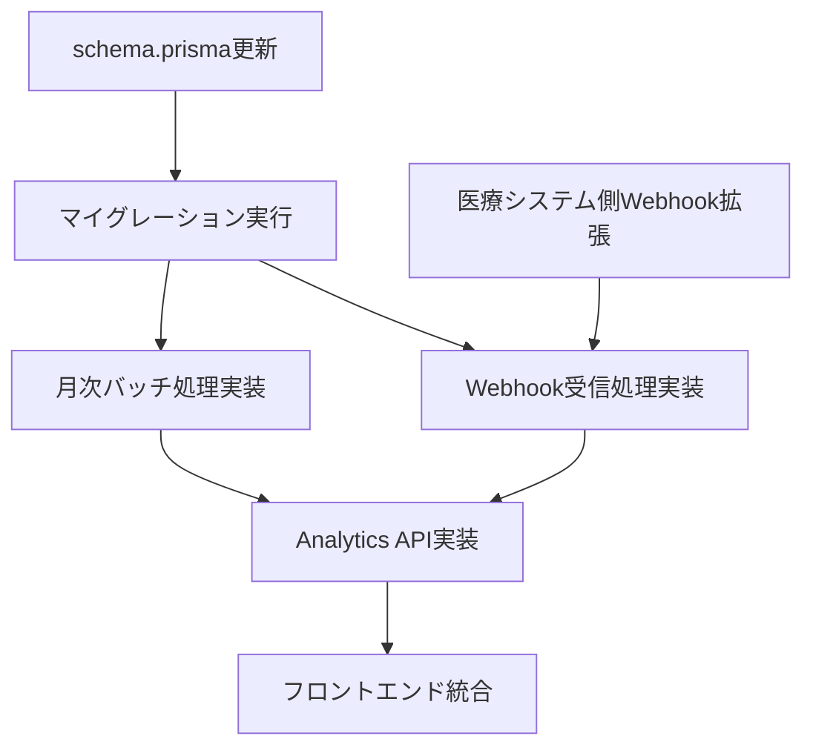

# AnalyticsFunctionsPage 暫定マスターリスト

**作成日**: 2025年10月26日
**Phase**: Phase 2.6 準備
**目的**: AnalyticsFunctionsPage実装のための不足項目チェックリスト

---

## 📌 実装ステータス凡例

- ✅ **実装済み** - 既にコードベースに存在
- 🔄 **実装中** - 現在作業中
- ⏳ **未実装** - これから実装が必要
- ❓ **確認必要** - 医療システムチームへの確認が必要
- ⚠️ **ブロッカー** - 他の作業の前提条件

---

## 1. データベーススキーマ

### 1.1 Userテーブル拡張

| フィールド名 | 型 | 必須 | デフォルト | ステータス | 優先度 | 備考 |
|------------|---|------|-----------|-----------|--------|------|
| `profession` | String? | No | null | ⏳ 未実装 | 🔴 高 | 職種（看護師、医師、薬剤師、等） |
| `hierarchyLevel` | String? | No | null | ⏳ 未実装 | 🔴 高 | 役職階層（一般職員、主任、師長、部長、等） |
| `facilityId` | String? | No | null | ⏳ 未実装 | 🔴 高 | 所属施設ID（Facilityテーブルへの外部キー） |
| `birthYear` | Int? | No | null | ⏳ 未実装 | 🟡 中 | 生年（世代計算用） |
| `lastActiveAt` | DateTime? | No | null | ⏳ 未実装 | 🔴 高 | 最終活動日時（アクティブユーザー判定用） |
| `activityScore` | Float | No | 0 | ⏳ 未実装 | 🟢 低 | アクティビティスコア（計算フィールド） |

**リレーション追加**:
```prisma
model User {
  // 既存フィールド...

  facility         Facility? @relation(fields: [facilityId], references: [id])
  activityLogs     UserActivityLog[]
}
```

**マイグレーション**:
```bash
npx prisma migrate dev --name add_analytics_fields_to_user
```

---

### 1.2 Facilityテーブル（新規作成）

| フィールド名 | 型 | 必須 | デフォルト | ステータス | 優先度 | 備考 |
|------------|---|------|-----------|-----------|--------|------|
| `id` | String | Yes | cuid() | ⏳ 未実装 | 🔴 高 | プライマリキー |
| `facilityCode` | String | Yes | - | ⏳ 未実装 | 🔴 高 | 医療システムの施設コード（ユニーク） |
| `facilityName` | String | Yes | - | ⏳ 未実装 | 🔴 高 | 施設名 |
| `facilityType` | String? | No | null | ⏳ 未実装 | 🟢 低 | 施設種別（病院、クリニック、等） |
| `region` | String? | No | null | ⏳ 未実装 | 🟢 低 | 地域 |
| `syncStatus` | SyncStatus | No | never_synced | ⏳ 未実装 | 🟡 中 | 同期ステータス |
| `lastSyncedAt` | DateTime? | No | null | ⏳ 未実装 | 🟡 中 | 最終同期日時 |
| `syncErrorMessage` | String? | No | null | ⏳ 未実装 | 🟢 低 | 同期エラーメッセージ |

**リレーション**:
```prisma
model Facility {
  users             User[]
}
```

**インデックス**:
```prisma
@@index([facilityCode])
```

**マイグレーション**:
```bash
npx prisma migrate dev --name create_facility_table
```

---

### 1.3 MonthlyAnalyticsテーブル（新規作成）

| フィールド名 | 型 | 必須 | デフォルト | ステータス | 優先度 | 備考 |
|------------|---|------|-----------|-----------|--------|------|
| `id` | String | Yes | cuid() | ⏳ 未実装 | 🔴 高 | プライマリキー |
| `month` | String | Yes | - | ⏳ 未実装 | 🔴 高 | YYYY-MM形式 |
| `facilityId` | String? | No | null | ⏳ 未実装 | 🔴 高 | 施設別（nullは全社） |
| `departmentId` | String? | No | null | ⏳ 未実装 | 🟡 中 | 部門別（nullは全社） |
| `totalUsers` | Int | No | 0 | ⏳ 未実装 | 🔴 高 | 総ユーザー数 |
| `activeUsers` | Int | No | 0 | ⏳ 未実装 | 🔴 高 | アクティブユーザー数 |
| `newUsers` | Int | No | 0 | ⏳ 未実装 | 🟢 低 | 新規ユーザー数 |
| `totalPosts` | Int | No | 0 | ⏳ 未実装 | 🔴 高 | 総投稿数 |
| `totalVotes` | Int | No | 0 | ⏳ 未実装 | 🔴 高 | 総投票数 |
| `totalFeedbacks` | Int | No | 0 | ⏳ 未実装 | 🟡 中 | 総フィードバック数 |
| `totalProjects` | Int | No | 0 | ⏳ 未実装 | 🔴 高 | 総プロジェクト数 |
| `completedProjects` | Int | No | 0 | ⏳ 未実装 | 🔴 高 | 完了プロジェクト数 |
| `postsPerUser` | Float? | No | null | ⏳ 未実装 | 🟡 中 | 1人あたり投稿数 |
| `votesPerUser` | Float? | No | null | ⏳ 未実装 | 🟡 中 | 1人あたり投票数 |
| `engagementScore` | Float? | No | null | ⏳ 未実装 | 🟡 中 | エンゲージメントスコア |

**ユニーク制約**:
```prisma
@@unique([month, facilityId, departmentId])
```

**インデックス**:
```prisma
@@index([month])
@@index([facilityId])
@@index([departmentId])
```

**マイグレーション**:
```bash
npx prisma migrate dev --name create_monthly_analytics_table
```

---

### 1.4 UserActivityLogテーブル（新規作成）

| フィールド名 | 型 | 必須 | デフォルト | ステータス | 優先度 | 備考 |
|------------|---|------|-----------|-----------|--------|------|
| `id` | String | Yes | cuid() | ⏳ 未実装 | 🟡 中 | プライマリキー |
| `userId` | String | Yes | - | ⏳ 未実装 | 🟡 中 | ユーザーID（外部キー） |
| `activityType` | String | Yes | - | ⏳ 未実装 | 🟡 中 | 活動タイプ（post, vote, feedback, project, survey） |
| `activityId` | String | Yes | - | ⏳ 未実装 | 🟡 中 | 活動対象のID |
| `timestamp` | DateTime | No | now() | ⏳ 未実装 | 🟡 中 | 活動日時 |

**リレーション**:
```prisma
model UserActivityLog {
  user              User @relation(fields: [userId], references: [id], onDelete: Cascade)
}
```

**インデックス**:
```prisma
@@index([userId, timestamp])
@@index([activityType])
```

**用途**: `User.lastActiveAt` の自動更新、アクティブユーザー判定

**マイグレーション**:
```bash
npx prisma migrate dev --name create_user_activity_log_table
```

---

### 1.5 Projectテーブル拡張

| フィールド名 | 型 | 必須 | デフォルト | ステータス | 優先度 | 備考 |
|------------|---|------|-----------|-----------|--------|------|
| `implementationStatus` | String | No | 'proposed' | ⏳ 未実装 | 🔴 高 | 実装状況（proposed, approved, implementing, implemented, rejected） |
| `estimatedCostSavings` | Float? | No | null | ⏳ 未実装 | 🟡 中 | 推定コスト削減額（円） |
| `actualCostSavings` | Float? | No | null | ⏳ 未実装 | 🟡 中 | 実際のコスト削減額（円） |
| `implementedAt` | DateTime? | No | null | ⏳ 未実装 | 🟡 中 | 実装完了日 |
| `roiScore` | Float? | No | null | ⏳ 未実装 | 🟢 低 | ROIスコア |

**マイグレーション**:
```bash
npx prisma migrate dev --name add_roi_fields_to_project
```

---

## 2. Webhook拡張

### 2.1 医療システム側（確認必要）

| Webhookイベント | ペイロード拡張 | ステータス | 優先度 | 備考 |
|---------------|-------------|-----------|--------|------|
| `employee.created` | profession, hierarchyLevel, facilityId, birthYear | ❓ 確認必要 | 🔴 高 | 新規職員登録時 |
| `employee.updated` | profession, hierarchyLevel, facilityId, birthYear | ❓ 確認必要 | 🔴 高 | 職員情報更新時 |
| `employee.transferred` | oldDepartment, newDepartment, oldFacilityId, newFacilityId | ❓ 確認必要 | 🟡 中 | 異動時（新規イベント） |
| `facility.created` | facilityCode, facilityName, facilityType, region | ❓ 確認必要 | 🔴 高 | 施設マスタ同期用 |
| `facility.updated` | facilityCode, facilityName, facilityType, region | ❓ 確認必要 | 🟡 中 | 施設情報更新時 |

**拡張ペイロード例**:
```typescript
interface EmployeeUpdatedPayload {
  // 既存
  employeeId: string;
  name: string;
  email: string;
  department: string;

  // 新規（追加リクエスト）
  profession: string;           // 職種
  hierarchyLevel: string;       // 役職階層
  facilityId: string;           // 施設ID
  facilityName: string;         // 施設名
  birthYear: number;            // 生年
  age: number;                  // 年齢
}
```

**確認タスク**:
- [ ] 医療システムチームにWebhook拡張リクエストを送信
- [ ] ステージング環境でのテスト日程調整
- [ ] Webhook仕様書の更新版を受領

---

### 2.2 VoiceDrive側（実装必要）

| 処理内容 | ファイル | ステータス | 優先度 | 備考 |
|---------|---------|-----------|--------|------|
| Facility同期処理 | `src/pages/api/webhooks/medical-system.ts` | ⏳ 未実装 | 🔴 高 | upsert処理 |
| User拡張フィールド更新 | `src/pages/api/webhooks/medical-system.ts` | ⏳ 未実装 | 🔴 高 | profession, hierarchyLevel, facilityId等 |
| 世代分類計算 | `src/utils/generationCalculator.ts` | ⏳ 未実装 | 🟡 中 | birthYearから世代を計算 |
| 異動イベント処理 | `src/pages/api/webhooks/medical-system.ts` | ⏳ 未実装 | 🟢 低 | employee.transferred |

**実装例**:
```typescript
// src/utils/generationCalculator.ts
export function getGeneration(birthYear: number): string {
  const currentYear = new Date().getFullYear();
  const age = currentYear - birthYear;

  if (age <= 27) return 'Z世代';        // 1997年以降
  if (age <= 43) return 'ミレニアル';    // 1981-1996
  if (age <= 59) return 'X世代';        // 1965-1980
  return 'ベビーブーマー';               // 1964年以前
}
```

---

## 3. API エンドポイント

### 3.1 VoiceDrive側（実装必要）

#### Priority 1: Level 3機能（部門レベル）

| エンドポイント | メソッド | 説明 | ステータス | 優先度 | ファイルパス |
|--------------|---------|------|-----------|--------|------------|
| `/api/analytics/department/:deptId/users` | GET | 部門ユーザー分析 | ⏳ 未実装 | 🔴 高 | `src/pages/api/analytics/department/[deptId]/users.ts` |
| `/api/analytics/department/:deptId/generations` | GET | 部門世代間分析 | ⏳ 未実装 | 🔴 高 | `src/pages/api/analytics/department/[deptId]/generations.ts` |

**レスポンス例** (`/users`):
```typescript
{
  success: true,
  data: {
    totalUsers: 23,
    activeUsers: 20,
    activeRate: 87.0,
    userPerformances: [
      {
        userId: "user_123",
        userName: "山田太郎",
        totalPosts: 25,
        totalVotes: 42,
        totalFeedbacks: 8,
        activityScore: 129,
        lastActiveAt: "2025-10-25T10:30:00Z"
      },
      // ...
    ]
  }
}
```

#### Priority 2: Level 5機能（施設レベル）

| エンドポイント | メソッド | 説明 | ステータス | 優先度 | ファイルパス |
|--------------|---------|------|-----------|--------|------------|
| `/api/analytics/facility/:facilityId/hierarchy` | GET | 施設階層間分析 | ⏳ 未実装 | 🟡 中 | `src/pages/api/analytics/facility/[facilityId]/hierarchy.ts` |
| `/api/analytics/facility/:facilityId/professions` | GET | 施設職種間分析 | ⏳ 未実装 | 🟡 中 | `src/pages/api/analytics/facility/[facilityId]/professions.ts` |

#### Priority 3: Level 10機能（全社レベル）

| エンドポイント | メソッド | 説明 | ステータス | 優先度 | ファイルパス |
|--------------|---------|------|-----------|--------|------------|
| `/api/analytics/all-facilities` | GET | 全施設分析 | ⏳ 未実装 | 🟡 中 | `src/pages/api/analytics/all-facilities.ts` |
| `/api/analytics/executive-report` | GET | エグゼクティブレポート | ⏳ 未実装 | 🟡 中 | `src/pages/api/analytics/executive-report.ts` |
| `/api/analytics/monthly-trends` | GET | 月次トレンド | ⏳ 未実装 | 🟡 中 | `src/pages/api/analytics/monthly-trends.ts` |

---

### 3.2 医療システム側（確認必要）

| エンドポイント | メソッド | 説明 | ステータス | 優先度 | 備考 |
|--------------|---------|------|-----------|--------|------|
| `/api/voicedrive/facilities` | GET | 施設マスタ取得 | ❓ 確認必要 | 🔴 高 | 全施設リスト取得 |
| `/api/voicedrive/employee-satisfaction` | GET | 従業員満足度調査結果 | ❓ 確認必要 | 🟡 中 | エグゼクティブレポート用 |
| `/api/voicedrive/organization-hierarchy` | GET | 組織階層マスタ | ❓ 確認必要 | 🟡 中 | 階層間分析用 |

**リクエスト例** (`/facilities`):
```http
GET /api/voicedrive/facilities
Authorization: Bearer {API_KEY}
```

**期待レスポンス**:
```json
{
  "success": true,
  "data": [
    {
      "facilityId": "FAC001",
      "facilityName": "中央病院",
      "facilityType": "病院",
      "region": "東京都"
    },
    {
      "facilityId": "FAC002",
      "facilityName": "西クリニック",
      "facilityType": "クリニック",
      "region": "神奈川県"
    }
  ]
}
```

**確認タスク**:
- [ ] 医療システムチームに新規API提供をリクエスト
- [ ] API仕様書のドラフトを受領
- [ ] ステージング環境でのテスト実施

---

## 4. バッチ処理

### 4.1 月次集計バッチ

| スクリプト名 | 説明 | ステータス | 優先度 | ファイルパス |
|------------|------|-----------|--------|------------|
| `monthly-analytics-batch.ts` | 月次集計データ作成 | ⏳ 未実装 | 🔴 高 | `src/scripts/monthly-analytics-batch.ts` |
| `update-activity-scores.ts` | ユーザーのactivityScore更新 | ⏳ 未実装 | 🟡 中 | `src/scripts/update-activity-scores.ts` |
| `sync-facilities.ts` | 施設マスタ同期 | ⏳ 未実装 | 🔴 高 | `src/scripts/sync-facilities.ts` |

**実行スケジュール**:
```json
// package.json
{
  "scripts": {
    "analytics:monthly": "npx tsx src/scripts/monthly-analytics-batch.ts",
    "analytics:update-scores": "npx tsx src/scripts/update-activity-scores.ts",
    "analytics:sync-facilities": "npx tsx src/scripts/sync-facilities.ts"
  }
}
```

**Cron設定** (Vercel Cron):
```json
// vercel.json
{
  "crons": [
    {
      "path": "/api/cron/monthly-analytics",
      "schedule": "0 0 1 * *"
    },
    {
      "path": "/api/cron/update-activity-scores",
      "schedule": "0 2 * * *"
    }
  ]
}
```

---

### 4.2 リアルタイム更新処理

| 処理内容 | トリガー | ステータス | 優先度 | ファイルパス |
|---------|---------|-----------|--------|------------|
| `lastActiveAt` 更新 | Post/Vote/Feedback作成時 | ⏳ 未実装 | 🔴 高 | 各API内のafter-create hook |
| `UserActivityLog` 記録 | 全活動 | ⏳ 未実装 | 🟡 中 | `src/middleware/activityLogger.ts` |
| `activityScore` 再計算 | 活動発生時 | ⏳ 未実装 | 🟢 低 | バッチ処理で十分 |

**実装例** (Post作成時):
```typescript
// src/pages/api/posts/index.ts
const newPost = await prisma.post.create({
  data: { ... }
});

// lastActiveAt更新
await prisma.user.update({
  where: { id: authorId },
  data: { lastActiveAt: new Date() }
});

// ActivityLog記録
await prisma.userActivityLog.create({
  data: {
    userId: authorId,
    activityType: 'post',
    activityId: newPost.id
  }
});
```

---

## 5. フロントエンド

### 5.1 AnalyticsFunctionsPage更新

| 変更箇所 | 説明 | ステータス | 優先度 | 行番号 |
|---------|------|-----------|--------|--------|
| デモデータ削除 | ハードコードされた `users` 配列削除 | ⏳ 未実装 | 🔴 高 | 54-70 |
| API呼び出し追加 | `useEffect`でAnalytics API呼び出し | ⏳ 未実装 | 🔴 高 | - |
| ローディング状態 | `useState`でloading管理 | ⏳ 未実装 | 🔴 高 | - |
| エラーハンドリング | API失敗時のフォールバック | ⏳ 未実装 | 🔴 高 | - |
| 権限チェック | `userPermissionLevel`に基づくタブ表示 | ✅ 実装済み | - | 82-104 |

**実装例**:
```typescript
// Before: デモデータ
const users = [
  { name: '山田太郎', active: true, posts: 25, votes: 42 },
  // ...
];

// After: API呼び出し
const [departmentAnalytics, setDepartmentAnalytics] = useState(null);
const [loading, setLoading] = useState(true);
const [error, setError] = useState(null);

useEffect(() => {
  async function fetchDepartmentAnalytics() {
    try {
      const response = await fetch(`/api/analytics/department/${currentUser.department}/users`);
      if (!response.ok) throw new Error('Failed to fetch analytics');
      const data = await response.json();
      setDepartmentAnalytics(data.data);
    } catch (err) {
      setError(err.message);
    } finally {
      setLoading(false);
    }
  }

  fetchDepartmentAnalytics();
}, [currentUser.department]);
```

---

### 5.2 新規コンポーネント作成

| コンポーネント名 | 説明 | ステータス | 優先度 | ファイルパス |
|---------------|------|-----------|--------|------------|
| `GenerationChart` | 世代別分布グラフ | ⏳ 未実装 | 🟡 中 | `src/components/analytics/GenerationChart.tsx` |
| `FacilityComparisonTable` | 施設比較テーブル | ⏳ 未実装 | 🟡 中 | `src/components/analytics/FacilityComparisonTable.tsx` |
| `ExecutiveKPICard` | エグゼクティブKPIカード | ⏳ 未実装 | 🟢 低 | `src/components/analytics/ExecutiveKPICard.tsx` |
| `MonthlyTrendChart` | 月次トレンドグラフ | ⏳ 未実装 | 🟢 低 | `src/components/analytics/MonthlyTrendChart.tsx` |

---

## 6. ユーティリティ関数

| 関数名 | 説明 | ステータス | 優先度 | ファイルパス |
|-------|------|-----------|--------|------------|
| `getGeneration()` | 生年から世代分類 | ⏳ 未実装 | 🔴 高 | `src/utils/generationCalculator.ts` |
| `calculateActivityScore()` | アクティビティスコア計算 | ⏳ 未実装 | 🟡 中 | `src/utils/activityScore.ts` |
| `calculateEngagementScore()` | エンゲージメントスコア計算 | ⏳ 未実装 | 🟡 中 | `src/utils/engagementScore.ts` |
| `isActiveUser()` | アクティブユーザー判定 | ⏳ 未実装 | 🔴 高 | `src/utils/userActivity.ts` |

**実装例**:
```typescript
// src/utils/generationCalculator.ts
export function getGeneration(birthYear: number): string {
  const currentYear = new Date().getFullYear();
  const age = currentYear - birthYear;

  if (age <= 27) return 'Z世代';
  if (age <= 43) return 'ミレニアル';
  if (age <= 59) return 'X世代';
  return 'ベビーブーマー';
}

// src/utils/userActivity.ts
export function isActiveUser(lastActiveAt: Date | null): boolean {
  if (!lastActiveAt) return false;
  const thirtyDaysAgo = new Date(Date.now() - 30 * 24 * 60 * 60 * 1000);
  return lastActiveAt >= thirtyDaysAgo;
}

// src/utils/activityScore.ts
export function calculateActivityScore(posts: number, votes: number, feedbacks: number): number {
  return posts * 3 + votes + feedbacks * 2;
}
```

---

## 7. テスト

### 7.1 ユニットテスト

| テストファイル | 説明 | ステータス | 優先度 |
|-------------|------|-----------|--------|
| `generationCalculator.test.ts` | 世代分類ロジック | ⏳ 未実装 | 🟡 中 |
| `activityScore.test.ts` | アクティビティスコア計算 | ⏳ 未実装 | 🟢 低 |
| `analytics-api.test.ts` | Analytics API | ⏳ 未実装 | 🔴 高 |

---

### 7.2 統合テスト

| テストシナリオ | 説明 | ステータス | 優先度 |
|-------------|------|-----------|--------|
| Webhook→DB同期 | 医療システムWebhook受信→DB更新 | ⏳ 未実装 | 🔴 高 |
| Analytics API | 各API呼び出し→正しいデータ返却 | ⏳ 未実装 | 🔴 高 |
| 月次バッチ | バッチ実行→MonthlyAnalytics作成 | ⏳ 未実装 | 🟡 中 |

---

## 8. ドキュメント

| ドキュメント名 | 説明 | ステータス | 優先度 |
|-------------|------|-----------|--------|
| `AnalyticsFunctionsPage_DB要件分析_20251026.md` | DB要件分析書 | ✅ 作成済み | - |
| `AnalyticsFunctionsPage暫定マスターリスト_20251026.md` | 本ドキュメント | ✅ 作成済み | - |
| `Analytics_API仕様書.md` | Analytics API仕様 | ⏳ 未作成 | 🟡 中 |
| `月次バッチ処理仕様書.md` | バッチ処理仕様 | ⏳ 未作成 | 🟢 低 |

---

## 9. 医療システムチームへの確認事項

### 9.1 Webhook拡張リクエスト

**件名**: Phase 2.6 - AnalyticsFunctionsPage実装のためのWebhook拡張依頼

**確認項目**:
- [ ] `employee.created/updated` に `profession`, `hierarchyLevel`, `facilityId`, `birthYear` を追加可能か？
- [ ] 新規イベント `employee.transferred` の提供は可能か？
- [ ] 新規イベント `facility.created/updated` の提供は可能か？
- [ ] ステージング環境でのテスト可能時期は？

---

### 9.2 新規API提供リクエスト

**確認項目**:
- [ ] `GET /api/voicedrive/facilities` - 施設マスタAPI提供は可能か？
- [ ] `GET /api/voicedrive/employee-satisfaction` - 従業員満足度API提供は可能か？
- [ ] `GET /api/voicedrive/organization-hierarchy` - 組織階層API提供は可能か？
- [ ] API仕様書のドラフト提供時期は？

---

## 10. 実装タイムライン（Phase 2.6想定）

| Week | VoiceDrive側作業 | 医療システム側作業 | ステータス |
|------|----------------|------------------|-----------|
| **Week 1** | schema.prisma更新、マイグレーション実行 | Webhook拡張検討 | ⏳ 未開始 |
| **Week 2** | Webhook受信処理実装準備 | Webhook拡張実装 | ⏳ 未開始 |
| **Week 3** | Webhook受信処理実装 | ステージング環境準備 | ⏳ 未開始 |
| **Week 4** | Analytics API実装（Priority 1） | 施設マスタAPI実装 | ⏳ 未開始 |
| **Week 5** | Analytics API実装（Priority 2-3） | API仕様書提供 | ⏳ 未開始 |
| **Week 6** | 月次バッチ処理実装 | - | ⏳ 未開始 |
| **Week 7** | フロントエンド統合、統合テスト | 統合テスト参加 | ⏳ 未開始 |

---

## 11. リスクと依存関係

### 11.1 ブロッカー（⚠️）

| リスク項目 | 影響範囲 | 軽減策 |
|----------|---------|--------|
| 医療システム側Webhook拡張が遅延 | 全機能 | モックデータでUI先行実装 |
| 施設マスタAPIが提供されない | Level 10機能 | VoiceDrive側で施設テーブルを手動管理 |
| DB構築が遅延 | 全機能 | Phase 2.5と並行して準備作業を進める |

---

### 11.2 依存関係



---

## 12. チェックリスト

### Phase 2.6 キックオフ前（今すぐ）

- [ ] schema.prisma更新案を作成
- [ ] マイグレーション計画を立てる
- [ ] 医療システムチームにWebhook拡張リクエストを送信
- [ ] 医療システムチームに新規API提供リクエストを送信

### Week 1

- [ ] schema.prismaにUser拡張フィールド追加
- [ ] Facilityテーブル作成
- [ ] MonthlyAnalyticsテーブル作成
- [ ] UserActivityLogテーブル作成
- [ ] Projectテーブル拡張
- [ ] マイグレーション実行
- [ ] `getGeneration()` ユーティリティ関数実装

### Week 2-3

- [ ] Webhook受信処理にFacility同期追加
- [ ] Webhook受信処理にUser拡張フィールド更新追加
- [ ] 世代分類自動計算追加

### Week 4

- [ ] `/api/analytics/department/:deptId/users` 実装
- [ ] `/api/analytics/department/:deptId/generations` 実装
- [ ] フロントエンドからのAPI呼び出し実装（Level 3タブ）

### Week 5

- [ ] `/api/analytics/facility/:facilityId/hierarchy` 実装
- [ ] `/api/analytics/facility/:facilityId/professions` 実装
- [ ] `/api/analytics/all-facilities` 実装
- [ ] `/api/analytics/executive-report` 実装
- [ ] フロントエンドからのAPI呼び出し実装（Level 5/10タブ）

### Week 6

- [ ] `monthly-analytics-batch.ts` 実装
- [ ] `update-activity-scores.ts` 実装
- [ ] `sync-facilities.ts` 実装
- [ ] Vercel Cron設定

### Week 7

- [ ] AnalyticsFunctionsPageのデモデータ削除
- [ ] ローディング状態・エラーハンドリング追加
- [ ] 統合テスト実施
- [ ] ドキュメント更新

---

## 13. 次のアクション（優先順位順）

### 🔴 最優先（今すぐ）

1. **医療システムチームへの確認依頼送信**
   - Webhook拡張リクエスト
   - 新規API提供リクエスト

2. **schema.prisma更新準備**
   - User拡張フィールド追加
   - Facilityテーブル作成
   - MonthlyAnalyticsテーブル作成

### 🟡 高優先（Week 1-2）

3. **マイグレーション実行**
4. **ユーティリティ関数実装** (`getGeneration()`, `isActiveUser()`)
5. **Webhook受信処理拡張**

### 🟢 中優先（Week 3-5）

6. **Analytics API実装**（Priority 1 → 2 → 3）
7. **フロントエンド統合**
8. **月次バッチ処理実装**

---

**最終更新**: 2025年10月26日
**次回レビュー**: Phase 2.6キックオフMTG後
