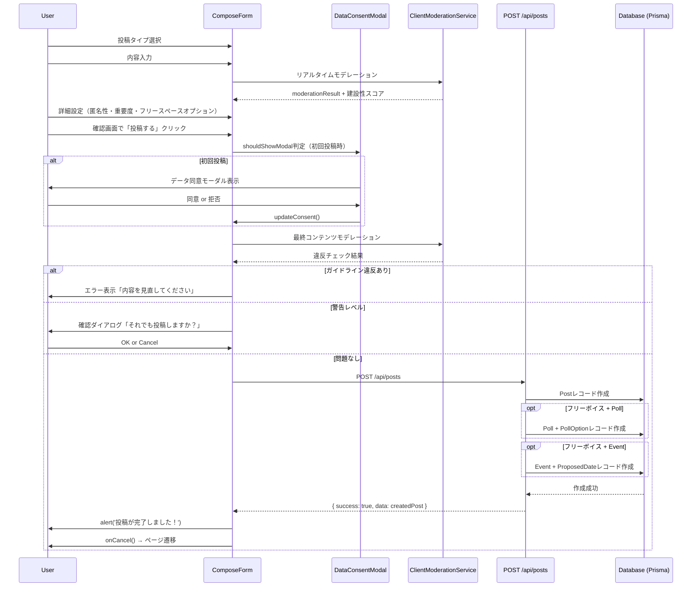
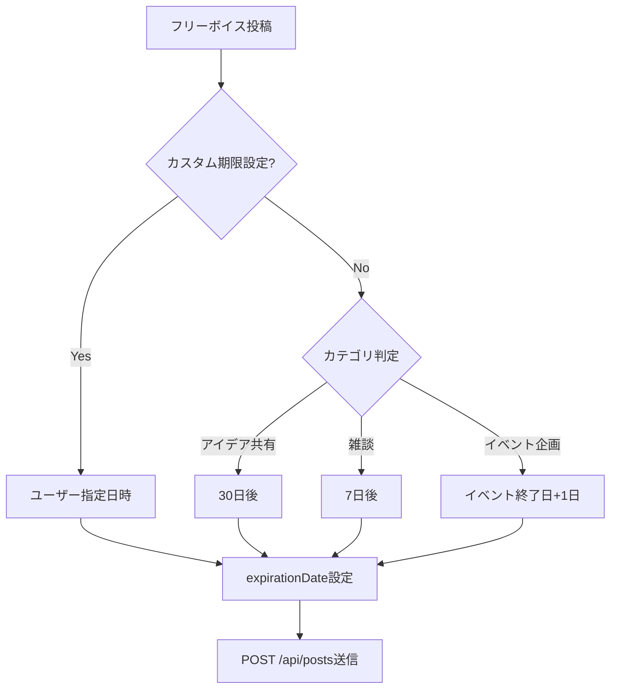

# ComposePage DB要件分析

**作成日**: 2025年10月26日
**対象ページ**: ComposePage
**URL**: https://voicedrive-v100.vercel.app/compose/:type
**Phase**: Phase 2.x（投稿機能統合）

---

## 📋 エグゼクティブサマリー

ComposePageは、VoiceDriveの3種類の投稿（アイデアボイス・フリーボイス・コンプライアンス窓口）を作成する統一フォームです。このページのデータは100% VoiceDriveが管理し、医療システムとの連携は不要です。

### 主要な発見
- ✅ **DB要件**: Post/Poll/Eventモデルは既に実装済み、スキーマ変更不要
- ❌ **API不足**: POST /api/posts エンドポイントが未実装
- 🟡 **データ同意**: 初回投稿時のデータ同意モーダル（useDataConsent）の実装確認が必要

---

## 🔍 ページ機能分析

### 1. ページ概要

**URL構造**:
- `/compose/improvement` - アイデアボイス（改善提案）
- `/compose/community` - フリーボイス（情報共有・雑談）
- `/compose/report` - コンプライアンス窓口（内部通報）

**主な機能**:
1. **投稿タイプ選択** (improvementのみ)
   - 4種類の提案タイプ（業務改善・コミュニケーション・イノベーション・戦略的提案）
2. **内容入力**
   - テキストエリア（500文字制限）
   - リアルタイムコンテンツモデレーション
   - 建設性スコア表示
3. **詳細設定**
   - 重要度選択（低・中・高・緊急）※improvementのみ
   - 匿名性レベル選択（5段階）
   - フリースペースオプション（communityのみ）
     - カテゴリ選択（アイデア共有・雑談・イベント企画）
     - スコープ選択（チーム・部署・施設・組織）
     - 投票機能（Poll）
     - イベント企画機能（Event）
     - 有効期限設定
4. **確認画面**
   - 投稿内容プレビュー
   - 最終確認後の投稿実行

### 2. ステップフロー

#### アイデアボイス（improvement）- 4ステップ
1. **提案タイプ選択** - 業務改善/コミュニケーション/イノベーション/戦略的提案
2. **内容入力** - テキスト入力 + モデレーション
3. **詳細設定** - 重要度 + 匿名性レベル
4. **確認** - プレビュー + 投稿実行

#### フリーボイス（community）- 3ステップ
1. **内容入力** - テキスト入力 + モデレーション
2. **詳細設定** - フリースペースオプション（カテゴリ・スコープ・Poll・Event・期限）+ 匿名性レベル
3. **確認** - プレビュー + 投稿実行

#### コンプライアンス窓口（report）- 3ステップ
1. **内容入力** - テキスト入力 + モデレーション
2. **詳細設定** - 重要度（デフォルト: medium）+ 匿名性（強制: anonymous）
3. **確認** - プレビュー + 投稿実行

---

## 📊 データ要件分析

### 投稿タイプ別のデータ項目

| データ項目 | improvement | community | report | データ型 | 必須 |
|-----------|-------------|-----------|--------|---------|------|
| **基本情報** | | | | | |
| type | ✓ | ✓ | ✓ | String | ✓ |
| content | ✓ | ✓ | ✓ | String | ✓ |
| authorId | ✓ | ✓ | ✓ | String | ✓ |
| anonymityLevel | ✓ | ✓ | ✓ | String | ✓ |
| season | ✓ | ✓ | - | String | - |
| moderationScore | ✓ | ✓ | ✓ | Int | - |
| **improvement専用** | | | | | |
| proposalType | ✓ | - | - | String | - |
| priority | ✓ | - | ✓ | String | - |
| **community専用** | | | | | |
| freespaceCategory | - | ✓ | - | String | - |
| freespaceScope | - | ✓ | - | String | - |
| expirationDate | - | ✓ | - | DateTime | - |
| pollData（別テーブル） | - | ✓ | - | Poll | - |
| eventData（別テーブル） | - | ✓ | - | Event | - |

### Postモデルのマッピング

#### Prisma schema検証結果: ✅ **スキーマ変更不要**

ComposeFormから送信されるすべてのデータ項目は、既存のPostモデルでカバーされています。

```prisma
model Post {
  id                  String    @id @default(cuid())
  type                String    // 'improvement' | 'community' | 'report'
  content             String    // 投稿内容
  authorId            String    // 投稿者ID
  anonymityLevel      String    // 匿名性レベル
  proposalType        String?   // improvement専用
  priority            String?   // improvement/report用
  freespaceCategory   String?   // community専用
  freespaceScope      String?   // community専用
  expirationDate      DateTime? // community専用
  season              String?   // 季節情報
  moderationScore     Int?      // コンテンツモデレーションスコア
  createdAt           DateTime  @default(now())
  updatedAt           DateTime  @updatedAt
  // ...その他のフィールド
}
```

#### Pollモデル（community専用）

```prisma
model Poll {
  id            String   @id @default(cuid())
  postId        String   @unique
  question      String
  description   String?
  totalVotes    Int      @default(0)
  deadline      DateTime
  isActive      Boolean  @default(true)
  allowMultiple Boolean  @default(false)
  showResults   String
  category      String
  scope         String
  createdById   String
  // ...リレーション
}

model PollOption {
  id        String @id @default(cuid())
  pollId    String
  text      String
  emoji     String?
  votes     Int    @default(0)
  sortOrder Int    @default(0)
}
```

#### Eventモデル（community専用）

```prisma
model Event {
  id                   String    @id @default(cuid())
  postId               String    @unique
  title                String
  description          String
  type                 String
  registrationDeadline DateTime?
  finalDate            DateTime?
  finalStartTime       String?
  finalEndTime         String?
  organizerId          String
  maxParticipants      Int?
  venueName            String?
  venueAddress         String?
  cost                 Float?
  status               String    @default("planning")
  // ...リレーション
}

model ProposedDate {
  id        String   @id @default(cuid())
  eventId   String
  date      DateTime
  startTime String
  endTime   String
  votes     Int      @default(0)
}
```

---

## 🔄 データフロー

### 投稿作成フロー



### 有効期限自動計算（フリーボイス専用）



---

## 🎯 データ管理責任分界点

### データ所有者: 100% VoiceDrive

ComposePageで作成されるすべてのデータは**VoiceDrive単独管理**です。

| データカテゴリ | 所有者 | 理由 |
|--------------|--------|------|
| 投稿（Post） | VoiceDrive | VoiceDrive独自の投稿システム |
| 投票（Poll） | VoiceDrive | フリーボイス専用機能 |
| イベント（Event） | VoiceDrive | フリーボイス専用機能 |
| コンテンツモデレーション | VoiceDrive | クライアントサイド処理、DBには建設性スコアのみ保存 |
| データ同意ステータス | VoiceDrive | ユーザーの同意管理（UserConsentテーブル） |

### 医療システムとの連携: 不要

- **投稿データ**: 医療システムへの同期不要
- **ユーザー情報**: authorIdのみ、医療システムのemployeeIdとは独立
- **Webhook**: 不要

---

## ❌ 不足項目の洗い出し

### 1. 不足API

| エンドポイント | メソッド | 機能 | 状態 |
|--------------|---------|------|------|
| `/api/posts` | POST | 投稿作成 | ❌ **未実装** |

**実装要件 - POST /api/posts**:

```typescript
// リクエストボディ
{
  // 基本情報
  type: 'improvement' | 'community' | 'report',
  content: string,
  anonymityLevel: string,

  // improvement専用
  proposalType?: 'operational' | 'communication' | 'innovation' | 'strategic',
  priority?: 'low' | 'medium' | 'high' | 'urgent',

  // community専用
  freespaceCategory?: 'idea_sharing' | 'casual_discussion' | 'event_planning',
  freespaceScope?: 'SAME_DEPARTMENT' | 'SAME_FACILITY' | 'ORGANIZATION_WIDE',
  expirationDate?: string (ISO 8601),
  pollData?: {
    question: string,
    description?: string,
    options: Array<{ text: string, emoji?: string }>,
    deadline: string (ISO 8601),
    allowMultiple: boolean,
    showResults: 'always' | 'after_voting' | 'after_deadline',
    category: string,
    scope: string
  },
  eventData?: {
    title: string,
    description: string,
    type: string,
    proposedDates: Array<{ date: string, startTime: string, endTime: string }>,
    maxParticipants?: number,
    venueName?: string,
    venueAddress?: string,
    cost?: number,
    requirements?: any,
    visibility: string
  },

  // メタデータ
  season: string,
  moderationScore: number
}

// レスポンス
{
  success: boolean,
  data: {
    id: string,
    type: string,
    content: string,
    authorId: string,
    anonymityLevel: string,
    createdAt: string,
    // ...その他のフィールド
  },
  message?: string
}
```

**実装箇所**: `src/routes/apiRoutes.ts` または新規 `src/routes/postRoutes.ts`

### 2. 不足フィールド

Prisma schemaの検証結果: ✅ **すべて既存フィールドでカバー済み**

### 3. 不足テーブル

✅ **すべて実装済み**:
- Post
- Poll + PollOption + PollVote
- Event + ProposedDate + Participant

### 4. 確認が必要な項目

| 項目 | 現状 | 確認内容 |
|------|------|---------|
| DataConsentModal | useDataConsent hookあり | UserConsentテーブルの実装確認 |
| ClientModerationService | サービス実装あり | moderationScoreのDB保存確認 |
| SeasonalCapacityIndicator | コンポーネントあり | 季節別の投稿上限機能の確認 |

---

## 🔐 セキュリティ要件

### 1. コンテンツモデレーション

**実装箇所**: `src/services/ClientModerationService.ts`

```typescript
class ClientModerationService {
  // リアルタイムチェック（300ms debounce）
  checkContentRealtime(content: string, callback: (result: ModerationResult) => void): void

  // 違反検知
  moderateContent(content: string, title?: string): ModerationResult

  // 建設性スコア計算（0-100）
  assessConstructiveness(content: string): number

  // 代替表現提案
  suggestAlternatives(phrase: string): string[]

  // 改善提案生成
  generateImprovementSuggestions(content: string, violations: Violation[]): string[]
}
```

**違反レベル**:
- `critical`: 投稿ブロック（ハラスメント・個人攻撃・法的リスク）
- `high`: 警告表示
- `medium`: 注意喚起
- `low`: 改善提案のみ

### 2. 匿名性レベル

| レベル | 表示内容 | 制限 |
|--------|---------|------|
| `real_name` | 実名 + 部署 + 職種 | - |
| `facility_department` | 施設名 + 部署名 | - |
| `facility_anonymous` | 施設名 + 匿名 | - |
| `department_only` | 部署名のみ | - |
| `anonymous` | 完全匿名 | report投稿時は強制 |

### 3. データ同意管理

**初回投稿時のモーダル表示**:
- `shouldShowModal`: 初回投稿ユーザーに対してtrue
- `updateConsent()`: 同意/拒否を保存
- `refreshStatus()`: 同意状態をリフレッシュ

**保存内容**:
- analyticsConsent: boolean
- consentDate: DateTime
- userId: string

---

## 📈 パフォーマンス要件

### 1. リアルタイムモデレーション

- **Debounce**: 300ms
- **処理時間**: < 50ms (クライアントサイド)
- **UI影響**: テキスト入力のラグなし

### 2. 投稿作成API

- **レスポンスタイム**: < 500ms
- **同時投稿**: 100req/min想定
- **データサイズ**: content最大500文字

### 3. Poll/Event作成

- **Poll**: 最大20オプション
- **Event**: 最大10個の候補日程
- **同時作成**: Postとトランザクション内で一括作成

---

## 🎨 UI/UX要件

### 1. ステップインジケーター

- improvement: 4ステップ
- community/report: 3ステップ
- 現在ステップを青色ハイライト

### 2. バリデーション

| 項目 | ルール | エラーメッセージ |
|------|--------|----------------|
| content | 最小10文字 | 「次へ」ボタンdisabled |
| content | 最大500文字 | リアルタイム文字数表示 |
| 匿名性レベル | report時はanonymous強制 | 他の選択肢をdisabled |
| コンテンツモデレーション | critical違反 | 「投稿内容にガイドライン違反の可能性があります」 |
| 季節別上限 | 上限到達 | 「{season}期の提案受付上限に達しています」 |

### 3. フィードバック

- **成功**: alert('投稿が完了しました！')
- **エラー**: alert(エラーメッセージ)
- **建設性スコア**: プログレスバー（緑/黄/赤）
- **リアルタイム警告**: 違反項目 + 代替表現提案

---

## 📁 関連ファイル

### コンポーネント
- `src/pages/ComposePage.tsx` - ページコンテナ
- `src/components/ComposeForm.tsx` - メインフォーム
- `src/components/FreespaceOptions.tsx` - フリースペース設定
- `src/components/consent/DataConsentModal.tsx` - データ同意モーダル
- `src/components/SeasonalCapacityIndicator.tsx` - 季節別容量インジケーター
- `src/components/ProposalEchoCard.tsx` - 過去の提案表示

### サービス
- `src/services/ClientModerationService.ts` - コンテンツモデレーション
- `src/services/ContentModerationService.ts` - モデレーションルール
- `src/services/FreespaceExpirationService.ts` - 有効期限計算

### フック
- `src/hooks/useDataConsent.ts` - データ同意管理
- `src/hooks/useSeasonalCapacity.ts` - 季節別容量管理

### 型定義
- `src/types/index.ts` - Post, Priority, AnonymityLevel, ProposalType
- `src/types/poll.ts` - Poll, PollOption, CreatePollData
- `src/types/event.ts` - Event, CreateEventData
- `src/types/visibility.ts` - StakeholderGroup

### 設定
- `src/config/proposalTypes.ts` - 提案タイプ設定

---

## 🚀 次のステップ

### Phase 1: API実装（優先度: 高）

1. **POST /api/posts エンドポイント実装**
   - リクエストバリデーション
   - Postレコード作成
   - Poll/Event同時作成（トランザクション）
   - エラーハンドリング

### Phase 2: データ同意機能確認（優先度: 中）

1. UserConsentテーブルの実装確認
2. useDataConsent hookの動作確認
3. DataConsentModalの統合テスト

### Phase 3: 統合テスト（優先度: 中）

1. 3種類の投稿タイプのE2Eテスト
2. Poll作成フローのテスト
3. Event作成フローのテスト
4. コンテンツモデレーションの精度確認

---

## 📞 連絡先

- **技術的な質問**: VoiceDriveチーム (Slack #voicedrive-dev)
- **ドキュメント共有**: mcp-shared経由

---

**作成日**: 2025年10月26日
**次回レビュー**: API実装完了後
