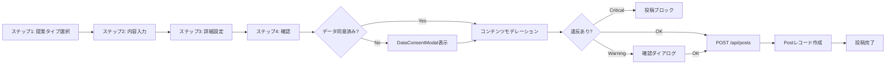
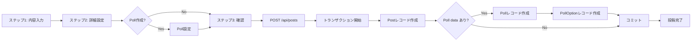
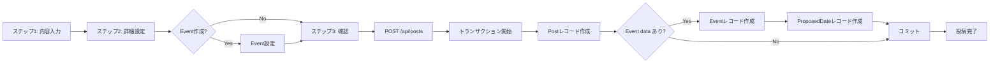

# ComposePage 暫定マスターリスト

**作成日**: 2025年10月26日
**対象ページ**: ComposePage
**Phase**: Phase 2.x（投稿機能統合）

---

## 📋 概要

ComposePageの全データ項目を体系的に整理したマスターリストです。投稿タイプ別（improvement/community/report）に必要なデータ項目、Prisma schemaとのマッピング、UI表示要件を定義します。

---

## 🎯 データ項目一覧

### カテゴリ1: 基本情報（全投稿タイプ共通）

| # | データ項目名 | データ型 | Prisma Field | improvement | community | report | 必須 | デフォルト値 | UI表示場所 |
|---|------------|----------|--------------|-------------|-----------|--------|------|------------|-----------|
| 1 | 投稿ID | String (cuid) | `id` | ✓ | ✓ | ✓ | ✓ | auto | （自動生成） |
| 2 | 投稿タイプ | String | `type` | ✓ | ✓ | ✓ | ✓ | - | URL parameter |
| 3 | 投稿内容 | String (max 500) | `content` | ✓ | ✓ | ✓ | ✓ | - | ステップ2: テキストエリア |
| 4 | 投稿者ID | String | `authorId` | ✓ | ✓ | ✓ | ✓ | (current user) | （自動設定） |
| 5 | 匿名性レベル | String | `anonymityLevel` | ✓ | ✓ | ✓ | ✓ | improvement: `real_name`<br>community: `department_only`<br>report: `anonymous` | ステップ3: 匿名性レベル選択 |
| 6 | 投稿ステータス | String | `status` | ✓ | ✓ | ✓ | - | `active` | （自動設定） |
| 7 | 作成日時 | DateTime | `createdAt` | ✓ | ✓ | ✓ | ✓ | now() | （自動生成） |
| 8 | 更新日時 | DateTime | `updatedAt` | ✓ | ✓ | ✓ | ✓ | now() | （自動更新） |

**データソース**: VoiceDrive単独管理

**バリデーション**:
- content: 最小10文字、最大500文字
- type: `improvement` | `community` | `report`
- anonymityLevel: report投稿時は`anonymous`強制

---

### カテゴリ2: コンテンツモデレーション（全投稿タイプ共通）

| # | データ項目名 | データ型 | Prisma Field | improvement | community | report | 必須 | デフォルト値 | UI表示場所 |
|---|------------|----------|--------------|-------------|-----------|--------|------|------------|-----------|
| 9 | モデレーションステータス | String | `moderationStatus` | ✓ | ✓ | ✓ | - | `pending` | （自動設定） |
| 10 | 建設性スコア | Int (0-100) | `moderationScore` | ✓ | ✓ | ✓ | - | (calculated) | ステップ2: プログレスバー表示 |

**計算ロジ ック**:
- `ClientModerationService.assessConstructiveness(content)`
- スコア70以上: 緑色（良好）
- スコア40-69: 黄色（普通）
- スコア0-39: 赤色（要改善）

**リアルタイムチェック**:
- Debounce: 300ms
- 違反検出時: 警告表示 + 代替表現提案

---

### カテゴリ3: アイデアボイス専用項目

| # | データ項目名 | データ型 | Prisma Field | improvement | community | report | 必須 | デフォルト値 | UI表示場所 |
|---|------------|----------|--------------|-------------|-----------|--------|------|------------|-----------|
| 11 | 提案タイプ | String | `proposalType` | ✓ | - | - | - | `operational` | ステップ1: 提案タイプ選択 |
| 12 | 重要度 | String | `priority` | ✓ | - | ✓ | - | `medium` | ステップ3: 重要度選択 |
| 13 | 季節情報 | String | `season` | ✓ | ✓ | - | - | (calculated) | （自動設定） |
| 14 | 議題スコア | Int | `agendaScore` | ✓ | - | - | - | 0 | （投票後に計算） |
| 15 | 議題レベル | String | `agendaLevel` | ✓ | - | - | - | null | （スコアベースで判定） |

**提案タイプ（proposalType）の選択肢**:
| 値 | ラベル | アイコン | 説明 | 重視される意見 |
|----|--------|---------|------|--------------|
| `operational` | 業務改善 | 🔧 | 日々の業務効率化や負担軽減 | 現場職員60% + 管理職20% |
| `communication` | コミュニケーション | 💬 | 部署間連携や情報共有の改善 | 現場職員50% + ベテラン30% |
| `innovation` | イノベーション | 💡 | 新技術導入や先進的取り組み | Z世代50% + 管理職30% |
| `strategic` | 戦略的提案 | 🎯 | 組織全体の方向性や長期計画 | 管理職50% + ベテラン30% |

**重要度（priority）の選択肢**:
| 値 | ラベル | アイコン | 色 |
|----|--------|---------|-----|
| `low` | 低 | 🟢 | 緑 |
| `medium` | 中 | 🟡 | 黄 |
| `high` | 高 | 🟠 | オレンジ |
| `urgent` | 緊急 | 🔴 | 赤 |

**季節情報（season）**:
- 春季（4-6月）: 新年度対応
- 夏季（7-9月）: 夏季繁忙期
- 秋季（10-12月）: 年度後半改善
- 冬季（1-3月）: 年度末準備

---

### カテゴリ4: フリーボイス専用項目

| # | データ項目名 | データ型 | Prisma Field | improvement | community | report | 必須 | デフォルト値 | UI表示場所 |
|---|------------|----------|--------------|-------------|-----------|--------|------|------------|-----------|
| 16 | フリースペースカテゴリ | String | `freespaceCategory` | - | ✓ | - | - | `casual_discussion` | ステップ2: カテゴリ選択 |
| 17 | フリースペーススコープ | String | `freespaceScope` | - | ✓ | - | - | `SAME_DEPARTMENT` | ステップ2: スコープ選択 |
| 18 | 有効期限 | DateTime | `expirationDate` | - | ✓ | - | - | (calculated) | ステップ2: 期限設定 |
| 19 | 期限切れフラグ | Boolean | `isExpired` | - | ✓ | - | - | false | （自動判定） |
| 20 | 延長リクエスト | Boolean | `extensionRequested` | - | ✓ | - | - | false | （将来機能） |
| 21 | 延長理由 | String | `extensionReason` | - | ✓ | - | - | null | （将来機能） |

**フリースペースカテゴリ（freespaceCategory）の選択肢**:
| 値 | ラベル | アイコン | デフォルト期限 |
|----|--------|---------|--------------|
| `idea_sharing` | アイデア共有 | 💡 | 30日後 |
| `casual_discussion` | 雑談 | 💬 | 7日後 |
| `event_planning` | イベント企画 | 🎉 | イベント終了日+1日 |

**フリースペーススコープ（freespaceScope）の選択肢**:
| 値 | ラベル | 説明 |
|----|--------|------|
| `SAME_DEPARTMENT` | チーム/部署内 | 同じ部署の職員のみ閲覧可能 |
| `SAME_FACILITY` | 施設内 | 同じ施設の職員のみ閲覧可能 |
| `ORGANIZATION_WIDE` | 組織全体 | 厚生会全体で閲覧可能 |

**有効期限の計算ロジック**:
```typescript
// カスタム期限が設定されている場合
if (useCustomExpiration && customExpirationDate) {
  expirationDate = new Date(`${customExpirationDate}T${customExpirationTime}`);
}
// デフォルト期限
else {
  switch (freespaceCategory) {
    case 'idea_sharing':
      expirationDate = new Date(Date.now() + 30 * 24 * 60 * 60 * 1000); // 30日後
      break;
    case 'casual_discussion':
      expirationDate = new Date(Date.now() + 7 * 24 * 60 * 60 * 1000); // 7日後
      break;
    case 'event_planning':
      expirationDate = new Date(eventData.proposedDates[0].date + 1日); // イベント終了日+1日
      break;
  }
}
```

---

### カテゴリ5: 投票機能（Poll）- フリーボイス専用

Pollデータは別テーブル（`Poll`, `PollOption`, `PollVote`）で管理。

#### Pollテーブル

| # | データ項目名 | データ型 | Prisma Field | 必須 | デフォルト値 | UI表示場所 |
|---|------------|----------|--------------|------|------------|-----------|
| 22 | Poll ID | String (cuid) | `id` | ✓ | auto | （自動生成） |
| 23 | 投稿ID（外部キー） | String | `postId` | ✓ | - | （Post.idと紐付け） |
| 24 | 質問文 | String | `question` | ✓ | - | Poll作成フォーム |
| 25 | 説明 | String | `description` | - | null | Poll作成フォーム |
| 26 | 合計投票数 | Int | `totalVotes` | - | 0 | （自動計算） |
| 27 | 締切日時 | DateTime | `deadline` | ✓ | - | Poll作成フォーム |
| 28 | アクティブ状態 | Boolean | `isActive` | - | true | （自動判定） |
| 29 | 複数選択可否 | Boolean | `allowMultiple` | - | false | Poll作成フォーム |
| 30 | 結果表示タイミング | String | `showResults` | ✓ | - | Poll作成フォーム |
| 31 | カテゴリ | String | `category` | ✓ | - | （freespaceCategory継承） |
| 32 | スコープ | String | `scope` | ✓ | - | （freespaceScope継承） |
| 33 | 作成者ID | String | `createdById` | ✓ | (current user) | （自動設定） |

**結果表示タイミング（showResults）の選択肢**:
| 値 | ラベル | 説明 |
|----|--------|------|
| `always` | 常に表示 | 投票前から結果が見える |
| `after_voting` | 投票後に表示 | 自分が投票した後に結果が見える |
| `after_deadline` | 締切後に表示 | 締切後のみ結果が見える |

#### PollOptionテーブル

| # | データ項目名 | データ型 | Prisma Field | 必須 | デフォルト値 | UI表示場所 |
|---|------------|----------|--------------|------|------------|-----------|
| 34 | Option ID | String (cuid) | `id` | ✓ | auto | （自動生成） |
| 35 | Poll ID（外部キー） | String | `pollId` | ✓ | - | （Poll.idと紐付け） |
| 36 | 選択肢テキスト | String | `text` | ✓ | - | Poll作成フォーム（最大20選択肢） |
| 37 | 絵文字 | String | `emoji` | - | null | Poll作成フォーム |
| 38 | 投票数 | Int | `votes` | - | 0 | （自動計算） |
| 39 | 並び順 | Int | `sortOrder` | - | 0 | Poll作成フォーム |

**バリデーション**:
- 最小2選択肢、最大20選択肢
- 各選択肢は最大50文字

---

### カテゴリ6: イベント機能（Event）- フリーボイス専用

Eventデータは別テーブル（`Event`, `ProposedDate`, `Participant`）で管理。

#### Eventテーブル

| # | データ項目名 | データ型 | Prisma Field | 必須 | デフォルト値 | UI表示場所 |
|---|------------|----------|--------------|------|------------|-----------|
| 40 | Event ID | String (cuid) | `id` | ✓ | auto | （自動生成） |
| 41 | 投稿ID（外部キー） | String | `postId` | ✓ | - | （Post.idと紐付け） |
| 42 | イベントタイトル | String | `title` | ✓ | - | Event作成フォーム |
| 43 | イベント説明 | String | `description` | ✓ | - | Event作成フォーム |
| 44 | イベントタイプ | String | `type` | ✓ | - | Event作成フォーム |
| 45 | 申込締切日 | DateTime | `registrationDeadline` | - | null | Event作成フォーム |
| 46 | 確定日 | DateTime | `finalDate` | - | null | （投票後に確定） |
| 47 | 確定開始時刻 | String | `finalStartTime` | - | null | （投票後に確定） |
| 48 | 確定終了時刻 | String | `finalEndTime` | - | null | （投票後に確定） |
| 49 | 主催者ID | String | `organizerId` | ✓ | (current user) | （自動設定） |
| 50 | 最大参加者数 | Int | `maxParticipants` | - | null | Event作成フォーム |
| 51 | 会場名 | String | `venueName` | - | null | Event作成フォーム |
| 52 | 会場住所 | String | `venueAddress` | - | null | Event作成フォーム |
| 53 | 参加費用 | Float | `cost` | - | null | Event作成フォーム |
| 54 | 参加要件 | JSON | `requirements` | - | null | Event作成フォーム |
| 55 | イベントステータス | String | `status` | - | `planning` | （自動更新） |
| 56 | 公開範囲 | String | `visibility` | ✓ | - | Event作成フォーム |
| 57 | 日程投票許可 | Boolean | `allowDateVoting` | - | true | Event作成フォーム |
| 58 | コメント許可 | Boolean | `allowComments` | - | true | Event作成フォーム |
| 59 | リマインダー送信 | Boolean | `sendReminders` | - | true | Event作成フォーム |
| 60 | タグ | JSON | `tags` | - | null | Event作成フォーム |

**イベントタイプ（type）の例**:
- `social` - 懇親会・親睦会
- `training` - 研修・勉強会
- `sports` - スポーツイベント
- `volunteer` - ボランティア活動
- `other` - その他

**イベントステータス（status）**:
| 値 | 説明 |
|----|------|
| `planning` | 企画中（日程投票中） |
| `scheduled` | 日程確定 |
| `ongoing` | 開催中 |
| `completed` | 完了 |
| `cancelled` | 中止 |

#### ProposedDateテーブル

| # | データ項目名 | データ型 | Prisma Field | 必須 | デフォルト値 | UI表示場所 |
|---|------------|----------|--------------|------|------------|-----------|
| 61 | ProposedDate ID | String (cuid) | `id` | ✓ | auto | （自動生成） |
| 62 | Event ID（外部キー） | String | `eventId` | ✓ | - | （Event.idと紐付け） |
| 63 | 候補日 | DateTime | `date` | ✓ | - | Event作成フォーム（最大10候補） |
| 64 | 開始時刻 | String | `startTime` | ✓ | - | Event作成フォーム |
| 65 | 終了時刻 | String | `endTime` | ✓ | - | Event作成フォーム |
| 66 | 投票数 | Int | `votes` | - | 0 | （自動計算） |

**バリデーション**:
- 最小1候補日、最大10候補日
- 開始時刻 < 終了時刻

---

## 🔄 データフロー図

### 1. アイデアボイス投稿フロー



### 2. フリーボイス + Poll投稿フロー



### 3. フリーボイス + Event投稿フロー



---

## 📊 Prisma Schema検証

### 検証結果: ✅ スキーマ変更不要

すべてのデータ項目は既存のPrisma schemaでカバーされています。

#### Post モデル（既存フィールドで対応可能）

```prisma
model Post {
  // 基本情報
  id                  String    @id @default(cuid())
  type                String    // 'improvement' | 'community' | 'report'
  content             String    // 投稿内容
  authorId            String    // 投稿者ID
  anonymityLevel      String    // 匿名性レベル
  status              String    @default("active")
  createdAt           DateTime  @default(now())
  updatedAt           DateTime  @updatedAt

  // コンテンツモデレーション
  moderationStatus    String    @default("pending")
  moderationScore     Int?      // 建設性スコア

  // improvement専用
  proposalType        String?   // 提案タイプ
  priority            String?   // 重要度
  season              String?   // 季節情報
  agendaScore         Int?      @default(0)
  agendaLevel         String?

  // community専用
  freespaceCategory   String?   // フリースペースカテゴリ
  freespaceScope      String?   // フリースペーススコープ
  expirationDate      DateTime? // 有効期限
  isExpired           Boolean   @default(false)
  extensionRequested  Boolean   @default(false)
  extensionReason     String?

  // リレーション
  author              User      @relation("PostAuthor", fields: [authorId], references: [id])
  poll                Poll?
  event               Event?
  comments            Comment[]
  votes               Vote[]
}
```

#### Poll モデル（既存）

```prisma
model Poll {
  id            String       @id @default(cuid())
  postId        String       @unique
  question      String
  description   String?
  totalVotes    Int          @default(0)
  deadline      DateTime
  isActive      Boolean      @default(true)
  allowMultiple Boolean      @default(false)
  showResults   String
  category      String
  scope         String
  createdById   String
  post          Post         @relation(fields: [postId], references: [id])
  options       PollOption[]
  votes         PollVote[]
}

model PollOption {
  id        String     @id @default(cuid())
  pollId    String
  text      String
  emoji     String?
  votes     Int        @default(0)
  sortOrder Int        @default(0)
  poll      Poll       @relation(fields: [pollId], references: [id])
}
```

#### Event モデル（既存）

```prisma
model Event {
  id                   String         @id @default(cuid())
  postId               String         @unique
  title                String
  description          String
  type                 String
  registrationDeadline DateTime?
  finalDate            DateTime?
  finalStartTime       String?
  finalEndTime         String?
  organizerId          String
  maxParticipants      Int?
  venueName            String?
  venueAddress         String?
  cost                 Float?
  status               String         @default("planning")
  visibility           String
  allowDateVoting      Boolean        @default(true)
  allowComments        Boolean        @default(true)
  sendReminders        Boolean        @default(true)
  tags                 Json?
  post                 Post           @relation(fields: [postId], references: [id])
  proposedDates        ProposedDate[]
}

model ProposedDate {
  id        String   @id @default(cuid())
  eventId   String
  date      DateTime
  startTime String
  endTime   String
  votes     Int      @default(0)
  event     Event    @relation(fields: [eventId], references: [id])
}
```

---

## ❌ 実装チェックリスト

### DB要件

| 項目 | 状態 | 備考 |
|------|------|------|
| Postモデル | ✅ 完了 | 全フィールド実装済み |
| Pollモデル | ✅ 完了 | 全フィールド実装済み |
| Eventモデル | ✅ 完了 | 全フィールド実装済み |
| PollOptionモデル | ✅ 完了 | 全フィールド実装済み |
| ProposedDateモデル | ✅ 完了 | 全フィールド実装済み |
| PollVoteモデル | ✅ 完了 | 全フィールド実装済み |
| Participantモデル | ✅ 完了 | 全フィールド実装済み |

### API要件

| エンドポイント | メソッド | 状態 | 備考 |
|--------------|---------|------|------|
| `/api/posts` | POST | ❌ 未実装 | **優先度: 高**<br>投稿作成API |

### UI要件

| 項目 | 状態 | 備考 |
|------|------|------|
| ComposePageコンポーネント | ✅ 完了 | 3投稿タイプ対応 |
| ComposeFormコンポーネント | ✅ 完了 | ステップフロー実装済み |
| FreespaceOptionsコンポーネント | ✅ 完了 | Poll/Event作成UI実装済み |
| DataConsentModalコンポーネント | ✅ 完了 | 初回投稿時モーダル |
| SeasonalCapacityIndicator | ✅ 完了 | 季節別容量表示 |
| ProposalEchoCard | ✅ 完了 | 過去提案表示 |

### サービス要件

| 項目 | 状態 | 備考 |
|------|------|------|
| ClientModerationService | ✅ 完了 | リアルタイムモデレーション |
| ContentModerationService | ✅ 完了 | ガイドライン違反検出 |
| FreespaceExpirationService | ✅ 完了 | 有効期限計算 |
| useDataConsent hook | 🟡 要確認 | UserConsentテーブル確認必要 |
| useSeasonalCapacity hook | ✅ 完了 | 季節別容量管理 |

---

## 🚀 次のアクション

### Phase 1: POST /api/posts 実装（優先度: 高）

**実装要件**:

1. **基本投稿作成**
   - Request bodyバリデーション
   - Postレコード作成
   - authorId自動設定
   - createdAt/updatedAt自動設定

2. **Poll同時作成（community専用）**
   - pollData存在チェック
   - トランザクション内でPoll + PollOptionレコード作成
   - postIdの紐付け

3. **Event同時作成（community専用）**
   - eventData存在チェック
   - トランザクション内でEvent + ProposedDateレコード作成
   - postIdの紐付け

4. **エラーハンドリング**
   - バリデーションエラー (400)
   - 認証エラー (401)
   - サーバーエラー (500)

**実装ファイル**: `src/routes/apiRoutes.ts` または `src/routes/postRoutes.ts`

**実装例**:

```typescript
router.post('/posts', async (req: Request, res: Response) => {
  try {
    const {
      type,
      content,
      anonymityLevel,
      proposalType,
      priority,
      freespaceCategory,
      freespaceScope,
      expirationDate,
      pollData,
      eventData,
      season,
      moderationScore
    } = req.body;

    // バリデーション
    if (!type || !content || !anonymityLevel) {
      return res.status(400).json({
        success: false,
        message: '必須フィールドが不足しています'
      });
    }

    // トランザクション開始
    const result = await prisma.$transaction(async (tx) => {
      // Post作成
      const post = await tx.post.create({
        data: {
          type,
          content,
          authorId: req.user.id, // JWT認証から取得
          anonymityLevel,
          proposalType,
          priority,
          freespaceCategory,
          freespaceScope,
          expirationDate: expirationDate ? new Date(expirationDate) : null,
          season,
          moderationScore
        }
      });

      // Poll作成（community専用）
      if (pollData && type === 'community') {
        const poll = await tx.poll.create({
          data: {
            postId: post.id,
            question: pollData.question,
            description: pollData.description,
            deadline: new Date(pollData.deadline),
            allowMultiple: pollData.allowMultiple,
            showResults: pollData.showResults,
            category: pollData.category,
            scope: pollData.scope,
            createdById: req.user.id
          }
        });

        // PollOption作成
        await Promise.all(
          pollData.options.map((option: any, index: number) =>
            tx.pollOption.create({
              data: {
                pollId: poll.id,
                text: option.text,
                emoji: option.emoji,
                sortOrder: index
              }
            })
          )
        );
      }

      // Event作成（community専用）
      if (eventData && type === 'community') {
        const event = await tx.event.create({
          data: {
            postId: post.id,
            title: eventData.title,
            description: eventData.description,
            type: eventData.type,
            organizerId: req.user.id,
            maxParticipants: eventData.maxParticipants,
            venueName: eventData.venueName,
            venueAddress: eventData.venueAddress,
            cost: eventData.cost,
            visibility: eventData.visibility
          }
        });

        // ProposedDate作成
        await Promise.all(
          eventData.proposedDates.map((pd: any) =>
            tx.proposedDate.create({
              data: {
                eventId: event.id,
                date: new Date(pd.date),
                startTime: pd.startTime,
                endTime: pd.endTime
              }
            })
          )
        );
      }

      return post;
    });

    res.status(201).json({
      success: true,
      data: result
    });
  } catch (error) {
    console.error('[POST /api/posts] エラー:', error);
    res.status(500).json({
      success: false,
      message: '投稿の作成中にエラーが発生しました'
    });
  }
});
```

### Phase 2: データ同意機能確認（優先度: 中）

1. UserConsentテーブルの実装確認
2. useDataConsent hookの動作確認
3. DataConsentModalの統合テスト

### Phase 3: 統合テスト（優先度: 中）

1. アイデアボイス投稿フローのE2Eテスト
2. フリーボイス + Poll作成フローのテスト
3. フリーボイス + Event作成フローのテスト
4. コンプライアンス窓口投稿フローのテスト
5. コンテンツモデレーションの精度確認

---

## 📞 連絡先

- **VoiceDriveチーム**: Slack #voicedrive-dev
- **技術的な質問**: mcp-shared経由でドキュメント共有

---

**作成日**: 2025年10月26日
**最終更新日**: 2025年10月26日
**次回レビュー**: POST /api/posts実装完了後
