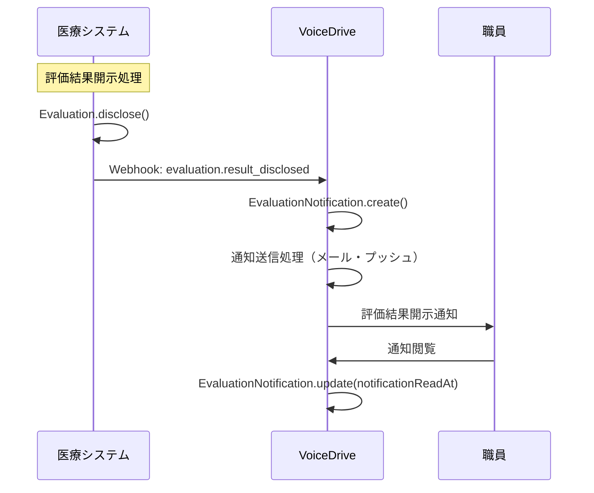
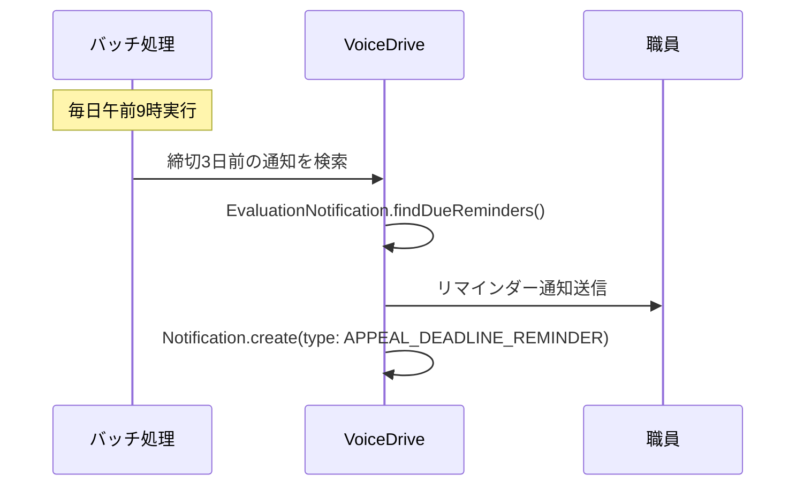

# EvaluationNotificationPage DB要件分析

**文書番号**: VD-DB-ANALYSIS-2025-1013-004
**作成日**: 2025年10月13日
**対象ページ**: EvaluationNotificationPage
**URL**: https://voicedrive-v100.vercel.app/evaluation/notifications
**ステータス**: 🟡 DB構築前分析完了・実装待ち

---

## 📋 エグゼクティブサマリー

### ページ概要
EvaluationNotificationPageは、医療職員管理システムから送信される評価結果開示通知を受信・表示するページです。V3評価システム対応（100点満点・7段階グレード・3軸評価）の通知管理機能を提供し、職員が評価結果を確認し、必要に応じて異議申立を行うための入口となります。

### 主要機能
1. ✅ **評価通知一覧表示** - 開示された評価結果の通知リスト表示
2. ✅ **通知統計表示** - 総通知数、既読率、未読数、異議申立率の表示
3. ✅ **検索・フィルタ機能** - 評価期間・担当者名で検索、ステータス別フィルタ
4. ✅ **ソート機能** - 最新順・締切順・スコア順でソート
5. ✅ **通知設定** - メール・プッシュ・リマインダーの設定
6. ✅ **異議申立へ遷移** - 通知から異議申立フォームへの遷移

### データ管理責任
- **医療システム（マスタ）**: 評価結果データ、開示日時、締切日時
- **VoiceDrive（マスタ）**: 通知送信記録、既読状態、通知設定
- **連携方式**: Webhook（医療システム → VoiceDrive）

### 現状の課題
- ❌ `EvaluationNotification`テーブルが存在しない（新規作成必要）
- ❌ `NotificationSettings`テーブルが存在しない（新規作成必要）
- ❌ 通知統計の集計ロジックが未実装
- ❌ Webhook受信エンドポイントが未実装

---

## 🎯 ページ機能詳細分析

### 機能1: 評価通知一覧表示

**画面フロー**:
```
1. ページアクセス → 通知一覧APIを呼び出し
2. 通知データ取得 → カード形式で表示
3. 各通知カードに表示:
   - 評価期間
   - スコア（0-100点）
   - グレード（S, A+, A, B+, B, C, D）
   - 3軸評価（施設内・法人内・総合）
   - 開示日
   - 異議申立締切
   - 締切まで残日数
   - 通知ステータス（pending, sent, delivered, read, failed）
   - 異議申立ステータス（none, submitted, in_review, resolved）
```

**必要なデータ**:
| データ項目 | 現在のテーブル | 不足 | 備考 |
|----------|-------------|------|------|
| notificationId | ❌ なし | ✅ | 通知ID（VoiceDrive生成） |
| employeeId | ❌ なし | ✅ | 職員ID |
| employeeName | ❌ なし | ✅ | 職員名（キャッシュ） |
| evaluationPeriod | ❌ なし | ✅ | 評価期間（例: "2024年度上期"） |
| evaluationScore | ❌ なし | ✅ | 評価スコア（0-100点） |
| evaluationGrade | ❌ なし | ✅ | 評価グレード（S, A+, A, B+, B, C, D） |
| facilityGrade | ❌ なし | ✅ | 施設内評価（S, A, B, C, D） |
| corporateGrade | ❌ なし | ✅ | 法人内評価（S, A, B, C, D） |
| overallGrade | ❌ なし | ✅ | 総合評価（S, A+, A, B+, B, C, D） |
| overallScore | ❌ なし | ✅ | 総合スコア（0-100点） |
| disclosureDate | ❌ なし | ✅ | 開示日（YYYY-MM-DD） |
| appealDeadline | ❌ なし | ✅ | 異議申立締切（YYYY-MM-DD） |
| notificationStatus | ❌ なし | ✅ | 通知ステータス |
| notificationSentAt | ❌ なし | ✅ | 通知送信日時 |
| notificationReadAt | ❌ なし | ✅ | 既読日時 |
| appealStatus | ❌ なし | ✅ | 異議申立ステータス |
| appealId | ❌ なし | ✅ | 異議申立ID（提出済みの場合） |
| medicalSystemUrl | ❌ なし | ✅ | 医療システムURL（参照用） |

### 機能2: 通知統計表示

**表示内容**:
- **総通知数** (totalSent): 送信された通知の総数
- **既読率** (readRate): 読まれた通知の割合（%）
- **未読数** (totalUnread): 未読の通知数
- **異議申立率** (appealActionRate): 通知後に異議申立を行った割合（%）

**必要なデータ**:
| データ項目 | 計算方法 | 備考 |
|----------|---------|------|
| totalSent | COUNT(*) FROM EvaluationNotification | 全通知数 |
| totalRead | COUNT(*) WHERE notificationReadAt IS NOT NULL | 既読数 |
| totalUnread | COUNT(*) WHERE notificationReadAt IS NULL | 未読数 |
| readRate | totalRead / totalSent * 100 | 既読率（%） |
| appealActionRate | COUNT(*) WHERE appealId IS NOT NULL / totalSent * 100 | 異議申立率（%） |
| averageReadTime | AVG(notificationReadAt - notificationSentAt) | 平均既読時間（分） |

### 機能3: 検索・フィルタ機能

**検索対象**:
- 評価期間（例: "2024年度上期"）
- 職員名

**フィルタオプション**:
| フィルタ | 条件 | SQL条件 |
|---------|------|---------|
| すべて | すべての通知 | - |
| 未読 | notificationStatus !== 'read' | notificationReadAt IS NULL |
| 緊急 | isUrgent = true | daysUntilDeadline <= 3 |
| 未申立 | appealStatus = 'none' | appealId IS NULL |
| 申立済 | appealStatus = 'submitted' | appealId IS NOT NULL |

**ソートオプション**:
| ソート | 並び順 | SQL |
|-------|--------|-----|
| 最新順 | 開示日の降順 | ORDER BY disclosureDate DESC |
| 締切順 | 締切日の昇順 | ORDER BY appealDeadline ASC |
| スコア順 | スコアの降順 | ORDER BY overallScore DESC |

### 機能4: 通知設定

**設定項目**:
| 設定名 | デフォルト値 | 備考 |
|-------|------------|------|
| enableEmailNotifications | true | メール通知を受け取る |
| enablePushNotifications | true | プッシュ通知を受け取る |
| enableSmsNotifications | false | SMS通知を受け取る |
| reminderDaysBefore | 3 | 締切N日前にリマインダー送信 |
| autoMarkAsRead | false | 表示時に自動既読 |

**必要なデータ**:
| データ項目 | テーブル | 不足 | 備考 |
|----------|---------|------|------|
| userId | NotificationSettings | ✅ | 職員ID |
| enableEmailNotifications | NotificationSettings | ✅ | メール通知ON/OFF |
| enablePushNotifications | NotificationSettings | ✅ | プッシュ通知ON/OFF |
| enableSmsNotifications | NotificationSettings | ✅ | SMS通知ON/OFF |
| reminderDaysBefore | NotificationSettings | ✅ | リマインダー日数 |
| autoMarkAsRead | NotificationSettings | ✅ | 自動既読ON/OFF |

### 機能5: 異議申立への遷移

**遷移パラメータ**:
```typescript
window.location.href = `/appeals/new?notificationId=${notificationId}&evaluationPeriod=${encodeURIComponent(evaluationPeriod)}&score=${score}`;
```

**必要なデータ**:
- notificationId: 通知ID
- evaluationPeriod: 評価期間
- score: 評価スコア

---

## 🗄️ 現在のテーブル構造

### 🔴 問題: EvaluationNotificationテーブルが存在しない

現在の`schema.prisma`には評価通知を管理するテーブルが**存在しません**。

**影響**:
- 評価通知の永続化ができない
- 既読・未読の管理ができない
- 通知統計の集計ができない
- 異議申立との紐付けができない

---

## 📊 データ管理責任分界点

### データ管理責任マトリクス

| データ項目 | VoiceDrive | 医療システム | 提供方法 | 備考 |
|-----------|-----------|-------------|---------|------|
| **評価結果データ** | キャッシュ | ✅ マスタ | Webhook | 医療システムが開示時に送信 |
| 評価スコア | キャッシュ | ✅ マスタ | Webhook | 0-100点 |
| 評価グレード | キャッシュ | ✅ マスタ | Webhook | S, A+, A, B+, B, C, D |
| 3軸評価 | キャッシュ | ✅ マスタ | Webhook | 施設内・法人内・総合 |
| 開示日 | キャッシュ | ✅ マスタ | Webhook | 医療システムが決定 |
| 異議申立締切 | キャッシュ | ✅ マスタ | Webhook | 開示日+14日 |
| **通知管理データ** | ✅ マスタ | - | - | VoiceDrive独自管理 |
| 通知ID | ✅ マスタ | - | - | VoiceDrive生成 |
| 通知ステータス | ✅ マスタ | - | - | pending, sent, delivered, read, failed |
| 通知送信日時 | ✅ マスタ | - | - | VoiceDriveが記録 |
| 既読日時 | ✅ マスタ | - | - | 職員が閲覧した日時 |
| **異議申立関連** | ✅ マスタ | 参照 | Webhook | VoiceDrive→医療システム通知 |
| 異議申立ID | ✅ マスタ | 参照 | Webhook | VoiceDriveが生成 |
| 異議申立ステータス | ✅ マスタ | 参照 | Webhook | none, submitted, in_review, resolved |
| **通知設定** | ✅ マスタ | - | - | 職員ごとの設定 |
| メール通知ON/OFF | ✅ マスタ | - | - | VoiceDrive管理 |
| プッシュ通知ON/OFF | ✅ マスタ | - | - | VoiceDrive管理 |
| リマインダー設定 | ✅ マスタ | - | - | VoiceDrive管理 |

### Webhook連携フロー

#### フロー1: 評価結果開示通知（医療システム → VoiceDrive）



**Webhook Payload（医療システム → VoiceDrive）**:
```json
{
  "eventType": "evaluation.result_disclosed",
  "timestamp": "2025-10-13T15:00:00Z",
  "data": {
    "employeeId": "EMP-2024-001",
    "employeeName": "山田太郎",
    "evaluationPeriod": "2024年度上期",
    "evaluationScore": 85,
    "evaluationGrade": "A",
    "facilityGrade": "A",
    "corporateGrade": "B",
    "overallGrade": "A",
    "overallScore": 85,
    "disclosureDate": "2025-10-13",
    "appealDeadline": "2025-10-27",
    "medicalSystemUrl": "https://medical-system.example.com/evaluations/EV-2024-001",
    "additionalMessage": "評価結果をご確認ください。"
  }
}
```

#### フロー2: 異議申立締切リマインダー（VoiceDrive内部処理）



---

## 🔧 必要なDB変更

### 変更1: 新規テーブル EvaluationNotification

**目的**: 評価結果開示通知を管理

```prisma
model EvaluationNotification {
  id                      String    @id @default(cuid())

  // 職員情報
  employeeId              String    @map("employee_id")
  employeeName            String    @map("employee_name")          // キャッシュ

  // 評価情報
  evaluationPeriod        String    @map("evaluation_period")      // "2024年度上期"
  evaluationScore         Int       @map("evaluation_score")       // 0-100
  evaluationGrade         String    @map("evaluation_grade")       // S, A+, A, B+, B, C, D

  // 3軸評価（V3対応）
  facilityGrade           String?   @map("facility_grade")         // S, A, B, C, D
  corporateGrade          String?   @map("corporate_grade")        // S, A, B, C, D
  overallGrade            String?   @map("overall_grade")          // S, A+, A, B+, B, C, D
  overallScore            Int?      @map("overall_score")          // 0-100

  // 日付情報
  disclosureDate          DateTime  @map("disclosure_date")        // 開示日
  appealDeadline          DateTime  @map("appeal_deadline")        // 異議申立締切

  // 通知ステータス
  notificationStatus      String    @default("pending") @map("notification_status")
  // pending, sent, delivered, read, failed
  notificationSentAt      DateTime? @map("notification_sent_at")
  notificationDeliveredAt DateTime? @map("notification_delivered_at")
  notificationReadAt      DateTime? @map("notification_read_at")
  notificationFailedAt    DateTime? @map("notification_failed_at")
  failureReason           String?   @map("failure_reason")

  // 配信方法
  deliveryMethods         String    @map("delivery_methods")       // JSON: {email, push, sms}

  // 異議申立関連
  appealStatus            String    @default("none") @map("appeal_status")
  // none, submitted, in_review, resolved
  appealId                String?   @map("appeal_id")              // 異議申立ID
  appealSubmittedAt       DateTime? @map("appeal_submitted_at")

  // 医療システム連携
  medicalSystemUrl        String?   @map("medical_system_url")     // 評価結果URL
  medicalSystemEventId    String?   @map("medical_system_event_id") // 医療システムのイベントID
  additionalMessage       String?   @map("additional_message")     @db.Text

  // 緊急度フラグ
  isUrgent                Boolean   @default(false) @map("is_urgent")
  daysUntilDeadline       Int?      @map("days_until_deadline")    // 計算済みフィールド

  // メタデータ
  createdAt               DateTime  @default(now()) @map("created_at")
  updatedAt               DateTime  @updatedAt @map("updated_at")

  // リレーション
  employee                User      @relation(fields: [employeeId], references: [id], onDelete: Cascade)

  // インデックス
  @@index([employeeId])
  @@index([notificationStatus])
  @@index([appealStatus])
  @@index([disclosureDate])
  @@index([appealDeadline])
  @@index([evaluationPeriod])
  @@map("evaluation_notifications")
}
```

**追加フィールド数**: 30フィールド

---

### 変更2: 新規テーブル NotificationSettings

**目的**: 職員ごとの通知設定を管理

```prisma
model NotificationSettings {
  id                        String    @id @default(cuid())
  userId                    String    @unique @map("user_id")

  // 通知方法の有効化
  enableEmailNotifications  Boolean   @default(true) @map("enable_email_notifications")
  enablePushNotifications   Boolean   @default(true) @map("enable_push_notifications")
  enableSmsNotifications    Boolean   @default(false) @map("enable_sms_notifications")

  // リマインダー設定
  reminderDaysBefore        Int       @default(3) @map("reminder_days_before")  // 締切N日前

  // 自動既読設定
  autoMarkAsRead            Boolean   @default(false) @map("auto_mark_as_read")

  // 通知時間帯設定
  notificationStartTime     String?   @map("notification_start_time")  // "09:00"
  notificationEndTime       String?   @map("notification_end_time")    // "18:00"

  // 通知頻度制限
  maxNotificationsPerDay    Int       @default(10) @map("max_notifications_per_day")

  // メタデータ
  createdAt                 DateTime  @default(now()) @map("created_at")
  updatedAt                 DateTime  @updatedAt @map("updated_at")

  // リレーション
  user                      User      @relation(fields: [userId], references: [id], onDelete: Cascade)

  @@map("notification_settings")
}
```

**追加フィールド数**: 12フィールド

---

### 変更3: Userテーブルへのリレーション追加

```prisma
model User {
  // ... 既存フィールド

  // 🆕 評価通知関連リレーション
  evaluationNotifications  EvaluationNotification[]
  notificationSettings     NotificationSettings?

  // ... 既存リレーション
}
```

---

## 🔗 必要なAPI

### API-11: 評価結果開示通知受信（医療システム → VoiceDrive）

**目的**: 医療システムからの評価結果開示通知を受信

**エンドポイント**: `POST /api/webhooks/evaluation-result-disclosed`

**リクエスト**:
```http
POST /api/webhooks/evaluation-result-disclosed
Content-Type: application/json
X-Medical-System-Signature: sha256=abc123...
```

```json
{
  "eventType": "evaluation.result_disclosed",
  "timestamp": "2025-10-13T15:00:00Z",
  "data": {
    "employeeId": "EMP-2024-001",
    "employeeName": "山田太郎",
    "evaluationPeriod": "2024年度上期",
    "evaluationScore": 85,
    "evaluationGrade": "A",
    "facilityGrade": "A",
    "corporateGrade": "B",
    "overallGrade": "A",
    "overallScore": 85,
    "disclosureDate": "2025-10-13",
    "appealDeadline": "2025-10-27",
    "medicalSystemUrl": "https://medical-system.example.com/evaluations/EV-2024-001",
    "additionalMessage": "評価結果をご確認ください。"
  }
}
```

**レスポンス**:
```json
{
  "success": true,
  "notificationId": "notif_abc123",
  "message": "評価通知を受理しました",
  "deliveryMethods": {
    "email": true,
    "push": true,
    "sms": false
  },
  "estimatedDeliveryTime": "2025-10-13T15:05:00Z"
}
```

**処理内容**:
1. Webhook署名検証
2. EvaluationNotification.create()
3. 通知設定に基づいてメール・プッシュ通知送信
4. 成功レスポンス返却

---

### API-12: 評価通知一覧取得（VoiceDrive内部API）

**目的**: 職員の評価通知一覧を取得

**エンドポイント**: `GET /api/evaluation-notifications`

**リクエスト**:
```http
GET /api/evaluation-notifications?employeeId=EMP-2024-001&filter=unread&sort=deadline
Authorization: Bearer {jwt_token}
```

**クエリパラメータ**:
- `employeeId`: 職員ID（必須）
- `filter`: フィルタ（all, unread, urgent, no_appeal, appeal_submitted）
- `sort`: ソート（newest, deadline, score）
- `search`: 検索クエリ

**レスポンス**:
```json
{
  "notifications": [
    {
      "id": "notif_abc123",
      "employeeName": "山田太郎",
      "evaluationPeriod": "2024年度上期",
      "score": 85,
      "grade": "A",
      "facilityGrade": "A",
      "corporateGrade": "B",
      "overallGrade": "A",
      "overallScore": 85,
      "disclosureDate": "2025-10-13",
      "appealDeadline": "2025-10-27",
      "notificationStatus": "read",
      "appealStatus": "none",
      "daysUntilDeadline": 14,
      "isUrgent": false
    }
  ],
  "total": 5,
  "unread": 2
}
```

---

### API-13: 通知既読マーク（VoiceDrive内部API）

**目的**: 通知を既読にする

**エンドポイント**: `PATCH /api/evaluation-notifications/:notificationId/mark-as-read`

**リクエスト**:
```http
PATCH /api/evaluation-notifications/notif_abc123/mark-as-read
Authorization: Bearer {jwt_token}
```

**レスポンス**:
```json
{
  "success": true,
  "notificationId": "notif_abc123",
  "notificationReadAt": "2025-10-13T15:30:00Z"
}
```

---

### API-14: 通知統計取得（VoiceDrive内部API）

**目的**: 通知統計を取得

**エンドポイント**: `GET /api/evaluation-notifications/stats`

**リクエスト**:
```http
GET /api/evaluation-notifications/stats?employeeId=EMP-2024-001
Authorization: Bearer {jwt_token}
```

**レスポンス**:
```json
{
  "totalSent": 5,
  "totalRead": 3,
  "totalUnread": 2,
  "readRate": 0.6,
  "averageReadTime": 45.5,
  "appealActionRate": 0.2
}
```

---

### API-15: 通知設定取得・更新（VoiceDrive内部API）

**目的**: 職員の通知設定を取得・更新

**エンドポイント**:
- `GET /api/notification-settings`
- `PUT /api/notification-settings`

**GET リクエスト**:
```http
GET /api/notification-settings?userId=user_abc123
Authorization: Bearer {jwt_token}
```

**GET レスポンス**:
```json
{
  "enableEmailNotifications": true,
  "enablePushNotifications": true,
  "enableSmsNotifications": false,
  "reminderDaysBefore": 3,
  "autoMarkAsRead": false,
  "notificationStartTime": "09:00",
  "notificationEndTime": "18:00",
  "maxNotificationsPerDay": 10
}
```

**PUT リクエスト**:
```http
PUT /api/notification-settings
Authorization: Bearer {jwt_token}
Content-Type: application/json
```

```json
{
  "enableEmailNotifications": true,
  "enablePushNotifications": false,
  "reminderDaysBefore": 5
}
```

**PUT レスポンス**:
```json
{
  "success": true,
  "message": "通知設定を更新しました"
}
```

---

## 📝 実装優先順位

### Phase 1: 基本通知機能（優先度: 🔴 最高）

**期間**: 2週間
**実装日**: 2025-11-01 ~ 2025-11-14

1. ✅ EvaluationNotificationテーブル作成
2. ✅ NotificationSettingsテーブル作成
3. ✅ Userテーブルリレーション追加
4. ✅ API-11実装（Webhook受信）
5. ✅ API-12実装（通知一覧取得）
6. ✅ API-13実装（既読マーク）
7. ✅ API-14実装（統計取得）
8. ✅ 通知一覧画面の実データ連携

**依存関係**:
- 医療システム: API-11のWebhook送信実装が必要

---

### Phase 2: 通知設定機能（優先度: 🟡 高）

**期間**: 1週間
**実装日**: 2025-11-15 ~ 2025-11-21

1. ✅ API-15実装（通知設定取得・更新）
2. ✅ 通知設定画面の実データ連携
3. ✅ メール通知送信機能実装
4. ✅ プッシュ通知送信機能実装
5. ✅ リマインダーバッチ処理実装

**依存関係**:
- Phase 1完了後に実施

---

### Phase 3: 統計・分析機能（優先度: 🟢 中）

**期間**: 1週間
**実装日**: 2025-11-22 ~ 2025-11-28

1. ✅ 統計ダッシュボード実装
2. ✅ 既読率・異議申立率の可視化
3. ✅ レポート出力機能

**依存関係**:
- Phase 2完了後に実施

---

## 🧪 テストケース

### TC-1: 評価結果開示通知受信

**前提条件**:
- 医療システムで評価が開示される

**テストステップ**:
1. 医療システムからAPI-11を呼び出し
2. Webhook署名を検証
3. EvaluationNotificationレコードが作成される
4. 通知送信処理が実行される

**期待結果**:
- ✅ EvaluationNotificationレコードが作成される
- ✅ notificationStatus = 'sent'
- ✅ メール・プッシュ通知が送信される
- ✅ 成功レスポンスが返却される

---

### TC-2: 通知一覧表示

**前提条件**:
- 評価通知が5件存在する

**テストステップ**:
1. EvaluationNotificationPageを開く
2. API-12が呼ばれる
3. 通知一覧が表示される

**期待結果**:
- ✅ 5件の通知が表示される
- ✅ スコア・グレード・締切が正しく表示される
- ✅ 未読通知にバッジが表示される

---

### TC-3: 通知既読マーク

**前提条件**:
- 未読通知が存在する

**テストステップ**:
1. 通知カードをクリック
2. API-13が呼ばれる
3. notificationReadAtが記録される

**期待結果**:
- ✅ notificationReadAtが現在時刻で更新される
- ✅ 未読バッジが消える
- ✅ 統計の既読率が更新される

---

### TC-4: フィルタ・ソート機能

**前提条件**:
- 複数の通知が存在する

**テストステップ**:
1. 「未読」フィルタを選択
2. 未読通知のみが表示される
3. 「締切順」ソートを選択
4. 締切が近い順に並び替えられる

**期待結果**:
- ✅ フィルタが正しく適用される
- ✅ ソートが正しく適用される

---

### TC-5: 通知設定変更

**前提条件**:
- 通知設定が存在する

**テストステップ**:
1. 設定タブを開く
2. メール通知をOFFにする
3. 保存ボタンをクリック
4. API-15が呼ばれる

**期待結果**:
- ✅ enableEmailNotifications = false に更新される
- ✅ 成功メッセージが表示される

---

## 📋 チェックリスト

### データベース変更

- [ ] EvaluationNotificationテーブル作成
- [ ] NotificationSettingsテーブル作成
- [ ] Userテーブルリレーション追加
- [ ] マイグレーションファイル作成
- [ ] 本番環境マイグレーション計画

### API実装（VoiceDrive側）

- [ ] API-11: Webhook受信実装
- [ ] API-12: 通知一覧取得実装
- [ ] API-13: 既読マーク実装
- [ ] API-14: 統計取得実装
- [ ] API-15: 通知設定取得・更新実装

### フロントエンド実装

- [ ] 通知一覧画面の実データ連携
- [ ] 統計表示の実データ連携
- [ ] フィルタ・ソート機能実装
- [ ] 通知設定画面の実データ連携
- [ ] エラーハンドリング実装

### 通知送信機能

- [ ] メール通知送信実装
- [ ] プッシュ通知送信実装
- [ ] SMS通知送信実装（オプション）
- [ ] リマインダーバッチ処理実装

### テスト

- [ ] 単体テスト（API, サービス層）
- [ ] 統合テスト（Webhook受信）
- [ ] 通知送信テスト
- [ ] フィルタ・ソート機能テスト

### ドキュメント

- [ ] API仕様書作成（OpenAPI 3.0）
- [ ] Webhook仕様書作成
- [ ] データベーススキーマドキュメント更新
- [ ] 運用マニュアル作成

---

## 🚀 次のステップ

1. ✅ **本ドキュメント確認** - 医療システムチームと要件確認
2. ⏳ **暫定マスターリスト作成** - 通知テンプレート等のマスターデータ定義
3. ⏳ **API仕様合意** - API-11の詳細仕様を確定
4. ⏳ **実装スケジュール調整** - 2025年11月1日開始予定
5. ⏳ **schema.prisma更新** - Phase 1のテーブル変更を実装

---

## 📞 連絡先

**VoiceDriveチーム**:
- Slack: #voicedrive-integration
- 担当: システム開発チーム

**医療システムチーム**:
- Slack: #medical-system-integration
- 担当: システム開発チーム

---

**文書終了**

最終更新: 2025年10月13日
バージョン: 1.0
承認: 未承認（レビュー待ち）
