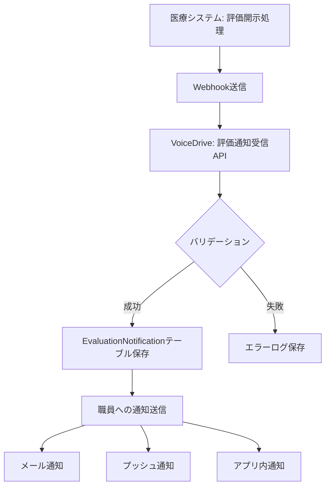
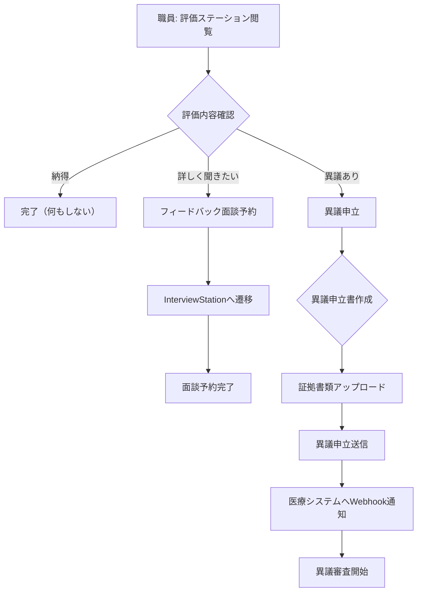
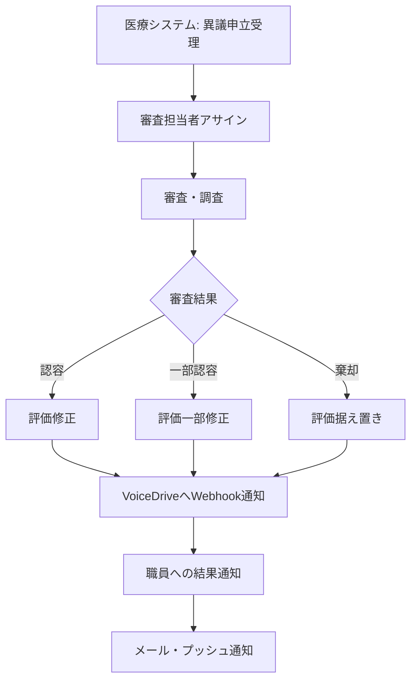

# VoiceDrive 評価ステーションDB要件分析
**作成日**: 2025年10月9日
**対象機能**: 評価ステーション（V3評価通知・異議申立・フィードバック面談）
**分析範囲**: EvaluationStation, EvaluationNotificationPage, AppealV3, FeedbackInterview

---

## 📋 目次
1. [システム概要](#システム概要)
2. [V3評価システム概要](#v3評価システム概要)
3. [評価通知フロー](#評価通知フロー)
4. [データ管理責任分界点](#データ管理責任分界点)
5. [テーブル設計](#テーブル設計)
6. [API設計](#api設計)
7. [実装優先度](#実装優先度)

---

## システム概要

### 評価ステーションの役割
VoiceDriveの評価ステーションは、医療職員管理システムから評価結果通知を受け取り、職員が **評価確認・異議申立・フィードバック面談予約** を一元管理できる機能です。

### 主要機能
1. **V3評価結果通知受信**: 医療システムからWebhook経由で評価結果を受信・表示
2. **3軸評価表示**: 施設内評価・法人内評価・総合評価の3軸グレード表示
3. **異議申立**: 評価結果に対する異議申立（期限14日以内）
4. **フィードバック面談予約**: 評価について上司と面談予約
5. **評価履歴追跡**: 過去の評価・申立履歴の閲覧
6. **通知設定**: メール・プッシュ・締切リマインダー通知管理

### 評価対象者
- **Level 1-3**: 一般職員・主任（評価対象）
- **Level 4以上**: 部長・副院長・院長（管理職評価制度、評価ステーション対象外）

---

## V3評価システム概要

### 100点満点制・7段階グレード

| グレード | 点数範囲 | 説明 |
|----------|----------|------|
| **S** | 95-100点 | 極めて優秀 |
| **A+** | 90-94点 | 優秀 |
| **A** | 85-89点 | 良好（施設標準以上） |
| **B+** | 80-84点 | 標準以上 |
| **B** | 75-79点 | 標準 |
| **C** | 70-74点 | やや改善が必要 |
| **D** | 0-69点 | 改善が必要 |

### 3軸評価システム

```typescript
// 3軸評価の構成
interface TripleGradeEvaluation {
  facilityGrade: string;      // 施設内評価 (S, A, B, C, D の5段階)
  corporateGrade: string;     // 法人内評価 (S, A, B, C, D の5段階)
  overallGrade: string;       // 総合評価 (S, A+, A, B+, B, C, D の7段階)
  overallScore: number;       // 総合評価点数 (0-100点)
}
```

#### 施設内評価 (Facility Grade)
- **目的**: 同じ施設（病院）内での相対評価
- **基準**: 施設内の同職種・同レベル職員との比較
- **範囲**: S, A, B, C, D の5段階
- **用途**: 同僚との比較、部署内順位付け

#### 法人内評価 (Corporate Grade)
- **目的**: 法人全体（複数施設含む）での相対評価
- **基準**: 法人全体の同職種・同レベル職員との比較
- **範囲**: S, A, B, C, D の5段階
- **用途**: 法人内の人事配置、昇進判断

#### 総合評価 (Overall Grade)
- **目的**: 施設内評価・法人内評価を統合した最終評価
- **計算**: 施設内40% + 法人内30% + 絶対評価30%
- **範囲**: S, A+, A, B+, B, C, D の7段階（より細かい評価）
- **用途**: 昇給・賞与・キャリアパスの判断

---

## 評価通知フロー

### Phase 1: 医療システムから評価通知送信



### Phase 2: 職員による評価確認・アクション



### Phase 3: 異議申立審査・回答



---

## データ管理責任分界点

### VoiceDrive管轄（A: 完全管理）

| カテゴリ | データ種別 | 理由 |
|----------|------------|------|
| **評価通知管理** | EvaluationNotification（受信した評価通知） | VoiceDrive独自の通知管理機能 |
| **異議申立** | Appeal（異議申立書・証拠・審査状況） | VoiceDrive独自の申立管理 |
| **フィードバック面談** | Interview（フィードバック面談予約） | InterviewStationと統合管理 |
| **通知設定** | NotificationSettings（個人通知設定） | VoiceDrive独自のユーザー設定 |
| **評価閲覧履歴** | EvaluationViewLog（いつ誰が確認したか） | VoiceDrive独自のトラッキング |

### 医療システム管轄（B: 参照のみ）

| カテゴリ | データ種別 | 取得方法 |
|----------|------------|----------|
| **評価マスターデータ** | Evaluation（実際の評価データ） | Webhook経由で受信・ミラーリング |
| **職員基本情報** | Employee（職員ID・氏名・部署） | GET /api/employees/:employeeId |
| **評価期間情報** | EvaluationPeriod（評価期間・締切） | Webhook通知に含む |

### 医療システムへの通知（C: Webhook送信）

| イベント | タイミング | データ内容 |
|----------|-----------|-----------|
| **異議申立受理** | 職員が異議申立送信時 | 申立ID、職員ID、申立理由、証拠URL |
| **異議申立取り下げ** | 職員が申立取り下げ時 | 申立ID、取り下げ理由 |
| **フィードバック面談予約** | 職員が面談予約時 | 予約ID、職員ID、希望日時、評価ID |

---

## テーブル設計

### 1. EvaluationNotification（評価通知）

```prisma
model EvaluationNotification {
  id                    String    @id @default(cuid())

  // 基本情報
  employeeId            String    // User.employeeId（医療システムID）
  employeeName          String    // キャッシュ用
  evaluationPeriod      String    // "2025年冬期評価"
  evaluationPeriodId    String?   // 医療システムの評価期間ID

  // V3評価データ（3軸評価）
  facilityGrade         String?   // 施設内評価 (S, A, B, C, D)
  corporateGrade        String?   // 法人内評価 (S, A, B, C, D)
  overallGrade          String    // 総合評価 (S, A+, A, B+, B, C, D)
  overallScore          Int       // 総合評価点数 (0-100点)

  // 旧評価システム互換（廃止予定）
  evaluationScore       Int?      // 旧スコア
  evaluationGrade       String?   // 旧グレード

  // 日時情報
  disclosureDate        DateTime  // 評価開示日
  appealDeadline        DateTime  // 異議申立期限（通常開示から14日後）

  // 通知ステータス
  notificationStatus    String    @default("pending") // pending | sent | delivered | read | failed
  notificationSentAt    DateTime? // 通知送信日時
  notificationReadAt    DateTime? // 通知既読日時
  hasUnreadNotification Boolean   @default(true)

  // 異議申立関連
  appealSubmitted       Boolean   @default(false)
  appealId              String?   // 異議申立ID（Appeal.idへの参照）

  // 医療システム連携
  medicalSystemUrl      String?   // 医療システムの評価詳細画面URL
  additionalMessage     String?   // 追加メッセージ

  // メタデータ
  createdAt             DateTime  @default(now())
  updatedAt             DateTime  @updatedAt

  // リレーション
  appeal                Appeal?   @relation(fields: [appealId], references: [id])
  viewLogs              EvaluationViewLog[]

  @@index([employeeId])
  @@index([evaluationPeriod])
  @@index([notificationStatus])
  @@index([appealDeadline])
}
```

### 2. Appeal（異議申立）

```prisma
model Appeal {
  id                    String    @id @default(cuid())

  // 申立者情報
  employeeId            String    // User.employeeId
  employeeName          String    // キャッシュ用
  departmentId          String?   // 部署ID
  jobCategory           String?   // 職種

  // 評価情報
  evaluationPeriod      String    // "2025年冬期評価"
  evaluationPeriodId    String    // 医療システムの評価期間ID
  originalScore         Int       // 元の評価点数
  requestedScore        Int?      // 希望する評価点数（任意）

  // 申立内容
  appealCategory        String    // CALCULATION_ERROR | ACHIEVEMENT_OVERSIGHT | CRITERIA_MISINTERPRETATION | OTHER
  appealReason          String    // 異議申立理由（詳細説明）
  specificPoints        Json      // 具体的な指摘点（配列）
  evidenceDocuments     Json      // 証拠書類URL（配列）
  desiredOutcome        String    // 希望する結果

  // ステータス
  status                String    @default("draft") // draft | submitted | under_review | approved | partially_approved | rejected | withdrawn
  urgencyLevel          String    @default("medium") // low | medium | high | urgent

  // 審査情報
  reviewedBy            String?   // 審査担当者ID
  reviewedAt            DateTime? // 審査開始日時
  respondedAt           DateTime? // 回答日時
  reviewComments        String?   // 審査コメント
  finalScore            Int?      // 最終評価点数（修正後）

  // 連絡方法
  preferredContactMethod String   @default("email") // email | phone | in_person

  // 同意事項
  acknowledgement       Boolean   @default(false) // 申立のルールに同意したか

  // メタデータ
  submittedAt           DateTime? // 提出日時
  expectedResponseDate  DateTime? // 回答予定日
  createdAt             DateTime  @default(now())
  updatedAt             DateTime  @updatedAt

  // リレーション
  notifications         EvaluationNotification[]
  appealHistory         AppealHistory[]

  @@index([employeeId])
  @@index([evaluationPeriodId])
  @@index([status])
  @@index([submittedAt])
}
```

### 3. AppealHistory（異議申立履歴）

```prisma
model AppealHistory {
  id          String    @id @default(cuid())
  appealId    String

  // アクション情報
  action      String    // submitted | under_review | additional_info_requested | approved | rejected | withdrawn
  performedBy String    // アクション実行者ID
  performedByName String? // キャッシュ用
  comments    String?   // コメント
  metadata    Json?     // 追加情報

  // タイムスタンプ
  performedAt DateTime  @default(now())

  // リレーション
  appeal      Appeal    @relation(fields: [appealId], references: [id], onDelete: Cascade)

  @@index([appealId])
  @@index([performedAt])
}
```

### 4. EvaluationViewLog（評価閲覧ログ）

```prisma
model EvaluationViewLog {
  id                  String    @id @default(cuid())
  notificationId      String

  // 閲覧情報
  employeeId          String    // 閲覧した職員
  viewedAt            DateTime  @default(now())
  viewDuration        Int?      // 閲覧時間（秒）
  deviceType          String?   // mobile | tablet | desktop
  ipAddress           String?

  // リレーション
  notification        EvaluationNotification @relation(fields: [notificationId], references: [id], onDelete: Cascade)

  @@index([notificationId])
  @@index([employeeId])
  @@index([viewedAt])
}
```

### 5. NotificationSettings（通知設定）

```prisma
model NotificationSettings {
  id                        String    @id @default(cuid())
  employeeId                String    @unique // User.employeeId

  // 通知チャネル
  enableEmailNotifications  Boolean   @default(true)
  enablePushNotifications   Boolean   @default(true)
  enableSmsNotifications    Boolean   @default(false)

  // リマインダー設定
  reminderDaysBefore        Int       @default(3) // 異議申立締切前の通知日数
  autoMarkAsRead            Boolean   @default(false)

  // 通知時間帯
  preferredNotificationTime String?   // "09:00-17:00"
  quietHoursEnabled         Boolean   @default(false)
  quietHoursStart           String?   // "22:00"
  quietHoursEnd             String?   // "08:00"

  // メタデータ
  createdAt                 DateTime  @default(now())
  updatedAt                 DateTime  @updatedAt

  @@index([employeeId])
}
```

### 6. EvaluationNotificationTemplate（通知テンプレート）

```prisma
model EvaluationNotificationTemplate {
  id              String    @id @default(cuid())

  // テンプレート情報
  templateType    String    @unique // evaluation_disclosure | appeal_deadline_reminder | appeal_submitted_confirmation | appeal_response_available
  title           String    // 通知タイトル
  bodyTemplate    String    // 本文テンプレート（変数置換可能）
  actionText      String    // ボタンテキスト
  actionUrlPattern String   // アクションURL（変数置換可能）

  // 優先度・設定
  priority        String    @default("medium") // low | medium | high | urgent
  isActive        Boolean   @default(true)

  // メタデータ
  createdAt       DateTime  @default(now())
  updatedAt       DateTime  @updatedAt

  @@index([templateType])
}
```

---

## API設計

### VoiceDrive内部API（5個）

#### 1. POST /api/evaluation-notifications
**評価通知一覧取得**

リクエスト:
```json
{
  "employeeId": "OH-NS-2024-001",
  "filter": {
    "evaluationPeriod": "2025年冬期評価",
    "notificationStatus": ["unread", "read"],
    "scoreRange": { "min": 80, "max": 100 }
  }
}
```

レスポンス:
```json
{
  "success": true,
  "notifications": [
    {
      "id": "EVAL_1A2B3C",
      "employeeName": "山田太郎",
      "evaluationPeriod": "2025年冬期評価",
      "facilityGrade": "A",
      "corporateGrade": "B",
      "overallGrade": "A+",
      "overallScore": 87,
      "disclosureDate": "2025-03-15",
      "appealDeadline": "2025-03-29",
      "notificationStatus": "delivered",
      "appealStatus": "none",
      "daysUntilDeadline": 14,
      "isUrgent": false
    }
  ],
  "total": 1
}
```

#### 2. GET /api/evaluation-notifications/:notificationId
**特定の評価通知取得**

レスポンス:
```json
{
  "success": true,
  "notification": {
    "id": "EVAL_1A2B3C",
    "employeeId": "OH-NS-2024-001",
    "employeeName": "山田太郎",
    "evaluationPeriod": "2025年冬期評価",
    "facilityGrade": "A",
    "corporateGrade": "B",
    "overallGrade": "A+",
    "overallScore": 87,
    "disclosureDate": "2025-03-15T00:00:00Z",
    "appealDeadline": "2025-03-29T23:59:59Z",
    "notificationStatus": "read",
    "notificationReadAt": "2025-03-16T10:30:00Z",
    "medicalSystemUrl": "https://medical-system.example.com/evaluations/12345"
  }
}
```

#### 3. PATCH /api/evaluation-notifications/:notificationId/read
**評価通知を既読にする**

レスポンス:
```json
{
  "success": true,
  "notificationId": "EVAL_1A2B3C",
  "readAt": "2025-03-16T10:30:00Z"
}
```

#### 4. POST /api/appeals
**異議申立提出**

リクエスト:
```json
{
  "employeeId": "OH-NS-2024-001",
  "employeeName": "山田太郎",
  "evaluationPeriod": "2025年冬期評価",
  "evaluationPeriodId": "eval_2025_winter",
  "appealCategory": "ACHIEVEMENT_OVERSIGHT",
  "appealReason": "以下の成果が評価に反映されていません：\n1. プロジェクトAのリーダーとして...",
  "specificPoints": [
    "プロジェクトAの成功（売上20%増）",
    "新人教育プログラムの立ち上げ",
    "患者満足度調査で部署1位"
  ],
  "originalScore": 82,
  "requestedScore": 88,
  "evidenceDocuments": [
    "https://storage.example.com/evidence/project_a_report.pdf",
    "https://storage.example.com/evidence/patient_satisfaction.pdf"
  ],
  "desiredOutcome": "上記成果を評価に反映し、適正な評価点数への修正を希望します",
  "preferredContactMethod": "email",
  "acknowledgement": true
}
```

レスポンス:
```json
{
  "success": true,
  "appealId": "APPEAL_XYZ123",
  "message": "異議申立を受理しました",
  "expectedResponseDate": "2025-04-05T23:59:59Z",
  "submittedAt": "2025-03-20T14:30:00Z"
}
```

#### 5. GET /api/appeals/:appealId/status
**異議申立状況確認**

レスポンス:
```json
{
  "success": true,
  "appeal": {
    "id": "APPEAL_XYZ123",
    "status": "under_review",
    "submittedAt": "2025-03-20T14:30:00Z",
    "reviewedBy": "評価審査委員会",
    "expectedResponseDate": "2025-04-05T23:59:59Z",
    "history": [
      {
        "action": "submitted",
        "performedAt": "2025-03-20T14:30:00Z",
        "comments": "異議申立を受理しました"
      },
      {
        "action": "under_review",
        "performedAt": "2025-03-22T09:00:00Z",
        "comments": "審査を開始しました",
        "performedBy": "評価審査委員会"
      }
    ]
  }
}
```

### 医療システム連携API（1個）

#### API-ES-M-1: GET /api/employees/:employeeId
**職員基本情報取得**

※ PostManagementと共通のAPIを使用

リクエスト:
```
GET /api/employees/OH-NS-2024-001
```

レスポンス:
```json
{
  "employeeId": "OH-NS-2024-001",
  "name": "山田太郎",
  "department": "看護部",
  "permissionLevel": 3,
  "position": "看護師",
  "email": "yamada@example.com"
}
```

**Phase**: 1
**優先度**: 高
**見積工数**: 共有済み（PostManagement参照）
**見積金額**: 共有済み

### Webhook（医療システム→VoiceDrive: 1個）

#### WH-ES-M-1: POST /webhook/evaluation-disclosure
**評価結果開示通知（医療システム→VoiceDrive）**

医療システムからVoiceDriveへの送信:
```json
{
  "event": "evaluation_disclosure",
  "timestamp": "2025-03-15T10:00:00Z",
  "data": {
    "employeeId": "OH-NS-2024-001",
    "employeeName": "山田太郎",
    "evaluationPeriod": "2025年冬期評価",
    "evaluationPeriodId": "eval_2025_winter",
    "facilityGrade": "A",
    "corporateGrade": "B",
    "overallGrade": "A+",
    "overallScore": 87,
    "disclosureDate": "2025-03-15",
    "appealDeadline": "2025-03-29",
    "medicalSystemUrl": "https://medical-system.example.com/evaluations/12345",
    "additionalMessage": "総合評価A+おめでとうございます"
  },
  "signature": "HMAC-SHA256-SIGNATURE-HERE"
}
```

VoiceDriveからの応答:
```json
{
  "success": true,
  "notificationId": "EVAL_1A2B3C",
  "message": "評価通知を受理しました",
  "deliveryMethods": {
    "email": true,
    "push": true,
    "sms": false
  },
  "estimatedDeliveryTime": "2025-03-15T10:01:00Z"
}
```

**Phase**: 1
**優先度**: 最高
**見積工数**: 3日
**見積金額**: ¥240,000

#### セキュリティ
- **HMAC-SHA256署名**: 共有秘密鍵でリクエストボディを署名
- **タイムスタンプ検証**: 5分以内のリクエストのみ受け付け
- **IPホワイトリスト**: 医療システムサーバーIPのみ許可

### Webhook（VoiceDrive→医療システム: 2個）

#### WH-ES-V-1: POST /webhook/appeal-submitted
**異議申立受理通知（VoiceDrive→医療システム）**

VoiceDriveから医療システムへの送信:
```json
{
  "event": "appeal_submitted",
  "timestamp": "2025-03-20T14:30:00Z",
  "data": {
    "appealId": "APPEAL_XYZ123",
    "employeeId": "OH-NS-2024-001",
    "employeeName": "山田太郎",
    "evaluationPeriodId": "eval_2025_winter",
    "appealCategory": "ACHIEVEMENT_OVERSIGHT",
    "appealReason": "以下の成果が評価に反映されていません...",
    "specificPoints": ["point1", "point2"],
    "evidenceDocuments": [
      "https://voicedrive-storage.example.com/evidence/doc1.pdf"
    ],
    "originalScore": 82,
    "requestedScore": 88,
    "submittedAt": "2025-03-20T14:30:00Z"
  },
  "signature": "HMAC-SHA256-SIGNATURE-HERE"
}
```

医療システムからの応答:
```json
{
  "success": true,
  "medicalSystemAppealId": "MS-APPEAL-001",
  "assignedReviewer": "評価審査委員会",
  "expectedResponseDate": "2025-04-05T23:59:59Z"
}
```

**Phase**: 2
**優先度**: 高
**見積工数**: 4日
**見積金額**: ¥320,000

#### WH-ES-V-2: POST /webhook/appeal-withdrawn
**異議申立取り下げ通知（VoiceDrive→医療システム）**

VoiceDriveから医療システムへの送信:
```json
{
  "event": "appeal_withdrawn",
  "timestamp": "2025-03-25T16:00:00Z",
  "data": {
    "appealId": "APPEAL_XYZ123",
    "employeeId": "OH-NS-2024-001",
    "withdrawalReason": "評価について上司と面談し、納得しました",
    "withdrawnAt": "2025-03-25T16:00:00Z"
  },
  "signature": "HMAC-SHA256-SIGNATURE-HERE"
}
```

**Phase**: 2
**優先度**: 中
**見積工数**: 2日
**見積金額**: ¥160,000

---

## 実装優先度

### Phase 1: 評価通知受信・表示（2週間）- ¥800,000

#### Week 1-2: 基本評価通知機能
1. **EvaluationNotificationテーブル作成** (2日)
   - 3軸評価フィールド追加
   - マイグレーション実行

2. **Webhook受信エンドポイント実装** (3日)
   - WH-ES-M-1: 評価結果開示通知
   - HMAC署名検証
   - バリデーション

3. **EvaluationStation UI実装** (3日)
   - ダッシュボード（評価サマリー）
   - 評価履歴タブ
   - 3軸グレード表示コンポーネント

4. **通知送信機能** (2日)
   - メール通知
   - プッシュ通知
   - 締切リマインダー

5. **医療システムWebhook実装** (4日)
   - WH-ES-M-1エンドポイント準備
   - テスト環境構築

**成果物**:
- 医療システムから評価通知受信可能
- 評価ステーションで通知確認可能
- メール・プッシュ通知動作

### Phase 2: 異議申立・フィードバック面談（2週間）- ¥1,040,000

#### Week 3-4: 異議申立・面談予約
1. **Appealテーブル・AppealHistoryテーブル作成** (2日)
   - マイグレーション実行

2. **異議申立フォーム実装** (3日)
   - AppealFormV3コンポーネント
   - 証拠書類アップロード
   - バリデーション

3. **異議申立API実装** (2日)
   - POST /api/appeals
   - GET /api/appeals/:appealId/status

4. **フィードバック面談予約統合** (2日)
   - InterviewStationとの連携
   - 評価データ受け渡し

5. **医療システムWebhook実装** (5日)
   - WH-ES-V-1: 異議申立受理通知
   - WH-ES-V-2: 異議申立取り下げ通知
   - テスト・デバッグ

**成果物**:
- 異議申立機能動作
- 医療システムへ申立通知
- フィードバック面談予約可能

### Phase 3: 通知設定・高度機能（1週間）- ¥400,000

#### Week 5: 通知設定・分析機能
1. **NotificationSettingsテーブル作成** (1日)
   - 個人通知設定管理

2. **EvaluationViewLogテーブル作成** (1日)
   - 閲覧ログ記録

3. **通知設定UI実装** (2日)
   - メール・プッシュ・SMS設定
   - リマインダー設定

4. **統計・分析機能** (1日)
   - 通知到達率分析
   - 異議申立率分析

5. **テスト・デバッグ** (2日)
   - 統合テスト
   - パフォーマンステスト

**成果物**:
- 通知設定機能完成
- 閲覧ログ記録
- 統計分析可能

---

## 見積もりサマリー

| フェーズ | 期間 | 内容 | VoiceDrive工数 | 医療システム工数 | 医療システム金額 |
|---------|------|------|----------------|-----------------|----------------|
| **Phase 1** | 2週間 | 評価通知受信・表示 | 10日 | 4日 | ¥320,000 (Webhook受信) |
| **Phase 2** | 2週間 | 異議申立・面談 | 12日 | 6日 | ¥480,000 (2 Webhooks) |
| **Phase 3** | 1週間 | 通知設定・分析 | 7日 | 0日 | ¥0 |
| **合計** | **5週間** | **全機能** | **29日** | **10日** | **¥800,000** |

**医療システムチーム必要工数**: 10日（1 Webhook受信 + 2 Webhooks送信）
**医療システムチーム見積金額**: ¥800,000
**VoiceDriveチーム工数**: 29日

**特記事項**:
- API-ES-M-1（職員情報API）はPostManagementと共用（追加費用なし）
- 評価通知Webhookは医療システム側の評価開示処理と密接に連携
- 異議申立Webhookは医療システム側の審査ワークフローと連携が必要

---

## 確認事項（医療システムチームへ）

### 技術的確認

#### 1. V3評価システム実装状況
**Q**: V3評価システム（100点満点制・3軸評価）は医療システムで既に稼働していますか？
**確認内容**:
- 100点満点制の評価計算ロジック
- 3軸評価（施設内・法人内・総合）の算出方法
- 7段階グレード（S, A+, A, B+, B, C, D）の判定ロジック

#### 2. 評価開示処理
**Q**: 評価開示時のWebhook送信タイミングは自動化されていますか？
**確認内容**:
- 評価開示ボタンクリック時に自動送信か
- バッチ処理での一括送信か
- リトライ処理の有無

#### 3. 異議申立審査ワークフロー
**Q**: 医療システム側に異議申立の審査ワークフローは存在しますか？
**確認内容**:
- 審査担当者のアサイン方法
- 審査期限の設定（標準14日以内など）
- 審査結果のVoiceDriveへのフィードバック方法

#### 4. 評価期間ID
**Q**: 評価期間を一意に識別するIDは医療システムで管理されていますか？
**確認内容**:
- evaluationPeriodIdの命名規則
- 複数年度・複数施設の管理方法

#### 5. 証拠書類ストレージ
**Q**: 異議申立の証拠書類（PDF等）はどこに保存しますか？
**確認内容**:
- VoiceDrive側ストレージに保存してURLを送信か
- 医療システム側でアップロード・保存を管理するか

### 運用的確認

#### 6. 評価開示タイミング
**Q**: 評価開示は年何回、いつ実施されますか？
**検討内容**:
- 冬期評価・夏期評価の開示日
- 一斉開示か段階的開示か
- 時間帯（業務時間内か時間外か）

#### 7. 異議申立期限
**Q**: 異議申立期限は14日間で確定ですか？
**検討内容**:
- 標準期限（開示から14日後）
- 延長申請の有無
- 期限超過後の申立受付可否

#### 8. 異議申立審査結果のフィードバック
**Q**: 審査結果はVoiceDriveにどのようにフィードバックしますか？
**検討内容**:
- Webhook通知で自動送信か
- 手動でVoiceDriveに登録か
- 修正後の評価点数の反映方法

#### 9. フィードバック面談の調整
**Q**: フィードバック面談予約は医療システムとVoiceDriveのどちらで管理しますか？
**検討内容**:
- VoiceDriveで予約 → 医療システムへ通知のみ
- 医療システムでスケジュール管理
- カレンダー統合の要否

#### 10. 通知チャネル
**Q**: メール・プッシュ以外の通知チャネル（SMS等）は必要ですか？
**検討内容**:
- SMS通知の要否（緊急時のみ等）
- 職員の連絡先情報の管理主体
- 通知失敗時のフォールバック

### データ連携確認

#### 11. 評価データの保持期間
**Q**: VoiceDriveでミラーリングした評価データの保持期間はどのくらいですか？
**確認内容**:
- 全履歴を永続保存か
- 直近3年分のみ保存か
- 医療システムとの同期方法

#### 12. 職員退職時の処理
**Q**: 職員退職時、VoiceDriveの評価データはどう処理しますか？
**確認内容**:
- 退職後も閲覧可能にするか
- 即座に削除するか
- 匿名化して保存するか

#### 13. 異議申立の匿名性
**Q**: 異議申立は匿名で提出可能ですか？
**確認内容**:
- 実名のみか
- 匿名オプションの有無
- 審査担当者への情報開示範囲

#### 14. 評価修正時の通知
**Q**: 異議申立が認容されて評価が修正された場合、VoiceDriveへの通知は必要ですか？
**確認内容**:
- 自動通知の要否
- 修正内容の詳細表示
- 修正履歴の保存

#### 15. グレード境界値の調整
**Q**: グレード判定の境界値（例: A+は90-94点）は変更される可能性がありますか？
**確認内容**:
- 固定値か動的調整か
- 年度ごとの変更の有無
- VoiceDriveへの設定同期方法

---

## 添付資料

### A. 3軸評価計算ロジック詳細
（EvaluationNotificationService.ts の評価計算ロジック図）

### B. 異議申立フローチャート詳細
（AppealServiceV3 の申立ワークフロー図）

### C. Webhook連携シーケンス図
（医療システム ⇔ VoiceDrive の通信フロー）

### D. V3グレード表示デザインガイド
（GradeDisplay, TripleGradeDisplay コンポーネント仕様）

---

**作成者**: Claude (AI Assistant)
**レビュー**: VoiceDrive開発チーム
**承認**: 医療職員管理システムチーム

**次回アクション**:
1. 医療システムチームへ確認事項回答依頼
2. Phase 1実装計画詳細化
3. Webhook連携テスト環境構築
