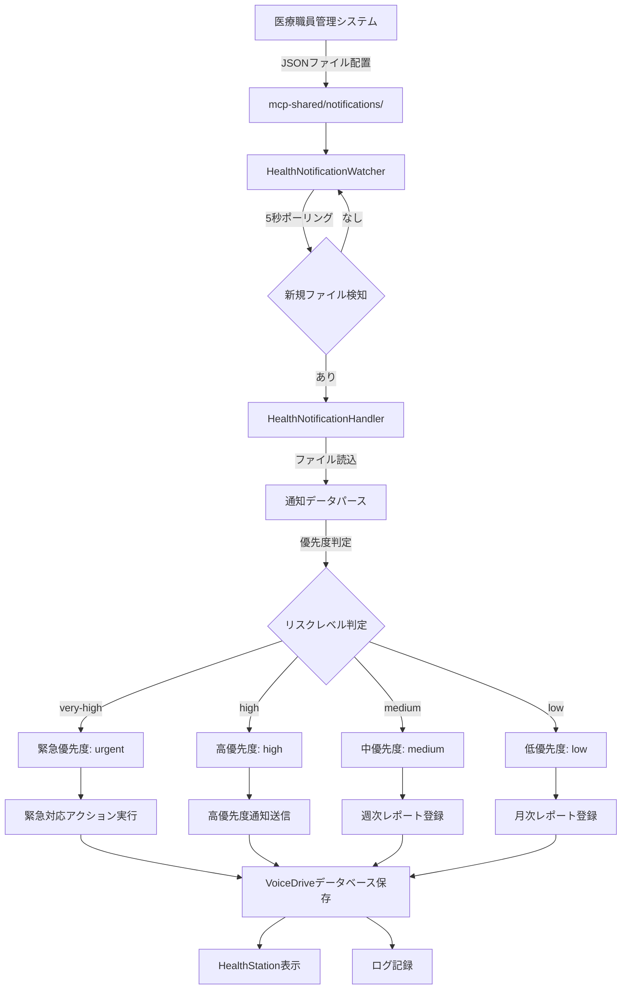

# VoiceDrive 健康ステーションDB要件分析
**作成日**: 2025年10月9日
**対象機能**: 健康ステーション（医療システム健康データ連携）
**分析範囲**: HealthStation, 健康通知受信, ファイル監視, レポート機能

---

## 📋 目次
1. [システム概要](#システム概要)
2. [健康通知システムの役割](#健康通知システムの役割)
3. [通知タイプと優先度](#通知タイプと優先度)
4. [健康データフロー](#健康データフロー)
5. [データ管理責任分界点](#データ管理責任分界点)
6. [テーブル設計](#テーブル設計)
7. [API設計](#api設計)
8. [Webhook設計](#webhook設計)
9. [実装優先度](#実装優先度)

---

## システム概要

### 健康ステーションの役割
VoiceDriveの健康ステーションは、**医療職員管理システムから職員の健康データを受信し、職員が自身の健康情報を確認できる**パーソナルヘルスダッシュボードです。

### 主要機能
1. **健康データ通知受信**: 医療システムから健康リスク評価・検診結果をファイル経由で受信
2. **ファイル監視**: `mcp-shared/notifications/` フォルダを自動監視し、新規通知を検知
3. **優先度判定**: リスクレベルに基づいて自動的に優先度を判定
4. **健康ダッシュボード**: 総合健康スコア、リスクレベル、推奨アクション表示
5. **通知管理**: 未読/既読管理、優先度別フィルタリング
6. **健康レポート**: 個人・部署・組織レベルの健康レポート生成

### 技術的特徴
- **ファイルベースの連携**: JSON形式の通知ファイルを `mcp-shared/notifications/` に配置
- **ポーリング監視**: 5秒間隔でフォルダを監視し、新規ファイルを自動処理
- **非同期処理**: 通知処理は非同期で実行され、結果をログに記録
- **優先度別アクション**: urgent/high/medium/lowに応じた自動対応

---

## 健康通知システムの役割

### 通知処理フロー



### 優先度別アクションマトリクス

| 優先度 | リスクレベル | 対応時間 | アクション |
|--------|--------------|----------|------------|
| **urgent** | very-high | 即座 | ・管理者への緊急通知<br>・緊急対応フロー起動<br>・職員の健康状態即座確認 |
| **high** | high | 24時間以内 | ・担当者への高優先度通知<br>・24時間以内の対応計画作成<br>・フォローアップスケジュール設定 |
| **medium** | medium | 1週間以内 | ・週次レポートに含める<br>・定期フォロー対象に追加 |
| **low** | low | 1ヶ月以内 | ・月次レポートに記録<br>・経過観察対象に追加 |

---

## 通知タイプと優先度

### 通知タイプ（4種類）

#### 1. health_risk_assessment（健康リスク評価完了通知）
- **説明**: 総合的な健康リスク評価結果の通知
- **含まれるデータ**: 総合スコア、リスクカテゴリー別評価、優先対応事項
- **優先度判定**: overallLevelに基づく自動判定

#### 2. health_checkup_result（健診結果通知）
- **説明**: 定期健康診断の結果通知
- **含まれるデータ**: 検査値、異常値フラグ、要精密検査項目
- **優先度判定**: 異常値の重症度に基づく

#### 3. stress_check_result（ストレスチェック結果通知）
- **説明**: ストレスチェック実施結果の通知
- **含まれるデータ**: ストレスレベル、高ストレス者判定、面談推奨
- **優先度判定**: ストレスレベルに基づく

#### 4. reexamination_required（要再検査通知）
- **説明**: 精密検査・再検査が必要な場合の通知
- **含まれるデータ**: 該当項目、推奨検査内容、期限
- **優先度判定**: 緊急度に基づく（通常はhigh以上）

### リスクレベル定義

| レベル | スコア範囲 | 説明 | 対応 |
|--------|-----------|------|------|
| **very-high** | 0-39点 | 要緊急対応 | 即座に医療機関受診・産業医面談 |
| **high** | 40-59点 | 要注意 | 1週間以内に保健指導・面談 |
| **medium** | 60-79点 | 経過観察 | 3ヶ月後フォローアップ |
| **low** | 80-100点 | 良好 | 次回定期健診まで経過観察 |

### 健康評価指標

```typescript
// health-notifications.ts より

interface HealthAssessment {
  overallScore: number;                  // 総合健康スコア（0-100）
  overallLevel: RiskLevel;               // 'very-high' | 'high' | 'medium' | 'low'
  highRiskCategories: HighRiskCategory[]; // 高リスクカテゴリー一覧
  priorityActions: string[];             // 優先対応事項
  nextCheckup: string;                   // 次回検診推奨日
}

interface HighRiskCategory {
  category: string;          // '代謝リスク', '心血管リスク', '肝機能リスク' など
  score: number;             // カテゴリー別スコア（0-100）
  level: RiskLevel;          // カテゴリー別リスクレベル
}
```

---

## 健康データフロー

### Phase 1: 通知ファイル配置（医療システム側）

医療システムが定期的に健康データを評価し、JSON形式で通知ファイルを作成します。

**ファイル命名規則**: `health_notif_{employeeId}_{timestamp}.json`

**例**: `health_notif_OH-NS-2024-001_20251009143000.json`

**ファイル配置先**: `c:\projects\voicedrive-v100\mcp-shared\notifications\`

### Phase 2: ファイル監視と検知（VoiceDrive側）

```typescript
// healthNotificationWatcher.ts より

export class HealthNotificationWatcher {
  private pollingInterval: number = 5000; // 5秒ポーリング

  // 新規通知をチェック
  private async checkForNewNotifications(): Promise<void> {
    const files = fs.readdirSync(this.notificationsPath);
    const notificationFiles = files.filter(
      filename => filename.startsWith('health_notif_') && filename.endsWith('.json')
    );

    for (const filename of notificationFiles) {
      if (!this.processedFiles.has(filename)) {
        await this.processNewFile(filename);
      }
    }
  }

  // ファイル安定性確認（書き込み完了待機）
  private async waitForFileStability(filePath: string): Promise<void> {
    // ファイルサイズが3回連続で同じ → 書き込み完了と判定
  }
}
```

### Phase 3: 通知処理とアクション実行

```typescript
// healthNotificationHandler.ts より

export class HealthNotificationHandler {
  // 優先度を判定
  private determinePriority(notification: HealthNotification): NotificationPriority {
    // メタデータに優先度が設定されている場合はそれを使用
    if (notification.metadata?.priority) {
      return notification.metadata.priority;
    }

    // リスクレベルから優先度を判定
    if (notification.assessment?.overallLevel) {
      const mapping: Record<RiskLevel, NotificationPriority> = {
        'very-high': 'urgent',
        'high': 'high',
        'medium': 'medium',
        'low': 'low'
      };
      return mapping[notification.assessment.overallLevel];
    }

    return 'medium'; // デフォルト
  }

  // 優先度別のアクションを実行
  private async executeActions(notification, priority): Promise<string[]> {
    const actions: string[] = [];

    switch (priority) {
      case 'urgent':
        actions.push('管理者への緊急通知を送信');
        actions.push('緊急対応フローを起動');
        actions.push('職員の健康状態を即座に確認');
        break;
      case 'high':
        actions.push('担当者への高優先度通知を送信');
        actions.push('24時間以内の対応計画を作成');
        actions.push('フォローアップスケジュールを設定');
        break;
      case 'medium':
        actions.push('週次レポートに含める');
        actions.push('定期フォロー対象に追加');
        break;
      case 'low':
        actions.push('月次レポートに記録');
        actions.push('経過観察対象に追加');
        break;
    }

    return actions;
  }
}
```

### Phase 4: VoiceDriveデータベース保存

処理された通知はVoiceDriveのデータベースに保存され、HealthStationで表示されます。

### Phase 5: 職員による確認

職員はHealthStationにアクセスし、自身の健康データを確認できます。

```typescript
// HealthStation.tsx より

// ダッシュボード表示
- 総通知数
- 未処理通知数
- 緊急対応必要数
- 要注意通知数

// 最新通知（上位3件）
- 優先度バッジ
- 健康スコア
- リスクレベル
- 推奨アクション
- 次回検診推奨日
```

---

## データ管理責任分界点

### VoiceDrive管轄（A: 完全管理）

| カテゴリ | データ種別 | 理由 |
|----------|------------|------|
| **通知受信データ** | HealthNotification（受信した通知の記録） | VoiceDrive独自の通知管理 |
| **通知処理ログ** | NotificationProcessLog（処理履歴・アクション記録） | VoiceDrive独自処理追跡 |
| **通知既読管理** | NotificationReadStatus（職員ごとの既読/未読状態） | VoiceDrive独自UI機能 |
| **健康レポート** | HealthReport（個人・部署・組織レポート） | VoiceDrive独自分析機能 |
| **通知設定** | NotificationSettings（職員ごとの通知設定） | VoiceDrive独自ユーザー設定 |

### 医療システム管轄（B: ファイル経由受信・VoiceDriveは参照のみ）

| カテゴリ | データ種別 | 取得方法 |
|----------|------------|----------|
| **健康診断生データ** | 検査値、測定値 | ファイル経由（health_checkup_result） |
| **リスク評価ロジック** | スコア計算、リスクレベル判定 | 医療システム側で実行済み |
| **健康診断スケジュール** | 次回検診日程、検診項目 | ファイル経由（nextCheckup） |
| **再検査必要判定** | 要精密検査項目、推奨検査 | ファイル経由（reexamination_required） |

### 完全独立（C: VoiceDrive内部処理のみ）

- **優先度別アクション実行**: urgent/high/medium/lowに応じた内部処理
- **ファイル監視**: mcp-shared/notifications/ の自動監視
- **通知UI表示**: HealthStationでの通知表示・フィルタリング
- **統計情報**: 未処理通知数、緊急対応数のカウント

### 医療システム通知不要（D: VoiceDrive完結）

健康ステーションは**一方向の受信専用システム**です。VoiceDriveから医療システムへ通知・Webhookを送信する必要はありません。

**例外**: 職員が健康データを確認したことを医療システムに通知する必要がある場合は、別途Webhook設計が必要です。

---

## テーブル設計

### 1. HealthNotification（健康通知）

```prisma
model HealthNotification {
  id                    String    @id @default(cuid())

  // 基本情報
  notificationType      String    // 'health_risk_assessment' | 'health_checkup_result' | 'stress_check_result' | 'reexamination_required'
  employeeId            String    // 職員ID（医療システムから受信）
  employeeName          String?   // 職員名（キャッシュ用）

  // 優先度・リスク情報
  priority              String    // 'urgent' | 'high' | 'medium' | 'low'
  riskLevel             String?   // 'very-high' | 'high' | 'medium' | 'low'
  overallScore          Float?    // 総合健康スコア（0-100）

  // 健康評価データ（JSON）
  healthAssessment      Json?     // HealthAssessment型
  recommendations       Json?     // HealthRecommendations型
  highRiskCategories    Json?     // HighRiskCategory[] 型

  // 推奨事項
  priorityActions       Json?     // string[] 優先対応事項
  nextCheckup           DateTime? // 次回検診推奨日

  // 通知メタデータ
  notificationSource    String?   // 'staff-medical-system'
  notificationVersion   String?   // '1.0.0'
  receivedAt            DateTime  @default(now())

  // 処理状態
  processedStatus       String    @default("pending") // 'pending' | 'processed' | 'failed'
  processedAt           DateTime?
  processingActions     Json?     // 実行されたアクション一覧

  // ファイル情報
  sourceFilename        String    // 元のファイル名（例: health_notif_OH-NS-2024-001_20251009143000.json）
  sourceFilePath        String?   // 元のファイルパス

  // 既読管理
  isRead                Boolean   @default(false)
  readAt                DateTime?

  // タイムスタンプ
  createdAt             DateTime  @default(now())
  updatedAt             DateTime  @updatedAt

  // リレーション
  processLogs           HealthNotificationProcessLog[]
  readStatus            HealthNotificationReadStatus[]

  @@index([employeeId])
  @@index([notificationType])
  @@index([priority])
  @@index([riskLevel])
  @@index([processedStatus])
  @@index([receivedAt])
}
```

### 2. HealthNotificationProcessLog（通知処理ログ）

```prisma
model HealthNotificationProcessLog {
  id                    String    @id @default(cuid())
  notificationId        String

  // 処理情報
  processType           String    // 'priority_determination' | 'action_execution' | 'error_handling'
  processStatus         String    // 'success' | 'failed'
  priority              String?   // 判定された優先度

  // 実行アクション
  actionsExecuted       Json?     // string[] 実行されたアクション
  actionResults         Json?     // アクション実行結果

  // エラー情報
  errorMessage          String?
  errorStack            String?

  // タイムスタンプ
  processedAt           DateTime  @default(now())

  // リレーション
  notification          HealthNotification @relation(fields: [notificationId], references: [id], onDelete: Cascade)

  @@index([notificationId])
  @@index([processType])
  @@index([processedAt])
}
```

### 3. HealthNotificationReadStatus（通知既読状態）

```prisma
model HealthNotificationReadStatus {
  id                    String    @id @default(cuid())
  notificationId        String
  employeeId            String

  // 既読状態
  isRead                Boolean   @default(false)
  readAt                DateTime?

  // アクション状態
  actionTaken           Boolean   @default(false) // 推奨アクションを実行したか
  actionTakenAt         DateTime?
  actionNotes           String?   // 実行したアクションの記録

  // タイムスタンプ
  createdAt             DateTime  @default(now())
  updatedAt             DateTime  @updatedAt

  // リレーション
  notification          HealthNotification @relation(fields: [notificationId], references: [id], onDelete: Cascade)

  @@unique([notificationId, employeeId])
  @@index([employeeId])
  @@index([isRead])
}
```

### 4. HealthReport（健康レポート）

```prisma
model HealthReport {
  id                    String    @id @default(cuid())
  reportId              String    @unique // レポート識別子

  // レポート基本情報
  reportType            String    // 'individual' | 'department' | 'organization'
  targetEmployeeId      String?   // 個人レポートの場合
  targetDepartment      String?   // 部署レポートの場合
  targetOrganization    String?   // 組織レポートの場合

  // レポート期間
  periodStart           DateTime
  periodEnd             DateTime

  // サマリー情報
  totalStaff            Int?      // 対象職員数
  averageScore          Float?    // 平均健康スコア
  highRiskCount         Int?      // 高リスク者数
  actionRequiredCount   Int?      // 要対応者数

  // レポートデータ（JSON）
  reportData            Json      // レポート本体データ

  // ファイル情報
  format                String    @default("json") // 'json' | 'markdown'
  filePath              String?   // レポートファイルパス

  // 生成情報
  generatedAt           DateTime  @default(now())
  generatedBy           String?   // 生成者（システムまたは職員ID）

  // タイムスタンプ
  createdAt             DateTime  @default(now())
  updatedAt             DateTime  @updatedAt

  @@index([reportType])
  @@index([targetEmployeeId])
  @@index([targetDepartment])
  @@index([generatedAt])
}
```

### 5. HealthNotificationSettings（通知設定）

```prisma
model HealthNotificationSettings {
  id                    String    @id @default(cuid())
  employeeId            String    @unique

  // 通知チャネル設定
  enableEmail           Boolean   @default(true)
  enablePush            Boolean   @default(true)
  enableSMS             Boolean   @default(false)

  // 優先度別通知設定
  notifyUrgent          Boolean   @default(true)  // 緊急通知を受け取る
  notifyHigh            Boolean   @default(true)  // 高優先度通知を受け取る
  notifyMedium          Boolean   @default(true)  // 中優先度通知を受け取る
  notifyLow             Boolean   @default(false) // 低優先度通知を受け取る（デフォルト無効）

  // 通知タイミング設定
  quietHoursStart       String?   // 静音時間開始（例: '22:00'）
  quietHoursEnd         String?   // 静音時間終了（例: '07:00'）

  // レポート受信設定
  receiveWeeklyReport   Boolean   @default(true)
  receiveMonthlyReport  Boolean   @default(true)

  // タイムスタンプ
  createdAt             DateTime  @default(now())
  updatedAt             DateTime  @updatedAt

  @@index([employeeId])
}
```

### 6. HealthCheckupData（健康診断データ）

```prisma
model HealthCheckupData {
  id                    String    @id @default(cuid())
  employeeId            String

  // 検診基本情報
  checkupDate           DateTime
  checkupType           String    // 'annual' | 'periodic' | 'follow_up'

  // 基本測定値
  height                Float?    // 身長（cm）
  weight                Float?    // 体重（kg）
  bmi                   Float?    // BMI

  // 血圧
  bloodPressureSystolic Float?    // 収縮期血圧
  bloodPressureDiastolic Float?   // 拡張期血圧

  // 血液検査（脂質）
  ldlCholesterol        Float?    // LDLコレステロール
  hdlCholesterol        Float?    // HDLコレステロール
  triglycerides         Float?    // 中性脂肪

  // 血液検査（糖代謝）
  bloodGlucose          Float?    // 血糖値
  hba1c                 Float?    // HbA1c

  // 血液検査（肝機能）
  ast                   Float?    // AST
  alt                   Float?    // ALT
  gammaGtp              Float?    // γ-GTP

  // 生活習慣
  smokingStatus         String?   // 'never' | 'past' | 'current'
  drinkingFrequency     String?   // 'none' | 'occasional' | 'regular'

  // リスクフラグ
  hasAbnormalValues     Boolean   @default(false)
  requiresReexamination Boolean   @default(false)
  abnormalItems         Json?     // 異常値項目リスト

  // 備考
  notes                 String?

  // タイムスタンプ
  createdAt             DateTime  @default(now())
  updatedAt             DateTime  @updatedAt

  @@index([employeeId])
  @@index([checkupDate])
  @@index([hasAbnormalValues])
  @@index([requiresReexamination])
}
```

---

## API設計

### VoiceDrive内部API（8個）

#### 1. GET /api/health/notifications
**通知一覧取得**

クエリパラメータ:
```
?limit=50
&includeProcessed=false
&employeeId=OH-NS-2024-001
&priority=urgent,high
```

レスポンス:
```json
{
  "success": true,
  "count": 15,
  "notifications": [
    {
      "filename": "health_notif_OH-NS-2024-001_20251009143000.json",
      "path": "c:\\projects\\voicedrive-v100\\mcp-shared\\notifications\\health_notif_OH-NS-2024-001_20251009143000.json",
      "createdAt": "2025-10-09T14:30:00Z",
      "processed": false
    }
  ]
}
```

#### 2. GET /api/health/notifications/:filename
**特定の通知取得**

レスポンス:
```json
{
  "success": true,
  "notification": {
    "type": "health_risk_assessment",
    "staffId": "OH-NS-2024-001",
    "timestamp": "2025-10-09T14:30:00Z",
    "assessment": {
      "overallScore": 65,
      "overallLevel": "medium",
      "highRiskCategories": [
        {
          "category": "代謝リスク",
          "score": 55,
          "level": "high"
        }
      ],
      "priorityActions": [
        "食事改善指導を受けてください",
        "運動習慣の見直しを行ってください"
      ],
      "nextCheckup": "2026-04-09T00:00:00Z"
    },
    "recommendations": {
      "lifestyle": ["規則正しい生活習慣"],
      "diet": ["塩分控えめ", "野菜を多く"],
      "exercise": ["週3回30分の有酸素運動"],
      "medicalFollowUp": ["3ヶ月後に再検査"]
    },
    "metadata": {
      "source": "staff-medical-system",
      "version": "1.0.0",
      "priority": "medium"
    }
  }
}
```

#### 3. POST /api/health/notifications/process
**未処理の通知をすべて処理**

レスポンス:
```json
{
  "success": true,
  "processed": 10,
  "successCount": 9,
  "failureCount": 1,
  "results": [
    {
      "success": true,
      "notificationId": "health_notif_OH-NS-2024-001_20251009143000.json",
      "staffId": "OH-NS-2024-001",
      "processedAt": "2025-10-09T14:35:00Z",
      "actions": [
        "週次レポートに含める",
        "定期フォロー対象に追加",
        "健康改善推奨事項を職員に通知"
      ]
    }
  ]
}
```

#### 4. GET /api/health/notifications/stats
**通知統計情報取得**

レスポンス:
```json
{
  "success": true,
  "stats": {
    "total": 50,
    "processed": 40,
    "pending": 10,
    "urgentCount": 2,
    "highCount": 5,
    "mediumCount": 8,
    "lowCount": 35
  }
}
```

#### 5. GET /api/health/reports
**レポート一覧取得**

クエリパラメータ:
```
?limit=20
&reportType=individual
```

レスポンス:
```json
{
  "success": true,
  "count": 15,
  "reports": [
    {
      "reportId": "health_report_2025Q3_individual",
      "reportType": "individual",
      "period": {
        "start": "2025-07-01T00:00:00Z",
        "end": "2025-09-30T23:59:59Z"
      },
      "generatedAt": "2025-10-01T09:00:00Z",
      "summary": {
        "totalStaff": 1,
        "averageScore": 68.5,
        "highRiskCount": 0,
        "actionRequiredCount": 1
      },
      "filename": "health_report_2025Q3_individual.json"
    }
  ]
}
```

#### 6. GET /api/health/reports/:reportId
**特定のレポート取得**

クエリパラメータ:
```
?format=json (または markdown)
```

レスポンス:
```json
{
  "success": true,
  "report": {
    "reportId": "health_report_2025Q3_individual",
    "staffId": "OH-NS-2024-001",
    "reportType": "individual",
    "period": {
      "start": "2025-07-01T00:00:00Z",
      "end": "2025-09-30T23:59:59Z"
    },
    "summary": {
      "totalStaff": 1,
      "averageScore": 68.5,
      "highRiskCount": 0,
      "actionRequiredCount": 1
    },
    "data": {
      "healthTrend": [...],
      "riskCategories": [...],
      "recommendations": [...]
    },
    "generatedAt": "2025-10-01T09:00:00Z",
    "format": "json"
  }
}
```

#### 7. GET /api/health/watcher/status
**ファイル監視状態取得**

レスポンス:
```json
{
  "success": true,
  "status": {
    "isWatching": true,
    "notificationsPath": "c:\\projects\\voicedrive-v100\\mcp-shared\\notifications",
    "pollingInterval": 5000,
    "processedCount": 42
  }
}
```

#### 8. POST /api/health/watcher/start
**ファイル監視開始**

レスポンス:
```json
{
  "success": true,
  "message": "ファイル監視を開始しました"
}
```

---

## Webhook設計

### 医療システムからVoiceDriveへのWebhook（1個）

#### WH-HS-M-1: POST /webhook/health-notification（健康通知受信）

**※重要**: 現在の実装では**ファイルベースの連携**を使用しているため、WebhookではなくJSON形式のファイルを `mcp-shared/notifications/` に配置する方式です。

将来的にWebhook方式に移行する場合の設計案：

**リクエスト**:
```json
{
  "type": "health_risk_assessment",
  "staffId": "OH-NS-2024-001",
  "timestamp": "2025-10-09T14:30:00Z",
  "assessment": {
    "overallScore": 65,
    "overallLevel": "medium",
    "highRiskCategories": [
      {
        "category": "代謝リスク",
        "score": 55,
        "level": "high"
      }
    ],
    "priorityActions": [
      "食事改善指導を受けてください",
      "運動習慣の見直しを行ってください"
    ],
    "nextCheckup": "2026-04-09T00:00:00Z"
  },
  "recommendations": {
    "lifestyle": ["規則正しい生活習慣"],
    "diet": ["塩分控えめ", "野菜を多く"],
    "exercise": ["週3回30分の有酸素運動"],
    "medicalFollowUp": ["3ヶ月後に再検査"]
  },
  "metadata": {
    "source": "staff-medical-system",
    "version": "1.0.0",
    "priority": "medium"
  },
  "signature": "HMAC-SHA256-SIGNATURE"
}
```

**レスポンス**:
```json
{
  "success": true,
  "notificationId": "notif-123456",
  "receivedAt": "2025-10-09T14:30:05Z",
  "processedStatus": "processed",
  "actions": [
    "週次レポートに含める",
    "定期フォロー対象に追加",
    "健康改善推奨事項を職員に通知"
  ]
}
```

**Phase**: 3（将来実装）
**優先度**: 低（現在はファイルベース連携で十分）
**見積工数**: 5日
**見積金額**: ¥400,000

### VoiceDriveから医療システムへのWebhook

**現在の設計では不要**です。健康ステーションは受信専用システムです。

**将来的に必要になる可能性があるケース**:
- 職員が健康データを確認したことを医療システムに通知
- 職員が推奨アクションを実行したことを医療システムに通知
- 職員が再検査を予約したことを医療システムに通知

---

## 実装優先度

### Phase 1: 基本通知受信機能（1週間）- 医療システム連携不要

#### Week 1: ファイル監視と通知処理
1. **HealthNotificationテーブル追加** (1日)
   - Prismaスキーマ定義
   - マイグレーション実行

2. **HealthNotificationProcessLogテーブル追加** (0.5日)
   - 処理ログ記録用テーブル

3. **HealthNotificationReadStatusテーブル追加** (0.5日)
   - 既読管理用テーブル

4. **ファイル監視機能統合** (1日)
   - healthNotificationWatcher.ts 既存実装の動作確認
   - データベース保存処理追加

5. **通知処理ハンドラー統合** (1日)
   - healthNotificationHandler.ts 既存実装の動作確認
   - データベース連携追加

6. **HealthStation UI統合** (2日)
   - 既存UIからデータベース読み込みに変更
   - 未処理通知フィルタリング実装
   - 優先度別表示実装

**成果物**:
- ファイル監視システム稼働
- 通知データベース保存動作
- HealthStation表示動作

**医療システム工数**: 0日（ファイルベース連携のため不要）

### Phase 2: 既読管理・統計機能（1週間）- 医療システム連携不要

#### Week 2: 既読管理と統計
1. **既読管理API実装** (2日)
   - POST /api/health/notifications/:id/mark-as-read
   - PUT /api/health/notifications/:id/action-taken

2. **統計API実装** (1日)
   - GET /api/health/notifications/stats 強化
   - 優先度別カウント
   - 部署別統計

3. **フィルタリング機能** (2日)
   - 優先度別フィルタ
   - リスクレベル別フィルタ
   - 既読/未読フィルタ

4. **HealthStation UI改善** (2日)
   - 既読/未読切り替え
   - 優先度別タブ
   - アクション記録機能

**成果物**:
- 既読管理機能動作
- 統計情報表示
- フィルタリング機能

**医療システム工数**: 0日（VoiceDrive内部機能のため不要）

### Phase 3: レポート機能（1週間）- 医療システム連携不要

#### Week 3: 健康レポート生成
1. **HealthReportテーブル追加** (0.5日)

2. **レポート生成ロジック実装** (2日)
   - 個人レポート生成
   - 部署レポート生成
   - 組織レポート生成

3. **レポートAPI実装** (1日)
   - GET /api/health/reports
   - GET /api/health/reports/:reportId
   - POST /api/health/reports/generate

4. **レポートUI実装** (2.5日)
   - レポート一覧表示
   - レポート詳細表示
   - Markdown/PDF出力

5. **統合テスト** (1日)

**成果物**:
- レポート生成機能動作
- レポートUI表示
- PDF/Markdown出力

**医療システム工数**: 0日（VoiceDrive内部機能のため不要）

---

## 見積もりサマリー

| フェーズ | 期間 | 内容 | VoiceDrive工数 | 医療システム工数 | 医療システム金額 |
|---------|------|------|----------------|-----------------|----------------|
| **Phase 1** | 1週間 | 基本通知受信 | 7日 | 0日 | ¥0 |
| **Phase 2** | 1週間 | 既読管理・統計 | 7日 | 0日 | ¥0 |
| **Phase 3** | 1週間 | レポート機能 | 7日 | 0日 | ¥0 |
| **合計** | **3週間** | **全機能** | **21日** | **0日** | **¥0** |

**医療システムチーム必要工数**: 0日（ファイルベース連携のため不要）
**医療システムチーム見積金額**: ¥0
**VoiceDriveチーム工数**: 21日

**特記事項**:
- 健康ステーションは**ファイルベースの一方向受信専用システム**です
- 医療システム側はJSONファイルを `mcp-shared/notifications/` に配置するだけで連携完了
- API開発・Webhook実装は不要
- 将来的にWebhook方式に移行する場合は、Phase 4として別途見積もり

---

## 確認事項（医療システムチームへ）

### 技術的確認
1. **ファイル配置方式**: `mcp-shared/notifications/` フォルダへのファイル配置方式で問題ありませんか？
2. **ファイル命名規則**: `health_notif_{employeeId}_{timestamp}.json` の形式で問題ありませんか？
3. **通知タイプ**: 4種類の通知タイプ（health_risk_assessment, health_checkup_result, stress_check_result, reexamination_required）で十分ですか？
4. **リスクレベル判定**: 医療システム側でリスクレベル判定を行い、VoiceDriveは受信するだけで問題ありませんか？
5. **健康診断データ**: 検査値の生データはVoiceDriveに保存する必要がありますか？それとも医療システム側で保持しますか？

### 運用的確認
6. **通知配信頻度**: 健康通知はどのくらいの頻度で配信されますか？（日次/週次/月次/随時）
7. **ファイル削除**: 処理済み通知ファイルはVoiceDrive側で削除して良いですか？それとも医療システム側で管理しますか？
8. **通知遅延**: ファイル配置からVoiceDriveでの表示まで最大5秒の遅延が発生しますが、問題ありませんか？
9. **緊急通知**: urgent優先度の通知の場合、5秒ポーリングでは遅すぎますか？リアルタイム通知が必要ですか？
10. **バックアップ**: 健康通知データのバックアップ体制はどちら側で管理しますか？

### データ連携確認
11. **職員ID同期**: employeeIdは医療システムとVoiceDriveで完全一致していますか？
12. **通知形式変更**: 将来的に通知データ形式が変更される可能性はありますか？バージョン管理は必要ですか？
13. **再検査フォロー**: 要再検査通知後、職員が再検査を受けたかどうかをVoiceDriveから医療システムに通知する必要はありますか？
14. **プライバシー保護**: 健康データの保存期間やアクセス権限に関する規定はありますか？
15. **Webhook移行**: 将来的にファイルベースからWebhook方式に移行する予定はありますか？

---

## 添付資料

### A. 通知タイプ別サンプルJSON

#### health_risk_assessment（健康リスク評価）
```json
{
  "type": "health_risk_assessment",
  "staffId": "OH-NS-2024-001",
  "timestamp": "2025-10-09T14:30:00Z",
  "assessment": {
    "overallScore": 65,
    "overallLevel": "medium",
    "highRiskCategories": [
      {
        "category": "代謝リスク",
        "score": 55,
        "level": "high"
      }
    ],
    "priorityActions": [
      "食事改善指導を受けてください",
      "運動習慣の見直しを行ってください"
    ],
    "nextCheckup": "2026-04-09T00:00:00Z"
  },
  "recommendations": {
    "lifestyle": ["規則正しい生活習慣"],
    "diet": ["塩分控えめ", "野菜を多く"],
    "exercise": ["週3回30分の有酸素運動"],
    "medicalFollowUp": ["3ヶ月後に再検査"]
  },
  "metadata": {
    "source": "staff-medical-system",
    "version": "1.0.0",
    "priority": "medium"
  }
}
```

#### reexamination_required（要再検査通知）
```json
{
  "type": "reexamination_required",
  "staffId": "OH-NS-2024-002",
  "timestamp": "2025-10-09T15:00:00Z",
  "assessment": {
    "overallScore": 45,
    "overallLevel": "high",
    "highRiskCategories": [
      {
        "category": "心血管リスク",
        "score": 38,
        "level": "very-high"
      }
    ],
    "priorityActions": [
      "至急、循環器内科を受診してください",
      "産業医面談を予約してください"
    ],
    "nextCheckup": "2025-10-20T00:00:00Z"
  },
  "recommendations": {
    "lifestyle": ["禁煙を強く推奨"],
    "diet": ["減塩食を徹底"],
    "exercise": ["医師の指導のもとで運動"],
    "medicalFollowUp": ["2週間以内に精密検査"]
  },
  "metadata": {
    "source": "staff-medical-system",
    "version": "1.0.0",
    "priority": "urgent"
  }
}
```

### B. ファイル監視フロー図

```
医療システム                VoiceDrive
     |                          |
     |--- JSONファイル配置 --->  mcp-shared/notifications/
     |                          |
     |                          |--- 5秒ポーリング
     |                          |    (HealthNotificationWatcher)
     |                          |
     |                          |--- 新規ファイル検知
     |                          |
     |                          |--- ファイル安定性確認
     |                          |    (書き込み完了待機)
     |                          |
     |                          |--- JSONパース
     |                          |    (HealthNotificationHandler)
     |                          |
     |                          |--- 優先度判定
     |                          |    (リスクレベル → 優先度)
     |                          |
     |                          |--- アクション実行
     |                          |    (urgent/high/medium/low)
     |                          |
     |                          |--- データベース保存
     |                          |    (HealthNotification)
     |                          |
     |                          |--- ログ記録
     |                          |    (HealthNotificationProcessLog)
     |                          |
     |                          |--- HealthStation表示
```

### C. 優先度別対応マトリクス

| 優先度 | リスクレベル | アクション | 対応者 | 対応期限 |
|--------|--------------|-----------|--------|----------|
| **urgent** | very-high | ・管理者への緊急通知<br>・緊急対応フロー起動<br>・職員の健康状態即座確認 | 産業医・人事部 | 即座 |
| **high** | high | ・担当者への高優先度通知<br>・24時間以内の対応計画作成<br>・フォローアップスケジュール設定 | 保健師・人事部 | 24時間以内 |
| **medium** | medium | ・週次レポートに含める<br>・定期フォロー対象に追加 | 保健師 | 1週間以内 |
| **low** | low | ・月次レポートに記録<br>・経過観察対象に追加 | 保健師 | 1ヶ月以内 |

---

**作成者**: Claude (AI Assistant)
**レビュー**: VoiceDrive開発チーム
**承認**: 医療職員管理システムチーム

**次回アクション**:
1. 医療システムチームへ確認事項回答依頼
2. Phase 1実装計画詳細化
3. テーブル設計レビュー会議設定（医療システム連携不要のため社内のみ）
