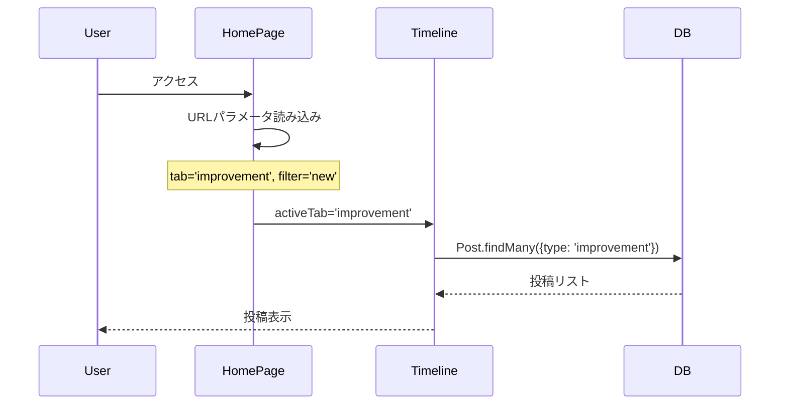
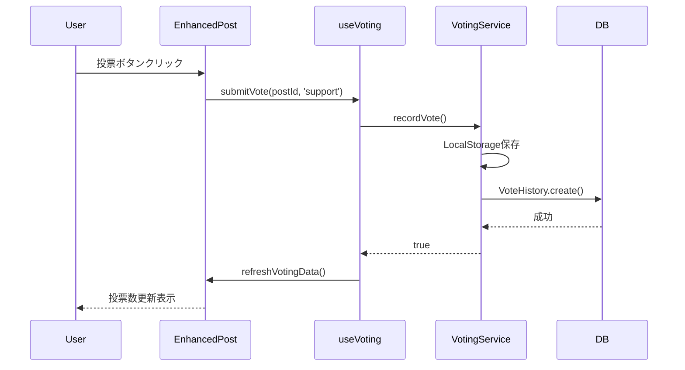

# HomePage暫定マスターリスト

**文書番号**: DB-MASTER-2025-1027-002
**作成日**: 2025年10月27日
**対象ページ**: https://voicedrive-v100.vercel.app/ (HomePage)
**関連分析**: [HomePage_DB要件分析_20251027.md](./HomePage_DB要件分析_20251027.md)

---

## 📋 データ項目カタログ

### 全体サマリー

| カテゴリ | 項目数 | 医療システム管理 | VoiceDrive管理 | 備考 |
|---------|--------|----------------|---------------|------|
| URLパラメータ | 2 | 0 | 2 | フロントエンド状態管理 |
| ユーザー情報 | 6 | 5 | 1 | 医療システムからキャッシュ |
| 投稿データ | 15 | 0 | 15 | VoiceDrive中核データ |
| 投票データ | 8 | 0 | 8 | VoiceDrive活動記録 |
| コメントデータ | 7 | 0 | 7 | VoiceDrive活動記録 |
| UI状態管理 | 5 | 0 | 5 | フロントエンド状態 |
| **合計** | **43** | **5** | **38** | |

---

## 1️⃣ URLパラメータ（2項目）

### 1.1 tab（タブ選択）

| 項目 | 詳細 |
|------|------|
| **データ項目名** | `tab` |
| **データ型** | `string` |
| **必須/任意** | 任意 |
| **デフォルト値** | `'improvement'` |
| **取りうる値** | `'improvement'`, `'community'`, `'freevoice'`, `'urgent'` |
| **データ管理責任** | VoiceDrive（フロントエンド） |
| **データソース** | URLパラメータ |
| **実装箇所** | `HomePage.tsx` 16行目 |
| **用途** | タブ切り替え制御 |
| **備考** | URLパラメータで状態管理 |

### 1.2 filter（フィルタ選択）

| 項目 | 詳細 |
|------|------|
| **データ項目名** | `filter` |
| **データ型** | `string` |
| **必須/任意** | 任意 |
| **デフォルト値** | タブに応じて変動（`'new'` or `'latest'`） |
| **取りうる値** | `'new'`, `'latest'`, `'all'` |
| **データ管理責任** | VoiceDrive（フロントエンド） |
| **データソース** | URLパラメータ |
| **実装箇所** | `HomePage.tsx` 17行目 |
| **用途** | 投稿フィルタ制御 |
| **備考** | タブごとのデフォルトフィルタが異なる |

---

## 2️⃣ ユーザー情報（6項目）

### 2.1 currentUser（ログインユーザー）

| 項目 | 詳細 |
|------|------|
| **データ項目名** | `currentUser` |
| **データ型** | `User` オブジェクト |
| **必須/任意** | 必須 |
| **データ管理責任** | VoiceDrive（キャッシュ） ← 医療システム（マスタ） |
| **データソース** | `User`テーブル |
| **実装箇所** | `Timeline.tsx` 34-52行目 |
| **用途** | 認証・権限チェック |
| **API連携** | 医療システムAPI（JWT認証） |
| **備考** | `useDemoMode`と`useAuth`の二重チェック |

### 2.2 employeeId（職員ID）

| 項目 | 詳細 |
|------|------|
| **データ項目名** | `currentUser.employeeId` |
| **データ型** | `string` |
| **必須/任意** | 必須 |
| **データ管理責任** | 医療システム（マスタ） → VoiceDrive（キャッシュ） |
| **データソース** | `User.employeeId` ← 医療システム`Employee.employeeId` |
| **実装箇所** | `User`テーブル |
| **用途** | 職員識別子 |
| **API連携** | 医療システムAPI |
| **備考** | データ管理責任分界点定義書に基づく |

### 2.3 name（氏名）

| 項目 | 詳細 |
|------|------|
| **データ項目名** | `currentUser.name` |
| **データ型** | `string` |
| **必須/任意** | 必須 |
| **データ管理責任** | 医療システム（マスタ） → VoiceDrive（キャッシュ） |
| **データソース** | `User.name` ← 医療システム`Employee.name` |
| **実装箇所** | `User`テーブル |
| **用途** | 投稿者表示（実名モード時） |
| **API連携** | 医療システムAPI + Webhook |
| **備考** | 変更時はWebhook通知 |

### 2.4 department（部署）

| 項目 | 詳細 |
|------|------|
| **データ項目名** | `currentUser.department` |
| **データ型** | `string` |
| **必須/任意** | 任意 |
| **データ管理責任** | 医療システム（マスタ） → VoiceDrive（キャッシュ） |
| **データソース** | `User.department` ← 医療システム`Employee.department` |
| **実装箇所** | `User`テーブル |
| **用途** | 投稿フィルタリング・表示 |
| **API連携** | 医療システムAPI + Webhook |
| **備考** | 部署異動時はWebhook通知 |

### 2.5 permissionLevel（権限レベル）

| 項目 | 詳細 |
|------|------|
| **データ項目名** | `currentUser.permissionLevel` |
| **データ型** | `Decimal` (1.0-25.0) |
| **必須/任意** | 必須 |
| **データ管理責任** | 医療システム（マスタ） → VoiceDrive（キャッシュ） |
| **データソース** | `User.permissionLevel` ← 医療システムV3評価 |
| **実装箇所** | `User`テーブル |
| **用途** | 機能アクセス制御・投票重み付け |
| **API連携** | 医療システムAPI + Webhook |
| **備考** | V3評価確定時にWebhook通知 |

### 2.6 professionCategory（職種カテゴリ）

| 項目 | 詳細 |
|------|------|
| **データ項目名** | `currentUser.professionCategory` |
| **データ型** | `string` |
| **必須/任意** | 任意 |
| **データ管理責任** | 医療システム（マスタ） → VoiceDrive（キャッシュ） |
| **データソース** | `User.professionCategory` ← 医療システム`Employee.professionCategory` |
| **実装箇所** | `User`テーブル |
| **用途** | 投稿フィルタリング・統計分析 |
| **API連携** | 医療システムAPI |
| **備考** | nurse, doctor, admin等 |

---

## 3️⃣ 投稿データ（15項目）

### 3.1 id（投稿ID）

| 項目 | 詳細 |
|------|------|
| **データ項目名** | `post.id` |
| **データ型** | `string` (cuid) |
| **必須/任意** | 必須 |
| **データ管理責任** | VoiceDrive（マスタ） |
| **データソース** | `Post.id` |
| **実装箇所** | `Post`テーブル |
| **用途** | 投稿一意識別子 |
| **備考** | Prisma `@default(cuid())` |

### 3.2 type（投稿タイプ）

| 項目 | 詳細 |
|------|------|
| **データ項目名** | `post.type` |
| **データ型** | `string` |
| **必須/任意** | 必須 |
| **取りうる値** | `'improvement'`, `'community'`, `'report'` |
| **データ管理責任** | VoiceDrive（マスタ） |
| **データソース** | `Post.type` |
| **実装箇所** | `Post`テーブル |
| **用途** | タブフィルタリング |
| **備考** | HomePageのタブ切り替えで使用 |

### 3.3 content（投稿内容）

| 項目 | 詳細 |
|------|------|
| **データ項目名** | `post.content` |
| **データ型** | `string` |
| **必須/任意** | 必須 |
| **データ管理責任** | VoiceDrive（マスタ） |
| **データソース** | `Post.content` |
| **実装箇所** | `Post`テーブル |
| **用途** | 投稿本文表示 |
| **備考** | Markdown対応 |

### 3.4 authorId（投稿者ID）

| 項目 | 詳細 |
|------|------|
| **データ項目名** | `post.authorId` |
| **データ型** | `string` |
| **必須/任意** | 必須 |
| **データ管理責任** | VoiceDrive（マスタ） |
| **データソース** | `Post.authorId` → `User.id` |
| **実装箇所** | `Post`テーブル |
| **用途** | 投稿者情報取得 |
| **備考** | リレーション: `@relation("PostAuthor")` |

### 3.5 anonymityLevel（匿名レベル）

| 項目 | 詳細 |
|------|------|
| **データ項目名** | `post.anonymityLevel` |
| **データ型** | `string` |
| **必須/任意** | 必須 |
| **取りうる値** | `'real_name'`, `'role_only'`, `'anonymous'`, `'complete_anonymous'` |
| **データ管理責任** | VoiceDrive（マスタ） |
| **データソース** | `Post.anonymityLevel` |
| **実装箇所** | `Post`テーブル |
| **用途** | 投稿者情報表示制御 |
| **備考** | 匿名性の段階制御 |

### 3.6 priority（優先度）

| 項目 | 詳細 |
|------|------|
| **データ項目名** | `post.priority` |
| **データ型** | `string` |
| **必須/任意** | 任意 |
| **取りうる値** | `'low'`, `'medium'`, `'high'`, `'urgent'` |
| **データ管理責任** | VoiceDrive（マスタ） |
| **データソース** | `Post.priority` |
| **実装箇所** | `Post`テーブル |
| **用途** | 緊急タブフィルタリング |
| **備考** | `urgent`タブで`high`と`urgent`を表示 |

### 3.7 createdAt（投稿日時）

| 項目 | 詳細 |
|------|------|
| **データ項目名** | `post.createdAt` |
| **データ型** | `DateTime` |
| **必須/任意** | 必須 |
| **デフォルト値** | `now()` |
| **データ管理責任** | VoiceDrive（マスタ） |
| **データソース** | `Post.createdAt` |
| **実装箇所** | `Post`テーブル |
| **用途** | ソート・タイムスタンプ表示 |
| **備考** | Prisma `@default(now())` |

### 3.8 agendaScore（議題スコア）

| 項目 | 詳細 |
|------|------|
| **データ項目名** | `post.agendaScore` |
| **データ型** | `Int` |
| **必須/任意** | 任意 |
| **デフォルト値** | `0` |
| **データ管理責任** | VoiceDrive（マスタ） |
| **データソース** | `Post.agendaScore` |
| **実装箇所** | `Post`テーブル |
| **用途** | 議題レベル判定 |
| **備考** | 投票から算出（50点でプロジェクト化） |

### 3.9 agendaLevel（議題レベル）

| 項目 | 詳細 |
|------|------|
| **データ項目名** | `post.agendaLevel` |
| **データ型** | `string` |
| **必須/任意** | 任意 |
| **取りうる値** | `'部署内'`, `'施設内'`, `'法人内'` |
| **データ管理責任** | VoiceDrive（マスタ） |
| **データソース** | `Post.agendaLevel` |
| **実装箇所** | `Post`テーブル |
| **用途** | プロジェクトレベル表示 |
| **備考** | `agendaScore`から自動計算 |

### 3.10 votes（投票集計）

| 項目 | 詳細 |
|------|------|
| **データ項目名** | `post.votes` |
| **データ型** | `Vote[]` (リレーション) |
| **必須/任意** | 任意 |
| **データ管理責任** | VoiceDrive（マスタ） |
| **データソース** | `Vote`テーブル（リレーション） |
| **実装箇所** | `Post`テーブル |
| **用途** | 投票数集計 |
| **備考** | 集計値は`stronglySupportCount`等のフィールドに保存 |

### 3.11 stronglySupportCount（強い賛成数）

| 項目 | 詳細 |
|------|------|
| **データ項目名** | `post.stronglySupportCount` |
| **データ型** | `Int` |
| **必須/任意** | 必須 |
| **デフォルト値** | `0` |
| **データ管理責任** | VoiceDrive（マスタ） |
| **データソース** | `Post.stronglySupportCount` |
| **実装箇所** | `Post`テーブル |
| **用途** | 投票集計表示 |
| **備考** | `Vote`テーブルから集計して更新 |

### 3.12 supportCount（賛成数）

| 項目 | 詳細 |
|------|------|
| **データ項目名** | `post.supportCount` |
| **データ型** | `Int` |
| **必須/任意** | 必須 |
| **デフォルト値** | `0` |
| **データ管理責任** | VoiceDrive（マスタ） |
| **データソース** | `Post.supportCount` |
| **実装箇所** | `Post`テーブル |
| **用途** | 投票集計表示 |
| **備考** | `Vote`テーブルから集計して更新 |

### 3.13 neutralCount（中立数）

| 項目 | 詳細 |
|------|------|
| **データ項目名** | `post.neutralCount` |
| **データ型** | `Int` |
| **必須/任意** | 必須 |
| **デフォルト値** | `0` |
| **データ管理責任** | VoiceDrive（マスタ） |
| **データソース** | `Post.neutralCount` |
| **実装箇所** | `Post`テーブル |
| **用途** | 投票集計表示 |
| **備考** | `Vote`テーブルから集計して更新 |

### 3.14 opposeCount（反対数）

| 項目 | 詳細 |
|------|------|
| **データ項目名** | `post.opposeCount` |
| **データ型** | `Int` |
| **必須/任意** | 必須 |
| **デフォルト値** | `0` |
| **データ管理責任** | VoiceDrive（マスタ） |
| **データソース** | `Post.opposeCount` |
| **実装箇所** | `Post`テーブル |
| **用途** | 投票集計表示 |
| **備考** | `Vote`テーブルから集計して更新 |

### 3.15 stronglyOpposeCount（強い反対数）

| 項目 | 詳細 |
|------|------|
| **データ項目名** | `post.stronglyOpposeCount` |
| **データ型** | `Int` |
| **必須/任意** | 必須 |
| **デフォルト値** | `0` |
| **データ管理責任** | VoiceDrive（マスタ） |
| **データソース** | `Post.stronglyOpposeCount` |
| **実装箇所** | `Post`テーブル |
| **用途** | 投票集計表示 |
| **備考** | `Vote`テーブルから集計して更新 |

---

## 4️⃣ 投票データ（8項目）

### 4.1 id（投票ID）

| 項目 | 詳細 |
|------|------|
| **データ項目名** | `vote.id` |
| **データ型** | `string` (cuid) |
| **必須/任意** | 必須 |
| **データ管理責任** | VoiceDrive（マスタ） |
| **データソース** | `Vote.id` / `VoteHistory.id` |
| **実装箇所** | `Vote`テーブル, `VoteHistory`テーブル |
| **用途** | 投票一意識別子 |
| **備考** | Prisma `@default(cuid())` |

### 4.2 postId（投稿ID）

| 項目 | 詳細 |
|------|------|
| **データ項目名** | `vote.postId` |
| **データ型** | `string` |
| **必須/任意** | 必須 |
| **データ管理責任** | VoiceDrive（マスタ） |
| **データソース** | `Vote.postId` / `VoteHistory.postId` |
| **実装箇所** | `Vote`テーブル, `VoteHistory`テーブル |
| **用途** | 投票対象の投稿特定 |
| **備考** | リレーション: `Post` |

### 4.3 userId（投票者ID）

| 項目 | 詳細 |
|------|------|
| **データ項目名** | `vote.userId` |
| **データ型** | `string` |
| **必須/任意** | 必須 |
| **データ管理責任** | VoiceDrive（マスタ） |
| **データソース** | `Vote.userId` / `VoteHistory.userId` |
| **実装箇所** | `Vote`テーブル, `VoteHistory`テーブル |
| **用途** | 投票者特定・重複チェック |
| **備考** | リレーション: `User`, ユニーク制約: `@@unique([postId, userId])` |

### 4.4 option（投票選択肢）

| 項目 | 詳細 |
|------|------|
| **データ項目名** | `vote.option` / `voteHistory.voteOption` |
| **データ型** | `string` |
| **必須/任意** | 必須 |
| **取りうる値** | `'strongly-oppose'`, `'oppose'`, `'neutral'`, `'support'`, `'strongly-support'` |
| **データ管理責任** | VoiceDrive（マスタ） |
| **データソース** | `Vote.option` / `VoteHistory.voteOption` |
| **実装箇所** | `Vote`テーブル, `VoteHistory`テーブル |
| **用途** | 投票内容記録 |
| **備考** | 5段階評価 |

### 4.5 voteWeight（投票重み）

| 項目 | 詳細 |
|------|------|
| **データ項目名** | `voteHistory.voteWeight` |
| **データ型** | `Float` |
| **必須/任意** | 必須 |
| **デフォルト値** | `1.0` |
| **データ管理責任** | VoiceDrive（マスタ） |
| **データソース** | `VoteHistory.voteWeight` |
| **実装箇所** | `VoteHistory`テーブル |
| **用途** | 権限レベルに応じた投票重み付け |
| **備考** | 将来的に`permissionLevel`から算出 |

### 4.6 votedAt（投票日時）

| 項目 | 詳細 |
|------|------|
| **データ項目名** | `vote.timestamp` / `voteHistory.votedAt` |
| **データ型** | `DateTime` |
| **必須/任意** | 必須 |
| **デフォルト値** | `now()` |
| **データ管理責任** | VoiceDrive（マスタ） |
| **データソース** | `Vote.timestamp` / `VoteHistory.votedAt` |
| **実装箇所** | `Vote`テーブル, `VoteHistory`テーブル |
| **用途** | 投票タイムスタンプ・統計分析 |
| **備考** | Prisma `@default(now())` |

### 4.7 postCategory（投稿カテゴリ）

| 項目 | 詳細 |
|------|------|
| **データ項目名** | `voteHistory.postCategory` |
| **データ型** | `string` |
| **必須/任意** | 任意 |
| **取りうる値** | `'improvement'`, `'communication'`, `'innovation'`, `'strategy'` |
| **データ管理責任** | VoiceDrive（マスタ） |
| **データソース** | `VoteHistory.postCategory` |
| **実装箇所** | `VoteHistory`テーブル |
| **用途** | カテゴリ別投票統計 |
| **備考** | PersonalStationページでの統計表示用 |

### 4.8 postType（投稿タイプ）

| 項目 | 詳細 |
|------|------|
| **データ項目名** | `voteHistory.postType` |
| **データ型** | `string` |
| **必須/任意** | 任意 |
| **取りうる値** | `'improvement'`, `'community'`, `'report'` |
| **データ管理責任** | VoiceDrive（マスタ） |
| **データソース** | `VoteHistory.postType` |
| **実装箇所** | `VoteHistory`テーブル |
| **用途** | タイプ別投票統計 |
| **備考** | 統計分析用 |

---

## 5️⃣ コメントデータ（7項目）

### 5.1 id（コメントID）

| 項目 | 詳細 |
|------|------|
| **データ項目名** | `comment.id` |
| **データ型** | `string` (cuid) |
| **必須/任意** | 必須 |
| **データ管理責任** | VoiceDrive（マスタ） |
| **データソース** | `Comment.id` |
| **実装箇所** | `Comment`テーブル |
| **用途** | コメント一意識別子 |
| **備考** | Prisma `@default(cuid())` |

### 5.2 postId（投稿ID）

| 項目 | 詳細 |
|------|------|
| **データ項目名** | `comment.postId` |
| **データ型** | `string` |
| **必須/任意** | 必須 |
| **データ管理責任** | VoiceDrive（マスタ） |
| **データソース** | `Comment.postId` |
| **実装箇所** | `Comment`テーブル |
| **用途** | コメント対象の投稿特定 |
| **備考** | リレーション: `Post` |

### 5.3 authorId（コメント投稿者ID）

| 項目 | 詳細 |
|------|------|
| **データ項目名** | `comment.authorId` |
| **データ型** | `string` |
| **必須/任意** | 必須 |
| **データ管理責任** | VoiceDrive（マスタ） |
| **データソース** | `Comment.authorId` |
| **実装箇所** | `Comment`テーブル |
| **用途** | コメント投稿者特定 |
| **備考** | リレーション: `User` |

### 5.4 content（コメント内容）

| 項目 | 詳細 |
|------|------|
| **データ項目名** | `comment.content` |
| **データ型** | `string` |
| **必須/任意** | 必須 |
| **データ管理責任** | VoiceDrive（マスタ） |
| **データソース** | `Comment.content` |
| **実装箇所** | `Comment`テーブル |
| **用途** | コメント本文表示 |
| **備考** | - |

### 5.5 commentType（コメント種別）

| 項目 | 詳細 |
|------|------|
| **データ項目名** | `comment.commentType` |
| **データ型** | `string` |
| **必須/任意** | 必須 |
| **取りうる値** | `'support'`, `'question'`, `'concern'`, `'information'` |
| **データ管理責任** | VoiceDrive（マスタ） |
| **データソース** | `Comment.commentType` |
| **実装箇所** | `Comment`テーブル |
| **用途** | コメント種別表示 |
| **備考** | アイコン・色分け表示 |

### 5.6 anonymityLevel（匿名レベル）

| 項目 | 詳細 |
|------|------|
| **データ項目名** | `comment.anonymityLevel` |
| **データ型** | `string` |
| **必須/任意** | 必須 |
| **取りうる値** | `'real_name'`, `'role_only'`, `'anonymous'`, `'complete_anonymous'` |
| **データ管理責任** | VoiceDrive（マスタ） |
| **データソース** | `Comment.anonymityLevel` |
| **実装箇所** | `Comment`テーブル |
| **用途** | コメント投稿者情報表示制御 |
| **備考** | 投稿と同様の匿名性制御 |

### 5.7 createdAt（コメント日時）

| 項目 | 詳細 |
|------|------|
| **データ項目名** | `comment.createdAt` |
| **データ型** | `DateTime` |
| **必須/任意** | 必須 |
| **デフォルト値** | `now()` |
| **データ管理責任** | VoiceDrive（マスタ） |
| **データソース** | `Comment.createdAt` |
| **実装箇所** | `Comment`テーブル |
| **用途** | コメントタイムスタンプ表示 |
| **備考** | Prisma `@default(now())` |

---

## 6️⃣ UI状態管理（5項目）

### 6.1 currentTab（現在のタブ）

| 項目 | 詳細 |
|------|------|
| **データ項目名** | `currentTab` |
| **データ型** | `string` |
| **必須/任意** | 必須 |
| **デフォルト値** | `'improvement'` |
| **データ管理責任** | VoiceDrive（フロントエンド） |
| **データソース** | React State |
| **実装箇所** | `HomePage.tsx` 11行目 |
| **用途** | タブ切り替え状態管理 |
| **備考** | URLパラメータと同期 |

### 6.2 currentFilter（現在のフィルタ）

| 項目 | 詳細 |
|------|------|
| **データ項目名** | `currentFilter` |
| **データ型** | `string` |
| **必須/任意** | 必須 |
| **デフォルト値** | タブに応じて変動 |
| **データ管理責任** | VoiceDrive（フロントエンド） |
| **データソース** | React State |
| **実装箇所** | `HomePage.tsx` 12行目 |
| **用途** | フィルタ状態管理 |
| **備考** | URLパラメータと同期 |

### 6.3 selectedPostType（選択された投稿タイプ）

| 項目 | 詳細 |
|------|------|
| **データ項目名** | `selectedPostType` |
| **データ型** | `PostType` |
| **必須/任意** | 必須 |
| **デフォルト値** | `'improvement'` |
| **データ管理責任** | VoiceDrive（フロントエンド） |
| **データソース** | React State |
| **実装箇所** | `HomePage.tsx` 13行目 |
| **用途** | 投稿作成フォームのタイプ管理 |
| **備考** | `ComposeSection`に渡される |

### 6.4 posts（投稿一覧）

| 項目 | 詳細 |
|------|------|
| **データ項目名** | `posts` |
| **データ型** | `Post[]` |
| **必須/任意** | 必須 |
| **データ管理責任** | VoiceDrive（フロントエンド） |
| **データソース** | React State ← `Post`テーブル |
| **実装箇所** | `Timeline.tsx` 35行目 |
| **用途** | 投稿一覧表示 |
| **備考** | `demoPosts`または実データ |

### 6.5 isDemoMode（デモモードフラグ）

| 項目 | 詳細 |
|------|------|
| **データ項目名** | `isDemoMode` |
| **データ型** | `boolean` |
| **必須/任意** | 必須 |
| **データ管理責任** | VoiceDrive（フロントエンド） |
| **データソース** | React Context (`useDemoMode`) |
| **実装箇所** | `HomePage.tsx` 10行目, `Timeline.tsx` 22-32行目 |
| **用途** | デモデータ/実データ切り替え |
| **備考** | 開発・デモ用機能 |

---

## 📊 データフロー図

### フロー1: ページ初期表示

### フロー2: 投票操作

---

## ✅ 実装状況サマリー

### テーブル実装状況

| テーブル | 状態 | 項目数 | 備考 |
|---------|------|--------|------|
| `Post` | ✅ 完全実装 | 15項目 | 全機能動作中 |
| `Vote` | ✅ 完全実装 | 4項目 | 基本投票記録 |
| `VoteHistory` | ✅ 完全実装 | 8項目 | 詳細投票履歴 |
| `Comment` | ✅ 完全実装 | 7項目 | 全機能動作中 |
| `User` | ✅ 完全実装 | 6項目（HomePage使用分） | 医療システムからキャッシュ |

### API実装状況

| API | 状態 | 備考 |
|-----|------|------|
| 投稿一覧取得 | ✅ 実装済み | `Post.findMany()` |
| 投票記録 | 🟡 一部実装 | LocalStorage管理、DB化推奨 |
| コメント投稿 | ✅ 実装済み | `Comment.create()` |
| ユーザー認証 | ✅ 実装済み | `useAuth` + `useDemoMode` |

---

## 🔗 関連ドキュメント

- [HomePage_DB要件分析_20251027.md](./HomePage_DB要件分析_20251027.md)
- [データ管理責任分界点定義書_20251008.md](./データ管理責任分界点定義書_20251008.md)
- [PersonalStation暫定マスターリスト_20251008.md](./PersonalStation暫定マスターリスト_20251008.md)
- [Prisma Schema](../../prisma/schema.prisma)

---

**文書終了**

最終更新: 2025年10月27日
バージョン: 1.0
総データ項目数: 43項目
