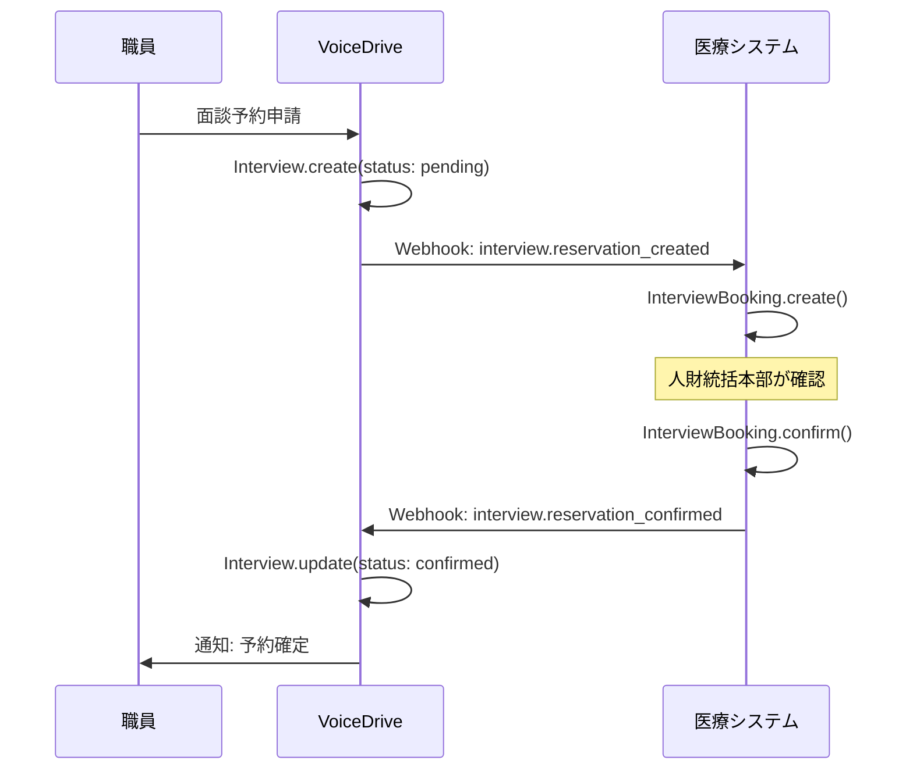
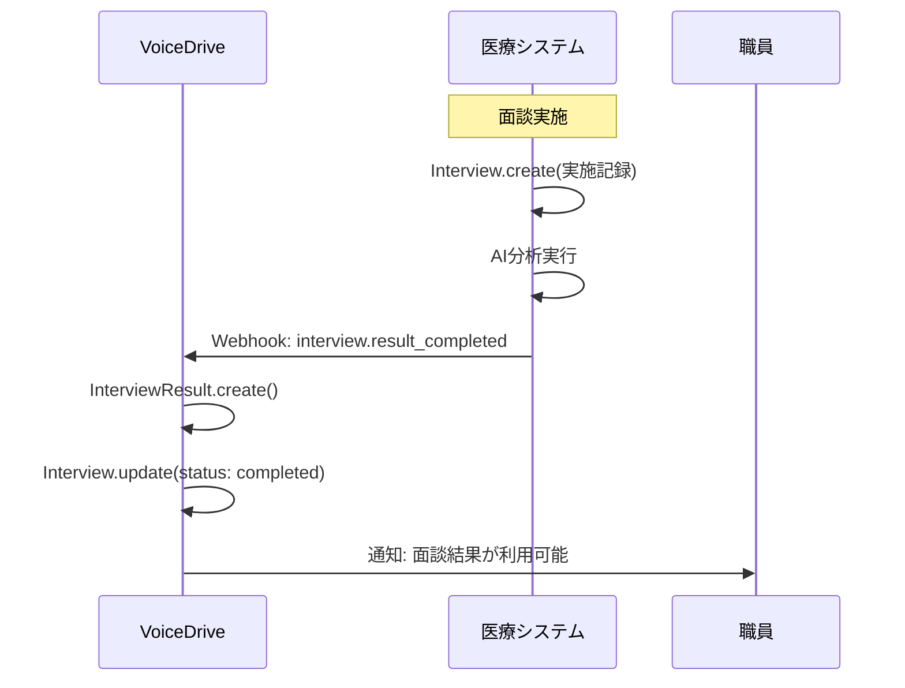

# InterviewBookingPage DB要件分析

**文書番号**: VD-DB-ANALYSIS-2025-1013-002
**作成日**: 2025年10月13日
**対象ページ**: InterviewBookingPage
**URL**: https://voicedrive-v100.vercel.app/InterviewBookingPage
**ステータス**: 🟡 DB構築前分析完了・実装待ち

---

## 📋 エグゼクティブサマリー

### ページ概要
InterviewBookingPageは、職員が人財統括本部との面談予約を申請・確認するページです。医療従事者向けの10種類の面談タイプ（新入職員月次、年次定期、管理職半年面談、復職面談等）に対応し、予約管理・キャンセル・変更リクエスト機能を提供します。

### 主要機能
1. ✅ **面談予約申請** - 日時選択、面談タイプ・カテゴリ選択、希望事項入力
2. ✅ **予約情報確認** - 予約中の面談一覧表示、過去の面談履歴表示
3. ✅ **予約キャンセル** - 面談2時間前までキャンセル可能
4. ✅ **予約変更リクエスト** - 面談1日前まで変更申請可能（承認制）
5. ✅ **月次利用状況表示** - 今月の予約回数・上限表示

### データ管理責任
- **VoiceDrive（マスタ）**: 面談予約・スケジューリング情報
- **医療システム（マスタ）**: 面談実施記録・詳細内容・AI分析結果
- **連携方式**: Webhook双方向連携

### 現状の課題
- ❌ `Interview`テーブルに予約管理フィールドが不足（20+フィールド）
- ❌ 面談者（Interviewer）情報をメモリ管理（DB化必要）
- ❌ 時間枠（TimeSlot）管理がメモリベース（DB化必要）
- ❌ キャンセル・変更履歴の永続化なし

---

## 🎯 ページ機能詳細分析

### 機能1: 面談予約申請

**画面フロー**:
```
1. ユーザーが「新しい面談を予約」ボタンをクリック
2. モーダルでInterviewBookingCalendarが表示
3. 面談タイプ選択（10種類）
4. カテゴリ選択（必要な場合）
5. 希望日時選択（最大3日）
6. トピック・説明入力
7. 予約申請送信
8. 人財統括本部が確認・確定
```

**必要なデータ**:
| データ項目 | 現在のInterviewテーブル | 不足 | 備考 |
|----------|---------------------|------|------|
| employeeId | ✅ あり | - | 予約者職員ID |
| employeeName | ❌ なし | ✅ | 予約者氏名（キャッシュ） |
| employeeEmail | ❌ なし | ✅ | 予約者メールアドレス |
| employeePhone | ❌ なし | ✅ | 予約者電話番号 |
| facility | ❌ なし | ✅ | 施設名 |
| department | ❌ なし | ✅ | 部署名（Userから取得も可） |
| position | ❌ なし | ✅ | 役職名 |
| bookingDate | ❌ なし | ✅ | 予約日（Date型） |
| timeSlotStartTime | ❌ なし | ✅ | 開始時刻（"13:40"） |
| timeSlotEndTime | ❌ なし | ✅ | 終了時刻（"14:10"） |
| interviewType | ✅ type | - | 面談タイプ |
| interviewCategory | ✅ category | - | 面談カテゴリ |
| requestedTopics | ❌ なし | ✅ | 希望トピック（JSON配列） |
| description | ❌ なし | ✅ | 詳細説明 |
| urgencyLevel | ✅ あり | - | 緊急度 |
| status | ✅ あり | ⚠️ | 値の拡張必要 |
| createdAt | ✅ あり | - | 申請日時 |
| createdBy | ❌ なし | ✅ | 申請者ID |

### 機能2: 予約確認・管理

**表示内容**:
- 予約中の面談（status: pending, confirmed）
- 過去の面談履歴（status: completed, cancelled）
- 各予約の詳細（日時、タイプ、担当者、ステータス）
- キャンセルボタン（条件付き表示）

**必要なデータ**:
| データ項目 | 現在のInterviewテーブル | 不足 | 備考 |
|----------|---------------------|------|------|
| interviewerId | ✅ あり | - | 面談者ID |
| interviewerName | ✅ あり | - | 面談者氏名 |
| interviewerLevel | ❌ なし | ✅ | 面談者権限レベル |
| lastModified | ❌ なし | ✅ | 最終変更日時 |
| modifiedBy | ❌ なし | ✅ | 最終変更者ID |
| adminNotes | ❌ なし | ✅ | 管理者メモ |
| employeeNotes | ❌ なし | ✅ | 職員メモ |

### 機能3: キャンセル機能

**ビジネスロジック**:
- 面談開始2時間前までキャンセル可能
- キャンセル理由を選択（emergency/illness/work_conflict等）
- 時間枠を自動解放
- 関係者に通知送信

**必要なデータ**:
| データ項目 | 現在のInterviewテーブル | 不足 | 備考 |
|----------|---------------------|------|------|
| cancellationReason | ❌ なし | ✅ | キャンセル理由 |
| cancelledAt | ❌ なし | ✅ | キャンセル日時 |
| cancelledBy | ❌ なし | ✅ | キャンセル実行者ID |

### 機能4: 変更リクエスト機能

**ビジネスロジック**:
- 面談1日前まで変更申請可能
- 複数の希望日時を提案
- 管理者が承認・拒否
- 承認後、新日時で予約確定

**必要なデータ**:
| データ項目 | テーブル | 不足 | 備考 |
|----------|---------|------|------|
| rescheduleRequests | Interview | ✅ | JSON配列として保存 |
| - id | - | ✅ | 変更リクエストID |
| - requestedBy | - | ✅ | 申請者ID |
| - requestedAt | - | ✅ | 申請日時 |
| - currentDateTime | - | ✅ | 現在の予約日時 |
| - preferredDates | - | ✅ | 希望日時（配列） |
| - reason | - | ✅ | 変更理由 |
| - status | - | ✅ | pending/approved/rejected |
| - reviewedBy | - | ✅ | 承認者ID |
| - reviewedAt | - | ✅ | 承認日時 |
| - rejectionReason | - | ✅ | 拒否理由 |
| - approvedDateTime | - | ✅ | 承認された日時 |

---

## 🗄️ 現在のテーブル構造

### Interview テーブル（schema.prisma L145-166）

```prisma
model Interview {
  id               String    @id @default(cuid())
  employeeId       String
  category         String
  type             String
  topic            String
  preferredDate    DateTime
  scheduledDate    DateTime?
  actualDate       DateTime?
  duration         Int?
  interviewerId    String?
  interviewerName  String?
  status           String    @default("pending")
  urgencyLevel     String
  result           String?
  notes            String?
  followUpRequired Boolean   @default(false)
  followUpDate     DateTime?
  createdAt        DateTime  @default(now())
  updatedAt        DateTime  @updatedAt
  employee         User      @relation(fields: [employeeId], references: [id])
}
```

**問題点**:
1. ❌ 予約管理に必要なフィールドが不足（20+フィールド）
2. ❌ 時間枠情報（startTime, endTime）がない
3. ❌ キャンセル・変更履歴の保存フィールドがない
4. ❌ 職員情報のキャッシュフィールド（name, email, phone等）がない
5. ❌ statusの値が不十分（confirmed, rescheduled, cancelled, no_show等が必要）

### InterviewResult テーブル（schema.prisma L301-320）

```prisma
model InterviewResult {
  id                  String    @id @default(cuid())
  requestId           String    @unique
  interviewId         String    @unique
  completedAt         DateTime
  duration            Int
  summary             String
  keyPoints           Json
  actionItems         Json
  followUpRequired    Boolean   @default(false)
  followUpDate        DateTime?
  feedbackToEmployee  String
  nextRecommendations Json
  receivedAt          DateTime  @default(now())
  processedAt         DateTime?
  status              String    @default("received")
  errorMessage        String?
  createdAt           DateTime  @default(now())
  updatedAt           DateTime  @updatedAt
}
```

**評価**: ✅ このテーブルは医療システムからの面談結果受信用として適切に設計されている

---

## 📊 データ管理責任分界点

### データ管理責任マトリクス

| データ項目 | VoiceDrive | 医療システム | 提供方法 | 備考 |
|-----------|-----------|-------------|---------|------|
| **面談予約情報** | ✅ マスタ | キャッシュ | Webhook | VoiceDrive.Interview |
| 予約ID | ✅ マスタ | - | - | VoiceDrive生成 |
| 職員ID | キャッシュ | ✅ マスタ | API | Userテーブルと同期 |
| 職員名・連絡先 | キャッシュ | ✅ マスタ | API | 表示用キャッシュ |
| 予約日時 | ✅ マスタ | - | Webhook | VoiceDriveが管理 |
| 時間枠情報 | ✅ マスタ | - | - | startTime/endTime |
| 面談タイプ | ✅ マスタ | - | - | 10種類の体系 |
| 面談カテゴリ | ✅ マスタ | - | - | 12種類 |
| ステータス | ✅ マスタ | - | Webhook | pending→confirmed |
| **面談実施記録** | キャッシュ | ✅ マスタ | Webhook | MedicalSystem.Interview |
| 実施日時 | キャッシュ | ✅ マスタ | Webhook | actualDate |
| 面談内容詳細 | ❌ | ✅ マスタ | ❌ | VoiceDriveは保存しない |
| AI分析結果 | キャッシュ | ✅ マスタ | Webhook | InterviewResult |
| NotebookLMリンク | ❌ | ✅ マスタ | API | 必要時取得 |
| **面談者情報** | ✅ マスタ | ❌ | - | VoiceDrive独自管理 |
| 面談者ID | ✅ マスタ | - | - | VoiceDrive生成 |
| 面談者氏名 | ✅ マスタ | - | - | 人財統括本部職員 |
| 面談者専門分野 | ✅ マスタ | - | - | specialties |
| 面談者スケジュール | ✅ マスタ | - | - | 時間枠管理 |
| **時間枠管理** | ✅ マスタ | ❌ | - | VoiceDrive独自管理 |
| 営業時間設定 | ✅ マスタ | - | - | 13:40-17:00 |
| 時間枠ブロック | ✅ マスタ | - | - | 管理者がブロック可能 |
| 予約制限ルール | ✅ マスタ | - | - | 月2回等 |

### Webhook連携フロー

#### フロー1: 予約申請→確定



#### フロー2: 面談実施→結果通知



---

## 🔧 必要なDB変更

### 変更1: Interview テーブル拡張

**追加フィールド**:

```prisma
model Interview {
  id               String    @id @default(cuid())

  // === 既存フィールド ===
  employeeId       String
  category         String
  type             String
  topic            String
  preferredDate    DateTime
  scheduledDate    DateTime?
  actualDate       DateTime?
  duration         Int?
  interviewerId    String?
  interviewerName  String?
  status           String    @default("pending")
  urgencyLevel     String
  result           String?
  notes            String?
  followUpRequired Boolean   @default(false)
  followUpDate     DateTime?
  createdAt        DateTime  @default(now())
  updatedAt        DateTime  @updatedAt

  // === 🆕 追加フィールド（InterviewBookingPage対応） ===

  // 予約者情報キャッシュ
  employeeName         String?   @map("employee_name")
  employeeEmail        String?   @map("employee_email")
  employeePhone        String?   @map("employee_phone")
  facility             String?
  position             String?

  // 予約日時情報
  bookingDate          DateTime? @map("booking_date")          // 予約日
  timeSlotStartTime    String?   @map("time_slot_start_time") // "13:40"
  timeSlotEndTime      String?   @map("time_slot_end_time")   // "14:10"

  // 面談内容詳細
  requestedTopics      String?   @map("requested_topics")      // JSON配列
  description          String?                                 // 詳細説明

  // 面談者情報
  interviewerLevel     Float?    @map("interviewer_level")     // 権限レベル

  // 履歴・メタデータ
  createdBy            String?   @map("created_by")
  lastModified         DateTime? @map("last_modified")
  modifiedBy           String?   @map("modified_by")

  // 管理者メモ
  adminNotes           String?   @map("admin_notes")
  employeeNotes        String?   @map("employee_notes")

  // キャンセル情報
  cancellationReason   String?   @map("cancellation_reason")
  cancelledAt          DateTime? @map("cancelled_at")
  cancelledBy          String?   @map("cancelled_by")

  // 変更リクエスト
  rescheduleRequests   String?   @map("reschedule_requests")   // JSON配列

  // 面談実施情報
  conductedAt          DateTime? @map("conducted_at")
  outcome              String?                                 // JSON

  // リレーション
  employee         User      @relation(fields: [employeeId], references: [id])

  // インデックス
  @@index([status])
  @@index([bookingDate])
  @@index([interviewerId])
  @@index([employeeId, status])
  @@map("interviews")
}
```

**追加フィールド数**: 20フィールド

**ステータス値の拡張**:
```typescript
type InterviewStatus =
  | 'pending'             // 予約申請中
  | 'confirmed'           // 予約確定
  | 'rescheduled'         // 変更済み
  | 'reschedule_pending'  // 変更申請中
  | 'completed'           // 面談完了
  | 'cancelled'           // キャンセル
  | 'no_show';            // 無断欠席
```

### 変更2: 新規テーブル Interviewer（面談者マスタ）

**目的**: 面談者情報をメモリ管理からDB管理へ移行

```prisma
model Interviewer {
  id                  String    @id @default(cuid())
  name                String
  title               String
  department          String
  permissionLevel     Float     @map("permission_level")

  // 専門分野
  specialties         String                               // JSON配列

  // 利用可能性
  isActive            Boolean   @default(true) @map("is_active")
  workingDays         String    @map("working_days")       // JSON配列 ['月','火','水','木','金']
  workingHoursStart   String    @map("working_hours_start") // "13:40"
  workingHoursEnd     String    @map("working_hours_end")   // "17:00"

  // 予約制限
  maxBookingsPerDay   Int       @default(4) @map("max_bookings_per_day")
  maxBookingsPerWeek  Int       @default(15) @map("max_bookings_per_week")

  // 連絡先
  email               String
  phone               String?

  // 統計
  totalInterviews     Int       @default(0) @map("total_interviews")
  averageRating       Float?    @map("average_rating")
  bio                 String?

  createdAt           DateTime  @default(now()) @map("created_at")
  updatedAt           DateTime  @updatedAt @map("updated_at")

  @@index([isActive])
  @@index([department])
  @@map("interviewers")
}
```

### 変更3: 新規テーブル TimeSlot（時間枠マスタ）

**目的**: 時間枠管理をメモリからDB管理へ移行

```prisma
model TimeSlot {
  id                String    @id @default(cuid())
  date              DateTime                              // 日付
  startTime         String    @map("start_time")          // "13:40"
  endTime           String    @map("end_time")            // "14:10"

  // 利用可能性
  isAvailable       Boolean   @default(true) @map("is_available")
  isBlocked         Boolean   @default(false) @map("is_blocked")

  // ブロック情報
  blockedBy         String?   @map("blocked_by")
  blockedReason     String?   @map("blocked_reason")

  // 予約情報
  bookedBy          String?   @map("booked_by")
  bookingId         String?   @map("booking_id")
  interviewerId     String?   @map("interviewer_id")

  createdAt         DateTime  @default(now()) @map("created_at")
  updatedAt         DateTime  @updatedAt @map("updated_at")

  @@unique([date, startTime, endTime])
  @@index([date])
  @@index([isAvailable])
  @@index([bookingId])
  @@map("time_slots")
}
```

### 変更4: 新規テーブル InterviewScheduleConfig（スケジュール設定）

**目的**: 営業時間・予約制限等の設定をDB管理

```prisma
model InterviewScheduleConfig {
  id                        String    @id @default(cuid())

  // 基本設定
  slotDuration              Int       @default(30) @map("slot_duration")       // 分
  breakDuration             Int       @default(10) @map("break_duration")      // 分

  // 営業時間
  workingHoursStart         String    @map("working_hours_start")  // "13:40"
  workingHoursEnd           String    @map("working_hours_end")    // "17:00"

  // 営業日設定
  workingDays               String    @map("working_days")         // JSON配列

  // 祝日・休業日
  holidays                  String?                                // JSON配列
  closedDates               String?   @map("closed_dates")         // JSON配列

  // 予約制限
  maxAdvanceBookingDays     Int       @default(30) @map("max_advance_booking_days")
  minAdvanceBookingHours    Int       @default(24) @map("min_advance_booking_hours")
  maxBookingsPerMonth       Int       @default(2) @map("max_bookings_per_month")
  minIntervalBetweenBookings Int      @default(30) @map("min_interval_between_bookings") // 日

  // 設定有効性
  isActive                  Boolean   @default(true) @map("is_active")
  effectiveFrom             DateTime? @map("effective_from")
  effectiveTo               DateTime? @map("effective_to")

  createdAt                 DateTime  @default(now()) @map("created_at")
  updatedAt                 DateTime  @updatedAt @map("updated_at")

  @@map("interview_schedule_configs")
}
```

---

## 🔗 必要なAPI

### API-5: 職員連絡先情報取得

**目的**: 面談予約時に職員の電話番号を取得

**エンドポイント**: `GET /api/employees/{employeeId}/contact`

**リクエスト**:
```http
GET /api/employees/OH-NS-2024-001/contact
Authorization: Bearer {jwt_token}
```

**レスポンス**:
```json
{
  "employeeId": "OH-NS-2024-001",
  "name": "山田 花子",
  "email": "hanako.yamada@obara-hospital.jp",
  "phone": "090-1234-5678",
  "facility": "小原病院",
  "department": "内科",
  "position": "看護師"
}
```

**データソース**: 医療システムEmployee

テーブル

**呼び出しタイミング**: 面談予約申請時

---

### API-6: 面談予約通知（VoiceDrive → 医療システム）

**目的**: VoiceDriveでの予約申請を医療システムに通知

**エンドポイント**: `POST /api/medical/interviews/notify-reservation`

**リクエスト**:
```http
POST /api/medical/interviews/notify-reservation
Content-Type: application/json
X-VoiceDrive-Signature: sha256=abc123...
```

```json
{
  "eventType": "interview.reservation_created",
  "timestamp": "2025-10-13T14:30:00Z",
  "data": {
    "bookingId": "booking_1728832200_abc123",
    "employeeId": "OH-NS-2024-001",
    "employeeName": "山田 花子",
    "facility": "小原病院",
    "department": "内科",
    "bookingDate": "2025-10-20",
    "timeSlot": {
      "startTime": "14:20",
      "endTime": "14:50"
    },
    "interviewType": "regular_annual",
    "interviewCategory": "career_path",
    "requestedTopics": ["キャリアプラン", "スキルアップ"],
    "description": "今後のキャリアについて相談したい",
    "urgencyLevel": "medium"
  }
}
```

**データソース**: VoiceDrive Interview

**呼び出しタイミング**: 職員が予約申請した直後

---

### API-7: 面談予約確定通知（医療システム → VoiceDrive）

**目的**: 医療システムでの予約確定をVoiceDriveに通知

**エンドポイント**: `POST /api/webhooks/interview-reservation-confirmed`

**リクエスト**:
```http
POST /api/webhooks/interview-reservation-confirmed
Content-Type: application/json
X-Medical-System-Signature: sha256=def456...
```

```json
{
  "eventType": "interview.reservation_confirmed",
  "timestamp": "2025-10-13T15:00:00Z",
  "data": {
    "bookingId": "booking_1728832200_abc123",
    "interviewId": "INT-2024-OH-001",
    "confirmedBy": "HR-STAFF-001",
    "confirmedAt": "2025-10-13T15:00:00Z",
    "interviewerId": "interviewer_001",
    "interviewerName": "田中 キャリア支援部門長",
    "location": "本院 3F 面談室2",
    "notes": "ご予約ありがとうございます。当日お待ちしております。"
  }
}
```

**データソース**: 医療システムInterview

**呼び出しタイミング**: 人財統括本部が予約を確定した直後

---

### API-8: 面談キャンセル通知（VoiceDrive → 医療システム）

**目的**: VoiceDriveでのキャンセルを医療システムに通知

**エンドポイント**: `POST /api/medical/interviews/notify-cancellation`

**リクエスト**:
```json
{
  "eventType": "interview.reservation_cancelled",
  "timestamp": "2025-10-13T16:00:00Z",
  "data": {
    "bookingId": "booking_1728832200_abc123",
    "interviewId": "INT-2024-OH-001",
    "cancelledBy": "OH-NS-2024-001",
    "cancelledAt": "2025-10-13T16:00:00Z",
    "cancellationReason": "illness",
    "customReason": "体調不良のため"
  }
}
```

**呼び出しタイミング**: 職員が予約をキャンセルした直後

---

### API-9: 面談変更リクエスト通知（VoiceDrive → 医療システム）

**目的**: VoiceDriveでの変更リクエストを医療システムに通知

**エンドポイント**: `POST /api/medical/interviews/notify-reschedule-request`

**リクエスト**:
```json
{
  "eventType": "interview.reschedule_requested",
  "timestamp": "2025-10-13T17:00:00Z",
  "data": {
    "bookingId": "booking_1728832200_abc123",
    "rescheduleRequestId": "reschedule_1728835600_xyz789",
    "requestedBy": "OH-NS-2024-001",
    "requestedAt": "2025-10-13T17:00:00Z",
    "currentDateTime": "2025-10-20T14:20:00Z",
    "preferredDates": [
      "2025-10-21T14:20:00Z",
      "2025-10-22T15:00:00Z",
      "2025-10-23T13:40:00Z"
    ],
    "reason": "業務の都合により日程変更をお願いしたい"
  }
}
```

**呼び出しタイミング**: 職員が変更リクエストを送信した直後

---

### API-10: 面談変更承認通知（医療システム → VoiceDrive）

**目的**: 医療システムでの変更承認をVoiceDriveに通知

**エンドポイント**: `POST /api/webhooks/interview-reschedule-approved`

**リクエスト**:
```json
{
  "eventType": "interview.reschedule_approved",
  "timestamp": "2025-10-13T18:00:00Z",
  "data": {
    "bookingId": "booking_1728832200_abc123",
    "rescheduleRequestId": "reschedule_1728835600_xyz789",
    "approvedBy": "HR-STAFF-001",
    "approvedAt": "2025-10-13T18:00:00Z",
    "newDateTime": "2025-10-21T14:20:00Z",
    "newTimeSlot": {
      "startTime": "14:20",
      "endTime": "14:50"
    }
  }
}
```

**呼び出しタイミング**: 人財統括本部が変更リクエストを承認した直後

---

## 📝 実装優先順位

### Phase 1: 基本予約機能（優先度: 🔴 最高）

**期間**: 2週間
**実装日**: 2025-11-14 ~ 2025-11-27

1. ✅ Interviewテーブル拡張（20フィールド追加）
2. ✅ Interviewerテーブル作成
3. ✅ TimeSlotテーブル作成
4. ✅ InterviewScheduleConfigテーブル作成
5. ✅ API-5実装（職員連絡先取得）
6. ✅ API-6実装（予約通知 VD→MS）
7. ✅ API-7実装（予約確定通知 MS→VD）
8. ✅ 予約申請・確認機能の実装

**依存関係**:
- 医療システム: API-5, API-7の実装が必要
- VoiceDrive: schema.prisma更新、マイグレーション実行

---

### Phase 2: キャンセル・変更機能（優先度: 🟡 高）

**期間**: 1週間
**実装日**: 2025-11-28 ~ 2025-12-04

1. ✅ キャンセル機能実装
2. ✅ 変更リクエスト機能実装
3. ✅ API-8実装（キャンセル通知）
4. ✅ API-9実装（変更リクエスト通知）
5. ✅ API-10実装（変更承認通知）
6. ✅ 通知システム統合

**依存関係**:
- Phase 1完了後に実施
- 医療システム: API-8, API-9, API-10の実装が必要

---

### Phase 3: 管理機能・統計（優先度: 🟢 中）

**期間**: 1週間
**実装日**: 2025-12-05 ~ 2025-12-11

1. ✅ 面談者管理画面（LEVEL 5-7用）
2. ✅ 時間枠ブロック機能
3. ✅ 予約統計ダッシュボード
4. ✅ 月次レポート機能

**依存関係**:
- Phase 2完了後に実施

---

## 🧪 テストケース

### TC-1: 面談予約申請

**前提条件**:
- 一般職員としてログイン
- 今月の予約回数が上限未満

**テストステップ**:
1. InterviewBookingPageを開く
2. 「新しい面談を予約」ボタンをクリック
3. 面談タイプを選択（例: 年次定期面談）
4. カテゴリを選択（例: キャリアパス）
5. 希望日時を選択
6. トピック・説明を入力
7. 予約申請ボタンをクリック

**期待結果**:
- ✅ Interviewレコードが作成される（status: pending）
- ✅ TimeSlotが予約済みになる（isAvailable: false）
- ✅ API-6が呼ばれ、医療システムに通知される
- ✅ 成功メッセージが表示される

---

### TC-2: 予約確定（医療システム側）

**前提条件**:
- 予約申請が存在する（status: pending）

**テストステップ**:
1. 医療システムで予約を確認
2. 面談者を割り当て
3. 予約を確定
4. API-7を送信（VoiceDriveへ）

**期待結果**:
- ✅ Interviewのstatusが`confirmed`に更新される
- ✅ interviewerId, interviewerNameが設定される
- ✅ 職員に確定通知が送信される

---

### TC-3: 予約キャンセル

**前提条件**:
- 予約が確定している（status: confirmed）
- 面談開始2時間以上前

**テストステップ**:
1. 予約詳細でキャンセルボタンをクリック
2. キャンセル理由を選択
3. 確認ダイアログでOKをクリック

**期待結果**:
- ✅ Interviewのstatusが`cancelled`に更新される
- ✅ cancellationReason, cancelledAt, cancelledByが記録される
- ✅ TimeSlotが解放される（isAvailable: true）
- ✅ API-8が呼ばれ、医療システムに通知される
- ✅ 関係者に通知が送信される

---

### TC-4: 予約変更リクエスト

**前提条件**:
- 予約が確定している（status: confirmed）
- 面談1日以上前

**テストステップ**:
1. 予約詳細で変更リクエストボタンをクリック
2. 複数の希望日時を選択
3. 変更理由を入力
4. 送信ボタンをクリック

**期待結果**:
- ✅ Interviewのstatusが`reschedule_pending`に更新される
- ✅ rescheduleRequestsに変更リクエストが追加される
- ✅ API-9が呼ばれ、医療システムに通知される
- ✅ 人財統括本部に承認依頼通知が送信される

---

### TC-5: 予約制限チェック

**前提条件**:
- 一般職員としてログイン
- 今月既に2回予約済み

**テストステップ**:
1. InterviewBookingPageを開く
2. 「新しい面談を予約」ボタンをクリック
3. 面談タイプを選択
4. 予約申請を試行

**期待結果**:
- ✅ エラーメッセージが表示される
- ✅ 「月の予約上限（2回）に達しています」
- ✅ 予約が作成されない

---

## 📋 チェックリスト

### データベース変更

- [ ] Interviewテーブル拡張（20フィールド追加）
- [ ] Interviewerテーブル作成
- [ ] TimeSlotテーブル作成
- [ ] InterviewScheduleConfigテーブル作成
- [ ] マイグレーションファイル作成
- [ ] 本番環境マイグレーション計画

### API実装（VoiceDrive側）

- [ ] API-5: 職員連絡先取得（医療システムに依頼）
- [ ] API-6: 予約通知送信実装
- [ ] API-7: 予約確定Webhook受信実装
- [ ] API-8: キャンセル通知送信実装
- [ ] API-9: 変更リクエスト通知送信実装
- [ ] API-10: 変更承認Webhook受信実装

### フロントエンド実装

- [ ] 予約申請フォーム改修（DB連携）
- [ ] 予約一覧表示改修（DB連携）
- [ ] キャンセル機能実装
- [ ] 変更リクエスト機能実装
- [ ] エラーハンドリング実装
- [ ] ローディング状態表示

### テスト

- [ ] 単体テスト（API, サービス層）
- [ ] 統合テスト（予約フロー）
- [ ] Webhook送受信テスト
- [ ] 予約制限ロジックテスト
- [ ] キャンセル・変更フローテスト

### ドキュメント

- [ ] API仕様書作成（OpenAPI 3.0）
- [ ] Webhook仕様書作成
- [ ] データベーススキーマドキュメント更新
- [ ] 運用マニュアル作成

---

## 🚀 次のステップ

1. ✅ **本ドキュメント確認** - 医療システムチームと要件確認
2. ⏳ **暫定マスターリスト作成** - 必要なマスターデータを特定
3. ⏳ **API仕様合意** - API-5~10の詳細仕様を確定
4. ⏳ **実装スケジュール調整** - 2025年11月14日開始予定
5. ⏳ **schema.prisma更新** - Phase 1のテーブル変更を実装

---

## ⚠️ 既知の問題と修正事項

### 問題1: PermissionLevel表記の不統一

**現状**:
- 一部のデモデータ生成で数値直接指定（7, 6等）が使用されていた
- 新18レベルシステムではPermissionLevel.LEVEL_X形式を使用すべき

**修正箇所**:
- ✅ `src/services/InterviewBookingService.ts` L1723 - 修正完了（2025-10-13）

**修正内容**:
```typescript
// Before
interviewerLevel: 7,

// After
interviewerLevel: PermissionLevel.LEVEL_7
```

**影響範囲**: デモ環境のみ（本番DBでは正しい値を使用）

**ステータス**: ✅ 修正完了

---

## 📞 連絡先

**VoiceDriveチーム**
- Slack: #voicedrive-integration
- 担当: システム開発チーム

**医療システムチーム**
- Slack: #medical-system-integration
- 担当: システム開発チーム

---

**文書終了**

最終更新: 2025年10月13日（PermissionLevel修正追記）
バージョン: 1.1
承認: 未承認（レビュー待ち）
