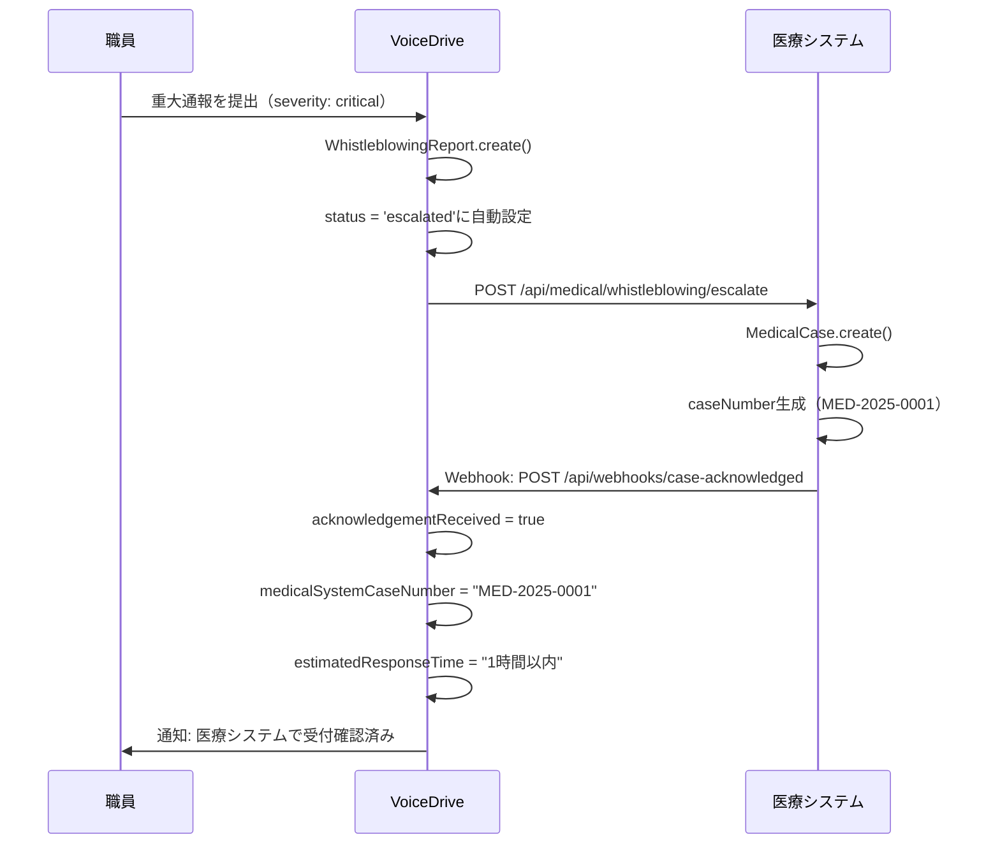
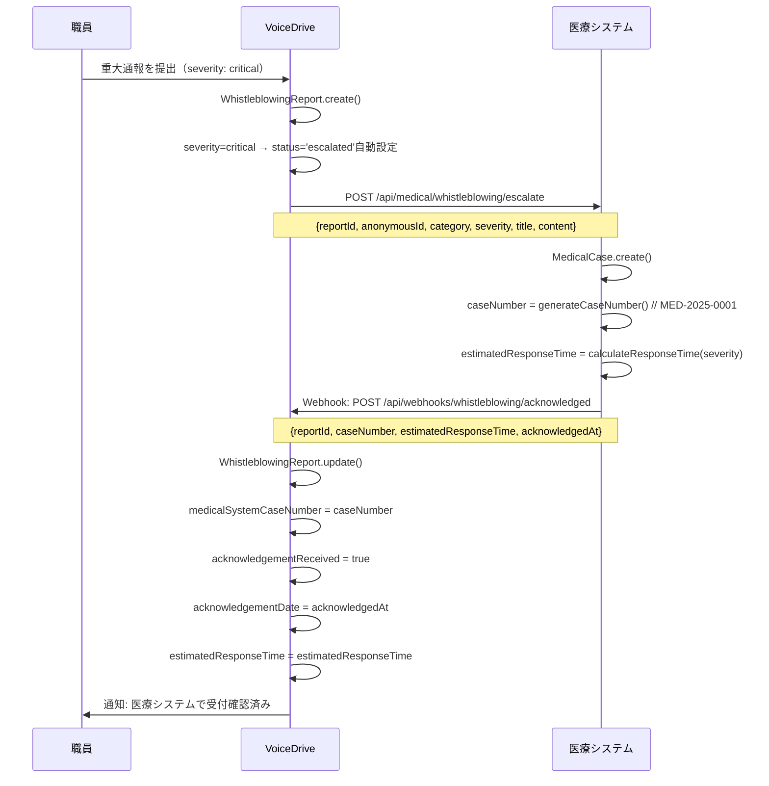
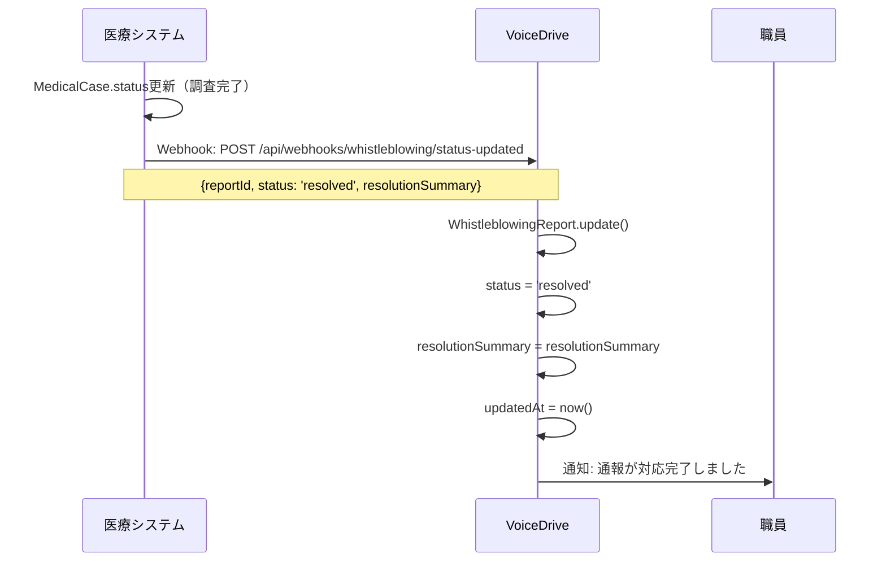

# MyReportDetailPage DB要件分析

**文書番号**: VD-DB-2025-1026-004
**作成日**: 2025年10月26日
**作成者**: VoiceDriveチーム
**対象ページ**: MyReportDetailPage（内部通報詳細ページ）
**URL**: `https://voicedrive-v100.vercel.app/my-reports/:id`
**重要度**: 🔴 最重要（内部通報・ホイッスルブロイング）

---

## 📋 エグゼクティブサマリー

### ページ概要
MyReportDetailPageは、職員が提出した内部通報（ホイッスルブロイング）の詳細を表示するページです。
匿名通報機能を含み、ハラスメント、安全管理、コンプライアンス違反等の通報を安全に処理します。

### データ管理責任の結論
- ✅ **内部通報機能はVoiceDrive固有の機能**
- ✅ **基本的にVoiceDriveが100%管轄**（通報受付、トリアージ、調査ノート）
- 🟡 **重大案件のみ医療システムへ連携**（escalated, criticalステータス時）
- 🟡 **医療システムは受付確認通知とケース番号管理のみ**

### 主な機能
1. 通報基本情報表示（タイトル、カテゴリ、重要度、ステータス）
2. 通報内容・証拠ファイル表示
3. 匿名ID表示（通報者保護）
4. 担当調査員情報
5. 対応履歴（タイムライン）
6. 医療システム受付確認情報（連携時のみ）
7. フォローアップ必要フラグ
8. 対応結果サマリー（resolved時）

### DB状況
- ✅ `WhistleblowingReport`テーブル: 実装済み
- ✅ `InvestigationNote`テーブル: 実装済み
- ✅ 医療システム連携フィールド: 実装済み
- 🟢 **追加実装不要**（現状のスキーマで十分）

---

## 🎯 ページ機能詳細分析

### 1. 通報基本情報カード

#### 表示項目
| 項目 | データ型 | データソース | 管理責任 | 備考 |
|-----|---------|------------|---------|------|
| タイトル | String | WhistleblowingReport.title | 🟢 VoiceDrive | 通報者入力 |
| カテゴリ | String | WhistleblowingReport.category | 🟢 VoiceDrive | 6種類（harassment, safety, financial, compliance, discrimination, other） |
| 重要度 | String | WhistleblowingReport.severity | 🟢 VoiceDrive | 4段階（low, medium, high, critical） |
| ステータス | String | WhistleblowingReport.status | 🟢 VoiceDrive | 6段階（received, triaging, investigating, escalated, resolved, closed） |
| 匿名通報フラグ | Boolean | WhistleblowingReport.isAnonymous | 🟢 VoiceDrive | デフォルトtrue |
| 受付確認済みフラグ | Boolean | WhistleblowingReport.acknowledgementReceived | 🟢 VoiceDrive | 医療システム連携時true |

#### ステータス定義
```typescript
type ReportStatus =
  | 'received'      // 受付完了
  | 'triaging'      // 分類中
  | 'investigating' // 調査中
  | 'escalated'     // エスカレーション（医療システムへ連携）
  | 'resolved'      // 対応完了
  | 'closed';       // 案件終了
```

#### カテゴリ定義
```typescript
type ReportCategory =
  | 'harassment'     // ハラスメント
  | 'safety'         // 安全管理
  | 'financial'      // 財務・会計
  | 'compliance'     // コンプライアンス
  | 'discrimination' // 差別・不公正
  | 'other';         // その他
```

---

### 2. メタ情報グリッド

#### 表示項目
| 項目 | フィールド | データソース | 表示例 | 管理責任 |
|-----|----------|------------|--------|---------|
| 通報ID | WhistleblowingReport.id | VoiceDrive | RPT-2025-001 | 🟢 VoiceDrive |
| 匿名ID | WhistleblowingReport.anonymousId | VoiceDrive | ANON-8F3A2B | 🟢 VoiceDrive |
| 医療システムID | WhistleblowingReport.medicalSystemCaseNumber | 医療システム | MED-2025-0001 | 🔵 医療システム |
| 優先度 | WhistleblowingReport.priority | VoiceDrive | 8/10 | 🟢 VoiceDrive |
| 通報日時 | WhistleblowingReport.submittedAt | VoiceDrive | 2025-10-01 10:30 | 🟢 VoiceDrive |
| 最終更新 | WhistleblowingReport.updatedAt | VoiceDrive | 2025-10-02 14:20 | 🟢 VoiceDrive |
| 重要度 | WhistleblowingReport.severity | VoiceDrive | 緊急 / 高 / 中 / 低 | 🟢 VoiceDrive |

**重要**: `medicalSystemCaseNumber`は、ステータスが`escalated`になった時に医療システムから付与されます。

---

### 3. 受付確認情報カード（医療システム連携時のみ）

#### 表示条件
```typescript
if (report.acknowledgementReceived && report.estimatedResponseTime) {
  // 受付確認カードを表示
}
```

#### 表示項目
| 項目 | フィールド | データソース | 例 | 管理責任 |
|-----|----------|------------|---|---------|
| 対応予定時間 | WhistleblowingReport.estimatedResponseTime | 医療システム | "当日中", "1時間以内" | 🔵 医療システム |
| 受付日時 | WhistleblowingReport.acknowledgementDate | 医療システム | 2025-10-01 11:00 | 🔵 医療システム |
| 受付確認フラグ | WhistleblowingReport.acknowledgementReceived | VoiceDrive | true/false | 🟢 VoiceDrive（Webhookで更新） |

**連携フロー**:


---

### 4. 通報内容セクション

#### 表示項目
| 項目 | フィールド | データソース | 管理責任 |
|-----|----------|------------|---------|
| 通報内容 | WhistleblowingReport.content | VoiceDrive | 🟢 VoiceDrive |
| 証拠ファイル | WhistleblowingReport.evidenceFiles | VoiceDrive | 🟢 VoiceDrive |

**証拠ファイル形式**:
```typescript
evidenceFiles?: string[]; // ファイルURL配列（JSON）
// 例: ["https://storage/evidence1.jpg", "https://storage/evidence2.pdf"]
```

**セキュリティ要件**:
- 証拠ファイルは暗号化ストレージに保存
- アクセス制御: 通報者本人、担当調査員、Level 99管理者のみ
- ダウンロードログ記録

---

### 5. 担当調査員セクション

#### 表示項目
| 項目 | フィールド | データソース | 管理責任 |
|-----|----------|------------|---------|
| 調査員役割 | WhistleblowingReport.assignedInvestigators | VoiceDrive | 🟢 VoiceDrive |

**調査員役割定義**:
```typescript
type InvestigatorRole =
  | 'hr_specialist'    // 人事担当
  | 'legal_counsel'    // 法務担当
  | 'safety_officer'   // 安全管理責任者
  | 'external_expert'  // 外部専門家
  | 'management';      // 管理職
```

**データ形式**:
```json
assignedInvestigators: ["hr_specialist", "management"]
```

**アサインロジック**:
- カテゴリ別の自動アサイン
- `harassment` → `hr_specialist`, `legal_counsel`
- `safety` → `safety_officer`, `management`
- `financial` → `legal_counsel`, `management`
- `compliance` → `legal_counsel`, `external_expert`
- `critical`（重要度） → 自動的に`management`追加

---

### 6. 対応結果セクション（resolved時のみ）

#### 表示条件
```typescript
if (report.resolutionSummary && report.status === 'resolved') {
  // 対応結果カードを表示
}
```

#### 表示項目
| 項目 | フィールド | データソース | 管理責任 |
|-----|----------|------------|---------|
| 対応結果 | WhistleblowingReport.resolutionSummary | VoiceDrive | 🟢 VoiceDrive |

**入力者**: 担当調査員（Level 99管理者）

---

### 7. フォローアップ必要セクション

#### 表示条件
```typescript
if (report.followUpRequired && report.status !== 'closed') {
  // フォローアップ必要カードを表示
}
```

#### 表示項目
| 項目 | フィールド | データソース | 管理責任 |
|-----|----------|------------|---------|
| フォローアップフラグ | WhistleblowingReport.followUpRequired | VoiceDrive | 🟢 VoiceDrive |

**フォローアップフロー**:
- 調査員が追加情報が必要と判断した場合にフラグをON
- 通報者に通知（匿名通報の場合はサイト内通知のみ）
- フォローアップ完了後、フラグをOFF

---

### 8. 対応履歴（タイムライン）

#### 表示内容
- 通報受付時のタイムスタンプ
- ステータス変更履歴
- 調査ノート追加履歴（機密情報は表示しない）

**データソース**:
- `WhistleblowingReport.submittedAt`, `updatedAt`
- `InvestigationNote`（createdAt順）

**タイムライン表示例**:
```
2025-10-02 14:20 - ステータス更新: 調査中
2025-10-01 11:00 - 医療システムで受付確認
2025-10-01 10:30 - 通報を受付
```

---

## 📊 データ責任マトリクス

### WhistleblowingReport（通報本体）

| フィールド | データ型 | VoiceDrive | 医療システム | 同期方法 | 備考 |
|----------|---------|-----------|-------------|---------|------|
| `id` | String | ✅ マスタ | ❌ | - | VoiceDrive発行 |
| `userId` | String? | ✅ マスタ | ❌ | - | 匿名通報時null |
| `anonymousId` | String | ✅ マスタ | ❌ | - | ANON-XXXXXX形式 |
| `category` | String | ✅ マスタ | ❌ | - | 6種類 |
| `severity` | String | ✅ マスタ | ❌ | - | 4段階 |
| `title` | String | ✅ マスタ | ❌ | - | 通報者入力 |
| `content` | String | ✅ マスタ | ❌ | - | 通報内容 |
| `evidenceFiles` | Json? | ✅ マスタ | ❌ | - | URL配列 |
| `submittedAt` | DateTime | ✅ マスタ | ❌ | - | 通報日時 |
| `updatedAt` | DateTime | ✅ マスタ | ❌ | - | 最終更新 |
| `status` | String | ✅ マスタ | キャッシュ | API | VoiceDriveが管理 |
| `assignedInvestigators` | Json? | ✅ マスタ | ❌ | - | VoiceDriveが管理 |
| `escalationReason` | String? | ✅ マスタ | ❌ | - | エスカレーション理由 |
| `resolutionSummary` | String? | ✅ マスタ | ❌ | - | 対応結果 |
| `followUpRequired` | Boolean | ✅ マスタ | ❌ | - | フォローアップフラグ |
| `isAnonymous` | Boolean | ✅ マスタ | ❌ | - | 匿名フラグ |
| `priority` | Int | ✅ マスタ | ❌ | - | 1-10優先度 |
| **`medicalSystemCaseNumber`** | String? | キャッシュ | **✅ マスタ** | **Webhook** | **医療システム発行** |
| **`acknowledgementReceived`** | Boolean | ✅ マスタ | ❌ | **Webhook** | **VoiceDriveが管理** |
| **`acknowledgementDate`** | DateTime? | キャッシュ | **✅ マスタ** | **Webhook** | **医療システムから通知** |
| **`estimatedResponseTime`** | String? | キャッシュ | **✅ マスタ** | **Webhook** | **医療システムから通知** |
| `contactMethod` | String? | ✅ マスタ | ❌ | - | email, phone, none |
| `contactInfo` | String? | ✅ マスタ | ❌ | - | 暗号化保存 |
| `expectedOutcome` | String? | ✅ マスタ | ❌ | - | 期待する結果 |
| `createdAt` | DateTime | ✅ マスタ | ❌ | - | 作成日時 |

**データ管理責任**:
- **VoiceDriveが100%管轄**: 通報受付、トリアージ、調査、解決
- **医療システムへの連携**: `severity=critical`または`status=escalated`時のみ
- **医療システムの役割**: ケース番号発行、受付確認通知、対応予定時間通知のみ

---

### InvestigationNote（調査ノート）

| フィールド | データ型 | VoiceDrive | 医療システム | 同期方法 | 備考 |
|----------|---------|-----------|-------------|---------|------|
| `id` | String | ✅ マスタ | ❌ | - | VoiceDrive発行 |
| `reportId` | String | ✅ マスタ | ❌ | - | WhistleblowingReport.id |
| `authorRole` | String | ✅ マスタ | ❌ | - | InvestigatorRole |
| `authorName` | String | ✅ マスタ | ❌ | - | 調査員名 |
| `content` | String | ✅ マスタ | ❌ | - | 調査内容 |
| `isConfidential` | Boolean | ✅ マスタ | ❌ | - | デフォルトtrue |
| `actionItems` | Json? | ✅ マスタ | ❌ | - | アクションアイテム配列 |
| `createdAt` | DateTime | ✅ マスタ | ❌ | - | 作成日時 |
| `updatedAt` | DateTime | ✅ マスタ | ❌ | - | 更新日時 |

**データ管理責任**:
- **VoiceDriveが100%管轄**: 調査ノートは機密情報のためVoiceDrive内のみで管理
- **医療システムへの連携**: なし（医療システムには調査ノートを共有しない）

---

## 🔄 医療システム連携フロー

### フロー1: 重大通報のエスカレーション



**エスカレーション条件**:
- `severity === 'critical'`（緊急）
- `category === 'compliance'` AND `severity === 'high'`（高リスクコンプライアンス）
- 手動エスカレーション（調査員が判断）

---

### フロー2: 通報ステータス更新（医療システム→VoiceDrive）



---

## 🚨 不足項目の洗い出し

### 1. 既存フィールドの確認

**WhistleblowingReportテーブル**:
- ✅ すべての必要フィールドが実装済み
- ✅ 医療システム連携フィールド（`medicalSystemCaseNumber`等）も実装済み

**InvestigationNoteテーブル**:
- ✅ すべての必要フィールドが実装済み

**結論**: **追加フィールド不要**

---

### 2. 必要なAPI（VoiceDrive側）

#### API-1: 通報詳細取得
```http
GET /api/whistleblowing/reports/:id
Authorization: Bearer {jwt_token}
```

**実装状況**: ⏳ **実装必要**（現在はデモデータ）

---

#### API-2: 通報エスカレーション（医療システムへ）
```http
POST /api/whistleblowing/reports/:id/escalate
Authorization: Bearer {jwt_token}
Content-Type: application/json

{
  "reason": "重大なコンプライアンス違反のため医療システムへエスカレーション"
}
```

**実装状況**: ⏳ **実装必要**

---

### 3. 必要なWebhook（医療システム→VoiceDrive）

#### Webhook-1: 受付確認通知
```http
POST /api/webhooks/whistleblowing/acknowledged
Content-Type: application/json
X-Medical-System-Signature: sha256=abc123...

{
  "eventType": "whistleblowing.acknowledged",
  "timestamp": "2025-10-26T10:00:00Z",
  "data": {
    "reportId": "RPT-2025-001",
    "caseNumber": "MED-2025-0001",
    "estimatedResponseTime": "1時間以内",
    "acknowledgedAt": "2025-10-26T10:00:00Z"
  }
}
```

**実装状況**: ⏳ **実装必要**

---

#### Webhook-2: ステータス更新通知
```http
POST /api/webhooks/whistleblowing/status-updated
Content-Type: application/json
X-Medical-System-Signature: sha256=abc123...

{
  "eventType": "whistleblowing.status_updated",
  "timestamp": "2025-10-27T15:00:00Z",
  "data": {
    "reportId": "RPT-2025-001",
    "status": "resolved",
    "resolutionSummary": "安全対策を強化しました。ご報告ありがとうございました。"
  }
}
```

**実装状況**: ⏳ **実装必要**

---

### 4. 必要なAPI（医療システム側）

#### API-1: 通報エスカレーション受付
```http
POST /api/medical/whistleblowing/escalate
Authorization: Bearer {jwt_token}
Content-Type: application/json

{
  "reportId": "RPT-2025-001",
  "anonymousId": "ANON-8F3A2B",
  "category": "compliance",
  "severity": "critical",
  "title": "重大なコンプライアンス違反の疑い",
  "content": "医療記録の不適切な取り扱いを目撃しました...",
  "submittedAt": "2025-10-26T10:00:00Z"
}
```

**レスポンス**:
```json
{
  "success": true,
  "caseNumber": "MED-2025-0001",
  "estimatedResponseTime": "1時間以内",
  "acknowledgedAt": "2025-10-26T10:00:00Z"
}
```

**実装状況**: ⏳ **医療システムチームへ実装依頼**

---

## 📋 実装チェックリスト

### VoiceDrive側

#### DB関連
- [x] WhistleblowingReportテーブル実装済み
- [x] InvestigationNoteテーブル実装済み
- [x] 医療システム連携フィールド実装済み

#### API実装
- [ ] GET /api/whistleblowing/reports/:id（通報詳細取得）
- [ ] POST /api/whistleblowing/reports/:id/escalate（エスカレーション）
- [ ] POST /api/webhooks/whistleblowing/acknowledged（受付確認Webhook）
- [ ] POST /api/webhooks/whistleblowing/status-updated（ステータス更新Webhook）

#### UI統合
- [ ] MyReportDetailPageをAPI接続（現在デモデータ）
- [ ] エスカレーションボタン実装（Level 99管理者のみ）
- [ ] 医療システム受付確認カード表示ロジック

---

### 医療システム側

#### API実装
- [ ] POST /api/medical/whistleblowing/escalate（通報エスカレーション受付）
- [ ] MedicalCaseテーブル作成（または既存テーブル利用）
- [ ] ケース番号生成ロジック
- [ ] 対応予定時間計算ロジック

#### Webhook実装
- [ ] Webhook送信機能（受付確認）
- [ ] Webhook送信機能（ステータス更新）
- [ ] HMAC-SHA256署名機能

---

## 🎯 成功指標（KPI）

| 指標 | 目標値 | 測定方法 |
|------|--------|---------|
| 通報受付後の表示速度 | < 1秒 | フロントエンド測定 |
| エスカレーション成功率 | > 99% | API成功率ログ |
| 医療システム受付確認通知遅延 | < 5秒 | Webhookタイムスタンプ比較 |
| データ整合性 | 100% | 日次検証バッチ |
| 通報者プライバシー保護 | 100% | セキュリティ監査 |

---

## 📞 次のアクション

### VoiceDriveチーム
1. API実装（通報詳細取得、エスカレーション）
2. Webhook受信エンドポイント実装
3. MyReportDetailPageのAPI統合

### 医療システムチーム
1. POST /api/medical/whistleblowing/escalate実装
2. MedicalCaseテーブル設計・実装
3. Webhook送信機能実装

### 両チーム
1. 統合テスト計画策定
2. セキュリティレビュー
3. プライバシー保護監査

---

**文書終了**

最終更新: 2025年10月26日
バージョン: 1.0
次回レビュー: 実装完了後
