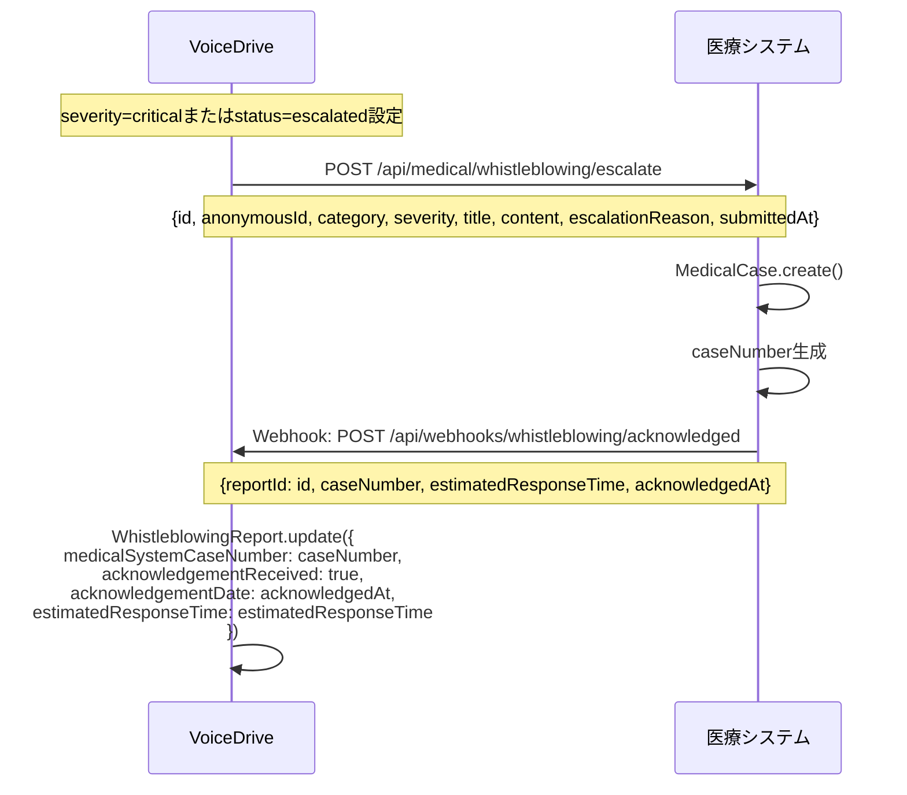
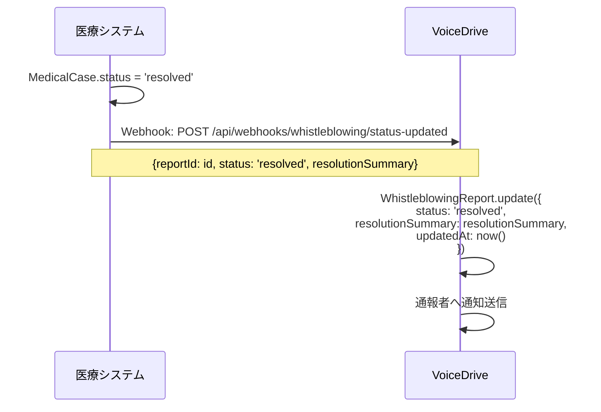

# MyReportDetailPage 暫定マスターリスト

**文書番号**: VD-MASTER-2025-1026-004
**作成日**: 2025年10月26日
**作成者**: VoiceDriveチーム
**対象ページ**: MyReportDetailPage（内部通報詳細ページ）
**参照**: MyReportDetailPage_DB要件分析_20251026.md
**重要度**: 🔴 最重要（内部通報・ホイッスルブロイング）

---

## 📋 エグゼクティブサマリー

本文書は、MyReportDetailPageで使用される全データ項目（24項目）を詳細に定義します。

### データ項目サマリー
- **合計**: 24項目
- **VoiceDrive管轄**: 20項目（83%）
- **医療システム管轄**: 4項目（17%）- 重大案件連携時のみ
- **データフロー**: VoiceDrive内完結、重大案件時のみ医療システムへエスカレーション

### データ管理方針
- ✅ **内部通報機能はVoiceDrive固有機能**
- ✅ **基本的にVoiceDrive側で完結**（通報受付～調査～解決）
- 🟡 **重大案件のみ医療システムへ連携**（`severity=critical`または`status=escalated`時）
- 🟡 **医療システムは受付確認とケース番号管理のみ**

---

## 📊 データ項目一覧

### カテゴリ1: 通報基本情報（8項目）

#### 1. 通報ID
| 項目 | 内容 |
|------|------|
| **フィールド名** | `WhistleblowingReport.id` |
| **データ型** | String |
| **必須** | ✅ Yes |
| **マスタシステム** | 🟢 VoiceDrive |
| **表示場所** | メタ情報グリッド |
| **編集可能** | ❌ No（システム発行） |
| **初期値** | cuid()自動生成 |
| **例** | `"RPT-2025-001"` |
| **データフロー** | VoiceDrive内部のみ |
| **備考** | VoiceDrive発行の通報ID |

---

#### 2. ユーザーID
| 項目 | 内容 |
|------|------|
| **フィールド名** | `WhistleblowingReport.userId` |
| **データ型** | String? |
| **必須** | ⚠️ Conditional（匿名通報時null） |
| **マスタシステム** | 🟢 VoiceDrive |
| **表示場所** | （通報者本人にのみ表示、管理者には非表示） |
| **編集可能** | ❌ No |
| **初期値** | 通報者のUser.id（匿名時null） |
| **例** | `"cuid-user-001"` または `null` |
| **データフロー** | VoiceDrive内部のみ（機密情報） |
| **備考** | 匿名通報保護のためnull許可 |

---

#### 3. 匿名ID
| 項目 | 内容 |
|------|------|
| **フィールド名** | `WhistleblowingReport.anonymousId` |
| **データ型** | String |
| **必須** | ✅ Yes |
| **マスタシステム** | 🟢 VoiceDrive |
| **表示場所** | メタ情報グリッド |
| **編集可能** | ❌ No（システム発行） |
| **初期値** | `ANON-${ランダム6桁英数字}` |
| **例** | `"ANON-8F3A2B"` |
| **データフロー** | VoiceDrive内部、医療システムへ連携時も使用 |
| **備考** | 通報者との連絡用ID、真の匿名性を保証 |

---

#### 4. カテゴリ
| 項目 | 内容 |
|------|------|
| **フィールド名** | `WhistleblowingReport.category` |
| **データ型** | String（enum） |
| **必須** | ✅ Yes |
| **マスタシステム** | 🟢 VoiceDrive |
| **表示場所** | 基本情報カード |
| **編集可能** | ✅ Yes（調査員のみ、トリアージ時） |
| **初期値** | 通報者選択 |
| **選択肢** | `harassment`, `safety`, `financial`, `compliance`, `discrimination`, `other` |
| **例** | `"compliance"` |
| **日本語ラベル** | ハラスメント、安全管理、財務・会計、コンプライアンス、差別・不公正、その他 |
| **データフロー** | VoiceDrive内部、医療システムへエスカレーション時も送信 |
| **備考** | カテゴリ別に調査員を自動アサイン |

---

#### 5. 重要度
| 項目 | 内容 |
|------|------|
| **フィールド名** | `WhistleblowingReport.severity` |
| **データ型** | String（enum） |
| **必須** | ✅ Yes |
| **マスタシステム** | 🟢 VoiceDrive |
| **表示場所** | 基本情報カード、メタ情報グリッド |
| **編集可能** | ✅ Yes（調査員のみ） |
| **初期値** | `"medium"` |
| **選択肢** | `low`, `medium`, `high`, `critical` |
| **例** | `"critical"` |
| **日本語ラベル** | 低、中、高、緊急 |
| **アイコン** | 🟢（低）、🟡（中）、🟠（高）、🔴（緊急） |
| **データフロー** | VoiceDrive内部、`critical`時は医療システムへエスカレーション |
| **備考** | `critical`設定時、自動的に`status=escalated`に変更 |

---

#### 6. タイトル
| 項目 | 内容 |
|------|------|
| **フィールド名** | `WhistleblowingReport.title` |
| **データ型** | String |
| **必須** | ✅ Yes |
| **マスタシステム** | 🟢 VoiceDrive |
| **表示場所** | 基本情報カード（ヘッダー） |
| **編集可能** | ❌ No（通報者入力のみ） |
| **初期値** | 通報者入力 |
| **最大文字数** | 200文字 |
| **例** | `"重大なコンプライアンス違反の疑い"` |
| **データフロー** | VoiceDrive内部、医療システムへエスカレーション時も送信 |
| **備考** | 通報内容の概要 |

---

#### 7. 通報内容
| 項目 | 内容 |
|------|------|
| **フィールド名** | `WhistleblowingReport.content` |
| **データ型** | String（Text） |
| **必須** | ✅ Yes |
| **マスタシステム** | 🟢 VoiceDrive |
| **表示場所** | 通報内容セクション |
| **編集可能** | ❌ No（通報者入力のみ） |
| **初期値** | 通報者入力 |
| **最大文字数** | 5000文字 |
| **例** | `"医療記録の不適切な取り扱いを目撃しました。個人情報が含まれる書類が施錠されていない場所に放置されていたり..."` |
| **表示形式** | `whitespace-pre-wrap`（改行保持） |
| **データフロー** | VoiceDrive内部、医療システムへエスカレーション時も送信（要約版） |
| **備考** | 詳細な通報内容 |

---

#### 8. 証拠ファイル
| 項目 | 内容 |
|------|------|
| **フィールド名** | `WhistleblowingReport.evidenceFiles` |
| **データ型** | Json?（String配列） |
| **必須** | ❌ No |
| **マスタシステム** | 🟢 VoiceDrive |
| **表示場所** | 通報内容セクション |
| **編集可能** | ❌ No（通報者アップロードのみ） |
| **初期値** | `null` |
| **データ形式** | `["https://storage/evidence1.jpg", "https://storage/evidence2.pdf"]` |
| **ストレージ** | AWS S3（暗号化） |
| **アクセス制御** | 通報者本人、担当調査員、Level 99管理者のみ |
| **ダウンロードログ** | ✅ 記録必須 |
| **データフロー** | VoiceDrive内部のみ（医療システムには送信しない） |
| **備考** | 画像、PDF、テキストファイル対応 |

---

### カテゴリ2: ステータス・進捗（5項目）

#### 9. ステータス
| 項目 | 内容 |
|------|------|
| **フィールド名** | `WhistleblowingReport.status` |
| **データ型** | String（enum） |
| **必須** | ✅ Yes |
| **マスタシステム** | 🟢 VoiceDrive |
| **表示場所** | 基本情報カード、タイムライン |
| **編集可能** | ✅ Yes（調査員のみ） |
| **初期値** | `"received"` |
| **選択肢** | `received`, `triaging`, `investigating`, `escalated`, `resolved`, `closed` |
| **例** | `"investigating"` |
| **日本語ラベル** | 受付完了、分類中、調査中、エスカレーション、対応完了、案件終了 |
| **ステータス遷移** | received → triaging → investigating → resolved → closed |
| **特殊遷移** | investigating → escalated（医療システムへ連携） |
| **データフロー** | VoiceDrive内部、医療システムへキャッシュ送信 |
| **備考** | `escalated`設定時、医療システムAPIを自動呼び出し |

---

#### 10. 通報日時
| 項目 | 内容 |
|------|------|
| **フィールド名** | `WhistleblowingReport.submittedAt` |
| **データ型** | DateTime |
| **必須** | ✅ Yes |
| **マスタシステム** | 🟢 VoiceDrive |
| **表示場所** | メタ情報グリッド、タイムライン |
| **編集可能** | ❌ No |
| **初期値** | `@default(now())` |
| **フォーマット** | `2025-10-01T10:30:00Z`（ISO 8601） |
| **表示例** | `"2025年10月1日 10:30"` |
| **データフロー** | VoiceDrive内部、医療システムへエスカレーション時も送信 |
| **備考** | 通報を受け付けた日時 |

---

#### 11. 最終更新日時
| 項目 | 内容 |
|------|------|
| **フィールド名** | `WhistleblowingReport.updatedAt` |
| **データ型** | DateTime |
| **必須** | ✅ Yes |
| **マスタシステム** | 🟢 VoiceDrive |
| **表示場所** | メタ情報グリッド、タイムライン |
| **編集可能** | ❌ No（自動更新） |
| **初期値** | `@updatedAt` |
| **フォーマット** | `2025-10-02T14:20:00Z`（ISO 8601） |
| **表示例** | `"2025年10月2日 14:20"` |
| **データフロー** | VoiceDrive内部のみ |
| **備考** | ステータス変更、調査ノート追加時に自動更新 |

---

#### 12. 優先度
| 項目 | 内容 |
|------|------|
| **フィールド名** | `WhistleblowingReport.priority` |
| **データ型** | Int |
| **必須** | ✅ Yes |
| **マスタシステム** | 🟢 VoiceDrive |
| **表示場所** | メタ情報グリッド |
| **編集可能** | ✅ Yes（調査員のみ） |
| **初期値** | `5` |
| **範囲** | 1～10 |
| **例** | `8` |
| **表示形式** | `"8/10"` |
| **自動計算** | `severity`と`category`から算出 |
| **計算式** | critical=10, high=7-9, medium=4-6, low=1-3 |
| **データフロー** | VoiceDrive内部のみ |
| **備考** | 優先度が高い順に調査 |

---

#### 13. フォローアップ必要フラグ
| 項目 | 内容 |
|------|------|
| **フィールド名** | `WhistleblowingReport.followUpRequired` |
| **データ型** | Boolean |
| **必須** | ✅ Yes |
| **マスタシステム** | 🟢 VoiceDrive |
| **表示場所** | フォローアップ必要セクション |
| **編集可能** | ✅ Yes（調査員のみ） |
| **初期値** | `false` |
| **例** | `true` |
| **表示条件** | `followUpRequired=true` AND `status≠closed` |
| **データフロー** | VoiceDrive内部のみ |
| **備考** | 追加情報が必要な場合にON |

---

### カテゴリ3: 調査・対応（3項目）

#### 14. 担当調査員
| 項目 | 内容 |
|------|------|
| **フィールド名** | `WhistleblowingReport.assignedInvestigators` |
| **データ型** | Json?（String配列） |
| **必須** | ❌ No |
| **マスタシステム** | 🟢 VoiceDrive |
| **表示場所** | 担当調査員セクション |
| **編集可能** | ✅ Yes（Level 99管理者のみ） |
| **初期値** | カテゴリ別に自動アサイン |
| **データ形式** | `["hr_specialist", "management"]` |
| **選択肢** | `hr_specialist`, `legal_counsel`, `safety_officer`, `external_expert`, `management` |
| **日本語ラベル** | 人事担当、法務担当、安全管理責任者、外部専門家、管理職 |
| **自動アサインロジック** | `harassment`→`hr_specialist`+`legal_counsel` |
| **データフロー** | VoiceDrive内部のみ |
| **備考** | 複数の調査員を割り当て可能 |

---

#### 15. エスカレーション理由
| 項目 | 内容 |
|------|------|
| **フィールド名** | `WhistleblowingReport.escalationReason` |
| **データ型** | String? |
| **必須** | ⚠️ Conditional（`status=escalated`時のみ） |
| **マスタシステム** | 🟢 VoiceDrive |
| **表示場所** | （調査員のみ閲覧可能） |
| **編集可能** | ✅ Yes（調査員のみ） |
| **初期値** | `null` |
| **最大文字数** | 500文字 |
| **例** | `"重大なコンプライアンス違反のため医療システムへエスカレーション"` |
| **データフロー** | VoiceDrive内部、医療システムへエスカレーション時も送信 |
| **備考** | エスカレーション時の理由を記録 |

---

#### 16. 対応結果サマリー
| 項目 | 内容 |
|------|------|
| **フィールド名** | `WhistleblowingReport.resolutionSummary` |
| **データ型** | String? |
| **必須** | ⚠️ Conditional（`status=resolved`時のみ） |
| **マスタシステム** | 🟢 VoiceDrive |
| **表示場所** | 対応結果セクション |
| **編集可能** | ✅ Yes（調査員のみ） |
| **初期値** | `null` |
| **最大文字数** | 1000文字 |
| **例** | `"安全対策を強化しました。夜勤職員の増員と防犯カメラの増設を実施いたしました。ご報告ありがとうございました。"` |
| **表示条件** | `resolutionSummary≠null` AND `status=resolved` |
| **データフロー** | VoiceDrive内部、医療システムからWebhook経由で受信する場合もあり |
| **備考** | 通報者へのフィードバック |

---

### カテゴリ4: 医療システム連携（4項目）

#### 17. 医療システムケース番号
| 項目 | 内容 |
|------|------|
| **フィールド名** | `WhistleblowingReport.medicalSystemCaseNumber` |
| **データ型** | String? |
| **必須** | ⚠️ Conditional（`status=escalated`時のみ） |
| **マスタシステム** | 🔵 **医療システム** |
| **VoiceDrive管理** | キャッシュのみ |
| **表示場所** | メタ情報グリッド |
| **編集可能** | ❌ No（医療システムから付与） |
| **初期値** | `null` |
| **データ形式** | `"MED-YYYY-NNNN"` |
| **例** | `"MED-2025-0001"` |
| **データフロー** | 医療システム→VoiceDrive（Webhook） |
| **Webhook**: `POST /api/webhooks/whistleblowing/acknowledged` |
| **備考** | エスカレーション時に医療システムが発行 |

---

#### 18. 受付確認フラグ
| 項目 | 内容 |
|------|------|
| **フィールド名** | `WhistleblowingReport.acknowledgementReceived` |
| **データ型** | Boolean |
| **必須** | ✅ Yes |
| **マスタシステム** | 🟢 VoiceDrive（Webhookで更新） |
| **表示場所** | 基本情報カード（バッジ）、受付確認カード |
| **編集可能** | ❌ No（Webhookで自動更新） |
| **初期値** | `false` |
| **例** | `true` |
| **表示条件** | `acknowledgementReceived=true` |
| **データフロー** | VoiceDrive内部、医療システムからWebhook経由で`true`に変更 |
| **Webhook**: `POST /api/webhooks/whistleblowing/acknowledged` |
| **備考** | 医療システムで受付確認済みフラグ |

---

#### 19. 受付確認日時
| 項目 | 内容 |
|------|------|
| **フィールド名** | `WhistleblowingReport.acknowledgementDate` |
| **データ型** | DateTime? |
| **必須** | ⚠️ Conditional（`acknowledgementReceived=true`時のみ） |
| **マスタシステム** | 🔵 **医療システム** |
| **VoiceDrive管理** | キャッシュのみ |
| **表示場所** | 受付確認カード |
| **編集可能** | ❌ No（医療システムから付与） |
| **初期値** | `null` |
| **フォーマット** | `2025-10-01T11:00:00Z`（ISO 8601） |
| **表示例** | `"受付日時: 2025年10月1日 11:00"` |
| **データフロー** | 医療システム→VoiceDrive（Webhook） |
| **Webhook**: `POST /api/webhooks/whistleblowing/acknowledged` |
| **備考** | 医療システムが通報を受付確認した日時 |

---

#### 20. 対応予定時間
| 項目 | 内容 |
|------|------|
| **フィールド名** | `WhistleblowingReport.estimatedResponseTime` |
| **データ型** | String? |
| **必須** | ⚠️ Conditional（`acknowledgementReceived=true`時のみ） |
| **マスタシステム** | 🔵 **医療システム** |
| **VoiceDrive管理** | キャッシュのみ |
| **表示場所** | 受付確認カード |
| **編集可能** | ❌ No（医療システムから付与） |
| **初期値** | `null` |
| **データ形式** | フリーテキスト |
| **例** | `"1時間以内"`, `"当日中"`, `"3営業日以内"` |
| **表示例** | `"対応予定: 1時間以内"` |
| **データフロー** | 医療システム→VoiceDrive（Webhook） |
| **Webhook**: `POST /api/webhooks/whistleblowing/acknowledged` |
| **自動計算ロジック（医療システム側）** | `critical`=1時間以内、`high`=当日中、`medium`=3営業日以内 |
| **備考** | 通報者への安心感提供 |

---

### カテゴリ5: その他（4項目）

#### 21. 匿名通報フラグ
| 項目 | 内容 |
|------|------|
| **フィールド名** | `WhistleblowingReport.isAnonymous` |
| **データ型** | Boolean |
| **必須** | ✅ Yes |
| **マスタシステム** | 🟢 VoiceDrive |
| **表示場所** | 基本情報カード（バッジ） |
| **編集可能** | ❌ No（通報者選択のみ） |
| **初期値** | `true` |
| **例** | `true` |
| **表示条件** | `isAnonymous=true` |
| **バッジ表示** | 「匿名通報」（紫色バッジ） |
| **データフロー** | VoiceDrive内部のみ |
| **備考** | 匿名通報の場合、`userId=null` |

---

#### 22. 連絡方法
| 項目 | 内容 |
|------|------|
| **フィールド名** | `WhistleblowingReport.contactMethod` |
| **データ型** | String? |
| **必須** | ❌ No |
| **マスタシステム** | 🟢 VoiceDrive |
| **表示場所** | （通報者本人のみ閲覧可能） |
| **編集可能** | ❌ No（通報者選択のみ） |
| **初期値** | `null` |
| **選択肢** | `email`, `phone`, `none` |
| **例** | `"email"` |
| **日本語ラベル** | メール、電話、連絡不要 |
| **データフロー** | VoiceDrive内部のみ（機密情報） |
| **備考** | フォローアップ時の連絡手段 |

---

#### 23. 連絡先情報
| 項目 | 内容 |
|------|------|
| **フィールド名** | `WhistleblowingReport.contactInfo` |
| **データ型** | String? |
| **必須** | ⚠️ Conditional（`contactMethod≠none`時のみ） |
| **マスタシステム** | 🟢 VoiceDrive |
| **表示場所** | （通報者本人、担当調査員のみ閲覧可能） |
| **編集可能** | ❌ No（通報者入力のみ） |
| **初期値** | `null` |
| **セキュリティ** | **暗号化保存必須** |
| **例** | `"encrypted:abc123..."` |
| **データフロー** | VoiceDrive内部のみ（最高機密情報） |
| **備考** | メールアドレスまたは電話番号を暗号化保存 |

---

#### 24. 期待する結果
| 項目 | 内容 |
|------|------|
| **フィールド名** | `WhistleblowingReport.expectedOutcome` |
| **データ型** | String? |
| **必須** | ❌ No |
| **マスタシステム** | 🟢 VoiceDrive |
| **表示場所** | （調査員のみ閲覧可能） |
| **編集可能** | ❌ No（通報者入力のみ） |
| **初期値** | `null` |
| **最大文字数** | 500文字 |
| **例** | `"ハラスメントの停止と再発防止策の実施を希望します"` |
| **データフロー** | VoiceDrive内部のみ |
| **備考** | 通報者が期待する対応内容 |

---

## 📋 Prisma Schema定義（現状）

### WhistleblowingReportモデル

```prisma
model WhistleblowingReport {
  id                      String   @id @default(cuid())
  userId                  String?  // 匿名通報の場合null
  anonymousId             String   // ANON-XXXXXX形式
  category                String   // harassment, safety, financial, compliance, discrimination, other
  severity                String   @default("medium") // low, medium, high, critical
  title                   String
  content                 String
  evidenceFiles           Json?    // 証拠ファイルURL配列
  submittedAt             DateTime @default(now())
  updatedAt               DateTime @updatedAt
  status                  String   @default("received") // received, triaging, investigating, escalated, resolved, closed
  assignedInvestigators   Json?    // 調査員役割の配列
  escalationReason        String?
  resolutionSummary       String?
  followUpRequired        Boolean  @default(false)
  isAnonymous             Boolean  @default(true)
  priority                Int      @default(5) // 1-10

  // 医療システム連携
  medicalSystemCaseNumber String?
  acknowledgementReceived Boolean  @default(false)
  acknowledgementDate     DateTime?
  estimatedResponseTime   String?

  // 連絡先情報
  contactMethod           String?  // email, phone, none
  contactInfo             String?  // 暗号化保存推奨
  expectedOutcome         String?

  createdAt               DateTime @default(now())

  // リレーション
  user                    User?              @relation("WhistleblowingReports", fields: [userId], references: [id])
  investigationNotes      InvestigationNote[] @relation("ReportInvestigationNotes")

  @@index([userId])
  @@index([anonymousId])
  @@index([category])
  @@index([status])
  @@index([severity])
  @@index([medicalSystemCaseNumber])
  @@index([submittedAt])
  @@index([createdAt])
  @@map("whistleblowing_reports")
}
```

**現状評価**: ✅ **すべての必要フィールドが実装済み**

---

## 🔄 医療システム連携データフロー

### エスカレーション時のデータフロー



---

### ステータス更新時のデータフロー



---

## 🚨 実装チェックリスト

### Prisma Schema
- [x] WhistleblowingReportモデル実装済み
- [x] InvestigationNoteモデル実装済み
- [x] 医療システム連携フィールド実装済み
- [ ] ⚠️ contactInfo暗号化機能実装（セキュリティ要件）

### API実装
- [ ] GET /api/whistleblowing/reports/:id（通報詳細取得）
- [ ] POST /api/whistleblowing/reports/:id/escalate（エスカレーション）
- [ ] POST /api/webhooks/whistleblowing/acknowledged（受付確認Webhook）
- [ ] POST /api/webhooks/whistleblowing/status-updated（ステータス更新Webhook）

### 医療システム側API
- [ ] POST /api/medical/whistleblowing/escalate（エスカレーション受付）
- [ ] Webhook送信機能（受付確認、ステータス更新）

### セキュリティ実装
- [ ] contactInfo暗号化（AES-256-GCM推奨）
- [ ] 証拠ファイルの暗号化ストレージ
- [ ] アクセス制御ロジック（通報者本人、担当調査員、Level 99のみ）
- [ ] ダウンロードログ記録

---

## 📊 データ統計

| カテゴリ | 項目数 | VoiceDrive管轄 | 医療システム管轄 | 備考 |
|---------|--------|---------------|----------------|------|
| 通報基本情報 | 8 | 8 | 0 | VoiceDrive完結 |
| ステータス・進捗 | 5 | 5 | 0 | VoiceDrive完結 |
| 調査・対応 | 3 | 3 | 0 | VoiceDrive完結 |
| 医療システム連携 | 4 | 0 | 4 | Webhook経由 |
| その他 | 4 | 4 | 0 | VoiceDrive完結 |
| **合計** | **24** | **20（83%）** | **4（17%）** | - |

---

## 🎯 成功指標

| 指標 | 目標値 | 測定方法 |
|------|--------|---------|
| フィールド実装完全性 | 100% | Prisma schema確認 |
| 医療システム連携成功率 | >99% | Webhook成功率ログ |
| 通報者プライバシー保護 | 100% | セキュリティ監査 |
| データ暗号化適用率 | 100% | contactInfo, evidenceFiles確認 |

---

**文書終了**

最終更新: 2025年10月26日
バージョン: 1.0
次回レビュー: セキュリティ実装完了後
