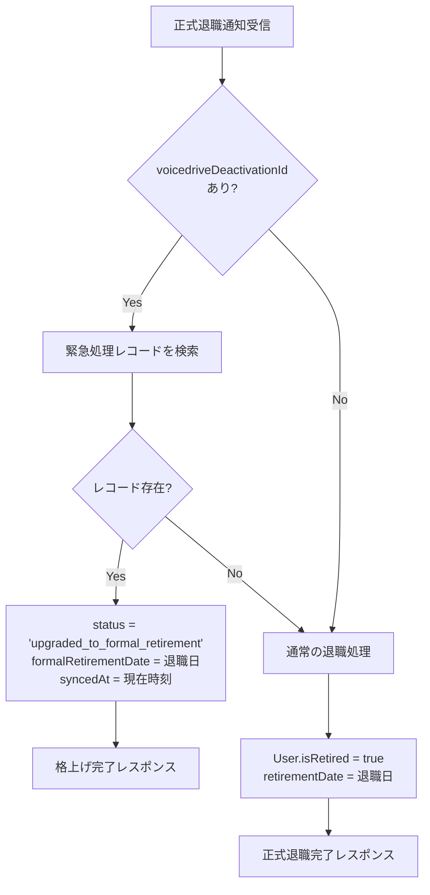
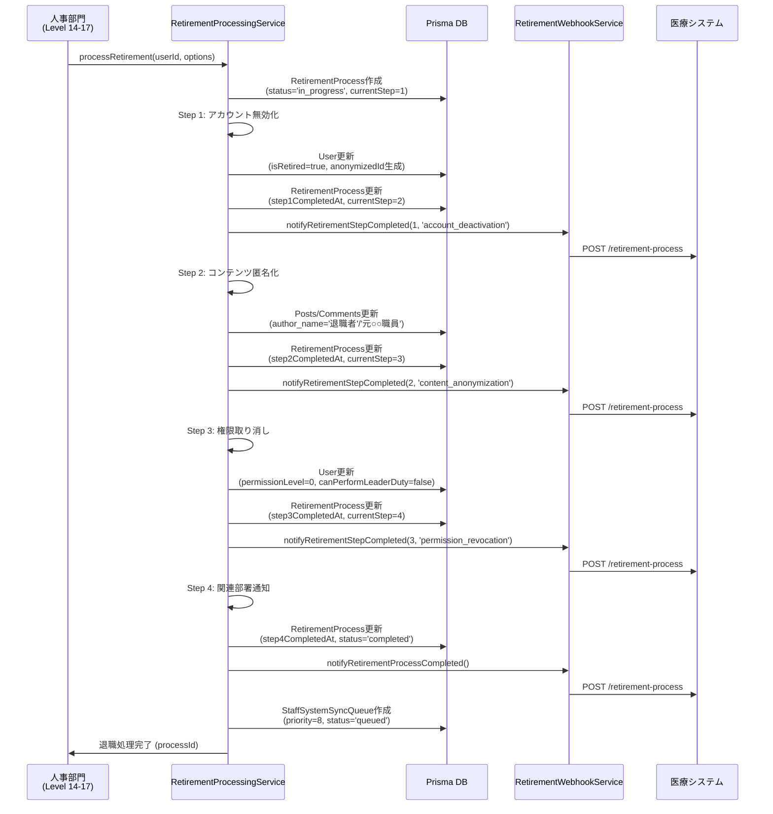
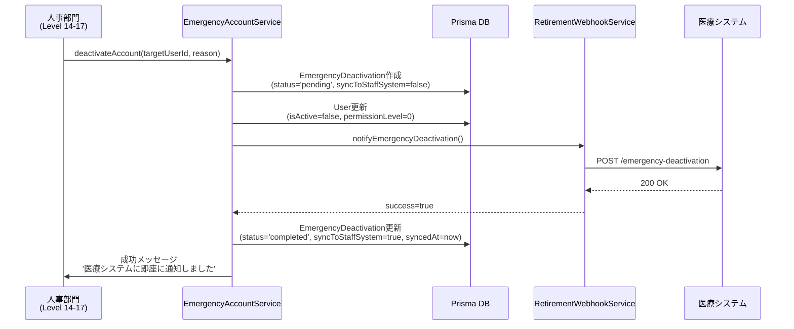
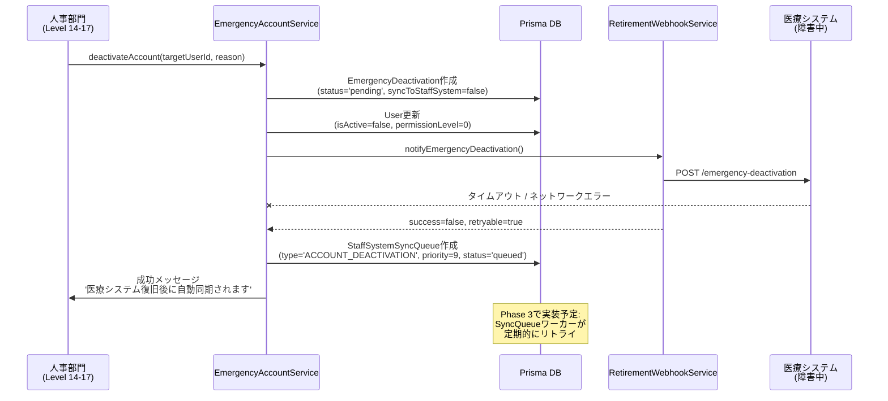
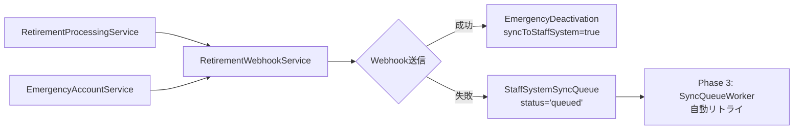

# Phase 2: Webhook連携実装完了報告

## 📅 実装日
2025年10月18日

## ✅ 実装完了項目

### 1. HMAC-SHA256署名機能拡張 ✅

**ファイル**: `src/services/webhookVerifier.ts`

- **追加機能**:
  - `generateWebhookSignature()` - Webhook送信用の署名生成
  - `generateWebhookHeaders()` - 署名付きHTTPヘッダー生成
- **既存機能**（維持）:
  - `verifyWebhookSignature()` - 受信Webhookの署名検証
  - `verifyTimestamp()` - タイムスタンプ検証（リプレイ攻撃対策）

**使用例**:
```typescript
import { generateWebhookHeaders } from './webhookVerifier';

const payload = { event: 'retirement.completed', data: {...} };
const headers = generateWebhookHeaders(payload, SECRET_KEY);

// 生成されるヘッダー:
// - Content-Type: application/json
// - X-VoiceDrive-Signature: <HMAC-SHA256署名>
// - X-VoiceDrive-Timestamp: <ISO 8601タイムスタンプ>
// - X-VoiceDrive-Source: voicedrive-system
```

---

### 2. 退職処理Webhook送信サービス ✅

**ファイル**: `src/services/RetirementWebhookService.ts` (新規作成)

**主要機能**:

#### イベント送信メソッド

| メソッド | 用途 | エンドポイント |
|---------|------|---------------|
| `notifyEmergencyDeactivation()` | 緊急アカウント停止通知 | `/emergency-deactivation` |
| `notifyRetirementProcessStarted()` | 退職処理開始通知 | `/retirement-process` |
| `notifyRetirementStepCompleted()` | 退職ステップ完了通知 | `/retirement-process` |
| `notifyRetirementProcessCompleted()` | 退職処理完了通知 | `/retirement-process` |
| `healthCheck()` | ヘルスチェック | `/health` |

#### 自動リトライ機能

- **最大試行回数**: 3回
- **待機時間**: 指数バックオフ（1秒 → 2秒 → 4秒）
- **リトライ可否判定**:
  - ✅ リトライ可能: 500番台エラー、429 (Rate Limit)、タイムアウト、ネットワークエラー
  - ❌ リトライ不可: 400番台エラー（400, 401, 403, 404等）

**使用例**:
```typescript
import { retirementWebhookService } from './RetirementWebhookService';

const result = await retirementWebhookService.notifyEmergencyDeactivation({
  deactivationId: 'deact_123',
  targetEmployeeId: 'EMP-001',
  executorName: '人事部長',
  reason: 'システム障害時の緊急対応',
  timestamp: new Date().toISOString(),
  isEmergency: true
});

if (result.success) {
  console.log('Webhook送信成功');
} else if (result.retryable) {
  console.log('リトライ可能なエラー - 同期キューに登録');
} else {
  console.log('リトライ不可 - 即座にエラー処理');
}
```

---

### 3. Webhook受信エンドポイント ✅

**ファイル**: `src/api/routes/webhook.routes.ts` (既存ファイルに追加)

#### 追加エンドポイント

##### 3.1 正式退職通知受信

**エンドポイント**: `POST /api/webhook/staff-system/retirement`

**機能**: 医療システムからの正式退職通知を受信し、緊急処理の「格上げ」を実行

**リクエスト例**:
```json
{
  "event": "retirement.formal_retirement",
  "data": {
    "employeeId": "EMP-001",
    "retirementDate": "2025-10-31",
    "voicedriveDeactivationId": "deact_123"  // 緊急処理IDがあれば格上げ
  }
}
```

**処理ロジック**:



##### 3.2 ステータス変更通知受信

**エンドポイント**: `POST /api/webhook/staff-system/status-change`

**機能**: 医療システムからのアカウントステータス変更通知を受信

**リクエスト例**:
```json
{
  "event": "account.status_changed",
  "data": {
    "employeeId": "EMP-001",
    "previousStatus": "active",
    "newStatus": "on_leave",
    "changedAt": "2025-10-18T10:00:00Z"
  }
}
```

**セキュリティ**:
- HMAC-SHA256署名検証必須
- ヘッダー: `X-VoiceDrive-Signature`, `X-VoiceDrive-Timestamp`
- 署名不一致 → 401 Unauthorized
- タイムスタンプ許容範囲: ±5分

---

### 4. RetirementProcessingService Prisma統合版 ✅

**ファイル**: `src/services/RetirementProcessingService.v2.ts` (新規作成)

**主な変更点**:

| 項目 | 旧版 (v1) | 新版 (v2 - Prisma統合) |
|------|----------|----------------------|
| データ保存 | メモリ (Map) | Prisma (PostgreSQL/SQLite) |
| 退職処理記録 | なし | RetirementProcess モデル |
| 進捗管理 | なし | 4ステップ完了時刻を記録 |
| Webhook通知 | なし | 各ステップ完了時に送信 |
| 医療システム連携 | なし | StaffSystemSyncQueue に登録 |
| 権限要件 | レベル6 | レベル14-17 (人事部門) |

**4ステップ退職フロー**:



**新規追加メソッド**:
- `getRetirementProcessStatus(processId)` - 進捗状況取得
- `getRetirementHistory(userId)` - 退職処理履歴取得

---

### 5. EmergencyAccountService Prisma統合版 ✅

**ファイル**: `src/services/EmergencyAccountService.v2.ts` (新規作成)

**主な変更点**:

| 項目 | 旧版 (v1) | 新版 (v2 - Prisma統合) |
|------|----------|----------------------|
| データ保存 | LocalStorage | Prisma (EmergencyDeactivation) |
| 監査ログ | LocalStorage | Prisma / コンソールログ |
| 同期キュー | LocalStorage | StaffSystemSyncQueue モデル |
| Webhook送信 | なし | 即座に試行 + リトライ |
| 同期ステータス | boolean | 'pending' / 'completed' / 'upgraded_to_formal_retirement' |

**緊急停止フロー（医療システム正常時）**:



**緊急停止フロー（医療システム障害時）**:



**新規追加メソッド**:
- `getAllDeactivations(limit)` - すべての緊急停止記録を取得
- `getPendingSyncDeactivations()` - 同期待ちの記録を取得

---

## 📂 作成・更新ファイル一覧

| ファイル | 種別 | 説明 |
|---------|------|------|
| `src/services/webhookVerifier.ts` | 更新 | 署名生成機能を追加 |
| `src/services/RetirementWebhookService.ts` | 新規 | 退職処理Webhook送信サービス |
| `src/api/routes/webhook.routes.ts` | 更新 | 2つのWebhook受信エンドポイント追加 |
| `src/services/RetirementProcessingService.v2.ts` | 新規 | Prisma統合版退職処理サービス |
| `src/services/EmergencyAccountService.v2.ts` | 新規 | Prisma統合版緊急停止サービス |

---

## 🔧 環境変数設定

Phase 2実装を動作させるために必要な環境変数:

```bash
# .env または .env.local に追加

# 医療システムWebhook URL
MEDICAL_SYSTEM_WEBHOOK_URL=http://localhost:3000/api/webhooks/voicedrive

# 医療システムWebhook署名検証用シークレット
MEDICAL_SYSTEM_WEBHOOK_SECRET=your-secret-key-here
```

**本番環境用（医療チームから共有）**:
- ステージング環境: 10/24までに共有予定
- 本番環境: 11/3までに共有予定

---

## 🚀 次のステップ: Phase 3実装予定

### Phase 3: 自動同期機能（10/31-11/2実装予定）

#### 実装内容

1. **SyncQueueワーカー**
   - `StaffSystemSyncQueue`テーブルを定期的にポーリング
   - `status='queued'`のレコードを優先度順に処理
   - 成功時: `status='completed'`, `completedAt`更新
   - 失敗時: `retryCount`インクリメント、`nextRetryAt`更新

2. **医療システムヘルスチェック**
   - 5分ごとに`RetirementWebhookService.healthCheck()`実行
   - 正常復帰検知 → 同期キューのバッチ処理開始

3. **エラーハンドリング**
   - `retryCount >= maxRetries` → `status='failed'`, `errorMessage`記録
   - 管理者に通知（レベル14-17）

4. **優先度ベース処理**
   - Priority 9: 緊急アカウント停止
   - Priority 8: 退職処理完了
   - Priority 5: その他

**ファイル作成予定**:
- `src/services/SyncQueueWorker.ts`
- `src/services/MedicalSystemHealthCheck.ts`

---

## 📋 医療チームへの依頼事項

### 1. Webhookエンドポイント実装

医療システム側で以下のエンドポイントを実装してください:

#### エンドポイント1: 緊急アカウント停止通知受信

```
POST /api/webhooks/voicedrive/emergency-deactivation
```

**リクエスト例**:
```json
{
  "event": "account.emergency_deactivation",
  "timestamp": "2025-10-18T10:30:00Z",
  "source": "voicedrive",
  "data": {
    "deactivationId": "deact_abc123",
    "targetEmployeeId": "EMP-001",
    "targetUserName": "山田太郎",
    "executedBy": "user_hr123",
    "executorEmployeeId": "EMP-HR-001",
    "executorName": "人事部長",
    "executorLevel": 15,
    "reason": "システム障害時の緊急対応",
    "timestamp": "2025-10-18T10:30:00Z",
    "isEmergency": true
  }
}
```

**期待されるレスポンス**:
```json
{
  "success": true,
  "message": "緊急アカウント停止を受信しました",
  "receivedAt": "2025-10-18T10:30:01Z"
}
```

**処理内容**:
1. `EmployeeAccountStatusHistory`テーブルにレコード作成:
   - `employee_id`: `EMP-001`
   - `previous_status`: `active`
   - `new_status`: `emergency_deactivated`
   - `source_system`: `voicedrive`
   - `is_emergency_change`: `true`
   - `voicedrive_deactivation_id`: `deact_abc123`
   - `changed_by`: `EMP-HR-001`
   - `changed_by_name`: `人事部長`
   - `reason`: `システム障害時の緊急対応`

#### エンドポイント2: 退職処理通知受信

```
POST /api/webhooks/voicedrive/retirement-process
```

**リクエスト例（ステップ完了通知）**:
```json
{
  "event": "retirement.step_completed",
  "timestamp": "2025-10-18T10:35:00Z",
  "source": "voicedrive",
  "data": {
    "processId": "ret_xyz789",
    "step": 1,
    "stepName": "account_deactivation",
    "completedAt": "2025-10-18T10:35:00Z"
  }
}
```

**リクエスト例（処理完了通知）**:
```json
{
  "event": "retirement.process_completed",
  "timestamp": "2025-10-18T10:40:00Z",
  "source": "voicedrive",
  "data": {
    "processId": "ret_xyz789",
    "targetEmployeeId": "EMP-001",
    "completedAt": "2025-10-18T10:40:00Z"
  }
}
```

### 2. Webhook送信実装

医療システムから正式退職登録時にVoiceDriveへ通知:

```
POST https://voicedrive.example.com/api/webhook/staff-system/retirement
```

**リクエスト例**:
```json
{
  "event": "retirement.formal_retirement",
  "timestamp": "2025-10-31T09:00:00Z",
  "source": "medical-system",
  "data": {
    "employeeId": "EMP-001",
    "retirementDate": "2025-10-31",
    "voicedriveDeactivationId": "deact_abc123"  // 緊急処理があれば指定
  }
}
```

**HTTPヘッダー**:
```
Content-Type: application/json
X-VoiceDrive-Signature: <HMAC-SHA256署名>
X-VoiceDrive-Timestamp: 2025-10-31T09:00:00Z
X-VoiceDrive-Source: medical-system
```

**署名生成方法（サンプルコード - Node.js）**:
```javascript
const crypto = require('crypto');

function generateSignature(payload, secret) {
  const payloadString = JSON.stringify(payload);
  return crypto
    .createHmac('sha256', secret)
    .update(payloadString)
    .digest('hex');
}

const payload = { event: '...', data: {...} };
const secret = process.env.VOICEDRIVE_WEBHOOK_SECRET;
const signature = generateSignature(payload, secret);
```

### 3. Webhookシークレット共有

**ステージング環境**（10/24まで）:
- VoiceDrive → 医療システム: `MEDICAL_SYSTEM_WEBHOOK_SECRET`
- 医療システム → VoiceDrive: `VOICEDRIVE_WEBHOOK_SECRET`

**本番環境**（11/3まで）:
- 同上（異なるシークレット値）

---

## 🧪 テストシナリオ

### シナリオ1: 緊急アカウント停止 → 正式退職（格上げ）

```
1. VoiceDrive側で緊急アカウント停止実行
   - EmergencyDeactivation作成 (deactivationId: 'deact_123')
   - User.isActive = false
   - 医療システムにWebhook送信成功

2. 医療システム側でEmployeeAccountStatusHistory作成
   - voicedrive_deactivation_id = 'deact_123'

3. 医療システム側で正式退職登録
   - EmployeeAccountStatusHistory検索 → 既存レコード発見
   - VoiceDriveにWebhook送信（voicedriveDeactivationId: 'deact_123'）

4. VoiceDrive側で格上げ処理
   - EmergencyDeactivation更新
     - status = 'upgraded_to_formal_retirement'
     - formalRetirementDate = '2025-10-31'
     - syncedAt = now

5. 検証:
   - EmergencyDeactivationテーブルで status='upgraded_to_formal_retirement'
   - Userテーブルで isRetired=true, retirementDate='2025-10-31'
   - 重複なし
```

### シナリオ2: 医療システム障害時の緊急停止 → 自動同期

```
1. 医療システム障害発生（ヘルスチェック失敗）

2. VoiceDrive側で緊急アカウント停止実行
   - EmergencyDeactivation作成 (status='pending')
   - Webhook送信失敗（タイムアウト）
   - StaffSystemSyncQueue作成 (priority=9, status='queued')

3. 医療システム復旧

4. Phase 3 SyncQueueWorkerが自動処理
   - ヘルスチェック成功検知
   - StaffSystemSyncQueue取得（status='queued', priority降順）
   - Webhookリトライ送信
   - 成功 → status='completed', completedAt=now
   - EmergencyDeactivation更新 → syncToStaffSystem=true

5. 検証:
   - StaffSystemSyncQueueで status='completed'
   - EmergencyDeactivationで syncToStaffSystem=true
   - 医療システムでEmployeeAccountStatusHistory作成済み
```

---

## 📊 データフロー図

### VoiceDrive → 医療システム



### 医療システム → VoiceDrive

```mermaid
graph LR
    A[医療システム<br/>正式退職登録] --> B[Webhook送信]
    B --> C[/api/webhook/staff-system/retirement]
    C --> D{voicedriveDeactivationId<br/>あり?}
    D -->|Yes| E[EmergencyDeactivation<br/>格上げ処理]
    D -->|No| F[通常退職処理]
```

---

## 🎯 Phase 2完了チェックリスト

- [x] HMAC-SHA256署名生成機能実装
- [x] Webhook送信サービス実装（RetirementWebhookService）
- [x] Webhook受信エンドポイント実装（2つ）
- [x] RetirementProcessingService Prisma統合
- [x] EmergencyAccountService Prisma統合
- [x] 緊急処理格上げロジック実装
- [x] 自動リトライ機能実装（指数バックオフ）
- [x] 同期キュー登録機能実装
- [ ] Prismaマイグレーション実行（10/23予定）
- [ ] 環境変数設定（Webhookシークレット共有後）
- [ ] 医療チームとの統合テスト（10/31-11/2予定）

---

## 📝 注意事項

### 1. 旧サービスファイルの扱い

Phase 2で`.v2.ts`ファイルを作成しましたが、旧ファイルはまだ削除していません:

- `src/services/RetirementProcessingService.ts` (旧版)
- `src/services/EmergencyAccountService.ts` (旧版)

**移行手順**（マイグレーション実行後）:
1. 旧ファイルをバックアップ
2. `.v2.ts`を本ファイル名にリネーム
3. 参照しているファイルのimport文を更新

### 2. Prismaマイグレーション実行タイミング

**10/23（医療チーム確認後）**に以下を実行:

```bash
npx prisma migrate dev --name add_retirement_process_and_enhance_emergency_deactivation
```

このマイグレーションで以下が実行されます:
- `RetirementProcess`テーブル作成
- `EmergencyDeactivation`テーブル拡張（6フィールド追加）
- `StaffSystemSyncQueue`テーブル拡張（11フィールド追加）

### 3. LocalStorageコード削除タイミング

`.v2.ts`ファイルへの移行が完了し、統合テストが成功した後に:

- LocalStorageを使用している旧コードをすべて削除
- フロントエンド側のLocalStorage参照も削除

---

## 📞 サポート

Phase 2実装に関する質問や問題がある場合:

- **VoiceDriveチーム**: Slack #phase2-integration
- **医療システムチーム**: MCPサーバー経由で連携

---

**作成日**: 2025年10月18日
**作成者**: VoiceDrive開発チーム
**レビュー**: 医療システムチームレビュー待ち
