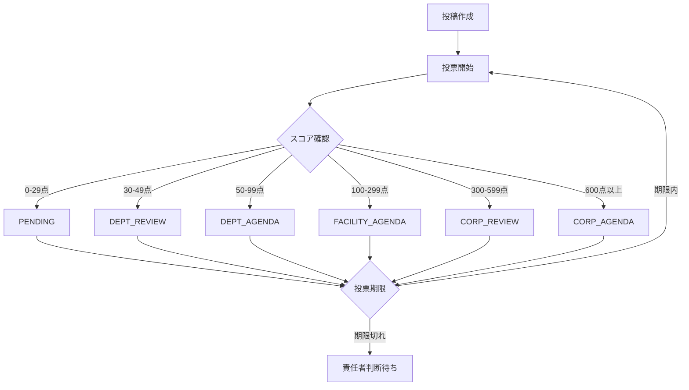
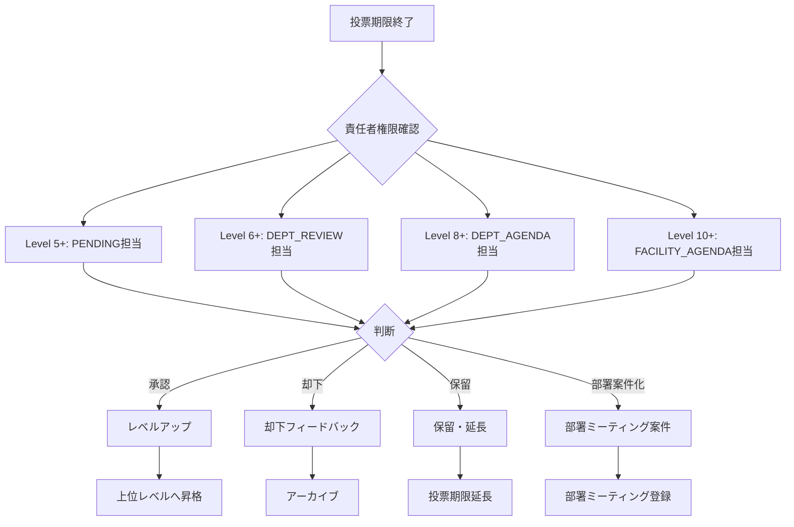
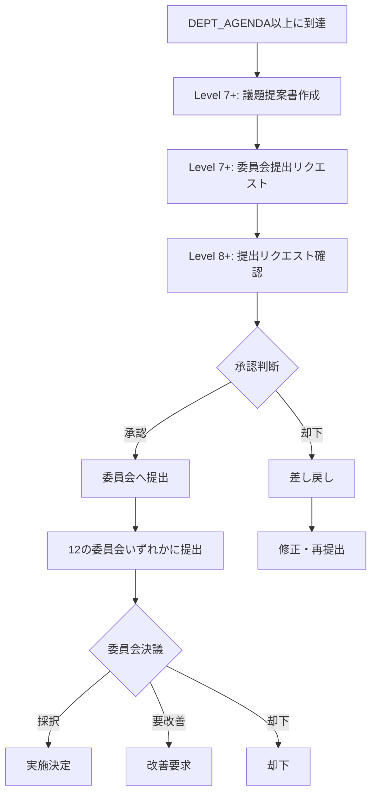

# VoiceDrive 投稿管理DB要件分析
**作成日**: 2025年10月9日
**対象機能**: 投稿管理（6段階議題化システム・権限別管理フロー）
**分析範囲**: ProposalManagementPage, CommitteeManagementPage, CommitteeSubmission, 承認フロー

---

## 📋 目次
1. [システム概要](#システム概要)
2. [6段階議題化レベル定義](#6段階議題化レベル定義)
3. [権限レベル別責任範囲](#権限レベル別責任範囲)
4. [投稿管理ワークフロー](#投稿管理ワークフロー)
5. [データ管理責任分界点](#データ管理責任分界点)
6. [テーブル設計](#テーブル設計)
7. [API設計](#api設計)
8. [実装優先度](#実装優先度)

---

## システム概要

### 投稿管理システムの役割
VoiceDriveの投稿管理システムは、職員の改善提案を **6段階の議題レベル** で自動昇格させ、各権限レベルの責任者が適切に管理・判断できる仕組みです。

### 主要機能
1. **自動議題レベル判定**: 投票スコアに基づいて6段階のレベルに自動昇格
2. **権限別管理画面**: Level 5-13の各責任者に応じた管理機能
3. **責任者判断アクション**: レベルアップ承認、却下、保留、部署案件化
4. **委員会提出フロー**: Level 7+が準備 → Level 8+が承認 → 委員会提出
5. **議題提案書生成**: 投票分析・コメント分析を基に自動生成
6. **期限管理**: 投票期限・延長管理・期限切れ時の責任者判断促進

---

## 6段階議題化レベル定義

| レベル | 点数範囲 | レベル名 | 責任者 (Level) | 提出先 | 説明 |
|--------|----------|----------|----------------|--------|------|
| **PENDING** | 0-29点 | 検討中 | 副主任以上 (5+) | なし（様子見） | 投票継続中、様子見段階 |
| **DEPT_REVIEW** | 30-49点 | 部署検討 | 主任 (6+) | 部署ミーティング | 部署内で議論するための提案書作成 |
| **DEPT_AGENDA** | 50-99点 | 部署議題 | 師長 (8+) | 施設運営委員会 | 施設レベルで検討するための提案書作成 |
| **FACILITY_AGENDA** | 100-299点 | 施設議題 | 部長 (10+) | 法人運営委員会 | 法人レベルで検討するための提案書作成 |
| **CORP_REVIEW** | 300-599点 | 法人検討 | 副院長 (12+) | 法人理事会 | 理事会で検討するための提案書作成 |
| **CORP_AGENDA** | 600点以上 | 法人議題 | 院長 (13+) | 最終決定機関（理事会） | 最終決定機関での審議のための提案書作成 |

### スコア計算ロジック
```typescript
// 投票重み付け
const VOTE_WEIGHTS = {
  'strongly-support': +5,
  'support': +3,
  'neutral': 0,
  'oppose': -3,
  'strongly-oppose': -5
};

// 権限レベルによる重み補正
const PERMISSION_WEIGHT = {
  1-4: 1.0,   // 一般職員
  5-7: 1.5,   // 主任・副主任
  8-10: 2.0,  // 師長・部長
  11-13: 3.0  // 副院長・院長
};

// 最終スコア = Σ(投票重み × 権限重み)
```

---

## 権限レベル別責任範囲

### 責任範囲マトリクス

| 権限Level | 役職 | 管轄レベル | 編集可 | 閲覧可 | 主要アクション |
|-----------|------|------------|--------|--------|----------------|
| **5** | 副主任 | PENDING | ✅ | ✅ | 様子見・投票促進 |
| **6** | 主任 | DEPT_REVIEW | ✅ | ✅ PENDING, DEPT_AGENDA | 部署検討提案書作成・レベルアップ承認 |
| **7** | - | - | - | ✅ DEPT_REVIEW - DEPT_AGENDA | 委員会提出リクエスト作成 |
| **8** | 師長 | DEPT_AGENDA | ✅ | ✅ DEPT_REVIEW - FACILITY_AGENDA | 委員会提出承認・施設議題化 |
| **10** | 部長 | FACILITY_AGENDA | ✅ | ✅ DEPT_AGENDA - CORP_REVIEW | 法人議題化判断 |
| **12** | 副院長 | CORP_REVIEW | ✅ | ✅ FACILITY_AGENDA - CORP_AGENDA | 理事会提出判断 |
| **13** | 院長 | CORP_AGENDA | ✅ | ✅ 全レベル | 最終決定・全体監督 |

### 権限ルール
```typescript
// ProposalPermissionService.ts より

// 1. 専任担当者（編集可）
if (userLevel === targetLevel) {
  return { canEdit: true, role: 'owner' };
}

// 2. 上位監督者（1-2段階上：アドバイス可）
if (userLevel - targetLevel <= 2) {
  return { canEdit: false, canComment: true, canEmergencyOverride: true };
}

// 3. 上位監督者（3段階以上上：閲覧のみ）
if (userLevel > targetLevel) {
  return { canEdit: false, canComment: false, canEmergencyOverride: true };
}

// 4. フォールバック（下位担当者不在時）
if (userLevel >= minLevel && userLevel < targetLevel) {
  return { canEdit: true, role: 'owner (代行)' };
}

// 5. 下位閲覧（学習目的）
if (userLevel >= minLevel - 2) {
  return { canView: true, role: 'observer' };
}
```

---

## 投稿管理ワークフロー

### Phase 1: 投票期間（自動昇格）



### Phase 2: 責任者判断（期限後）



### Phase 3: 委員会提出フロー



### 委員会一覧（12種類）

#### 医療安全・品質
1. **医療安全委員会**（医療事故防止・リスク管理）
2. **感染対策委員会**（院内感染防止）
3. **医薬品委員会**（医薬品の適正使用・管理）
4. **医療機器安全管理委員会**（医療機器の安全管理）

#### 業務改善
5. **業務改善委員会**（業務効率化・プロセス改善）
6. **ICT活用委員会**（情報システム・デジタル化）

#### 人事・労務
7. **労働安全衛生委員会**（職員の安全衛生）
8. **教育・研修委員会**（職員教育・キャリア開発）

#### 経営・運営
9. **経営企画委員会**（経営戦略・中長期計画）
10. **施設運営委員会**（施設管理・運営改善）

#### その他
11. **倫理委員会**（医療倫理・研究倫理）
12. **地域連携委員会**（地域医療連携・患者サービス）

---

## データ管理責任分界点

### VoiceDrive管轄（A: 完全管理）
| カテゴリ | データ種別 | 理由 |
|----------|------------|------|
| **投稿管理データ** | Post拡張情報（議題レベル、期限、責任者判断履歴） | 投稿追跡システムのコア機能 |
| **議題提案書** | ProposalDocument（自動生成された提案書） | VoiceDrive独自機能 |
| **委員会提出** | SubmissionRequest（提出リクエスト・承認記録） | VoiceDrive独自フロー |
| **責任者判断履歴** | ResponsibilityAction（レベルアップ承認・却下・保留） | VoiceDrive独自ワークフロー |
| **タイムライン** | PostManagementTimeline（投稿管理アクティビティ） | VoiceDrive独自追跡 |

### 医療システム参照（B: API経由取得・キャッシュ）
| カテゴリ | データ種別 | 取得方法 |
|----------|------------|----------|
| **職員基本情報** | employeeId, name, department, permissionLevel | GET /api/employees/:employeeId |
| **部署構成** | 部署メンバーリスト | GET /api/departments/:departmentId/members |
| **組織階層** | facilityId, 親部署ID | GET /api/organization/structure |

### 医療システム通知（C: Webhook送信）
| イベント | タイミング | データ内容 |
|----------|-----------|-----------|
| **委員会提出通知** | Level 8+が委員会提出承認時 | 提案書ID、委員会名、提出者情報 |
| **最終決定通知** | 委員会で実施決定時 | 決定内容、実施予定、担当部署 |

### 完全独立（D: 医療システム不要）
- **投票データ**: Vote, VoteHistory（VoiceDrive完全管理）
- **コメントデータ**: Comment（VoiceDrive完全管理）
- **議題レベル自動判定ロジック**: スコア計算・レベル昇格（VoiceDrive内部処理）
- **期限管理**: 投票期限・延長処理（VoiceDrive内部処理）

---

## テーブル設計

### 1. Post拡張（議題レベル・期限情報）

```prisma
model Post {
  id                    String    @id @default(cuid())
  // ... 既存フィールド ...

  // ===== 議題レベル管理 =====
  agendaScore           Int?      @default(0)
  agendaLevel           String?   // 'PENDING' | 'DEPT_REVIEW' | 'DEPT_AGENDA' | 'FACILITY_AGENDA' | 'CORP_REVIEW' | 'CORP_AGENDA'
  agendaDeadline        DateTime? // 投票期限
  agendaDeadlineExtensions Int?   @default(0) // 延長回数

  // ===== 責任者判断状態 =====
  responsibilityStatus  String?   @default("voting") // 'voting' | 'awaiting_decision' | 'approved' | 'rejected' | 'on_hold' | 'dept_matter'
  responsibleLevel      Int?      // 現在の責任者Level（6, 8, 10, 12, 13）
  lastActionBy          String?   // 最後にアクションした責任者のemployeeId
  lastActionAt          DateTime? // 最後のアクション日時

  // ===== 委員会提出状態 =====
  committeeStatus       String?   // 'not_submitted' | 'request_pending' | 'approved_for_submission' | 'submitted' | 'decided'
  targetCommittee       String?   // 提出先委員会名
  submittedAt           DateTime? // 委員会提出日時
  committeeDecision     String?   // 'adopted' | 'requires_improvement' | 'rejected'

  // リレーション
  responsibilityActions ResponsibilityAction[]
  proposalDocuments     ProposalDocument[]
  submissionRequests    SubmissionRequest[]
  managementTimeline    PostManagementTimeline[]
}
```

### 2. 責任者判断アクション履歴

```prisma
model ResponsibilityAction {
  id              String    @id @default(cuid())
  postId          String

  // アクション情報
  actionType      String    // 'approve_levelup' | 'reject' | 'hold' | 'department_matter' | 'extend_deadline'
  actionBy        String    // 責任者のemployeeId
  actionByName    String?   // キャッシュ用
  actionByLevel   Int       // 責任者の権限Level

  // 対象レベル
  fromLevel       String?   // 変更前レベル（レベルアップの場合）
  toLevel         String?   // 変更後レベル（レベルアップの場合）

  // フィードバック
  feedback        String?   // 却下理由・保留理由・部署案件化理由

  // 期限情報（延長の場合）
  newDeadline     DateTime? // 新しい期限
  extensionReason String?   // 延長理由

  // タイムスタンプ
  actionAt        DateTime  @default(now())

  // リレーション
  post            Post      @relation(fields: [postId], references: [id], onDelete: Cascade)

  @@index([postId])
  @@index([actionBy])
  @@index([actionType])
  @@index([actionAt])
}
```

### 3. 議題提案書

```prisma
model ProposalDocument {
  id                   String    @id @default(cuid())
  postId               String

  // 基本情報
  title                String
  summary              String    // 提案概要（100-300字）
  agendaLevel          String    // 対象となる議題レベル
  targetCommittee      String?   // 提出先委員会

  // 自動生成データ
  voteAnalysis         Json      // VoteAnalysis型（総投票数、支持率、部署別分析）
  commentAnalysis      Json      // CommentAnalysis型（コメント分類、主要意見）

  // 提案書内容
  background           String?   // 背景・現状課題
  proposal             String?   // 提案内容
  expectedOutcome      String?   // 期待される効果
  implementationPlan   String?   // 実施計画
  budgetEstimate       Float?    // 予算見積もり
  risks                String?   // リスク・懸念事項

  // 推奨レベル
  recommendationLevel  String?   // 'strongly_recommend' | 'recommend' | 'neutral' | 'not_recommend'
  recommendationReason String?   // 推奨理由

  // ステータス
  status               String    @default("draft") // 'draft' | 'under_review' | 'ready' | 'submitted' | 'approved' | 'rejected'

  // 作成者・日時
  createdBy            String    // employeeId
  createdByName        String?   // キャッシュ用
  createdDate          DateTime  @default(now())
  updatedDate          DateTime  @updatedAt
  submittedDate        DateTime? // 委員会提出日

  // リレーション
  post                 Post      @relation(fields: [postId], references: [id], onDelete: Cascade)
  submissionRequests   SubmissionRequest[]

  @@index([postId])
  @@index([status])
  @@index([agendaLevel])
}
```

### 4. 委員会提出リクエスト

```prisma
model SubmissionRequest {
  id              String    @id @default(cuid())
  documentId      String
  postId          String    // 追跡用

  // リクエスト情報
  requestedBy     String    // Level 7+ のemployeeId
  requestedByName String?   // キャッシュ用
  requestedByLevel Int      // Level 7+
  requestedDate   DateTime  @default(now())
  targetCommittee String    // 提出先委員会名

  // 承認情報
  status          String    @default("pending") // 'pending' | 'approved' | 'rejected'
  reviewedBy      String?   // Level 8+ のemployeeId
  reviewedByName  String?   // キャッシュ用
  reviewedByLevel Int?      // Level 8+
  reviewedDate    DateTime?
  reviewNotes     String?   // 承認コメント or 却下理由

  // リレーション
  document        ProposalDocument @relation(fields: [documentId], references: [id], onDelete: Cascade)
  post            Post             @relation(fields: [postId], references: [id], onDelete: Cascade)

  @@index([documentId])
  @@index([postId])
  @@index([status])
  @@index([requestedBy])
  @@index([reviewedBy])
}
```

### 5. 投稿管理タイムライン

```prisma
model PostManagementTimeline {
  id          String    @id @default(cuid())
  postId      String

  // イベント情報
  eventType   String    // 'level_upgraded' | 'deadline_set' | 'deadline_extended' | 'responsibility_action' | 'document_created' | 'committee_submitted' | 'decision_made'
  title       String    // イベントタイトル
  description String?   // 詳細説明

  // アクター情報
  actorId     String?   // employeeId（該当する場合）
  actorName   String?   // キャッシュ用
  actorLevel  Int?      // 権限Level

  // レベル情報（レベル昇格の場合）
  fromLevel   String?
  toLevel     String?

  // その他メタデータ
  metadata    Json?     // イベント固有のデータ

  // タイムスタンプ
  eventAt     DateTime  @default(now())

  // リレーション
  post        Post      @relation(fields: [postId], references: [id], onDelete: Cascade)

  @@index([postId])
  @@index([eventType])
  @@index([eventAt])
}
```

### 6. 委員会マスター（参照用）

```prisma
model Committee {
  id          String    @id @default(cuid())

  // 委員会情報
  name        String    @unique // "医療安全委員会"
  category    String    // "医療安全・品質" | "業務改善" | "人事・労務" | "経営・運営" | "その他"
  description String?   // 委員会の説明

  // 権限設定
  minLevel    Int       @default(7)  // 提出リクエスト最低Level
  approvalLevel Int     @default(8)  // 承認必要Level

  // 開催情報
  meetingFrequency String? // "月1回" | "隔週" | "随時"
  nextMeetingDate  DateTime?

  // ステータス
  isActive    Boolean   @default(true)

  // タイムスタンプ
  createdAt   DateTime  @default(now())
  updatedAt   DateTime  @updatedAt

  @@index([category])
  @@index([isActive])
}
```

---

## API設計

### VoiceDrive内部API（8個）

#### 1. POST /api/proposal-management/actions
**責任者判断アクション実行**

リクエスト:
```json
{
  "postId": "post-123",
  "actionType": "approve_levelup" | "reject" | "hold" | "department_matter" | "extend_deadline",
  "actionBy": "OH-NS-2024-001",
  "actionByLevel": 8,
  "feedback": "承認理由・却下理由・保留理由",
  "newDeadline": "2025-10-15T23:59:59Z",  // 延長の場合
  "extensionReason": "さらなる意見収集のため"  // 延長の場合
}
```

レスポンス:
```json
{
  "success": true,
  "action": {
    "id": "action-456",
    "postId": "post-123",
    "actionType": "approve_levelup",
    "fromLevel": "DEPT_REVIEW",
    "toLevel": "DEPT_AGENDA",
    "actionBy": "OH-NS-2024-001",
    "actionAt": "2025-10-09T14:30:00Z"
  },
  "updatedPost": {
    "id": "post-123",
    "agendaLevel": "DEPT_AGENDA",
    "agendaScore": 75,
    "responsibleLevel": 8
  }
}
```

#### 2. GET /api/proposal-management/posts
**管轄投稿一覧取得（権限別フィルタ）**

クエリパラメータ:
```
?userLevel=8
&filter=managed | viewable
&agendaLevel=DEPT_AGENDA
&status=awaiting_decision | voting | approved
&limit=50
```

レスポンス:
```json
{
  "success": true,
  "posts": [
    {
      "id": "post-123",
      "content": "夜勤引継ぎ時間の延長提案",
      "agendaLevel": "DEPT_AGENDA",
      "agendaScore": 75,
      "responsibilityStatus": "awaiting_decision",
      "responsibleLevel": 8,
      "deadline": "2025-10-05T23:59:59Z",
      "isDeadlinePassed": true,
      "author": {
        "employeeId": "OH-NS-2024-005",
        "name": "山田花子",
        "department": "看護部"
      },
      "voteStats": {
        "totalVotes": 34,
        "supportRate": 85
      },
      "permission": {
        "canEdit": true,
        "canComment": true,
        "role": "owner"
      }
    }
  ],
  "total": 120,
  "managedCount": 15,
  "viewableCount": 120
}
```

#### 3. POST /api/proposal-documents/generate
**議題提案書自動生成**

リクエスト:
```json
{
  "postId": "post-123",
  "createdBy": "OH-NS-2024-010",
  "agendaLevel": "DEPT_AGENDA",
  "targetCommittee": "施設運営委員会"
}
```

レスポンス:
```json
{
  "success": true,
  "document": {
    "id": "doc-789",
    "postId": "post-123",
    "title": "夜勤引継ぎ時間延長に関する提案",
    "summary": "夜勤引継ぎ時間を15分延長し、患者情報の詳細共有を実現する提案",
    "voteAnalysis": {
      "totalVotes": 34,
      "supportRate": 85,
      "byDepartment": [...]
    },
    "commentAnalysis": {
      "totalComments": 12,
      "supportComments": 8,
      "concernComments": 4,
      "keyComments": [...]
    },
    "background": "現状の引継ぎ時間では情報共有が不十分...",
    "proposal": "引継ぎ時間を15分延長し、チェックリストを導入...",
    "expectedOutcome": "医療安全性の向上、職員の負担軽減...",
    "recommendationLevel": "recommend",
    "status": "draft"
  }
}
```

#### 4. GET /api/proposal-documents/:documentId
**議題提案書取得**

レスポンス: 上記document構造と同様

#### 5. PUT /api/proposal-documents/:documentId
**議題提案書編集**

リクエスト:
```json
{
  "background": "更新された背景説明...",
  "proposal": "更新された提案内容...",
  "budgetEstimate": 500000,
  "status": "ready"
}
```

#### 6. POST /api/committee-submissions/requests
**委員会提出リクエスト作成（Level 7+）**

リクエスト:
```json
{
  "documentId": "doc-789",
  "postId": "post-123",
  "requestedBy": "OH-NS-2024-015",
  "requestedByLevel": 7,
  "targetCommittee": "業務改善委員会"
}
```

レスポンス:
```json
{
  "success": true,
  "request": {
    "id": "req-101",
    "documentId": "doc-789",
    "status": "pending",
    "requestedBy": "OH-NS-2024-015",
    "requestedDate": "2025-10-09T15:00:00Z",
    "targetCommittee": "業務改善委員会"
  }
}
```

#### 7. POST /api/committee-submissions/requests/:requestId/approve
**提出リクエスト承認（Level 8+）**

リクエスト:
```json
{
  "reviewedBy": "OH-NS-2024-020",
  "reviewedByLevel": 8,
  "reviewNotes": "承認します。委員会で審議してください。"
}
```

レスポンス:
```json
{
  "success": true,
  "request": {
    "id": "req-101",
    "status": "approved",
    "reviewedBy": "OH-NS-2024-020",
    "reviewedDate": "2025-10-09T16:00:00Z"
  },
  "committeeSubmission": {
    "postId": "post-123",
    "committeeStatus": "submitted",
    "targetCommittee": "業務改善委員会",
    "submittedAt": "2025-10-09T16:00:00Z"
  }
}
```

#### 8. GET /api/post-management/timeline/:postId
**投稿管理タイムライン取得**

レスポンス:
```json
{
  "success": true,
  "timeline": [
    {
      "id": "timeline-1",
      "eventType": "level_upgraded",
      "title": "部署検討に昇格",
      "description": "スコア30点を達成",
      "fromLevel": "PENDING",
      "toLevel": "DEPT_REVIEW",
      "eventAt": "2025-10-05T10:00:00Z"
    },
    {
      "id": "timeline-2",
      "eventType": "deadline_extended",
      "title": "投票期限延長",
      "description": "さらなる意見収集のため期限を3日延長",
      "actorName": "佐藤主任",
      "actorLevel": 6,
      "eventAt": "2025-10-06T14:00:00Z"
    },
    {
      "id": "timeline-3",
      "eventType": "responsibility_action",
      "title": "レベルアップ承認",
      "description": "部署議題への昇格を承認",
      "actorName": "田中師長",
      "actorLevel": 8,
      "fromLevel": "DEPT_REVIEW",
      "toLevel": "DEPT_AGENDA",
      "eventAt": "2025-10-08T11:00:00Z"
    },
    {
      "id": "timeline-4",
      "eventType": "document_created",
      "title": "議題提案書作成",
      "description": "施設運営委員会向け提案書を作成",
      "actorName": "鈴木副主任",
      "actorLevel": 7,
      "eventAt": "2025-10-08T15:00:00Z"
    }
  ]
}
```

### 医療システム連携API（2個）

#### API-PM-M-1: GET /api/employees/:employeeId
**職員基本情報取得**

リクエスト:
```
GET /api/employees/OH-NS-2024-001
```

レスポンス:
```json
{
  "employeeId": "OH-NS-2024-001",
  "name": "山田太郎",
  "department": "看護部",
  "facilityId": "tategami_hospital",
  "permissionLevel": 8,
  "position": "師長",
  "hierarchyLevel": 5
}
```

**Phase**: 1
**優先度**: 高
**見積工数**: 2日
**見積金額**: ¥160,000

#### API-PM-M-2: GET /api/organization/structure
**組織階層構造取得**

リクエスト:
```
GET /api/organization/structure?facilityId=tategami_hospital
```

レスポンス:
```json
{
  "facilityId": "tategami_hospital",
  "facilityName": "たてがみ病院",
  "departments": [
    {
      "departmentId": "nursing",
      "departmentName": "看護部",
      "parentDepartmentId": null,
      "level": 1,
      "responsibleLevel": 8
    },
    {
      "departmentId": "nursing_ward_a",
      "departmentName": "看護部A病棟",
      "parentDepartmentId": "nursing",
      "level": 2,
      "responsibleLevel": 6
    }
  ]
}
```

**Phase**: 2
**優先度**: 中
**見積工数**: 3日
**見積金額**: ¥240,000

### Webhook通知（1個）

#### WH-PM-M-1: POST /webhook/committee-submission
**委員会提出通知**

医療システムへの通知:
```json
{
  "event": "committee_submission",
  "timestamp": "2025-10-09T16:00:00Z",
  "data": {
    "postId": "post-123",
    "documentId": "doc-789",
    "title": "夜勤引継ぎ時間延長に関する提案",
    "targetCommittee": "業務改善委員会",
    "submittedBy": "OH-NS-2024-020",
    "submittedByName": "田中師長",
    "agendaLevel": "DEPT_AGENDA",
    "supportRate": 85,
    "totalVotes": 34,
    "documentUrl": "https://voicedrive.app/proposal-document/doc-789",
    "urgency": "medium"
  },
  "signature": "HMAC-SHA256-SIGNATURE"
}
```

**Phase**: 2
**優先度**: 高
**見積工数**: 5日
**見積金額**: ¥400,000

---

## 実装優先度

### Phase 1: コア機能（2週間）- ¥1,280,000

#### Week 1-2: 基本投稿管理機能
1. **Post拡張テーブル追加** (2日)
   - agendaScore, agendaLevel, agendaDeadline追加
   - responsibilityStatus, responsibleLevel追加
   - マイグレーション実行

2. **ResponsibilityAction実装** (2日)
   - テーブル作成
   - アクション記録API実装

3. **ProposalManagementPage統合** (3日)
   - 権限別フィルタリング実装
   - データ分析モード・議題提案書モード実装
   - デモデータから実データへ移行

4. **期限管理実装** (2日)
   - 投票期限設定・延長機能
   - 期限切れ検知・通知

5. **医療システム職員情報API連携** (3日)
   - API-PM-M-1実装依頼・テスト
   - キャッシュ機構実装

**成果物**:
- Level 5-13の責任者が投稿を管理できる
- 期限管理・延長機能動作
- 責任者判断アクション実行可能

### Phase 2: 議題提案書・委員会提出（2週間）- ¥1,440,000

#### Week 3-4: 提案書生成・委員会フロー
1. **ProposalDocument実装** (3日)
   - テーブル作成
   - 自動生成ロジック実装
   - 投票分析・コメント分析統合

2. **SubmissionRequest実装** (3日)
   - Level 7+ 提出リクエスト機能
   - Level 8+ 承認機能

3. **CommitteeManagementPage統合** (2日)
   - 提出リクエスト一覧表示
   - 承認・却下ワークフロー

4. **Committee マスターテーブル** (1日)
   - 12委員会データ登録
   - 委員会情報管理

5. **医療システム組織構造API連携** (2日)
   - API-PM-M-2実装依頼・テスト

6. **医療システムWebhook実装** (3日)
   - WH-PM-M-1実装依頼・テスト
   - HMAC署名検証

**成果物**:
- 議題提案書自動生成機能動作
- Level 7+ → Level 8+ 委員会提出フロー動作
- 医療システムへ委員会提出通知

### Phase 3: タイムライン・高度機能（1週間）- ¥560,000

#### Week 5: 履歴管理・分析機能
1. **PostManagementTimeline実装** (2日)
   - タイムラインイベント記録
   - UI統合（ProposalAnalysisCard）

2. **統計・分析機能** (2日)
   - 部署別支持率分析
   - レベル別滞留時間分析
   - ダッシュボード統合

3. **通知システム統合** (1日)
   - 期限切れ通知
   - 責任者判断待ち通知
   - 委員会提出通知

4. **テスト・デバッグ** (2日)
   - 統合テスト
   - パフォーマンステスト

**成果物**:
- 完全な投稿管理追跡
- 統計・分析機能
- 通知システム連携

---

## 見積もりサマリー

| フェーズ | 期間 | 内容 | VoiceDrive工数 | 医療システム工数 | 医療システム金額 |
|---------|------|------|----------------|-----------------|----------------|
| **Phase 1** | 2週間 | 基本投稿管理 | 12日 | 2日 | ¥160,000 |
| **Phase 2** | 2週間 | 提案書・委員会 | 14日 | 8日 | ¥640,000 |
| **Phase 3** | 1週間 | タイムライン・分析 | 7日 | 0日 | ¥0 |
| **合計** | **5週間** | **全機能** | **33日** | **10日** | **¥800,000** |

**医療システムチーム必要工数**: 10日（2 APIs + 1 Webhook）
**医療システムチーム見積金額**: ¥800,000
**VoiceDriveチーム工数**: 33日

**特記事項**:
- PostTrackingと比較して医療システム依存度が高い（API 2個 + Webhook 1個）
- 委員会提出Webhookは医療システム側の委員会管理機能との連携が必要
- 組織階層APIは複雑な階層構造を返す必要があり工数が大きい

---

## 確認事項（医療システムチームへ）

### 技術的確認
1. **組織階層構造API**: 現在の医療システムに組織階層データは存在しますか？
2. **委員会マスター**: 12の委員会情報は医療システムに登録されていますか？
3. **委員会提出Webhook**: 委員会提出通知を受け取る医療システム側のエンドポイントは実装可能ですか？
4. **階層レベル定義**: department階層レベルと責任者permissionLevelの対応関係は明確ですか？
5. **委員会決議データ**: 委員会での審議結果（採択・要改善・却下）をVoiceDriveに返す仕組みは必要ですか？

### 運用的確認
6. **権限レベル変更**: 職員の権限Level変更時、VoiceDriveへの通知は必要ですか？
7. **組織改編**: 部署統廃合時、VoiceDriveの議題管理にどう影響しますか？
8. **委員会開催頻度**: 各委員会の開催頻度・スケジュールはVoiceDriveで管理すべきですか？
9. **提出書類形式**: 議題提案書のPDF出力機能は必要ですか？
10. **決裁ワークフロー**: 医療システム側に既存の決裁ワークフローがある場合、統合は必要ですか？

### データ連携確認
11. **職員情報同期**: employeeId, permissionLevelの変更をリアルタイムでVoiceDriveに反映する仕組みは必要ですか？
12. **部署コード体系**: departmentIdとdepartmentNameの対応表は共有されていますか？
13. **施設ID**: facilityIdの命名規則・一覧は共有されていますか？
14. **権限Level定義**: Level 1-13の詳細な定義・役職対応表は文書化されていますか？
15. **委員会メンバー**: 各委員会の委員リストは医療システムで管理されていますか？

---

## 添付資料

### A. 責任者判断フローチャート詳細
（ProposalAnalysisCard.tsx の責任者アクションロジック図）

### B. 委員会提出ワークフロー詳細
（CommitteeSubmission.tsx の提出フロー図）

### C. 権限マトリクス詳細表
（ProposalPermissionService.ts の権限判定ルール）

### D. タイムラインイベント種別一覧
（PostManagementTimeline の eventType 定義）

---

**作成者**: Claude (AI Assistant)
**レビュー**: VoiceDrive開発チーム
**承認**: 医療職員管理システムチーム

**次回アクション**:
1. 医療システムチームへ確認事項回答依頼
2. Phase 1実装計画詳細化
3. テーブル設計レビュー会議設定
