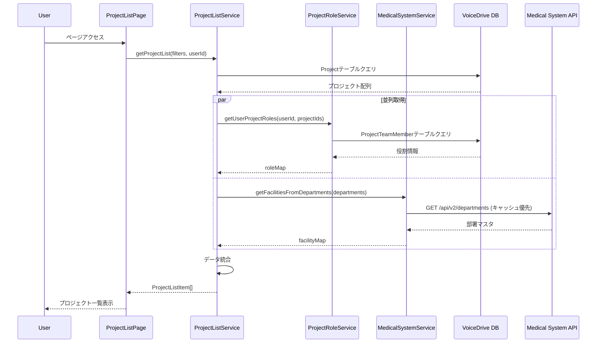
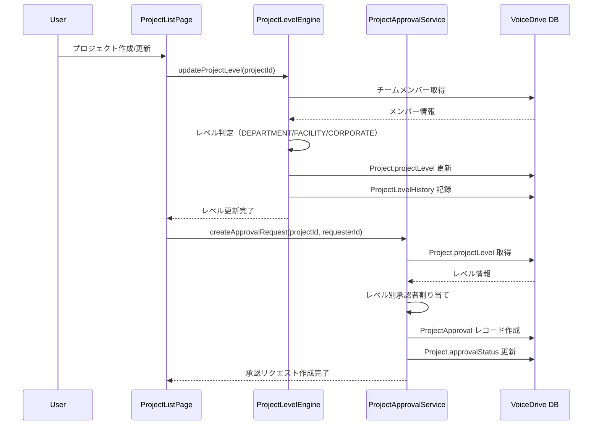
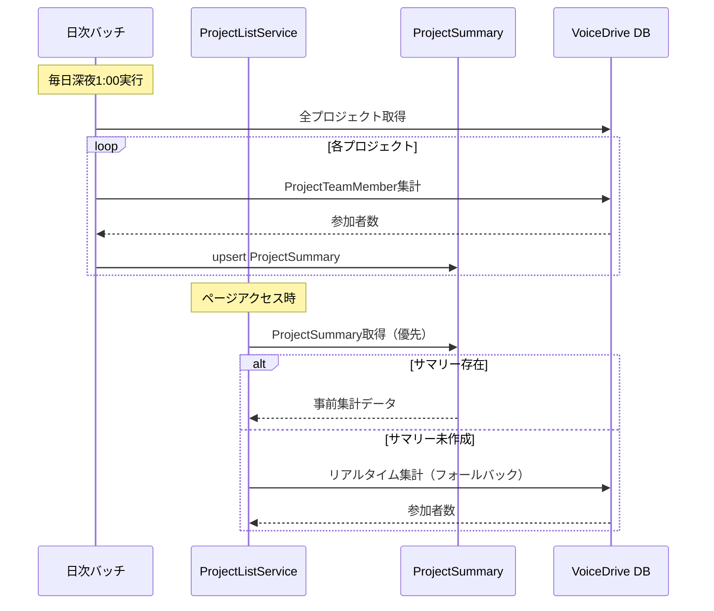

# ProjectListPage DB要件分析

**文書番号**: DB-REQ-2025-1026-001
**作成日**: 2025年10月26日
**対象ページ**: https://voicedrive-v100.vercel.app/projects ProjectListPage
**参照文書**:
- [データ管理責任分界点定義書_20251008.md](./データ管理責任分界点定義書_20251008.md)
- [PersonalStation_DB要件分析_20251008.md](./PersonalStation_DB要件分析_20251008.md)
- [organization-analytics_医療システム確認結果_20251010.md](./organization-analytics_医療システム確認結果_20251010.md)

---

## 📋 分析サマリー

### 結論
ProjectListPageは**VoiceDrive独自のプロジェクト管理機能**であり、医療システムとは**組織構造情報の参照のみ**で連携します。

### 🎯 データ管理責任分界点

#### VoiceDrive側の責任（100%）
- ✅ プロジェクト基本情報（title, description, status）
- ✅ プロジェクトレベル（DEPARTMENT/FACILITY/CORPORATE/EMERGENCY）
- ✅ 進捗率・開始日・完了日
- ✅ 承認状態・承認者情報
- ✅ 緊急エスカレーション情報
- ✅ チームメンバー管理
- ✅ 参加者数の集計

#### 医療システム側の責任
- 📡 部署マスタAPI（GET /api/v2/departments）
- 📡 施設マスタAPI（departmentsレスポンス内）
- 📡 職員数API（GET /api/v2/employees/count）※参考
- ❌ プロジェクトデータの管理は**一切なし**

---

## 🔍 ページ機能分析

### 1. 画面構成

ProjectListPageは以下の3つのセクションで構成されています：

#### 1.1 統計サマリー（上部）
```typescript
interface ProjectStats {
  active: number;      // 参加中のプロジェクト数
  completed: number;   // 完了済みプロジェクト数
  proposed: number;    // 提案中のプロジェクト数
  owned: number;       // オーナープロジェクト数
}
```

**データソース**: VoiceDrive DB（Projectテーブル）

#### 1.2 検索・フィルタセクション（中央）
```typescript
interface Filters {
  searchTerm: string;                                    // 検索キーワード
  status: 'all' | 'active' | 'completed' | 'proposed';  // ステータスフィルター
  category: 'all' | 'improvement' | 'community' | 'facility' | 'system'; // カテゴリーフィルター
  level: 'all' | 'DEPARTMENT' | 'FACILITY' | 'CORPORATE' | 'EMERGENCY';  // レベルフィルター
}
```

**データソース**: フロントエンド状態管理（React state）

#### 1.3 プロジェクト一覧（下部）
```typescript
interface ProjectListItem {
  // 基本情報（VoiceDrive DB）
  id: string;
  title: string;
  description: string;
  status: 'proposed' | 'active' | 'completed' | 'paused';
  progress: number;  // 0-100
  startDate: string | null;
  endDate: string | null;
  category: 'improvement' | 'community' | 'facility' | 'system';
  priority: 'high' | 'medium' | 'low' | 'urgent' | null;

  // チーム情報（VoiceDrive DB）
  participants: number;  // 参加者数（集計）
  myRole: 'owner' | 'participant' | 'viewer';  // ユーザーの役割

  // 組織情報（医療システムAPI + VoiceDriveキャッシュ）
  department: string;    // 提案者の部署名
  facility: string;      // 施設名

  // Phase 2拡張（VoiceDrive DB）
  projectLevel: string | null;          // プロジェクトレベル
  isEmergencyEscalated: boolean;       // 緊急エスカレーション有無
  escalatedBy: string | null;          // エスカレーション実行者ID
  escalatedDate: string | null;        // エスカレーション日時
  approvalStatus: string;              // 承認状態
  currentApprover: string | null;      // 現在の承認者ID
}
```

---

## 💾 データベース要件分析

### Phase 1: 基本機能（実装済み）

#### 1. Projectテーブル
**状態**: ✅ 既存テーブル（Phase 1で使用中）

```prisma
model Project {
  id                    String    @id @default(cuid())
  title                 String
  description           String
  category              String    // improvement/community/facility/system
  status                String    @default("proposed")  // proposed/active/completed/paused
  priority              String?   // high/medium/low/urgent
  proposerId            String
  progressRate          Float     @default(0)  // 0-100
  startedAt             DateTime?
  completedAt           DateTime?
  createdAt             DateTime  @default(now())
  updatedAt             DateTime  @updatedAt

  // Relations
  proposer              User      @relation("ProposedProjects", fields: [proposerId], references: [id])
  teamMembers           ProjectTeamMember[]

  @@index([proposerId])
  @@index([status])
  @@index([category])
  @@index([createdAt])
}
```

**評価**: ✅ Phase 1に必要な全フィールドが揃っている

---

#### 2. ProjectTeamMemberテーブル
**状態**: ✅ 既存テーブル（Phase 1で使用中）

```prisma
model ProjectTeamMember {
  id        String    @id @default(cuid())
  projectId String
  userId    String
  role      String    @default("member")  // owner/member
  joinedAt  DateTime  @default(now())
  leftAt    DateTime?  // 退出日時（NULL = アクティブ）
  createdAt DateTime  @default(now())
  updatedAt DateTime  @updatedAt

  // Relations
  project   Project   @relation(fields: [projectId], references: [id], onDelete: Cascade)
  user      User      @relation(fields: [userId], references: [id])

  @@unique([projectId, userId])
  @@index([projectId])
  @@index([userId])
  @@index([role])
  @@index([leftAt])
}
```

**評価**: ✅ Phase 1に必要な全フィールドが揃っている

**使用方法**:
- 参加者数の集計: `COUNT(*) WHERE leftAt IS NULL`
- ユーザー役割判定: `role`フィールドと`proposerId`を組み合わせて判定

---

### Phase 2: レベル・承認機能（実装済み）

#### 3. Projectテーブル拡張
**状態**: ✅ Phase 2フィールド追加済み

```prisma
model Project {
  // ... Phase 1のフィールド

  // Phase 2追加フィールド
  isEmergencyEscalated  Boolean   @default(false)
  escalatedBy           String?
  escalatedDate         DateTime?
  escalationReason      String?
  projectLevel          String?   // DEPARTMENT/FACILITY/CORPORATE/EMERGENCY
  approvalStatus        String    @default("pending")  // pending/in_review/approved/rejected
  currentApprover       String?
  facilityId            String?   // 施設ID（キャッシュ）
  facilityName          String?   // 施設名（キャッシュ）

  // Phase 2リレーション
  escalator             User?     @relation("ProjectEscalator", fields: [escalatedBy], references: [id])
  approver              User?     @relation("ProjectCurrentApprover", fields: [currentApprover], references: [id])

  @@index([isEmergencyEscalated])
  @@index([projectLevel])
  @@index([approvalStatus])
  @@index([facilityId])
}
```

**評価**: ✅ Phase 2の全機能を実装済み

---

#### 4. 関連テーブル（Phase 2で使用）
**状態**: ✅ すべて既存テーブル

```prisma
model ProjectApproval {
  id              String    @id @default(cuid())
  projectId       String
  requesterId     String
  approverId      String
  approverLevel   String    // DEPARTMENT_HEAD/FACILITY_HEAD/HR_DEPARTMENT_HEAD/EXECUTIVE/CHAIRMAN
  status          String    // pending/approved/rejected/requested_changes
  comment         String?
  approvedAt      DateTime?
  createdAt       DateTime  @default(now())

  @@index([projectId])
  @@index([approverId])
  @@index([status])
}

model ProjectLevelHistory {
  id              String    @id @default(cuid())
  projectId       String
  previousLevel   String?
  newLevel        String
  changedBy       String?
  reason          String?
  changedAt       DateTime  @default(now())

  @@index([projectId])
}

model EmergencyDeactivation {
  id              String    @id @default(cuid())
  projectId       String
  deescalatedBy   String
  reason          String?
  deescalatedAt   DateTime  @default(now())

  @@index([projectId])
}
```

**評価**: ✅ Phase 2で利用可能

---

### Phase 3: パフォーマンス最適化（未実装）

#### 5. ProjectSummaryテーブル（新規）
**状態**: 🟡 スキーマ定義済み、データ投入待ち

```prisma
model ProjectSummary {
  id                  String    @id @default(cuid())
  projectId           String    @unique
  totalParticipants   Int       @default(0)
  activeParticipants  Int       @default(0)
  ownerCount          Int       @default(0)
  memberCount         Int       @default(0)
  lastCalculatedAt    DateTime  @default(now())
  updatedAt           DateTime  @updatedAt

  project             Project   @relation(fields: [projectId], references: [id], onDelete: Cascade)

  @@index([projectId])
  @@index([totalParticipants])
  @@index([activeParticipants])
}
```

**用途**:
- 参加者数の事前集計（リアルタイムCOUNT()の回避）
- 日次バッチで更新
- `ProjectListService.getProjectList()`のパフォーマンス改善

**評価**: 🟡 Phase 3で実装予定（スキーマは準備完了）

---

## 🔗 医療システムAPI連携

### 1. 部署マスタAPI
**エンドポイント**: `GET /api/v2/departments`
**状態**: ✅ 医療システム側実装済み

#### レスポンス例
```json
{
  "data": [
    {
      "departmentId": "dept-001",
      "departmentCode": "REHAB-01",
      "departmentName": "リハビリテーション科",
      "facilityId": "fac-001",
      "facilityCode": "TATEGAMI",
      "facilityName": "立神リハビリテーション温泉病院",
      "parentDepartmentId": null,
      "level": 1,
      "createdAt": "2024-01-01T00:00:00Z",
      "updatedAt": "2025-10-01T00:00:00Z"
    }
  ],
  "meta": {
    "total": 25,
    "timestamp": "2025-10-26T10:30:00Z"
  }
}
```

#### VoiceDrive側での利用方法
```typescript
// src/services/MedicalSystemService.ts
export async function getFacilitiesFromDepartments(
  departments: string[]
): Promise<Record<string, string>> {
  // 24時間キャッシュから取得
  const cachedData = await getCachedDepartmentMaster();

  // 部署名 → 施設名のマッピングを作成
  const facilityMap: Record<string, string> = {};
  for (const dept of departments) {
    const departmentData = cachedData.find(d => d.departmentName === dept);
    facilityMap[dept] = departmentData?.facilityName || '未設定';
  }

  return facilityMap;
}
```

**キャッシュ戦略**:
- ✅ 24時間キャッシュ（部署マスタは頻繁に変更されないため）
- ✅ Redis or Next.js Cache API利用
- ✅ Rate Limit対策（100 req/min/IP）

---

### 2. 職員数API（参考）
**エンドポイント**: `GET /api/v2/employees/count`
**状態**: ✅ 医療システム側実装済み（ProjectListPageでは未使用）

#### レスポンス例
```json
{
  "data": {
    "totalCount": 245,
    "byDepartment": [
      {
        "departmentId": "dept-001",
        "departmentCode": "REHAB-01",
        "departmentName": "リハビリテーション科",
        "count": 45
      }
    ]
  },
  "meta": {
    "timestamp": "2025-10-26T10:30:00Z"
  }
}
```

**評価**: ⚪ ProjectListPageでは使用していない（将来的に利用可能）

---

## 🔄 サービス層アーキテクチャ

### 実装済みサービス一覧

#### 1. ProjectListService.ts
**ファイルパス**: `src/services/ProjectListService.ts` (368行)
**状態**: ✅ Phase 1実装完了

**主要メソッド**:
```typescript
// プロジェクト一覧取得（フィルター対応）
export async function getProjectList(
  filters: ProjectListFilters,
  currentUserId: string
): Promise<ProjectListItem[]>

// ユーザー統計取得
export async function getProjectStats(
  currentUserId: string
): Promise<ProjectStats>

// プロジェクト詳細取得
export async function getProjectWithDetails(
  projectId: string,
  currentUserId: string
): Promise<ProjectWithDetails | null>
```

**データフロー**:
```
ProjectListPage
  ↓
ProjectListService.getProjectList()
  ↓
┌────────────────────────────────────────┐
│ 1. Projectテーブルから基本情報を取得    │
│ 2. ProjectRoleService: ユーザー役割判定 │
│ 3. MedicalSystemService: 施設名取得     │
│ 4. データを統合してProjectListItem[]生成 │
└────────────────────────────────────────┘
```

---

#### 2. ProjectRoleService.ts
**ファイルパス**: `src/services/ProjectRoleService.ts`
**状態**: ✅ Phase 1実装完了

**主要メソッド**:
```typescript
// ユーザーのプロジェクト内役割を判定
export async function getUserProjectRole(
  userId: string,
  projectId: string
): Promise<'owner' | 'participant' | 'viewer'>

// 複数プロジェクトの役割を一括取得（パフォーマンス最適化）
export async function getUserProjectRoles(
  userId: string,
  projectIds: string[]
): Promise<Record<string, ProjectRole>>

// プロジェクトの参加者数を一括取得
export async function getProjectParticipantCounts(
  projectIds: string[]
): Promise<Record<string, number>>
```

**役割判定ロジック**:
```typescript
if (project.proposerId === userId) {
  return 'owner';
}

const membership = await prisma.projectTeamMember.findUnique({
  where: { projectId_userId: { projectId, userId } }
});

if (membership && membership.leftAt === null) {
  return membership.role === 'owner' ? 'owner' : 'participant';
}

return 'viewer';
```

---

#### 3. MedicalSystemService.ts
**ファイルパス**: `src/services/MedicalSystemService.ts`
**状態**: ✅ Phase 1実装完了

**主要メソッド**:
```typescript
// 部署名から施設名を一括取得（24時間キャッシュ）
export async function getFacilitiesFromDepartments(
  departments: string[]
): Promise<Record<string, string>>

// 部署マスタ全件取得（キャッシュ付き）
async function fetchDepartmentMaster(): Promise<DepartmentMaster[]>
```

**キャッシュ実装**:
```typescript
import { unstable_cache } from 'next/cache';

const getCachedDepartmentMaster = unstable_cache(
  async () => {
    const response = await fetch(`${MEDICAL_SYSTEM_URL}/api/v2/departments`, {
      headers: {
        'X-API-Key': process.env.MEDICAL_SYSTEM_API_KEY!
      }
    });
    return response.json();
  },
  ['department-master'],
  { revalidate: 86400 }  // 24時間キャッシュ
);
```

---

#### 4. ProjectLevelEngine.ts
**ファイルパス**: `src/services/ProjectLevelEngine.ts` (344行)
**状態**: ✅ Phase 2実装完了

**主要メソッド**:
```typescript
// プロジェクトレベルを自動計算
export async function calculateProjectLevel(
  projectId: string
): Promise<ProjectLevelResult>

// プロジェクトレベルをDB更新
export async function updateProjectLevel(
  projectId: string
): Promise<void>

// レベル変更履歴を記録
async function trackLevelChange(
  projectId: string,
  previousLevel: string | null,
  newLevel: string,
  reason?: string
): Promise<void>
```

**レベル判定ロジック**:
```typescript
// 1. 緊急エスカレーション中 → EMERGENCY
if (project.isEmergencyEscalated) {
  return 'EMERGENCY';
}

// 2. 参加者の施設分布を確認
const facilitiesSet = new Set<string>();
teamMembers.forEach(member => {
  const facility = departmentToFacilityMap[member.user.department];
  if (facility) facilitiesSet.add(facility);
});

// 3. 複数施設 → CORPORATE
if (facilitiesSet.size > 1) {
  return 'CORPORATE';
}

// 4. 複数部署（同一施設） → FACILITY
const departmentsSet = new Set(teamMembers.map(m => m.user.department));
if (departmentsSet.size > 1) {
  return 'FACILITY';
}

// 5. 単一部署 → DEPARTMENT
return 'DEPARTMENT';
```

---

#### 5. ProjectApprovalService.ts
**ファイルパス**: `src/services/ProjectApprovalService.ts` (380行)
**状態**: ✅ Phase 2実装完了

**主要メソッド**:
```typescript
// 承認情報の取得
export async function getProjectApprovalInfo(
  projectId: string,
  currentUserId: string
): Promise<ProjectApprovalInfo>

// 承認リクエストの作成
export async function createApprovalRequest(
  projectId: string,
  requesterId: string
): Promise<ProjectApprovalInfo>

// 承認処理
export async function processApproval(
  projectId: string,
  approverId: string,
  action: 'approved' | 'rejected' | 'requested_changes',
  comment?: string
): Promise<ProjectApprovalInfo>
```

**承認フロー**:
| プロジェクトレベル | 承認者 | 承認段階 |
|------------------|--------|----------|
| DEPARTMENT | 部署長 | 1段階 |
| FACILITY | 部署長 → 施設長 | 2段階 |
| CORPORATE | 施設長 → 人事部長 → 役員 | 3段階 |
| EMERGENCY | 役員 → 理事長 | 2段階 |

---

#### 6. ProjectEscalationService.ts
**ファイルパス**: `src/services/ProjectEscalationService.ts` (403行)
**状態**: ✅ Phase 2実装完了

**主要メソッド**:
```typescript
// エスカレーション情報の取得
export async function getEscalationInfo(
  projectId: string,
  currentUserId: string
): Promise<EscalationInfo>

// 緊急エスカレーション実行
export async function escalateProject(
  request: EscalationRequest
): Promise<EscalationInfo>

// エスカレーション解除
export async function deescalateProject(
  request: DeescalationRequest
): Promise<EscalationInfo>
```

**権限管理**:
```typescript
// エスカレーション実行権限: 施設長以上
const ESCALATION_ROLES = [
  'FACILITY_HEAD',
  'HR_DEPARTMENT_HEAD',
  'HR_DIRECTOR',
  'EXECUTIVE_SECRETARY',
  'CHAIRMAN',
  'EXECUTIVE'
];

// エスカレーション解除権限: 役員以上のみ
const DEESCALATION_ROLES = [
  'CHAIRMAN',
  'EXECUTIVE'
];
```

---

## 📊 データフロー全体図

### Phase 1: 基本的な表示フロー



---

### Phase 2: レベル計算・承認フロー



---

### Phase 3: パフォーマンス最適化（未実装）



---

## ✅ 実装状況チェックリスト

### Phase 1: 基本的な表示（✅ 完了）

#### データベース
- [x] Projectテーブル確認
- [x] ProjectTeamMemberテーブル確認
- [x] 既存フィールドで要件を満たすことを確認

#### サービス実装
- [x] ProjectRoleService.ts実装
  - [x] getUserProjectRole()実装
  - [x] getUserProjectRoles()実装（バッチ処理）
  - [x] getProjectParticipantCounts()実装
- [x] ProjectListService.ts実装
  - [x] getProjectList()実装
  - [x] getProjectStats()実装
  - [x] getProjectWithDetails()実装
- [x] MedicalSystemService.ts実装
  - [x] getFacilitiesFromDepartments()実装
  - [x] 24時間キャッシュ実装

#### ページ実装
- [x] ProjectListPage.tsx実装
  - [x] モックデータ削除
  - [x] ProjectListService呼び出し
  - [x] 実データ表示
  - [x] 検索・フィルタ機能実装

#### 医療システム連携
- [x] 部署マスタAPI実装済み確認
- [x] API Key認証設定
- [x] Rate Limit対策（キャッシュ）

---

### Phase 2: レベル・承認機能（✅ 完了）

#### データベース
- [x] Projectテーブル拡張フィールド追加
  - [x] isEmergencyEscalated
  - [x] escalatedBy
  - [x] escalatedDate
  - [x] escalationReason
  - [x] projectLevel
  - [x] approvalStatus
  - [x] currentApprover
  - [x] facilityId
  - [x] facilityName
- [x] インデックス追加
- [x] リレーション追加（escalator, approver）

#### サービス実装
- [x] ProjectLevelEngine.ts実装（344行）
  - [x] calculateProjectLevel()実装
  - [x] updateProjectLevel()実装
  - [x] trackLevelChange()実装
  - [x] getLevelLabel()実装
  - [x] getLevelIcon()実装
- [x] ProjectApprovalService.ts実装（380行）
  - [x] getProjectApprovalInfo()実装
  - [x] createApprovalRequest()実装
  - [x] processApproval()実装
  - [x] getPendingApprovalsCount()実装
- [x] ProjectEscalationService.ts実装（403行）
  - [x] getEscalationInfo()実装
  - [x] escalateProject()実装
  - [x] deescalateProject()実装
  - [x] getEscalatedProjects()実装

#### ページ実装
- [x] ProjectListPage.tsx拡張
  - [x] レベルフィルター実装
  - [x] プロジェクトレベル表示
  - [x] 承認状態バッジ表示
  - [x] 緊急エスカレーション表示

---

### Phase 3: パフォーマンス最適化（🟡 未実装）

#### データベース
- [ ] ProjectSummaryテーブル作成
  - [x] スキーマ定義済み
  - [ ] マイグレーション実行
  - [ ] インデックス追加

#### サービス実装
- [ ] ProjectSummaryCalculator実装
  - [ ] calculateProjectSummary()実装
  - [ ] calculateAllProjectSummaries()実装（日次バッチ）
- [ ] ProjectListService最適化
  - [ ] ProjectSummary優先取得
  - [ ] フォールバック処理（リアルタイム計算）

#### バッチ処理
- [ ] 日次バッチ設定（cron）
- [ ] バッチ実行ログ
- [ ] エラーハンドリング

---

## 📝 不足項目と対応方針

### 1. Phase 3実装項目（パフォーマンス最適化）

#### 1.1 ProjectSummaryテーブルのマイグレーション
**状態**: 🟡 スキーマ定義済み、マイグレーション未実行

**対応方針**:
```bash
# Prismaマイグレーション実行
npx prisma migrate dev --name add_project_summary_table
npx prisma generate
```

#### 1.2 日次バッチ処理の実装
**状態**: ❌ 未実装

**対応方針**:
```typescript
// src/jobs/calculateProjectSummary.ts
export async function calculateAllProjectSummaries() {
  const projects = await prisma.project.findMany();

  for (const project of projects) {
    const teamMembers = await prisma.projectTeamMember.findMany({
      where: { projectId: project.id }
    });

    const totalParticipants = teamMembers.length;
    const activeParticipants = teamMembers.filter(m => m.leftAt === null).length;
    const ownerCount = teamMembers.filter(m => m.role === 'owner').length;
    const memberCount = teamMembers.filter(m => m.role === 'member').length;

    await prisma.projectSummary.upsert({
      where: { projectId: project.id },
      create: {
        projectId: project.id,
        totalParticipants,
        activeParticipants,
        ownerCount,
        memberCount,
        lastCalculatedAt: new Date()
      },
      update: {
        totalParticipants,
        activeParticipants,
        ownerCount,
        memberCount,
        lastCalculatedAt: new Date()
      }
    });
  }
}
```

**cron設定**:
```javascript
// cron/daily-summary.cron
0 1 * * * node src/jobs/calculateProjectSummary.js
```

---

### 2. 将来の拡張案

#### 2.1 employeeCountフィールドの追加（低優先度）
**状態**: ⚪ 未実装（現状は不要）

**現状**:
- ProjectListPageでは部署別職員数を表示していない
- 医療システムAPIでは`/api/v2/employees/count`で取得可能

**将来実装案**:
```typescript
// 部署別職員数を取得して表示
const employeeCounts = await fetch(
  `${MEDICAL_SYSTEM_URL}/api/v2/employees/count?facilityId=${facilityId}`
);

// ProjectListItemに追加
interface ProjectListItem {
  // ...
  departmentEmployeeCount?: number;  // 🆕 部署の職員数
}
```

**推定工数**: 0.5日（4時間）

---

#### 2.2 プロジェクトアーカイブ機能（低優先度）
**状態**: ⚪ 未実装

**実装案**:
```prisma
model Project {
  // ...
  isArchived        Boolean   @default(false)
  archivedAt        DateTime?
  archivedBy        String?

  @@index([isArchived])
}
```

**推定工数**: 1日（8時間）

---

## 🎯 まとめ

### データ管理責任の最終確認

#### VoiceDrive側（100%管理）
- ✅ プロジェクト基本情報
- ✅ プロジェクトレベル
- ✅ 承認状態・承認履歴
- ✅ 緊急エスカレーション
- ✅ チームメンバー管理
- ✅ 参加者数集計
- ✅ 進捗管理

#### 医療システム側（APIのみ提供）
- ✅ 部署マスタAPI（実装済み）
- ✅ 施設マスタAPI（実装済み）
- ✅ 職員数API（実装済み、参考）
- ❌ プロジェクトデータの管理なし

### 実装完了度

| Phase | 完了度 | 状態 |
|-------|--------|------|
| Phase 1: 基本機能 | 100% | ✅ 完了 |
| Phase 2: レベル・承認 | 100% | ✅ 完了 |
| Phase 3: パフォーマンス最適化 | 20% | 🟡 スキーマ定義済み |

### 次のステップ

**Phase 3実装（推奨）**:
1. ProjectSummaryテーブルのマイグレーション実行
2. 日次バッチ処理の実装
3. ProjectListServiceの最適化（サマリー優先取得）
4. パフォーマンステスト（1000プロジェクト規模）

**推定工数**: 2-3日

---

## 🔗 関連ドキュメント

1. [ProjectListPage暫定マスターリスト_20251026.md](./ProjectListPage暫定マスターリスト_20251026.md) - テーブル・フィールド一覧
2. [ProjectListPage_医療システム確認結果_20251026.md](./ProjectListPage_医療システム確認結果_20251026.md) - 医療システムAPI確認結果
3. [ProjectListPage_Phase2実装完了報告_20251026.md](./ProjectListPage_Phase2実装完了報告_20251026.md) - Phase 2実装報告
4. [データ管理責任分界点定義書_20251008.md](./データ管理責任分界点定義書_20251008.md) - データ管理責任の定義
5. [PersonalStation_DB要件分析_20251008.md](./PersonalStation_DB要件分析_20251008.md) - PersonalStationの参考事例

---

**文書終了**

最終更新: 2025年10月26日
バージョン: 1.0
次回レビュー: Phase 3実装開始時
