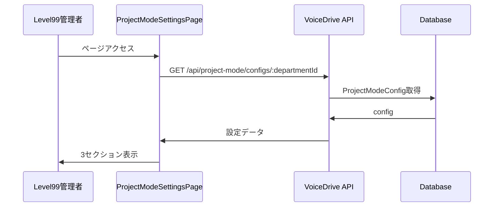
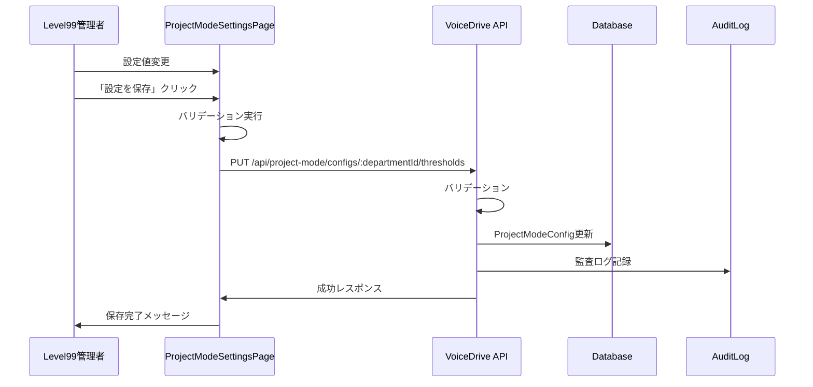
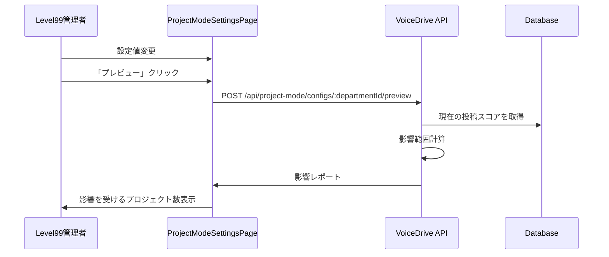

# ProjectModeSettingsPage - DB要件分析書

**文書番号**: PMS-ANALYSIS-2025-1026-001
**作成日**: 2025年10月26日
**作成者**: VoiceDriveチーム
**対象ページ**: ProjectModeSettingsPage
**重要度**: 🔴 最重要

---

## 📋 エグゼクティブサマリー

### 背景
- **ProjectModeSettingsPage** はプロジェクトモードの設定を管理する管理画面ページ
- アイデアボイスがプロジェクト化される際の各種設定を管理
- **Level 99専用の管理機能**（システム管理者のみアクセス可能）
- 3つのセクションで構成：
  1. **プロジェクト化閾値設定** - スコア閾値と緊急昇格ルール
  2. **チーム編成ルール設定** - チームサイズ、役割割り当て、専門性考慮
  3. **進捗管理設定** - マイルストーンと通知設定

### 実装状況
✅ **実装済み**:
- `ProjectModeConfig`テーブル - 部署別プロジェクトモード設定
- `ProjectModeGroupConfig`テーブル - 投票グループ別プロジェクトモード設定
- `OrganizationStructure`テーブル - 組織構造マスタ
- UIコンポーネント - 3セクションのタブ切り替え

⚠️ **部分的に実装**:
- 設定値はUIに静的表示のみ（保存機能未実装）
- APIエンドポイント未実装
- バリデーション未実装

---

## 🎯 ページ機能の完全分析

### 1. プロジェクト化閾値設定タブ

#### 表示項目（5項目）

**A. スコア閾値（3項目）**:
1. **部署プロジェクト化閾値**（デフォルト: 200点）
   - アイデアボイスが部署内でプロジェクト化される評価点
   - 部署内でチーム編成
2. **施設プロジェクト化閾値**（デフォルト: 400点）
   - 施設横断でプロジェクト化される評価点
   - 複数部署からチーム編成
3. **法人プロジェクト化閾値**（デフォルト: 800点）
   - 法人全体でプロジェクト化される評価点
   - 複数施設からチーム編成

**B. 緊急昇格設定（2項目）**:
4. **緊急昇格の有効/無効**（デフォルト: 有効）
   - 管理職が重要案件を即座にプロジェクト化できる機能
5. **最低必要レベル**（デフォルト: Level 8）
   - Level 8（部長）、Level 10（施設長）、Level 12（経営幹部）から選択

**データソース**:
```typescript
// ProjectModeConfig.metadata
{
  thresholds: {
    department: 200,
    facility: 400,
    corporate: 800
  },
  emergencyEscalation: {
    enabled: true,
    requiredLevel: 8
  }
}
```

---

### 2. チーム編成ルールタブ

#### 表示項目（11項目）

**A. チームサイズ設定（3項目）**:
1. **最小チームサイズ**（デフォルト: 3名）
2. **推奨チームサイズ**（デフォルト: 5名）
3. **最大チームサイズ**（デフォルト: 12名）

**B. 役割自動割り当て（3項目）**:
4. **プロジェクトリーダー**（Level 5以上から自動選出） - 有効
5. **サブリーダー**（Level 3以上から自動選出） - 有効
6. **記録係**（全レベルから自動選出） - 有効

**C. 専門性考慮設定（2項目）**:
7. **職種バランスを考慮**（デフォルト: 有効）
   - 多様な職種でチームを編成
8. **関連部署を優先**（デフォルト: 有効）
   - 議題に関連する部署のメンバーを優先

**データソース**:
```typescript
// ProjectModeConfig.teamFormationRules
{
  teamSize: {
    min: 3,
    recommended: 5,
    max: 12
  },
  roleAssignment: {
    autoAssignLeader: true,
    autoAssignSubLeader: true,
    autoAssignRecorder: true,
    leaderMinLevel: 5,
    subLeaderMinLevel: 3
  },
  diversityRules: {
    considerSpecialtyBalance: true,
    prioritizeRelatedDepartments: true
  }
}
```

---

### 3. 進捗管理設定タブ

#### 表示項目（8項目）

**A. デフォルトマイルストーン（4項目）**:
1. **キックオフ**（プロジェクト開始後 3日以内）
2. **計画書作成**（キックオフ後 7日以内）
3. **中間報告**（プロジェクト期間の50%時点）
4. **最終報告**（プロジェクト終了前 7日）

**B. 通知設定（4項目）**:
5. **期限前通知**（デフォルト: 3日前）
6. **遅延アラート**（デフォルト: 有効）
7. **週次進捗レポート**（デフォルト: 有効）
8. **レポート送信曜日**（デフォルト: 金曜日）

**データソース**:
```typescript
// ProjectModeConfig.metadata
{
  milestones: [
    { key: 'kickoff', label: 'キックオフ', daysAfterStart: 3, required: true },
    { key: 'plan', label: '計画書作成', daysAfterKickoff: 7, required: true },
    { key: 'midreport', label: '中間報告', percentagePoint: 50, required: false },
    { key: 'final', label: '最終報告', daysBeforeEnd: 7, required: true }
  ],
  notifications: {
    deadlineReminder: true,
    deadlineReminderDays: 3,
    delayAlert: true,
    weeklyReport: true,
    weeklyReportDay: 'friday'
  }
}
```

---

### 4. 共通機能

#### ボタン操作（3項目）:
1. **キャンセル** - 変更を破棄
2. **プレビュー** - 設定変更の影響をプレビュー
3. **設定を保存** - 変更を確定

---

## 📊 データ管理責任マトリクス

### カテゴリ1: プロジェクトモード設定

| データ項目 | VoiceDrive | 医療システム | 提供方法 | 備考 |
|-----------|-----------|-------------|---------|------|
| プロジェクト化閾値 | ✅ マスタ | ❌ | - | VoiceDrive管轄 |
| 緊急昇格設定 | ✅ マスタ | ❌ | - | VoiceDrive管轄 |
| チーム編成ルール | ✅ マスタ | ❌ | - | VoiceDrive管轄 |
| マイルストーン設定 | ✅ マスタ | ❌ | - | VoiceDrive管轄 |
| 通知設定 | ✅ マスタ | ❌ | - | VoiceDrive管轄 |

**方針**:
- プロジェクトモード設定は100%VoiceDrive管轄
- 医療システムからの提供不要
- VoiceDrive内部の業務ロジック設定

---

### カテゴリ2: 組織マスタデータ（参照のみ）

| データ項目 | VoiceDrive | 医療システム | 提供方法 | 備考 |
|-----------|-----------|-------------|---------|------|
| 部署マスタ | キャッシュ | ✅ マスタ | API | 医療システムから提供 |
| 施設マスタ | キャッシュ | ✅ マスタ | API | 医療システムから提供 |
| 職種マスタ | キャッシュ | ✅ マスタ | API | 医療システムから提供 |

**方針**:
- 組織マスタは医療システムが管理
- VoiceDriveは参照のみ（設定画面で部署選択に使用）

---

### カテゴリ3: 職員データ（参照のみ）

| データ項目 | VoiceDrive | 医療システム | 提供方法 | 備考 |
|-----------|-----------|-------------|---------|------|
| 職員権限レベル | キャッシュ | ✅ マスタ | API | 緊急昇格権限判定 |
| 職種カテゴリ | キャッシュ | ✅ マスタ | API | チーム編成の職種バランス判定 |
| 部署所属 | キャッシュ | ✅ マスタ | API | チーム編成の部署関連判定 |

**方針**:
- 職員データは医療システムが管理
- VoiceDriveは参照のみ（チーム編成アルゴリズムで使用）

---

## 🗄️ データベース設計分析

### 既存テーブル: ProjectModeConfig

```prisma
model ProjectModeConfig {
  id                      String                @id @default(cuid())
  departmentId            String                @unique
  projectUpgradeThreshold Int                   @default(400)
  teamFormationRules      Json
  milestoneRequired       Boolean               @default(true)
  progressReportFrequency String                @default("weekly")
  isActive                Boolean               @default(true)
  metadata                Json?
  createdAt               DateTime              @default(now())
  updatedAt               DateTime              @updatedAt
  department              OrganizationStructure @relation(...)
}
```

**フィールド分析**:

| フィールド | 用途 | 状態 | 備考 |
|----------|------|------|------|
| `departmentId` | 部署ID（一意制約） | ✅ 適切 | 部署別設定 |
| `projectUpgradeThreshold` | 部署プロジェクト化閾値 | ⚠️ 廃止予定 | metadata.thresholds.departmentに移行 |
| `teamFormationRules` | チーム編成ルール（JSON） | ✅ 適切 | TeamFormationRules型 |
| `milestoneRequired` | マイルストーン必須フラグ | ✅ 適切 | - |
| `progressReportFrequency` | 進捗レポート頻度 | ✅ 適切 | weekly/biweekly/monthly |
| `metadata` | その他設定（JSON） | ✅ 適切 | thresholds, milestones, notifications |

---

### 既存テーブル: ProjectModeGroupConfig

```prisma
model ProjectModeGroupConfig {
  id                      String      @id @default(cuid())
  groupId                 String      @unique
  projectUpgradeThreshold Int         @default(400)
  teamFormationRules      Json
  milestoneRequired       Boolean     @default(true)
  progressReportFrequency String      @default("weekly")
  isActive                Boolean     @default(true)
  metadata                Json?
  createdAt               DateTime    @default(now())
  updatedAt               DateTime    @updatedAt
  votingGroup             VotingGroup @relation(...)
}
```

**フィールド分析**:
- ProjectModeConfigと同じ構造
- 投票グループ単位の設定（小規模部門統合用）

---

### JSON型フィールドの詳細構造

#### `teamFormationRules` (Json)

```typescript
{
  teamSize: {
    min: 3,
    recommended: 5,
    max: 12
  },
  roleAssignment: {
    autoAssignLeader: true,
    autoAssignSubLeader: true,
    autoAssignRecorder: true,
    leaderMinLevel: 5,
    subLeaderMinLevel: 3
  },
  diversityRules: {
    considerSpecialtyBalance: true,
    prioritizeRelatedDepartments: true
  }
}
```

#### `metadata` (Json)

```typescript
{
  thresholds: {
    department: 200,
    facility: 400,
    corporate: 800
  },
  emergencyEscalation: {
    enabled: true,
    requiredLevel: 8
  },
  milestones: [
    { key: 'kickoff', label: 'キックオフ', daysAfterStart: 3, required: true },
    { key: 'plan', label: '計画書作成', daysAfterKickoff: 7, required: true },
    { key: 'midreport', label: '中間報告', percentagePoint: 50, required: false },
    { key: 'final', label: '最終報告', daysBeforeEnd: 7, required: true }
  ],
  notifications: {
    deadlineReminder: true,
    deadlineReminderDays: 3,
    delayAlert: true,
    weeklyReport: true,
    weeklyReportDay: 'friday'
  }
}
```

---

## 🔍 不足項目の洗い出し

### 1. フィールド不足（スキーマ修正不要）

✅ **現状で十分**:
- 必要なフィールドは全て存在
- JSON型で柔軟に拡張可能

---

### 2. API不足（新規実装必要）

⚠️ **API 1: プロジェクトモード設定取得**
```typescript
GET /api/project-mode/configs/:departmentId
Authorization: Bearer {jwt_token}

Response: {
  id: string;
  departmentId: string;
  departmentName: string;
  projectUpgradeThreshold: number;
  teamFormationRules: TeamFormationRules;
  milestoneRequired: boolean;
  progressReportFrequency: 'weekly' | 'biweekly' | 'monthly';
  isActive: boolean;
  metadata: ProjectModeMetadata;
  createdAt: string;
  updatedAt: string;
}
```

⚠️ **API 2: 閾値設定更新**
```typescript
PUT /api/project-mode/configs/:departmentId/thresholds
Authorization: Bearer {jwt_token}
Content-Type: application/json

Request: {
  thresholds: {
    department: 200,
    facility: 400,
    corporate: 800
  },
  emergencyEscalation: {
    enabled: true,
    requiredLevel: 8
  }
}

Response: {
  success: true,
  config: ProjectModeConfigResponse
}
```

⚠️ **API 3: チーム編成ルール更新**
```typescript
PUT /api/project-mode/configs/:departmentId/team-formation
Authorization: Bearer {jwt_token}
Content-Type: application/json

Request: {
  teamFormationRules: {
    teamSize: { min: 3, recommended: 5, max: 12 },
    roleAssignment: { ... },
    diversityRules: { ... }
  }
}

Response: {
  success: true,
  config: ProjectModeConfigResponse
}
```

⚠️ **API 4: 進捗管理設定更新**
```typescript
PUT /api/project-mode/configs/:departmentId/progress-management
Authorization: Bearer {jwt_token}
Content-Type: application/json

Request: {
  milestoneRequired: true,
  progressReportFrequency: 'weekly',
  milestones: [
    { key: 'kickoff', label: 'キックオフ', daysAfterStart: 3, required: true },
    ...
  ],
  notifications: {
    deadlineReminder: true,
    deadlineReminderDays: 3,
    delayAlert: true,
    weeklyReport: true,
    weeklyReportDay: 'friday'
  }
}

Response: {
  success: true,
  config: ProjectModeConfigResponse
}
```

⚠️ **API 5: 全設定一括更新**
```typescript
PUT /api/project-mode/configs/:departmentId
Authorization: Bearer {jwt_token}
Content-Type: application/json

Request: {
  teamFormationRules: TeamFormationRules,
  milestoneRequired: boolean,
  progressReportFrequency: 'weekly' | 'biweekly' | 'monthly',
  metadata: ProjectModeMetadata
}

Response: {
  success: true,
  config: ProjectModeConfigResponse
}
```

⚠️ **API 6: 設定リスト取得（管理画面用）**
```typescript
GET /api/project-mode/configs
Authorization: Bearer {jwt_token}
Query: ?facilityCode=obara-hospital&isActive=true

Response: {
  configs: ProjectModeConfigResponse[];
  total: number;
}
```

⚠️ **API 7: 設定プレビュー（影響範囲確認）**
```typescript
POST /api/project-mode/configs/:departmentId/preview
Authorization: Bearer {jwt_token}
Content-Type: application/json

Request: {
  thresholds: { department: 150, facility: 350, corporate: 750 }
}

Response: {
  affectedProjects: number; // 影響を受けるプロジェクト数
  upgradedProjects: number; // 新たにプロジェクト化される案件数
  downgradedProjects: number; // プロジェクトから除外される案件数
  details: {
    postId: string;
    currentScore: number;
    currentLevel: string;
    newLevel: string;
  }[]
}
```

---

### 3. バリデーション不足（新規実装必要）

⚠️ **バリデーションルール**:

1. **閾値設定**:
   - `department` <= `facility` <= `corporate`
   - 全て > 0

2. **チームサイズ**:
   - `min` <= `recommended` <= `max`
   - `min` >= 2, `max` <= 30

3. **権限レベル**:
   - `leaderMinLevel` >= 3, <= 25
   - `subLeaderMinLevel` >= 1, <= 25
   - `emergencyEscalation.requiredLevel` >= 5, <= 25

4. **通知設定**:
   - `deadlineReminderDays` >= 1, <= 14

---

### 4. 監査ログ不足（新規実装必要）

⚠️ **AuditLogへの記録**:

```typescript
// 設定変更時のログ記録
{
  userId: 'user-id',
  action: 'update_project_mode_config',
  targetType: 'ProjectModeConfig',
  targetId: 'config-id',
  changes: {
    before: { ... },
    after: { ... }
  },
  metadata: {
    departmentId: 'DEPT-001',
    section: 'thresholds' | 'teamFormation' | 'progressManagement'
  }
}
```

---

## 🔄 実装フロー

### フロー1: 設定取得と表示



---

### フロー2: 設定変更と保存



---

### フロー3: 設定プレビュー



---

## ✅ 実装チェックリスト

### データベース層
- [x] ProjectModeConfigテーブル存在確認
- [x] ProjectModeGroupConfigテーブル存在確認
- [ ] デフォルトデータのシード作成
- [ ] インデックス最適化確認

---

### API層（VoiceDrive側）
- [ ] GET /api/project-mode/configs/:departmentId
- [ ] GET /api/project-mode/configs（リスト取得）
- [ ] PUT /api/project-mode/configs/:departmentId/thresholds
- [ ] PUT /api/project-mode/configs/:departmentId/team-formation
- [ ] PUT /api/project-mode/configs/:departmentId/progress-management
- [ ] PUT /api/project-mode/configs/:departmentId（一括更新）
- [ ] POST /api/project-mode/configs/:departmentId/preview
- [ ] バリデーションミドルウェア実装
- [ ] 権限チェック（Level 99のみ）
- [ ] エラーハンドリング実装

---

### UI層（VoiceDrive側）
- [x] ProjectModeSettingsPage基本レイアウト
- [x] 3セクションのタブ切り替え
- [x] 閾値設定UIコンポーネント
- [x] チーム編成ルールUIコンポーネント
- [x] 進捗管理設定UIコンポーネント
- [ ] API連携（取得・保存）
- [ ] フロントエンドバリデーション
- [ ] プレビュー機能実装
- [ ] エラーメッセージ表示
- [ ] 保存成功メッセージ表示
- [ ] ローディング状態表示

---

### ビジネスロジック層
- [ ] ProjectModeConfigService作成
- [ ] 設定取得ロジック
- [ ] 設定更新ロジック
- [ ] 影響範囲計算ロジック（プレビュー用）
- [ ] バリデーションロジック
- [ ] 監査ログ記録ロジック

---

### テスト
- [ ] ユニットテスト（バリデーション）
- [ ] APIテスト（E2E）
- [ ] UIテスト（Playwright）
- [ ] 統合テスト

---

### ドキュメント
- [x] DB要件分析書作成
- [ ] API仕様書作成
- [ ] ユーザーマニュアル作成
- [ ] 管理者ガイド作成

---

## 🎯 成功指標（KPI）

| 指標 | 目標値 | 測定方法 |
|------|--------|---------|
| 設定変更所要時間 | <3分 | 操作ログ分析 |
| 設定変更エラー率 | <1% | エラーログ分析 |
| プレビュー機能利用率 | >80% | 機能利用ログ |
| 設定変更後の問題発生率 | 0件/月 | インシデントレポート |

---

## 📞 連絡先・次のステップ

### 次のステップ
1. **Phase 1**: API実装（1週間）
   - 7つのAPIエンドポイント実装
   - バリデーション実装
   - 監査ログ実装

2. **Phase 2**: UI統合（3日）
   - API連携実装
   - エラーハンドリング
   - ローディング状態

3. **Phase 3**: プレビュー機能（2日）
   - 影響範囲計算ロジック
   - プレビューUI実装

4. **Phase 4**: テスト・デプロイ（2日）
   - 統合テスト
   - ドキュメント整備
   - 本番デプロイ

---

**文書終了**

最終更新: 2025年10月26日
バージョン: 1.0
承認: 未承認（レビュー待ち）
