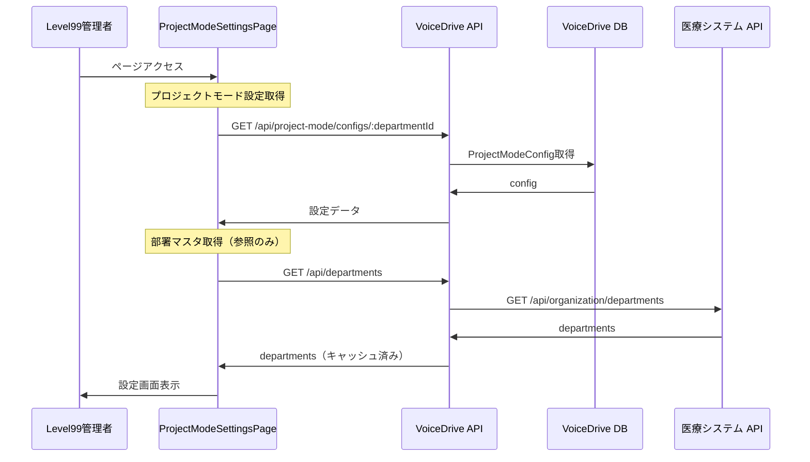
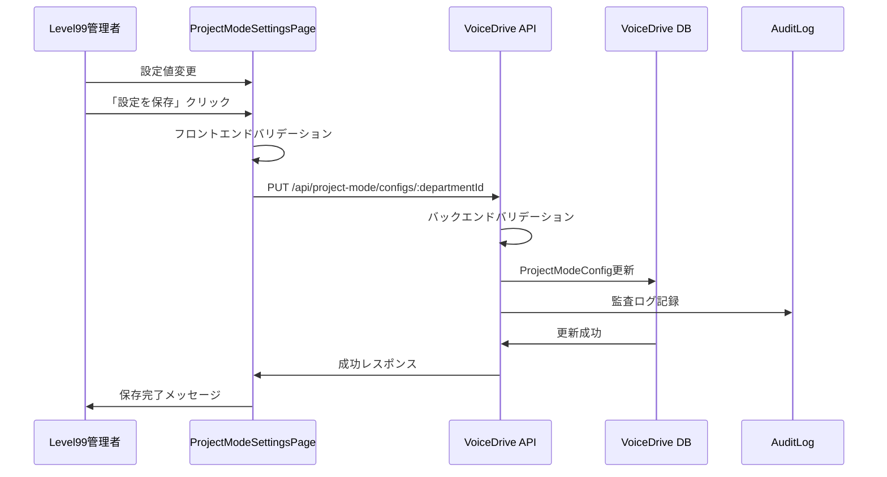

# ProjectModeSettingsPage - 暫定マスターリスト

**文書番号**: PMS-MASTER-2025-1026-001
**作成日**: 2025年10月26日
**作成者**: VoiceDriveチーム
**対象ページ**: ProjectModeSettingsPage
**目的**: VoiceDrive/医療システム間のデータマスター責任を明確化

---

## 📋 エグゼクティブサマリー

### マスター責任の基本原則

**ProjectModeSettingsPageの全データはVoiceDrive単独管理**

- ✅ **VoiceDriveがマスタ**: プロジェクトモード設定の全項目
- ❌ **医療システム不要**: 医療システムからのデータ提供なし
- 📊 **参照のみ**: 医療システムから組織マスタ・職員データを参照（既存API利用）

---

## 🎯 データ項目別マスター責任一覧

### セクション1: プロジェクト化閾値設定

| # | データ項目 | VoiceDrive | 医療システム | 備考 |
|---|-----------|-----------|-------------|------|
| 1 | 部署プロジェクト化閾値 | ✅ マスタ | ❌ | VoiceDrive管轄 |
| 2 | 施設プロジェクト化閾値 | ✅ マスタ | ❌ | VoiceDrive管轄 |
| 3 | 法人プロジェクト化閾値 | ✅ マスタ | ❌ | VoiceDrive管轄 |
| 4 | 緊急昇格有効化フラグ | ✅ マスタ | ❌ | VoiceDrive管轄 |
| 5 | 緊急昇格最低権限レベル | ✅ マスタ | ❌ | VoiceDrive管轄 |

**合計**: 5項目（全てVoiceDriveマスタ）

---

### セクション2: チーム編成ルール設定

| # | データ項目 | VoiceDrive | 医療システム | 備考 |
|---|-----------|-----------|-------------|------|
| 6 | 最小チームサイズ | ✅ マスタ | ❌ | VoiceDrive管轄 |
| 7 | 推奨チームサイズ | ✅ マスタ | ❌ | VoiceDrive管轄 |
| 8 | 最大チームサイズ | ✅ マスタ | ❌ | VoiceDrive管轄 |
| 9 | リーダー自動割当フラグ | ✅ マスタ | ❌ | VoiceDrive管轄 |
| 10 | サブリーダー自動割当フラグ | ✅ マスタ | ❌ | VoiceDrive管轄 |
| 11 | 記録係自動割当フラグ | ✅ マスタ | ❌ | VoiceDrive管轄 |
| 12 | リーダー最低レベル | ✅ マスタ | ❌ | VoiceDrive管轄 |
| 13 | サブリーダー最低レベル | ✅ マスタ | ❌ | VoiceDrive管轄 |
| 14 | 職種バランス考慮フラグ | ✅ マスタ | ❌ | VoiceDrive管轄 |
| 15 | 関連部署優先フラグ | ✅ マスタ | ❌ | VoiceDrive管轄 |

**合計**: 10項目（全てVoiceDriveマスタ）

---

### セクション3: 進捗管理設定

| # | データ項目 | VoiceDrive | 医療システム | 備考 |
|---|-----------|-----------|-------------|------|
| 16 | マイルストーン必須フラグ | ✅ マスタ | ❌ | VoiceDrive管轄 |
| 17 | 進捗レポート頻度 | ✅ マスタ | ❌ | VoiceDrive管轄 |
| 18 | キックオフ期限 | ✅ マスタ | ❌ | VoiceDrive管轄 |
| 19 | 計画書作成期限 | ✅ マスタ | ❌ | VoiceDrive管轄 |
| 20 | 中間報告タイミング | ✅ マスタ | ❌ | VoiceDrive管轄 |
| 21 | 最終報告期限 | ✅ マスタ | ❌ | VoiceDrive管轄 |
| 22 | 期限前通知有効化 | ✅ マスタ | ❌ | VoiceDrive管轄 |
| 23 | 期限前通知日数 | ✅ マスタ | ❌ | VoiceDrive管轄 |
| 24 | 遅延アラート有効化 | ✅ マスタ | ❌ | VoiceDrive管轄 |
| 25 | 週次レポート有効化 | ✅ マスタ | ❌ | VoiceDrive管轄 |
| 26 | レポート送信曜日 | ✅ マスタ | ❌ | VoiceDrive管轄 |

**合計**: 11項目（全てVoiceDriveマスタ）

---

### セクション4: 参照データ（マスタではない）

| # | データ項目 | VoiceDrive | 医療システム | 提供方法 | 備考 |
|---|-----------|-----------|-------------|---------|------|
| 27 | 部署マスタ | キャッシュ | ✅ マスタ | API | 設定対象部署選択用 |
| 28 | 施設マスタ | キャッシュ | ✅ マスタ | API | 施設フィルタ用 |
| 29 | 職種マスタ | キャッシュ | ✅ マスタ | API | チーム編成アルゴリズム用 |
| 30 | 職員権限レベル | キャッシュ | ✅ マスタ | API | 緊急昇格権限判定用 |

**合計**: 4項目（全て医療システムマスタ、VoiceDriveはキャッシュ参照のみ）

---

## 📊 マスター責任集計

| カテゴリ | VoiceDriveマスタ | 医療システムマスタ | 合計 |
|---------|----------------|-----------------|------|
| プロジェクト化閾値設定 | 5 | 0 | 5 |
| チーム編成ルール設定 | 10 | 0 | 10 |
| 進捗管理設定 | 11 | 0 | 11 |
| 参照データ（非マスタ） | 0 | 4 | 4 |
| **合計** | **26** | **4** | **30** |

---

## 🗄️ テーブル別マスター責任

### VoiceDrive管轄テーブル

#### 1. ProjectModeConfig

| フィールド | マスタ責任 | 備考 |
|----------|----------|------|
| id | ✅ VoiceDrive | 設定ID |
| departmentId | ✅ VoiceDrive | 部署ID（医療システムから取得したIDを使用） |
| projectUpgradeThreshold | ✅ VoiceDrive | 部署プロジェクト化閾値（後方互換性） |
| teamFormationRules | ✅ VoiceDrive | チーム編成ルール（JSON） |
| milestoneRequired | ✅ VoiceDrive | マイルストーン必須フラグ |
| progressReportFrequency | ✅ VoiceDrive | 進捗レポート頻度 |
| isActive | ✅ VoiceDrive | 有効/無効 |
| metadata | ✅ VoiceDrive | その他設定（thresholds, milestones, notifications） |
| createdAt | ✅ VoiceDrive | 作成日時 |
| updatedAt | ✅ VoiceDrive | 更新日時 |

**結論**: 全フィールドVoiceDrive単独管理

---

#### 2. ProjectModeGroupConfig

| フィールド | マスタ責任 | 備考 |
|----------|----------|------|
| id | ✅ VoiceDrive | 設定ID |
| groupId | ✅ VoiceDrive | 投票グループID |
| projectUpgradeThreshold | ✅ VoiceDrive | プロジェクト化閾値 |
| teamFormationRules | ✅ VoiceDrive | チーム編成ルール（JSON） |
| milestoneRequired | ✅ VoiceDrive | マイルストーン必須フラグ |
| progressReportFrequency | ✅ VoiceDrive | 進捗レポート頻度 |
| isActive | ✅ VoiceDrive | 有効/無効 |
| metadata | ✅ VoiceDrive | その他設定 |
| createdAt | ✅ VoiceDrive | 作成日時 |
| updatedAt | ✅ VoiceDrive | 更新日時 |

**結論**: 全フィールドVoiceDrive単独管理

---

### 医療システム管轄テーブル（参照のみ）

#### 1. OrganizationStructure（部署マスタ）

| フィールド | マスタ責任 | VoiceDrive利用方法 |
|----------|----------|------------------|
| departmentId | ✅ 医療システム | 設定対象部署の選択に使用 |
| departmentName | ✅ 医療システム | UI表示用 |
| facilityCode | ✅ 医療システム | 施設フィルタ用 |
| departmentType | ✅ 医療システム | 部署種別フィルタ用 |

**VoiceDriveの利用**: API経由で取得し、キャッシュ（Read Only）

---

#### 2. User（職員マスタ）

| フィールド | マスタ責任 | VoiceDrive利用方法 |
|----------|----------|------------------|
| permissionLevel | ✅ 医療システム | 緊急昇格権限判定に使用 |
| professionCategory | ✅ 医療システム | チーム編成の職種バランス判定に使用 |
| department | ✅ 医療システム | チーム編成の部署関連判定に使用 |

**VoiceDriveの利用**: API経由で取得し、キャッシュ（Read Only）

---

## 🔄 データフロー図

### フロー1: 設定画面表示時



---

### フロー2: 設定変更保存時



**重要**: 医療システムへの通知は不要（VoiceDrive内部設定のため）

---

## 📝 医療システムとの連携

### 医療システムに必要な対応

✅ **対応不要**:
- ProjectModeSettingsPageは100%VoiceDrive内部の設定管理
- 医療システムからの新規データ提供は不要
- 既存API（組織マスタ、職員マスタ）をVoiceDriveが参照するのみ

---

### VoiceDriveが医療システムから利用する既存API

| API | 用途 | 頻度 |
|-----|------|------|
| GET /api/organization/departments | 部署マスタ取得 | 画面表示時（キャッシュ利用） |
| GET /api/organization/facilities | 施設マスタ取得 | 画面表示時（キャッシュ利用） |
| GET /api/employees | 職員マスタ取得 | チーム編成時（キャッシュ利用） |

**すべて既存APIで対応可能、新規実装不要**

---

## ✅ 実装チェックリスト（マスター責任観点）

### VoiceDrive側の実装

#### データベース層
- [x] ProjectModeConfigテーブル（既存）
- [x] ProjectModeGroupConfigテーブル（既存）
- [ ] デフォルト設定値のシード作成
- [ ] インデックス最適化

#### API層
- [ ] GET /api/project-mode/configs/:departmentId - VoiceDriveマスタデータ取得
- [ ] PUT /api/project-mode/configs/:departmentId/thresholds - VoiceDriveマスタ更新
- [ ] PUT /api/project-mode/configs/:departmentId/team-formation - VoiceDriveマスタ更新
- [ ] PUT /api/project-mode/configs/:departmentId/progress-management - VoiceDriveマスタ更新
- [ ] 医療システムAPI呼び出し（部署マスタ参照） - 既存API利用

#### ビジネスロジック層
- [ ] ProjectModeConfigService - CRUD操作
- [ ] バリデーションロジック - データ整合性チェック
- [ ] 監査ログ記録 - 設定変更履歴

#### UI層
- [x] 設定画面レイアウト（既存）
- [ ] API連携実装
- [ ] バリデーション実装
- [ ] エラーハンドリング

---

### 医療システム側の実装

✅ **実装不要**:
- 新規API不要
- 新規テーブル不要
- 既存APIの変更不要

---

## 🎯 データ品質保証

### VoiceDriveの責任

| 項目 | 責任 |
|------|------|
| データ整合性 | ✅ VoiceDrive | 閾値の大小関係、チームサイズの範囲チェック |
| データ永続化 | ✅ VoiceDrive | ProjectModeConfigテーブルへの保存 |
| データバックアップ | ✅ VoiceDrive | DB定期バックアップ |
| 変更履歴管理 | ✅ VoiceDrive | AuditLogへの記録 |
| アクセス制御 | ✅ VoiceDrive | Level 99のみアクセス許可 |

---

### データ同期

⚠️ **同期不要**:
- ProjectModeSettingsPageのデータは医療システムと同期不要
- VoiceDrive単独で完結

---

## 📞 連絡先

### VoiceDriveチーム
- 担当: システム開発チーム
- Slack: #voicedrive-dev
- 実装優先度: 中（他の機能に比べて独立性が高い）

### 医療システムチーム
- **連携不要**: ProjectModeSettingsPageは医療システム連携不要

---

## 📈 今後の拡張可能性

### Phase 2以降の検討事項

1. **医療システムへの統計提供**（将来的）:
   ```typescript
   // VoiceDrive → 医療システム
   GET /api/voicedrive/project-mode/statistics
   Response: {
     totalProjects: 245,
     byThreshold: {
       department: 120,
       facility: 85,
       corporate: 40
     },
     avgTeamSize: 5.3,
     completionRate: 87.5
   }
   ```

2. **部署別設定テンプレート**:
   - 医療システム側で部署タイプマスタを提供
   - VoiceDriveで部署タイプ別のデフォルト設定を用意

3. **設定変更通知**:
   - 医療システムに設定変更をWebhook通知（参考情報として）

---

**文書終了**

最終更新: 2025年10月26日
バージョン: 1.0
承認: 未承認（レビュー待ち）

---

## 📋 サマリー表

| 項目 | 値 |
|------|-----|
| 総データ項目数 | 30項目 |
| VoiceDriveマスタ | 26項目（87%） |
| 医療システムマスタ | 4項目（13%、参照のみ） |
| 必要な新規API | 7個（全てVoiceDrive側） |
| 医療システムへの依頼事項 | なし |
| 独立性 | 完全独立（医療システム連携不要） |
