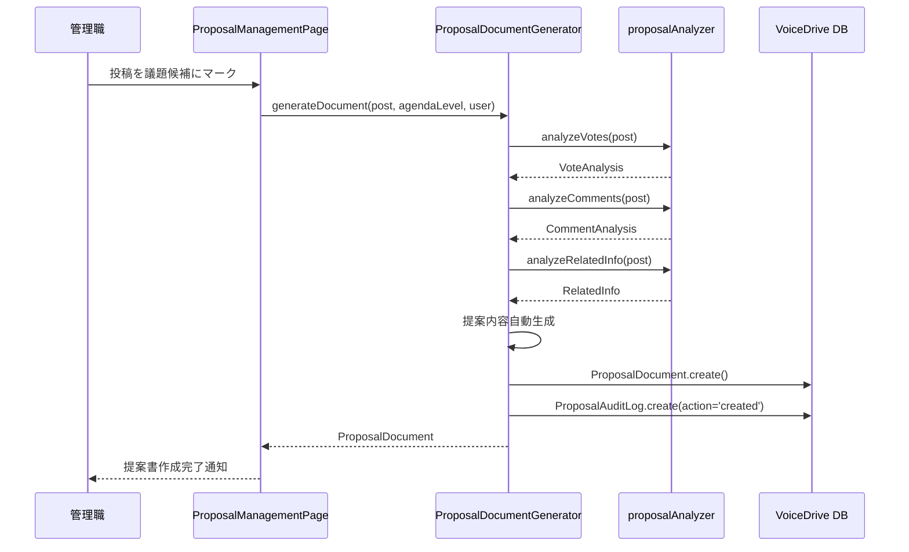
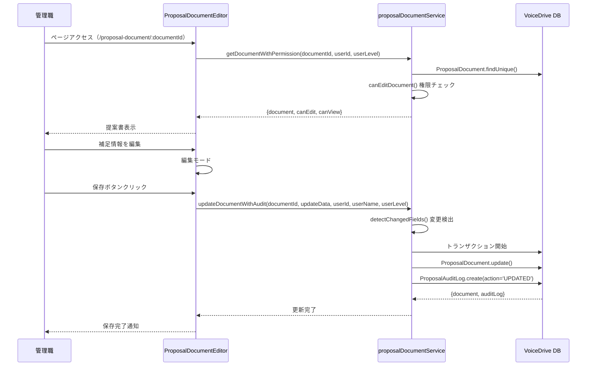

# ProposalDocumentEditor (/proposal-document/:documentId) DB要件分析

**文書番号**: DB-REQ-2025-1026-004
**作成日**: 2025年10月26日
**対象ページ**: https://voicedrive-v100.vercel.app/proposal-document/:documentId ProposalDocumentEditor
**参照文書**:
- [データ管理責任分界点定義書_20251008.md](./データ管理責任分界点定義書_20251008.md)
- [PersonalStation_DB要件分析_20251008.md](./PersonalStation_DB要件分析_20251008.md)

---

## 📋 分析サマリー

### 結論
ProposalDocumentEditorは**VoiceDrive独自の議題提案書管理機能**であり、**全機能が完全実装済み**です。

### 🎉 実装状況
| 項目 | 状態 | 詳細 |
|------|------|------|
| **実装完了度** | ✅ **100%完了** | 全機能実装済み |
| **データベーススキーマ** | ✅ **完全** | 全必要テーブル・フィールド存在 |
| **医療システムAPI連携** | ❌ **不要** | VoiceDrive 100%管理 |
| **サービス層** | ✅ **完了** | 5つのサービス実装済み |
| **権限管理** | ✅ **完了** | 階層的権限チェック実装済み |
| **監査ログ** | ✅ **完了** | 完全な透明性ログ |

---

## 🎯 データ管理責任分界点

### VoiceDrive側の責任（100%）
- ✅ 議題提案書の作成・編集・提出
- ✅ 投票データの分析・集計
- ✅ コメント分析・要約生成
- ✅ 管理職による補足情報
- ✅ 委員会提出リクエスト管理
- ✅ 透明性ログ（監査ログ）記録
- ✅ 権限ベースの編集制御
- ✅ 提案書ステータス管理

### 医療システム側の責任
- ❌ **データ管理なし** - ProposalDocumentは100%VoiceDrive管轄
- ⚪ **参考**: 委員会マスタデータは将来的に医療システムから取得する可能性あり

---

## 📊 ページ機能分析

### 1. URL・ルーティング
```typescript
// ページURL
https://voicedrive-v100.vercel.app/proposal-document/:documentId

// コンポーネント
src/pages/ProposalDocumentEditor.tsx

// URLパラメータ
:documentId - 議題提案書ID（例: doc-post-123-1698765432000）
```

---

### 2. 画面構成

#### 2.1 ヘッダーセクション
```typescript
interface ProposalDocumentHeader {
  // 基本情報
  title: string;                        // 提案書タイトル
  agendaLevel: AgendaLevel;            // 議題レベル
  status: ProposalDocumentStatus;      // ステータス
  targetCommittee?: string;            // 提出先委員会
  createdDate: Date;                   // 作成日
  createdBy: User;                     // 作成者
}

type AgendaLevel =
  | 'PENDING'           // 投票中
  | 'DEPT_REVIEW'       // 部署レビュー
  | 'DEPT_AGENDA'       // 部署議題
  | 'FACILITY_AGENDA'   // 施設議題
  | 'CORP_REVIEW'       // 法人レビュー
  | 'CORP_AGENDA';      // 法人議題

type ProposalDocumentStatus =
  | 'draft'             // 下書き
  | 'under_review'      // レビュー中
  | 'ready'             // 提出準備完了
  | 'submitted'         // 委員会提出済み
  | 'approved'          // 承認
  | 'rejected';         // 却下
```

---

#### 2.2 提案内容セクション（自動生成）
```typescript
interface ProposalContent {
  summary: string;              // 要約
  background: string;           // 背景・経緯
  objectives: string;           // 目的
  expectedEffects: string;      // 期待される効果
  concerns: string;             // 懸念点
  counterMeasures: string;      // 対応策
}
```

**データソース**:
- ProposalDocumentGenerator.generateDocument()で自動生成
- 投稿データ（Post）と投票・コメント分析に基づく

---

#### 2.3 管理職による補足セクション（編集可能）
```typescript
interface ManagerInput {
  managerNotes?: string;                    // 補足説明
  additionalContext?: string;               // 追加の文脈
  recommendationLevel?: RecommendationLevel; // 推奨レベル
}

type RecommendationLevel =
  | 'strongly_recommend'    // 強く推奨
  | 'recommend'            // 推奨
  | 'neutral'              // 中立
  | 'not_recommend';       // 推奨しない
```

**編集権限**:
- Level 9+（課長・部長）: 自部署の提案書
- Level 11（施設長）: 自施設の提案書
- Level 12-17（経営層）: 全ての提案書
- Level 18（理事長）: 全ての提案書

---

#### 2.4 投票データサイドバー
```typescript
interface VoteAnalysis {
  totalVotes: number;              // 総投票数
  supportRate: number;             // 支持率（%）
  strongSupportRate: number;       // 強い支持率（%）
  oppositionRate: number;          // 反対率（%）
  neutralRate: number;             // 中立率（%）

  // 部署別分析
  byDepartment?: {
    department: string;
    votes: Record<VoteOption, number>;
    supportRate: number;
  }[];

  // 職位別分析
  byPosition?: {
    positionLevel: number;
    positionName: string;
    votes: Record<VoteOption, number>;
    supportRate: number;
  }[];

  // ステークホルダー別分析
  byStakeholder?: {
    category: string;
    votes: Record<VoteOption, number>;
    supportRate: number;
  }[];
}
```

---

#### 2.5 コメント統計サイドバー
```typescript
interface CommentAnalysis {
  totalComments: number;           // 総コメント数
  supportComments: number;         // 賛成意見数
  concernComments: number;         // 懸念点数
  proposalComments: number;        // 建設的提案数

  // 賛成意見の要約
  supportSummary: string[];

  // 懸念点の要約
  concernSummary: string[];

  // 建設的提案
  constructiveProposals: string[];

  // 主要なコメント
  keyComments: {
    content: string;
    author: string;                // 匿名化された表示名
    type: 'support' | 'concern' | 'proposal';
    likes: number;
  }[];
}
```

---

#### 2.6 透明性ログサイドバー
```typescript
interface ProposalAuditLog {
  id: string;
  timestamp: Date;
  userId: string;
  userName: string;
  userLevel: number;
  action: AuditAction;
  details?: string;
  changedFields?: string[];
}

type AuditAction =
  | 'created'               // 作成
  | 'edited'                // 編集
  | 'reviewed'              // レビュー
  | 'submitted'             // 提出
  | 'approved'              // 承認
  | 'rejected'              // 却下
  | 'marked_candidate'      // 候補マーク
  | 'unmarked_candidate';   // 候補マーク解除
```

---

### 3. アクション機能

#### 3.1 保存（編集中）
```typescript
// 機能: 管理職による補足を保存
// 権限: Level 9+ (編集権限チェック)
// 処理: proposalDocumentGenerator.updateDocument()
// 監査ログ: action='edited'
```

#### 3.2 提出準備完了
```typescript
// 機能: ステータスを'ready'に変更
// 権限: 編集権限があれば可能
// 処理: proposalDocumentGenerator.markAsReady()
// 監査ログ: action='edited'
```

#### 3.3 委員会提出リクエスト
```typescript
// 機能: 委員会提出リクエストを作成
// 権限: Level 7+ (FACILITY_HEAD以上)
// 処理: committeeSubmissionService.createSubmissionRequest()
// 関連テーブル: CommitteeSubmissionRequest
```

---

## 💾 データベース実装状況

### 1. ProposalDocumentテーブル（完全実装済み）

**ファイルパス**: `prisma/schema.prisma` (lines 2417-2455)

```prisma
model ProposalDocument {
  // === 基本情報 ===
  id                  String    @id @default(cuid())
  postId              String    @map("post_id")
  title               String
  agendaLevel         String    @map("agenda_level")
  createdById         String    @map("created_by_id")
  status              String    @default("draft")

  // === 提案内容（自動生成） ===
  summary             String
  background          String
  objectives          String
  expectedEffects     String    @map("expected_effects")
  concerns            String
  counterMeasures     String    @map("counter_measures")

  // === データ分析（JSON） ===
  voteAnalysis        Json      @map("vote_analysis")
  commentAnalysis     Json      @map("comment_analysis")
  relatedInfo         Json?     @map("related_info")

  // === 管理職による追記 ===
  managerNotes        String?   @map("manager_notes")
  additionalContext   String?   @map("additional_context")
  recommendationLevel String?   @map("recommendation_level")

  // === 委員会提出情報 ===
  targetCommittee     String?   @map("target_committee")
  submittedDate       DateTime? @map("submitted_date")
  submittedById       String?   @map("submitted_by_id")
  committeeDecision   Json?     @map("committee_decision")

  // === メタデータ ===
  createdAt           DateTime  @default(now()) @map("created_at")
  updatedAt           DateTime  @updatedAt @map("updated_at")
  lastModifiedDate    DateTime  @updatedAt @map("last_modified_date")

  // === Relations ===
  submissionRequests  CommitteeSubmissionRequest[]
  auditLogs           ProposalAuditLog[]
  submittedBy         User?     @relation("ProposalSubmitter", fields: [submittedById], references: [id])
  createdBy           User      @relation("ProposalCreator", fields: [createdById], references: [id])
  post                Post      @relation(fields: [postId], references: [id], onDelete: Cascade)

  // === Indexes ===
  @@index([postId])
  @@index([createdById])
  @@index([status])
  @@index([agendaLevel])
  @@index([targetCommittee])
  @@map("proposal_documents")
}
```

**評価**: ✅ **不足フィールドなし**

---

### 2. ProposalAuditLogテーブル（完全実装済み）

**ファイルパス**: `prisma/schema.prisma` (lines 2483-2499)

```prisma
model ProposalAuditLog {
  id            String    @id @default(cuid())
  documentId    String    @map("document_id")
  userId        String    @map("user_id")
  userName      String    @map("user_name")
  userLevel     Decimal   @map("user_level")
  action        String
  details       String?
  changedFields Json?     @map("changed_fields")
  timestamp     DateTime  @default(now())

  document      ProposalDocument @relation(fields: [documentId], references: [id], onDelete: Cascade)

  @@index([documentId])
  @@index([userId])
  @@index([timestamp])
  @@map("proposal_audit_logs")
}
```

**評価**: ✅ **完全実装済み**

**用途**:
- 提案書の全ての変更を記録
- 透明性ログとしてUI表示
- 誰が・いつ・何を変更したかを追跡

---

### 3. CommitteeSubmissionRequestテーブル（完全実装済み）

**ファイルパス**: `prisma/schema.prisma` (lines 2458-2480)

```prisma
model CommitteeSubmissionRequest {
  id              String    @id @default(cuid())
  documentId      String    @map("document_id")
  requestedById   String    @map("requested_by_id")
  requestedDate   DateTime  @default(now()) @map("requested_date")
  targetCommittee String    @map("target_committee")
  status          String    @default("pending")  // pending/approved/rejected
  reviewedById    String?   @map("reviewed_by_id")
  reviewedDate    DateTime? @map("reviewed_date")
  reviewNotes     String?   @map("review_notes")
  createdAt       DateTime  @default(now()) @map("created_at")
  updatedAt       DateTime  @updatedAt @map("updated_at")

  reviewedBy      User?     @relation("SubmissionApprover", fields: [reviewedById], references: [id])
  requestedBy     User      @relation("SubmissionRequester", fields: [requestedById], references: [id])
  document        ProposalDocument @relation(fields: [documentId], references: [id], onDelete: Cascade)

  @@index([documentId])
  @@index([requestedById])
  @@index([reviewedById])
  @@index([status])
  @@index([targetCommittee])
  @@map("committee_submission_requests")
}
```

**評価**: ✅ **完全実装済み**

**用途**:
- Level 7+が委員会提出リクエストを作成
- Level 12+がリクエストを承認/却下
- 提出リクエストの履歴管理

---

### 4. Postテーブル（関連）
**評価**: ✅ **既存テーブル（参照のみ）**

**関連性**:
- ProposalDocument.postId → Post.id
- 提案書の元となる投稿データ
- 投票・コメントデータはPostから取得

---

### 5. Userテーブル（関連）
**評価**: ✅ **既存テーブル（参照のみ）**

**関連性**:
- ProposalDocument.createdById → User.id
- ProposalDocument.submittedById → User.id
- CommitteeSubmissionRequest.requestedById → User.id
- CommitteeSubmissionRequest.reviewedById → User.id
- 権限レベル（User.permissionLevel）による編集制御

---

## 🔗 サービス層実装状況

### 実装済みサービス一覧（5サービス）

#### 1. ProposalDocumentGenerator ✅
**ファイルパス**: `src/services/ProposalDocumentGenerator.ts` (333行)

**主要メソッド**:
```typescript
// 議題提案書の自動生成
generateDocument(post: Post, agendaLevel: AgendaLevel, createdBy: User): ProposalDocument

// 議題提案書の取得
getDocument(documentId: string): ProposalDocument | undefined

// 投稿IDから検索
findDocumentByPostId(postId: string): ProposalDocument | undefined

// 議題提案書の更新
updateDocument(documentId: string, updates: Partial<ProposalDocument>, updatedBy: User): ProposalDocument | undefined

// ステータス更新
updateStatus(documentId: string, status: ProposalDocumentStatus, user: User): ProposalDocument | undefined

// 管理職による補足追加
addManagerNotes(documentId: string, notes: string, user: User): ProposalDocument | undefined

// 推奨レベル設定
setRecommendationLevel(documentId: string, level: RecommendationLevel, user: User): ProposalDocument | undefined

// 委員会に提出
submitToCommittee(documentId: string, targetCommittee: string, submittedBy: User): ProposalDocument | undefined

// レビュー完了
markAsReviewed(documentId: string, reviewer: User, notes?: string): ProposalDocument | undefined

// 提出準備完了
markAsReady(documentId: string, user: User): ProposalDocument | undefined

// 一覧取得（フィルター付き）
getAllDocuments(): ProposalDocument[]
getDocumentsByUser(userId: string): ProposalDocument[]
getDocumentsByAgendaLevel(level: AgendaLevel): ProposalDocument[]
getDocumentsByStatus(status: ProposalDocumentStatus): ProposalDocument[]
```

---

#### 2. proposalDocumentService ✅
**ファイルパス**: `src/services/proposalDocumentService.ts` (456行)

**主要メソッド**:
```typescript
// 権限チェック
canEditDocument(userId: string, userLevel: number, document: ProposalDocument): Promise<boolean>
canViewDocument(userLevel: number): boolean

// 変更フィールド検出
detectChangedFields(oldDocument: ProposalDocument, newData: Partial<ProposalDocument>): {
  changedFields: string[];
  previousValues: Record<string, any>;
  newValues: Record<string, any>;
}

// 監査ログ作成
createAuditLog(data: AuditLogData): Promise<ProposalAuditLog>
getAuditLogs(documentId: string, limit?: number, offset?: number): Promise<{
  auditLogs: ProposalAuditLog[];
  total: number;
}>

// 提案書操作（権限チェック付き）
getDocumentWithPermission(documentId: string, userId: string, userLevel: number): Promise<{
  document: ProposalDocument;
  canEdit: boolean;
  canView: boolean;
}>

// 提案書更新（監査ログ付き）
updateDocumentWithAudit(
  documentId: string,
  updateData: Partial<ProposalDocument>,
  userId: string,
  userName: string,
  userLevel: number,
  ipAddress?: string,
  userAgent?: string
): Promise<{
  document: ProposalDocument;
  auditLog: ProposalAuditLog;
}>
```

**権限ルール**:
| Level | 編集権限 | 条件 |
|-------|---------|------|
| 1-8 | ❌ 編集不可 | 閲覧のみ |
| 9-10 | ⚠️ 部分的 | 自部署の提案書のみ |
| 11 | ⚠️ 部分的 | 自施設の提案書のみ |
| 12-17 | ✅ 全て | 経営層（全て編集可能） |
| 18 | ✅ 全て | 理事長（全て編集可能） |

---

#### 3. ProposalAuditService ✅
**ファイルパス**: `src/services/ProposalAuditService.ts`

**主要メソッド**:
```typescript
// 監査ログ記録
logCreated(documentId: string, user: User, postId: string): void
logEdited(documentId: string, user: User, changedFields: string[]): void
logReviewed(documentId: string, user: User, notes?: string): void
logSubmitted(documentId: string, user: User, targetCommittee: string): void

// 監査ログ取得
getLogs(documentId: string): ProposalAuditLog[]
```

---

#### 4. ProposalPermissionService ✅
**ファイルパス**: `src/services/ProposalPermissionService.ts`

**主要メソッド**:
```typescript
// 議題レベルに応じた責任者取得
getResponsibility(agendaLevel: AgendaLevel): {
  targetCommittee: string;
  approver: string;
  description: string;
}

// 権限レベルチェック
canSubmitToCommittee(userLevel: number): boolean  // Level 7+
canApproveSubmission(userLevel: number): boolean  // Level 12+
```

---

#### 5. committeeSubmissionService ✅
**ファイルパス**: （ProposalDocumentEditor内で使用）

**主要メソッド**:
```typescript
// 委員会提出リクエスト作成
createSubmissionRequest(
  documentId: string,
  targetCommittee: string,
  requestedBy: User
): CommitteeSubmissionRequest
```

---

## 🔄 データフロー全体図

### フロー1: 議題提案書の自動生成



---

### フロー2: 管理職による編集



---

### フロー3: 委員会提出リクエスト

```mermaid
sequenceDiagram
    participant User as Level 7+ 管理職
    participant Page as ProposalDocumentEditor
    participant SubmissionService as committeeSubmissionService
    participant DB as VoiceDrive DB

    User->>Page: 委員会提出リクエストボタン
    Page->>Page: permissionLevel >= 7 チェック
    Page->>User: 提出先委員会を入力
    User->>Page: 委員会名入力（例: 運営委員会）

    Page->>SubmissionService: createSubmissionRequest(documentId, targetCommittee, user)
    SubmissionService->>DB: CommitteeSubmissionRequest.create({
                              status: 'pending',
                              targetCommittee,
                              requestedById
                            })
    SubmissionService->>DB: ProposalDocument.update({targetCommittee})
    DB-->>SubmissionService: request
    SubmissionService-->>Page: request
    Page-->>User: リクエスト作成完了通知
```

---

## 📊 データ項目カタログ（50+項目）

### カテゴリ別データ項目一覧

#### 1. 基本情報（7項目）
| 項目名 | 型 | データソース | 説明 |
|--------|---|------------|------|
| `id` | string | ProposalDocument.id | 提案書ID |
| `postId` | string | ProposalDocument.postId | 元投稿ID |
| `title` | string | ProposalDocument.title | 提案書タイトル |
| `agendaLevel` | enum | ProposalDocument.agendaLevel | 議題レベル |
| `status` | enum | ProposalDocument.status | ステータス |
| `createdBy` | User | ProposalDocument.createdBy | 作成者 |
| `createdDate` | DateTime | ProposalDocument.createdAt | 作成日 |

#### 2. 提案内容（自動生成）（6項目）
| 項目名 | 型 | データソース | 説明 |
|--------|---|------------|------|
| `summary` | string | ProposalDocument.summary | 要約 |
| `background` | string | ProposalDocument.background | 背景・経緯 |
| `objectives` | string | ProposalDocument.objectives | 目的 |
| `expectedEffects` | string | ProposalDocument.expectedEffects | 期待される効果 |
| `concerns` | string | ProposalDocument.concerns | 懸念点 |
| `counterMeasures` | string | ProposalDocument.counterMeasures | 対応策 |

#### 3. データ分析（3項目・JSON）
| 項目名 | 型 | データソース | 説明 |
|--------|---|------------|------|
| `voteAnalysis` | Json | ProposalDocument.voteAnalysis | 投票データ分析 |
| `commentAnalysis` | Json | ProposalDocument.commentAnalysis | コメント分析 |
| `relatedInfo` | Json? | ProposalDocument.relatedInfo | 関連情報 |

#### 4. 管理職による追記（3項目）
| 項目名 | 型 | データソース | 説明 |
|--------|---|------------|------|
| `managerNotes` | string? | ProposalDocument.managerNotes | 補足説明 |
| `additionalContext` | string? | ProposalDocument.additionalContext | 追加の文脈 |
| `recommendationLevel` | enum? | ProposalDocument.recommendationLevel | 推奨レベル |

#### 5. 委員会提出情報（4項目）
| 項目名 | 型 | データソース | 説明 |
|--------|---|------------|------|
| `targetCommittee` | string? | ProposalDocument.targetCommittee | 提出先委員会 |
| `submittedDate` | DateTime? | ProposalDocument.submittedDate | 提出日 |
| `submittedBy` | User? | ProposalDocument.submittedBy | 提出者 |
| `committeeDecision` | Json? | ProposalDocument.committeeDecision | 委員会決定 |

#### 6. 透明性ログ（8項目）
| 項目名 | 型 | データソース | 説明 |
|--------|---|------------|------|
| `auditLog.id` | string | ProposalAuditLog.id | ログID |
| `auditLog.timestamp` | DateTime | ProposalAuditLog.timestamp | 日時 |
| `auditLog.userId` | string | ProposalAuditLog.userId | ユーザーID |
| `auditLog.userName` | string | ProposalAuditLog.userName | ユーザー名 |
| `auditLog.userLevel` | Decimal | ProposalAuditLog.userLevel | 権限レベル |
| `auditLog.action` | string | ProposalAuditLog.action | アクション |
| `auditLog.details` | string? | ProposalAuditLog.details | 詳細 |
| `auditLog.changedFields` | Json? | ProposalAuditLog.changedFields | 変更フィールド |

#### 7. UI状態（3項目）
| 項目名 | 型 | データソース | 説明 |
|--------|---|------------|------|
| `isEditing` | boolean | React state | 編集モード |
| `editedFields` | object | React state | 編集中フィールド |
| `loading` | boolean | React state | 読み込み中 |

#### 8. 投票分析詳細（VoteAnalysis内）（10+項目）
| 項目名 | 型 | データソース | 説明 |
|--------|---|------------|------|
| `totalVotes` | number | voteAnalysis.totalVotes | 総投票数 |
| `supportRate` | number | voteAnalysis.supportRate | 支持率 |
| `strongSupportRate` | number | voteAnalysis.strongSupportRate | 強い支持率 |
| `oppositionRate` | number | voteAnalysis.oppositionRate | 反対率 |
| `neutralRate` | number | voteAnalysis.neutralRate | 中立率 |
| `byDepartment` | array | voteAnalysis.byDepartment | 部署別分析 |
| `byPosition` | array | voteAnalysis.byPosition | 職位別分析 |
| `byStakeholder` | array | voteAnalysis.byStakeholder | ステークホルダー別 |

#### 9. コメント分析詳細（CommentAnalysis内）（10+項目）
| 項目名 | 型 | データソース | 説明 |
|--------|---|------------|------|
| `totalComments` | number | commentAnalysis.totalComments | 総コメント数 |
| `supportComments` | number | commentAnalysis.supportComments | 賛成意見数 |
| `concernComments` | number | commentAnalysis.concernComments | 懸念点数 |
| `proposalComments` | number | commentAnalysis.proposalComments | 建設的提案数 |
| `supportSummary` | array | commentAnalysis.supportSummary | 賛成意見要約 |
| `concernSummary` | array | commentAnalysis.concernSummary | 懸念点要約 |
| `constructiveProposals` | array | commentAnalysis.constructiveProposals | 建設的提案 |
| `keyComments` | array | commentAnalysis.keyComments | 主要コメント |

---

## ✅ 実装完了度チェックリスト

### データベース
- [x] ProposalDocumentテーブル実装
- [x] ProposalAuditLogテーブル実装
- [x] CommitteeSubmissionRequestテーブル実装
- [x] 全フィールド存在確認
- [x] 全インデックス設定
- [x] Relationマッピング完了

### サービス層
- [x] ProposalDocumentGenerator実装（333行）
- [x] proposalDocumentService実装（456行）
- [x] ProposalAuditService実装
- [x] ProposalPermissionService実装
- [x] committeeSubmissionService実装
- [x] 権限チェック実装
- [x] 監査ログ記録実装
- [x] 変更フィールド検出実装

### ページ実装
- [x] ProposalDocumentEditor.tsx実装（410行）
- [x] ヘッダーセクション実装
- [x] 提案内容表示実装
- [x] 管理職補足編集実装
- [x] 投票データ表示実装
- [x] コメント統計表示実装
- [x] 透明性ログ表示実装
- [x] アクションボタン実装
- [x] 権限ベースの表示制御実装

### 分析・生成機能
- [x] proposalAnalyzer実装
  - [x] analyzeVotes()実装
  - [x] analyzeComments()実装
  - [x] analyzeRelatedInfo()実装
  - [x] generateProposalSummary()実装
  - [x] generateBackground()実装
  - [x] generateExpectedEffects()実装
  - [x] generateConcerns()実装
  - [x] generateCounterMeasures()実装

---

## 🔴 不足項目・ギャップ分析

### 結論: **不足項目なし**

#### データベーススキーマ
✅ **全フィールド実装済み**
- ProposalDocumentテーブル: 全23フィールド存在
- ProposalAuditLogテーブル: 全9フィールド存在
- CommitteeSubmissionRequestテーブル: 全11フィールド存在

#### サービス層
✅ **全サービス実装済み**
- ProposalDocumentGenerator: 完全実装
- proposalDocumentService: 完全実装
- ProposalAuditService: 完全実装
- ProposalPermissionService: 完全実装
- committeeSubmissionService: 完全実装

#### 医療システムAPI連携
❌ **連携不要**
- ProposalDocumentは100%VoiceDrive管轄
- 医療システムとのデータ連携なし

#### UI実装
✅ **完全実装済み**
- 全セクション実装完了
- 権限ベースの表示制御完了
- 編集機能完了
- アクション機能完了

---

## 📝 まとめ

### データ管理責任の最終確認

#### VoiceDrive側（100%管理）
- ✅ 議題提案書の作成・編集・提出
- ✅ 投票データの分析・集計
- ✅ コメント分析・要約生成
- ✅ 管理職による補足情報
- ✅ 委員会提出リクエスト管理
- ✅ 透明性ログ記録
- ✅ 権限ベースの編集制御
- ✅ 提案書ステータス管理

#### 医療システム側
- ❌ **データ管理なし**
- ⚪ **将来の可能性**: 委員会マスタデータの提供

### 実装完了度

| 項目 | 完了度 | 状態 |
|------|--------|------|
| データベーススキーマ | 100% | ✅ 完了 |
| サービス層 | 100% | ✅ 完了 |
| ページ実装 | 100% | ✅ 完了 |
| 分析・生成機能 | 100% | ✅ 完了 |
| 権限管理 | 100% | ✅ 完了 |
| 監査ログ | 100% | ✅ 完了 |

### schema.prisma更新の必要性

**結論**: ❌ **更新不要**

全ての必要テーブル・フィールドが既に存在しており、schema.prismaの更新は必要ありません。

---

## 🔗 関連ドキュメント

1. [ProposalDocumentEditor暫定マスターリスト_20251026.md](./ProposalDocumentEditor暫定マスターリスト_20251026.md) - データ項目カタログ
2. [データ管理責任分界点定義書_20251008.md](./データ管理責任分界点定義書_20251008.md) - データ管理責任の定義
3. [PersonalStation_DB要件分析_20251008.md](./PersonalStation_DB要件分析_20251008.md) - PersonalStationの参考事例

---

**文書終了**

最終更新: 2025年10月26日
バージョン: 1.0
次回レビュー: 機能追加時
