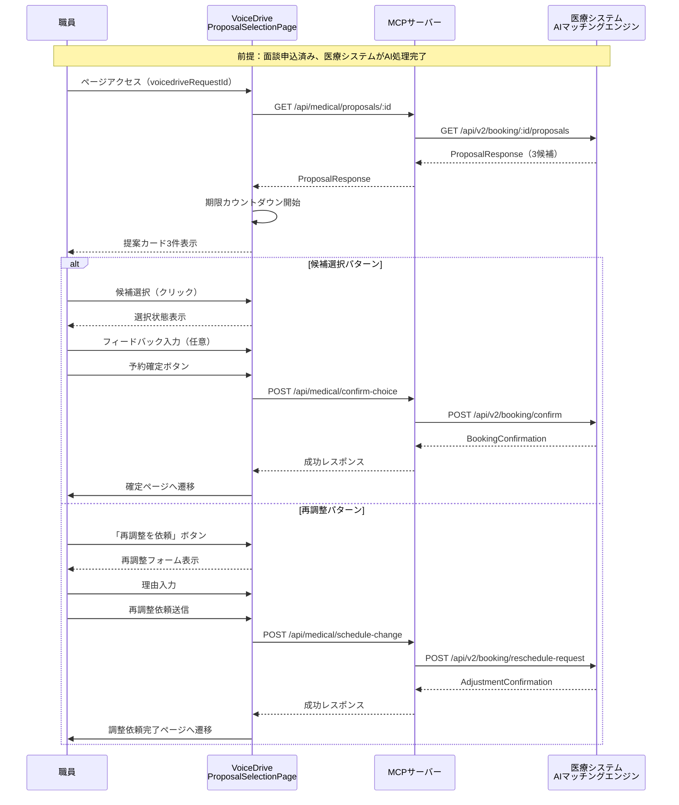
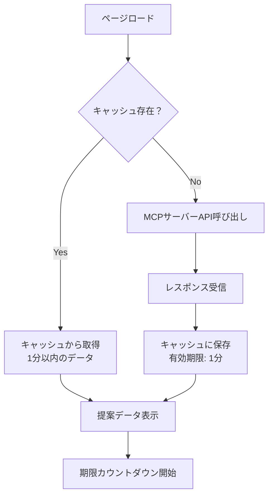

# ProposalSelectionPage DB要件分析

**作成日**: 2025年10月26日
**対象ページ**: ProposalSelectionPage (面談候補選択ページ)
**URL**: https://voicedrive-v100.vercel.app/proposal-selection/:voicedriveRequestId

---

## 📋 目次

1. [ページ概要](#ページ概要)
2. [主要機能](#主要機能)
3. [データフロー](#データフロー)
4. [データ管理責任分界点](#データ管理責任分界点)
5. [現在のDB実装状況](#現在のdb実装状況)
6. [不足項目の洗い出し](#不足項目の洗い出し)
7. [API要件](#api要件)
8. [セキュリティ要件](#セキュリティ要件)
9. [パフォーマンス要件](#パフォーマンス要件)

---

## ページ概要

### 目的
職員が面談を申し込んだ後、医療システムのAIマッチングエンジンが生成した「3つの最適な面談候補」を表示し、職員が選択・確定または再調整を依頼するページ。

### ユーザー
- **対象**: VoiceDrive利用職員（全ての職員）
- **権限**: 自分自身の面談候補のみ閲覧・選択可能
- **アクセス**: 面談申込完了後、医療システムから提案が返ってきた後

### ページ遷移
```
CareerStationPage（面談申込）
  ↓ 申込送信
医療システムAI処理（30秒〜5分）
  ↓ 提案生成完了
ProposalSelectionPage（当ページ）← ここ
  ↓ 候補選択
InterviewConfirmationPage（確定ページ）
```

---

## 主要機能

### 1. 提案データ取得・表示

#### 1.1 提案データ取得
- **トリガー**: ページロード時（useEffect）
- **入力**: `voicedriveRequestId`（URLパラメータ）
- **データソース**: 医療システム（MCPサーバー経由）
- **API**: `GET /api/medical/proposals/:voicedriveRequestId`
- **実装関数**: `fetchProposalsWithCache()` (proposalAPI.ts)

**取得データ構造**:
```typescript
interface ProposalResponse {
  voicedriveRequestId: string;      // VoiceDrive側リクエストID
  requestId: string;                  // 医療システム側リクエストID
  proposals: InterviewProposal[];     // 3つの候補
  expiresAt: string;                  // 選択期限（ISO8601）
  contactInfo: {
    urgentPhone: string;              // 緊急連絡先
    email: string;                    // 問い合わせメール
  };
  metadata?: {
    processingModel: string;          // AI処理モデル
    totalCandidates: number;          // 総候補数
    selectedTop: number;              // 表示数（3固定）
    dataPrivacy: string;              // プライバシーポリシー
  };
  receivedAt?: string;                // VoiceDriveが受信した日時
  status?: 'pending_selection' | 'confirmed' | 'revised_pending_selection';
  revisedProposals?: InterviewProposal[]; // 再調整後の提案
  adjustmentId?: string;              // 調整リクエストID
  adjustmentSummary?: string;         // 調整内容サマリー
}
```

**個別提案データ構造**:
```typescript
interface InterviewProposal {
  id: string;                         // 提案ID（医療システム生成）
  rank: 1 | 2 | 3;                    // ランク（1=最適、2=代替、3=その他）
  confidence: number;                 // 適合度スコア（0-100）
  interviewer: {
    id: string;                       // 面談担当者ID
    name: string;                     // 氏名
    title: string;                    // 役職
    department: string;               // 所属部署
    experience: string;               // 経験（例：「15年のキャリア支援経験」）
    specialties?: string[];           // 専門分野タグ
    photo?: string;                   // プロフィール写真URL
  };
  schedule: {
    date: string;                     // YYYY-MM-DD
    time: string;                     // HH:MM形式
    duration: number;                 // 面談時間（分）
    location: string;                 // 場所
    format: 'face_to_face' | 'online' | 'phone';
  };
  staffFriendlyDisplay: {
    title: string;                    // 推薦タイトル
    summary: string;                  // 推薦サマリー
    highlights: string[];             // ハイライト（3-5項目）
  };
  rankingReason: string;              // ランキング理由
}
```

#### 1.2 期限カウントダウン管理
- **機能**: リアルタイムカウントダウン表示
- **警告**:
  - 6時間前: 黄色警告表示
  - 1時間前: 赤色最終警告表示
  - 期限切れ: 専用UI表示、新規依頼へ誘導

#### 1.3 提案カード表示
- **表示件数**: 3件固定
- **ランク別カラー**:
  - ランク1（最適）: 緑系（border-green-400, bg-green-50）
  - ランク2（代替）: オレンジ系（border-orange-400, bg-orange-50）
  - ランク3（その他）: 青系（border-blue-400, bg-blue-50）

**カード構成要素**:
1. ランクバッジ（右上）
2. 適合度スコア（右上）
3. 担当者情報（写真、名前、役職、経験、専門分野）
4. スケジュール情報（日時、場所、形式）
5. AI推薦理由（タイトル、サマリー、ハイライト）
6. 選択ボタン

### 2. 提案選択

#### 2.1 候補選択
- **入力**: 提案ID選択（クリック）
- **状態管理**: `selectedProposal` (useState)
- **UI変化**: 選択カードのハイライト表示

#### 2.2 フィードバック入力
- **任意入力**: 選択理由やご感想（テキストエリア、最大length未指定）
- **状態管理**: `feedback` (useState)
- **例**: 「時間がちょうど良く、専門性も高そうで安心しました」

#### 2.3 予約確定送信
- **トリガー**: 「この内容で予約確定」ボタン
- **必須項目**: 選択した提案ID
- **オプション項目**: フィードバック（feedback.trim() || undefined）
- **API**: `POST /api/medical/confirm-choice`
- **実装関数**: `submitChoice()` (**未実装**)
- **成功後遷移**: `/interview/confirmation/:voicedriveRequestId`

**送信データ構造**:
```typescript
interface ChoiceSubmission {
  voicedriveRequestId: string;
  selectedProposalId: string;
  feedback?: string;
}
```

### 3. 再調整依頼

#### 3.1 再調整フォーム表示
- **トリガー**: 「どの提案も都合がつかない場合」→「条件を変更して再提案を依頼」ボタン
- **UI**: モーダル形式または専用セクション

#### 3.2 再調整依頼送信
- **入力**:
  - 理由（reason）: 必須
  - 代替希望日（alternativeDates）: オプション
  - その他の希望（notes）: オプション
- **API**: `POST /api/medical/schedule-change`
- **実装関数**: `requestScheduleAdjustment()`
- **成功後遷移**: `/interview/adjustment-requested/:voicedriveRequestId`

**送信データ構造**:
```typescript
interface AdjustmentRequest {
  voicedriveRequestId: string;
  reason: string;
  adjustmentType: 'schedule_change';
}
```

### 4. エラーハンドリング

#### 4.1 データ取得エラー
- **表示**: エラーメッセージ + 再読み込みボタン
- **内容**: 「提案データの取得に失敗しました」

#### 4.2 期限切れエラー
- **表示**: 専用UI（赤色警告）
- **アクション**:
  - 新しい提案を依頼ボタン
  - 緊急連絡先表示

#### 4.3 送信エラー
- **選択確定失敗**: 「選択の送信に失敗しました。もう一度お試しください。」
- **再調整依頼失敗**: 「調整依頼の送信に失敗しました。」

---

## データフロー

### 全体フロー



### キャッシュ管理フロー



---

## データ管理責任分界点

### 医療システム管理データ（100%）

#### 1. 提案生成データ
- **AI処理結果**:
  - 候補選定ロジック
  - 適合度スコア計算
  - ランキング決定
- **面談担当者情報**:
  - 職員マスタ（名前、役職、所属）
  - プロフィール写真
  - 専門分野データ
  - 経験年数データ
- **スケジュール情報**:
  - 空き状況マスタ
  - カレンダー統合データ
  - 会議室予約状況

#### 2. リクエスト管理
- **リクエストID**: 医療システム側の一意識別子
- **処理ステータス**: pending → processing → proposals_ready → confirmed
- **調整履歴**: 再調整依頼の履歴

#### 3. 予約確定処理
- **カレンダー登録**: 医療システムのカレンダーに予約追加
- **通知送信**:
  - 担当者への通知
  - リマインダー設定
- **最終予約データ**: BookingConfirmation生成

### VoiceDrive管理データ（キャッシュ・状態管理のみ）

#### 1. セッション状態
- **現在の選択状態**: `selectedProposal`（メモリ内のみ、永続化なし）
- **フィードバック入力**: `feedback`（メモリ内のみ）
- **カウントダウンタイマー**: リアルタイム計算（永続化不要）

#### 2. APIキャッシュ
- **提案データキャッシュ**: ProposalCache（1分有効、メモリ内）
  - 理由: 同一ページの再読み込み対策、API負荷軽減
  - ストレージ: メモリ（Map）
  - 永続化: 不要

#### 3. UI状態
- **ローディング状態**: `loading`
- **エラー状態**: `error`
- **警告表示状態**: `showWarning`、`isExpired`
- **送信中状態**: `submitting`

### データ同期不要

**理由**:
- ProposalSelectionPageは「医療システム生成データの閲覧・選択」のみ
- データはすべて医療システムから取得（Read-Only）
- 選択結果は医療システムへ送信のみ（Write-Through）
- VoiceDrive側でデータを保持・管理する必要なし

---

## 現在のDB実装状況

### VoiceDrive側テーブル

#### Interview テーブル（既存）
**用途**: 面談申込の記録（CareerStationPageで作成）

```prisma
model Interview {
  id               String    @id @default(cuid())
  employeeId       String
  category         String
  type             String
  topic            String
  preferredDate    DateTime
  scheduledDate    DateTime?
  actualDate       DateTime?
  duration         Int?
  interviewerId    String?
  interviewerName  String?
  status           String    @default("pending")
  urgencyLevel     String
  result           String?
  notes            String?
  followUpRequired Boolean   @default(false)
  followUpDate     DateTime?
  createdAt        DateTime  @default(now())
  updatedAt        DateTime  @updatedAt
  employee         User      @relation(fields: [employeeId], references: [id])
}
```

**ProposalSelectionPageとの関係**:
- ✅ 既存: Interview.status = "pending" → 提案待ち
- ✅ 既存: Interview.status = "scheduled" → 提案選択済み
- ❌ **不足**: VoiceDriveリクエストIDとの紐付けフィールドなし
- ❌ **不足**: 医療システムリクエストIDとの紐付けなし
- ❌ **不足**: 選択した提案IDの記録フィールドなし
- ❌ **不足**: 職員フィードバックの記録フィールドなし

#### InterviewResult テーブル（既存）
**用途**: 面談結果の記録（面談後に医療システムから受信）

```prisma
model InterviewResult {
  id                  String    @id @default(cuid())
  requestId           String    @unique
  interviewId         String    @unique
  completedAt         DateTime
  duration            Int
  summary             String
  keyPoints           Json
  actionItems         Json
  followUpRequired    Boolean   @default(false)
  followUpDate        DateTime?
  feedbackToEmployee  String
  nextRecommendations Json
  receivedAt          DateTime  @default(now())
  processedAt         DateTime?
  status              String    @default("received")
  errorMessage        String?
  createdAt           DateTime  @default(now())
  updatedAt           DateTime  @updatedAt
}
```

**ProposalSelectionPageとの関係**:
- ⚠️ 関連: requestId → 医療システムリクエストIDと対応
- ❌ 利用なし: ProposalSelectionPageでは使用しない（面談後のデータ）

### 医療システム側テーブル（推定）

#### BookingRequest（推定）
- 申込情報管理
- AI処理ステータス管理
- voicedriveRequestId ↔ 医療システムrequestId マッピング

#### ProposalSet（推定）
- 提案セット（3候補）の管理
- 期限管理
- 選択ステータス

#### ProposalCandidate（推定）
- 個別候補データ
- ランク、適合度スコア
- 担当者、スケジュール情報

---

## 不足項目の洗い出し

### 1. データベーステーブル

#### ❌ 新規テーブル不要
**理由**:
- データはすべて医療システム管理
- VoiceDrive側は表示・選択のみ（永続化不要）
- キャッシュはメモリ内で十分

### 2. Interviewテーブルへのフィールド追加（検討）

#### オプション1: 最小限の追加（推奨）
```prisma
model Interview {
  // 既存フィールド
  ...

  // 追加フィールド（オプション）
  medicalRequestId   String?  // 医療システム側リクエストID
  selectedProposalId String?  // 選択した提案ID
  selectionFeedback  String?  // 職員フィードバック
}
```

**メリット**:
- 選択履歴の記録
- デバッグ・監査証跡

**デメリット**:
- 医療システムと重複データ管理
- 同期ずれのリスク

#### オプション2: 追加なし（現状維持）
**理由**:
- 医療システムが Single Source of Truth
- データ重複回避
- VoiceDriveは UI レイヤーのみ

**推奨**: オプション2（追加なし）
- データ管理責任分界点の原則に従う
- 必要な情報は医療システムAPIから都度取得

### 3. API実装

#### ❌ 不足API（VoiceDrive側）

**1. submitChoice() 関数**
- **ファイル**: src/api/medicalSystemAPI.ts
- **現状**: 未実装（ProposalSelectionPage.tsxで参照されているが関数が存在しない）
- **必要性**: 高
- **実装内容**:
```typescript
export async function submitChoice(params: {
  voicedriveRequestId: string;
  selectedProposalId: string;
  feedback?: string;
}): Promise<{
  success: boolean;
  message: string;
}> {
  // confirmChoice()をラップして呼び出す
  const confirmation: ChoiceConfirmation = {
    requestId: '', // 医療システムrequestIdが必要（要取得ロジック）
    voicedriveRequestId: params.voicedriveRequestId,
    selectedProposalId: params.selectedProposalId,
    staffFeedback: params.feedback,
    selectedBy: '', // 現在ログイン中のemployeeId
    selectionTimestamp: new Date().toISOString()
  };

  return await confirmChoice(confirmation);
}
```

**課題**:
- `requestId`（医療システム側ID）の取得方法が未定
- ProposalResponseに含まれているはずなので、状態管理で保持する必要あり

**2. requestScheduleAdjustment() の再実装**
- **ファイル**: src/api/medicalSystemAPI.ts
- **現状**: 実装済み（198行目）だが、ProposalSelectionPageの呼び出しパラメータと不一致
- **問題**: ProposalSelectionPageでは`{voicedriveRequestId, reason, adjustmentType}`のみ送信しているが、実装では`AdjustmentRequest`型（より詳細）を要求

**修正案**:
```typescript
// ProposalSelectionPage.tsx 126行目 - 簡易版ラッパー関数を追加
export async function requestScheduleAdjustmentSimple(params: {
  voicedriveRequestId: string;
  reason: string;
  adjustmentType: 'schedule_change';
}): Promise<{
  success: boolean;
  adjustmentId?: string;
  message: string;
}> {
  const fullRequest: AdjustmentRequest = {
    requestId: '', // 医療システムrequestId（要取得）
    voicedriveRequestId: params.voicedriveRequestId,
    adjustmentType: params.adjustmentType,
    reason: params.reason,
    staffPreferences: {}, // 空でOK
    requestedBy: '', // 現在ログイン中のemployeeId
    requestTimestamp: new Date().toISOString()
  };

  return await requestScheduleAdjustment(fullRequest);
}
```

### 4. 型定義

#### ✅ 既存型定義（proposalAPI.ts）
- `InterviewProposal`
- `ProposalResponse`
- `BookingConfirmation`
- `ProposalStatus`

#### ❌ 不足型定義なし
- 必要な型はすべて定義済み

---

## API要件

### 1. GET /api/medical/proposals/:voicedriveRequestId

#### エンドポイント
- **URL**: `http://localhost:8080/api/medical/proposals/:voicedriveRequestId`
- **Method**: GET
- **認証**: なし（開発環境）/ Bearer Token（本番環境）

#### リクエスト
```typescript
// URLパラメータ
{
  voicedriveRequestId: string; // VoiceDrive側一意ID
}
```

#### レスポンス（成功）
```typescript
{
  success: true,
  data: ProposalResponse  // 上記のProposalResponse型
}
```

#### レスポンス（エラー）
```typescript
{
  success: false,
  error: string,
  statusCode: number
}
```

#### エラーコード
- `404`: 提案が見つからない（まだ生成されていない）
- `410`: 期限切れ（expiresAtを過ぎている）
- `408`: タイムアウト
- `500`: サーバーエラー

#### 実装状況
- ✅ クライアント側: 実装済み（proposalAPI.ts）
- ❌ サーバー側（VoiceDrive）: 未実装
- ✅ MCPサーバー: 実装予定（医療システムへのプロキシ）

### 2. POST /api/medical/confirm-choice

#### エンドポイント
- **URL**: `http://localhost:8080/api/medical/confirm-choice`
- **Method**: POST
- **認証**: Bearer Token（医療システム）

#### リクエスト
```typescript
{
  requestId: string;              // 医療システムrequestId
  voicedriveRequestId: string;    // VoiceDrive requestId
  selectedProposalId: string;     // 選択した提案ID
  staffFeedback?: string;         // 職員フィードバック
  selectedBy: string;             // 選択したemployeeId
  selectionTimestamp: string;     // 選択日時（ISO8601）
}
```

#### レスポンス（成功）
```typescript
{
  success: true,
  message: '予約が確定しました',
  bookingId: string               // 予約ID
}
```

#### 実装状況
- ✅ クライアント側関数定義: 実装済み（medicalSystemAPI.ts - confirmChoice）
- ❌ クライアント側ラッパー: 未実装（submitChoice）
- ❌ サーバー側（VoiceDrive）: 未実装
- ✅ MCPサーバー: 実装予定

### 3. POST /api/medical/schedule-change

#### エンドポイント
- **URL**: `http://localhost:8080/api/medical/schedule-change`
- **Method**: POST
- **認証**: Bearer Token

#### リクエスト
```typescript
{
  requestId: string;
  voicedriveRequestId: string;
  adjustmentType: 'schedule_change';
  reason: string;
  staffPreferences: {
    alternativeDates?: string[];
    alternativeTimes?: string[];
    notes?: string;
  };
  requestedBy: string;
  requestTimestamp: string;
}
```

#### レスポンス（成功）
```typescript
{
  success: true,
  adjustmentId: string,
  message: '再調整リクエストを受け付けました'
}
```

#### 実装状況
- ✅ クライアント側: 実装済み（medicalSystemAPI.ts）
- ❌ ProposalSelectionPageとの統合: 要調整（パラメータ不一致）
- ❌ サーバー側（VoiceDrive）: 未実装
- ✅ MCPサーバー: 実装予定

---

## セキュリティ要件

### 1. アクセス制御
- **認証**: JWT認証（実装予定）
- **認可**: 自分自身の面談候補のみアクセス可能
  - `voicedriveRequestId`とログイン中`employeeId`の紐付け検証

### 2. データ保護
- **転送中**: HTTPS（本番環境）
- **API認証**: Bearer Token（医療システムAPI）
- **個人情報**:
  - 担当者名、写真は医療システム管理
  - フィードバックは任意（個人情報含まない想定）

### 3. タイムアウト
- **API呼び出し**: 10秒タイムアウト（proposalAPI.ts）
- **医療システムAPI**: 30秒タイムアウト（medicalSystemAPI.ts）

### 4. リトライ
- **医療システムAPI**: 3回リトライ（exponential backoff）

---

## パフォーマンス要件

### 1. レスポンスタイム
- **初期ローディング**: < 3秒
  - 提案データ取得: < 2秒
  - UI描画: < 1秒
- **選択確定**: < 5秒
  - API送信〜レスポンス: < 3秒
  - 遷移処理: < 2秒

### 2. キャッシュ戦略
- **提案データ**: 1分間キャッシュ（proposalCache）
  - 理由: 期限カウントダウン中の再読み込み対策
  - 無効化: 選択確定後、再調整依頼後

### 3. リアルタイム更新
- **カウントダウン**: 1秒間隔更新（setInterval）
- **警告表示**: 計算ベース（ポーリング不要）

---

## まとめ

### データ管理責任
| データ種別 | 管理者 | VoiceDrive役割 |
|---------|-------|---------------|
| 提案生成データ | 医療システム | 表示のみ |
| 面談担当者情報 | 医療システム | 表示のみ |
| スケジュール情報 | 医療システム | 表示のみ |
| 選択結果 | 医療システム | 送信のみ |
| UI状態 | VoiceDrive | メモリ内管理 |
| キャッシュ | VoiceDrive | 一時保存（1分） |

### 実装優先度

#### 🔴 高優先度（必須）
1. ✅ 提案データ取得API統合（実装済み）
2. ❌ **submitChoice()関数の実装**
3. ❌ **医療システムrequestIdの取得・管理**

#### 🟡 中優先度（推奨）
4. ❌ requestScheduleAdjustment()パラメータ調整
5. ⚠️ エラーハンドリング強化

#### 🟢 低優先度（オプション）
6. Interviewテーブルへのフィールド追加（選択履歴記録）
7. ポーリング機能実装（proposalAPI.ts提供済みだが未使用）

---

**次のステップ**: ProposalSelectionPage暫定マスターリスト作成
