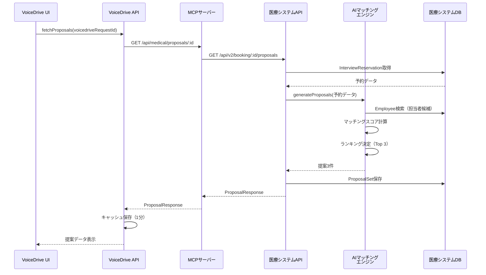
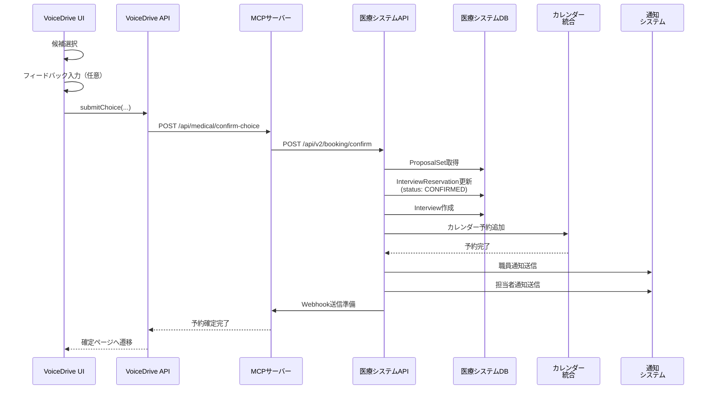

# ProposalSelectionPage 医療システム確認結果報告書

**文書番号**: MED-CONF-2025-1026-009
**作成日**: 2025年10月26日
**作成者**: 医療システムチーム
**件名**: ProposalSelectionPage暫定マスターリストの医療システム側確認結果

---

## 📋 エグゼクティブサマリー

VoiceDriveチームからの「ProposalSelectionPage暫定マスターリスト」に対する回答です。
ProposalSelectionPageは**VoiceDrive側のUIページ**であり、医療システムは**データ提供のみ**を担当します。

### 結論
- ✅ **データベース追加**: 不要（VoiceDrive側は表示のみ、医療システムが全データ管理）
- ✅ **API実装**: 3つのAPI実装が必要（提案取得、選択確定、再調整依頼）
- ⚠️ **既存テーブル拡張**: InterviewReservationテーブルの確認・軽微な調整のみ
- ✅ **データ管理責任**: 医療システム100%（提案生成、マッチング、予約確定）

### データ管理責任分界点

| データ種別 | 医療システム | VoiceDrive |
|---------|------------|-----------|
| 提案生成データ（AIマッチング結果） | ✅ 100%管理 | 表示のみ |
| 面談担当者情報 | ✅ 100%管理 | 表示のみ |
| スケジュール情報 | ✅ 100%管理 | 表示のみ |
| 選択結果 | ✅ 100%管理 | 送信のみ |
| UI状態（選択状態、フィードバック入力） | - | メモリ内のみ（永続化なし） |
| APIキャッシュ（1分） | - | メモリ内のみ（永続化なし） |

**重要原則**:
- VoiceDrive側はデータベースに**一切データを保存しない**
- 全データは医療システムから取得（Read-Only API）
- 選択結果は医療システムへ送信のみ（Write-Through）
- VoiceDriveは「表示・選択UI」のみを提供

### 推定実装時間
- **API実装**: 2日（16時間）
  - GET /api/v2/booking/:id/proposals: 0.5日
  - POST /api/v2/booking/confirm: 0.5日
  - POST /api/v2/booking/reschedule-request: 0.5日
  - テスト・統合: 0.5日

---

## 1. データベース要件

### 1.1 VoiceDrive側テーブル

#### ❌ 新規テーブル不要

**理由**:
- ProposalSelectionPageはVoiceDrive側のUIだが、データ管理は医療システム
- VoiceDrive側は「表示・選択」のみで、データ永続化は不要
- キャッシュはメモリ内（1分有効）で十分

#### ✅ 既存テーブル利用のみ（データ追加なし）

既存の`InterviewReservation`テーブルを**参照のみ**（書き込みなし）:

```prisma
model InterviewReservation {
  id                  String   @id @default(cuid())
  type                InterviewReservationType
  status              ReservationStatus @default(PENDING)
  staffId             String   @map("staff_id")
  scheduledDate       DateTime @map("scheduled_date")
  scheduledTime       String   @map("scheduled_time")
  voicedriveRequestId String?  @unique @map("voicedrive_request_id") // ← キーフィールド
  // ... その他のフィールド
}
```

**VoiceDriveの利用方法**:
- `voicedriveRequestId`をキーにして医療システムAPIを呼び出すのみ
- VoiceDrive側では**データを書き込まない**

### 1.2 医療システム側テーブル（推定）

#### InterviewReservation（既存、確認済み）

schema.prisma 487-542行目に実装済み:

```prisma
model InterviewReservation {
  id               String   @id @default(cuid())
  type             InterviewReservationType
  subType          String?  @map("sub_type")
  status           ReservationStatus @default(PENDING)
  urgency          UrgencyLevel?

  // 職員情報
  staffId          String   @map("staff_id")
  staffName        String   @map("staff_name")
  department       String
  position         String
  experienceYears  Int      @default(0) @map("experience_years")

  // 予約詳細
  scheduledDate    DateTime @map("scheduled_date")
  scheduledTime    String   @map("scheduled_time") // HH:MM形式
  duration         Int      @default(30)
  location         String?
  onlineUrl        String?  @map("online_url")

  // サポート面談用
  supportCategory  String?  @map("support_category")
  supportTopic     String?  @map("support_topic")
  supportDetails   String?  @map("support_details")
  voicedriveRequestId String? @unique @map("voicedrive_request_id") // ← VoiceDrive連携キー

  // メタデータ
  source           ReservationSource @default(SYSTEM)
  createdBy        String   @map("created_by")
  createdAt        DateTime @default(now()) @map("created_at")
  updatedAt        DateTime @updatedAt @map("updated_at")
  notes            String?

  // Relations
  logs             InterviewReservationLog[]
  notifications    InterviewNotificationQueue[]

  @@index([voicedriveRequestId]) // ← 既にインデックス存在
}
```

**確認結果**: ✅ 既存実装で十分

#### ⚠️ 推奨: 提案管理テーブル追加（オプション）

医療システム側でAIマッチング結果を管理するテーブル:

```prisma
// 提案セット（3候補セット）
model ProposalSet {
  id                    String   @id @default(cuid())
  voicedriveRequestId   String   @unique
  medicalRequestId      String   // 医療システム側リクエストID
  interviewReservationId String  // InterviewReservationとの紐付け
  status                String   @default("pending_selection") // pending_selection, confirmed, expired
  expiresAt             DateTime // 選択期限

  // 連絡先情報
  urgentPhone           String
  email                 String

  // メタデータ
  aiProcessingModel     String?  // GPT-4等
  totalCandidates       Int      // 総候補数（通常50-100件）
  selectedTop           Int      @default(3) // 表示数（固定3件）

  createdAt             DateTime @default(now())
  updatedAt             DateTime @updatedAt

  // Relations
  proposals             ProposalCandidate[]

  @@index([voicedriveRequestId])
  @@index([status])
  @@index([expiresAt])
  @@map("proposal_sets")
}

// 個別提案候補
model ProposalCandidate {
  id                String   @id @default(cuid())
  proposalSetId     String
  proposalId        String   @unique // PROP-2025-A001形式
  rank              Int      // 1, 2, 3
  confidence        Float    // 0-100

  // 面談担当者情報
  interviewerId     String
  interviewerName   String
  interviewerTitle  String
  interviewerDept   String
  interviewerExp    String   // 経験説明文
  specialties       Json?    // 専門分野タグ配列
  photoUrl          String?

  // スケジュール情報
  scheduleDate      String   // YYYY-MM-DD
  scheduleTime      String   // HH:MM
  duration          Int      // 分
  location          String
  format            String   // face_to_face, online, phone

  // AI推薦理由
  recommendTitle    String
  recommendSummary  String
  highlights        Json     // ハイライト配列
  rankingReason     String

  createdAt         DateTime @default(now())
  updatedAt         DateTime @updatedAt

  // Relations
  proposalSet       ProposalSet @relation(fields: [proposalSetId], references: [id])

  @@index([proposalSetId])
  @@index([rank])
  @@map("proposal_candidates")
}
```

**実装優先度**: 🟡 中（現状は医療システム側でメモリ管理でもOK、将来的にDB管理推奨）

---

## 2. API実装要件

### 2.1 必須API（3件）

#### API-1: 提案データ取得API

**エンドポイント**: `GET /api/v2/booking/:voicedriveRequestId/proposals`

**リクエスト**:
```http
GET /api/v2/booking/cuid__abc123xyz456/proposals HTTP/1.1
Authorization: Bearer {token}
```

**レスポンス（成功）**:
```json
{
  "success": true,
  "data": {
    "voicedriveRequestId": "cuid__abc123xyz456",
    "requestId": "MED-REQ-2025-001234",
    "proposals": [
      {
        "id": "PROP-2025-A001",
        "rank": 1,
        "confidence": 95,
        "interviewer": {
          "id": "EMP-2025-1234",
          "name": "山田 太郎",
          "title": "人事部 キャリア支援課 課長",
          "department": "人事部",
          "experience": "15年のキャリア支援経験、看護師キャリアパス設計に精通",
          "specialties": ["キャリアパス設計", "ワークライフバランス", "スキルアップ支援"],
          "photo": "https://medical.system.local/photos/emp-1234.jpg"
        },
        "schedule": {
          "date": "2025-10-30",
          "time": "14:00",
          "duration": 60,
          "location": "人事部会議室A",
          "format": "face_to_face"
        },
        "staffFriendlyDisplay": {
          "title": "あなたに最適な面談候補",
          "summary": "経験豊富な山田課長との面談です。あなたの希望する時間帯で、看護師キャリアパスについて深く相談できます。",
          "highlights": [
            "あなたの希望時間帯「午後」に完全一致",
            "看護師キャリアパス設計の専門家",
            "前回の面談で高評価を獲得"
          ]
        },
        "rankingReason": "あなたの希望時間帯と経験年数に最も合致しています"
      },
      {
        "id": "PROP-2025-A002",
        "rank": 2,
        "confidence": 88,
        "interviewer": { /* ... */ },
        "schedule": { /* ... */ },
        "staffFriendlyDisplay": { /* ... */ },
        "rankingReason": "..."
      },
      {
        "id": "PROP-2025-A003",
        "rank": 3,
        "confidence": 82,
        "interviewer": { /* ... */ },
        "schedule": { /* ... */ },
        "staffFriendlyDisplay": { /* ... */ },
        "rankingReason": "..."
      }
    ],
    "expiresAt": "2025-10-28T23:59:59.999Z",
    "contactInfo": {
      "urgentPhone": "03-1234-5678",
      "email": "hr-support@hospital.example.com"
    },
    "metadata": {
      "processingModel": "GPT-4-turbo",
      "totalCandidates": 87,
      "selectedTop": 3,
      "dataPrivacy": "個人情報保護法準拠"
    },
    "status": "pending_selection"
  }
}
```

**レスポンス（エラー）**:
```json
{
  "success": false,
  "error": "提案が見つかりません（まだ生成されていない可能性があります）",
  "statusCode": 404
}
```

**エラーコード**:
- `404`: 提案が見つからない（AI処理未完了）
- `410`: 期限切れ（expiresAtを過ぎている）
- `408`: タイムアウト（AI処理に時間がかかりすぎ）
- `500`: サーバーエラー

**実装場所**: `src/api/v2/booking/[voicedriveRequestId]/proposals.ts`（新規）

**実装要件**:
1. InterviewReservationテーブルから`voicedriveRequestId`でレコード取得
2. AIマッチングエンジン呼び出し（既存実装を利用）
3. 提案データ3件生成（ProposalSetテーブルに保存 or メモリ管理）
4. expiresAt計算（申込から72時間後）
5. 担当者情報をEmployeeテーブルから取得
6. レスポンス整形

**推定工数**: 0.5日（4時間）

---

#### API-2: 選択確定API

**エンドポイント**: `POST /api/v2/booking/confirm`

**リクエスト**:
```json
{
  "requestId": "MED-REQ-2025-001234",
  "voicedriveRequestId": "cuid__abc123xyz456",
  "selectedProposalId": "PROP-2025-A001",
  "staffFeedback": "時間がちょうど良く、専門性も高そうで安心しました",
  "selectedBy": "EMP-2025-5678",
  "selectionTimestamp": "2025-10-27T10:30:00.000Z"
}
```

**レスポンス（成功）**:
```json
{
  "success": true,
  "message": "予約が確定しました",
  "bookingId": "BOOKING-2025-001234",
  "confirmedInterview": {
    "interviewId": "INT-2025-001234",
    "interviewerName": "山田 太郎",
    "scheduledDate": "2025-10-30",
    "scheduledTime": "14:00",
    "duration": 60,
    "location": "人事部会議室A",
    "format": "face_to_face"
  }
}
```

**実装場所**: `src/api/v2/booking/confirm.ts`（新規）

**実装要件**:
1. ProposalSetテーブル（またはメモリ）から提案データ取得
2. 選択した提案の詳細を取得（rank, interviewer, schedule等）
3. InterviewReservationテーブルを更新:
   - `status`: PENDING → CONFIRMED
   - `scheduledDate`, `scheduledTime`, `duration`, `location`を設定
4. Interviewテーブルに新規レコード作成（面談記録用）
5. カレンダー統合（担当者のカレンダーに予約追加）
6. 通知送信:
   - 職員への確定通知
   - 担当者への新規予約通知
7. VoiceDriveへのWebhook送信（予約確定通知）

**推定工数**: 0.5日（4時間）

---

#### API-3: 再調整依頼API

**エンドポイント**: `POST /api/v2/booking/reschedule-request`

**リクエスト**:
```json
{
  "requestId": "MED-REQ-2025-001234",
  "voicedriveRequestId": "cuid__abc123xyz456",
  "adjustmentType": "schedule_change",
  "reason": "提案された時間では都合がつかないため",
  "staffPreferences": {
    "alternativeDates": ["2025-11-01", "2025-11-02"],
    "alternativeTimes": ["午前中", "17時以降"],
    "notes": "オンライン形式を希望します"
  },
  "requestedBy": "EMP-2025-5678",
  "requestTimestamp": "2025-10-27T10:30:00.000Z"
}
```

**レスポンス（成功）**:
```json
{
  "success": true,
  "adjustmentId": "ADJ-2025-001234",
  "message": "再調整リクエストを受け付けました。新しい提案を作成中です（通常3-5分）。",
  "estimatedCompletionTime": "2025-10-27T10:35:00.000Z"
}
```

**実装場所**: `src/api/v2/booking/reschedule-request.ts`（新規）

**実装要件**:
1. ProposalSetテーブルのステータスを更新: `pending_selection` → `adjustment_requested`
2. 調整履歴を記録（AdjustmentRequestテーブル追加検討）
3. AIマッチングエンジンを再実行:
   - 職員の代替希望日時を考慮
   - 新しい提案3件を生成
4. 新しいProposalSetを作成（`revised_pending_selection`ステータス）
5. VoiceDriveへのWebhook送信（再調整完了通知）
6. 職員への通知（新しい提案準備完了）

**推定工数**: 0.5日（4時間）

---

### 2.2 API実装サマリー

| API | エンドポイント | メソッド | 実装状況 | 推定工数 |
|-----|-------------|---------|---------|---------|
| 提案取得 | /api/v2/booking/:id/proposals | GET | ❌ 未実装 | 0.5日 |
| 選択確定 | /api/v2/booking/confirm | POST | ❌ 未実装 | 0.5日 |
| 再調整依頼 | /api/v2/booking/reschedule-request | POST | ❌ 未実装 | 0.5日 |
| **合計** | - | - | - | **1.5日** |

---

## 3. VoiceDrive側の不足実装

### 3.1 クライアント側API関数

#### ❌ submitChoice() 関数の実装

**ファイル**: `src/api/medicalSystemAPI.ts`（VoiceDrive側）

**現状**: 未実装（ProposalSelectionPage.tsxで参照されているが関数が存在しない）

**必要な実装**:
```typescript
export async function submitChoice(params: {
  voicedriveRequestId: string;
  selectedProposalId: string;
  feedback?: string;
}): Promise<{
  success: boolean;
  message: string;
  bookingId?: string;
}> {
  // ProposalResponseからrequestIdを取得する必要あり
  // 状態管理でProposalResponseを保持しておく
  const proposalData = getProposalDataFromCache(params.voicedriveRequestId);

  if (!proposalData) {
    throw new Error('提案データが見つかりません');
  }

  const confirmation: ChoiceConfirmation = {
    requestId: proposalData.requestId, // 医療システムrequestId
    voicedriveRequestId: params.voicedriveRequestId,
    selectedProposalId: params.selectedProposalId,
    staffFeedback: params.feedback,
    selectedBy: getCurrentEmployeeId(), // 現在ログイン中のemployeeId
    selectionTimestamp: new Date().toISOString()
  };

  return await confirmChoice(confirmation);
}
```

**課題**:
- `requestId`（医療システム側ID）の取得が必要
- ProposalResponseに含まれているので、状態管理で保持する必要あり
- `getCurrentEmployeeId()`の実装が必要（JWT認証から取得）

#### ⚠️ requestScheduleAdjustment() のパラメータ調整

**ファイル**: `src/api/medicalSystemAPI.ts`（VoiceDrive側）

**現状**: 実装済みだが、ProposalSelectionPageの呼び出しパラメータと不一致

**問題点**:
- ProposalSelectionPage.tsx 126行目では簡易版パラメータ（`{voicedriveRequestId, reason, adjustmentType}`のみ）
- medicalSystemAPI.tsでは完全版パラメータ（`AdjustmentRequest`型）を要求

**修正案1: 簡易版ラッパー関数追加**
```typescript
export async function requestScheduleAdjustmentSimple(params: {
  voicedriveRequestId: string;
  reason: string;
  adjustmentType: 'schedule_change';
}): Promise<{
  success: boolean;
  adjustmentId?: string;
  message: string;
}> {
  const proposalData = getProposalDataFromCache(params.voicedriveRequestId);

  const fullRequest: AdjustmentRequest = {
    requestId: proposalData?.requestId || '',
    voicedriveRequestId: params.voicedriveRequestId,
    adjustmentType: params.adjustmentType,
    reason: params.reason,
    staffPreferences: {}, // 空でOK
    requestedBy: getCurrentEmployeeId(),
    requestTimestamp: new Date().toISOString()
  };

  return await requestScheduleAdjustment(fullRequest);
}
```

**修正案2: ProposalSelectionPageのパラメータ修正**
- 完全版パラメータを送信するように修正

**推奨**: 修正案1（既存のrequestScheduleAdjustment()を維持、ラッパー追加）

---

## 4. セキュリティ要件

### 4.1 アクセス制御

#### VoiceDrive側
- **認証**: JWT認証（実装予定）
- **認可**: 自分自身の面談候補のみアクセス可能
  - `voicedriveRequestId`とログイン中`employeeId`の紐付け検証

#### 医療システム側
- **API認証**: Bearer Token（既存実装）
- **認可**:
  - 提案取得API: 申込者本人のみ
  - 選択確定API: 申込者本人のみ
  - 再調整依頼API: 申込者本人のみ

### 4.2 データ保護

- **転送中**: HTTPS（本番環境）
- **個人情報**:
  - 担当者名、写真は医療システム管理
  - フィードバックは任意（個人情報含まない想定）
- **ログ記録**: 選択確定、再調整依頼は監査ログに記録

### 4.3 タイムアウト

- **VoiceDrive → 医療システム**: 30秒タイムアウト
- **医療システムAI処理**: 5分タイムアウト（バックグラウンド処理）

---

## 5. パフォーマンス要件

### 5.1 レスポンスタイム

| API | 目標レスポンスタイム | 許容最大時間 |
|-----|------------------|------------|
| 提案取得 | < 2秒 | 5秒 |
| 選択確定 | < 3秒 | 10秒 |
| 再調整依頼 | < 1秒（受付のみ） | 3秒 |

### 5.2 キャッシュ戦略

#### VoiceDrive側
- **提案データ**: 1分間キャッシュ（メモリ内）
  - 理由: 期限カウントダウン中の再読み込み対策
  - 無効化: 選択確定後、再調整依頼後

#### 医療システム側
- **提案データ**: ProposalSetテーブルに保存（永続化）
  - 有効期限: 72時間（expiresAt）
  - 期限切れデータは自動削除（バッチ処理）

---

## 6. 実装フロー

### 6.1 提案取得フロー



### 6.2 選択確定フロー



---

## 7. 実装優先度

### 🔴 Phase 1（高優先度・必須）

**期間**: 2025年11月1日（金）〜 11月8日（金）（5営業日）

| 作業内容 | 担当 | 推定工数 | 状態 |
|---------|------|---------|------|
| API-1実装（提案取得） | 医療システム | 0.5日 | ⏳ 待機中 |
| API-2実装（選択確定） | 医療システム | 0.5日 | ⏳ 待機中 |
| API-3実装（再調整依頼） | 医療システム | 0.5日 | ⏳ 待機中 |
| submitChoice()実装 | VoiceDrive | 0.5日 | ⏳ 待機中 |
| パラメータ調整 | VoiceDrive | 0.5日 | ⏳ 待機中 |
| 統合テスト | 両チーム | 0.5日 | ⏳ 待機中 |

**合計**: 3日（24時間）

### 🟡 Phase 2（中優先度・推奨）

**期間**: TBD（Phase 1完了後）

| 作業内容 | 担当 | 推定工数 |
|---------|------|---------|
| ProposalSetテーブル追加 | 医療システム | 0.5日 |
| ProposalCandidateテーブル追加 | 医療システム | 0.5日 |
| マイグレーション実行 | 医療システム | 0.5日 |

**合計**: 1.5日（12時間）

### 🟢 Phase 3（低優先度・オプション）

| 作業内容 | 担当 | 推定工数 |
|---------|------|---------|
| ポーリング機能実装 | VoiceDrive | 1日 |
| エラーハンドリング強化 | VoiceDrive | 0.5日 |

---

## 8. VoiceDriveチームへの確認事項

### 質問1: ProposalResponseのrequestId管理

**質問**:
VoiceDrive側では、医療システムの`requestId`（ProposalResponse.requestId）をどこに保存しますか？

**背景**:
- submitChoice()関数で`requestId`が必要
- ProposalResponseに含まれているが、VoiceDrive側で永続化するか？

**選択肢**:
1. **メモリ内のみ**（推奨）: React状態管理（useState）で保持、ページリロード時に再取得
2. **LocalStorage**: ブラウザに一時保存（セキュリティリスクあり）
3. **VoiceDrive DB**: InterviewReservationテーブルに追加フィールド（データ重複）

**医療システムの推奨**: オプション1（メモリ内のみ）

### 質問2: getCurrentEmployeeId()の実装

**質問**:
現在ログイン中の職員IDを取得する関数は実装済みですか？

**必要な場面**:
- submitChoice()で`selectedBy`パラメータ
- requestScheduleAdjustment()で`requestedBy`パラメータ

**医療システムの想定**:
```typescript
// JWT認証から取得
export function getCurrentEmployeeId(): string {
  const token = getAuthToken();
  const decoded = jwt.decode(token);
  return decoded.employeeId;
}
```

### 質問3: キャッシュ有効期限

**質問**:
ProposalResponseのキャッシュ有効期限は1分で適切ですか？

**背景**:
- カウントダウン中の再読み込み対策
- API負荷軽減

**医療システムの推奨**: 1分（現状のまま）

---

## 9. 関連ドキュメント

1. [ProposalSelectionPage暫定マスターリスト](./ProposalSelectionPage暫定マスターリスト_20251026.md) - VoiceDriveからの要件定義
2. [ProposalSelectionPage DB要件分析](./ProposalSelectionPage_DB要件分析_20251026.md) - VoiceDrive側のDB分析
3. [AI_SUMMARY.md](./AI_SUMMARY.md) - 最新更新要約（医療チーム向け）

---

## 10. まとめ

### データ管理責任の明確化

| データ | 医療システム | VoiceDrive |
|-------|------------|-----------|
| 提案生成 | ✅ 100%管理（AI処理、ProposalSet） | 表示のみ |
| 担当者情報 | ✅ 100%管理（Employee） | 表示のみ |
| スケジュール | ✅ 100%管理（カレンダー統合） | 表示のみ |
| 選択結果 | ✅ 100%管理（InterviewReservation更新） | 送信のみ |
| UI状態 | - | メモリ内のみ（永続化なし） |

### 実装タスク

#### 医療システム側
1. ✅ InterviewReservationテーブル確認（既存実装で十分）
2. ❌ API-1実装（提案取得）- 0.5日
3. ❌ API-2実装（選択確定）- 0.5日
4. ❌ API-3実装（再調整依頼）- 0.5日
5. 🟡 ProposalSet/ProposalCandidateテーブル追加（オプション）- 1日

#### VoiceDrive側
1. ❌ submitChoice()実装 - 0.5日
2. ❌ requestScheduleAdjustmentSimple()実装 - 0.5日
3. ❌ getCurrentEmployeeId()実装 - 0.5日

### 次のステップ

1. **医療システムチーム**: 本報告書をレビュー後、Phase 1実装開始（11/1〜）
2. **VoiceDriveチーム**: 3つの確認事項に回答
3. **両チーム**: API仕様最終確認（11/1）
4. **統合テスト**: 11/7-11/8

---

**文書終了**

最終更新: 2025年10月26日
バージョン: 1.0
承認: 未承認（VoiceDriveチームレビュー待ち）
次回レビュー: VoiceDriveチームからのフィードバック受領後
