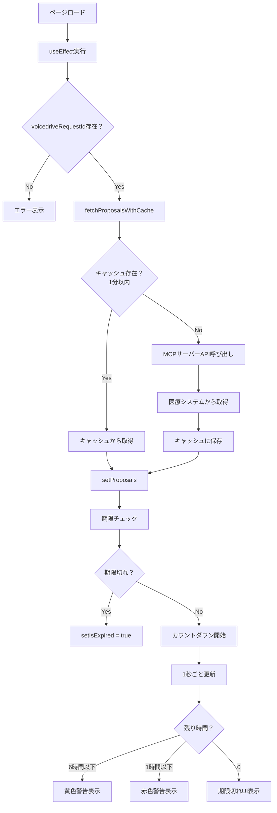
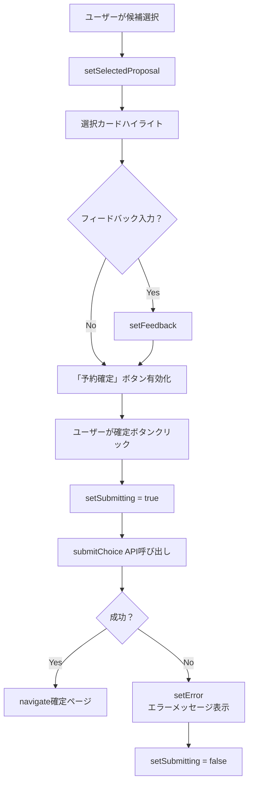

# ProposalSelectionPage 暫定マスターリスト

**作成日**: 2025年10月26日
**対象ページ**: ProposalSelectionPage (面談候補選択ページ)
**URL**: https://voicedrive-v100.vercel.app/proposal-selection/:voicedriveRequestId

---

## 📊 データ項目サマリー

| カテゴリ | 項目数 | データ管理者 | VoiceDrive役割 |
|---------|-------|------------|---------------|
| URLパラメータ | 1 | VoiceDrive | パラメータ管理 |
| 提案セット基本情報 | 8 | 医療システム | 表示のみ |
| 個別提案データ | 21 | 医療システム | 表示のみ |
| UI状態管理 | 7 | VoiceDrive | ローカル状態 |
| ユーザー入力 | 3 | VoiceDrive → 医療システム | 送信のみ |
| **合計** | **40** | - | - |

---

## 1. URLパラメータ（1項目）

### 1.1 voicedriveRequestId
- **型**: `string`
- **必須**: ✅
- **説明**: VoiceDrive側の面談申込リクエスト一意識別子
- **例**: `"cuid__abc123xyz456"`
- **用途**:
  - 提案データ取得APIのキー
  - Interview テーブルとの紐付け（将来）
- **管理**: VoiceDrive
- **取得方法**: `useParams<{ voicedriveRequestId: string }>()`

---

## 2. 提案セット基本情報（8項目）

### 2.1 ProposalResponse

#### 2.1.1 voicedriveRequestId
- **型**: `string`
- **必須**: ✅
- **データソース**: 医療システム（エコーバック）
- **説明**: VoiceDriveリクエストID（確認用）
- **例**: `"cuid__abc123xyz456"`

#### 2.1.2 requestId
- **型**: `string`
- **必須**: ✅
- **データソース**: 医療システム
- **説明**: 医療システム側の内部リクエストID
- **例**: `"MED-REQ-2025-001234"`
- **用途**: 選択確定・再調整API呼び出し時に必要
- **保存先**: ❌ VoiceDrive DB保存不要（状態管理のみ）

#### 2.1.3 proposals
- **型**: `InterviewProposal[]`（配列、固定3件）
- **必須**: ✅
- **データソース**: 医療システム
- **説明**: 面談候補3件
- **詳細**: [セクション3](#3-個別提案データ21項目)参照

#### 2.1.4 expiresAt
- **型**: `string`（ISO8601形式）
- **必須**: ✅
- **データソース**: 医療システム
- **説明**: 選択期限
- **例**: `"2025-10-28T23:59:59.999Z"`
- **用途**:
  - カウントダウンタイマー計算
  - 期限切れ判定
- **計算**:
  ```typescript
  const expiresAt = new Date(data.expiresAt).getTime();
  const timeRemaining = Math.max(0, expiresAt - Date.now());
  ```

#### 2.1.5 contactInfo.urgentPhone
- **型**: `string`
- **必須**: ✅
- **データソース**: 医療システム
- **説明**: 緊急連絡先電話番号
- **例**: `"03-1234-5678"`
- **用途**: 期限切れ時、問題発生時の連絡先表示

#### 2.1.6 contactInfo.email
- **型**: `string`
- **必須**: ✅
- **データソース**: 医療システム
- **説明**: 問い合わせメールアドレス
- **例**: `"hr-support@hospital.example.com"`

#### 2.1.7 status
- **型**: `'pending_selection' | 'confirmed' | 'revised_pending_selection'`
- **必須**: ⚠️（オプション）
- **データソース**: 医療システム
- **説明**: 提案セットのステータス
- **用途**:
  - `pending_selection`: 初回提案、選択待ち
  - `confirmed`: 既に選択済み（この状態では別ページへリダイレクト）
  - `revised_pending_selection`: 再調整後の提案、選択待ち

#### 2.1.8 metadata (開発用)
- **型**: `object`（オプション）
- **必須**: ❌
- **データソース**: 医療システム
- **説明**: デバッグ・開発用メタデータ
- **フィールド**:
  - `processingModel`: AI処理モデル名
  - `totalCandidates`: 総候補数
  - `selectedTop`: 表示数（3固定）
  - `dataPrivacy`: プライバシーポリシー
- **表示**: `process.env.NODE_ENV === 'development'`のみ

---

## 3. 個別提案データ（21項目）

### 3.1 InterviewProposal（×3件）

#### 基本情報（4項目）

##### 3.1.1 id
- **型**: `string`
- **必須**: ✅
- **データソース**: 医療システム
- **説明**: 提案の一意識別子
- **例**: `"PROP-2025-A001"`
- **用途**: 選択状態管理、選択確定API送信

##### 3.1.2 rank
- **型**: `1 | 2 | 3`
- **必須**: ✅
- **データソース**: 医療システム
- **説明**: 提案ランク
  - 1: 最適（緑系UI）
  - 2: 代替（オレンジ系UI）
  - 3: その他（青系UI）
- **UI表示**:
  - ランク1: 🎯 最適
  - ランク2: 🔄 代替
  - ランク3: 📋 その他

##### 3.1.3 confidence
- **型**: `number`（0-100）
- **必須**: ✅
- **データソース**: 医療システム（AIスコアリング）
- **説明**: 適合度スコア
- **例**: `95`
- **表示**: 右上に大きく「95%」

##### 3.1.4 rankingReason
- **型**: `string`
- **必須**: ✅
- **データソース**: 医療システム
- **説明**: ランキング理由の説明文
- **例**: `"あなたの希望時間帯と経験年数に最も合致しています"`
- **表示**: AI推薦理由セクション下部

#### 面談担当者情報（6項目）

##### 3.1.5 interviewer.id
- **型**: `string`
- **必須**: ✅
- **データソース**: 医療システム（職員マスタ）
- **説明**: 担当者の職員ID
- **例**: `"EMP-2025-1234"`

##### 3.1.6 interviewer.name
- **型**: `string`
- **必須**: ✅
- **データソース**: 医療システム
- **説明**: 担当者氏名
- **例**: `"山田 太郎"`
- **表示**: 大きく目立つ位置

##### 3.1.7 interviewer.title
- **型**: `string`
- **必須**: ✅
- **データソース**: 医療システム
- **説明**: 担当者役職
- **例**: `"人事部 キャリア支援課 課長"`
- **表示**: 名前の下

##### 3.1.8 interviewer.department
- **型**: `string`
- **必須**: ✅
- **データソース**: 医療システム
- **説明**: 所属部署
- **例**: `"人事部"`
- **表示**: 名前・役職と同行

##### 3.1.9 interviewer.experience
- **型**: `string`
- **必須**: ✅
- **データソース**: 医療システム
- **説明**: 経験・実績の説明文
- **例**: `"15年のキャリア支援経験、看護師キャリアパス設計に精通"`
- **表示**: プロフィールセクション

##### 3.1.10 interviewer.specialties
- **型**: `string[]`（配列、オプション）
- **必須**: ❌
- **データソース**: 医療システム
- **説明**: 専門分野タグ
- **例**: `["キャリアパス設計", "ワークライフバランス", "スキルアップ支援"]`
- **表示**: タグ形式（indigo-100背景）

##### 3.1.11 interviewer.photo
- **型**: `string`（URL、オプション）
- **必須**: ❌
- **データソース**: 医療システム
- **説明**: プロフィール写真URL
- **例**: `"https://medical.system.local/photos/emp-1234.jpg"`
- **表示**: 担当者アイコン（w-16 h-16 rounded-full）
- **フォールバック**: Userアイコン

#### スケジュール情報（5項目）

##### 3.1.12 schedule.date
- **型**: `string`（YYYY-MM-DD形式）
- **必須**: ✅
- **データソース**: 医療システム（カレンダーマスタ）
- **説明**: 面談日
- **例**: `"2025-10-30"`
- **表示**: `"10月30日"`形式

##### 3.1.13 schedule.time
- **型**: `string`（HH:MM形式）
- **必須**: ✅
- **データソース**: 医療システム
- **説明**: 面談開始時刻
- **例**: `"14:00"`
- **表示**: `"14:00 - 15:00"`（終了時刻は duration から計算）

##### 3.1.14 schedule.duration
- **型**: `number`（分）
- **必須**: ✅
- **データソース**: 医療システム
- **説明**: 面談時間
- **例**: `60`
- **表示**: `"(60分)"`

##### 3.1.15 schedule.location
- **型**: `string`
- **必須**: ✅
- **データソース**: 医療システム
- **説明**: 面談場所
- **例**: `"人事部会議室A"` または `"オンライン（Zoom）"`
- **表示**: MapPinアイコン付き

##### 3.1.16 schedule.format
- **型**: `'face_to_face' | 'online' | 'phone'`
- **必須**: ✅
- **データソース**: 医療システム
- **説明**: 面談形式
- **表示**:
  - `face_to_face`: 「対面」
  - `online`: 「オンライン」
  - `phone`: 「電話」

#### AI推薦理由（3項目）

##### 3.1.17 staffFriendlyDisplay.title
- **型**: `string`
- **必須**: ✅
- **データソース**: 医療システム（AIテキスト生成）
- **説明**: 推薦タイトル
- **例**: `"あなたに最適な面談候補"`
- **表示**: AI推薦理由セクションの見出し

##### 3.1.18 staffFriendlyDisplay.summary
- **型**: `string`
- **必須**: ✅
- **データソース**: 医療システム
- **説明**: 推薦サマリー（1-2文）
- **例**: `"経験豊富な山田課長との面談です。あなたの希望する時間帯で、看護師キャリアパスについて深く相談できます。"`
- **表示**: text-sm text-gray-600

##### 3.1.19 staffFriendlyDisplay.highlights
- **型**: `string[]`（配列、通常3-5項目）
- **必須**: ✅
- **データソース**: 医療システム
- **説明**: ハイライトポイント
- **例**:
```typescript
[
  "あなたの希望時間帯「午後」に完全一致",
  "看護師キャリアパス設計の専門家",
  "前回の面談で高評価を獲得"
]
```
- **表示**: CheckCircleアイコン付きリスト

---

## 4. UI状態管理（7項目）

### 4.1 ローカル状態（useState）

#### 4.1.1 proposals
- **型**: `ProposalResponse | null`
- **初期値**: `null`
- **説明**: 取得した提案データ全体
- **更新**: fetchProposalsWithCache() 成功時

#### 4.1.2 selectedProposal
- **型**: `string | null`
- **初期値**: `null`
- **説明**: 現在選択中の提案ID
- **更新**: 提案カードクリック時
- **用途**: 選択状態のハイライト表示、確定ボタン有効化

#### 4.1.3 feedback
- **型**: `string`
- **初期値**: `''`
- **説明**: 職員フィードバック入力値
- **最大長**: 未指定（textarea制限なし）
- **送信**: `feedback.trim() || undefined`（空白のみの場合は送信しない）

#### 4.1.4 loading
- **型**: `boolean`
- **初期値**: `true`
- **説明**: データ取得中フラグ
- **用途**: ローディングスピナー表示

#### 4.1.5 error
- **型**: `string | null`
- **初期値**: `null`
- **説明**: エラーメッセージ
- **用途**: エラーUI表示

#### 4.1.6 timeRemaining
- **型**: `number`（ミリ秒）
- **初期値**: `0`
- **説明**: 期限までの残り時間
- **更新**: 1秒ごと（setInterval）
- **計算**:
```typescript
const expiresAt = new Date(proposals.expiresAt).getTime();
const timeRemaining = Math.max(0, expiresAt - Date.now());
```

#### 4.1.7 showWarning
- **型**: `boolean`
- **初期値**: `false`
- **説明**: 期限警告表示フラグ
- **条件**:
  - `timeRemaining <= 6時間`: 黄色警告
  - `timeRemaining <= 1時間`: 赤色最終警告

#### 4.1.8 isExpired
- **型**: `boolean`
- **初期値**: `false`
- **説明**: 期限切れフラグ
- **条件**: `timeRemaining === 0`
- **UI**: 専用期限切れページ表示

#### 4.1.9 submitting
- **型**: `boolean`
- **初期値**: `false`
- **説明**: 送信中フラグ
- **用途**: 確定ボタンのdisabled制御、スピナー表示

---

## 5. ユーザー入力（3項目）

### 5.1 選択確定時の送信データ

#### 5.1.1 selectedProposalId
- **型**: `string`
- **必須**: ✅
- **データソース**: ユーザー選択（UIクリック）
- **送信先**: `POST /api/medical/confirm-choice`
- **例**: `"PROP-2025-A001"`

#### 5.1.2 feedback（選択理由・感想）
- **型**: `string | undefined`
- **必須**: ❌（任意）
- **データソース**: テキストエリア入力
- **送信先**: `POST /api/medical/confirm-choice`
- **例**: `"時間がちょうど良く、専門性も高そうで安心しました"`
- **処理**: `feedback.trim() || undefined`（空文字は送信しない）

#### 5.1.3 adjustmentReason（再調整理由）
- **型**: `string`
- **必須**: ✅（再調整依頼時のみ）
- **データソース**: ユーザー入力
- **送信先**: `POST /api/medical/schedule-change`
- **例**: `"提案された時間では都合がつかないため"`
- **固定値使用**: ProposalSelectionPage.tsx 132行目

---

## 6. データフロー図

### 6.1 提案データ取得フロー



### 6.2 選択確定フロー



---

## 7. Prisma Schema検証

### 7.1 既存テーブル

#### Interview（既存）
```prisma
model Interview {
  id               String    @id @default(cuid())
  employeeId       String
  category         String
  type             String
  topic            String
  preferredDate    DateTime
  scheduledDate    DateTime?  // 選択後の確定日時
  actualDate       DateTime?
  duration         Int?
  interviewerId    String?    // 選択後の担当者ID
  interviewerName  String?    // 選択後の担当者名
  status           String     // "pending" → "scheduled"
  urgencyLevel     String
  result           String?
  notes            String?
  followUpRequired Boolean    @default(false)
  followUpDate     DateTime?
  createdAt        DateTime   @default(now())
  updatedAt        DateTime   @updatedAt
  employee         User       @relation(fields: [employeeId], references: [id])
}
```

**ProposalSelectionPageとの関係**:
- ✅ 既存フィールドで十分（選択後の更新のみ）
- ⚠️ 選択履歴の詳細記録が必要な場合は追加フィールド検討

### 7.2 追加テーブル不要

**理由**:
- データはすべて医療システム管理
- VoiceDrive側は表示・選択UIのみ
- 選択結果は医療システムへ送信後、Interview更新のみ

---

## 8. API実装チェックリスト

### 8.1 データ取得API

| API | 実装状況 | ファイル | 備考 |
|-----|---------|---------|------|
| fetchProposals() | ✅ 実装済み | proposalAPI.ts:167 | MCPサーバー経由 |
| fetchProposalsWithCache() | ✅ 実装済み | proposalAPI.ts:341 | キャッシュ付き |
| ProposalCache | ✅ 実装済み | proposalAPI.ts:304 | 1分キャッシュ |

### 8.2 選択確定API

| API | 実装状況 | ファイル | 備考 |
|-----|---------|---------|------|
| confirmChoice() | ✅ 実装済み | medicalSystemAPI.ts:178 | 医療システムAPI |
| submitChoice() | ❌ **未実装** | - | **要実装**（ラッパー関数） |

**submitChoice()実装要件**:
```typescript
// 必要な実装
export async function submitChoice(params: {
  voicedriveRequestId: string;
  selectedProposalId: string;
  feedback?: string;
}): Promise<{ success: boolean; message: string }> {
  // ProposalResponseからrequestIdを取得する仕組みが必要
  // または、状態管理でrequestIdを保持
  const requestId = await getRequestIdFromVoicedriveRequestId(params.voicedriveRequestId);

  const confirmation: ChoiceConfirmation = {
    requestId,
    voicedriveRequestId: params.voicedriveRequestId,
    selectedProposalId: params.selectedProposalId,
    staffFeedback: params.feedback,
    selectedBy: getCurrentUserId(), // 要実装
    selectionTimestamp: new Date().toISOString()
  };

  return await confirmChoice(confirmation);
}
```

### 8.3 再調整依頼API

| API | 実装状況 | ファイル | 備考 |
|-----|---------|---------|------|
| requestScheduleAdjustment() | ✅ 実装済み | medicalSystemAPI.ts:198 | 医療システムAPI |
| パラメータ調整 | ⚠️ **要修正** | ProposalSelectionPage.tsx:126 | 簡易版パラメータ対応 |

**パラメータ不一致問題**:
- ProposalSelectionPage: 簡易版（reason, adjustmentType のみ）
- medicalSystemAPI: 完全版（AdjustmentRequest型）

**解決策**:
```typescript
// オプション1: 簡易版ラッパー関数追加
export async function requestScheduleAdjustmentSimple(...) { ... }

// オプション2: ProposalSelectionPage側を修正して完全版パラメータ送信
```

---

## 9. 不足項目まとめ

### 9.1 データベース
- ✅ **追加不要**: 既存Interviewテーブルで十分
- ⚠️ **検討**: 選択履歴詳細記録が必要な場合のみ追加フィールド

### 9.2 API実装

#### 必須（高優先度）
1. ❌ **submitChoice()関数の実装**
   - ファイル: src/api/medicalSystemAPI.ts
   - 内容: confirmChoice()のラッパー、requestId取得ロジック

2. ❌ **requestId取得ロジック**
   - ProposalResponseのrequestIdを状態管理で保持
   - または、VoiceDriveDB（Interviewテーブル）に保存

#### 推奨（中優先度）
3. ⚠️ **requestScheduleAdjustmentSimple()実装**
   - または ProposalSelectionPageパラメータ修正

4. ⚠️ **getCurrentUserId()実装**
   - JWT認証からemployeeIdを取得

### 9.3 その他
- ✅ 型定義: すべて実装済み
- ✅ UI実装: すべて実装済み
- ✅ エラーハンドリング: 基本実装済み

---

## 10. 実装優先度

### 🔴 Phase 1（必須）- submitChoice実装
1. submitChoice()関数作成
2. requestId管理ロジック実装
3. getCurrentUserId()実装

### 🟡 Phase 2（推奨）- パラメータ調整
4. requestScheduleAdjustmentSimple()実装

### 🟢 Phase 3（オプション）- 履歴記録
5. Interviewテーブルフィールド追加検討

---

**作成者**: Claude Code
**最終更新**: 2025年10月26日
