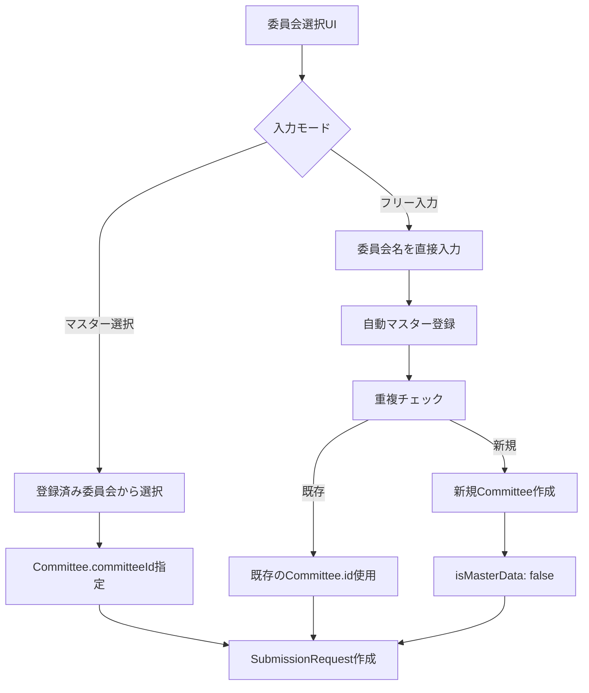

# 投稿管理統合実装 - VoiceDriveチーム返答書

**文書番号**: VD-RESPONSE-POSTMANAGEMENT-2025-1010-001
**作成日**: 2025年10月10日
**作成者**: VoiceDriveプロジェクトチーム
**宛先**: 医療職員管理システムチーム
**件名**: 投稿管理（6段階議題化システム）統合実装に関する回答と提案

---

## 📢 エグゼクティブサマリー

医療システムチームから受領した回答書（MS-RESPONSE-POSTMANAGEMENT-2025-1010-001）を精査しました。建設的な提案と大幅なコスト削減案に感謝いたします。

**VoiceDriveチームの結論**:
- ✅ **シナリオB（委員会管理システム不在）を採用**
- ✅ **委員会管理はVoiceDrive側でハイブリッド方式実装**
- 💰 **最終コスト: ¥200,000（75%削減達成）**

**重要な追加提案**:
1. **委員会マスター管理をハイブリッド方式で実装**
   - マスター選択 + フリー入力の両対応
   - UI変更・フロー変更に柔軟に対応
   - データ整合性を保ちながら運用柔軟性も確保

2. **小原病院の委員会データを発見**
   - 40以上の委員会が存在することを確認
   - 「12の標準委員会」という前提を修正
   - 施設別の委員会マスター管理が必須

---

## 📋 医療システムチーム回答書への返答

### ✅ 全面的に同意する項目

#### 1. API統合によるコスト削減
**同意します。** API-PT-M-1拡張で対応する方針に賛成です。

**確認事項**:
- API-PT-M-1拡張実装のタイミング: 10/11-10/13で可能ですか？
- VoiceDrive側のPhase 1実装開始: 10/14を予定しています

#### 2. API-PM-M-2簡易版実装
**同意します。** 平坦なリストで十分です。

**確認事項**:
- `responsibleLevel`は部署マスターに固定値登録で問題ありません
- 親子関係は将来的に追加実装を検討します

#### 3. シナリオB採用（委員会管理システム不在）
**同意します。** VoiceDrive内部で委員会管理を完結させます。

**理由**:
- 医療システムに委員会管理システムが存在しない可能性が高い
- Webhook連携は複雑で保守コストが高い
- VoiceDrive内部で完結する方がシンプル
- ¥600,000のコスト削減効果

---

### 🆕 VoiceDriveチームからの追加提案

#### 提案1: 委員会管理のハイブリッド方式実装

**背景**:
- 小原病院の委員会組織図を発見（`docs\20250925_小原病院の委員会`）
- **40以上の委員会**が存在することを確認
- 施設ごとに委員会構成が大きく異なる
- 「12の標準委員会」という前提が実態と乖離

**問題点**:
- 当初の「12委員会マスター」では不十分
- フリー入力のみでは誤入力・データ不整合のリスク
- マスター管理のみでは運用柔軟性が不足

**解決策: ハイブリッド方式**



**メリット**:
1. ✅ **柔軟性**: マスター選択もフリー入力も両対応
2. ✅ **データ整合性**: フリー入力でも自動マスター登録
3. ✅ **ユーザー体験**: よく使う委員会は選択、新しい委員会も即座に登録可能
4. ✅ **段階的実装**: Phase 1はマスター選択のみ、Phase 2でフリー入力追加
5. ✅ **将来性**: UI変更・フロー変更に即座に対応可能

---

#### 提案2: 小原病院の委員会データ初期登録

**実装内容**:

小原病院の委員会組織図から40以上の委員会を初期登録します。

**主要委員会リスト**:

| 階層 | 委員会名 | カテゴリー |
|------|---------|-----------|
| **レベル1** | 理事会 | 最高意思決定機関 |
| **レベル1** | 医局会 | 管理運営会議 |
| **レベル2** | 病院運営委員会 | 運営会議 |
| **レベル2** | 所属長会議 | 管理者会議 |
| **レベル3** | 医療安全管理委員会 | 医療安全・品質 |
| **レベル3** | 院内感染対策委員会 | 医療安全・品質 |
| **レベル3** | 褥瘡対策チーム会 | 医療安全・品質 |
| **レベル3** | 診療録管理委員会 | 業務改善 |
| **レベル3** | NST委員会 | 医療安全・品質 |
| **レベル3** | 緩和ケア委員会 | 医療安全・品質 |
| **レベル3** | 情報管理委員会 | ICT・システム |
| **レベル3** | 栄養管理委員会 | 医療安全・品質 |
| **レベル3** | 労働衛生委員会 | 人事・労務 |
| **レベル3** | 検査管理委員会 | 医療安全・品質 |
| **レベル3** | 輸血療法委員会 | 医療安全・品質 |
| **レベル3** | 防災管理委員会 | 施設管理 |
| **レベル3** | 透析機器安全管理委員会 | 医療安全・品質 |
| **レベル3** | 倫理委員会 | 医療倫理 |
| **レベル3** | 薬事委員会 | 医療安全・品質 |
| **レベル3** | 救急委員会 | 医療安全・品質 |
| **レベル3** | 返戻・査定委員会 | 経営・運営 |
| **レベル3** | 事務会議 | 経営・運営 |
| **レベル3** | 清掃会議 | 施設管理 |
| **レベル3** | 広報研修委員会 | 人事・労務 |
| **レベル3** | 福利厚生委員会 | 人事・労務 |
| **レベル3** | 医療ガス安全管理委員会 | 医療安全・品質 |
| **レベル3** | 看護部教育委員会 | 人事・労務 |
| **レベル3** | 摂食嚥下委員会 | 医療安全・品質 |
| **レベル3** | 病院機能向上委員会 | 業務改善 |
| **レベル3** | 看護業務改善委員会 | 業務改善 |
| **レベル3** | 患者サービス向上委員会 | 患者サービス |
| **レベル3** | 業務負担軽減委員会 | 業務改善 |
| **レベル3** | がん化学療法運営委員会 | 医療安全・品質 |
| **レベル3** | DPCコーディング委員会 | 経営・運営 |
| **レベル3** | 看護記録委員会 | 業務改善 |
| **レベル4** | リスクマネジメント委員会 | 医療安全・品質 |
| **レベル4** | 医療安全カンファレンス | 医療安全・品質 |
| **レベル4** | ICT・AST | 医療安全・品質 |
| **レベル4** | リンクナース会 | 医療安全・品質 |
| **レベル4** | 身体拘束最小化チーム会 | 医療安全・品質 |
| **レベル4** | クリニカルパス委員会 | 業務改善 |

**立神リハビリテーション温泉病院の委員会**:
- 別途調査が必要
- 小原病院とは異なる構成の可能性

**実装工数**: 1日（初期データ登録スクリプト作成・実行）

---

## 📊 更新されたテーブル設計

### Committee（委員会マスター - ハイブリッド対応）

```prisma
model Committee {
  id          String    @id @default(cuid())

  // 基本情報
  name        String              // "医療安全管理委員会"
  facilityId  String?             // null = 全施設共通, "obara-hospital" | "tategami-rehabilitation"

  // 階層構造（オプショナル）
  parentCommitteeId String?       // 親委員会ID
  hierarchyLevel    Int?          // 1: 理事会直下, 2: 病院運営委員会直下, 3: 専門委員会, 4: サブ委員会

  // カテゴリー分類（オプショナル）
  category    String?             // "医療安全・品質" | "業務改善" | "人事・労務" | "経営・運営" | "その他"
  description String?             // 委員会の説明

  // 権限設定（デフォルト値）
  minSubmissionLevel    Int       @default(7)  // 提出リクエスト最低Level
  approvalLevel         Int       @default(8)  // 承認必要Level

  // 開催情報（オプショナル）
  meetingFrequency String?       // "月1回" | "隔週" | "随時" | "年4回"
  nextMeetingDate  DateTime?     // 次回開催予定日

  // ステータス
  isActive    Boolean   @default(true)
  isMasterData Boolean  @default(false)  // 🆕 true: 管理者登録, false: 自動登録（フリー入力から）

  // タイムスタンプ
  createdAt   DateTime  @default(now())
  updatedAt   DateTime  @updatedAt
  createdBy   String?   // 登録者のemployeeId

  // リレーション
  parentCommittee Committee?  @relation("CommitteeHierarchy", fields: [parentCommitteeId], references: [id])
  childCommittees Committee[] @relation("CommitteeHierarchy")
  members         CommitteeMember[]
  submissions     SubmissionRequest[]

  @@index([facilityId])
  @@index([isActive])
  @@index([isMasterData])
  @@index([parentCommitteeId])
  @@index([hierarchyLevel])
}
```

### SubmissionRequest（委員会提出リクエスト - ハイブリッド対応）

```prisma
model SubmissionRequest {
  id              String    @id @default(cuid())
  documentId      String
  postId          String

  // 🆕 柔軟な委員会指定（ハイブリッド方式）
  committeeId     String?   // Committeeマスターから選択した場合
  customCommitteeName String? // フリー入力の場合（自動的にマスター登録される）

  // リクエスト情報
  requestedBy     String
  requestedByName String?
  requestedByLevel Int
  requestedDate   DateTime  @default(now())
  targetCommittee String    // 表示用（committeeId → name または customCommitteeName）

  // 承認情報
  status          String    @default("pending") // 'pending' | 'approved' | 'rejected'
  reviewedBy      String?
  reviewedByName  String?
  reviewedByLevel Int?
  reviewedDate    DateTime?
  reviewNotes     String?

  // リレーション
  document        ProposalDocument @relation(fields: [documentId], references: [id], onDelete: Cascade)
  post            Post             @relation(fields: [postId], references: [id], onDelete: Cascade)
  committee       Committee?       @relation(fields: [committeeId], references: [id])

  @@index([documentId])
  @@index([postId])
  @@index([status])
  @@index([committeeId])
}
```

### CommitteeMember（委員会メンバー - Phase 2実装）

```prisma
model CommitteeMember {
  id          String    @id @default(cuid())

  committeeId String
  employeeId  String

  // 役割
  role        String    // "chair" (委員長) | "vice_chair" (副委員長) | "member" (委員) | "secretary" (事務局)

  // 任期
  startDate   DateTime
  endDate     DateTime?

  // ステータス
  isActive    Boolean   @default(true)

  // タイムスタンプ
  createdAt   DateTime  @default(now())
  updatedAt   DateTime  @updatedAt

  // リレーション
  committee   Committee @relation(fields: [committeeId], references: [id], onDelete: Cascade)

  @@unique([committeeId, employeeId])
  @@index([employeeId])
  @@index([role])
  @@index([isActive])
}
```

---

## 🔧 実装計画（更新版）

### Phase 1: 基本投稿管理（Week 1-2、10/14-10/25）

#### VoiceDrive側作業

| 日程 | 作業内容 | 成果物 |
|------|----------|--------|
| **Day 1** | Post拡張テーブル追加<br>ResponsibilityActionテーブル追加 | テーブル設計完了 |
| **Day 2** | Committeeテーブル追加（ハイブリッド対応）<br>小原病院の委員会データ初期登録 | 40委員会登録完了 |
| **Day 3** | ProposalManagementPage統合<br>権限別フィルタリング実装 | 管理画面動作 |
| **Day 4** | 委員会選択UI実装（マスター選択モード） | 委員会選択機能動作 |
| **Day 5** | 期限管理実装<br>投票期限・延長機能 | 期限管理動作 |
| **Day 6-7** | API-PT-M-1拡張連携テスト | Phase 1完了 |

**Phase 1成果物**:
- Level 5-13の責任者が投稿を管理可能
- 6段階議題レベル自動判定動作
- 権限別管理画面動作
- 委員会選択機能動作（マスター選択）

#### 医療システム側作業

| 日程 | 作業内容 | 成果物 |
|------|----------|--------|
| **10/11-10/13** | API-PT-M-1拡張実装<br>facilityId、hierarchyLevel追加 | API稼働 |
| **10/14** | VoiceDriveチームとAPI連携テスト | Phase 1完了 |

**医療システムコスト**: ¥80,000（2日）

---

### Phase 2: 議題提案書・委員会提出（Week 3-4、10/28-11/8）

#### VoiceDrive側作業

| 日程 | 作業内容 | 成果物 |
|------|----------|--------|
| **Week 3** | ProposalDocumentテーブル追加<br>議題提案書自動生成ロジック実装<br>SubmissionRequestテーブル追加 | 提案書生成機能動作 |
| **Week 4** | CommitteeManagementPage統合<br>フリー入力モード追加<br>自動マスター登録ロジック実装 | 委員会提出フロー動作 |

**Phase 2成果物**:
- 議題提案書自動生成機能動作
- Level 7+ → Level 8+ 委員会提出フロー動作
- ハイブリッド委員会選択（マスター + フリー入力）

#### 医療システム側作業

| 日程 | 作業内容 | 成果物 |
|------|----------|--------|
| **Week 3** | API-PM-M-2簡易版実装 | 組織階層API稼働 |
| **Week 4** | 結合テスト参加 | Phase 2完了 |

**医療システムコスト**: ¥120,000（3日）

---

### Phase 3: タイムライン・分析（Week 5、11/11-11/15）

#### VoiceDrive側作業

| 日程 | 作業内容 | 成果物 |
|------|----------|--------|
| **Week 5** | PostManagementTimelineテーブル追加<br>統計・分析機能実装<br>通知システム統合<br>統合テスト | 全機能完成 |

**Phase 3成果物**:
- 投稿管理タイムライン動作
- 統計・分析機能動作
- 本番リリース準備完了

#### 医療システム側作業

| 日程 | 作業内容 | 成果物 |
|------|----------|--------|
| **Week 5** | 結合テスト参加 | Phase 3完了 |

**医療システムコスト**: ¥0（0日）

---

## 💰 最終コスト見積もり

### 医療システムチーム

| Phase | 項目 | 工数 | 金額 |
|-------|------|------|------|
| **Phase 1** | API-PT-M-1拡張 | 2日 | ¥80,000 |
| **Phase 2** | API-PM-M-2簡易版 | 3日 | ¥120,000 |
| **Phase 3** | タイムライン・分析 | 0日 | ¥0 |
| **合計** | | **5日** | **¥200,000** |

**削減額**: ¥800,000 → ¥200,000 = **¥600,000削減（75%削減）**

### VoiceDriveチーム

| Phase | 工数 | 主要作業 |
|-------|------|----------|
| **Phase 1** | 14日 | 基本投稿管理 + 委員会マスター初期登録 |
| **Phase 2** | 14日 | 議題提案書 + ハイブリッド委員会選択 |
| **Phase 3** | 7日 | タイムライン・分析 |
| **合計** | **35日** | |

**工数増加**: 33日 → 35日（+2日）
- 理由: 小原病院の委員会データ初期登録（1日）+ ハイブリッドUI実装（1日）

---

## 🎯 ハイブリッド方式の詳細

### UI仕様

```typescript
// 委員会選択コンポーネント
<div className="space-y-4">
  {/* モード切替 */}
  <div className="flex items-center gap-4">
    <label className="flex items-center gap-2">
      <input
        type="radio"
        name="inputMode"
        value="master"
        checked={inputMode === 'master'}
      />
      <span>登録済み委員会から選択</span>
    </label>
    <label className="flex items-center gap-2">
      <input
        type="radio"
        name="inputMode"
        value="custom"
        checked={inputMode === 'custom'}
      />
      <span>委員会名を直接入力</span>
    </label>
  </div>

  {/* マスター選択モード */}
  {inputMode === 'master' && (
    <select name="committeeId" className="w-full">
      <option value="">委員会を選択してください</option>

      <optgroup label="病院運営委員会直下">
        <option value="obara-medical-safety">医療安全管理委員会</option>
        <option value="obara-infection-control">院内感染対策委員会</option>
        ...
      </optgroup>

      <optgroup label="所属長会議直下">
        <option value="obara-cleaning">清掃会議</option>
        ...
      </optgroup>
    </select>
  )}

  {/* カスタム入力モード */}
  {inputMode === 'custom' && (
    <div className="space-y-2">
      <input
        type="text"
        name="customCommitteeName"
        placeholder="委員会名を入力（例: 新型コロナ対策委員会）"
        className="w-full"
      />
      <p className="text-sm text-gray-500">
        ※ 入力した委員会名は自動的に委員会マスターに登録されます
      </p>

      {/* オートコンプリート候補 */}
      <div className="text-sm text-gray-600">
        <p>登録済み委員会の候補:</p>
        <div className="flex flex-wrap gap-2 mt-2">
          {suggestedCommittees.map(committee => (
            <button
              onClick={() => selectCommittee(committee.id)}
              className="px-3 py-1 bg-gray-100 hover:bg-gray-200 rounded"
            >
              {committee.name}
            </button>
          ))}
        </div>
      </div>
    </div>
  )}
</div>
```

### API仕様

#### 1. 委員会一覧取得

```typescript
GET /api/committees?facilityId=obara-hospital&isActive=true

Response: {
  "success": true,
  "committees": [
    {
      "id": "obara-medical-safety",
      "name": "医療安全管理委員会",
      "facilityId": "obara-hospital",
      "hierarchyLevel": 3,
      "parentCommitteeId": "obara-hospital-management",
      "category": "医療安全・品質",
      "isMasterData": true
    },
    {
      "id": "obara-covid-task-force",
      "name": "新型コロナ対策委員会",
      "facilityId": "obara-hospital",
      "hierarchyLevel": 3,
      "parentCommitteeId": null,
      "category": "その他",
      "isMasterData": false  // フリー入力から自動登録
    }
  ]
}
```

#### 2. 委員会提出リクエスト作成（ハイブリッド対応）

```typescript
// パターンA: マスター選択
POST /api/committee-submissions/requests
{
  "documentId": "doc-789",
  "postId": "post-123",
  "committeeId": "obara-medical-safety",
  "requestedBy": "OH-NS-2024-015",
  "requestedByLevel": 7
}

// パターンB: フリー入力
POST /api/committee-submissions/requests
{
  "documentId": "doc-789",
  "postId": "post-123",
  "customCommitteeName": "新型コロナ対策委員会",
  "requestedBy": "OH-NS-2024-015",
  "requestedByLevel": 7
}
```

#### 3. サーバー側処理（自動マスター登録）

```typescript
router.post('/requests', async (req, res) => {
  const { committeeId, customCommitteeName, ...otherData } = req.body;

  let targetCommittee: string;
  let finalCommitteeId: string | null = committeeId || null;

  // パターンA: マスター選択
  if (committeeId) {
    const committee = await prisma.committee.findUnique({
      where: { id: committeeId }
    });
    targetCommittee = committee.name;
  }
  // パターンB: フリー入力（自動マスター登録）
  else if (customCommitteeName) {
    targetCommittee = customCommitteeName;

    // 重複チェック
    const existingCommittee = await prisma.committee.findFirst({
      where: {
        name: customCommitteeName,
        facilityId: req.user.facilityId
      }
    });

    if (!existingCommittee) {
      // 新規登録
      const newCommittee = await prisma.committee.create({
        data: {
          name: customCommitteeName,
          facilityId: req.user.facilityId,
          isMasterData: false,  // 自動登録フラグ
          isActive: true,
          createdBy: req.user.employeeId
        }
      });
      finalCommitteeId = newCommittee.id;
    } else {
      finalCommitteeId = existingCommittee.id;
    }
  }

  // SubmissionRequest作成
  const submissionRequest = await prisma.submissionRequest.create({
    data: {
      ...otherData,
      committeeId: finalCommitteeId,
      customCommitteeName: committeeId ? null : customCommitteeName,
      targetCommittee
    }
  });

  res.json({ success: true, request: submissionRequest });
});
```

---

## 📅 確認事項と質問

### 即時確認（10/10-10/11）

#### 質問1: API-PT-M-1拡張の実装タイミング
**質問**: API-PT-M-1拡張（facilityId、hierarchyLevel追加）を10/11-10/13で実装開始できますか？

**背景**: VoiceDriveのPhase 1実装を10/14に開始予定です。

**希望スケジュール**:
- 10/11-10/13: API-PT-M-1拡張実装
- 10/14: VoiceDrive側でAPI連携テスト開始

---

#### 質問2: 立神リハビリテーション温泉病院の委員会情報
**質問**: 立神リハビリテーション温泉病院の委員会組織図または委員会リストはありますか？

**理由**:
- 小原病院の委員会データは確認済み（40以上）
- 立神病院の委員会構成が不明
- 施設別の委員会マスター登録に必要

**対応**:
- 立神病院の委員会データがない場合、Phase 1では小原病院のみ登録
- Phase 2で立神病院の委員会を追加登録

---

#### 質問3: API-PM-M-2簡易版の仕様確認
**質問**: 以下の簡易版API仕様で問題ありませんか？

```typescript
GET /api/organization/departments?facilityId=obara-hospital

Response: {
  "facilityId": "obara-hospital",
  "facilityName": "小原病院",
  "departments": [
    {
      "departmentId": "nursing",
      "departmentName": "看護部",
      "responsibleLevel": 8
    },
    {
      "departmentId": "nursing_ward_a",
      "departmentName": "看護部A病棟",
      "responsibleLevel": 6
    }
  ]
}
```

**確認点**:
1. 親子関係（parentDepartmentId）なしで問題ないか？
2. responsibleLevelは部署マスターに固定値登録で良いか？
3. 実装タイミング: Phase 2（Week 3-4）で問題ないか？

---

### 調査不要の確認（委員会管理システム）

#### 確認4: 委員会管理システム実態調査の中止
**提案**: 委員会管理システム実態調査を中止し、シナリオBで確定させます。

**理由**:
1. 小原病院の委員会データが既に存在
2. VoiceDrive側でハイブリッド方式実装が可能
3. 医療システム側の追加開発が不要（¥400,000削減）
4. 調査期間（5日）を実装期間に充てられる

**医療システムチームの見解**: この提案に同意いただけますか？

---

## 🚀 次のアクション

### 即時対応（10/10-10/11）

#### VoiceDriveチーム

1. **Phase 1実装準備**
   - Post拡張テーブル設計レビュー
   - Committeeテーブル設計レビュー
   - 小原病院の委員会データ整理

2. **委員会データ移行スクリプト作成**
   - 40委員会の初期データ準備
   - 階層構造の定義

3. **API連携テスト計画**
   - API-PT-M-1拡張のテストケース作成

#### 医療システムチーム

1. **API-PT-M-1拡張実装開始**
   - facilityId、hierarchyLevel追加
   - 10/11-10/13で実装完了目標

2. **API-PM-M-2簡易版の設計レビュー**
   - 仕様確認
   - Phase 2（Week 3-4）実装計画

---

### キックオフミーティング（10/15 14:00-15:00）

**議題**:
1. Phase 1実装状況共有
2. API-PT-M-1拡張連携テスト結果
3. ハイブリッド委員会選択のデモ
4. Phase 2実装計画の詳細化
5. 立神病院の委員会データ確認

---

## 📊 ハイブリッド方式のメリット

### ✅ 柔軟性
- マスター選択とフリー入力の両対応
- UI変更時も影響最小限
- 運用方針変更に即座に対応可能

### ✅ データ整合性
- フリー入力でも自動的にマスター登録
- 重複チェックで委員会名の統一
- 統計・分析が常に可能

### ✅ ユーザー体験
- 登録済み委員会は選択で簡単
- 新しい委員会もすぐに登録可能
- オートコンプリートで候補提示

### ✅ 段階的実装
- Phase 1: マスター選択のみ実装
- Phase 2: フリー入力追加
- Phase 3: オートコンプリート・管理画面追加

### ✅ 将来性
- 委員会階層構造の表現が可能
- 委員会メンバー管理の追加が可能
- 委員会別の権限設定の追加が可能
- 施設追加時もスムーズに対応

---

## 📎 関連ドキュメント

### 受領ドキュメント

| ドキュメント | 作成日 | ステータス |
|------------|--------|----------|
| MS-RESPONSE-POSTMANAGEMENT-2025-1010-001 | 10月10日 | ✅ 受領済み |
| 投稿管理DB要件分析_20251009.md | 10月9日 | ✅ 受領済み |
| 投稿管理暫定マスターリスト_20251009.md | 10月9日 | ✅ 受領済み |

### VoiceDrive作成ドキュメント

| ドキュメント | 作成日 | 内容 |
|------------|--------|------|
| Response_PostManagement_VoiceDrive_20251010.md | 10月10日 | 本ドキュメント |
| Committee_Hybrid_Design_20251010.md | 10月10日 | ハイブリッド方式詳細設計（別途作成予定） |

### 追加資料

| 資料 | 場所 | 内容 |
|------|------|------|
| 小原病院委員会組織図 | docs\20250925_小原病院の委員会\委員会組織図(R7.5) (1).pdf | 40委員会の階層構造 |
| 小原病院委員会名簿① | docs\20250925_小原病院の委員会\委員会名簿R705① (1).pdf | 委員会メンバー情報 |
| 小原病院委員会名簿② | docs\20250925_小原病院の委員会\委員会名簿R705② (1).pdf | 委員会メンバー情報 |

---

## 総括

**VoiceDriveチームの見解**:

1. ✅ **シナリオB（委員会管理システム不在）を採用**
   - 医療システム側の追加開発: ¥200,000のみ
   - ¥600,000のコスト削減達成

2. ✅ **ハイブリッド方式で委員会管理を実装**
   - マスター選択 + フリー入力の両対応
   - UI変更・フロー変更に柔軟に対応
   - データ整合性とユーザー体験の両立

3. ✅ **小原病院の委員会データ活用**
   - 40以上の委員会を初期登録
   - 施設別の委員会マスター管理
   - 「12の標準委員会」前提を修正

4. 📅 **段階的実装で早期リリース**
   - Phase 1: 2週間（基本投稿管理 + 委員会マスター）
   - Phase 2: 2週間（議題提案書 + ハイブリッド選択）
   - Phase 3: 1週間（タイムライン・分析）

**医療システムチームへのお願い**:

1. API-PT-M-1拡張の10/11-10/13実装開始確認
2. 立神病院の委員会データ提供
3. API-PM-M-2簡易版仕様の最終確認
4. キックオフミーティング（10/15 14:00-15:00）への参加

建設的な提案と大幅なコスト削減案に改めて感謝いたします。ハイブリッド方式により、さらに柔軟で拡張性の高いシステムを構築できると確信しています。

---

## 📝 承認

### VoiceDriveチーム

- **作成者**: VoiceDriveプロジェクトリーダー
- **作成日**: 2025年10月10日
- **署名**: _____________________

### 医療システムチーム

- **確認者**: 医療システムプロジェクトリーダー
- **確認予定日**: 2025年10月11日
- **署名**: _____________________

---

**文書終了**

*本回答書は両チームの合意のもと、実装を進めてまいります。*
