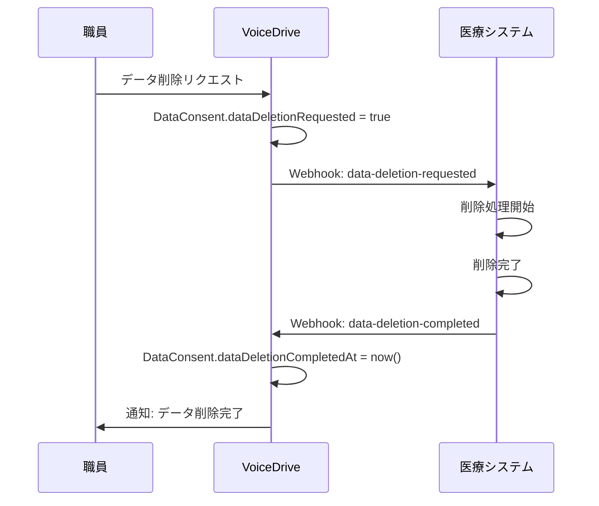

# SettingsPage DB要件分析

**文書番号**: VD-DB-2025-1026-007
**作成日**: 2025年10月26日
**作成者**: VoiceDriveチーム
**対象ページ**: SettingsPage (https://voicedrive-v100.vercel.app/settings)
**優先度**: 🟡 中（UX改善完了後）
**参照文書**: データ管理責任分界点定義書_20251008.md

---

## 📋 エグゼクティブサマリー

### ページ概要
SettingsPageは、一般ユーザー向けの設定画面です。
**2つのタブ**で構成されています：

1. **通知設定タブ** - VoiceDriveの通知受信設定
2. **データ分析同意タブ** - 職員カルテシステムへのデータ提供同意管理

### 現状の実装状況
- ✅ UIは50代・60代向けにシンプル化済み（2025-10-26実装完了）
- ✅ 通知設定は**LocalStorage**で管理（DBなし）
- ✅ データ同意設定は**Prismaテーブル**で管理済み
- ⚠️ 通知設定の詳細カテゴリ別設定は**DBに保存されていない**

### データ管理責任分担

| データカテゴリ | VoiceDrive責任 | 医療システム責任 | 備考 |
|--------------|--------------|----------------|------|
| **通知設定（全般）** | ✅ マスタ | ❌ | VoiceDrive独自機能 |
| **データ分析同意** | ✅ マスタ | ❌ | VoiceDriveが管理、医療システムは参照のみ |
| **プライバシーポリシー** | ✅ コンテンツ管理 | ❌ | VoiceDrive管理 |

**結論**: SettingsPageの全データはVoiceDrive責任範囲。医療システムとの連携は**データ同意状態の参照のみ**。

---

## 🎯 ページ機能詳細分析

### 機能1: 通知設定タブ

#### 1-1. シンプル設定（メイン）

**UI構成**:
```
【通知設定】
○ すべて受け取る（推奨）
   - すべての通知を受け取ります

○ 重要なお知らせのみ
   - 緊急連絡や面談予定など、重要な通知だけ受け取ります

○ 通知OFF
   - すべての通知を停止します

[上級者向け設定] ▼ （折りたたみ）
```

**データ構造**（現状: LocalStorage）:
```typescript
{
  userId: string,
  globalEnabled: boolean,           // 通知全体ON/OFF
  quickSetting: 'all' | 'important' | 'none',  // かんたん設定
  permission: NotificationPermission,          // ブラウザ通知許可状態
  updatedAt: Date
}
```

**課題**:
- ❌ LocalStorageのため、デバイス間で同期されない
- ❌ ログアウト後に設定が消える可能性
- ❌ 管理画面で職員の通知設定を確認できない

#### 1-2. 詳細設定（上級者向け）

**通知カテゴリ**（8カテゴリ、シフト削除済み）:
1. 人事・お知らせ (hr_announcement)
2. 面談・予約 (interview)
3. 評価 (evaluation)
4. 議題・提案 (proposal)
5. プロジェクト (project)
6. アンケート (survey)
7. 研修・教育 (training)
8. システム (system)

**各カテゴリの設定項目**:
```typescript
{
  enabled: boolean,          // カテゴリ全体のON/OFF
  priority: NotificationPriority,  // critical/high/medium/low
  sound: boolean,            // 音ON/OFF
  vibration: boolean,        // バイブON/OFF
  subTypes: {                // サブタイプ別ON/OFF
    [subTypeId: string]: boolean
  }
}
```

**例: 面談・予約カテゴリ**:
```typescript
interview: {
  enabled: true,
  priority: 'high',
  sound: true,
  vibration: false,
  subTypes: {
    confirmation: true,       // 予約確定通知
    reminder_day: true,       // 前日リマインダー
    reminder_hour: true,      // 1時間前リマインダー
    change: true,             // 変更・キャンセル通知
    summary_received: true    // 面談サマリ受信
  }
}
```

#### 1-3. 静音時間設定

```typescript
quietHours: {
  enabled: boolean,
  startTime: string,  // "22:00"
  endTime: string     // "07:00"
}
```

### 機能2: データ分析同意タブ

#### 2-1. 現在の同意状態表示

**表示項目**:
- ✅ 組織分析への同意状態（同意済み/未同意）
- 📅 同意日時
- ⚠️ 取り消し状態（取り消し済みの場合）
- 🗑️ データ削除リクエスト状態

**データソース**: `DataConsent`テーブル（Prisma）

```prisma
model DataConsent {
  id                          String    @id @default(cuid())
  userId                      String    @unique
  analyticsConsent            Boolean   @default(false)
  analyticsConsentDate        DateTime?
  personalFeedbackConsent     Boolean   @default(false)
  personalFeedbackConsentDate DateTime?
  revokeDate                  DateTime?
  dataDeletionRequested       Boolean   @default(false)
  dataDeletionRequestedAt     DateTime?
  dataDeletionCompletedAt     DateTime?
  createdAt                   DateTime  @default(now())
  updatedAt                   DateTime  @updatedAt
}
```

#### 2-2. アクション

1. **同意する** - `analyticsConsent = true`, `analyticsConsentDate = now()`
2. **同意を取り消す** - `revokeDate = now()`
3. **過去データの削除をリクエスト** - `dataDeletionRequested = true`, `dataDeletionRequestedAt = now()`
4. **プライバシーポリシーを確認** - 別ページ遷移

---

## 📊 データ管理責任分析

### カテゴリ1: 通知設定データ

| データ項目 | VoiceDrive | 医療システム | 現状の保存場所 | 推奨保存場所 |
|-----------|-----------|-------------|-------------|-------------|
| globalEnabled | ✅ マスタ | ❌ | LocalStorage | **DB（NotificationSettings）** |
| quickSetting | ✅ マスタ | ❌ | LocalStorage | **DB（NotificationSettings）** |
| カテゴリ別設定 | ✅ マスタ | ❌ | LocalStorage | **DB（NotificationSettings JSON）** |
| quietHours | ✅ マスタ | ❌ | LocalStorage | **DB（NotificationSettings）** |
| permission | ✅ マスタ | ❌ | ブラウザAPI | LocalStorage（キャッシュ） |
| deviceTokens | ✅ マスタ | ❌ | ❌ 未実装 | **DB（NotificationSettings配列）** |

**方針**:
- ✅ 通知設定は**VoiceDriveが100%責任**を持つ
- ✅ DBに保存してデバイス間同期を実現
- ✅ 医療システムは関与しない（VoiceDrive独自機能）

---

### カテゴリ2: データ分析同意

| データ項目 | VoiceDrive | 医療システム | 現状の保存場所 | 提供方法 |
|-----------|-----------|-------------|-------------|---------|
| analyticsConsent | ✅ マスタ | 参照のみ | DB（DataConsent） | API提供 |
| analyticsConsentDate | ✅ マスタ | 参照のみ | DB（DataConsent） | API提供 |
| revokeDate | ✅ マスタ | 参照のみ | DB（DataConsent） | API提供 |
| dataDeletionRequested | ✅ マスタ | 参照のみ | DB（DataConsent） | API提供 |
| dataDeletionRequestedAt | ✅ マスタ | 参照のみ | DB（DataConsent） | API提供 |
| dataDeletionCompletedAt | ✅ マスタ | 更新権限 | DB（DataConsent） | **Webhook通知** |

**方針**:
- ✅ VoiceDriveが同意状態を管理
- ✅ 医療システムは**参照のみ**（職員カルテシステムでの分析可否判定用）
- ✅ 削除完了通知は医療システムから**Webhook**で受信

**医療システムとの連携フロー**:


---

## 🔍 不足項目の洗い出し

### 不足1: 通知設定のDB保存機能

**問題**:
- 現状はLocalStorageのみ → デバイス間で同期されない
- ログアウト後に設定が消える可能性
- 管理画面で職員の通知設定を確認できない

**解決策**:
Prismaの`NotificationSettings`テーブルを拡張

**現状のスキーマ**:
```prisma
model NotificationSettings {
  id                       String   @id @default(cuid())
  userId                   String   @unique
  enableEmailNotifications Boolean  @default(true)
  enablePushNotifications  Boolean  @default(true)
  enableSmsNotifications   Boolean  @default(false)
  reminderDaysBefore       Int      @default(3)
  enableDeadlineReminder   Boolean  @default(true)
  autoMarkAsRead           Boolean  @default(false)
  quietHoursStart          String?
  quietHoursEnd            String?
  enableQuietHours         Boolean  @default(false)
  createdAt                DateTime @default(now())
  updatedAt                DateTime @updatedAt
  user                     User     @relation(fields: [userId], references: [id])
}
```

**拡張後のスキーマ案**:
```prisma
model NotificationSettings {
  id                       String   @id @default(cuid())
  userId                   String   @unique

  // 🆕 シンプル設定
  globalEnabled            Boolean  @default(true)
  quickSetting             String   @default("important") // 'all' | 'important' | 'none'

  // 🆕 詳細設定（JSON形式）
  categories               Json?    // カテゴリ別設定

  // 🆕 デバイス管理
  deviceTokens             Json?    // プッシュ通知用デバイストークン配列

  // 既存フィールド（互換性維持）
  enableEmailNotifications Boolean  @default(true)
  enablePushNotifications  Boolean  @default(true)
  enableSmsNotifications   Boolean  @default(false)
  reminderDaysBefore       Int      @default(3)
  enableDeadlineReminder   Boolean  @default(true)
  autoMarkAsRead           Boolean  @default(false)
  quietHoursStart          String?
  quietHoursEnd            String?
  enableQuietHours         Boolean  @default(false)

  createdAt                DateTime @default(now())
  updatedAt                DateTime @updatedAt
  user                     User     @relation(fields: [userId], references: [id], onDelete: Cascade)

  @@map("notification_settings")
}
```

**categoriesフィールドの構造**:
```json
{
  "hr_announcement": {
    "enabled": true,
    "priority": "high",
    "sound": true,
    "vibration": true,
    "subTypes": {
      "emergency": true,
      "important": true,
      "general": true
    }
  },
  "interview": {
    "enabled": true,
    "priority": "high",
    "sound": true,
    "vibration": false,
    "subTypes": {
      "confirmation": true,
      "reminder_day": true,
      "reminder_hour": true,
      "change": true,
      "summary_received": true
    }
  }
  // ... 他のカテゴリ
}
```

---

### 不足2: プッシュ通知デバイストークン管理

**問題**:
- PWA（Progressive Web App）でプッシュ通知を実装する際、デバイストークンの保存場所がない
- 複数デバイス（PC、スマホ、タブレット）での通知管理が必要

**解決策**:
`deviceTokens` JSONフィールドを追加

**構造案**:
```json
[
  {
    "token": "BPW-...",
    "deviceType": "desktop",
    "browser": "Chrome",
    "os": "Windows 11",
    "registeredAt": "2025-10-26T10:00:00Z",
    "lastUsedAt": "2025-10-26T15:30:00Z",
    "isActive": true
  },
  {
    "token": "BPW-...",
    "deviceType": "mobile",
    "browser": "Safari",
    "os": "iOS 17",
    "registeredAt": "2025-10-25T08:00:00Z",
    "lastUsedAt": "2025-10-26T14:00:00Z",
    "isActive": true
  }
]
```

---

### 不足3: データ削除完了Webhook受信エンドポイント

**問題**:
- 医療システムからの削除完了通知を受信するエンドポイントがない

**解決策**:
Webhookエンドポイント実装

**エンドポイント**: `POST /api/webhooks/medical-system/data-deletion-completed`

**ペイロード例**:
```json
{
  "event": "data_deletion.completed",
  "timestamp": "2025-10-26T16:00:00Z",
  "source": "medical-system",
  "data": {
    "userId": "user-123",
    "employeeId": "EMP-2025-001",
    "deletionRequestedAt": "2025-10-20T10:00:00Z",
    "deletionCompletedAt": "2025-10-26T16:00:00Z",
    "deletedDataTypes": [
      "VoiceDrive活動データ",
      "職員カルテ分析データ"
    ]
  }
}
```

**処理ロジック**:
```typescript
// src/controllers/webhookController.ts
export async function handleDataDeletionCompleted(req, res) {
  const { userId, deletionCompletedAt } = req.body.data;

  // DataConsentテーブル更新
  await prisma.dataConsent.update({
    where: { userId },
    data: {
      dataDeletionCompletedAt: new Date(deletionCompletedAt)
    }
  });

  // ユーザーに通知
  await NotificationService.send({
    userId,
    category: 'system',
    title: 'データ削除完了',
    message: 'リクエストされたデータの削除が完了しました。'
  });

  res.status(200).json({ success: true });
}
```

---

### 不足4: 通知設定API（バックエンド）

**問題**:
- 現状はフロントエンドのLocalStorageのみ
- バックエンドAPIがない

**解決策**:
RESTful API実装

**エンドポイント一覧**:

| メソッド | エンドポイント | 機能 |
|---------|--------------|------|
| GET | `/api/users/:userId/notification-settings` | 通知設定取得 |
| PUT | `/api/users/:userId/notification-settings` | 通知設定更新 |
| POST | `/api/users/:userId/notification-settings/reset` | 通知設定リセット |
| POST | `/api/users/:userId/notification-settings/devices` | デバイストークン登録 |
| DELETE | `/api/users/:userId/notification-settings/devices/:token` | デバイストークン削除 |

**実装例**:
```typescript
// src/routes/notificationSettingsRoutes.ts
import express from 'express';
import { authenticateJWT } from '../middleware/auth';

const router = express.Router();

// 通知設定取得
router.get('/users/:userId/notification-settings', authenticateJWT, async (req, res) => {
  const { userId } = req.params;

  const settings = await prisma.notificationSettings.findUnique({
    where: { userId }
  });

  if (!settings) {
    // デフォルト設定を返す
    return res.json({
      globalEnabled: true,
      quickSetting: 'important',
      categories: NOTIFICATION_PRESETS.recommended.categories,
      quietHoursStart: null,
      quietHoursEnd: null,
      enableQuietHours: false
    });
  }

  res.json(settings);
});

// 通知設定更新
router.put('/users/:userId/notification-settings', authenticateJWT, async (req, res) => {
  const { userId } = req.params;
  const updates = req.body;

  const settings = await prisma.notificationSettings.upsert({
    where: { userId },
    update: {
      ...updates,
      updatedAt: new Date()
    },
    create: {
      userId,
      ...updates
    }
  });

  res.json(settings);
});
```

---

## 📋 schema.prisma更新案

### 更新内容

```prisma
model NotificationSettings {
  id                       String   @id @default(cuid())
  userId                   String   @unique @map("user_id")

  // 🆕 シンプル設定（Phase 1: 2025-10-26実装）
  globalEnabled            Boolean  @default(true) @map("global_enabled")
  quickSetting             String   @default("important") @map("quick_setting")

  // 🆕 詳細設定（Phase 2: JSON形式）
  categories               Json?    @map("categories")

  // 🆕 デバイス管理（Phase 3: PWA対応）
  deviceTokens             Json?    @map("device_tokens")

  // 既存フィールド（互換性維持）
  enableEmailNotifications Boolean  @default(true) @map("enable_email_notifications")
  enablePushNotifications  Boolean  @default(true) @map("enable_push_notifications")
  enableSmsNotifications   Boolean  @default(false) @map("enable_sms_notifications")
  reminderDaysBefore       Int      @default(3) @map("reminder_days_before")
  enableDeadlineReminder   Boolean  @default(true) @map("enable_deadline_reminder")
  autoMarkAsRead           Boolean  @default(false) @map("auto_mark_as_read")
  quietHoursStart          String?  @map("quiet_hours_start")
  quietHoursEnd            String?  @map("quiet_hours_end")
  enableQuietHours         Boolean  @default(false) @map("enable_quiet_hours")

  createdAt                DateTime @default(now()) @map("created_at")
  updatedAt                DateTime @updatedAt @map("updated_at")
  user                     User     @relation(fields: [userId], references: [id], onDelete: Cascade)

  @@map("notification_settings")
  @@index([userId])
  @@index([quickSetting])
}

model DataConsent {
  id                          String    @id @default(cuid())
  userId                      String    @unique
  analyticsConsent            Boolean   @default(false)
  analyticsConsentDate        DateTime?
  personalFeedbackConsent     Boolean   @default(false)
  personalFeedbackConsentDate DateTime?
  revokeDate                  DateTime?
  dataDeletionRequested       Boolean   @default(false)
  dataDeletionRequestedAt     DateTime?
  dataDeletionCompletedAt     DateTime?  // 🆕 Webhook受信用
  createdAt                   DateTime  @default(now())
  updatedAt                   DateTime  @updatedAt

  @@index([userId])
  @@index([analyticsConsent])
  @@index([dataDeletionRequested])
}
```

---

## 🚀 実装ロードマップ

### Phase 1: UI改善（完了済み）✅
- ✅ 50代・60代向けシンプル化
- ✅ 「シフト・勤務」カテゴリ削除
- ✅ 大きなボタン、明確な文言

### Phase 2: DB保存実装（優先度: 中）

**期間**: 1週間

| 日程 | 作業内容 | 状態 |
|------|---------|------|
| Day 1 | schema.prisma更新（globalEnabled, quickSetting, categories追加） | ⏳ 準備中 |
| Day 2 | マイグレーション実行 | ⏳ 準備中 |
| Day 3 | notificationSettingsRoutes実装 | ⏳ 準備中 |
| Day 4 | useNotificationSettings修正（LocalStorage → API） | ⏳ 準備中 |
| Day 5 | 統合テスト | ⏳ 準備中 |

### Phase 3: Webhook実装（優先度: 低）

**期間**: 2日

| 日程 | 作業内容 | 状態 |
|------|---------|------|
| Day 1 | Webhook受信エンドポイント実装 | ⏳ 待機中 |
| Day 2 | 医療システムとの統合テスト | ⏳ 待機中 |

### Phase 4: PWA対応（優先度: 低）

**期間**: 3日

| 日程 | 作業内容 | 状態 |
|------|---------|------|
| Day 1 | deviceTokens管理API実装 | ⏳ 待機中 |
| Day 2 | プッシュ通知サービス実装 | ⏳ 待機中 |
| Day 3 | PWA統合テスト | ⏳ 待機中 |

---

## ✅ 成功指標（KPI）

| 指標 | 目標値 | 測定方法 |
|------|--------|---------|
| **デバイス間同期成功率** | > 99% | ログ分析 |
| **設定保存エラー率** | < 0.1% | エラーログ |
| **API応答時間** | < 200ms | パフォーマンス測定 |
| **LocalStorage→DB移行成功率** | 100% | マイグレーションログ |
| **ユーザー体験** | 設定変更後の即時反映 | ユーザーフィードバック |

---

## 📞 次のアクション

### VoiceDriveチームの即座対応
1. ✅ 本分析書を作成（完了）
2. ⏳ schema.prisma更新案のレビュー
3. ⏳ Phase 2実装スケジュール調整
4. ⏳ 医療システムチームへWebhook仕様共有

### 医療システムチームへの確認事項
1. ⏳ データ削除完了Webhook送信可能か確認
2. ⏳ VoiceDriveの`DataConsent`テーブル参照API仕様確認
3. ⏳ データ削除処理の所要時間確認（SLA設定用）

---

**文書終了**

最終更新: 2025年10月26日
バージョン: 1.0
次回レビュー: Phase 2実装開始時
