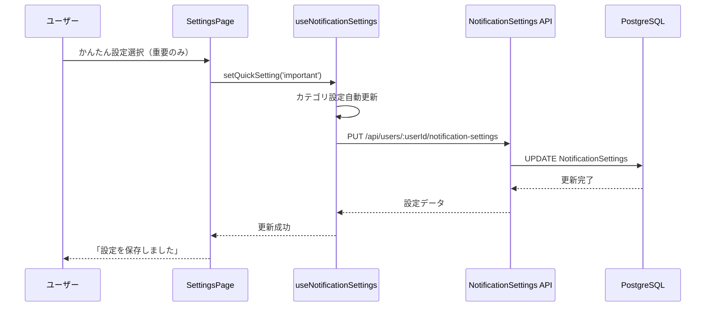
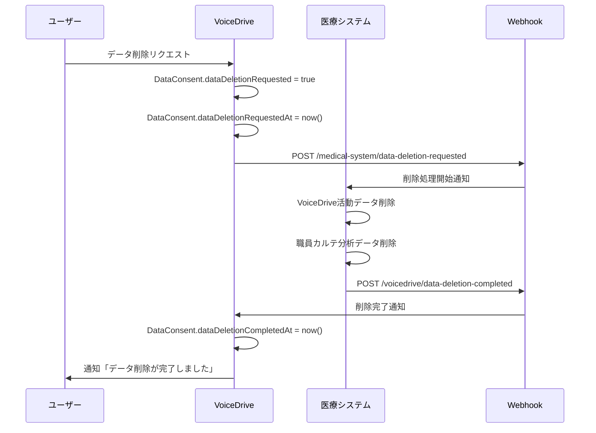

# SettingsPage 暫定マスターリスト

**文書番号**: VD-MASTER-2025-1026-007
**作成日**: 2025年10月26日
**作成者**: VoiceDriveチーム
**対象ページ**: SettingsPage
**総データ項目数**: **29項目**
**参照文書**: SettingsPage_DB要件分析_20251026.md

---

## 📋 データ項目サマリー

### カテゴリ別集計

| カテゴリ | 項目数 | VoiceDrive管理 | 医療システム管理 | LocalStorage | DB必要 |
|---------|--------|--------------|----------------|-------------|-------|
| **通知設定（基本）** | 4 | 4 | 0 | 4 | ✅ 4 |
| **通知設定（詳細）** | 11 | 11 | 0 | 11 | ✅ 11 |
| **静音時間** | 3 | 3 | 0 | 3 | ✅ 3 |
| **データ分析同意** | 8 | 8 | 0 (参照のみ) | 0 | ✅ 8（既存） |
| **デバイス管理** | 3 | 3 | 0 | 0 | ✅ 3（新規） |
| **合計** | **29** | **29** | **0** | **18** | **29** |

### データソース別集計

| データソース | 項目数 | 備考 |
|------------|--------|------|
| **LocalStorage（現状）** | 18 | 通知設定全般 |
| **NotificationSettings（DB）** | 18 | LocalStorageから移行予定 |
| **DataConsent（DB）** | 8 | 既存実装 |
| **ブラウザAPI（permission）** | 1 | Notification.permission |
| **未実装（デバイストークン）** | 3 | PWA対応時に実装 |

---

## 📊 全データ項目詳細リスト

### セクション1: 通知設定（基本） - 4項目

#### 項目1.1: userId
| 属性 | 値 |
|------|-----|
| **項目ID** | SETTINGS-001 |
| **項目名（日本語）** | ユーザーID |
| **項目名（英語）** | userId |
| **データ型** | String (cuid) |
| **必須/任意** | 必須 |
| **デフォルト値** | - |
| **現在の保存場所** | LocalStorage |
| **推奨保存場所** | NotificationSettings.userId (DB) |
| **データ責任** | 🟢 VoiceDrive |
| **医療システム連携** | ❌ なし |
| **表示場所** | （内部ID、表示なし） |
| **用途** | 通知設定の紐付け |
| **バリデーション** | cuid形式 |
| **備考** | User.idと外部キー制約 |

---

#### 項目1.2: globalEnabled
| 属性 | 値 |
|------|-----|
| **項目ID** | SETTINGS-002 |
| **項目名（日本語）** | 通知全体ON/OFF |
| **項目名（英語）** | globalEnabled |
| **データ型** | Boolean |
| **必須/任意** | 必須 |
| **デフォルト値** | true |
| **現在の保存場所** | LocalStorage |
| **推奨保存場所** | NotificationSettings.globalEnabled (DB) |
| **データ責任** | 🟢 VoiceDrive |
| **医療システム連携** | ❌ なし |
| **表示場所** | （現在は表示なし、内部制御用） |
| **用途** | 通知全体の有効/無効制御 |
| **バリデーション** | true/false |
| **備考** | シンプル設定導入後は非表示（noneモードで無効化） |

---

#### 項目1.3: quickSetting
| 属性 | 値 |
|------|-----|
| **項目ID** | SETTINGS-003 |
| **項目名（日本語）** | かんたん設定 |
| **項目名（英語）** | quickSetting |
| **データ型** | Enum String |
| **許可値** | 'all' \| 'important' \| 'none' |
| **必須/任意** | 必須 |
| **デフォルト値** | 'important' |
| **現在の保存場所** | LocalStorage |
| **推奨保存場所** | NotificationSettings.quickSetting (DB) |
| **データ責任** | 🟢 VoiceDrive |
| **医療システム連携** | ❌ なし |
| **表示場所** | SettingsPage > 通知タブ > メイン設定 |
| **表示形式** | 大きな選択ボタン（3つ） |
| **用途** | ユーザーの通知設定パターン |
| **バリデーション** | 'all', 'important', 'none'のいずれか |
| **UI表示** | <br>○ すべて受け取る（推奨）<br>○ 重要なお知らせのみ<br>○ 通知OFF |
| **備考** | 選択時に各カテゴリ設定を自動更新 |

---

#### 項目1.4: permission
| 属性 | 値 |
|------|-----|
| **項目ID** | SETTINGS-004 |
| **項目名（日本語）** | ブラウザ通知許可状態 |
| **項目名（英語）** | permission |
| **データ型** | NotificationPermission ('default' \| 'granted' \| 'denied') |
| **必須/任意** | 必須 |
| **デフォルト値** | 'default' |
| **現在の保存場所** | ブラウザAPI（Notification.permission） |
| **推奨保存場所** | LocalStorage（キャッシュ） |
| **データ責任** | 🟢 VoiceDrive |
| **医療システム連携** | ❌ なし |
| **表示場所** | SettingsPage > 通知タブ > 権限警告バナー |
| **表示形式** | 黄色の警告バナー（granted以外の場合） |
| **用途** | プッシュ通知許可状態の確認 |
| **バリデーション** | ブラウザAPIから取得 |
| **備考** | ユーザーがブラウザ設定で変更可能 |

---

### セクション2: 通知設定（詳細カテゴリ別） - 11項目

#### 項目2.1: categories
| 属性 | 値 |
|------|-----|
| **項目ID** | SETTINGS-005 |
| **項目名（日本語）** | 通知カテゴリ設定 |
| **項目名（英語）** | categories |
| **データ型** | JSON |
| **必須/任意** | 任意（上級者向け） |
| **デフォルト値** | NOTIFICATION_PRESETS.recommended |
| **現在の保存場所** | LocalStorage |
| **推奨保存場所** | NotificationSettings.categories (DB, JSON型) |
| **データ責任** | 🟢 VoiceDrive |
| **医療システム連携** | ❌ なし |
| **表示場所** | SettingsPage > 通知タブ > 上級者向け設定（折りたたみ） |
| **表示形式** | カテゴリ別展開リスト |
| **用途** | カテゴリ別の詳細通知設定 |
| **JSON構造** | `{ [category]: CategorySettings }` |
| **カテゴリ数** | 8カテゴリ（shift削除済み） |
| **備考** | 各カテゴリの詳細は項目2.2〜2.12参照 |

---

#### 項目2.2: categories.hr_announcement
| 属性 | 値 |
|------|-----|
| **項目ID** | SETTINGS-006 |
| **カテゴリ名** | 人事・お知らせ |
| **カテゴリID** | hr_announcement |
| **アイコン** | 📢 |
| **説明** | 人事部からの重要なお知らせや連絡事項 |
| **デフォルト enabled** | true |
| **デフォルト priority** | high |
| **デフォルト sound** | true |
| **デフォルト vibration** | true |
| **サブタイプ** | emergency (必須), important, general |
| **サブタイプ数** | 3 |
| **備考** | emergency は必須通知（無効化不可） |

---

#### 項目2.3: categories.interview
| 属性 | 値 |
|------|-----|
| **項目ID** | SETTINGS-007 |
| **カテゴリ名** | 面談・予約 |
| **カテゴリID** | interview |
| **アイコン** | 📅 |
| **説明** | 面談の予約確認やリマインダー、面談サマリ受信 |
| **デフォルト enabled** | true |
| **デフォルト priority** | high |
| **デフォルト sound** | true |
| **デフォルト vibration** | false |
| **サブタイプ** | confirmation, reminder_day, reminder_hour, change, summary_received |
| **サブタイプ数** | 5 |
| **備考** | リマインダーは重要度高 |

---

#### 項目2.4: categories.evaluation
| 属性 | 値 |
|------|-----|
| **項目ID** | SETTINGS-008 |
| **カテゴリ名** | 評価 |
| **カテゴリID** | evaluation |
| **アイコン** | 📊 |
| **説明** | 評価期間の通知や結果、評価フィードバック |
| **デフォルト enabled** | true |
| **デフォルト priority** | medium |
| **デフォルト sound** | false |
| **デフォルト vibration** | false |
| **サブタイプ** | period_start, deadline, complete, feedback, appeal |
| **サブタイプ数** | 5 |
| **備考** | フィードバック受信は重要 |

---

#### 項目2.5: categories.proposal
| 属性 | 値 |
|------|-----|
| **項目ID** | SETTINGS-009 |
| **カテゴリ名** | 議題・提案 |
| **カテゴリID** | proposal |
| **アイコン** | 💡 |
| **説明** | アイデアボイスから議題化された提案の通知 |
| **デフォルト enabled** | true |
| **デフォルト priority** | high |
| **デフォルト sound** | true |
| **デフォルト vibration** | false |
| **サブタイプ** | adopted, progress, voting, completed |
| **サブタイプ数** | 4 |
| **備考** | 採用通知は特に重要 |

---

#### 項目2.6: categories.project
| 属性 | 値 |
|------|-----|
| **項目ID** | SETTINGS-010 |
| **カテゴリ名** | プロジェクト |
| **カテゴリID** | project |
| **アイコン** | 🚀 |
| **説明** | プロジェクトへの招集や進捗連絡 |
| **デフォルト enabled** | true |
| **デフォルト priority** | medium |
| **デフォルト sound** | false |
| **デフォルト vibration** | false |
| **サブタイプ** | invitation, emergency, progress, complete |
| **サブタイプ数** | 4 |
| **備考** | 緊急招集は優先度高 |

---

#### 項目2.7: categories.survey
| 属性 | 値 |
|------|-----|
| **項目ID** | SETTINGS-011 |
| **カテゴリ名** | アンケート |
| **カテゴリID** | survey |
| **アイコン** | 📋 |
| **説明** | アンケートや調査への協力依頼 |
| **デフォルト enabled** | false |
| **デフォルト priority** | low |
| **デフォルト sound** | false |
| **デフォルト vibration** | false |
| **サブタイプ** | new, reminder, mandatory |
| **サブタイプ数** | 3 |
| **備考** | デフォルトOFF（重要度低） |

---

#### 項目2.8: categories.training
| 属性 | 値 |
|------|-----|
| **項目ID** | SETTINGS-012 |
| **カテゴリ名** | 研修・教育 |
| **カテゴリID** | training |
| **アイコン** | 🎓 |
| **説明** | 研修案内や資格更新のお知らせ |
| **デフォルト enabled** | true |
| **デフォルト priority** | medium |
| **デフォルト sound** | false |
| **デフォルト vibration** | false |
| **サブタイプ** | invitation, mandatory, license |
| **サブタイプ数** | 3 |
| **備考** | 必須研修は重要 |

---

#### 項目2.9: categories.system
| 属性 | 値 |
|------|-----|
| **項目ID** | SETTINGS-013 |
| **カテゴリ名** | システム |
| **カテゴリID** | system |
| **アイコン** | ⚙️ |
| **説明** | システムメンテナンスやアップデート情報 |
| **デフォルト enabled** | true |
| **デフォルト priority** | low |
| **デフォルト sound** | false |
| **デフォルト vibration** | false |
| **サブタイプ** | maintenance, update, error |
| **サブタイプ数** | 3 |
| **備考** | メンテナンス通知は重要 |

---

#### 項目2.10: CategorySettings.enabled
| 属性 | 値 |
|------|-----|
| **項目ID** | SETTINGS-014 |
| **項目名（日本語）** | カテゴリ有効化 |
| **項目名（英語）** | enabled |
| **データ型** | Boolean |
| **必須/任意** | 必須 |
| **デフォルト値** | カテゴリにより異なる |
| **用途** | カテゴリ全体のON/OFF |
| **バリデーション** | true/false |
| **備考** | これがfalseの場合、サブタイプに関わらず通知なし |

---

#### 項目2.11: CategorySettings.priority
| 属性 | 値 |
|------|-----|
| **項目ID** | SETTINGS-015 |
| **項目名（日本語）** | 通知優先度 |
| **項目名（英語）** | priority |
| **データ型** | Enum String |
| **許可値** | 'critical' \| 'high' \| 'medium' \| 'low' |
| **必須/任意** | 必須 |
| **デフォルト値** | カテゴリにより異なる |
| **用途** | 通知の重要度設定 |
| **バリデーション** | 4段階のいずれか |
| **備考** | 将来的に通知音・表示スタイル制御に使用 |

---

#### 項目2.12: CategorySettings.sound
| 属性 | 値 |
|------|-----|
| **項目ID** | SETTINGS-016 |
| **項目名（日本語）** | 音通知 |
| **項目名（英語）** | sound |
| **データ型** | Boolean |
| **必須/任意** | 必須 |
| **デフォルト値** | カテゴリにより異なる |
| **用途** | 通知受信時の音ON/OFF |
| **バリデーション** | true/false |
| **備考** | PWA対応時に実装 |

---

#### 項目2.13: CategorySettings.vibration
| 属性 | 値 |
|------|-----|
| **項目ID** | SETTINGS-017 |
| **項目名（日本語）** | バイブレーション通知 |
| **項目名（英語）** | vibration |
| **データ型** | Boolean |
| **必須/任意** | 必須 |
| **デフォルト値** | カテゴリにより異なる |
| **用途** | モバイルデバイスでのバイブON/OFF |
| **バリデーション** | true/false |
| **備考** | PWA対応時に実装 |

---

#### 項目2.14: CategorySettings.subTypes
| 属性 | 値 |
|------|-----|
| **項目ID** | SETTINGS-018 |
| **項目名（日本語）** | サブタイプ設定 |
| **項目名（英語）** | subTypes |
| **データ型** | Object<string, boolean> |
| **必須/任意** | 任意 |
| **デフォルト値** | カテゴリにより異なる |
| **用途** | 通知タイプ別の詳細ON/OFF |
| **構造** | `{ [subTypeId]: boolean }` |
| **例** | `{ emergency: true, important: true, general: false }` |
| **備考** | mandatory属性があるサブタイプは無効化不可 |

---

### セクション3: 静音時間設定 - 3項目

#### 項目3.1: enableQuietHours
| 属性 | 値 |
|------|-----|
| **項目ID** | SETTINGS-019 |
| **項目名（日本語）** | 静音時間有効化 |
| **項目名（英語）** | enableQuietHours |
| **データ型** | Boolean |
| **必須/任意** | 必須 |
| **デフォルト値** | false |
| **現在の保存場所** | LocalStorage |
| **推奨保存場所** | NotificationSettings.enableQuietHours (DB) |
| **データ責任** | 🟢 VoiceDrive |
| **医療システム連携** | ❌ なし |
| **表示場所** | SettingsPage > 通知タブ > 上級者向け設定 > 静音時間 |
| **表示形式** | トグルスイッチ |
| **用途** | 静音時間機能のON/OFF |
| **備考** | これがfalseの場合、quietHoursStart/Endは無視 |

---

#### 項目3.2: quietHoursStart
| 属性 | 値 |
|------|-----|
| **項目ID** | SETTINGS-020 |
| **項目名（日本語）** | 静音時間開始 |
| **項目名（英語）** | quietHoursStart |
| **データ型** | String (HH:mm形式) |
| **必須/任意** | 任意（enableQuietHoursがtrueの場合は必須） |
| **デフォルト値** | "22:00" |
| **現在の保存場所** | LocalStorage |
| **推奨保存場所** | NotificationSettings.quietHoursStart (DB) |
| **データ責任** | 🟢 VoiceDrive |
| **医療システム連携** | ❌ なし |
| **表示場所** | SettingsPage > 通知タブ > 上級者向け設定 > 静音時間 |
| **表示形式** | 時刻入力フィールド |
| **用途** | 静音時間の開始時刻 |
| **バリデーション** | HH:mm形式、00:00〜23:59 |
| **備考** | 日をまたぐ設定可能（例: 22:00〜07:00） |

---

#### 項目3.3: quietHoursEnd
| 属性 | 値 |
|------|-----|
| **項目ID** | SETTINGS-021 |
| **項目名（日本語）** | 静音時間終了 |
| **項目名（英語）** | quietHoursEnd |
| **データ型** | String (HH:mm形式) |
| **必須/任意** | 任意（enableQuietHoursがtrueの場合は必須） |
| **デフォルト値** | "07:00" |
| **現在の保存場所** | LocalStorage |
| **推奨保存場所** | NotificationSettings.quietHoursEnd (DB) |
| **データ責任** | 🟢 VoiceDrive |
| **医療システム連携** | ❌ なし |
| **表示場所** | SettingsPage > 通知タブ > 上級者向け設定 > 静音時間 |
| **表示形式** | 時刻入力フィールド |
| **用途** | 静音時間の終了時刻 |
| **バリデーション** | HH:mm形式、00:00〜23:59 |
| **備考** | startTimeより小さい値の場合は翌日とみなす |

---

### セクション4: データ分析同意 - 8項目

#### 項目4.1: userId (DataConsent)
| 属性 | 値 |
|------|-----|
| **項目ID** | SETTINGS-022 |
| **項目名（日本語）** | ユーザーID |
| **項目名（英語）** | userId |
| **データ型** | String (cuid) |
| **必須/任意** | 必須 |
| **デフォルト値** | - |
| **現在の保存場所** | DataConsent.userId (DB) |
| **推奨保存場所** | （変更なし） |
| **データ責任** | 🟢 VoiceDrive |
| **医療システム連携** | 🔵 参照のみ |
| **表示場所** | （内部ID、表示なし） |
| **用途** | データ同意の紐付け |
| **備考** | ユニーク制約あり |

---

#### 項目4.2: analyticsConsent
| 属性 | 値 |
|------|-----|
| **項目ID** | SETTINGS-023 |
| **項目名（日本語）** | 組織分析への同意 |
| **項目名（英語）** | analyticsConsent |
| **データ型** | Boolean |
| **必須/任意** | 必須 |
| **デフォルト値** | false |
| **現在の保存場所** | DataConsent.analyticsConsent (DB) |
| **推奨保存場所** | （変更なし） |
| **データ責任** | 🟢 VoiceDrive |
| **医療システム連携** | 🔵 参照のみ（職員カルテシステム） |
| **表示場所** | SettingsPage > データ分析同意タブ > 現在の同意状態 |
| **表示形式** | ✅ 同意済み / ❌ 未同意 |
| **用途** | VoiceDrive活動データを職員カルテで分析可否 |
| **備考** | trueの場合、投稿・投票・コメントデータが医療システムと連携 |

---

#### 項目4.3: analyticsConsentDate
| 属性 | 値 |
|------|-----|
| **項目ID** | SETTINGS-024 |
| **項目名（日本語）** | 同意日時 |
| **項目名（英語）** | analyticsConsentDate |
| **データ型** | DateTime (nullable) |
| **必須/任意** | 任意（同意時に自動設定） |
| **デフォルト値** | null |
| **現在の保存場所** | DataConsent.analyticsConsentDate (DB) |
| **推奨保存場所** | （変更なし） |
| **データ責任** | 🟢 VoiceDrive |
| **医療システム連携** | 🔵 参照のみ |
| **表示場所** | SettingsPage > データ分析同意タブ > 同意日時 |
| **表示形式** | "2025年10月26日 10:30" |
| **用途** | 同意した日時の記録 |
| **備考** | analyticsConsentがtrueの場合に設定 |

---

#### 項目4.4: personalFeedbackConsent
| 属性 | 値 |
|------|-----|
| **項目ID** | SETTINGS-025 |
| **項目名（日本語）** | 個別フィードバック同意 |
| **項目名（英語）** | personalFeedbackConsent |
| **データ型** | Boolean |
| **必須/任意** | 必須 |
| **デフォルト値** | false |
| **現在の保存場所** | DataConsent.personalFeedbackConsent (DB) |
| **推奨保存場所** | （変更なし） |
| **データ責任** | 🟢 VoiceDrive |
| **医療システム連携** | ❌ なし |
| **表示場所** | （現在は非表示、将来機能用） |
| **用途** | AIによる個別フィードバック受信の同意 |
| **備考** | 将来機能、現在は未使用 |

---

#### 項目4.5: revokeDate
| 属性 | 値 |
|------|-----|
| **項目ID** | SETTINGS-026 |
| **項目名（日本語）** | 同意取り消し日時 |
| **項目名（英語）** | revokeDate |
| **データ型** | DateTime (nullable) |
| **必須/任意** | 任意 |
| **デフォルト値** | null |
| **現在の保存場所** | DataConsent.revokeDate (DB) |
| **推奨保存場所** | （変更なし） |
| **データ責任** | 🟢 VoiceDrive |
| **医療システム連携** | 🔵 参照のみ |
| **表示場所** | SettingsPage > データ分析同意タブ > 取り消し状態 |
| **表示形式** | "2025年10月26日 15:00 に取り消し済み" |
| **用途** | 同意を取り消した日時の記録 |
| **備考** | nullでない場合、今後のデータは分析対象外 |

---

#### 項目4.6: dataDeletionRequested
| 属性 | 値 |
|------|-----|
| **項目ID** | SETTINGS-027 |
| **項目名（日本語）** | データ削除リクエスト状態 |
| **項目名（英語）** | dataDeletionRequested |
| **データ型** | Boolean |
| **必須/任意** | 必須 |
| **デフォルト値** | false |
| **現在の保存場所** | DataConsent.dataDeletionRequested (DB) |
| **推奨保存場所** | （変更なし） |
| **データ責任** | 🟢 VoiceDrive |
| **医療システム連携** | 🔵 Webhook通知（リクエスト時） |
| **表示場所** | SettingsPage > データ分析同意タブ > データ削除状態 |
| **表示形式** | "データ削除リクエスト受付済み" |
| **用途** | 過去データ削除のリクエスト状態 |
| **備考** | trueの場合、医療システムに削除処理Webhook送信済み |

---

#### 項目4.7: dataDeletionRequestedAt
| 属性 | 値 |
|------|-----|
| **項目ID** | SETTINGS-028 |
| **項目名（日本語）** | データ削除リクエスト日時 |
| **項目名（英語）** | dataDeletionRequestedAt |
| **データ型** | DateTime (nullable) |
| **必須/任意** | 任意（リクエスト時に自動設定） |
| **デフォルト値** | null |
| **現在の保存場所** | DataConsent.dataDeletionRequestedAt (DB) |
| **推奨保存場所** | （変更なし） |
| **データ責任** | 🟢 VoiceDrive |
| **医療システム連携** | 🔵 参照のみ |
| **表示場所** | SettingsPage > データ分析同意タブ |
| **表示形式** | "(2025年10月26日 16:00)" |
| **用途** | 削除リクエストした日時の記録 |
| **備考** | dataDeletionRequestedがtrueの場合に設定 |

---

#### 項目4.8: dataDeletionCompletedAt
| 属性 | 値 |
|------|-----|
| **項目ID** | SETTINGS-029 |
| **項目名（日本語）** | データ削除完了日時 |
| **項目名（英語）** | dataDeletionCompletedAt |
| **データ型** | DateTime (nullable) |
| **必須/任意** | 任意（Webhook受信時に設定） |
| **デフォルト値** | null |
| **現在の保存場所** | DataConsent.dataDeletionCompletedAt (DB) |
| **推奨保存場所** | （変更なし） |
| **データ責任** | 🟢 VoiceDrive（更新は医療システムからのWebhook） |
| **医療システム連携** | 🔵 Webhook通知（完了時） |
| **表示場所** | SettingsPage > データ分析同意タブ |
| **表示形式** | "削除完了: 2025年10月27日 10:00" |
| **用途** | 医療システム側での削除完了日時 |
| **備考** | 🆕 Webhook受信用フィールド（Phase 2実装） |

---

### セクション5: デバイス管理（PWA対応） - 3項目

#### 項目5.1: deviceTokens
| 属性 | 値 |
|------|-----|
| **項目ID** | SETTINGS-030（未実装） |
| **項目名（日本語）** | デバイストークン配列 |
| **項目名（英語）** | deviceTokens |
| **データ型** | JSON Array |
| **必須/任意** | 任意 |
| **デフォルト値** | [] |
| **現在の保存場所** | ❌ 未実装 |
| **推奨保存場所** | NotificationSettings.deviceTokens (DB, JSON型) |
| **データ責任** | 🟢 VoiceDrive |
| **医療システム連携** | ❌ なし |
| **表示場所** | （管理画面のみ、一般ユーザーには非表示） |
| **用途** | プッシュ通知送信先デバイスの管理 |
| **配列要素** | DeviceToken型（下記参照） |
| **備考** | PWA対応時に実装（Phase 4） |

---

#### 項目5.2: DeviceToken.token
| 属性 | 値 |
|------|-----|
| **項目ID** | SETTINGS-031（未実装） |
| **項目名（日本語）** | デバイストークン |
| **項目名（英語）** | token |
| **データ型** | String |
| **必須/任意** | 必須 |
| **デフォルト値** | - |
| **用途** | プッシュ通知用のデバイス識別子 |
| **形式** | "BPW-..." (Web Push API形式) |
| **備考** | ブラウザから取得 |

---

#### 項目5.3: DeviceToken.deviceType
| 属性 | 値 |
|------|-----|
| **項目ID** | SETTINGS-032（未実装） |
| **項目名（日本語）** | デバイス種別 |
| **項目名（英語）** | deviceType |
| **データ型** | Enum String |
| **許可値** | 'desktop' \| 'mobile' \| 'tablet' |
| **必須/任意** | 必須 |
| **デフォルト値** | - |
| **用途** | デバイスタイプの識別 |
| **備考** | User-Agentから判定 |

---

## 🔄 データフロー図

### フロー1: 通知設定の保存



---

### フロー2: データ削除リクエスト



---

## 📊 医療システム連携API仕様

### API 1: データ同意状態取得

**エンドポイント**: `GET /api/voicedrive/users/:userId/consent-status`

**用途**: 医療システムが職員カルテ分析前に同意状態を確認

**リクエスト**:
```http
GET /api/voicedrive/users/user-123/consent-status
Authorization: Bearer {jwt_token}
```

**レスポンス**:
```json
{
  "userId": "user-123",
  "employeeId": "EMP-2025-001",
  "analyticsConsent": true,
  "analyticsConsentDate": "2025-10-01T09:00:00Z",
  "revokeDate": null,
  "dataDeletionRequested": false,
  "canAnalyze": true
}
```

---

### API 2: データ削除完了通知（Webhook）

**エンドポイント**: `POST /api/webhooks/medical-system/data-deletion-completed`

**用途**: 医療システムがデータ削除完了を通知

**リクエスト**:
```http
POST /api/webhooks/medical-system/data-deletion-completed
Content-Type: application/json
X-Medical-System-Signature: sha256=abc123...
```

```json
{
  "event": "data_deletion.completed",
  "timestamp": "2025-10-26T16:00:00Z",
  "source": "medical-system",
  "data": {
    "userId": "user-123",
    "employeeId": "EMP-2025-001",
    "deletionRequestedAt": "2025-10-20T10:00:00Z",
    "deletionCompletedAt": "2025-10-26T16:00:00Z",
    "deletedDataTypes": [
      "VoiceDrive活動データ",
      "職員カルテ分析データ"
    ]
  }
}
```

**レスポンス**:
```json
{
  "success": true,
  "received": true,
  "processedAt": "2025-10-26T16:00:05Z"
}
```

---

## ✅ 実装チェックリスト

### Phase 1: UI改善（完了済み）✅
- ✅ シンプル設定UIの実装
- ✅ 50代・60代向けUX最適化
- ✅ 「シフト・勤務」カテゴリ削除
- ✅ 大きなボタン、明確な文言

### Phase 2: DB保存実装（未実装）⏳

**NotificationSettings拡張**:
- [ ] schema.prismaに`globalEnabled`追加
- [ ] schema.prismaに`quickSetting`追加
- [ ] schema.prismaに`categories` JSON追加
- [ ] マイグレーション実行
- [ ] LocalStorageからDB移行ロジック

**API実装**:
- [ ] GET `/api/users/:userId/notification-settings`
- [ ] PUT `/api/users/:userId/notification-settings`
- [ ] POST `/api/users/:userId/notification-settings/reset`

**フロントエンド修正**:
- [ ] useNotificationSettings修正（LocalStorage → API）
- [ ] 初回ロード時のDB同期
- [ ] エラーハンドリング

### Phase 3: Webhook実装（未実装）⏳

**Webhook受信**:
- [ ] POST `/api/webhooks/medical-system/data-deletion-completed`
- [ ] 署名検証
- [ ] DataConsentテーブル更新
- [ ] ユーザー通知

**Webhook送信**:
- [ ] POST `/medical-system/data-deletion-requested`
- [ ] リトライロジック

### Phase 4: PWA対応（未実装）⏳

**デバイス管理**:
- [ ] schema.prismaに`deviceTokens` JSON追加
- [ ] POST `/api/users/:userId/notification-settings/devices`
- [ ] DELETE `/api/users/:userId/notification-settings/devices/:token`
- [ ] プッシュ通知サービス実装

---

## 📞 次のアクション

### VoiceDriveチームの即座対応
1. ✅ 本マスターリストを作成（完了）
2. ⏳ Phase 2実装開始のスケジュール調整
3. ⏳ schema.prisma更新のレビュー
4. ⏳ 医療システムチームへAPI仕様共有

### 医療システムチームへの確認事項
1. ⏳ データ削除完了Webhook送信可能か
2. ⏳ VoiceDriveのDataConsent API参照可能か
3. ⏳ データ削除処理の所要時間（SLA設定用）

---

**文書終了**

最終更新: 2025年10月26日
バージョン: 1.0
総データ項目数: **29項目**
次回レビュー: Phase 2実装開始時
