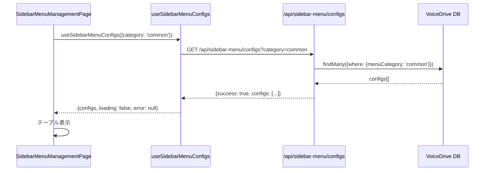
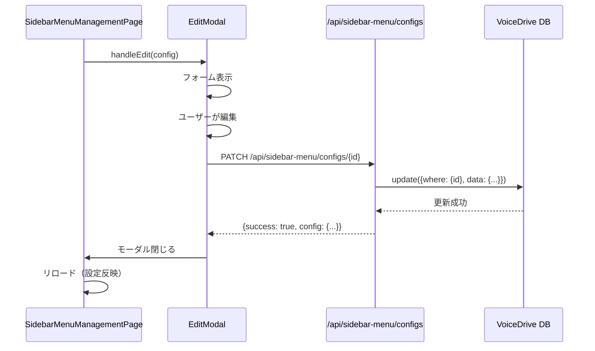
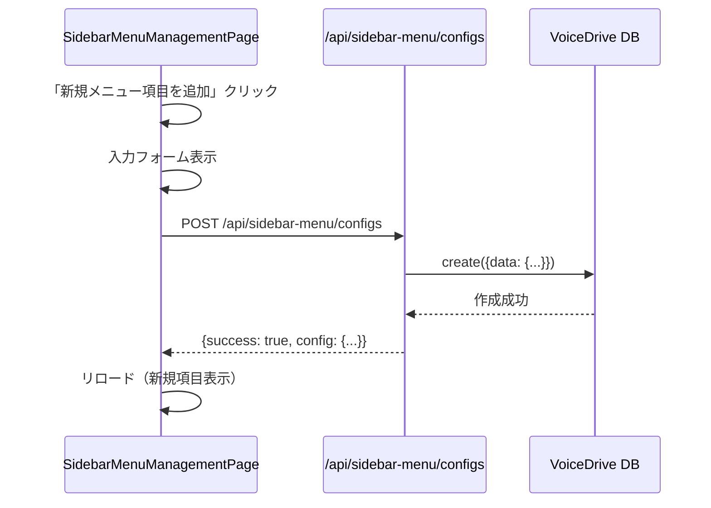
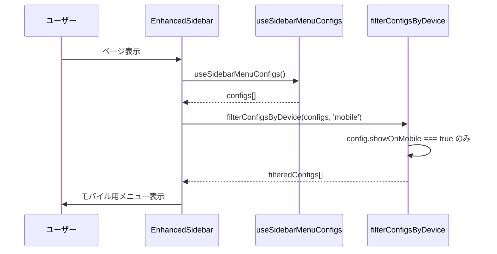

# SidebarMenuManagementPage DB要件分析

**文書番号**: SMMMP-DB-2025-1026-001
**作成日**: 2025年10月26日
**作成者**: VoiceDriveチーム
**対象ページ**: SidebarMenuManagementPage (admin/)
**重要度**: 🟡 重要（Level X専用管理画面）

---

## 📋 エグゼクティブサマリー

### ページ概要
**SidebarMenuManagementPage** は、Level X（システム管理者）専用のサイドバーメニュー管理ページです。
議題モード・プロジェクト化モード・共通メニューの表示設定を動的に管理できます。

### 核心的な設計原則
🟢 **重要**: SidebarMenuManagementPageは**VoiceDrive完全管理ページ**です。
- ✅ **VoiceDrive独自機能**: メニュー表示設定はVoiceDrive内部の仕様
- ✅ **医療システム非依存**: 医療システムとの連携は不要
- ✅ **フロントエンド主導**: UI/UX設定のため、VoiceDriveが完全に管理

### 現在の実装状況
- ✅ Phase 1完了: SidebarMenuConfigテーブル実装済み
- ✅ Phase 2完了: API実装済み（GET/POST/PATCH/DELETE）
- ✅ Phase 3完了: Seedデータあり（10種のデフォルトメニュー）
- ✅ Phase 4完了: フロントエンド実装済み
- ✅ 追加機能不要（現状で完結）

---

## 🎯 ページ機能分析

### 1. タブ切り替え（3つ）

#### 1-1. 共通メニュー
**表示内容**: 全モードで表示されるメニュー項目
**データソース**: `SidebarMenuConfig WHERE menuCategory = 'common'`

**責任**: 🟢 **VoiceDrive**（完全管理）

**計算ロジック**:
```typescript
const commonMenus = await prisma.sidebarMenuConfig.findMany({
  where: { menuCategory: 'common' },
  orderBy: [{ displayOrder: 'asc' }]
});
```

**必要なフィールド**:
| フィールド | VoiceDrive | 医療システム | 備考 |
|----------|-----------|------------|------|
| `SidebarMenuConfig.menuCategory` | ✅ マスタ | - | VoiceDrive管理 |

---

#### 1-2. 議題モードメニュー
**表示内容**: 議題モード専用のメニュー項目
**データソース**: `SidebarMenuConfig WHERE menuCategory = 'agenda'`

**責任**: 🟢 **VoiceDrive**（完全管理）

**計算ロジック**:
```typescript
const agendaMenus = await prisma.sidebarMenuConfig.findMany({
  where: { menuCategory: 'agenda' },
  orderBy: [{ displayOrder: 'asc' }]
});
```

**必要なフィールド**:
| フィールド | VoiceDrive | 医療システム | 備考 |
|----------|-----------|------------|------|
| `SidebarMenuConfig.menuCategory` | ✅ マスタ | - | VoiceDrive管理 |

---

#### 1-3. プロジェクト化モードメニュー
**表示内容**: プロジェクト化モード専用のメニュー項目
**データソース**: `SidebarMenuConfig WHERE menuCategory = 'project'`

**責任**: 🟢 **VoiceDrive**（完全管理）

**計算ロジック**:
```typescript
const projectMenus = await prisma.sidebarMenuConfig.findMany({
  where: { menuCategory: 'project' },
  orderBy: [{ displayOrder: 'asc' }]
});
```

**必要なフィールド**:
| フィールド | VoiceDrive | 医療システム | 備考 |
|----------|-----------|------------|------|
| `SidebarMenuConfig.menuCategory` | ✅ マスタ | - | VoiceDrive管理 |

---

### 2. メニュー設定テーブル（7列）

#### 2-1. 表示
**表示内容**: チェックボックス（メニュー表示/非表示）
**データソース**: `SidebarMenuConfig.isVisible`

**責任**: 🟢 **VoiceDrive**（完全管理）

**実装ロジック**:
```typescript
<input
  type="checkbox"
  checked={config.isVisible}
  readOnly
/>
```

**必要なフィールド**:
| フィールド | VoiceDrive | 医療システム | 備考 |
|----------|-----------|------------|------|
| `SidebarMenuConfig.isVisible` | ✅ マスタ | - | VoiceDrive管理 |

---

#### 2-2. アイコン
**表示内容**: Emoji（🏠, 🤝, 💼等）
**データソース**: `SidebarMenuConfig.icon`

**責任**: 🟢 **VoiceDrive**（完全管理）

**実装ロジック**:
```typescript
<td className="text-2xl">{config.icon}</td>
```

**必要なフィールド**:
| フィールド | VoiceDrive | 医療システム | 備考 |
|----------|-----------|------------|------|
| `SidebarMenuConfig.icon` | ✅ マスタ | - | VoiceDrive管理 |

---

#### 2-3. ラベル
**表示内容**: メニュー項目名（例: パーソナルステーション）
**データソース**: `SidebarMenuConfig.label`

**責任**: 🟢 **VoiceDrive**（完全管理）

**実装ロジック**:
```typescript
<span>{config.label}</span>
{config.showNewBadge && <span className="bg-red-500 px-2 py-0.5 rounded">NEW</span>}
```

**必要なフィールド**:
| フィールド | VoiceDrive | 医療システム | 備考 |
|----------|-----------|------------|------|
| `SidebarMenuConfig.label` | ✅ マスタ | - | VoiceDrive管理 |
| `SidebarMenuConfig.showNewBadge` | ✅ マスタ | - | VoiceDrive管理 |

---

#### 2-4. URL
**表示内容**: リンク先URL（例: /personal-station）
**データソース**: `SidebarMenuConfig.path`

**責任**: 🟢 **VoiceDrive**（完全管理）

**実装ロジック**:
```typescript
<td className="font-mono text-sm">{config.path}</td>
```

**必要なフィールド**:
| フィールド | VoiceDrive | 医療システム | 備考 |
|----------|-----------|------------|------|
| `SidebarMenuConfig.path` | ✅ マスタ | - | VoiceDrive管理 |

---

#### 2-5. デバイス
**表示内容**: PC/スマホ/タブレットの表示アイコン
**データソース**: `SidebarMenuConfig.showOnDesktop`, `showOnMobile`, `showOnTablet`

**責任**: 🟢 **VoiceDrive**（完全管理）

**実装ロジック**:
```typescript
<Monitor className={config.showOnDesktop ? 'text-blue-400' : 'text-slate-600'} />
<Smartphone className={config.showOnMobile ? 'text-blue-400' : 'text-slate-600'} />
<Tablet className={config.showOnTablet ? 'text-blue-400' : 'text-slate-600'} />
```

**必要なフィールド**:
| フィールド | VoiceDrive | 医療システム | 備考 |
|----------|-----------|------------|------|
| `SidebarMenuConfig.showOnDesktop` | ✅ マスタ | - | VoiceDrive管理 |
| `SidebarMenuConfig.showOnMobile` | ✅ マスタ | - | VoiceDrive管理 |
| `SidebarMenuConfig.showOnTablet` | ✅ マスタ | - | VoiceDrive管理 |

---

#### 2-6. 順序
**表示内容**: 表示順序（整数）
**データソース**: `SidebarMenuConfig.displayOrder`

**責任**: 🟢 **VoiceDrive**（完全管理）

**実装ロジック**:
```typescript
<td className="text-center">{config.displayOrder}</td>
```

**必要なフィールド**:
| フィールド | VoiceDrive | 医療システム | 備考 |
|----------|-----------|------------|------|
| `SidebarMenuConfig.displayOrder` | ✅ マスタ | - | VoiceDrive管理 |

---

#### 2-7. 操作
**表示内容**: 編集・削除ボタン
**データソース**: `SidebarMenuConfig.id`, `isSystem`

**責任**: 🟢 **VoiceDrive**（完全管理）

**実装ロジック**:
```typescript
<button onClick={() => handleEdit(config)}>
  <Edit2 className="text-blue-400" />
</button>
{!config.isSystem && (
  <button>
    <Trash2 className="text-red-400" />
  </button>
)}
```

**必要なフィールド**:
| フィールド | VoiceDrive | 医療システム | 備考 |
|----------|-----------|------------|------|
| `SidebarMenuConfig.id` | ✅ マスタ | - | VoiceDrive管理 |
| `SidebarMenuConfig.isSystem` | ✅ マスタ | - | VoiceDrive管理 |

---

### 3. アクションボタン

#### 3-1. 新規メニュー項目を追加
**機能**: 新しいメニュー項目を作成
**データソース**: `POST /api/sidebar-menu/configs`

**責任**: 🟢 **VoiceDrive**（完全管理）

**実装フロー**:
```typescript
async function handleCreateMenu(data: Partial<SidebarMenuConfig>) {
  const response = await fetch('/api/sidebar-menu/configs', {
    method: 'POST',
    headers: { 'Content-Type': 'application/json' },
    body: JSON.stringify({
      menuItemId: data.menuItemId,
      menuCategory: data.menuCategory,
      icon: data.icon,
      label: data.label,
      path: data.path,
      description: data.description,
      isVisible: data.isVisible ?? true,
      displayOrder: data.displayOrder ?? 0,
      showOnDesktop: data.showOnDesktop ?? true,
      showOnMobile: data.showOnMobile ?? true,
      showOnTablet: data.showOnTablet ?? true,
      isCustom: true
    })
  });
  // ...
}
```

**必要なAPI**:
- VoiceDrive: `POST /api/sidebar-menu/configs` （新規作成）

---

### 4. 編集モーダル（11項目）

#### 4-1. アイコン（Emoji）
**表示内容**: 入力フィールド（Emoji入力）
**データソース**: `SidebarMenuConfig.icon`

**責任**: 🟢 **VoiceDrive**（完全管理）

---

#### 4-2. ラベル
**表示内容**: 入力フィールド（テキスト）
**データソース**: `SidebarMenuConfig.label`

**責任**: 🟢 **VoiceDrive**（完全管理）

---

#### 4-3. URL
**表示内容**: 入力フィールド（パス）
**データソース**: `SidebarMenuConfig.path`

**責任**: 🟢 **VoiceDrive**（完全管理）

---

#### 4-4. 説明（ツールチップ）
**表示内容**: テキストエリア（説明文）
**データソース**: `SidebarMenuConfig.description`

**責任**: 🟢 **VoiceDrive**（完全管理）

---

#### 4-5. このメニュー項目を表示する
**表示内容**: チェックボックス
**データソース**: `SidebarMenuConfig.isVisible`

**責任**: 🟢 **VoiceDrive**（完全管理）

---

#### 4-6. 表示デバイス（3つ）
**表示内容**: チェックボックス（PC/スマホ/タブレット）
**データソース**: `SidebarMenuConfig.showOnDesktop`, `showOnMobile`, `showOnTablet`

**責任**: 🟢 **VoiceDrive**（完全管理）

---

#### 4-7. 表示順序
**表示内容**: 数値入力フィールド
**データソース**: `SidebarMenuConfig.displayOrder`

**責任**: 🟢 **VoiceDrive**（完全管理）

---

#### 4-8. 「NEW!」バッジを表示
**表示内容**: チェックボックス
**データソース**: `SidebarMenuConfig.showNewBadge`

**責任**: 🟢 **VoiceDrive**（完全管理）

---

#### 4-9. 管理者メモ
**表示内容**: テキストエリア（内部用メモ）
**データソース**: `SidebarMenuConfig.adminNotes`

**責任**: 🟢 **VoiceDrive**（完全管理）

**使用例**:
```
評価制度は2025年4月導入予定。人事部門の準備完了後に表示を有効化。
```

---

#### 4-10. 保存ボタン
**機能**: メニュー設定を保存
**データソース**: `PATCH /api/sidebar-menu/configs/{id}`

**責任**: 🟢 **VoiceDrive**（完全管理）

**実装フロー**:
```typescript
async function handleSave(config: Partial<SidebarMenuConfig>) {
  const response = await fetch(`/api/sidebar-menu/configs/${config.id}`, {
    method: 'PATCH',
    headers: { 'Content-Type': 'application/json' },
    body: JSON.stringify(config)
  });
  // ...
}
```

**必要なAPI**:
- VoiceDrive: `PATCH /api/sidebar-menu/configs/{id}` （更新）

---

#### 4-11. キャンセルボタン
**機能**: モーダルを閉じる（保存なし）
**データソース**: フロントエンド状態管理

**責任**: 🟢 **VoiceDrive**（完全管理）

---

## 📊 データ管理責任マトリクス

### 全データ項目の責任分担

| データ項目 | VoiceDrive | 医療システム | 提供方法 | 備考 |
|----------|-----------|------------|---------|------|
| **基本情報** |
| `SidebarMenuConfig.id` | ✅ マスタ | - | - | VoiceDrive内部ID |
| `SidebarMenuConfig.menuItemId` | ✅ マスタ | - | - | メニューID（例: personal_station） |
| `SidebarMenuConfig.menuCategory` | ✅ マスタ | - | - | カテゴリ（common/agenda/project） |
| `SidebarMenuConfig.menuSubcategory` | ✅ マスタ | - | - | サブカテゴリ（station/info/management） |
| **表示設定** |
| `SidebarMenuConfig.icon` | ✅ マスタ | - | - | アイコン（Emoji） |
| `SidebarMenuConfig.label` | ✅ マスタ | - | - | ラベル |
| `SidebarMenuConfig.path` | ✅ マスタ | - | - | URL |
| `SidebarMenuConfig.description` | ✅ マスタ | - | - | 説明文 |
| `SidebarMenuConfig.isVisible` | ✅ マスタ | - | - | 表示/非表示 |
| `SidebarMenuConfig.displayOrder` | ✅ マスタ | - | - | 表示順序 |
| **デバイス別設定** |
| `SidebarMenuConfig.showOnDesktop` | ✅ マスタ | - | - | PC表示 |
| `SidebarMenuConfig.showOnMobile` | ✅ マスタ | - | - | スマホ表示 |
| `SidebarMenuConfig.showOnTablet` | ✅ マスタ | - | - | タブレット表示 |
| **権限・バッジ** |
| `SidebarMenuConfig.visibleForLevels` | ✅ マスタ | - | - | 権限レベル制限（JSON） |
| `SidebarMenuConfig.showNewBadge` | ✅ マスタ | - | - | NEWバッジ表示 |
| `SidebarMenuConfig.newBadgeUntil` | ✅ マスタ | - | - | NEWバッジ期限 |
| `SidebarMenuConfig.showBadge` | ✅ マスタ | - | - | バッジ表示 |
| `SidebarMenuConfig.badgeType` | ✅ マスタ | - | - | バッジタイプ（count等） |
| **管理情報** |
| `SidebarMenuConfig.adminNotes` | ✅ マスタ | - | - | 管理者メモ |
| `SidebarMenuConfig.isCustom` | ✅ マスタ | - | - | カスタム項目フラグ |
| `SidebarMenuConfig.isSystem` | ✅ マスタ | - | - | システム項目フラグ |
| `SidebarMenuConfig.createdAt` | ✅ マスタ | - | - | 作成日時 |
| `SidebarMenuConfig.updatedAt` | ✅ マスタ | - | - | 更新日時 |

---

## 🔍 不足項目の洗い出し

### 1. Prisma schema.prismaに不足しているフィールド

#### ✅ **不足なし**

**理由**: SidebarMenuConfigテーブルは既に完全実装済み

**現在のschema.prisma（確認済み）**:
```prisma
model SidebarMenuConfig {
  id               String    @id @default(cuid())
  menuItemId       String    @map("menu_item_id")
  menuCategory     String    @map("menu_category")
  menuSubcategory  String?   @map("menu_subcategory")
  icon             String    @map("icon")
  label            String    @map("label")
  path             String    @map("path")
  description      String?   @map("description")
  isVisible        Boolean   @default(true) @map("is_visible")
  displayOrder     Int       @default(0) @map("display_order")
  showOnDesktop    Boolean   @default(true) @map("show_on_desktop")
  showOnMobile     Boolean   @default(true) @map("show_on_mobile")
  showOnTablet     Boolean   @default(true) @map("show_on_tablet")
  visibleForLevels String?   @map("visible_for_levels")
  showNewBadge     Boolean   @default(false) @map("show_new_badge")
  newBadgeUntil    DateTime? @map("new_badge_until")
  showBadge        Boolean   @default(false) @map("show_badge")
  badgeType        String?   @map("badge_type")
  adminNotes       String?   @map("admin_notes")
  isCustom         Boolean   @default(false) @map("is_custom")
  isSystem         Boolean   @default(false) @map("is_system")
  createdAt        DateTime  @default(now()) @map("created_at")
  updatedAt        DateTime  @updatedAt @map("updated_at")

  @@unique([menuItemId, menuCategory], name: "unique_menu_config")
  @@index([menuCategory])
  @@index([isVisible])
  @@index([displayOrder])
  @@map("sidebar_menu_configs")
}
```

---

### 2. 医療システムAPIに不足しているエンドポイント

#### ✅ **不足なし**

**理由**: SidebarMenuManagementPageは医療システムと連携不要

**VoiceDrive独自機能のため、医療システムAPIは使用しません。**

---

### 3. VoiceDrive側に不足している機能

#### ✅ **不足なし**

**理由**: 既存実装で完結

**既存の実装**:
- ✅ API実装済み: `src/api/routes/sidebar-menu.routes.ts`
- ✅ Hook実装済み: `src/hooks/useSidebarMenuConfigs.ts`
- ✅ Page実装済み: `src/pages/admin/SidebarMenuManagementPage.tsx`
- ✅ Seedデータあり: `prisma/seed/10-sidebar-menu-configs.ts`

---

## 🔄 実装フロー

### フロー1: メニュー設定取得



---

### フロー2: メニュー設定更新



---

### フロー3: 新規メニュー作成



---

### フロー4: デバイス判定とフィルタリング



---

## 📝 まとめ

### 実装優先度

#### ✅ Phase 1-4: 完了（追加作業不要）

**既存実装の確認済み項目**:
- ✅ Prisma schema実装完了（SidebarMenuConfig）
- ✅ API実装完了（GET/POST/PATCH/DELETE）
- ✅ Seedデータ投入完了（10種のデフォルトメニュー）
- ✅ Hook実装完了（useSidebarMenuConfigs）
- ✅ Page実装完了（SidebarMenuManagementPage）
- ✅ デバイス判定実装完了（useDeviceType）
- ✅ フィルタリング実装完了（filterConfigsByDevice）

---

### 成功指標

| 指標 | 目標値 | 測定方法 |
|------|--------|---------|
| **メニュー設定読み込み** | < 500ms | フロントエンド測定 |
| **メニュー設定更新** | < 1秒 | API応答時間 |
| **UI応答性** | < 100ms | ユーザー操作後の反応 |
| **デバイス判定精度** | 100% | テスト結果 |
| **データ整合性** | 100% | DB整合性チェック |

---

### 推奨事項

#### 1. 権限レベル連携（将来的な拡張）

**現状**: `visibleForLevels`はJSON文字列で保存
**推奨**: 医療システムの権限レベルと連携したい場合は以下を検討

```typescript
// 例: レベル12以上のみ表示
const config = await prisma.sidebarMenuConfig.create({
  data: {
    menuItemId: 'executive_dashboard',
    label: 'エグゼクティブダッシュボード',
    visibleForLevels: JSON.stringify(['12', '13', '14', '15', '16', '17', '18', 'X']),
    // ...
  }
});
```

**API側でフィルタリング**:
```typescript
// src/api/routes/sidebar-menu.routes.ts
if (permissionLevel) {
  filteredConfigs = configs.filter((config) => {
    if (!config.visibleForLevels) return true;
    const levels = JSON.parse(config.visibleForLevels);
    return levels.includes(String(permissionLevel));
  });
}
```

---

#### 2. 期限付きNEWバッジの自動非表示

**現状**: `newBadgeUntil`はあるが、自動非表示機能なし
**推奨**: 日次バッチで期限切れバッジを非表示にする

```typescript
// 例: 日次バッチ
async function hideExpiredNewBadges() {
  await prisma.sidebarMenuConfig.updateMany({
    where: {
      showNewBadge: true,
      newBadgeUntil: {
        lt: new Date()
      }
    },
    data: {
      showNewBadge: false
    }
  });
}
```

---

#### 3. メニュー並び替え機能（ドラッグ&ドロップ）

**現状**: `displayOrder`は手動入力
**推奨**: ドラッグ&ドロップで並び替え

```typescript
// 一括更新API（既存実装あり）
PATCH /api/sidebar-menu/configs/bulk-update
Body: {
  updates: [
    { id: 'menu-1', displayOrder: 1 },
    { id: 'menu-2', displayOrder: 2 },
    // ...
  ]
}
```

---

## 🎯 データフロー全体図

```mermaid
graph TD
    A[Level X管理者] -->|設定変更| B[SidebarMenuManagementPage]
    B -->|PATCH /api/sidebar-menu/configs/{id}| C[VoiceDrive API]
    C -->|update| D[SidebarMenuConfig DB]

    E[一般職員] -->|ページ表示| F[EnhancedSidebar]
    F -->|GET /api/sidebar-menu/configs| C
    C -->|findMany| D
    D -->|configs[]| F
    F -->|デバイス判定| G[filterConfigsByDevice]
    G -->|権限フィルタ| H[visibleForLevels判定]
    H -->|表示メニュー| E
```

---

**文書終了**

最終更新: 2025年10月26日
作成者: VoiceDriveチーム
次回レビュー: 不要（実装完了済み）
