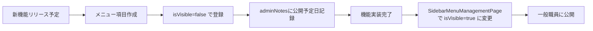

# SidebarMenuManagementPage 暫定マスターリスト

**文書番号**: SMMMP-MASTER-2025-1026-001
**作成日**: 2025年10月26日
**作成者**: VoiceDriveチーム
**対象ページ**: SidebarMenuManagementPage (admin/)
**目的**: 暫定マスターデータとして投入すべきメニュー項目を定義

---

## 📋 暫定マスターリスト概要

### 目的
- VoiceDriveのサイドバーメニューの初期設定を定義
- 医療システムとの連携は不要（VoiceDrive独自管理）
- 既存Seedデータ（`prisma/seed/10-sidebar-menu-configs.ts`）を拡張

### 管理責任
- 🟢 **VoiceDrive完全管理**: 医療システムとの連携不要
- 🟢 **システム管理者（Level X）が編集可能**
- 🟢 **Seedデータは開発環境の初期化用**

---

## 🎨 カテゴリ1: 共通メニュー（common）

### 1-1. ステーション系（station）

#### メニュー1: パーソナルステーション
```json
{
  "menuItemId": "personal_station",
  "menuCategory": "common",
  "menuSubcategory": "station",
  "icon": "🏠",
  "label": "パーソナルステーション",
  "path": "/personal-station",
  "description": "面談予約、評価、キャリア情報を確認できます",
  "isVisible": true,
  "displayOrder": 1,
  "showOnDesktop": true,
  "showOnMobile": true,
  "showOnTablet": true,
  "showNewBadge": false,
  "showBadge": false,
  "isCustom": false,
  "isSystem": true,
  "adminNotes": "システム標準項目"
}
```

---

#### メニュー2: 面談ステーション
```json
{
  "menuItemId": "interview_station",
  "menuCategory": "common",
  "menuSubcategory": "station",
  "icon": "🤝",
  "label": "面談ステーション",
  "path": "/interview-station",
  "description": "面談予約・履歴を管理できます",
  "isVisible": true,
  "displayOrder": 2,
  "showOnDesktop": true,
  "showOnMobile": true,
  "showOnTablet": true,
  "showNewBadge": false,
  "showBadge": false,
  "isCustom": false,
  "isSystem": true,
  "adminNotes": "Phase 20実装済み"
}
```

---

#### メニュー3: キャリア選択ステーション
```json
{
  "menuItemId": "career_selection_station",
  "menuCategory": "common",
  "menuSubcategory": "station",
  "icon": "💼",
  "label": "キャリア選択ステーション",
  "path": "/career-selection-station",
  "description": "キャリアコース選択・変更申請ができます",
  "isVisible": true,
  "displayOrder": 3,
  "showOnDesktop": true,
  "showOnMobile": true,
  "showOnTablet": true,
  "showNewBadge": false,
  "showBadge": false,
  "isCustom": false,
  "isSystem": true,
  "adminNotes": "Phase 22実装予定"
}
```

---

#### メニュー4: 健康ステーション（非表示・準備中）
```json
{
  "menuItemId": "health_station",
  "menuCategory": "common",
  "menuSubcategory": "station",
  "icon": "🩺",
  "label": "健康ステーション",
  "path": "/health-station",
  "description": "ストレスチェック・健康診断結果を確認",
  "isVisible": false,
  "displayOrder": 4,
  "showOnDesktop": true,
  "showOnMobile": true,
  "showOnTablet": true,
  "showNewBadge": false,
  "showBadge": false,
  "isCustom": false,
  "isSystem": false,
  "adminNotes": "ベータ版として人事部門のみ先行公開予定。2026年1月から全職員公開予定。"
}
```

---

#### メニュー5: 評価ステーション（非表示・準備中）
```json
{
  "menuItemId": "evaluation_station",
  "menuCategory": "common",
  "menuSubcategory": "station",
  "icon": "📊",
  "label": "評価ステーション",
  "path": "/evaluation-station",
  "description": "目標設定・評価・フィードバックを管理できます",
  "isVisible": false,
  "displayOrder": 5,
  "showOnDesktop": true,
  "showOnMobile": true,
  "showOnTablet": true,
  "showNewBadge": false,
  "showBadge": false,
  "isCustom": false,
  "isSystem": false,
  "adminNotes": "評価制度は2025年4月導入予定。人事部門の準備完了後に表示を有効化。"
}
```

---

### 1-2. 情報・設定系（info）

#### メニュー6: 使い方ガイド
```json
{
  "menuItemId": "user_guide",
  "menuCategory": "common",
  "menuSubcategory": "info",
  "icon": "📖",
  "label": "使い方ガイド",
  "path": "/user-guide",
  "description": "VoiceDriveの使い方を確認",
  "isVisible": true,
  "displayOrder": 10,
  "showOnDesktop": true,
  "showOnMobile": true,
  "showOnTablet": true,
  "showNewBadge": false,
  "showBadge": false,
  "isCustom": false,
  "isSystem": true,
  "adminNotes": "システム標準項目"
}
```

---

#### メニュー7: コンプライアンス窓口
```json
{
  "menuItemId": "compliance_guide",
  "menuCategory": "common",
  "menuSubcategory": "info",
  "icon": "🛡️",
  "label": "コンプライアンス窓口",
  "path": "/compliance-guide",
  "description": "内部通報・相談窓口",
  "isVisible": true,
  "displayOrder": 11,
  "showOnDesktop": true,
  "showOnMobile": false,
  "showOnTablet": true,
  "showNewBadge": false,
  "showBadge": false,
  "isCustom": false,
  "isSystem": true,
  "adminNotes": "スマホでは非表示（画面サイズ対応）"
}
```

---

#### メニュー8: 通知
```json
{
  "menuItemId": "notifications",
  "menuCategory": "common",
  "menuSubcategory": "info",
  "icon": "🔔",
  "label": "通知",
  "path": "/notifications",
  "description": "新着通知を確認",
  "isVisible": true,
  "displayOrder": 12,
  "showOnDesktop": true,
  "showOnMobile": true,
  "showOnTablet": true,
  "showNewBadge": false,
  "showBadge": true,
  "badgeType": "count",
  "isCustom": false,
  "isSystem": true,
  "adminNotes": "バッジには未読件数を表示"
}
```

---

#### メニュー9: 設定
```json
{
  "menuItemId": "settings",
  "menuCategory": "common",
  "menuSubcategory": "info",
  "icon": "⚙️",
  "label": "設定",
  "path": "/settings",
  "description": "アカウント設定・プライバシー設定",
  "isVisible": true,
  "displayOrder": 13,
  "showOnDesktop": true,
  "showOnMobile": true,
  "showOnTablet": true,
  "showNewBadge": false,
  "showBadge": false,
  "isCustom": false,
  "isSystem": true,
  "adminNotes": "システム標準項目"
}
```

---

### 1-3. 管理系（management）

#### メニュー10: エグゼクティブダッシュボード（権限制限あり）
```json
{
  "menuItemId": "executive_dashboard",
  "menuCategory": "common",
  "menuSubcategory": "management",
  "icon": "📊",
  "label": "エグゼクティブダッシュボード",
  "path": "/dashboard/executive",
  "description": "経営指標・分析レポート",
  "isVisible": true,
  "displayOrder": 20,
  "showOnDesktop": true,
  "showOnMobile": true,
  "showOnTablet": true,
  "visibleForLevels": "[\"12\", \"13\", \"14\", \"15\", \"16\", \"17\", \"18\", \"X\"]",
  "showNewBadge": false,
  "showBadge": false,
  "isCustom": false,
  "isSystem": true,
  "adminNotes": "レベル12（部長）以上のみ表示"
}
```

---

## 🎨 カテゴリ2: 議題モードメニュー（agenda）

### 2-1. 議題操作系（operation）

#### メニュー11: 議題一覧
```json
{
  "menuItemId": "agenda_list",
  "menuCategory": "agenda",
  "menuSubcategory": "operation",
  "icon": "📋",
  "label": "議題一覧",
  "path": "/agenda/list",
  "description": "投票議題の一覧を表示",
  "isVisible": true,
  "displayOrder": 1,
  "showOnDesktop": true,
  "showOnMobile": true,
  "showOnTablet": true,
  "showNewBadge": false,
  "showBadge": false,
  "isCustom": false,
  "isSystem": true,
  "adminNotes": "議題モード標準項目"
}
```

---

#### メニュー12: 新規議題作成
```json
{
  "menuItemId": "create_agenda",
  "menuCategory": "agenda",
  "menuSubcategory": "operation",
  "icon": "➕",
  "label": "新規議題作成",
  "path": "/agenda/create",
  "description": "新しい議題を投稿",
  "isVisible": true,
  "displayOrder": 2,
  "showOnDesktop": true,
  "showOnMobile": true,
  "showOnTablet": true,
  "showNewBadge": false,
  "showBadge": false,
  "isCustom": false,
  "isSystem": true,
  "adminNotes": "議題モード標準項目"
}
```

---

#### メニュー13: 投票履歴
```json
{
  "menuItemId": "voting_history",
  "menuCategory": "agenda",
  "menuSubcategory": "operation",
  "icon": "🗳️",
  "label": "投票履歴",
  "path": "/agenda/voting-history",
  "description": "自分の投票履歴を確認",
  "isVisible": true,
  "displayOrder": 3,
  "showOnDesktop": true,
  "showOnMobile": true,
  "showOnTablet": true,
  "showNewBadge": false,
  "showBadge": false,
  "isCustom": false,
  "isSystem": true,
  "adminNotes": "議題モード標準項目"
}
```

---

### 2-2. 分析・統計系（analytics）

#### メニュー14: 投票統計
```json
{
  "menuItemId": "voting_analytics",
  "menuCategory": "agenda",
  "menuSubcategory": "analytics",
  "icon": "📊",
  "label": "投票統計",
  "path": "/agenda/analytics",
  "description": "投票結果の統計・分析",
  "isVisible": true,
  "displayOrder": 10,
  "showOnDesktop": true,
  "showOnMobile": false,
  "showOnTablet": true,
  "visibleForLevels": "[\"10\", \"12\", \"13\", \"14\", \"15\", \"16\", \"17\", \"18\", \"X\"]",
  "showNewBadge": false,
  "showBadge": false,
  "isCustom": false,
  "isSystem": true,
  "adminNotes": "レベル10（主任）以上のみ表示"
}
```

---

## 🎨 カテゴリ3: プロジェクト化モードメニュー（project）

### 3-1. プロジェクト操作系（operation）

#### メニュー15: プロジェクト一覧
```json
{
  "menuItemId": "project_list",
  "menuCategory": "project",
  "menuSubcategory": "operation",
  "icon": "📁",
  "label": "プロジェクト一覧",
  "path": "/project/list",
  "description": "進行中のプロジェクトを表示",
  "isVisible": true,
  "displayOrder": 1,
  "showOnDesktop": true,
  "showOnMobile": true,
  "showOnTablet": true,
  "showNewBadge": false,
  "showBadge": false,
  "isCustom": false,
  "isSystem": true,
  "adminNotes": "プロジェクトモード標準項目"
}
```

---

#### メニュー16: 新規プロジェクト提案
```json
{
  "menuItemId": "create_project",
  "menuCategory": "project",
  "menuSubcategory": "operation",
  "icon": "🚀",
  "label": "新規プロジェクト提案",
  "path": "/project/create",
  "description": "新しいプロジェクトを提案",
  "isVisible": true,
  "displayOrder": 2,
  "showOnDesktop": true,
  "showOnMobile": true,
  "showOnTablet": true,
  "showNewBadge": false,
  "showBadge": false,
  "isCustom": false,
  "isSystem": true,
  "adminNotes": "プロジェクトモード標準項目"
}
```

---

#### メニュー17: マイプロジェクト
```json
{
  "menuItemId": "my_projects",
  "menuCategory": "project",
  "menuSubcategory": "operation",
  "icon": "👤",
  "label": "マイプロジェクト",
  "path": "/project/my-projects",
  "description": "自分が参加しているプロジェクト",
  "isVisible": true,
  "displayOrder": 3,
  "showOnDesktop": true,
  "showOnMobile": true,
  "showOnTablet": true,
  "showNewBadge": false,
  "showBadge": false,
  "isCustom": false,
  "isSystem": true,
  "adminNotes": "プロジェクトモード標準項目"
}
```

---

### 3-2. プロジェクト管理系（management）

#### メニュー18: プロジェクト承認（権限制限あり）
```json
{
  "menuItemId": "project_approval",
  "menuCategory": "project",
  "menuSubcategory": "management",
  "icon": "✅",
  "label": "プロジェクト承認",
  "path": "/project/approval",
  "description": "プロジェクト承認申請を管理",
  "isVisible": true,
  "displayOrder": 10,
  "showOnDesktop": true,
  "showOnMobile": true,
  "showOnTablet": true,
  "visibleForLevels": "[\"10\", \"12\", \"13\", \"14\", \"15\", \"16\", \"17\", \"18\", \"X\"]",
  "showNewBadge": false,
  "showBadge": true,
  "badgeType": "count",
  "isCustom": false,
  "isSystem": true,
  "adminNotes": "レベル10（主任）以上のみ表示。承認待ち件数をバッジ表示。"
}
```

---

#### メニュー19: プロジェクトダッシュボード（権限制限あり）
```json
{
  "menuItemId": "project_dashboard",
  "menuCategory": "project",
  "menuSubcategory": "management",
  "icon": "📊",
  "label": "プロジェクトダッシュボード",
  "path": "/project/dashboard",
  "description": "プロジェクト進捗・統計を確認",
  "isVisible": true,
  "displayOrder": 11,
  "showOnDesktop": true,
  "showOnMobile": false,
  "showOnTablet": true,
  "visibleForLevels": "[\"12\", \"13\", \"14\", \"15\", \"16\", \"17\", \"18\", \"X\"]",
  "showNewBadge": false,
  "showBadge": false,
  "isCustom": false,
  "isSystem": true,
  "adminNotes": "レベル12（部長）以上のみ表示"
}
```

---

## 📝 投入スクリプト

### Prisma Seedファイル（既存）

**ファイル**: `prisma/seed/10-sidebar-menu-configs.ts`

**既存実装状況**:
- ✅ 共通メニュー（station系5件、info系4件、management系1件）
- ⬜ 議題モードメニュー（未実装）
- ⬜ プロジェクト化モードメニュー（未実装）

**推奨**: 議題モード・プロジェクトモードメニューを追加

---

### 拡張版Seedスクリプト（推奨）

```typescript
/**
 * サイドバーメニュー設定の初期データ（拡張版）
 */

import { PrismaClient } from '@prisma/client';

const prisma = new PrismaClient();

export async function seedSidebarMenuConfigs() {
  console.log('🎨 サイドバーメニュー設定の初期データを投入中...');

  // 既存データを削除（開発環境のみ）
  await prisma.sidebarMenuConfig.deleteMany({});

  // 共通メニュー: ステーション系（既存）
  const stationMenus = [
    // メニュー1-5は既存実装と同じ（省略）
  ];

  // 共通メニュー: 情報・設定系（既存）
  const infoMenus = [
    // メニュー6-9は既存実装と同じ（省略）
  ];

  // 共通メニュー: 管理系（既存）
  const managementMenus = [
    // メニュー10は既存実装と同じ（省略）
  ];

  // 🆕 議題モードメニュー（追加）
  const agendaMenus = [
    {
      menuItemId: 'agenda_list',
      menuCategory: 'agenda',
      menuSubcategory: 'operation',
      icon: '📋',
      label: '議題一覧',
      path: '/agenda/list',
      description: '投票議題の一覧を表示',
      isVisible: true,
      displayOrder: 1,
      showOnDesktop: true,
      showOnMobile: true,
      showOnTablet: true,
      isSystem: true,
    },
    {
      menuItemId: 'create_agenda',
      menuCategory: 'agenda',
      menuSubcategory: 'operation',
      icon: '➕',
      label: '新規議題作成',
      path: '/agenda/create',
      description: '新しい議題を投稿',
      isVisible: true,
      displayOrder: 2,
      showOnDesktop: true,
      showOnMobile: true,
      showOnTablet: true,
      isSystem: true,
    },
    {
      menuItemId: 'voting_history',
      menuCategory: 'agenda',
      menuSubcategory: 'operation',
      icon: '🗳️',
      label: '投票履歴',
      path: '/agenda/voting-history',
      description: '自分の投票履歴を確認',
      isVisible: true,
      displayOrder: 3,
      showOnDesktop: true,
      showOnMobile: true,
      showOnTablet: true,
      isSystem: true,
    },
    {
      menuItemId: 'voting_analytics',
      menuCategory: 'agenda',
      menuSubcategory: 'analytics',
      icon: '📊',
      label: '投票統計',
      path: '/agenda/analytics',
      description: '投票結果の統計・分析',
      isVisible: true,
      displayOrder: 10,
      showOnDesktop: true,
      showOnMobile: false,
      showOnTablet: true,
      visibleForLevels: JSON.stringify(['10', '12', '13', '14', '15', '16', '17', '18', 'X']),
      isSystem: true,
      adminNotes: 'レベル10（主任）以上のみ表示',
    },
  ];

  // 🆕 プロジェクト化モードメニュー（追加）
  const projectMenus = [
    {
      menuItemId: 'project_list',
      menuCategory: 'project',
      menuSubcategory: 'operation',
      icon: '📁',
      label: 'プロジェクト一覧',
      path: '/project/list',
      description: '進行中のプロジェクトを表示',
      isVisible: true,
      displayOrder: 1,
      showOnDesktop: true,
      showOnMobile: true,
      showOnTablet: true,
      isSystem: true,
    },
    {
      menuItemId: 'create_project',
      menuCategory: 'project',
      menuSubcategory: 'operation',
      icon: '🚀',
      label: '新規プロジェクト提案',
      path: '/project/create',
      description: '新しいプロジェクトを提案',
      isVisible: true,
      displayOrder: 2,
      showOnDesktop: true,
      showOnMobile: true,
      showOnTablet: true,
      isSystem: true,
    },
    {
      menuItemId: 'my_projects',
      menuCategory: 'project',
      menuSubcategory: 'operation',
      icon: '👤',
      label: 'マイプロジェクト',
      path: '/project/my-projects',
      description: '自分が参加しているプロジェクト',
      isVisible: true,
      displayOrder: 3,
      showOnDesktop: true,
      showOnMobile: true,
      showOnTablet: true,
      isSystem: true,
    },
    {
      menuItemId: 'project_approval',
      menuCategory: 'project',
      menuSubcategory: 'management',
      icon: '✅',
      label: 'プロジェクト承認',
      path: '/project/approval',
      description: 'プロジェクト承認申請を管理',
      isVisible: true,
      displayOrder: 10,
      showOnDesktop: true,
      showOnMobile: true,
      showOnTablet: true,
      visibleForLevels: JSON.stringify(['10', '12', '13', '14', '15', '16', '17', '18', 'X']),
      showBadge: true,
      badgeType: 'count',
      isSystem: true,
      adminNotes: 'レベル10（主任）以上のみ表示。承認待ち件数をバッジ表示。',
    },
    {
      menuItemId: 'project_dashboard',
      menuCategory: 'project',
      menuSubcategory: 'management',
      icon: '📊',
      label: 'プロジェクトダッシュボード',
      path: '/project/dashboard',
      description: 'プロジェクト進捗・統計を確認',
      isVisible: true,
      displayOrder: 11,
      showOnDesktop: true,
      showOnMobile: false,
      showOnTablet: true,
      visibleForLevels: JSON.stringify(['12', '13', '14', '15', '16', '17', '18', 'X']),
      isSystem: true,
      adminNotes: 'レベル12（部長）以上のみ表示',
    },
  ];

  // 全てのメニューをまとめて投入
  const allMenus = [
    ...stationMenus,
    ...infoMenus,
    ...managementMenus,
    ...agendaMenus,
    ...projectMenus,
  ];

  for (const menu of allMenus) {
    await prisma.sidebarMenuConfig.create({
      data: menu,
    });
  }

  console.log(`✅ サイドバーメニュー設定 ${allMenus.length} 件を投入しました`);
}

// 単独実行用
if (import.meta.url === `file://${process.argv[1]}`) {
  seedSidebarMenuConfigs()
    .then(() => {
      console.log('✅ サイドバーメニュー設定の初期データ投入完了');
      process.exit(0);
    })
    .catch((error) => {
      console.error('❌ エラー:', error);
      process.exit(1);
    })
    .finally(async () => {
      await prisma.$disconnect();
    });
}
```

---

## 📊 投入データサマリー

### カテゴリ別件数

| カテゴリ | サブカテゴリ | 件数 | 備考 |
|---------|-----------|-----|------|
| **共通メニュー（common）** | - | **10件** | - |
| ↳ station | ステーション系 | 5件 | 3件表示、2件非表示（準備中） |
| ↳ info | 情報・設定系 | 4件 | 全て表示 |
| ↳ management | 管理系 | 1件 | レベル12以上のみ |
| **議題モード（agenda）** | - | **4件** | - |
| ↳ operation | 議題操作系 | 3件 | 全て表示 |
| ↳ analytics | 分析・統計系 | 1件 | レベル10以上のみ |
| **プロジェクトモード（project）** | - | **5件** | - |
| ↳ operation | プロジェクト操作系 | 3件 | 全て表示 |
| ↳ management | プロジェクト管理系 | 2件 | レベル10以上のみ |
| **合計** | - | **19件** | - |

---

### 権限レベル別表示

| 権限レベル | 表示メニュー数 | 備考 |
|----------|--------------|------|
| Level 1-9（一般職員） | 15件 | 基本メニューのみ |
| Level 10（主任） | 17件 | +投票統計、プロジェクト承認 |
| Level 12-18（部長以上） | 19件 | +エグゼクティブダッシュボード、プロジェクトダッシュボード |
| Level X（システム管理者） | 19件（+管理画面） | 全メニュー+SidebarMenuManagementPage |

---

## 🎯 運用ガイドライン

### メニュー追加時の注意点

1. **menuItemIdは一意にする**: 重複するとエラー
2. **displayOrderは10刻みが推奨**: 後で挿入しやすい
3. **visibleForLevelsはJSON文字列**: `JSON.stringify()`を使用
4. **isSystemフラグ**: システム項目は削除不可
5. **adminNotesを活用**: 非表示理由や公開予定日を記録

---

### メニュー編集時のワークフロー



---

## 📅 公開スケジュール例

| メニュー項目 | 現在の状態 | 公開予定日 | 備考 |
|------------|-----------|-----------|------|
| 健康ステーション | 非表示 | 2026年1月 | 人事部門ベータ版先行公開 |
| 評価ステーション | 非表示 | 2025年4月 | 人事部門準備完了後 |
| プロジェクトダッシュボード | 表示（権限制限） | - | レベル12以上で公開済み |

---

**文書終了**

最終更新: 2025年10月26日
作成者: VoiceDriveチーム
次回レビュー: 新機能リリース時
