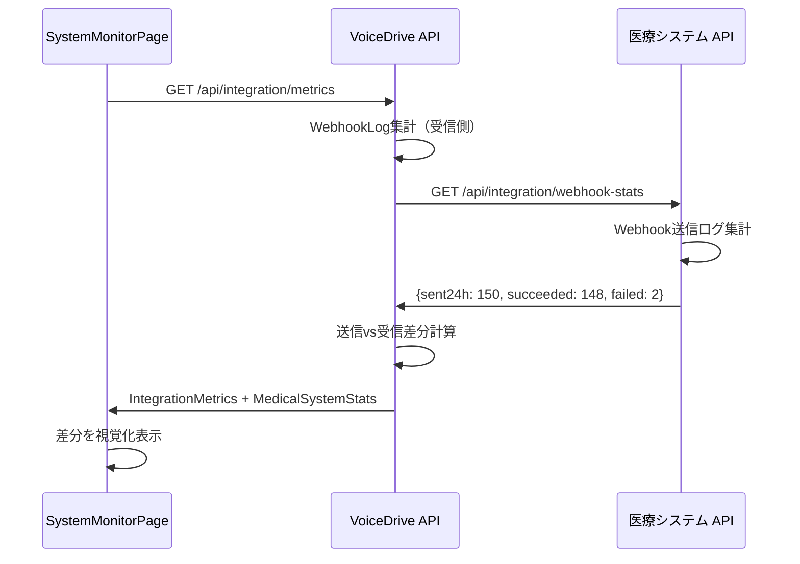
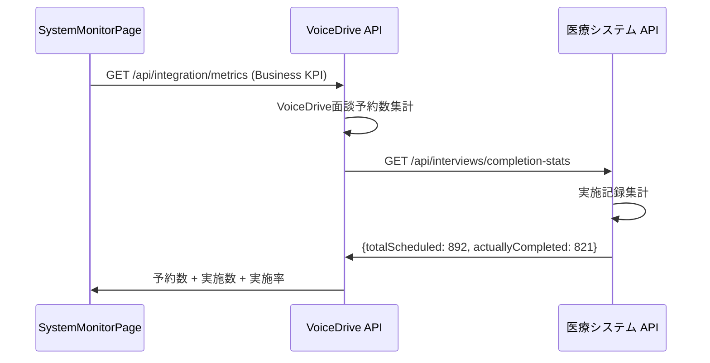

# SystemMonitorPage - DB要件分析書

**文書番号**: SMP-ANALYSIS-2025-1026-001
**作成日**: 2025年10月26日
**作成者**: VoiceDriveチーム
**対象ページ**: SystemMonitorPageEnhanced (Phase 1 + Phase 2)
**重要度**: 🔴 最重要

---

## 📋 エグゼクティブサマリー

### 背景
- **SystemMonitorPageEnhanced** はVoiceDriveシステム全体を監視するレベル99専用ダッシュボード
- **Phase 1**: VoiceDrive単独で実装可能な監視（50項目）← 実装済み
- **Phase 2**: 医療システム連携監視（20項目）← 今回実装完了
- **合計70項目**の監視メトリクスを提供

### Phase 2の実装状況
✅ **今日完了した内容**:
1. `WebhookLog`テーブル追加 - Webhook受信履歴を記録
2. `webhookController.ts`拡張 - 詳細ログ記録機能
3. `MonitoringService.getIntegrationMetrics()`実装 - 連携統計取得
4. `IntegrationMetrics`型定義 - 20項目の監視指標
5. `/api/integration/metrics` API実装
6. SystemMonitorPageに「医療システム連携」タブ追加

### 医療システム連携が必要な追加機能
⚠️ **Phase 2.5（医療システム側の対応必要）**:
- 医療システム側のWebhook送信統計API
- 送信数 vs 受信数の比較監視
- 医療システム側のリトライ状況
- 双方向の健全性チェック

---

## 🎯 ページ機能の完全分析

### 監視対象カテゴリ（全8タブ）

#### 1. 概要タブ（Overview）
**表示項目**:
- CPU使用率
- メモリ使用率
- ディスク使用率
- アクティブユーザー数
- リクエスト/分
- 平均応答時間
- エラー率
- システム健全性ステータス

**データソース**:
- ✅ **VoiceDrive**: サーバーリソース監視（Node.js APIから取得）
- ✅ **VoiceDrive**: アクティブユーザー（User.lastLoginAt集計）
- ❌ **医療システム**: 不要（VoiceDrive単独）

**責任分担**:
| 項目 | VoiceDrive | 医療システム | 提供方法 | 備考 |
|-----|-----------|-------------|---------|------|
| サーバーリソース（CPU/メモリ/ディスク） | ✅ マスタ | ❌ | - | VoiceDriveサーバー |
| アクティブユーザー数 | ✅ マスタ | ❌ | - | User.lastLoginAt集計 |
| リクエスト数 | ✅ マスタ | ❌ | - | APIログ集計 |
| エラー率 | ✅ マスタ | ❌ | - | エラーログ集計 |

---

#### 2. データベースタブ（Database）
**表示項目** (10項目):
1. User テーブルレコード数
2. Post テーブルレコード数
3. Vote テーブルレコード数
4. VoteHistory テーブルレコード数
5. Notification テーブルレコード数
6. AuditLog テーブルレコード数
7. Interview テーブルレコード数
8. Evaluation テーブルレコード数
9. ProposalReview テーブルレコード数
10. SystemConfig テーブルレコード数
11. 総レコード数
12. 遅いクエリ数
13. アクティブ接続数

**データソース**:
- ✅ **VoiceDrive**: Prisma経由で各テーブルのcount()実行
- ❌ **医療システム**: 不要（VoiceDrive内部監視）

**責任分担**:
| テーブル | VoiceDrive | 医療システム | 備考 |
|---------|-----------|-------------|------|
| User | ✅ マスタ | キャッシュ元提供 | 職員マスタは医療システム |
| Post | ✅ マスタ | ❌ | VoiceDrive管轄 |
| Vote | ✅ マスタ | ❌ | VoiceDrive管轄 |
| Interview（予約） | ✅ マスタ | キャッシュ | 予約はVD、実施記録は医療 |
| その他 | ✅ マスタ | ❌ | VoiceDrive管轄 |

---

#### 3. セキュリティタブ（Security）
**表示項目** (12項目):
1. 急速アクション（5分間に10回以上）
2. 夜間アクティビティ（22時-6時）
3. 繰り返し失敗（10分間に5回以上）
4. 権限昇格操作
5. 24時間の監査ログ数
6. 高重要度ログ数
7. 重大アクション数
8. 整合性チェック結果
9. 最近の重大アクション（最大5件）

**データソース**:
- ✅ **VoiceDrive**: AuditLogテーブルから集計
- ⚠️ **医療システム**: 権限昇格操作の一部（医療システム側で発生したもの）

**責任分担**:
| 項目 | VoiceDrive | 医療システム | 提供方法 | 備考 |
|-----|-----------|-------------|---------|------|
| VoiceDrive内アクティビティ | ✅ マスタ | ❌ | - | AuditLog集計 |
| 医療システム経由の権限変更 | キャッシュ | ✅ マスタ | Webhook | V3評価→権限レベル更新 |
| ログイン失敗検出 | ✅ マスタ | ❌ | - | VoiceDrive認証 |

**🆕 Phase 2.5で必要な拡張**:
- 医療システム側の権限操作ログをWebhook通知
- 統合セキュリティイベントログ

---

#### 4. ビジネスKPIタブ（Business KPI）
**表示項目** (10項目):

**投票システム**:
1. 総投票数
2. 完了率
3. 参加率
4. エスカレーション数
5. 期限延長数

**提案システム**:
6. 総提案数
7. 承認率（50点到達率）
8. 平均レビュー時間
9. 保留中レビュー数

**面談システム**:
10. 総予約数
11. 確定率
12. キャンセル率

**データソース**:
- ✅ **VoiceDrive**: Vote, Post, ProposalReview, Interviewテーブルから集計
- ⚠️ **医療システム**: 面談実施記録（Interview実施ステータス）

**責任分担**:
| 項目 | VoiceDrive | 医療システム | 提供方法 | 備考 |
|-----|-----------|-------------|---------|------|
| 投票統計 | ✅ マスタ | ❌ | - | VoiceDrive管轄 |
| 提案統計 | ✅ マスタ | ❌ | - | VoiceDrive管轄 |
| 面談予約統計 | ✅ マスタ | ❌ | - | VoiceDrive管轄 |
| 面談実施率 | キャッシュ | ✅ マスタ | Webhook | 医療システムが実施記録 |

**🆕 Phase 2.5で必要な拡張**:
```typescript
// 医療システムから提供が必要
GET /api/interviews/completion-stats
Response: {
  totalScheduled: 892,      // VoiceDriveから受信した予約数
  actuallyCompleted: 821,   // 実際に実施された数
  completionRate: 92.1,     // 実施率
  noShowRate: 5.3,          // 無断欠席率
  rescheduledCount: 23      // 再予約数
}
```

---

#### 5. APIタブ（API）
**表示項目** (8項目):
1. 総リクエスト数（24時間）
2. 全体エラー率
3. エンドポイント別統計（各エンドポイントごと）:
   - `/api/posts`
   - `/api/votes`
   - `/api/profile`
   - `/api/proposal-review`
   - `/api/interviews`
   - `/api/notifications`
   - `/api/system/mode`
   - `/api/audit-logs`

**データソース**:
- ✅ **VoiceDrive**: APIアクセスログから集計
- ❌ **医療システム**: 不要（VoiceDrive API監視）

**責任分担**:
| 項目 | VoiceDrive | 医療システム | 備考 |
|-----|-----------|-------------|------|
| VoiceDrive API統計 | ✅ マスタ | ❌ | 自システムのAPI |
| 医療システムAPI呼び出し統計 | ✅ マスタ | ❌ | クライアント側ログ |

---

#### 6. スケジューラータブ（Scheduler）
**表示項目** (6項目):
1. InterviewReminderService
2. VotingDeadlineService
3. UserActivityService
4. RetirementProcessingService
5. PollExpirationChecker
6. FreespaceExpirationService

**各スケジューラーの詳細**:
- 最終実行時刻
- ステータス（成功/失敗/保留中）
- 処理件数
- 実行時間（秒）
- 次回実行予定時刻

**データソース**:
- ✅ **VoiceDrive**: スケジューラー実行ログから取得
- ⚠️ **医療システム**: RetirementProcessingServiceは医療システムからの退職通知が必要

**責任分担**:
| スケジューラー | VoiceDrive | 医療システム | 連携 | 備考 |
|--------------|-----------|-------------|-----|------|
| InterviewReminderService | ✅ マスタ | ❌ | - | VoiceDrive面談予約 |
| VotingDeadlineService | ✅ マスタ | ❌ | - | VoiceDrive投票 |
| UserActivityService | ✅ マスタ | ❌ | - | VoiceDrive活動 |
| RetirementProcessingService | ✅ 実行 | データ提供 | Webhook | 退職通知受信 |
| PollExpirationChecker | ✅ マスタ | ❌ | - | VoiceDrive投票 |
| FreespaceExpirationService | ✅ マスタ | ❌ | - | VoiceDrive投稿 |

**🆕 Phase 2.5で必要な拡張**:
- 医療システムからの退職Webhook受信状況を監視
- 退職処理の成功率を追加

---

#### 7. 通知タブ（Notifications）
**表示項目** (4項目):
1. 送信数（24時間）
2. 配信成功率
3. 開封率
4. 配信失敗数
5. カテゴリ別統計（8カテゴリ）:
   - interview（面談）
   - hr（人事）
   - agenda（議題）
   - system（システム）
   - training（研修）
   - shift（シフト）
   - project（プロジェクト）
   - evaluation（評価）

**データソース**:
- ✅ **VoiceDrive**: Notificationテーブルから集計
- ❌ **医療システム**: 不要（VoiceDrive通知システム）

**責任分担**:
| 項目 | VoiceDrive | 医療システム | 備考 |
|-----|-----------|-------------|------|
| VoiceDrive通知統計 | ✅ マスタ | ❌ | 自システムの通知 |
| 面談通知 | ✅ マスタ | トリガー提供 | 面談結果Webhookから通知生成 |

---

#### 8. 医療システム連携タブ（Integration）🆕 Phase 2
**表示項目** (20項目):

**A. 連携健全性（3項目）**:
1. Webhookエンドポイントステータス（healthy/warning/critical）
2. 最終Webhook受信時刻
3. 経過時間（分）
4. エラー率トレンド（改善中/安定/悪化中）

**B. Webhook受信統計（8項目）**:
1. 総受信数（24時間）
2. 署名検証失敗数
3. 処理エラー数
4. 重複イベント数
5. イベントタイプ別統計:
   - `employee.created` - 受信数、成功率、平均処理時間
   - `employee.photo.updated` - 受信数、成功率、平均処理時間
   - `employee.photo.deleted` - 受信数、成功率、平均処理時間

**C. データ同期統計（6項目）**:
1. 総職員数
2. 写真URL保有ユーザー数
3. 写真同期率（%）
4. 24時間以内の同期数
5. 同期エラー数
6. 最終同期時刻

**D. 最近のエラー**:
- エラー発生時の詳細（最大5件）

**データソース**:
- ✅ **VoiceDrive**: WebhookLogテーブルから集計（受信側）
- ⚠️ **医療システム**: Webhook送信統計（送信側）← Phase 2.5で必要

**責任分担**:
| 項目 | VoiceDrive | 医療システム | 提供方法 | 備考 |
|-----|-----------|-------------|---------|------|
| Webhook受信統計 | ✅ マスタ | ❌ | - | WebhookLog集計 |
| 職員写真同期率 | ✅ マスタ | データ提供 | Webhook | User.profilePhotoUrl |
| Webhook送信統計 | ❌ | ✅ マスタ | **API必要** | Phase 2.5 |
| 送信vs受信差分 | 計算 | データ提供 | **API必要** | Phase 2.5 |
| リトライ状況 | ❌ | ✅ マスタ | **API必要** | Phase 2.5 |

**🆕 Phase 2.5で必要な医療システムAPI**:
```typescript
// 医療システム側で提供が必要
GET /api/integration/webhook-stats
Response: {
  sent24h: 150,                // 送信総数（24時間）
  succeeded: 148,              // 成功数
  failed: 2,                   // 失敗数
  retried: 5,                  // リトライ発生数
  lastSentAt: "2025-10-26T12:34:56Z",
  byEventType: {
    "employee.created": { sent: 50, succeeded: 50, failed: 0 },
    "employee.photo.updated": { sent: 85, succeeded: 83, failed: 2 },
    "employee.photo.deleted": { sent: 15, succeeded: 15, failed: 0 }
  },
  queueStatus: {
    pending: 3,                // 送信待ち
    processing: 1,             // 送信中
    failed: 0                  // 失敗（リトライ上限超過）
  }
}
```

---

## 📊 データ管理責任マトリクス（SystemMonitorPage専用）

### カテゴリ1: システムリソース監視
| データ項目 | VoiceDrive | 医療システム | 提供方法 | 備考 |
|-----------|-----------|-------------|---------|------|
| CPU/メモリ/ディスク使用率 | ✅ マスタ | ❌ | - | VoiceDriveサーバー |
| アクティブユーザー数 | ✅ マスタ | ❌ | - | User.lastLoginAt |
| リクエスト数 | ✅ マスタ | ❌ | - | APIログ |
| エラー率 | ✅ マスタ | ❌ | - | エラーログ |

---

### カテゴリ2: データベース監視
| データ項目 | VoiceDrive | 医療システム | 提供方法 | 備考 |
|-----------|-----------|-------------|---------|------|
| 各テーブルレコード数 | ✅ マスタ | ❌ | - | Prisma count() |
| 総レコード数 | ✅ マスタ | ❌ | - | 集計 |
| 遅いクエリ数 | ✅ マスタ | ❌ | - | クエリログ |
| アクティブ接続数 | ✅ マスタ | ❌ | - | DB接続プール |

---

### カテゴリ3: セキュリティ監視
| データ項目 | VoiceDrive | 医療システム | 提供方法 | 備考 |
|-----------|-----------|-------------|---------|------|
| VoiceDrive内セキュリティイベント | ✅ マスタ | ❌ | - | AuditLog |
| 医療システム経由の権限変更 | キャッシュ | ✅ マスタ | Webhook | 権限レベル更新 |
| **🆕 統合セキュリティイベント** | **集計** | **✅ マスタ** | **API必要** | **Phase 2.5** |

---

### カテゴリ4: ビジネスKPI監視
| データ項目 | VoiceDrive | 医療システム | 提供方法 | 備考 |
|-----------|-----------|-------------|---------|------|
| 投票統計 | ✅ マスタ | ❌ | - | Vote, VoteHistory |
| 提案統計 | ✅ マスタ | ❌ | - | Post, ProposalReview |
| 面談予約統計 | ✅ マスタ | ❌ | - | Interview（予約） |
| **🆕 面談実施統計** | **キャッシュ** | **✅ マスタ** | **API必要** | **Phase 2.5** |

---

### カテゴリ5: 医療システム連携監視（Phase 2）
| データ項目 | VoiceDrive | 医療システム | 提供方法 | 備考 |
|-----------|-----------|-------------|---------|------|
| **Webhook受信統計** | **✅ マスタ** | ❌ | - | **WebhookLog** |
| **職員写真同期率** | **✅ マスタ** | データ提供 | Webhook | **User.profilePhotoUrl** |
| **🆕 Webhook送信統計** | **❌** | **✅ マスタ** | **API必要** | **Phase 2.5** |
| **🆕 送信vs受信差分検出** | **計算** | **データ提供** | **API必要** | **Phase 2.5** |
| **🆕 リトライ状況** | **❌** | **✅ マスタ** | **API必要** | **Phase 2.5** |
| **🆕 医療システム健全性** | **❌** | **✅ マスタ** | **API必要** | **Phase 2.5** |

---

## 🔍 不足項目の洗い出し

### Phase 2で実装済み（VoiceDrive側）
✅ **テーブル**:
- `WebhookLog` - Webhook受信履歴記録

✅ **API**:
- `GET /api/integration/metrics` - 連携監視メトリクス取得
- `GET /api/integration/health` - 連携健全性チェック

✅ **型定義**:
- `IntegrationMetrics` - 連携監視データ構造

✅ **MonitoringService**:
- `getIntegrationMetrics()` - 連携統計集計ロジック

---

### Phase 2.5で必要（医療システム側）
⚠️ **新規API**:

#### API 1: Webhook送信統計取得
```typescript
GET /api/integration/webhook-stats
Authorization: Bearer {jwt_token}

Response: {
  sent24h: number;
  succeeded: number;
  failed: number;
  retried: number;
  lastSentAt: string;
  byEventType: {
    [eventType: string]: {
      sent: number;
      succeeded: number;
      failed: number;
    };
  };
  queueStatus: {
    pending: number;
    processing: number;
    failed: number;
  };
}
```

#### API 2: 面談実施統計取得
```typescript
GET /api/interviews/completion-stats
Authorization: Bearer {jwt_token}

Response: {
  totalScheduled: number;      // VoiceDriveから受信した予約数
  actuallyCompleted: number;   // 実際に実施された数
  completionRate: number;      // 実施率（%）
  noShowRate: number;          // 無断欠席率（%）
  rescheduledCount: number;    // 再予約数
  averageDuration: number;     // 平均所要時間（分）
  byInterviewType: {
    [type: string]: {
      scheduled: number;
      completed: number;
      completionRate: number;
    };
  };
}
```

#### API 3: 統合セキュリティイベント（オプション）
```typescript
GET /api/security/events/recent
Authorization: Bearer {jwt_token}

Response: {
  events: Array<{
    timestamp: string;
    eventType: string;
    severity: 'low' | 'medium' | 'high' | 'critical';
    source: 'medical-system' | 'voicedrive';
    description: string;
    affectedUserId?: string;
  }>;
  summary: {
    total24h: number;
    bySeverity: {
      critical: number;
      high: number;
      medium: number;
      low: number;
    };
  };
}
```

---

### Phase 2.5で必要（VoiceDrive側）
⚠️ **新規機能**:

#### 機能1: 医療システムAPI呼び出し統合
```typescript
// MonitoringService.ts に追加
static async getEnhancedIntegrationMetrics(): Promise<EnhancedIntegrationMetrics> {
  const [
    voicedriveMetrics,
    medicalSystemWebhookStats,
    medicalSystemInterviewStats
  ] = await Promise.all([
    this.getIntegrationMetrics(),  // 既存
    fetchMedicalSystemWebhookStats(),  // 🆕 新規
    fetchMedicalSystemInterviewStats()  // 🆕 新規
  ]);

  // 送信 vs 受信の比較
  const discrepancy = medicalSystemWebhookStats.sent24h - voicedriveMetrics.webhook.received24h;

  return {
    ...voicedriveMetrics,
    medicalSystem: {
      webhookStats: medicalSystemWebhookStats,
      interviewStats: medicalSystemInterviewStats,
      syncDiscrepancy: discrepancy,
      syncHealth: discrepancy <= 5 ? 'healthy' : discrepancy <= 20 ? 'warning' : 'critical'
    }
  };
}
```

#### 機能2: 差分検出アラート
```typescript
// SystemMonitorPageEnhanced.tsx に追加
{/* 送信vs受信差分の警告表示 */}
{integrationMetrics.medicalSystem.syncDiscrepancy > 5 && (
  <Card className="bg-red-500/10 p-4 border border-red-500/50 mb-6">
    <div className="flex items-center gap-3">
      <AlertTriangle className="w-6 h-6 text-red-400" />
      <div>
        <h3 className="text-white font-semibold">データ欠損検出</h3>
        <p className="text-red-200 text-sm">
          医療システムが送信: {integrationMetrics.medicalSystem.webhookStats.sent24h}件
          VoiceDriveが受信: {integrationMetrics.webhook.received24h}件
          → {integrationMetrics.medicalSystem.syncDiscrepancy}件の欠損
        </p>
      </div>
    </div>
  </Card>
)}
```

---

## 🔄 実装フロー（Phase 2.5）

### フロー1: Webhook送信統計の取得と表示


---

### フロー2: 面談実施統計の取得


---

## ✅ 実装チェックリスト

### VoiceDrive側（Phase 2 - 完了済み）
- [x] WebhookLogテーブル追加
- [x] webhookController.tsにログ記録機能追加
- [x] IntegrationMetrics型定義
- [x] MonitoringService.getIntegrationMetrics()実装
- [x] GET /api/integration/metrics 実装
- [x] GET /api/integration/health 実装
- [x] SystemMonitorPageに「医療システム連携」タブ追加
- [x] Webhook受信統計表示
- [x] データ同期統計表示
- [x] 接続性ステータス表示

---

### VoiceDrive側（Phase 2.5 - 未実装）
- [ ] EnhancedIntegrationMetrics型定義追加
- [ ] MonitoringService.getEnhancedIntegrationMetrics()実装
- [ ] 医療システムAPI呼び出しクライアント実装
- [ ] 送信vs受信差分計算ロジック
- [ ] 差分検出アラート表示UI
- [ ] 面談実施統計の表示UI拡張
- [ ] エラー処理・リトライロジック
- [ ] 統合テスト

---

### 医療システム側（Phase 2.5 - 未実装）
- [ ] Webhook送信ログテーブル追加
- [ ] GET /api/integration/webhook-stats 実装
- [ ] Webhook送信統計集計ロジック
- [ ] リトライ機構の状態管理
- [ ] GET /api/interviews/completion-stats 実装
- [ ] 面談実施記録と予約の紐付け
- [ ] API認証・認可設定
- [ ] レート制限設定
- [ ] 統合テスト
- [ ] ドキュメント作成

---

## 🎯 成功指標（KPI）

### Phase 2（完了済み）
| 指標 | 目標値 | 現状 | 備考 |
|------|--------|-----|------|
| Webhook受信監視 | ✅ 実装 | ✅ 完了 | WebhookLog記録 |
| 署名検証失敗検出 | ✅ 実装 | ✅ 完了 | signatureValid記録 |
| 処理時間監視 | ✅ 実装 | ✅ 完了 | processingTime記録 |
| データ同期率監視 | ✅ 実装 | ✅ 完了 | photoSyncRate計算 |

---

### Phase 2.5（未実装）
| 指標 | 目標値 | 現状 | 備考 |
|------|--------|-----|------|
| 送信vs受信差分検出 | <5件/日 | ❌ 未実装 | 医療システムAPI必要 |
| データ欠損アラート | 即時 | ❌ 未実装 | 差分>5件でアラート |
| 面談実施率監視 | >90% | ❌ 未実装 | 医療システムAPI必要 |
| 統合セキュリティ監視 | ✅ 実装 | ❌ 未実装 | オプション機能 |

---

## 📞 連絡先・次のステップ

### 医療システムチームへの依頼事項
1. **Webhook送信統計API**の実装検討
2. **面談実施統計API**の実装検討
3. API仕様の協議・合意
4. 実装スケジュールの調整

### VoiceDriveチーム
- Phase 2.5の実装優先度を判断
- 医療システムチームとAPI仕様協議
- 統合テスト計画策定

---

**文書終了**

最終更新: 2025年10月26日
バージョン: 1.0
承認: 未承認（医療システムチームレビュー待ち）
