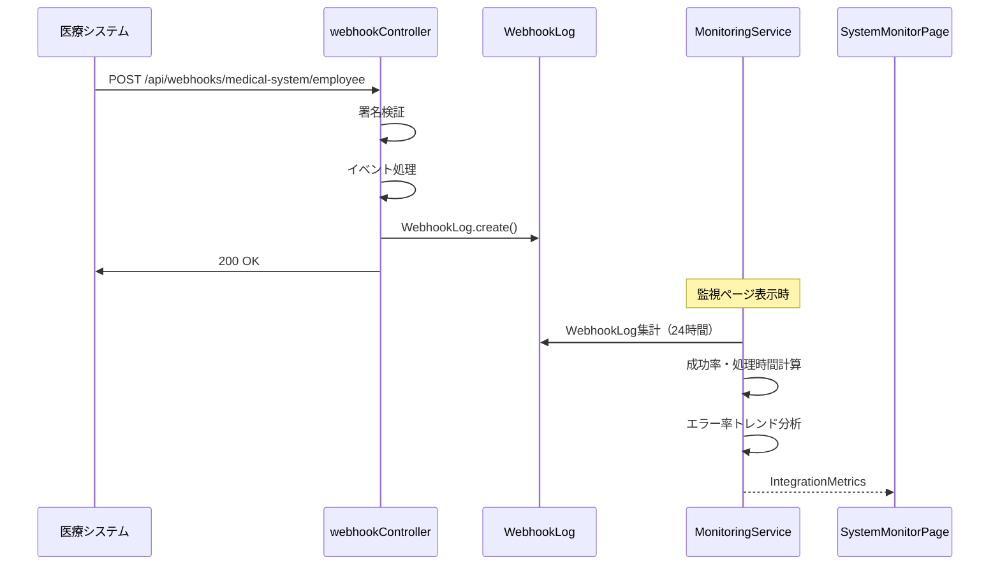
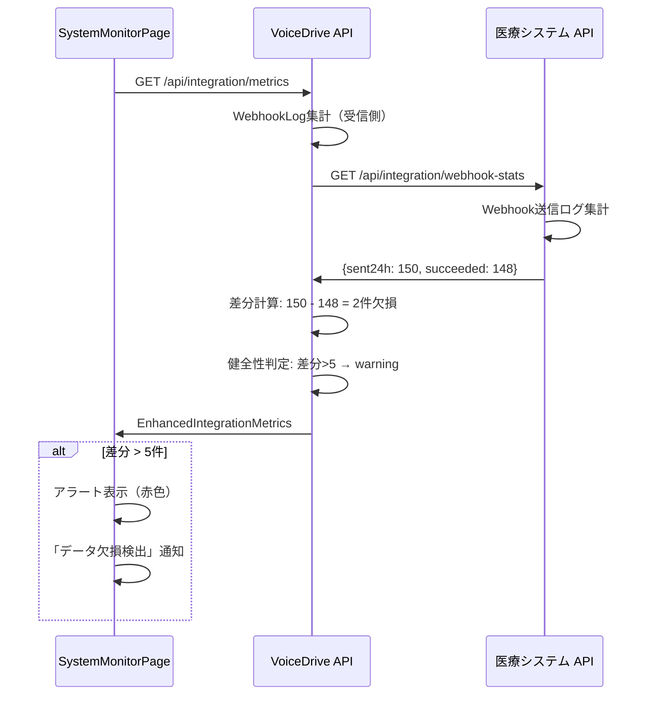

# SystemMonitorPage - 暫定マスターリスト

**文書番号**: SMP-MASTER-2025-1026-001
**作成日**: 2025年10月26日
**作成者**: VoiceDriveチーム
**対象ページ**: SystemMonitorPageEnhanced
**重要度**: 🔴 最重要

---

## 📋 概要

このドキュメントはSystemMonitorPageEnhancedに必要な全テーブル、フィールド、APIの一覧です。

**Phase 2完了時点の状況**:
- ✅ Phase 1: VoiceDrive単独監視（50項目）- 実装済み
- ✅ Phase 2: 医療システム連携監視（20項目）- 実装済み
- ⚠️ Phase 2.5: 双方向連携監視 - 医療システム側API実装が必要

---

## 🗄️ データベーステーブル一覧

### Phase 2完了済みテーブル

#### 1. WebhookLog（Phase 2で新規追加）
**用途**: 医療システムからのWebhook受信履歴記録

| フィールド | 型 | NULL | デフォルト | 説明 |
|-----------|---|------|----------|------|
| `id` | String | NOT NULL | cuid() | 主キー |
| `eventType` | String | NOT NULL | - | employee.created, employee.photo.updated, employee.photo.deleted |
| `eventTimestamp` | DateTime | NOT NULL | - | 医療システム側のイベント発生時刻 |
| `receivedAt` | DateTime | NOT NULL | now() | VoiceDrive受信時刻 |
| `requestId` | String | NULL | - | X-Request-IDヘッダー（重複検出用） |
| `staffId` | String | NOT NULL | - | 対象職員のstaffId |
| `payloadSize` | Int | NOT NULL | - | ペイロードのバイト数 |
| `fullPayload` | Json | NOT NULL | - | 完全なペイロード |
| `processingStatus` | String | NOT NULL | - | success, failed, signature_failed, validation_failed |
| `processingTime` | Int | NOT NULL | - | 処理時間（ミリ秒） |
| `errorMessage` | String | NULL | - | エラーメッセージ |
| `errorStack` | String | NULL | - | エラースタックトレース |
| `signatureValid` | Boolean | NOT NULL | - | HMAC署名検証結果 |
| `ipAddress` | String | NULL | - | 送信元IPアドレス |
| `userAgent` | String | NULL | - | User-Agent |
| `userFound` | Boolean | NOT NULL | - | staffIdに対応するUserが存在したか |
| `dataChanged` | Boolean | NOT NULL | - | 実際にデータが変更されたか |
| `previousValue` | Json | NULL | - | 変更前の値 |
| `newValue` | Json | NULL | - | 変更後の値 |
| `isDuplicate` | Boolean | NOT NULL | false | requestIdが重複していたか |
| `retryCount` | Int | NOT NULL | 0 | リトライ回数 |
| `createdAt` | DateTime | NOT NULL | now() | 作成日時 |

**インデックス**:
- `@@index([eventType])`
- `@@index([receivedAt])`
- `@@index([processingStatus])`
- `@@index([staffId])`
- `@@index([eventType, receivedAt])`
- `@@index([processingStatus, receivedAt])`
- `@@index([requestId])`
- `@@unique([requestId])`

**参照元**:
- MonitoringService.getIntegrationMetrics()

---

### 既存テーブル（SystemMonitorPageで参照）

#### 2. User
**用途**: 職員マスタ（キャッシュ）、アクティブユーザー数集計

**SystemMonitorPageで使用するフィールド**:
| フィールド | 使用目的 | データ元 |
|-----------|---------|---------|
| `id` | 職員識別 | VoiceDrive |
| `employeeId` | 職員ID | 医療システム（Webhook同期） |
| `name` | 表示用 | 医療システム（Webhook同期） |
| `department` | 部署別集計 | 医療システム（Webhook同期） |
| `profilePhotoUrl` | 写真同期率計算 | 医療システム（Webhook同期） |
| `profilePhotoUpdatedAt` | 最終同期時刻 | 医療システム（Webhook同期） |
| `lastLoginAt` | アクティブユーザー判定 | VoiceDrive |
| `loginCount` | ログイン統計 | VoiceDrive |
| `createdAt` | 作成日時 | VoiceDrive |

**集計クエリ例**:
```typescript
// 総職員数
const totalUsers = await prisma.user.count();

// 写真URL保有ユーザー数
const usersWithPhoto = await prisma.user.count({
  where: { profilePhotoUrl: { not: null } }
});

// 24時間以内に同期された職員数
const syncedLast24h = await prisma.user.count({
  where: {
    profilePhotoUpdatedAt: {
      gte: new Date(Date.now() - 24 * 60 * 60 * 1000)
    }
  }
});

// アクティブユーザー数（過去15分）
const activeUsers = await prisma.user.count({
  where: {
    lastLoginAt: {
      gte: new Date(Date.now() - 15 * 60 * 1000)
    }
  }
});
```

---

#### 3. Post
**用途**: 提案数、投稿統計

**SystemMonitorPageで使用するフィールド**:
| フィールド | 使用目的 |
|-----------|---------|
| `id` | 投稿識別 |
| `authorId` | 投稿者 |
| `createdAt` | 投稿日時 |
| `agendaScore` | 50点到達判定 |
| `status` | ステータス |

**集計クエリ例**:
```typescript
// 総提案数
const totalProposals = await prisma.post.count();

// 50点到達提案数（承認対象）
const approvedProposals = await prisma.post.count({
  where: { agendaScore: { gte: 50 } }
});
```

---

#### 4. Vote, VoteHistory
**用途**: 投票統計、完了率計算

**SystemMonitorPageで使用するフィールド**:
| テーブル | フィールド | 使用目的 |
|---------|-----------|---------|
| Vote | `id` | 投票識別 |
| Vote | `status` | 完了判定 |
| VoteHistory | `id` | 投票履歴 |
| VoteHistory | `votedAt` | 投票日時 |

**集計クエリ例**:
```typescript
// 総投票数
const totalVotes = await prisma.vote.count();

// 完了投票数
const completedVotes = await prisma.vote.count({
  where: { status: 'completed' }
});

// 完了率
const completionRate = (completedVotes / totalVotes) * 100;
```

---

#### 5. Notification
**用途**: 通知システム監視

**SystemMonitorPageで使用するフィールド**:
| フィールド | 使用目的 |
|-----------|---------|
| `id` | 通知識別 |
| `category` | カテゴリ別統計 |
| `status` | 配信成功判定 |
| `readAt` | 開封率計算 |
| `createdAt` | 24時間集計 |

**集計クエリ例**:
```typescript
// 24時間の送信数
const sent24h = await prisma.notification.count({
  where: {
    createdAt: {
      gte: new Date(Date.now() - 24 * 60 * 60 * 1000)
    }
  }
});

// 配信成功数
const delivered = await prisma.notification.count({
  where: {
    createdAt: { gte: twentyFourHoursAgo },
    status: 'delivered'
  }
});

// 開封数
const opened = await prisma.notification.count({
  where: {
    createdAt: { gte: twentyFourHoursAgo },
    readAt: { not: null }
  }
});
```

---

#### 6. AuditLog
**用途**: セキュリティ監視、権限操作監視

**SystemMonitorPageで使用するフィールド**:
| フィールド | 使用目的 |
|-----------|---------|
| `id` | ログ識別 |
| `userId` | ユーザー別集計 |
| `action` | アクション種別 |
| `entityType` | 対象エンティティ |
| `createdAt` | 時間帯集計 |
| `executorLevel` | 権限レベル |

**集計クエリ例**:
```typescript
// 24時間のログ数
const total24h = await prisma.auditLog.count({
  where: {
    createdAt: {
      gte: new Date(Date.now() - 24 * 60 * 60 * 1000)
    }
  }
});

// 夜間アクティビティ（22時-6時）
const nightActivity = await prisma.auditLog.count({
  where: {
    createdAt: {
      gte: twentyFourHoursAgo
    },
    // 時間帯フィルタ（22時-6時）
  }
});

// 権限昇格操作
const permissionEscalation = await prisma.auditLog.count({
  where: {
    action: { in: ['PERMISSION_UPDATED', 'ROLE_CHANGED'] },
    createdAt: { gte: twentyFourHoursAgo }
  }
});
```

---

#### 7. Interview
**用途**: 面談予約統計

**SystemMonitorPageで使用するフィールド**:
| フィールド | 使用目的 |
|-----------|---------|
| `id` | 面談識別 |
| `status` | 確定/キャンセル判定 |
| `createdAt` | 予約日時 |

**集計クエリ例**:
```typescript
// 総予約数
const totalBookings = await prisma.interview.count();

// 確定予約数
const confirmedBookings = await prisma.interview.count({
  where: { status: 'confirmed' }
});

// キャンセル数
const cancelledBookings = await prisma.interview.count({
  where: { status: 'cancelled' }
});
```

---

#### 8. ProposalReview
**用途**: 提案レビュー統計

**SystemMonitorPageで使用するフィールド**:
| フィールド | 使用目的 |
|-----------|---------|
| `id` | レビュー識別 |
| `postId` | 提案ID |
| `action` | 承認/却下 |
| `reviewedAt` | レビュー日時 |

---

## 🔌 API一覧

### VoiceDrive側API（Phase 2完了済み）

#### API 1: 連携監視メトリクス取得
```typescript
GET /api/integration/metrics
Authorization: Bearer {jwt_token}

Response: IntegrationMetrics
{
  webhook: {
    received24h: number;
    byEventType: {
      [eventType: string]: {
        count: number;
        successRate: number;
        avgProcessingTime: number;
      };
    };
    signatureFailures: number;
    processingErrors: number;
    duplicateEvents: number;
    lastReceived: string | null;
    avgProcessingTime: number;
  };
  dataSync: {
    totalUsers: number;
    usersWithPhoto: number;
    photoSyncRate: number;
    syncedLast24h: number;
    syncErrors: number;
    lastSyncAt: string | null;
  };
  connectivity: {
    webhookEndpointStatus: 'healthy' | 'warning' | 'critical';
    lastWebhookReceived: string | null;
    timeSinceLastWebhook: number | null;
    errorRateTrend: 'improving' | 'stable' | 'degrading';
    recentErrors: Array<{
      timestamp: string;
      eventType: string;
      errorMessage: string;
    }>;
  };
}
```

**実装ファイル**:
- `src/api/routes/integration.routes.ts`
- `src/services/MonitoringService.ts` (getIntegrationMetrics())

---

#### API 2: 連携健全性チェック
```typescript
GET /api/integration/health
Authorization: Bearer {jwt_token}

Response:
{
  success: boolean;
  status: 'healthy' | 'warning' | 'critical';
  message: string;
  details: {
    lastWebhookReceived: string | null;
    timeSinceLastWebhook: number | null;
    webhookReceived24h: number;
    processingErrors: number;
    errorRateTrend: 'improving' | 'stable' | 'degrading';
  };
  timestamp: string;
}
```

**実装ファイル**:
- `src/api/routes/integration.routes.ts`

---

### 医療システム側API（Phase 2.5で必要）

#### API 3: Webhook送信統計取得
```typescript
GET /api/integration/webhook-stats
Authorization: Bearer {jwt_token}

Request Headers:
  Authorization: Bearer {voicedrive_api_token}
  X-VoiceDrive-System-ID: voicedrive-v100

Response:
{
  sent24h: number;                // 送信総数（24時間）
  succeeded: number;              // 成功数
  failed: number;                 // 失敗数
  retried: number;                // リトライ発生数
  lastSentAt: string;             // ISO 8601
  byEventType: {
    "employee.created": {
      sent: number;
      succeeded: number;
      failed: number;
      avgProcessingTime: number;  // 医療システム側の送信処理時間（ms）
    };
    "employee.photo.updated": {
      sent: number;
      succeeded: number;
      failed: number;
      avgProcessingTime: number;
    };
    "employee.photo.deleted": {
      sent: number;
      succeeded: number;
      failed: number;
      avgProcessingTime: number;
    };
  };
  queueStatus: {
    pending: number;              // 送信待ち
    processing: number;           // 送信中
    failed: number;               // 失敗（リトライ上限超過）
  };
  retryPolicy: {
    maxRetries: number;           // 最大リトライ回数
    retryIntervals: number[];     // リトライ間隔（秒）例: [60, 300, 1800]
    currentRetrying: number;      // 現在リトライ中の数
  };
}
```

**実装必要箇所**:
- 医療システム側の新規API実装
- Webhook送信ログテーブル追加
- リトライ機構の状態管理

---

#### API 4: 面談実施統計取得
```typescript
GET /api/interviews/completion-stats
Authorization: Bearer {jwt_token}

Request Headers:
  Authorization: Bearer {voicedrive_api_token}

Response:
{
  totalScheduled: number;         // VoiceDriveから受信した予約総数
  actuallyCompleted: number;      // 実際に実施された数
  completionRate: number;         // 実施率（%）
  noShowRate: number;             // 無断欠席率（%）
  rescheduledCount: number;       // 再予約数
  averageDuration: number;        // 平均所要時間（分）
  byInterviewType: {
    [type: string]: {
      scheduled: number;
      completed: number;
      completionRate: number;
      avgDuration: number;
    };
  };
  recentNoShows: Array<{
    interviewId: string;
    employeeId: string;
    scheduledDate: string;
    interviewType: string;
  }>;
}
```

**実装必要箇所**:
- 医療システム側の新規API実装
- Interview実施記録とVoiceDrive予約の紐付け
- 実施率計算ロジック

---

#### API 5: 統合セキュリティイベント（オプション）
```typescript
GET /api/security/events/recent
Authorization: Bearer {jwt_token}

Request:
  ?limit=50
  &severity=high,critical
  &since=2025-10-26T00:00:00Z

Response:
{
  events: Array<{
    eventId: string;
    timestamp: string;
    eventType: string;            // 例: "PERMISSION_ESCALATION", "UNAUTHORIZED_ACCESS"
    severity: 'low' | 'medium' | 'high' | 'critical';
    source: 'medical-system' | 'voicedrive';
    description: string;
    affectedUserId?: string;
    affectedEmployeeId?: string;
    ipAddress?: string;
    action: string;
    result: 'success' | 'blocked' | 'failed';
  }>;
  summary: {
    total24h: number;
    bySeverity: {
      critical: number;
      high: number;
      medium: number;
      low: number;
    };
    bySource: {
      medicalSystem: number;
      voicedrive: number;
    };
  };
}
```

**実装必要箇所**:
- 医療システム側のセキュリティイベントログ統合
- VoiceDriveのAuditLogとの統合表示

---

## 📐 型定義一覧

### Phase 2完了済み型定義

#### IntegrationMetrics
**ファイル**: `src/services/MonitoringService.ts`

```typescript
export interface IntegrationMetrics {
  webhook: {
    received24h: number;
    byEventType: {
      [eventType: string]: {
        count: number;
        successRate: number;
        avgProcessingTime: number;
      };
    };
    signatureFailures: number;
    processingErrors: number;
    duplicateEvents: number;
    lastReceived: string | null;
    avgProcessingTime: number;
  };
  dataSync: {
    totalUsers: number;
    usersWithPhoto: number;
    photoSyncRate: number;
    syncedLast24h: number;
    syncErrors: number;
    lastSyncAt: string | null;
  };
  connectivity: {
    webhookEndpointStatus: 'healthy' | 'warning' | 'critical';
    lastWebhookReceived: string | null;
    timeSinceLastWebhook: number | null;
    errorRateTrend: 'improving' | 'stable' | 'degrading';
    recentErrors: Array<{
      timestamp: string;
      eventType: string;
      errorMessage: string;
    }>;
  };
}
```

---

### Phase 2.5で必要な型定義

#### EnhancedIntegrationMetrics
**ファイル**: `src/services/MonitoringService.ts` (追加予定)

```typescript
export interface MedicalSystemWebhookStats {
  sent24h: number;
  succeeded: number;
  failed: number;
  retried: number;
  lastSentAt: string;
  byEventType: {
    [eventType: string]: {
      sent: number;
      succeeded: number;
      failed: number;
      avgProcessingTime: number;
    };
  };
  queueStatus: {
    pending: number;
    processing: number;
    failed: number;
  };
  retryPolicy: {
    maxRetries: number;
    retryIntervals: number[];
    currentRetrying: number;
  };
}

export interface MedicalSystemInterviewStats {
  totalScheduled: number;
  actuallyCompleted: number;
  completionRate: number;
  noShowRate: number;
  rescheduledCount: number;
  averageDuration: number;
  byInterviewType: {
    [type: string]: {
      scheduled: number;
      completed: number;
      completionRate: number;
      avgDuration: number;
    };
  };
}

export interface EnhancedIntegrationMetrics extends IntegrationMetrics {
  medicalSystem: {
    webhookStats: MedicalSystemWebhookStats;
    interviewStats: MedicalSystemInterviewStats;
    syncDiscrepancy: number;      // 送信数 - 受信数
    syncHealth: 'healthy' | 'warning' | 'critical';
  };
}
```

---

## 🔄 フロー図

### Phase 2完了済みフロー

#### フロー1: Webhook受信と統計記録


---

### Phase 2.5で必要なフロー

#### フロー2: 送信vs受信差分検出


---

## ✅ 実装チェックリスト

### データベース（Phase 2完了済み）
- [x] WebhookLogテーブル追加
- [x] schema.prisma更新
- [x] Prisma Client生成
- [x] データベースマイグレーション実行

---

### API（Phase 2完了済み）
- [x] GET /api/integration/metrics 実装
- [x] GET /api/integration/health 実装
- [x] MonitoringService.getIntegrationMetrics() 実装
- [x] WebhookLog集計ロジック実装
- [x] 接続性判定ロジック実装
- [x] エラー率トレンド分析実装

---

### フロントエンド（Phase 2完了済み）
- [x] SystemMonitorPageに「医療システム連携」タブ追加
- [x] Webhook受信統計表示
- [x] データ同期統計表示
- [x] 接続性ステータス表示
- [x] イベントタイプ別統計表示
- [x] 最近のエラー表示

---

### データベース（Phase 2.5未実装）
- [ ] （医療システム側）Webhook送信ログテーブル追加
- [ ] （医療システム側）リトライキューテーブル追加

---

### API（Phase 2.5未実装）

**VoiceDrive側**:
- [ ] MonitoringService.getEnhancedIntegrationMetrics() 実装
- [ ] 医療システムAPI呼び出しクライアント実装
- [ ] 送信vs受信差分計算ロジック
- [ ] エラーハンドリング・リトライロジック

**医療システム側**:
- [ ] GET /api/integration/webhook-stats 実装
- [ ] GET /api/interviews/completion-stats 実装
- [ ] GET /api/security/events/recent 実装（オプション）
- [ ] API認証・認可設定
- [ ] レート制限設定

---

### フロントエンド（Phase 2.5未実装）
- [ ] EnhancedIntegrationMetrics型定義追加
- [ ] 送信vs受信差分表示UI
- [ ] データ欠損アラート表示
- [ ] 面談実施統計表示UI拡張
- [ ] 医療システム健全性表示

---

## 🎯 優先順位

### 高優先度（必須）
1. ✅ **WebhookLog記録** - 完了
2. ✅ **Webhook受信統計** - 完了
3. ✅ **データ同期率監視** - 完了
4. ⚠️ **送信vs受信差分検出** - 医療システムAPI待ち

---

### 中優先度（推奨）
5. ⚠️ **面談実施統計** - 医療システムAPI待ち
6. ⚠️ **リトライ状況監視** - 医療システムAPI待ち

---

### 低優先度（オプション）
7. ⚠️ **統合セキュリティイベント** - 医療システムAPI待ち（将来機能）

---

## 📞 連絡先

### 医療システムチームへの依頼
- **Webhook送信統計API**の実装検討
- **面談実施統計API**の実装検討
- API仕様の協議・合意

### VoiceDriveチーム
- Phase 2.5の実装優先度判断
- 統合テスト計画策定

---

**文書終了**

最終更新: 2025年10月26日
バージョン: 1.0
承認: 未承認（医療システムチームレビュー待ち）
