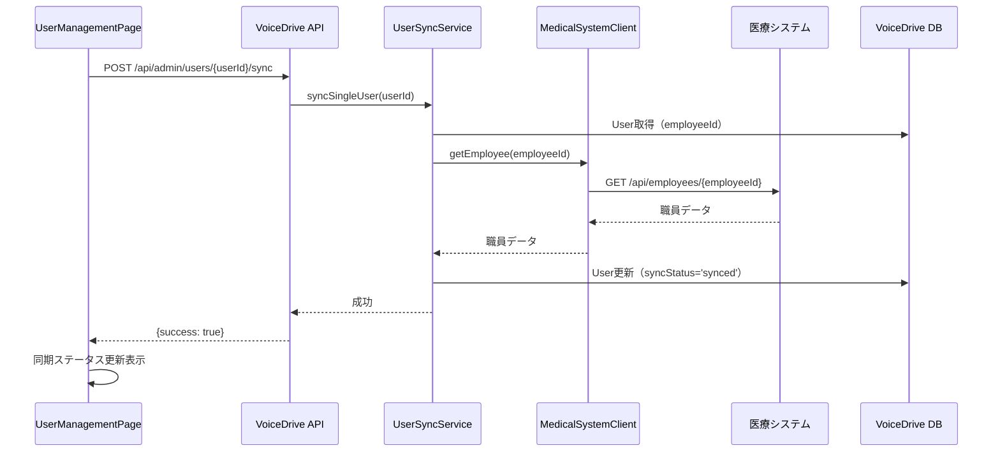
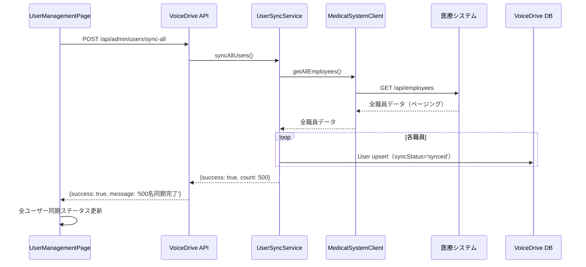
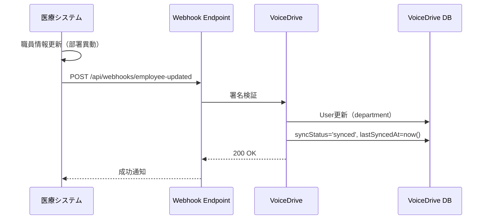

# UserManagementPage DB要件分析

**文書番号**: UMP-DB-2025-1026-001
**作成日**: 2025年10月26日
**作成者**: VoiceDriveチーム
**対象ページ**: UserManagementPage (admin/)
**重要度**: 🔴 最重要（Level 99専用管理画面）

---

## 📋 エグゼクティブサマリー

### ページ概要
**UserManagementPage** は、Level 99管理者専用のユーザー管理ページです。
全ユーザーのアカウント情報を**参照専用**で管理し、医療システムとの同期状態を監視します。

### 核心的な設計原則
🔴 **重要**: UserManagementPageは**同期済みユーザー管理ページ**です。
- ❌ **ユーザーの作成・編集・削除はできません**（医療システムがマスター）
- ✅ **医療システムから同期されたユーザーの閲覧・同期状態確認のみ**
- ✅ **VoiceDrive固有設定（通知設定、テーマ等）のみ編集可能**

### 現在の実装状況
- ✅ Phase 1完了: 不要機能削除（新規追加、編集、削除ボタン削除）
- ✅ Phase 2完了: 同期機能追加（同期ステータス表示、個別/一括同期ボタン）
- ✅ Phase 3完了: VoiceDrive固有設定データ構造準備
- ⬜ 医療システムAPI統合（未実装）
- ⬜ Prisma schema拡張（未実装）

---

## 🎯 ページ機能分析

### 1. 統計カード（4つ）

#### 1-1. 総ユーザー数
**表示内容**: 登録されている全ユーザー数
**データソース**: `User`テーブルの総レコード数

**責任**: 🔵 **医療システム** → VoiceDriveキャッシュ
- 医療システムが職員マスター管理
- VoiceDriveはキャッシュのみ保持

**計算ロジック**:
```typescript
const totalUsers = users.length;
```

**必要なフィールド**:
| フィールド | VoiceDrive | 医療システム | 備考 |
|----------|-----------|------------|------|
| `User.id` | ✅ | ✅ | 同期済み |

---

#### 1-2. アクティブユーザー数
**表示内容**: 有効なユーザー（退職していない）の数
**データソース**: `User.isActive = true`のカウント

**責任**: 🔵 **医療システム** → VoiceDriveキャッシュ
- 退職処理は医療システムで実施
- Webhook経由でVoiceDriveに通知
- VoiceDriveは`isActive`フラグを更新

**計算ロジック**:
```typescript
const activeUsers = users.filter(u => u.isActive).length;
```

**必要なフィールド**:
| フィールド | VoiceDrive | 医療システム | 備考 |
|----------|-----------|------------|------|
| `User.isActive` | ✅ キャッシュ | ✅ マスタ | Webhook同期 |

---

#### 1-3. 無効ユーザー数
**表示内容**: 退職済みユーザーの数
**データソース**: `User.isActive = false`のカウント

**責任**: 🔵 **医療システム** → VoiceDriveキャッシュ

**計算ロジック**:
```typescript
const inactiveUsers = users.filter(u => !u.isActive).length;
```

**必要なフィールド**:
| フィールド | VoiceDrive | 医療システム | 備考 |
|----------|-----------|------------|------|
| `User.isActive` | ✅ キャッシュ | ✅ マスタ | Webhook同期 |

---

#### 1-4. 管理者数
**表示内容**: 権限レベル10以上のユーザー数
**データソース**: `User.permissionLevel >= 10`のカウント

**責任**: 🔵 **医療システム** → VoiceDriveキャッシュ
- 権限レベルは医療システムのV3評価から算出
- VoiceDriveはキャッシュのみ

**計算ロジック**:
```typescript
const adminCount = users.filter(u => u.permissionLevel >= 10).length;
```

**必要なフィールド**:
| フィールド | VoiceDrive | 医療システム | 備考 |
|----------|-----------|------------|------|
| `User.permissionLevel` | ✅ キャッシュ | ✅ マスタ | V3評価から算出 |

---

### 2. 検索・フィルター機能

#### 2-1. 全文検索
**検索対象**: 名前、メール、部署
**データソース**: `User.name`, `User.email`, `User.department`

**責任**: 🔵 **医療システム** → VoiceDriveキャッシュ

**実装ロジック**:
```typescript
filtered = filtered.filter(u =>
  u.name.toLowerCase().includes(searchTerm.toLowerCase()) ||
  u.email.toLowerCase().includes(searchTerm.toLowerCase()) ||
  u.department.toLowerCase().includes(searchTerm.toLowerCase())
);
```

**必要なフィールド**:
| フィールド | VoiceDrive | 医療システム | 備考 |
|----------|-----------|------------|------|
| `User.name` | ✅ キャッシュ | ✅ マスタ | Webhook同期 |
| `User.email` | ✅ キャッシュ | ✅ マスタ | Webhook同期 |
| `User.department` | ✅ キャッシュ | ✅ マスタ | Webhook同期 |

---

#### 2-2. 権限レベルフィルター
**フィルター項目**: Level X, 18, 13, 10, 8, 6, 1
**データソース**: `User.permissionLevel`

**責任**: 🔵 **医療システム** → VoiceDriveキャッシュ

**実装ロジック**:
```typescript
if (filterLevel !== 'all') {
  const level = parseInt(filterLevel);
  filtered = filtered.filter(u => u.permissionLevel === level);
}
```

**必要なフィールド**:
| フィールド | VoiceDrive | 医療システム | 備考 |
|----------|-----------|------------|------|
| `User.permissionLevel` | ✅ キャッシュ | ✅ マスタ | V3評価から算出 |

---

#### 2-3. ステータスフィルター
**フィルター項目**: 全ステータス、有効、無効
**データソース**: `User.isActive`

**責任**: 🔵 **医療システム** → VoiceDriveキャッシュ

**実装ロジック**:
```typescript
if (filterStatus !== 'all') {
  const isActive = filterStatus === 'active';
  filtered = filtered.filter(u => u.isActive === isActive);
}
```

**必要なフィールド**:
| フィールド | VoiceDrive | 医療システム | 備考 |
|----------|-----------|------------|------|
| `User.isActive` | ✅ キャッシュ | ✅ マスタ | Webhook同期 |

---

### 3. アクションボタン

#### 3-1. 全ユーザー同期
**機能**: 医療システムから全ユーザー情報を取得し、VoiceDriveのキャッシュを更新
**データソース**: 医療システムAPI `GET /api/employees`

**責任**: 🔵 **医療システム** → VoiceDriveキャッシュ更新

**実装フロー**:
```typescript
// 1. 医療システムAPIから全職員取得
const response = await fetch('/api/medical-system/employees');
const allEmployees = await response.json();

// 2. VoiceDrive User更新
for (const employee of allEmployees) {
  await prisma.user.upsert({
    where: { employeeId: employee.employeeId },
    update: {
      name: employee.name,
      email: employee.email,
      department: employee.department,
      permissionLevel: employee.permissionLevel,
      isActive: employee.isActive,
      syncStatus: 'synced',
      lastSyncedAt: new Date()
    },
    create: {
      employeeId: employee.employeeId,
      name: employee.name,
      email: employee.email,
      // ...
      syncStatus: 'synced',
      lastSyncedAt: new Date()
    }
  });
}
```

**必要なAPI**:
- 医療システム: `GET /api/employees` (全職員取得)

---

#### 3-2. CSVエクスポート
**機能**: 表示中のユーザーリストをCSVファイルでダウンロード
**データソース**: `filteredUsers`

**責任**: 🟢 **VoiceDrive**（ローカル処理）

**エクスポート項目**:
1. ユーザーID
2. 名前
3. メール
4. 権限レベル
5. 部署
6. 役職
7. ステータス（有効/無効）
8. 同期状態（同期済み/エラー/同期待ち/未同期）
9. 最終同期日時
10. 最終ログイン
11. 作成日

**必要なフィールド**:
| フィールド | VoiceDrive | 医療システム | 備考 |
|----------|-----------|------------|------|
| `User.id` | ✅ | - | VoiceDrive内部ID |
| `User.name` | ✅ キャッシュ | ✅ マスタ | |
| `User.email` | ✅ キャッシュ | ✅ マスタ | |
| `User.permissionLevel` | ✅ キャッシュ | ✅ マスタ | |
| `User.department` | ✅ キャッシュ | ✅ マスタ | |
| `User.position` | ✅ キャッシュ | ✅ マスタ | |
| `User.isActive` | ✅ キャッシュ | ✅ マスタ | |
| `User.syncStatus` | ✅ | - | VoiceDrive管理 |
| `User.lastSyncedAt` | ✅ | - | VoiceDrive管理 |
| `User.lastLoginAt` | ✅ | - | VoiceDrive管理 |
| `User.createdAt` | ✅ | - | VoiceDrive管理 |

---

### 4. ユーザーテーブル（9列）

#### 4-1. 名前
**表示内容**: 職員の氏名
**データソース**: `User.name`

**責任**: 🔵 **医療システム** → VoiceDriveキャッシュ

---

#### 4-2. メール
**表示内容**: 職員のメールアドレス
**データソース**: `User.email`

**責任**: 🔵 **医療システム** → VoiceDriveキャッシュ

---

#### 4-3. 部署
**表示内容**: 所属部署名
**データソース**: `User.department`

**責任**: 🔵 **医療システム** → VoiceDriveキャッシュ

---

#### 4-4. 役職
**表示内容**: 役職名
**データソース**: `User.position`

**責任**: 🔵 **医療システム** → VoiceDriveキャッシュ

---

#### 4-5. 権限レベル
**表示内容**: Level X（99）、Level 18-1のバッジ表示
**データソース**: `User.permissionLevel`

**責任**: 🔵 **医療システム** → VoiceDriveキャッシュ

**表示ロジック**:
```typescript
const getLevelBadge = (level: number) => {
  const config = {
    99: { color: 'bg-purple-500/20 text-purple-400', label: 'Level X' },
    18: { color: 'bg-red-500/20 text-red-400', label: 'Level 18' },
    13: { color: 'bg-orange-500/20 text-orange-400', label: 'Level 13' },
    10: { color: 'bg-yellow-500/20 text-yellow-400', label: 'Level 10' },
    8: { color: 'bg-green-500/20 text-green-400', label: 'Level 8' },
    6: { color: 'bg-blue-500/20 text-blue-400', label: 'Level 6' },
    default: { color: 'bg-gray-500/20 text-gray-400', label: `Level ${level}` }
  };
  // ...
};
```

---

#### 4-6. ステータス
**表示内容**: 有効/無効のバッジ表示
**データソース**: `User.isActive`

**責任**: 🔵 **医療システム** → VoiceDriveキャッシュ

**表示ロジック**:
```typescript
<span className={`px-2 py-1 rounded-full text-xs font-medium ${
  u.isActive
    ? 'bg-green-500/20 text-green-400'
    : 'bg-red-500/20 text-red-400'
}`}>
  {u.isActive ? '有効' : '無効'}
</span>
```

---

#### 4-7. 同期状態（🆕 Phase 2追加）
**表示内容**: 医療システムとの同期ステータス
**データソース**: `User.syncStatus`, `User.lastSyncedAt`, `User.syncErrorMessage`

**責任**: 🟢 **VoiceDrive**（同期管理）

**同期ステータス種別**:
- ✅ `synced`: 同期済み（緑）
- ⚠️ `error`: エラー（赤）
- ⏳ `pending`: 同期待ち（黄）
- 🔸 `never_synced`: 未同期（グレー）

**表示内容**:
1. 同期ステータスバッジ
2. 最終同期日時（MM/DD HH:mm形式）
3. エラーメッセージ（エラー時のみ、20文字まで）

**必要なフィールド**:
| フィールド | VoiceDrive | 医療システム | 備考 |
|----------|-----------|------------|------|
| `User.syncStatus` | ✅ マスタ | - | VoiceDrive管理 |
| `User.lastSyncedAt` | ✅ マスタ | - | VoiceDrive管理 |
| `User.syncErrorMessage` | ✅ マスタ | - | VoiceDrive管理 |

---

#### 4-8. 最終ログイン
**表示内容**: 最後にVoiceDriveにログインした日時
**データソース**: `User.lastLoginAt`

**責任**: 🟢 **VoiceDrive**（ログイン管理）

**表示形式**: MM/DD HH:mm（例: 10/05 14:30）

---

#### 4-9. 操作（個別同期ボタン）
**機能**: 個別ユーザーを医療システムから同期
**データソース**: 医療システムAPI `GET /api/employees/{employeeId}`

**責任**: 🔵 **医療システム** → VoiceDriveキャッシュ更新

**実装フロー**:
```typescript
async function handleSyncSingleUser(userId: string) {
  // 1. 医療システムAPIから職員情報取得
  const response = await fetch(`/api/medical-system/employees/${userId}`);
  const medicalData = await response.json();

  // 2. VoiceDrive User更新
  await prisma.user.update({
    where: { id: userId },
    data: {
      name: medicalData.name,
      email: medicalData.email,
      department: medicalData.department,
      permissionLevel: medicalData.permissionLevel,
      isActive: medicalData.isActive,
      syncStatus: 'synced',
      lastSyncedAt: new Date(),
      syncErrorMessage: null
    }
  });
}
```

**必要なAPI**:
- 医療システム: `GET /api/employees/{employeeId}` (個別職員取得)

---

### 5. VoiceDrive固有設定（🆕 Phase 3準備完了）

**表示内容**: ユーザーごとのVoiceDrive内設定
**データソース**: `User.voiceDriveSettings` (JSON)

**責任**: 🟢 **VoiceDrive**（固有設定管理）

**設定項目**:
| 項目 | フィールド | デフォルト値 | 備考 |
|------|----------|------------|------|
| メール通知 | `emailNotifications` | `true` | アイデアボイス通知 |
| プッシュ通知 | `pushNotifications` | `true` | ブラウザ通知 |
| 週次ダイジェスト | `weeklyDigest` | `true` | 週次サマリーメール |
| テーマ | `theme` | `'auto'` | `'light'` \| `'dark'` \| `'auto'` |

**データ構造**:
```typescript
interface VoiceDriveSettings {
  emailNotifications: boolean;
  pushNotifications: boolean;
  weeklyDigest: boolean;
  theme: 'light' | 'dark' | 'auto';
}
```

**保存場所**:
- Prisma: `User.voiceDriveSettings` (JSON型、オプショナル)

---

## 📊 データ管理責任マトリクス

### 全データ項目の責任分担

| データ項目 | VoiceDrive | 医療システム | 提供方法 | 備考 |
|----------|-----------|------------|---------|------|
| **基本情報** |
| `User.id` | ✅ マスタ | - | - | VoiceDrive内部ID |
| `User.employeeId` | キャッシュ | ✅ マスタ | Webhook | 医療システムID |
| `User.name` | キャッシュ | ✅ マスタ | Webhook | 氏名 |
| `User.email` | キャッシュ | ✅ マスタ | Webhook | メールアドレス |
| `User.department` | キャッシュ | ✅ マスタ | Webhook | 部署 |
| `User.position` | キャッシュ | ✅ マスタ | Webhook | 役職 |
| `User.facilityId` | キャッシュ | ✅ マスタ | Webhook | 施設ID |
| **権限情報** |
| `User.permissionLevel` | キャッシュ | ✅ マスタ | Webhook | 権限レベル（1-25） |
| `User.accountType` | キャッシュ | ✅ マスタ | Webhook | アカウント種別 |
| `User.canPerformLeaderDuty` | キャッシュ | ✅ マスタ | Webhook | リーダー資格 |
| **雇用情報** |
| `User.isActive` | キャッシュ | ✅ マスタ | Webhook | 有効/無効 |
| `User.retirementDate` | キャッシュ | ✅ マスタ | Webhook | 退職日 |
| **同期管理** |
| `User.syncStatus` | ✅ マスタ | - | - | 同期ステータス |
| `User.lastSyncedAt` | ✅ マスタ | - | - | 最終同期日時 |
| `User.syncErrorMessage` | ✅ マスタ | - | - | エラーメッセージ |
| **VoiceDrive活動** |
| `User.lastLoginAt` | ✅ マスタ | - | - | 最終ログイン |
| `User.loginCount` | ✅ マスタ | - | - | ログイン回数 |
| `User.createdAt` | ✅ マスタ | - | - | 作成日時 |
| **VoiceDrive固有設定** |
| `User.voiceDriveSettings` | ✅ マスタ | - | - | 通知・テーマ設定 |

---

## 🔍 不足項目の洗い出し

### 1. Prisma schema.prismaに不足しているフィールド

#### 1-1. 同期管理フィールド（🔴 必須）

**必要な理由**: Phase 2で実装済みの同期機能をサポートするため

| フィールド | 型 | デフォルト値 | インデックス | 備考 |
|----------|---|------------|------------|------|
| `syncStatus` | `Enum('synced', 'pending', 'error', 'never_synced')` | `'never_synced'` | ✅ | 同期ステータス |
| `lastSyncedAt` | `DateTime?` | `null` | ❌ | 最終同期日時 |
| `syncErrorMessage` | `String?` | `null` | ❌ | エラーメッセージ |

**追加SQL**:
```prisma
model User {
  // ... 既存フィールド

  // 🆕 同期管理フィールド
  syncStatus         SyncStatus  @default(never_synced) @map("sync_status")
  lastSyncedAt       DateTime?   @map("last_synced_at")
  syncErrorMessage   String?     @map("sync_error_message")

  @@index([syncStatus])
}

enum SyncStatus {
  synced
  pending
  error
  never_synced
}
```

---

#### 1-2. VoiceDrive固有設定フィールド（🟡 推奨）

**必要な理由**: Phase 3で実装予定のVoiceDrive固有設定をサポートするため

| フィールド | 型 | デフォルト値 | 備考 |
|----------|---|------------|------|
| `voiceDriveSettings` | `Json?` | `null` | 通知・テーマ設定 |

**追加SQL**:
```prisma
model User {
  // ... 既存フィールド

  // 🆕 VoiceDrive固有設定
  voiceDriveSettings  Json?  @map("voicedrive_settings")
}
```

**デフォルト値（アプリケーションレベル）**:
```typescript
const defaultVoiceDriveSettings: VoiceDriveSettings = {
  emailNotifications: true,
  pushNotifications: true,
  weeklyDigest: true,
  theme: 'auto'
};
```

---

### 2. 医療システムAPIに不足しているエンドポイント

#### 2-1. 全職員取得API（🔴 必須）

**エンドポイント**: `GET /api/employees`

**目的**: 全ユーザー一括同期機能で使用

**リクエスト**:
```http
GET /api/employees?updatedSince=2025-10-26T00:00:00Z&page=1&limit=100
Authorization: Bearer {jwt_token}
```

**レスポンス**:
```json
{
  "employees": [
    {
      "employeeId": "EMP-2025-001",
      "name": "山田太郎",
      "email": "yamada@example.com",
      "department": "看護部",
      "position": "看護師",
      "facilityId": "obara-hospital",
      "permissionLevel": 6.0,
      "accountType": "NEW_STAFF",
      "canPerformLeaderDuty": false,
      "isActive": true,
      "retirementDate": null,
      "updatedAt": "2025-10-26T10:00:00Z"
    }
  ],
  "pagination": {
    "page": 1,
    "limit": 100,
    "totalCount": 500,
    "totalPages": 5,
    "hasNext": true
  }
}
```

---

#### 2-2. 個別職員取得API（🔴 必須）

**エンドポイント**: `GET /api/employees/{employeeId}`

**目的**: 個別ユーザー同期機能で使用

**リクエスト**:
```http
GET /api/employees/EMP-2025-001
Authorization: Bearer {jwt_token}
```

**レスポンス**:
```json
{
  "employeeId": "EMP-2025-001",
  "name": "山田太郎",
  "email": "yamada@example.com",
  "department": "看護部",
  "position": "看護師",
  "facilityId": "obara-hospital",
  "permissionLevel": 6.0,
  "accountType": "NEW_STAFF",
  "canPerformLeaderDuty": false,
  "professionCategory": "nurse",
  "parentId": "EMP-2020-015",
  "isActive": true,
  "retirementDate": null,
  "hireDate": "2025-04-01",
  "yearsOfService": 0.6,
  "updatedAt": "2025-10-26T10:00:00Z"
}
```

---

### 3. VoiceDrive側に不足している機能

#### 3-1. MedicalSystemClientサービス（🔴 必須）

**ファイル**: `src/services/MedicalSystemClient.ts`

**目的**: 医療システムAPIとの通信を一元管理

**実装例**:
```typescript
// src/services/MedicalSystemClient.ts
import axios from 'axios';

const MEDICAL_API_BASE_URL = process.env.MEDICAL_API_BASE_URL || 'http://localhost:8888';
const MEDICAL_API_KEY = process.env.MEDICAL_API_KEY || '';

export class MedicalSystemClient {
  /**
   * 全職員取得
   */
  static async getAllEmployees(params?: {
    updatedSince?: string;
    page?: number;
    limit?: number;
  }) {
    const response = await axios.get(`${MEDICAL_API_BASE_URL}/api/employees`, {
      headers: {
        'Authorization': `Bearer ${MEDICAL_API_KEY}`,
        'Content-Type': 'application/json'
      },
      params
    });
    return response.data;
  }

  /**
   * 個別職員取得
   */
  static async getEmployee(employeeId: string) {
    const response = await axios.get(`${MEDICAL_API_BASE_URL}/api/employees/${employeeId}`, {
      headers: {
        'Authorization': `Bearer ${MEDICAL_API_KEY}`,
        'Content-Type': 'application/json'
      }
    });
    return response.data;
  }
}
```

---

#### 3-2. UserSyncService（🔴 必須）

**ファイル**: `src/services/UserSyncService.ts`

**目的**: 医療システムからのデータ同期ロジック

**実装例**:
```typescript
// src/services/UserSyncService.ts
import { prisma } from '../lib/prisma';
import { MedicalSystemClient } from './MedicalSystemClient';

export class UserSyncService {
  /**
   * 個別ユーザー同期
   */
  static async syncSingleUser(userId: string) {
    try {
      // 1. VoiceDrive User取得
      const user = await prisma.user.findUnique({ where: { id: userId } });
      if (!user) throw new Error('User not found');

      // 2. 医療システムから最新データ取得
      const medicalData = await MedicalSystemClient.getEmployee(user.employeeId);

      // 3. VoiceDrive User更新
      await prisma.user.update({
        where: { id: userId },
        data: {
          name: medicalData.name,
          email: medicalData.email,
          department: medicalData.department,
          position: medicalData.position,
          permissionLevel: medicalData.permissionLevel,
          isActive: medicalData.isActive,
          retirementDate: medicalData.retirementDate || null,
          syncStatus: 'synced',
          lastSyncedAt: new Date(),
          syncErrorMessage: null
        }
      });

      return { success: true };
    } catch (error) {
      // エラー時はsyncStatusを'error'に設定
      await prisma.user.update({
        where: { id: userId },
        data: {
          syncStatus: 'error',
          syncErrorMessage: (error as Error).message
        }
      });
      throw error;
    }
  }

  /**
   * 全ユーザー一括同期
   */
  static async syncAllUsers() {
    try {
      // 1. 医療システムから全職員取得
      const { employees } = await MedicalSystemClient.getAllEmployees();

      // 2. VoiceDrive User一括更新
      for (const employee of employees) {
        await prisma.user.upsert({
          where: { employeeId: employee.employeeId },
          update: {
            name: employee.name,
            email: employee.email,
            department: employee.department,
            position: employee.position,
            permissionLevel: employee.permissionLevel,
            isActive: employee.isActive,
            retirementDate: employee.retirementDate || null,
            syncStatus: 'synced',
            lastSyncedAt: new Date(),
            syncErrorMessage: null
          },
          create: {
            employeeId: employee.employeeId,
            name: employee.name,
            email: employee.email,
            department: employee.department,
            position: employee.position,
            accountType: employee.accountType,
            permissionLevel: employee.permissionLevel,
            isActive: employee.isActive,
            retirementDate: employee.retirementDate || null,
            syncStatus: 'synced',
            lastSyncedAt: new Date()
          }
        });
      }

      return { success: true, count: employees.length };
    } catch (error) {
      throw error;
    }
  }
}
```

---

#### 3-3. UserManagementAPIルート（🔴 必須）

**ファイル**: `src/routes/userManagementRoutes.ts`

**目的**: UserManagementPage用のAPIエンドポイント

**実装例**:
```typescript
// src/routes/userManagementRoutes.ts
import express from 'express';
import { prisma } from '../lib/prisma';
import { UserSyncService } from '../services/UserSyncService';
import { authenticateToken } from '../middleware/auth';
import { checkPermissionLevel } from '../middleware/permissions';

const router = express.Router();

// Level 99のみアクセス可能
router.use(authenticateToken);
router.use(checkPermissionLevel(99));

/**
 * 全ユーザー取得
 */
router.get('/users', async (req, res) => {
  try {
    const users = await prisma.user.findMany({
      orderBy: { createdAt: 'desc' }
    });
    res.json({ success: true, users });
  } catch (error) {
    res.status(500).json({ success: false, error: (error as Error).message });
  }
});

/**
 * 個別ユーザー同期
 */
router.post('/users/:userId/sync', async (req, res) => {
  try {
    const { userId } = req.params;
    await UserSyncService.syncSingleUser(userId);
    res.json({ success: true, message: '同期が完了しました' });
  } catch (error) {
    res.status(500).json({ success: false, error: (error as Error).message });
  }
});

/**
 * 全ユーザー一括同期
 */
router.post('/users/sync-all', async (req, res) => {
  try {
    const result = await UserSyncService.syncAllUsers();
    res.json({ success: true, message: `${result.count}名のユーザーを同期しました` });
  } catch (error) {
    res.status(500).json({ success: false, error: (error as Error).message });
  }
});

export default router;
```

---

## 🔄 実装フロー

### フロー1: 個別ユーザー同期



---

### フロー2: 全ユーザー一括同期



---

### フロー3: Webhook経由の自動同期



---

## 📝 まとめ

### 実装優先度

#### 🔴 Phase 1: 同期基盤構築（2週間）

**Week 1**:
- [ ] Prisma schema拡張（syncStatus, lastSyncedAt, syncErrorMessage）
- [ ] マイグレーション実行
- [ ] MedicalSystemClient実装
- [ ] UserSyncService実装

**Week 2**:
- [ ] UserManagementAPIルート実装
- [ ] UserManagementPage API統合
- [ ] 個別同期・一括同期機能テスト
- [ ] エラーハンドリング実装

---

#### 🟡 Phase 2: Webhook統合（1週間）

**Week 3**:
- [ ] Webhook受信エンドポイント実装
- [ ] 署名検証実装
- [ ] 職員情報更新Webhook処理
- [ ] 退職処理Webhook処理
- [ ] Webhook統合テスト

---

#### 🟢 Phase 3: VoiceDrive固有設定（1週間）

**Week 4**:
- [ ] Prisma schema拡張（voiceDriveSettings）
- [ ] 設定編集モーダル実装
- [ ] 設定API実装
- [ ] 通知設定連携
- [ ] テーマ設定連携

---

### 成功指標

| 指標 | 目標値 | 測定方法 |
|------|--------|---------|
| **同期成功率** | > 99% | 同期ログ分析 |
| **同期時間** | < 5秒/100ユーザー | パフォーマンス測定 |
| **Webhook受信成功率** | > 99.5% | Webhookログ分析 |
| **データ整合性** | 100% | 日次検証バッチ |
| **UI応答時間** | < 1秒 | フロントエンド測定 |

---

**文書終了**

最終更新: 2025年10月26日
作成者: VoiceDriveチーム
次回レビュー: Phase 1実装開始時
