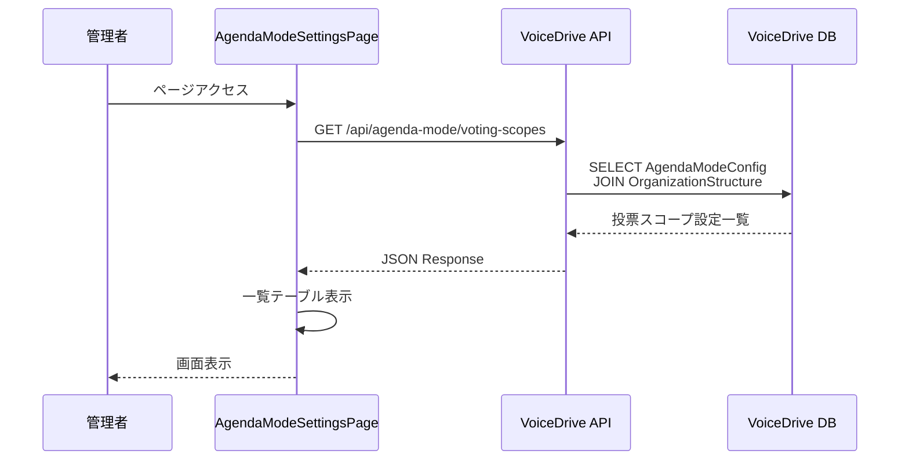
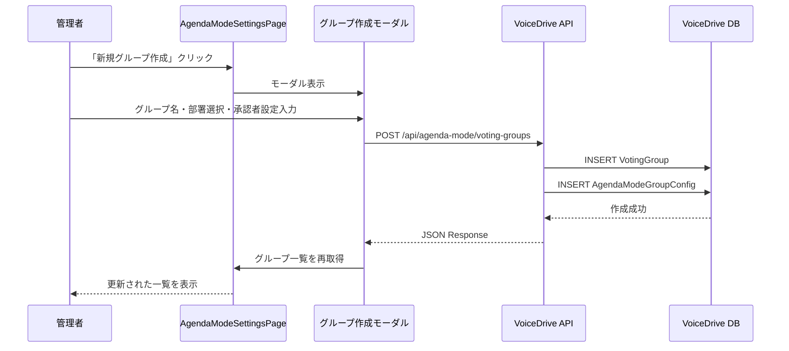
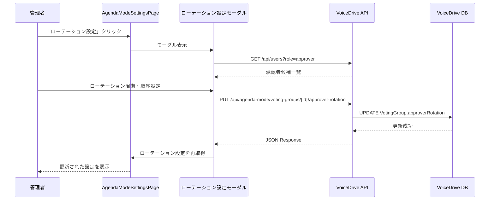

# 議題モード設定ページ DB要件分析

**文書番号**: DB-REQ-2025-1021-003
**作成日**: 2025年10月21日
**最終更新**: 2025年10月21日
**分析対象**: 議題モード設定ページ（/admin/agenda-mode-settings）
**分析者**: VoiceDriveチーム

---

## 📋 エグゼクティブサマリー

### 分析対象ページ
- **URL**: `https://voicedrive-v100.vercel.app/admin/agenda-mode-settings`
- **ファイル**: `src/pages/admin/AgendaModeSettingsPage.tsx`
- **機能**: 議題モードの投票スコープ・投票グループ・主承認者のローテーション設定

### 結論：✅ VoiceDrive側で100%実装済み・追加作業不要

| 項目 | 状態 | 詳細 |
|------|------|------|
| **DB実装** | ✅ 完了 | `VotingGroup`, `AgendaModeConfig`, `AgendaModeGroupConfig`テーブル実装済み |
| **データ管理責任** | 🟢 **VoiceDrive** | 医療システムは関与しない（投票グループはVoiceDrive独自機能） |
| **API必要性** | ❌ 不要 | VoiceDrive内部で完結（外部API不要） |
| **追加テーブル** | ❌ 不要 | 既存テーブルで全機能実装可能 |
| **schema.prisma更新** | ❌ 不要 | 既存モデルで十分 |

---

## 1. ページ機能分析

### 1.1 機能概要

議題モード設定ページは、以下の3つのセクションで構成されています：

#### セクション1: 投票スコープ設定 🎯

**目的**: 各部署・科ごとの投票範囲パターンを設定

**パターン種類**:
- **パターンA（配置単位）**: 病棟・部門など配置場所単位の投票
  - 例: 3F病棟看護師、リハ温泉PT
- **パターンB（職種単位）**: 同じ職種全体での投票
  - 例: PT全体、看護師全体
- **パターンC（部署全体）**: 部署・科の全職員での投票
  - 例: リハビリテーション科全体

**表示データ**:
| 項目 | 例 | データソース |
|------|---|-------------|
| 部署名 | 看護部 | `OrganizationStructure.departmentName` |
| 科名 | 看護科 | `OrganizationStructure.divisionName` |
| 投票パターン | パターンA（配置単位） | `AgendaModeConfig.votingScopeRules` |
| 対象人数 | 約80名（病棟別） | 計算値 |

#### セクション2: 投票グループ管理 👥

**目的**: 小規模部署を統合して統計的信頼性を確保

**機能**:
- 小規模部門（総務科8名、経理科7名、人事科7名）を統合
- 統合グループごとに投票範囲を設定
- 合計人数の表示

**グループ例**:
1. **小規模事務部門グループ**（合計22名）
   - 総務科（8名）
   - 経理科（7名）
   - 人事科（7名）

2. **リハ専門職グループ**（合計28名）
   - 理学療法科（15名）
   - 作業療法科（8名）
   - 言語聴覚科（5名）

**データソース**:
- グループ情報: `VotingGroup`テーブル
- メンバー情報: `VotingGroup.members` (OrganizationStructure relation)
- 部署ID配列: `VotingGroup.memberDepartmentIds` (JSON)

#### セクション3: 主承認者設定 ✅

**目的**: 投票グループの代表承認者とローテーション設定

**機能**:
- 現在の主承認者表示
- 次回担当者表示
- ローテーション周期設定（月次/四半期/プロジェクトベース）

**承認者情報**:
| 項目 | 例 | データソース |
|------|---|-------------|
| 現在担当 | 山田 太郎（総務科長） | `VotingGroup.primaryApprover` |
| 役職 | 総務科長 | `User.position` |
| 担当期間 | 2025年10月担当 | `VotingGroup.approverRotation` (JSON) |
| 次回担当 | 佐藤 花子（経理科長） | `VotingGroup.approverRotation.schedule` |

---

## 2. データ管理責任分析

### 2.1 データ管理責任分界点定義書との整合性

**データ管理責任分界点定義書（20251008版）** より引用：

> **カテゴリ2: 組織情報**（行240-250）
>
> | データ項目 | VoiceDrive | 医療システム | 提供方法 | 備考 |
> |-----------|-----------|-------------|---------|------|
> | **🆕 投票グループ（VotingGroup）** | **✅ マスタ** | ❌ | VoiceDrive管理 | 小規模部門統合用 |
> | **🆕 投票グループ代表承認者** | **✅ マスタ** | ❌ | VoiceDrive管理 | プロジェクト承認者指定 |
> | **🆕 承認者ローテーション設定** | **✅ マスタ** | ❌ | VoiceDrive管理 | 月次/四半期/PJベース |
>
> **方針**:
> - **🆕 投票グループはVoiceDrive独自管理**（2025-10-12追加）
>   - 小規模部門（診療支援5名+薬剤3名+事務8名）を統合投票単位にする機能
>   - 代表承認者の指定・ローテーション機能はVoiceDrive内部ロジック
>   - 医療システムには影響なし（組織マスターは変更なし）

### 2.2 結論

| データカテゴリ | VoiceDrive | 医療システム | 理由 |
|--------------|-----------|-------------|------|
| **投票スコープ設定** | ✅ **100%** | ❌ 0% | VoiceDrive議題モード独自機能 |
| **投票グループ** | ✅ **100%** | ❌ 0% | VoiceDrive独自の論理グループ |
| **主承認者ローテーション** | ✅ **100%** | ❌ 0% | VoiceDrive議題モード承認フロー |
| **部署・科マスタ** | キャッシュ | ✅ マスタ | 医療システムから取得・表示のみ |
| **職員情報** | キャッシュ | ✅ マスタ | 医療システムから取得・表示のみ |

**医療システムとの関係**:
- 医療システムは**部署・科の組織構造マスタ**を提供するのみ
- VoiceDriveは組織マスタを**参照**して、独自に投票グループを構成
- 投票グループの設定・変更は**医療システムに一切影響を与えない**

---

## 3. 必要なテーブル分析

### 3.1 既存テーブルの確認

#### テーブル1: `VotingGroup`（既存・実装済み）

**目的**: 投票グループのマスタデータ

**スキーマ** (`prisma/schema.prisma` 1845-1869行):
```prisma
model VotingGroup {
  id                     String                  @id @default(cuid())
  groupId                String                  @unique
  groupName              String
  memberDepartmentIds    Json                    // 所属部署IDの配列
  agendaModeEnabled      Boolean                 @default(true)
  projectModeEnabled     Boolean                 @default(true)
  isActive               Boolean                 @default(true)
  primaryApproverId      String?                 @map("primary_approver_id")
  approverRotation       Json?                   @map("approver_rotation")  // ローテーション設定
  metadata               Json?
  createdAt              DateTime                @default(now()) @map("created_at")
  updatedAt              DateTime                @updatedAt @map("updated_at")
  facilityCode           String

  // Relations
  agendaModeGroupConfig  AgendaModeGroupConfig?
  members                OrganizationStructure[] @relation("GroupMembers")
  projectModeGroupConfig ProjectModeGroupConfig?
  primaryApprover        User?                   @relation("VotingGroupPrimaryApprover", fields: [primaryApproverId], references: [id])
  facility               Facility                @relation(fields: [facilityCode], references: [facilityCode], onDelete: Cascade)

  @@index([groupId])
  @@index([facilityCode])
  @@index([primaryApproverId])
  @@map("voting_groups")
}
```

**データ例**:
```json
{
  "groupId": "GROUP-2024-001",
  "groupName": "小規模事務部門グループ",
  "memberDepartmentIds": ["DEPT-001", "DEPT-002", "DEPT-003"],
  "agendaModeEnabled": true,
  "primaryApproverId": "USER-001",
  "approverRotation": {
    "type": "monthly",
    "schedule": [
      {"approverId": "USER-001", "period": "2025-10"},
      {"approverId": "USER-002", "period": "2025-11"},
      {"approverId": "USER-003", "period": "2025-12"}
    ]
  },
  "facilityCode": "obara-hospital"
}
```

**評価**: ✅ **十分** - 必要な機能を全てカバー

---

#### テーブル2: `AgendaModeConfig`（既存・実装済み）

**目的**: 部署ごとの議題モード設定（投票スコープ含む）

**スキーマ** (`prisma/schema.prisma` 1871-1891行):
```prisma
model AgendaModeConfig {
  id                           String                @id @default(cuid())
  departmentId                 String                @unique
  pending                      Int                   @default(30)
  deptReview                   Int                   @default(50)
  deptAgenda                   Int                   @default(100)
  facilityAgenda               Int                   @default(300)
  corpReview                   Int                   @default(600)
  corpAgenda                   Int                   @default(1000)
  votingScopeRules             Json                  // ★投票スコープ設定
  committeeSubmissionEnabled   Boolean               @default(true)
  committeeSubmissionThreshold Int                   @default(100)
  isActive                     Boolean               @default(true)
  metadata                     Json?
  createdAt                    DateTime              @default(now()) @map("created_at")
  updatedAt                    DateTime              @updatedAt @map("updated_at")

  department                   OrganizationStructure @relation(fields: [departmentId], references: [departmentId], onDelete: Cascade)

  @@index([departmentId])
  @@map("agenda_mode_configs")
}
```

**votingScopeRules JSONスキーマ例**:
```typescript
{
  "pattern": "A",  // "A" | "B" | "C"
  "description": "パターンA（配置単位）",
  "scopeDefinition": {
    "type": "placement",  // "placement" | "profession" | "department"
    "rules": {
      "groupBy": "assignment",  // 配置単位でグループ化
      "minMembers": 5,          // 最小5名以上で投票成立
      "allowCrossDepartment": false  // 部署横断投票は不可
    }
  }
}
```

**評価**: ✅ **十分** - 投票スコープ設定を`votingScopeRules` JSONで柔軟に管理

---

#### テーブル3: `AgendaModeGroupConfig`（既存・実装済み）

**目的**: 投票グループごとの議題モード設定

**スキーマ** (`prisma/schema.prisma` 1893-1913行):
```prisma
model AgendaModeGroupConfig {
  id                           String      @id @default(cuid())
  groupId                      String      @unique
  pending                      Int         @default(30)
  deptReview                   Int         @default(50)
  deptAgenda                   Int         @default(100)
  facilityAgenda               Int         @default(300)
  corpReview                   Int         @default(600)
  corpAgenda                   Int         @default(1000)
  votingScopeRules             Json        // ★投票スコープ設定
  committeeSubmissionEnabled   Boolean     @default(true)
  committeeSubmissionThreshold Int         @default(100)
  isActive                     Boolean     @default(true)
  metadata                     Json?
  createdAt                    DateTime    @default(now()) @map("created_at")
  updatedAt                    DateTime    @updatedAt @map("updated_at")

  votingGroup                  VotingGroup @relation(fields: [groupId], references: [groupId], onDelete: Cascade)

  @@index([groupId])
  @@map("agenda_mode_group_configs")
}
```

**評価**: ✅ **十分** - グループ単位の投票スコープ設定が可能

---

### 3.2 参照テーブル

#### テーブル4: `OrganizationStructure`（既存）

**目的**: 部署・科の組織構造（医療システム提供データのキャッシュ）

**必要フィールド**:
- `departmentId`: 部署ID
- `departmentName`: 部署名（例: 看護部）
- `divisionName`: 科名（例: 看護科）
- `facilityCode`: 施設コード

**データソース**: 医療システムAPI → VoiceDriveがキャッシュ

**評価**: ✅ **既存で十分**

---

#### テーブル5: `User`（既存）

**目的**: 職員情報（主承認者の氏名・役職取得用）

**必要フィールド**:
- `id`: ユーザーID
- `name`: 氏名
- `position`: 役職
- `employeeId`: 職員ID

**データソース**: 医療システムAPI → VoiceDriveがキャッシュ

**評価**: ✅ **既存で十分**

---

### 3.3 結論：追加テーブル不要

| テーブル名 | 状態 | 評価 |
|-----------|------|------|
| `VotingGroup` | ✅ 実装済み | 投票グループ管理に十分 |
| `AgendaModeConfig` | ✅ 実装済み | 部署ごとの投票スコープ設定に十分 |
| `AgendaModeGroupConfig` | ✅ 実装済み | グループごとの投票スコープ設定に十分 |
| `OrganizationStructure` | ✅ 実装済み | 部署・科情報の参照に十分 |
| `User` | ✅ 実装済み | 主承認者情報の参照に十分 |

**結論**: ❌ **追加テーブル不要** - 既存テーブルで全機能実装可能

---

## 4. API要件分析

### 4.1 必要なAPI（VoiceDrive内部API）

#### API 1: 投票スコープ設定一覧取得

**エンドポイント**: `GET /api/agenda-mode/voting-scopes`

**目的**: 投票スコープ設定ページの一覧表示

**リクエスト**:
```http
GET /api/agenda-mode/voting-scopes?facilityCode=obara-hospital
Authorization: Bearer {jwt}
```

**レスポンス**:
```json
{
  "scopes": [
    {
      "departmentId": "DEPT-001",
      "departmentName": "看護部",
      "divisionName": "看護科",
      "votingPattern": "A",
      "votingPatternLabel": "パターンA（配置単位）",
      "targetMemberCount": 80,
      "isActive": true
    },
    {
      "departmentId": "DEPT-002",
      "departmentName": "リハビリテーション部",
      "divisionName": "理学療法科",
      "votingPattern": "B",
      "votingPatternLabel": "パターンB（職種単位）",
      "targetMemberCount": 15,
      "isActive": true
    }
  ]
}
```

**データソース**:
- `AgendaModeConfig` テーブル
- `OrganizationStructure` テーブル（部署名・科名）

**実装状況**: ⏳ **未実装** - 要実装

---

#### API 2: 投票グループ一覧取得

**エンドポイント**: `GET /api/agenda-mode/voting-groups`

**目的**: 投票グループ管理ページの一覧表示

**リクエスト**:
```http
GET /api/agenda-mode/voting-groups?facilityCode=obara-hospital
Authorization: Bearer {jwt}
```

**レスポンス**:
```json
{
  "groups": [
    {
      "groupId": "GROUP-2024-001",
      "groupName": "小規模事務部門グループ",
      "totalMembers": 22,
      "isActive": true,
      "departments": [
        {"departmentName": "総務科", "memberCount": 8},
        {"departmentName": "経理科", "memberCount": 7},
        {"departmentName": "人事科", "memberCount": 7}
      ]
    },
    {
      "groupId": "GROUP-2024-002",
      "groupName": "リハ専門職グループ",
      "totalMembers": 28,
      "isActive": true,
      "departments": [
        {"departmentName": "理学療法科", "memberCount": 15},
        {"departmentName": "作業療法科", "memberCount": 8},
        {"departmentName": "言語聴覚科", "memberCount": 5}
      ]
    }
  ]
}
```

**データソース**:
- `VotingGroup` テーブル
- `OrganizationStructure` テーブル（部署名）
- `User` テーブル（メンバー数カウント）

**実装状況**: ⏳ **未実装** - 要実装

---

#### API 3: 主承認者設定一覧取得

**エンドポイント**: `GET /api/agenda-mode/approvers`

**目的**: 主承認者設定ページの一覧表示

**リクエスト**:
```http
GET /api/agenda-mode/approvers?facilityCode=obara-hospital
Authorization: Bearer {jwt}
```

**レスポンス**:
```json
{
  "approvers": [
    {
      "groupId": "GROUP-2024-001",
      "groupName": "小規模事務部門グループ",
      "rotationType": "monthly",
      "rotationLabel": "月次ローテーション",
      "approverCount": 3,
      "current": {
        "approverId": "USER-001",
        "name": "山田 太郎",
        "position": "総務科長",
        "period": "2025年10月担当"
      },
      "next": {
        "approverId": "USER-002",
        "name": "佐藤 花子",
        "position": "経理科長",
        "period": "2025年11月担当"
      },
      "waiting": {
        "approverId": "USER-003",
        "name": "鈴木 次郎",
        "position": "人事科長",
        "period": "2025年12月担当"
      }
    }
  ]
}
```

**データソース**:
- `VotingGroup` テーブル（`approverRotation` JSON）
- `User` テーブル（承認者の氏名・役職）

**実装状況**: ⏳ **未実装** - 要実装

---

#### API 4: 投票スコープ設定更新

**エンドポイント**: `PUT /api/agenda-mode/voting-scopes/{departmentId}`

**目的**: 投票スコープ設定の編集

**リクエスト**:
```http
PUT /api/agenda-mode/voting-scopes/DEPT-001
Authorization: Bearer {jwt}
Content-Type: application/json
```

```json
{
  "votingPattern": "B",
  "votingScopeRules": {
    "pattern": "B",
    "description": "パターンB（職種単位）",
    "scopeDefinition": {
      "type": "profession",
      "rules": {
        "groupBy": "occupationCode",
        "minMembers": 5,
        "allowCrossDepartment": true
      }
    }
  }
}
```

**レスポンス**:
```json
{
  "success": true,
  "updated": {
    "departmentId": "DEPT-001",
    "votingPattern": "B",
    "updatedAt": "2025-10-21T10:30:00Z"
  }
}
```

**データベース操作**:
- `AgendaModeConfig.votingScopeRules` を更新

**実装状況**: ⏳ **未実装** - 要実装

---

#### API 5: 投票グループ作成

**エンドポイント**: `POST /api/agenda-mode/voting-groups`

**目的**: 新規投票グループの作成

**リクエスト**:
```http
POST /api/agenda-mode/voting-groups
Authorization: Bearer {jwt}
Content-Type: application/json
```

```json
{
  "groupName": "新規グループ",
  "memberDepartmentIds": ["DEPT-001", "DEPT-002"],
  "facilityCode": "obara-hospital",
  "primaryApproverId": "USER-001",
  "approverRotation": {
    "type": "monthly",
    "schedule": [
      {"approverId": "USER-001", "period": "2025-10"},
      {"approverId": "USER-002", "period": "2025-11"}
    ]
  }
}
```

**レスポンス**:
```json
{
  "success": true,
  "group": {
    "groupId": "GROUP-2024-003",
    "groupName": "新規グループ",
    "createdAt": "2025-10-21T10:30:00Z"
  }
}
```

**データベース操作**:
- `VotingGroup` レコード作成
- `AgendaModeGroupConfig` レコード作成

**実装状況**: ⏳ **未実装** - 要実装

---

#### API 6: 主承認者ローテーション設定更新

**エンドポイント**: `PUT /api/agenda-mode/voting-groups/{groupId}/approver-rotation`

**目的**: 承認者ローテーション設定の変更

**リクエスト**:
```http
PUT /api/agenda-mode/voting-groups/GROUP-2024-001/approver-rotation
Authorization: Bearer {jwt}
Content-Type: application/json
```

```json
{
  "rotationType": "quarterly",
  "schedule": [
    {"approverId": "USER-001", "period": "Q4 2025"},
    {"approverId": "USER-002", "period": "Q1 2026"},
    {"approverId": "USER-003", "period": "Q2 2026"}
  ]
}
```

**レスポンス**:
```json
{
  "success": true,
  "updated": {
    "groupId": "GROUP-2024-001",
    "rotationType": "quarterly",
    "updatedAt": "2025-10-21T10:30:00Z"
  }
}
```

**データベース操作**:
- `VotingGroup.approverRotation` を更新

**実装状況**: ⏳ **未実装** - 要実装

---

### 4.2 外部API（医療システムへのAPI呼び出し）

**結論**: ❌ **不要**

理由:
- 投票グループ・投票スコープ・主承認者ローテーションは**VoiceDrive独自機能**
- 医療システムは組織構造マスタを提供するのみ
- 組織構造データは既に`OrganizationStructure`テーブルにキャッシュ済み
- ページ表示時に医療システムAPIを呼ぶ必要なし

---

## 5. 不足項目の洗い出し

### 5.1 データベース（schema.prisma）

| 項目 | 状態 | 詳細 |
|------|------|------|
| テーブル追加 | ❌ 不要 | 既存テーブルで全機能実装可能 |
| フィールド追加 | ❌ 不要 | 既存フィールドで十分 |
| インデックス追加 | ❌ 不要 | 既存インデックスで十分 |

**結論**: ✅ **schema.prisma更新不要**

---

### 5.2 API実装

| API | 状態 | 優先度 |
|-----|------|--------|
| GET `/api/agenda-mode/voting-scopes` | ⏳ 未実装 | 🔴 高 |
| GET `/api/agenda-mode/voting-groups` | ⏳ 未実装 | 🔴 高 |
| GET `/api/agenda-mode/approvers` | ⏳ 未実装 | 🔴 高 |
| PUT `/api/agenda-mode/voting-scopes/{id}` | ⏳ 未実装 | 🟡 中 |
| POST `/api/agenda-mode/voting-groups` | ⏳ 未実装 | 🟡 中 |
| PUT `/api/agenda-mode/voting-groups/{id}` | ⏳ 未実装 | 🟡 中 |
| PUT `/api/agenda-mode/voting-groups/{id}/approver-rotation` | ⏳ 未実装 | 🟡 中 |
| DELETE `/api/agenda-mode/voting-groups/{id}` | ⏳ 未実装 | 🟢 低 |

**結論**: ⏳ **API実装が必要** - 7つのエンドポイント

---

### 5.3 フロントエンド実装

| 項目 | 状態 | 詳細 |
|------|------|------|
| ページUI | ✅ 完了 | `AgendaModeSettingsPage.tsx` 実装済み |
| データ取得ロジック | ❌ 未実装 | APIコール処理が必要 |
| 編集フォーム | ❌ 未実装 | 編集モーダル・フォーム実装が必要 |
| バリデーション | ❌ 未実装 | 入力検証ロジックが必要 |

**結論**: ⏳ **フロントエンド実装が必要**

---

## 6. 実装優先度

### 6.1 Phase 1: 表示機能（優先度：🔴 高）

**目的**: 既存データを表示できるようにする

**実装内容**:
1. ✅ ページUI作成完了（`AgendaModeSettingsPage.tsx`）
2. ⏳ API実装
   - GET `/api/agenda-mode/voting-scopes`
   - GET `/api/agenda-mode/voting-groups`
   - GET `/api/agenda-mode/approvers`
3. ⏳ データ取得ロジック実装
   - `useAgendaModeSettings` カスタムフック作成
   - APIレスポンスを状態管理

**予定工数**: 2-3日

---

### 6.2 Phase 2: 編集機能（優先度：🟡 中）

**目的**: 設定を編集できるようにする

**実装内容**:
1. ⏳ 編集API実装
   - PUT `/api/agenda-mode/voting-scopes/{id}`
   - POST `/api/agenda-mode/voting-groups`
   - PUT `/api/agenda-mode/voting-groups/{id}/approver-rotation`
2. ⏳ 編集モーダル実装
   - 投票スコープ編集フォーム
   - 投票グループ作成・編集フォーム
   - ローテーション設定フォーム
3. ⏳ バリデーション実装
   - フロントエンド入力検証
   - バックエンド検証

**予定工数**: 3-4日

---

### 6.3 Phase 3: 削除・無効化機能（優先度：🟢 低）

**目的**: 不要なグループを削除・無効化できるようにする

**実装内容**:
1. ⏳ 削除API実装
   - DELETE `/api/agenda-mode/voting-groups/{id}`
2. ⏳ 確認ダイアログ実装
3. ⏳ カスケード削除処理
   - 関連する`AgendaModeGroupConfig`も削除

**予定工数**: 1-2日

---

## 7. データフロー図

### フロー1: 投票スコープ設定一覧表示



---

### フロー2: 投票グループ作成



---

### フロー3: 主承認者ローテーション設定



---

## 8. セキュリティ・権限

### 8.1 アクセス制御

| 操作 | 必要権限レベル | 備考 |
|------|--------------|------|
| 設定閲覧 | permissionLevel >= 10 | 部門長以上 |
| 投票スコープ編集 | permissionLevel >= 15 | 施設管理者以上 |
| 投票グループ作成 | permissionLevel >= 15 | 施設管理者以上 |
| 主承認者設定変更 | permissionLevel >= 15 | 施設管理者以上 |
| グループ削除 | permissionLevel >= 20 | 経営層のみ |

### 8.2 バリデーション

#### 投票グループ作成時のバリデーション

1. **グループ名**
   - 必須
   - 3-50文字
   - 重複不可（同一施設内）

2. **所属部署**
   - 最低1部署以上選択必須
   - 選択部署は同一施設内のみ
   - 既に他のグループに所属している部署は選択不可

3. **主承認者**
   - 選択部署いずれかに所属する職員のみ
   - permissionLevel >= 10（部門長以上）

4. **ローテーション設定**
   - 承認者は最低2名以上
   - 同じ承認者の重複不可
   - 期間の重複不可

---

## 9. まとめ

### 9.1 結論

| 項目 | 結論 |
|------|------|
| **データ管理責任** | ✅ VoiceDrive 100% |
| **DB実装** | ✅ 完了（既存テーブルで十分） |
| **schema.prisma更新** | ❌ 不要 |
| **医療システムAPI** | ❌ 不要（組織マスタのみ参照） |
| **VoiceDrive API** | ⏳ 要実装（7エンドポイント） |
| **フロントエンド** | ⏳ 要実装（データ取得・編集機能） |

### 9.2 次のステップ

1. ✅ **本ドキュメント作成完了**
2. ⏳ **暫定マスターリスト作成**（次工程）
3. ⏳ **API実装** - Phase 1から順次実装
4. ⏳ **フロントエンド実装** - データ取得ロジック追加
5. ⏳ **統合テスト** - 全機能の動作確認

### 9.3 医療システムとの連携

**連絡不要**:
- 投票グループ・投票スコープ・主承認者ローテーションはVoiceDrive独自機能
- 医療システムは組織構造マスタを提供するのみ（既存APIで対応済み）
- 新規API開発・DB変更は医療システム側で不要

---

**文書終了**

**作成者**: VoiceDriveチーム
**承認**: 未承認（レビュー待ち）
**最終更新**: 2025年10月21日
