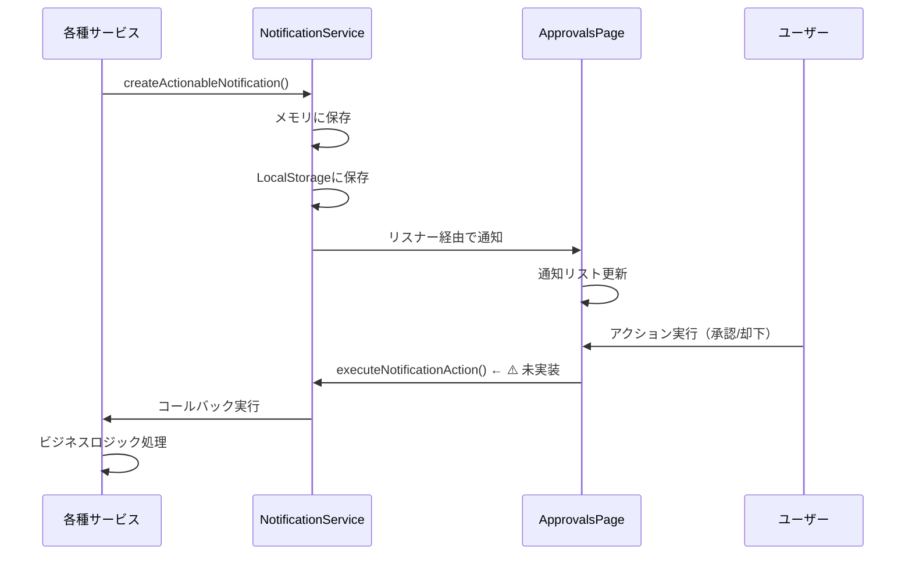

# approvals (承認・対応管理) DB要件分析

**文書番号**: DB-REQ-APPROVALS-20251013-001
**作成日**: 2025年10月13日
**対象ページ**: https://voicedrive-v100.vercel.app/approvals
**作成目的**: ApprovalsPageの機能分析とデータ要件定義
**重要度**: 🟢 中

---

## 📋 エグゼクティブサマリー

### ページ概要
- **ページ名**: 承認・対応管理 (Approvals)
- **主な機能**: ユーザーの対応が必要な承認タスク・通知を一元管理
- **URL**: `/approvals`
- **アクセス権限**: 承認権限を持つユーザーのみ（APPROVAL_MANAGEMENT、EMERGENCY_AUTHORITY、WEIGHT_ADJUSTMENT、PROJECT_MANAGEMENT、MEMBER_SELECTION）

### 現在の実装状況
- ✅ **実装済み**: UIコンポーネント、通知表示、フィルタリング
- ⚠️ **部分実装**: NotificationServiceのアクション実行機能（メソッド未実装）
- ❌ **未実装**: バックエンドAPI、データベース永続化

### データ管理責任
- **承認タスク**: 🟢 VoiceDrive管轄（ApprovalTaskテーブル）
- **通知データ**: 🟢 VoiceDrive管轄（メモリ/LocalStorage、DB永続化は未実装）
- **ユーザー権限**: 🔵 医療システム管轄（User.permissionLevel、User.accountType）

---

## 🎯 ページ機能分析

### 1. 表示される通知カテゴリ

| カテゴリ | NotificationType | 説明 | データソース |
|---------|-----------------|------|-------------|
| 承認待ち | APPROVAL_REQUIRED | 予算承認、プロジェクト承認 | NotificationService |
| メンバー選定 | MEMBER_SELECTION | プロジェクトメンバー参加依頼 | NotificationService |
| 投票依頼 | VOTE_REQUIRED | 議題投票、提案投票 | NotificationService |
| 緊急対応 | EMERGENCY_ACTION | 緊急承認、緊急判断 | NotificationService |
| エスカレーション | ESCALATION | 期限切れによる上位承認者への移行 | NotificationService |
| プロジェクト更新 | PROJECT_UPDATE | プロジェクト状況変更通知 | NotificationService |
| 期限リマインダー | DEADLINE_REMINDER | 対応期限接近通知 | NotificationService |

---

### 2. データフロー

#### 通知生成フロー


#### 現在の問題点
1. **NotificationServiceのメソッド未実装**
   - `createActionableNotification()` - 未実装
   - `executeNotificationAction()` - 未実装
   - `registerActionCallback()` - 未実装

2. **データ永続化の欠如**
   - 通知データはメモリとLocalStorageのみ
   - サーバー再起動で消失
   - 複数デバイス間で同期不可

3. **権限チェックの分散**
   - フロントエンド: `usePermissions()` フック
   - バックエンドAPIでの権限検証が必要

---

## 📊 データ要件分析

### 必要なデータテーブル

#### 1. 通知テーブル (Notification) - 拡張が必要

**既存のNotificationモデル**:
```prisma
model Notification {
  id             String    @id @default(cuid())
  category       String
  subcategory    String?
  priority       String
  title          String
  content        String
  target         String
  senderId       String
  status         String    @default("pending")
  sentAt         DateTime?
  recipientCount Int       @default(0)
  readCount      Int       @default(0)
  clickCount     Int       @default(0)
  createdAt      DateTime  @default(now())
  updatedAt      DateTime  @updatedAt
  sender         User      @relation(fields: [senderId], references: [id])
}
```

**不足フィールド**:
- ❌ `recipientId` - 受信者ID（個別通知に必須）
- ❌ `notificationType` - 通知タイプ（APPROVAL_REQUIRED等）
- ❌ `isRead` - 既読フラグ
- ❌ `isActioned` - アクション実行済みフラグ
- ❌ `actionRequired` - アクション必須フラグ
- ❌ `dueDate` - 対応期限
- ❌ `metadata` - メタデータ（projectId、requestId等）
- ❌ `urgency` - 緊急度（normal、high、urgent）
- ❌ `actions` - 可能なアクション（JSON）

---

#### 2. 通知アクションテーブル (NotificationAction) - 新規作成が必要

```prisma
model NotificationAction {
  id             String    @id @default(cuid())
  notificationId String
  actionId       String    // 'approve', 'reject', 'view', etc.
  label          String    // '承認', '却下', '詳細確認'
  actionType     String    // 'primary', 'secondary', 'danger'
  requiresComment Boolean  @default(false)
  order          Int       @default(0)
  createdAt      DateTime  @default(now())

  notification   Notification @relation(fields: [notificationId], references: [id], onDelete: Cascade)

  @@index([notificationId])
}
```

**用途**:
- 通知ごとに実行可能なアクションを定義
- UI上のボタン表示に使用

---

#### 3. 通知受信者テーブル (NotificationRecipient) - 新規作成が必要

```prisma
model NotificationRecipient {
  id             String    @id @default(cuid())
  notificationId String
  recipientId    String
  isRead         Boolean   @default(false)
  isActioned     Boolean   @default(false)
  readAt         DateTime?
  actionedAt     DateTime?
  actionType     String?   // 'approved', 'rejected', etc.
  actionComment  String?
  createdAt      DateTime  @default(now())
  updatedAt      DateTime  @updatedAt

  notification   Notification @relation(fields: [notificationId], references: [id], onDelete: Cascade)
  recipient      User         @relation(fields: [recipientId], references: [id], onDelete: Cascade)

  @@unique([notificationId, recipientId])
  @@index([recipientId, isRead])
  @@index([recipientId, isActioned])
  @@index([recipientId, createdAt])
}
```

**用途**:
- 1つの通知を複数ユーザーに送信可能
- ユーザーごとの既読・アクション状態管理

---

#### 4. 既存ApprovalTaskテーブル - 活用可能

```prisma
model ApprovalTask {
  id                  String    @id @default(cuid())
  title               String
  description         String?
  taskType            String
  amount              Float?
  requesterId         String
  requesterName       String?
  requesterEmployeeId String?
  approverId          String?
  approverName        String?
  approverEmployeeId  String?
  status              String    @default("pending")
  priority            String    @default("medium")
  department          String?
  facilityId          String?
  submittedAt         DateTime  @default(now())
  respondedAt         DateTime?
  approverComment     String?
  metadata            Json?
  createdAt           DateTime  @default(now())
  updatedAt           DateTime  @updatedAt
  approver            User?     @relation("ApprovalApprover", fields: [approverId], references: [id])
  requester           User      @relation("ApprovalRequester", fields: [requesterId], references: [id], onDelete: Cascade)

  @@index([requesterId])
  @@index([approverId])
  @@index([status])
}
```

**用途**:
- 承認タスクのビジネスデータ保持
- 通知システムと連携してNotificationレコード生成

---

## 🔄 データ管理責任分界点

### VoiceDrive管轄（✅ マスタ）

| データ項目 | テーブル | 管理内容 | 備考 |
|-----------|---------|---------|------|
| 通知データ | Notification | 全通知の管理 | 承認、投票、エスカレーション等 |
| 通知受信状態 | NotificationRecipient | ユーザーごとの既読・アクション状態 | - |
| 通知アクション | NotificationAction | 通知ごとの可能アクション | - |
| 承認タスク | ApprovalTask | 承認案件の詳細情報 | 予算承認、プロジェクト承認 |
| 投票依頼 | Post、Poll | 投票が必要な提案 | フリースペース投票 |
| プロジェクト承認 | Project、ProjectApproval | プロジェクト関連承認 | - |

### 医療システム管轄（🔵 マスタ）

| データ項目 | 提供方法 | VoiceDrive利用 | 備考 |
|-----------|---------|---------------|------|
| ユーザー権限レベル | API | キャッシュ（User.permissionLevel） | 承認権限判定に使用 |
| アカウント種別 | API | キャッシュ（User.accountType） | DEPARTMENT_HEAD等 |
| 組織階層 | API | キャッシュ（User.parentId） | エスカレーション先判定 |
| 部署情報 | API | キャッシュ（User.department） | フィルタリング用 |
| 予算承認限度額 | API | キャッシュ（User.budgetApprovalLimit） | 承認可能金額判定 |

---

## 🚨 不足項目の洗い出し

### データベーステーブルの不足

#### 1. Notificationテーブルの拡張

**追加が必要なフィールド**:
```prisma
model Notification {
  // ... 既存フィールド ...

  // 🆕 追加フィールド
  notificationType   String    // APPROVAL_REQUIRED, VOTE_REQUIRED, etc.
  urgency            String    @default("normal") // normal, high, urgent
  actionRequired     Boolean   @default(false)
  dueDate            DateTime?
  metadata           Json?     // { projectId, requestId, postId, etc. }

  // 🆕 リレーション
  actions            NotificationAction[]
  recipients         NotificationRecipient[]
}
```

#### 2. 新規テーブル

- ✅ **NotificationAction** - 通知アクション定義
- ✅ **NotificationRecipient** - 通知受信者状態管理

---

### APIエンドポイントの不足

#### 1. 通知関連API

| エンドポイント | メソッド | 機能 | 実装状況 |
|-------------|---------|------|---------|
| `/api/notifications` | GET | 自分宛ての通知一覧取得 | ❌ 未実装 |
| `/api/notifications/:id/read` | PATCH | 通知を既読にする | ❌ 未実装 |
| `/api/notifications/:id/action` | POST | 通知アクション実行 | ❌ 未実装 |
| `/api/notifications/stats` | GET | 通知統計（未読数等） | ❌ 未実装 |

#### 2. 承認タスクAPI

| エンドポイント | メソッド | 機能 | 実装状況 |
|-------------|---------|------|---------|
| `/api/approvals` | GET | 自分の承認待ちタスク一覧 | ❌ 未実装 |
| `/api/approvals/:id/approve` | POST | 承認実行 | ❌ 未実装 |
| `/api/approvals/:id/reject` | POST | 却下実行 | ❌ 未実装 |
| `/api/approvals/:id/escalate` | POST | エスカレーション実行 | ❌ 未実装 |

---

### サービス層の不足

#### 1. NotificationService拡張

**未実装メソッド**:
```typescript
class NotificationService {
  // ❌ 未実装
  async createActionableNotification(
    userId: string,
    type: NotificationType,
    options: {
      title: string;
      message: string;
      actions?: Array<{
        id: string;
        label: string;
        type: 'primary' | 'secondary' | 'danger';
        action: string;
        requiresComment?: boolean;
      }>;
      metadata?: any;
      dueDate?: Date;
    }
  ): Promise<void>

  // ❌ 未実装
  async executeNotificationAction(
    userId: string,
    notificationId: string,
    actionId: string,
    comment?: string
  ): Promise<{ success: boolean; message: string }>

  // ❌ 未実装
  registerActionCallback(
    actionType: string,
    callback: (userId: string, actionId: string, metadata: any, comment?: string) => Promise<boolean>
  ): void
}
```

#### 2. ApprovalWorkflowEngine拡張

**既存**: `src/services/ApprovalWorkflowEngine.ts`
**必要な拡張**:
- 通知システムとの統合
- エスカレーション処理の自動化
- 期限監視機能

---

## 📐 推奨スキーマ設計

### 完全なNotificationモデル

```prisma
model Notification {
  id               String    @id @default(cuid())

  // 基本情報
  notificationType String    // APPROVAL_REQUIRED, MEMBER_SELECTION, VOTE_REQUIRED, etc.
  category         String    // 'approval', 'vote', 'project', etc.
  subcategory      String?

  // 内容
  title            String
  content          String

  // 送信者情報
  senderId         String
  sender           User      @relation("NotificationSender", fields: [senderId], references: [id])

  // 優先度・緊急度
  priority         String    @default("medium") // low, medium, high
  urgency          String    @default("normal") // normal, high, urgent

  // アクション
  actionRequired   Boolean   @default(false)
  dueDate          DateTime?

  // メタデータ
  metadata         Json?     // { projectId, requestId, postId, workflowStage, etc. }

  // 統計
  recipientCount   Int       @default(0)
  readCount        Int       @default(0)
  actionCount      Int       @default(0)

  // タイムスタンプ
  status           String    @default("pending") // pending, sent, completed, expired
  sentAt           DateTime?
  createdAt        DateTime  @default(now())
  updatedAt        DateTime  @updatedAt

  // リレーション
  actions          NotificationAction[]
  recipients       NotificationRecipient[]

  @@index([notificationType])
  @@index([status])
  @@index([senderId])
  @@index([dueDate])
  @@index([createdAt])
}

model NotificationAction {
  id              String       @id @default(cuid())
  notificationId  String
  actionId        String       // 'approve', 'reject', 'view', 'participate', etc.
  label           String       // '承認', '却下', '詳細確認', '参加する'
  actionType      String       // 'primary', 'secondary', 'danger'
  requiresComment Boolean      @default(false)
  order           Int          @default(0)
  createdAt       DateTime     @default(now())

  notification    Notification @relation(fields: [notificationId], references: [id], onDelete: Cascade)

  @@index([notificationId])
  @@unique([notificationId, actionId])
}

model NotificationRecipient {
  id             String       @id @default(cuid())
  notificationId String
  recipientId    String

  // 状態
  isRead         Boolean      @default(false)
  isActioned     Boolean      @default(false)

  // アクション詳細
  actionType     String?      // 'approved', 'rejected', 'participated', etc.
  actionComment  String?

  // タイムスタンプ
  readAt         DateTime?
  actionedAt     DateTime?
  createdAt      DateTime     @default(now())
  updatedAt      DateTime     @updatedAt

  // リレーション
  notification   Notification @relation(fields: [notificationId], references: [id], onDelete: Cascade)
  recipient      User         @relation("NotificationRecipient", fields: [recipientId], references: [id], onDelete: Cascade)

  @@unique([notificationId, recipientId])
  @@index([recipientId, isRead])
  @@index([recipientId, isActioned])
  @@index([recipientId, createdAt])
  @@index([notificationId, recipientId])
}
```

---

## 🔧 必要なAPI実装

### 1. 通知取得API

**エンドポイント**: `GET /api/notifications`

**クエリパラメータ**:
- `type` - 通知タイプフィルタ（APPROVAL_REQUIRED等）
- `unreadOnly` - 未読のみ（boolean）
- `pendingOnly` - 未対応のみ（boolean）
- `limit` - 取得件数
- `offset` - オフセット

**レスポンス例**:
```json
{
  "notifications": [
    {
      "id": "notif_001",
      "type": "APPROVAL_REQUIRED",
      "title": "承認依頼 - プロジェクト PROJECT-001",
      "message": "予算: ¥1,500,000\n理由: 新規プロジェクト開始のため",
      "urgency": "high",
      "isRead": false,
      "isActioned": false,
      "actionRequired": true,
      "dueDate": "2025-10-20T15:00:00Z",
      "actions": [
        { "id": "approve", "label": "承認", "type": "primary" },
        { "id": "reject", "label": "却下", "type": "danger", "requiresComment": true }
      ],
      "metadata": {
        "projectId": "proj_001",
        "requestId": "req_001",
        "budgetAmount": 1500000
      },
      "createdAt": "2025-10-13T10:00:00Z"
    }
  ],
  "stats": {
    "total": 15,
    "unread": 8,
    "pending": 5,
    "overdue": 2
  }
}
```

---

### 2. 通知アクション実行API

**エンドポイント**: `POST /api/notifications/:id/action`

**リクエストボディ**:
```json
{
  "actionId": "approve",
  "comment": "承認します。予算内で問題ありません。"
}
```

**レスポンス**:
```json
{
  "success": true,
  "message": "承認が完了しました",
  "notification": {
    "id": "notif_001",
    "isActioned": true,
    "actionType": "approved",
    "actionedAt": "2025-10-13T14:30:00Z"
  }
}
```

---

## 🎯 実装優先順位

### Phase 1: データベース拡張（1-2日）

1. ✅ Notificationモデル拡張
2. ✅ NotificationActionモデル作成
3. ✅ NotificationRecipientモデル作成
4. ✅ マイグレーション実行

### Phase 2: NotificationService実装（2-3日）

1. ✅ `createActionableNotification()` 実装
2. ✅ `executeNotificationAction()` 実装
3. ✅ `registerActionCallback()` 実装
4. ✅ データベース永続化対応

### Phase 3: API実装（2-3日）

1. ✅ `GET /api/notifications` 実装
2. ✅ `POST /api/notifications/:id/action` 実装
3. ✅ `PATCH /api/notifications/:id/read` 実装
4. ✅ 権限チェックロジック実装

### Phase 4: 統合テスト（1-2日）

1. ✅ フロントエンド・バックエンド統合
2. ✅ 承認フロー動作確認
3. ✅ エスカレーション動作確認
4. ✅ パフォーマンステスト

---

## 📝 医療システムとの連携要件

### VoiceDriveが医療システムに提供するAPI

| API | 提供内容 | 頻度 | 用途 |
|-----|---------|------|------|
| `GET /api/voicedrive/approvals/stats` | 承認統計 | 日次 | ダッシュボード表示 |
| `GET /api/voicedrive/users/:id/pending-approvals` | ユーザーの未対応承認数 | リアルタイム | 通知バッジ |

### 医療システムから取得するAPI

| API | 取得内容 | 頻度 | 用途 |
|-----|---------|------|------|
| `GET /api/employees/:id` | ユーザー詳細情報 | キャッシュ更新時 | 権限レベル確認 |
| `GET /api/employees/:id/hierarchy` | 組織階層情報 | エスカレーション時 | 上位承認者特定 |

---

## 🔍 まとめ

### 現状の課題
1. ⚠️ NotificationServiceの中核メソッドが未実装
2. ⚠️ 通知データの永続化が未実装（メモリ・LocalStorageのみ）
3. ⚠️ 通知アクション実行のバックエンドAPIが存在しない
4. ⚠️ 複数受信者への通知送信機能がない

### 推奨対応
1. **Notificationテーブル拡張** - 通知タイプ、緊急度、メタデータフィールド追加
2. **NotificationAction/Recipientテーブル作成** - アクション定義と受信者状態管理
3. **NotificationService完全実装** - データベース永続化対応
4. **通知API実装** - 取得・既読・アクション実行エンドポイント
5. **ApprovalFlowServiceとの統合** - 承認フローと通知システムの連携

### データ管理責任
- **通知・承認データ**: 🟢 VoiceDrive完全管轄
- **ユーザー権限データ**: 🔵 医療システムから取得・キャッシュ

---

**文書終了**

最終更新: 2025年10月13日
作成者: VoiceDriveチーム
次のアクション: approvals暫定マスターリスト作成
