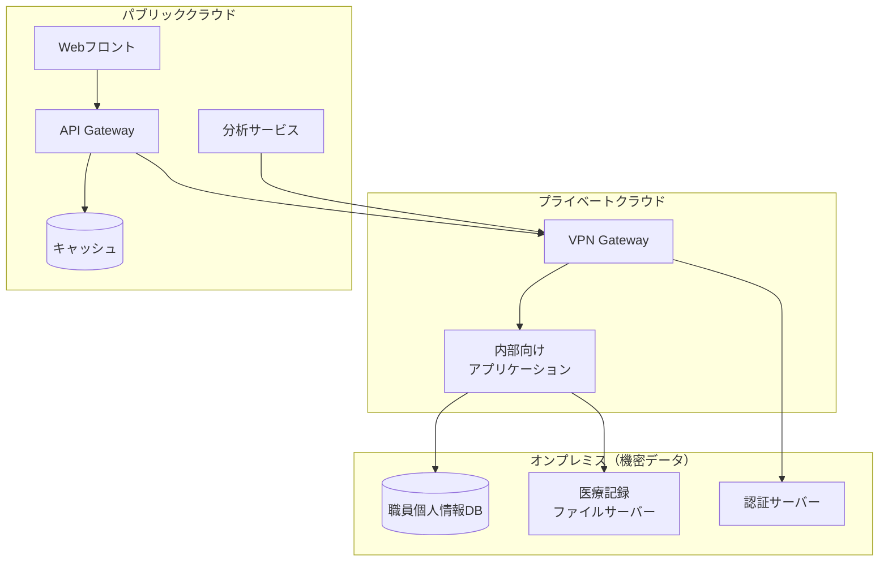

# バックエンドインフラ比較検討書

## 医療職員管理システム - インフラ選定ガイド

### システム要件の整理
- **データ特性**: 職員個人情報、医療関連情報、面談記録
- **規模**: 中〜大規模医療機関の職員データ
- **連携**: VoiceDrive法人SNSとのリアルタイム連携
- **コンプライアンス**: 個人情報保護法、医療情報セキュリティ

## オンプレミス vs クラウド比較表

| 項目 | オンプレミス | クラウド（AWS/Azure/GCP） | ハイブリッド |
|------|-------------|------------------------|------------|
| **初期コスト** | ⚠️ 高い（500万〜2000万円） | ✅ 低い（月額課金） | 🔶 中程度 |
| **運用コスト** | ⚠️ 高い（人件費含む） | ✅ 予測可能（従量課金） | 🔶 両方必要 |
| **拡張性** | ❌ 制限あり | ✅ 無制限に近い | ✅ 柔軟 |
| **セキュリティ制御** | ✅ 完全制御 | 🔶 共同責任モデル | ✅ 選択的制御 |
| **データ主権** | ✅ 完全保持 | ⚠️ ベンダー依存 | ✅ 選択可能 |
| **災害復旧** | ⚠️ 自前構築必要 | ✅ 組み込み機能 | ✅ 最適化可能 |
| **保守管理** | ❌ 24/365体制必要 | ✅ ベンダー管理 | 🔶 分担 |
| **導入速度** | ❌ 3-6ヶ月 | ✅ 即日〜1週間 | 🔶 1-3ヶ月 |
| **コンプライアンス** | ✅ 完全準拠可能 | 🔶 要確認 | ✅ 最適化可能 |
| **カスタマイズ性** | ✅ 無制限 | 🔶 制約あり | ✅ 高い |

## 詳細比較

### 1. オンプレミス環境

#### メリット
```yaml
セキュリティ:
  - 物理的に隔離された環境
  - 完全な管理権限
  - 独自のセキュリティポリシー適用可能
  
データ管理:
  - データの完全な所有権
  - 法規制への対応が明確
  - 監査要件を満たしやすい

カスタマイズ:
  - ハードウェア選定の自由
  - ネットワーク構成の完全制御
  - レガシーシステムとの統合容易
```

#### デメリット
```yaml
コスト:
  - サーバー購入: 200-500万円/台
  - UPS/空調設備: 100-300万円
  - ネットワーク機器: 50-200万円
  - 年間保守費: 初期投資の15-20%

運用負荷:
  - 専門人材の確保（最低2-3名）
  - 24時間監視体制
  - 定期的なハードウェア更新

リスク:
  - 単一障害点
  - 災害時の事業継続性
  - 拡張時の調達期間
```

#### 推奨構成
```
┌─────────────────────────────────────┐
│  本番環境（冗長構成）                │
├─────────────────────────────────────┤
│ Webサーバー: 2台（負荷分散）        │
│ APサーバー: 2台（負荷分散）         │
│ DBサーバー: 2台（Active-Standby）   │
│ バックアップ: 1台                   │
│ 監視サーバー: 1台                   │
└─────────────────────────────────────┘
推定費用: 1500-2500万円
```

### 2. クラウド環境

#### メリット
```yaml
即座の利用開始:
  - 数分でサーバー起動
  - 自動スケーリング
  - グローバル展開可能

運用効率:
  - マネージドサービス活用
  - 自動バックアップ
  - 組み込みモニタリング

コスト最適化:
  - 使用分のみ課金
  - リザーブドインスタンスで割引
  - 不要時は停止可能
```

#### デメリット
```yaml
依存リスク:
  - ベンダーロックイン
  - サービス停止リスク
  - 価格改定の影響

セキュリティ懸念:
  - 共有インフラ
  - データ所在地の不透明性
  - インターネット経由のアクセス

コンプライアンス:
  - 医療データの取扱い制限
  - 監査証跡の取得制限
  - 国外データ保存の問題
```

#### 推奨構成（AWS例）
```yaml
本番環境:
  Compute:
    - EC2: t3.large x 4台（Web/AP）
    - RDS: db.t3.large（Multi-AZ）
    - ElastiCache: cache.t3.micro x 2
  
  Storage:
    - S3: 1TB（バックアップ/静的ファイル）
    - EBS: 500GB（システム）
  
  Network:
    - ALB: 1台
    - CloudFront: CDN配信
    - VPC: プライベートネットワーク
  
  Security:
    - WAF: Webアプリケーション保護
    - GuardDuty: 脅威検知
    - Secrets Manager: 認証情報管理

月額費用: 15-25万円（東京リージョン）
```

### 3. ハイブリッド構成

#### 推奨アーキテクチャ


## 医療機関特有の考慮事項

### 法規制・ガイドライン準拠
```yaml
必須要件:
  - 個人情報保護法（職員の個人情報も対象）
  - 労働安全衛生法（健康診断情報の取扱い）
  
注意点:
  - 3省2ガイドラインは「患者情報」が対象
  - 職員情報は一般的な個人情報保護法の範囲
  - ただし医療機関の内部規定で準用する場合あり

クラウド利用時の推奨要件:
  - データセンターの国内設置（推奨）
  - 第三者認証（ISO27001、プライバシーマーク）
  - SLA 99.9%以上
  - データの暗号化（転送時・保管時）
```

### セキュリティ要件
```yaml
アクセス制御:
  - 多要素認証必須
  - IPアドレス制限
  - VPN接続必須（リモートアクセス時）

監査:
  - 全アクセスログの記録
  - 最低5年間の保存
  - 改ざん防止措置

バックアップ:
  - 日次バックアップ
  - 世代管理（最低30世代）
  - 遠隔地保管
```

## コスト比較シミュレーション（5年間）

### ケース1: 小規模（職員500名以下）
| 項目 | オンプレミス | クラウド | ハイブリッド |
|------|------------|----------|------------|
| 初期投資 | 800万円 | 0円 | 400万円 |
| 年間運用費 | 200万円 | 180万円 | 240万円 |
| 5年総額 | 1,800万円 | 900万円 | 1,600万円 |
| **推奨** | ❌ | ✅ | 🔶 |

### ケース2: 中規模（職員500-2000名）
| 項目 | オンプレミス | クラウド | ハイブリッド |
|------|------------|----------|------------|
| 初期投資 | 1,500万円 | 0円 | 800万円 |
| 年間運用費 | 400万円 | 420万円 | 380万円 |
| 5年総額 | 3,500万円 | 2,100万円 | 2,700万円 |
| **推奨** | 🔶 | ✅ | ✅ |

### ケース3: 大規模（職員2000名以上）
| 項目 | オンプレミス | クラウド | ハイブリッド |
|------|------------|----------|------------|
| 初期投資 | 3,000万円 | 0円 | 1,500万円 |
| 年間運用費 | 600万円 | 960万円 | 720万円 |
| 5年総額 | 6,000万円 | 4,800万円 | 5,100万円 |
| **推奨** | ✅ | 🔶 | ✅ |

## 段階的移行アプローチ

### Phase 1: クラウドファースト（推奨）
```yaml
期間: 0-6ヶ月
環境: パブリッククラウド
内容:
  - フロントエンドホスティング
  - 開発/検証環境
  - 非機密データのAPI

メリット:
  - 素早い立ち上げ
  - 初期コスト最小
  - 運用経験の蓄積
```

### Phase 2: ハイブリッド移行
```yaml
期間: 6-18ヶ月
環境: クラウド + オンプレミス
内容:
  - 機密データはオンプレミス
  - アプリケーションはクラウド
  - VPN接続確立

メリット:
  - セキュリティ要件充足
  - 段階的なリスク管理
  - コスト最適化
```

### Phase 3: 最適化
```yaml
期間: 18ヶ月以降
環境: 最適配置
内容:
  - 利用状況に基づく再配置
  - コンテナ化/サーバーレス化
  - マルチクラウド検討

メリット:
  - 運用コスト削減
  - 可用性向上
  - ベンダーロックイン回避
```

## 推奨事項

### 医療機関の規模別推奨
```yaml
小規模（〜500名）:
  第1選択: クラウド（AWS/Azure）
  理由: 初期投資不要、運用負荷軽減

中規模（500-2000名）:
  第1選択: ハイブリッド
  理由: セキュリティとコストのバランス

大規模（2000名〜）:
  第1選択: ハイブリッド or オンプレミス
  理由: 規模の経済、完全制御の必要性
```

### チェックリスト
- [ ] 予算（初期/運用）の確認
- [ ] セキュリティポリシーの確認
- [ ] コンプライアンス要件の整理
- [ ] 既存システムとの連携要件
- [ ] 運用体制（人員/スキル）の評価
- [ ] 事業継続計画（BCP）の策定
- [ ] データ移行計画の立案

## 結論

職員情報管理システムには**クラウド優先**または**軽量ハイブリッド**を推奨します。

### クラウド優先が可能な理由：
1. **規制の違い**: 職員情報は3省2ガイドライン対象外
2. **個人情報保護法**: 一般企業と同等レベルで対応可能
3. **コスト効率**: オンプレミスの必要性が低い

### それでもハイブリッドを選ぶ場合：
1. **組織ポリシー**: 医療機関の内部規定で厳格管理
2. **心理的安心感**: ステークホルダーへの説明しやすさ
3. **既存インフラ活用**: すでにオンプレミス環境がある場合

### 推奨構成（修正版）：
- **第1選択**: パブリッククラウド（AWS/Azure の国内リージョン）
- **第2選択**: 軽量ハイブリッド（認証系のみオンプレミス）
- **特殊ケース**: フルオンプレミス（組織ポリシーで必須の場合のみ）