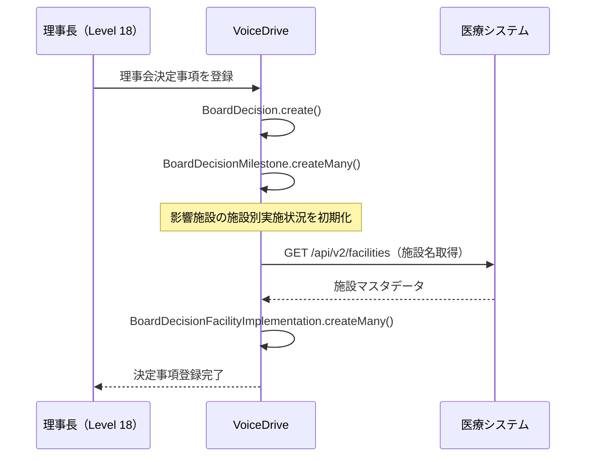
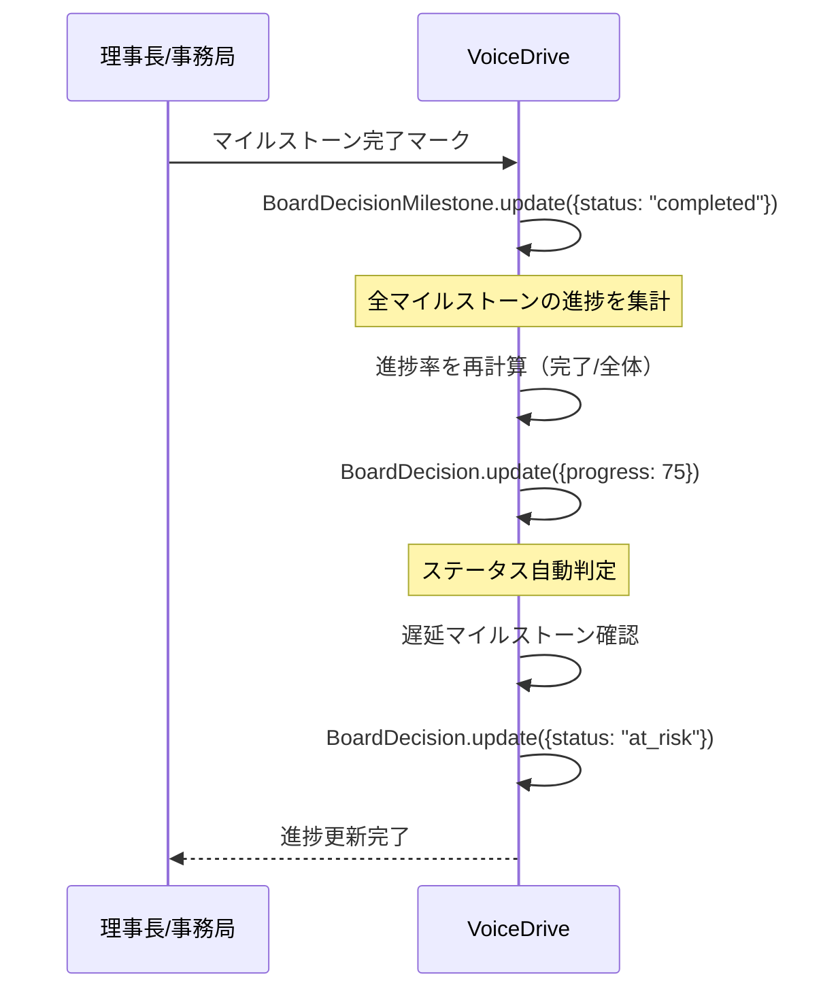
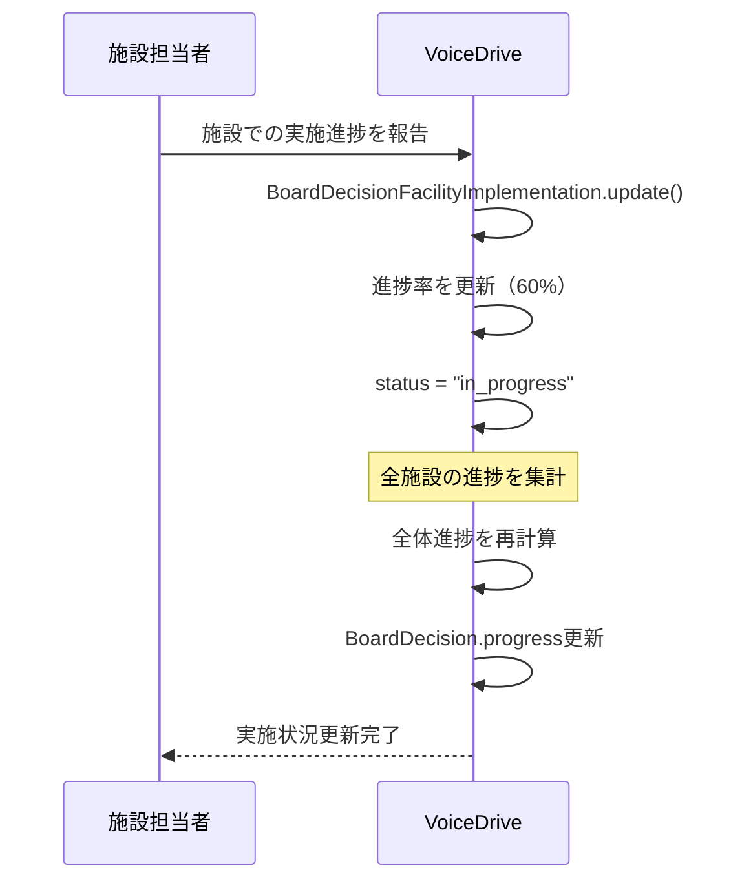

# BoardDecisionFollow（理事会決定事項フォロー）DB要件分析

**文書番号**: VD-DB-ANALYSIS-BOARD-DECISION-FOLLOW-20251011
**作成日**: 2025年10月11日
**対象ページ**: https://voicedrive-v100.vercel.app/board-decision-follow
**対象ユーザー**: レベル18（理事長・法人事務局長）
**ページ目的**: 理事会で決定された事項の実施進捗を追跡し、各施設での展開状況を管理

---

## 📋 エグゼクティブサマリー

### ページ概要
- **理事会決定事項の実施状況追跡**: 決定事項ごとに進捗・マイルストーン・施設別展開を管理
- **進捗ステータス**: completed, on_track, at_risk, delayed の4段階で管理
- **マイルストーン管理**: 各決定事項に複数のマイルストーンを設定し、期限・担当者・進捗を追跡
- **施設別実施状況**: VoiceDrive展開などの施設別進捗を管理（10施設）
- **アラート機能**: 遅延・要注意案件をハイライト表示

### データ責任分界
| データ | 責任システム | 理由 |
|--------|------------|------|
| 理事会決定事項 | VoiceDrive | 理事会運営はVoiceDrive管轄 |
| マイルストーン | VoiceDrive | プロジェクト管理機能 |
| 施設別実施状況 | VoiceDrive | VoiceDrive展開管理 |
| 施設マスタ | 医療システム | 施設情報は医療システムが管理 |
| 担当部門マスタ | 医療システム | 部門情報は医療システムが管理 |

### 不足項目サマリー
- **新規テーブル**: 1個（BoardDecision）
- **テーブル拡張**: 1個（BoardMeeting - 決定事項リレーション追加）
- **医療システムAPI**: 0個（既存APIで対応可能）

---

## 🎯 ページ機能詳細分析

### 1. サマリーカード表示（Lines 347-383）

**機能**: 決定事項のステータス別サマリーを表示

**表示項目**:
- ✅ 完了件数
- 🔵 順調件数
- 🟡 要注意件数
- 🔴 遅延件数

**必要なデータソース**:
```typescript
interface StatusSummary {
  completed: number;      // 完了件数
  on_track: number;       // 順調件数
  at_risk: number;        // 要注意件数
  delayed: number;        // 遅延件数
}
```

**データ取得方法**:
- VoiceDrive `BoardDecision` テーブルから status でグループ化してカウント

**不足項目**:
- ❌ `BoardDecision` テーブル（新規作成必要）

---

### 2. ステータスフィルター（Lines 385-400）

**機能**: ステータス別に決定事項をフィルタリング

**フィルター項目**:
- 全て（all）
- 完了（completed）
- 順調（on_track）
- 要注意（at_risk）
- 遅延（delayed）

**必要なデータソース**:
- `BoardDecision.status` フィールド

**不足項目**:
- なし（BoardDecision テーブル作成で解決）

---

### 3. 理事会決定事項一覧表示（Lines 402-502）

**機能**: 決定事項の詳細情報を一覧表示

**表示データ** (Lines 48-260):
```typescript
interface BoardDecision {
  id: string;
  meetingDate: string;              // 理事会開催日
  title: string;                    // 決定事項タイトル
  category: string;                 // カテゴリ（システム導入、人事制度等）
  description: string;              // 説明
  decision: string;                 // 理事会決定内容
  implementationDeadline: string;   // 実施期限
  responsibleDept: string;          // 担当部門
  affectedFacilities: string[];     // 影響施設（配列）
  status: 'completed' | 'on_track' | 'at_risk' | 'delayed';
  progress: number;                 // 進捗率（0-100）
  milestones: Milestone[];          // マイルストーン配列
  lastUpdate: string;               // 最終更新（相対時間）
}

interface Milestone {
  id: string;
  title: string;                    // マイルストーンタイトル
  deadline: string;                 // 期限
  status: 'completed' | 'in_progress' | 'pending' | 'delayed';
  assignee: string;                 // 担当者名
}
```

**データソース**:
- VoiceDrive: `BoardDecision` テーブル（新規）
- VoiceDrive: `BoardDecisionMilestone` テーブル（新規、Milestoneサブテーブルとして）
- 医療システム: 部門マスタ（API経由で取得）

**不足項目**:
- ❌ `BoardDecision` テーブル（新規）
- ❌ `BoardDecisionMilestone` テーブル（新規）

---

### 4. マイルストーン表示（Lines 459-487）

**機能**: 各決定事項のマイルストーンを進捗付きで表示

**マイルストーンデータ** (Lines 60-88の例):
```json
{
  "id": "m1",
  "title": "システム改修・機能拡張",
  "deadline": "2025年12月末",
  "status": "in_progress",
  "assignee": "IT部"
}
```

**ステータス色分け** (Lines 316-323):
- `completed`: 緑（bg-green-400）
- `in_progress`: 青（bg-blue-400）
- `delayed`: 赤（bg-red-400）
- `pending`: 灰色（bg-gray-400）

**必要なデータソース**:
- `BoardDecisionMilestone` テーブル
  - boardDecisionId（親決定事項ID）
  - title, deadline, status, assignee

**不足項目**:
- ❌ `BoardDecisionMilestone` テーブル（新規）

---

### 5. 影響施設表示（Lines 489-499）

**機能**: 決定事項が影響する施設リストを表示

**データ例** (Line 57, 101, 145):
```typescript
affectedFacilities: ['全10施設']
affectedFacilities: ['中央総合病院', '北部医療センター', '桜ヶ丘総合病院', '東部リハビリ病院']
```

**必要なデータソース**:
- `BoardDecision.affectedFacilities` (JSON配列)
- 医療システム: 施設マスタ（表示名取得用、API経由）

**不足項目**:
- なし（BoardDecision テーブルに affectedFacilities フィールドを含める）

---

### 6. 施設別実施状況表示（Lines 504-547）

**機能**: 特定の決定事項（VoiceDrive展開等）の施設別実施状況を表示

**施設実施状況データ** (Lines 264-275):
```typescript
interface FacilityImplementation {
  facilityName: string;             // 施設名
  status: 'completed' | 'in_progress' | 'not_started';
  progress: number;                 // 進捗率（0-100）
  note: string;                     // 備考
}
```

**データ例**:
```json
{
  "facilityName": "中央総合病院",
  "status": "completed",
  "progress": 100,
  "note": "試験運用施設。順調に稼働中。"
}
```

**必要なデータソース**:
- `BoardDecisionFacilityImplementation` テーブル（新規）
  - boardDecisionId
  - facilityId（医療システムの施設ID）
  - facilityName（キャッシュ）
  - status, progress, note

**不足項目**:
- ❌ `BoardDecisionFacilityImplementation` テーブル（新規）

---

## 🗄️ データベース設計

### 新規テーブル1: BoardDecision（理事会決定事項）

```prisma
model BoardDecision {
  id                      String    @id @default(cuid())

  // 理事会情報
  boardMeetingId          String    @map("board_meeting_id")
  meetingDate             DateTime  @map("meeting_date")

  // 決定事項情報
  title                   String
  category                String    // "システム導入", "人事制度", "IT・システム", "人材育成"
  description             String    @db.Text
  decision                String    @db.Text  // 理事会決定内容

  // 実施情報
  implementationDeadline  DateTime  @map("implementation_deadline")
  responsibleDept         String    @map("responsible_dept")  // 担当部門名（キャッシュ）
  responsibleDeptId       String?   @map("responsible_dept_id")  // 医療システム部門ID
  affectedFacilities      Json      @map("affected_facilities")  // 影響施設ID配列

  // 進捗管理
  status                  String    @default("on_track")  // "completed", "on_track", "at_risk", "delayed"
  progress                Int       @default(0)  // 0-100
  lastUpdate              DateTime  @default(now()) @map("last_update")

  // メタデータ
  createdAt               DateTime  @default(now()) @map("created_at")
  updatedAt               DateTime  @updatedAt @map("updated_at")

  // リレーション
  boardMeeting            BoardMeeting @relation("BoardDecisions", fields: [boardMeetingId], references: [id], onDelete: Cascade)
  milestones              BoardDecisionMilestone[]
  facilityImplementations BoardDecisionFacilityImplementation[]

  @@index([boardMeetingId])
  @@index([status])
  @@index([implementationDeadline])
  @@index([category])
  @@map("board_decisions")
}
```

**フィールド詳細**:
- `boardMeetingId`: 理事会マスタへの参照（既存 BoardMeeting テーブル）
- `meetingDate`: 決定が行われた理事会の日付（表示用キャッシュ）
- `category`: 決定事項のカテゴリ（システム導入、人事制度、IT・システム、人材育成）
- `decision`: 理事会での正式な決定内容（「予算800万円を承認。2026年4月本格運用開始。」等）
- `responsibleDept`: 担当部門名（医療システムから取得してキャッシュ）
- `affectedFacilities`: 影響を受ける施設のID配列（JSON）
- `status`: 実施ステータス（completed/on_track/at_risk/delayed）
- `progress`: 進捗率パーセンテージ（0-100）

---

### 新規テーブル2: BoardDecisionMilestone（マイルストーン）

```prisma
model BoardDecisionMilestone {
  id                String        @id @default(cuid())
  boardDecisionId   String        @map("board_decision_id")

  // マイルストーン情報
  title             String
  deadline          DateTime
  status            String        @default("pending")  // "completed", "in_progress", "pending", "delayed"
  assignee          String        // 担当者名（キャッシュ）
  assigneeId        String?       @map("assignee_id")  // User ID
  sortOrder         Int           @default(0) @map("sort_order")  // 表示順

  // メタデータ
  createdAt         DateTime      @default(now()) @map("created_at")
  updatedAt         DateTime      @updatedAt @map("updated_at")
  completedAt       DateTime?     @map("completed_at")

  // リレーション
  boardDecision     BoardDecision @relation(fields: [boardDecisionId], references: [id], onDelete: Cascade)

  @@index([boardDecisionId])
  @@index([status])
  @@index([deadline])
  @@index([sortOrder])
  @@map("board_decision_milestones")
}
```

**フィールド詳細**:
- `assignee`: 担当者名（「IT部」「人事部」等、部門名または担当者名）
- `assigneeId`: 将来的に User モデルへのリレーションを追加可能
- `sortOrder`: マイルストーンの表示順序

---

### 新規テーブル3: BoardDecisionFacilityImplementation（施設別実施状況）

```prisma
model BoardDecisionFacilityImplementation {
  id                String        @id @default(cuid())
  boardDecisionId   String        @map("board_decision_id")

  // 施設情報
  facilityId        String        @map("facility_id")  // 医療システム施設ID
  facilityName      String        @map("facility_name")  // 施設名（キャッシュ）

  // 実施状況
  status            String        @default("not_started")  // "completed", "in_progress", "not_started"
  progress          Int           @default(0)  // 0-100
  note              String?       // 備考

  // スケジュール
  startedAt         DateTime?     @map("started_at")
  completedAt       DateTime?     @map("completed_at")

  // メタデータ
  createdAt         DateTime      @default(now()) @map("created_at")
  updatedAt         DateTime      @updatedAt @map("updated_at")

  // リレーション
  boardDecision     BoardDecision @relation(fields: [boardDecisionId], references: [id], onDelete: Cascade)

  @@unique([boardDecisionId, facilityId])
  @@index([boardDecisionId])
  @@index([facilityId])
  @@index([status])
  @@map("board_decision_facility_implementations")
}
```

**フィールド詳細**:
- `facilityId`: 医療システムの施設ID
- `facilityName`: 施設名（表示用キャッシュ）
- `note`: 実施状況の備考（「試験運用施設。順調に稼働中。」等）

---

### 既存テーブル拡張: BoardMeeting

```prisma
model BoardMeeting {
  // ... 既存フィールド

  // 🆕 決定事項リレーション追加
  decisions           BoardDecision[]      @relation("BoardDecisions")
}
```

---

## 📊 データフロー図

### フロー1: 理事会決定事項作成



---

### フロー2: 進捗更新・マイルストーン完了



---

### フロー3: 施設別実施状況更新



---

## 🔄 医療システム連携

### 必要なAPI

| API | 用途 | 頻度 | 備考 |
|-----|------|------|------|
| GET /api/v2/facilities | 施設マスタ取得 | 初期表示時 | **既存API（実装済み）** |
| GET /api/v2/departments | 部門マスタ取得 | 決定事項作成時 | **既存API（実装済み）** |

**結論**: 新規API不要。既存の医療システムAPIで対応可能。

---

## 🎨 サービス層設計

### BoardDecisionFollowService

```typescript
class BoardDecisionFollowService {
  // 決定事項一覧取得（ステータスフィルタ付き）
  async getDecisions(filter?: {
    status?: 'completed' | 'on_track' | 'at_risk' | 'delayed' | 'all';
    category?: string;
  }): Promise<BoardDecision[]> {
    const where: any = {};
    if (filter?.status && filter.status !== 'all') {
      where.status = filter.status;
    }
    if (filter?.category) {
      where.category = filter.category;
    }

    return prisma.boardDecision.findMany({
      where,
      include: {
        milestones: {
          orderBy: { sortOrder: 'asc' }
        },
        facilityImplementations: true,
        boardMeeting: true
      },
      orderBy: { implementationDeadline: 'asc' }
    });
  }

  // ステータスサマリー取得
  async getStatusSummary(): Promise<StatusSummary> {
    const decisions = await prisma.boardDecision.findMany();

    return {
      completed: decisions.filter(d => d.status === 'completed').length,
      on_track: decisions.filter(d => d.status === 'on_track').length,
      at_risk: decisions.filter(d => d.status === 'at_risk').length,
      delayed: decisions.filter(d => d.status === 'delayed').length
    };
  }

  // マイルストーン更新
  async updateMilestone(milestoneId: string, data: {
    status?: string;
    completedAt?: Date;
  }): Promise<void> {
    await prisma.boardDecisionMilestone.update({
      where: { id: milestoneId },
      data
    });

    // 親の決定事項の進捗を再計算
    const milestone = await prisma.boardDecisionMilestone.findUnique({
      where: { id: milestoneId }
    });

    await this.recalculateDecisionProgress(milestone!.boardDecisionId);
  }

  // 決定事項進捗再計算
  async recalculateDecisionProgress(decisionId: string): Promise<void> {
    const milestones = await prisma.boardDecisionMilestone.findMany({
      where: { boardDecisionId: decisionId }
    });

    const completedCount = milestones.filter(m => m.status === 'completed').length;
    const progress = Math.round((completedCount / milestones.length) * 100);

    // 遅延マイルストーンチェック
    const now = new Date();
    const hasDelayed = milestones.some(m =>
      m.status !== 'completed' && m.deadline < now
    );

    const hasAtRisk = milestones.some(m => {
      const daysToDeadline = Math.floor((m.deadline.getTime() - now.getTime()) / (1000 * 60 * 60 * 24));
      return m.status !== 'completed' && daysToDeadline > 0 && daysToDeadline <= 7;
    });

    let status = 'on_track';
    if (progress === 100) {
      status = 'completed';
    } else if (hasDelayed) {
      status = 'delayed';
    } else if (hasAtRisk) {
      status = 'at_risk';
    }

    await prisma.boardDecision.update({
      where: { id: decisionId },
      data: { progress, status }
    });
  }

  // 施設別実施状況取得
  async getFacilityImplementations(decisionId: string): Promise<FacilityImplementation[]> {
    const implementations = await prisma.boardDecisionFacilityImplementation.findMany({
      where: { boardDecisionId: decisionId },
      orderBy: { facilityName: 'asc' }
    });

    return implementations.map(impl => ({
      facilityName: impl.facilityName,
      status: impl.status as 'completed' | 'in_progress' | 'not_started',
      progress: impl.progress,
      note: impl.note || ''
    }));
  }

  // 施設別実施状況更新
  async updateFacilityImplementation(
    decisionId: string,
    facilityId: string,
    data: {
      status?: string;
      progress?: number;
      note?: string;
    }
  ): Promise<void> {
    await prisma.boardDecisionFacilityImplementation.update({
      where: {
        boardDecisionId_facilityId: {
          boardDecisionId: decisionId,
          facilityId
        }
      },
      data
    });

    // 全体進捗を再計算
    await this.recalculateOverallProgress(decisionId);
  }

  // 全体進捗再計算（施設別進捗の平均）
  async recalculateOverallProgress(decisionId: string): Promise<void> {
    const implementations = await prisma.boardDecisionFacilityImplementation.findMany({
      where: { boardDecisionId: decisionId }
    });

    if (implementations.length === 0) return;

    const totalProgress = implementations.reduce((sum, impl) => sum + impl.progress, 0);
    const averageProgress = Math.round(totalProgress / implementations.length);

    await prisma.boardDecision.update({
      where: { id: decisionId },
      data: { progress: averageProgress }
    });
  }

  // 決定事項作成
  async createDecision(data: {
    boardMeetingId: string;
    title: string;
    category: string;
    description: string;
    decision: string;
    implementationDeadline: Date;
    responsibleDept: string;
    affectedFacilities: string[];  // 施設ID配列
    milestones: {
      title: string;
      deadline: Date;
      assignee: string;
    }[];
  }): Promise<BoardDecision> {
    // 施設名を医療システムから取得
    const facilitiesResponse = await fetch('https://medical-system/api/v2/facilities');
    const facilitiesData = await facilitiesResponse.json();
    const facilitiesMap = new Map(
      facilitiesData.facilities.map(f => [f.facilityId, f.name])
    );

    // 決定事項作成
    const decision = await prisma.boardDecision.create({
      data: {
        boardMeetingId: data.boardMeetingId,
        meetingDate: (await prisma.boardMeeting.findUnique({
          where: { id: data.boardMeetingId }
        }))!.meetingDate,
        title: data.title,
        category: data.category,
        description: data.description,
        decision: data.decision,
        implementationDeadline: data.implementationDeadline,
        responsibleDept: data.responsibleDept,
        affectedFacilities: data.affectedFacilities,
        status: 'on_track',
        progress: 0
      }
    });

    // マイルストーン作成
    await prisma.boardDecisionMilestone.createMany({
      data: data.milestones.map((m, index) => ({
        boardDecisionId: decision.id,
        title: m.title,
        deadline: m.deadline,
        assignee: m.assignee,
        status: 'pending',
        sortOrder: index
      }))
    });

    // 施設別実施状況を初期化
    await prisma.boardDecisionFacilityImplementation.createMany({
      data: data.affectedFacilities.map(facilityId => ({
        boardDecisionId: decision.id,
        facilityId,
        facilityName: facilitiesMap.get(facilityId) || facilityId,
        status: 'not_started',
        progress: 0
      }))
    });

    return decision;
  }
}
```

---

## 📋 API エンドポイント設計

### 1. GET /api/board-decisions
理事会決定事項一覧取得

**Query Parameters**:
- `status`: completed | on_track | at_risk | delayed | all
- `category`: システム導入 | 人事制度 | IT・システム | 人材育成

**Response**:
```json
{
  "decisions": [
    {
      "id": "dec-001",
      "boardMeetingId": "bm-2025-07",
      "meetingDate": "2025-07-15T00:00:00Z",
      "title": "VoiceDrive議題化プロセス全施設展開",
      "category": "システム導入",
      "description": "現在3施設で試験運用中の...",
      "decision": "予算800万円を承認。2026年4月本格運用開始。",
      "implementationDeadline": "2026-04-01T00:00:00Z",
      "responsibleDept": "人事部・IT部",
      "affectedFacilities": ["FAC001", "FAC002", "..."],
      "status": "on_track",
      "progress": 45,
      "lastUpdate": "2025-10-09T10:00:00Z",
      "milestones": [
        {
          "id": "m1",
          "title": "システム改修・機能拡張",
          "deadline": "2025-12-31T00:00:00Z",
          "status": "in_progress",
          "assignee": "IT部",
          "sortOrder": 0
        }
      ]
    }
  ],
  "summary": {
    "completed": 1,
    "on_track": 2,
    "at_risk": 1,
    "delayed": 1
  }
}
```

---

### 2. GET /api/board-decisions/:id/facility-implementations
施設別実施状況取得

**Response**:
```json
{
  "decisionId": "dec-001",
  "implementations": [
    {
      "facilityId": "FAC001",
      "facilityName": "中央総合病院",
      "status": "completed",
      "progress": 100,
      "note": "試験運用施設。順調に稼働中。",
      "startedAt": "2025-06-01T00:00:00Z",
      "completedAt": "2025-09-30T00:00:00Z"
    }
  ]
}
```

---

### 3. PUT /api/board-decisions/:id/milestones/:milestoneId
マイルストーン更新

**Request Body**:
```json
{
  "status": "completed",
  "completedAt": "2025-10-11T00:00:00Z"
}
```

**Response**:
```json
{
  "milestone": {
    "id": "m1",
    "status": "completed",
    "completedAt": "2025-10-11T00:00:00Z"
  },
  "decisionProgress": {
    "id": "dec-001",
    "progress": 75,
    "status": "on_track"
  }
}
```

---

### 4. PUT /api/board-decisions/:id/facility-implementations/:facilityId
施設別実施状況更新

**Request Body**:
```json
{
  "status": "in_progress",
  "progress": 60,
  "note": "説明会実施済。管理者トレーニング中。"
}
```

**Response**:
```json
{
  "implementation": {
    "facilityId": "FAC004",
    "status": "in_progress",
    "progress": 60
  },
  "overallProgress": {
    "id": "dec-001",
    "progress": 50
  }
}
```

---

### 5. POST /api/board-decisions
理事会決定事項作成

**Request Body**:
```json
{
  "boardMeetingId": "bm-2025-07",
  "title": "VoiceDrive議題化プロセス全施設展開",
  "category": "システム導入",
  "description": "現在3施設で試験運用中のVoiceDrive議題化プロセスを、2026年4月より全10施設に展開する。",
  "decision": "予算800万円を承認。2026年4月本格運用開始。",
  "implementationDeadline": "2026-04-01",
  "responsibleDept": "人事部・IT部",
  "affectedFacilities": ["FAC001", "FAC002", "FAC003", "..."],
  "milestones": [
    {
      "title": "システム改修・機能拡張",
      "deadline": "2025-12-31",
      "assignee": "IT部"
    }
  ]
}
```

---

## 🔄 データ同期・整合性

### 医療システムとの同期

1. **施設マスタ同期**
   - 医療システムから施設マスタを取得（GET /api/v2/facilities）
   - `BoardDecisionFacilityImplementation.facilityName` を更新（日次バッチ）

2. **部門マスタ同期**
   - 医療システムから部門マスタを取得（GET /api/v2/departments）
   - `BoardDecision.responsibleDept` を更新（日次バッチ）

---

## 📅 実装計画

### Phase 1: データベース構築（2日間）

**Day 1**:
- [x] DB要件分析書作成 ← 今ここ
- [ ] schema.prisma更新
  - BoardDecision テーブル追加
  - BoardDecisionMilestone テーブル追加
  - BoardDecisionFacilityImplementation テーブル追加
  - BoardMeeting リレーション追加
- [ ] マイグレーション実行

**Day 2**:
- [ ] 初期データ投入スクリプト作成
- [ ] テストデータ作成（5件の決定事項、各4マイルストーン）

---

### Phase 2: サービス層実装（3日間）

**Day 3-4**:
- [ ] BoardDecisionFollowService 実装
  - getDecisions()
  - getStatusSummary()
  - updateMilestone()
  - recalculateDecisionProgress()
  - getFacilityImplementations()
  - updateFacilityImplementation()
  - recalculateOverallProgress()
  - createDecision()

**Day 5**:
- [ ] ユニットテスト作成
- [ ] 統合テスト

---

### Phase 3: API実装（2日間）

**Day 6**:
- [ ] GET /api/board-decisions 実装
- [ ] GET /api/board-decisions/:id/facility-implementations 実装
- [ ] PUT /api/board-decisions/:id/milestones/:milestoneId 実装

**Day 7**:
- [ ] PUT /api/board-decisions/:id/facility-implementations/:facilityId 実装
- [ ] POST /api/board-decisions 実装
- [ ] APIテスト

---

### Phase 4: フロントエンド統合（2日間）

**Day 8**:
- [ ] BoardDecisionFollowPage.tsx 修正
  - ハードコードデータをAPI呼び出しに変更
  - useBoardDecisions() カスタムフック作成
  - useFacilityImplementations() カスタムフック作成

**Day 9**:
- [ ] マイルストーン更新UI実装
- [ ] 施設別実施状況更新UI実装
- [ ] E2Eテスト

---

### Phase 5: 統合テスト・デプロイ（1日間）

**Day 10**:
- [ ] 医療システムAPI連携テスト
- [ ] パフォーマンステスト
- [ ] 本番デプロイ
- [ ] ドキュメント整備

---

**合計**: 10日間（2週間）

---

## ✅ チェックリスト

### データベース
- [ ] BoardDecision テーブル作成
- [ ] BoardDecisionMilestone テーブル作成
- [ ] BoardDecisionFacilityImplementation テーブル作成
- [ ] BoardMeeting リレーション追加
- [ ] インデックス設定
- [ ] マイグレーション実行

### サービス層
- [ ] BoardDecisionFollowService 実装
- [ ] 進捗自動計算ロジック実装
- [ ] ステータス自動判定ロジック実装
- [ ] 施設マスタキャッシュ更新ロジック実装

### API
- [ ] GET /api/board-decisions 実装
- [ ] GET /api/board-decisions/:id/facility-implementations 実装
- [ ] PUT /api/board-decisions/:id/milestones/:milestoneId 実装
- [ ] PUT /api/board-decisions/:id/facility-implementations/:facilityId 実装
- [ ] POST /api/board-decisions 実装

### フロントエンド
- [ ] API統合
- [ ] マイルストーン更新UI
- [ ] 施設別実施状況更新UI
- [ ] エラーハンドリング

### テスト
- [ ] ユニットテスト
- [ ] 統合テスト
- [ ] E2Eテスト
- [ ] パフォーマンステスト

---

## 📝 補足事項

### 進捗計算ロジック

**マイルストーンベースの進捗**:
```typescript
progress = (完了マイルストーン数 / 全マイルストーン数) × 100
```

**施設別実施状況ベースの進捗**:
```typescript
progress = (全施設の進捗合計 / 施設数) = 平均進捗率
```

### ステータス自動判定ロジック

```typescript
if (progress === 100) {
  status = 'completed';
} else if (遅延マイルストーンあり) {
  status = 'delayed';
} else if (期限7日以内のマイルストーンあり) {
  status = 'at_risk';
} else {
  status = 'on_track';
}
```

### 相対時間表示

`lastUpdate` フィールドは相対時間で表示:
- "2日前"
- "1週間前"
- "1ヶ月前"

実装:
```typescript
function formatRelativeTime(date: Date): string {
  const now = new Date();
  const diffMs = now.getTime() - date.getTime();
  const diffDays = Math.floor(diffMs / (1000 * 60 * 60 * 24));

  if (diffDays === 0) return '今日';
  if (diffDays === 1) return '昨日';
  if (diffDays < 7) return `${diffDays}日前`;
  if (diffDays < 30) return `${Math.floor(diffDays / 7)}週間前`;
  return `${Math.floor(diffDays / 30)}ヶ月前`;
}
```

---

**文書終了**

最終更新: 2025年10月11日
次のステップ: 暫定マスターリスト作成
