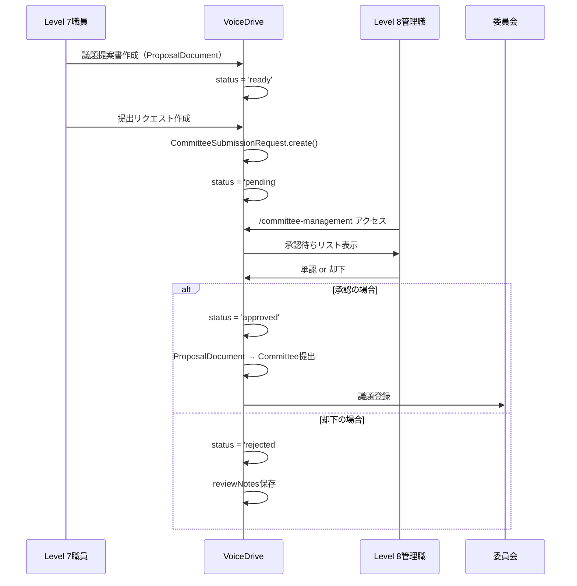
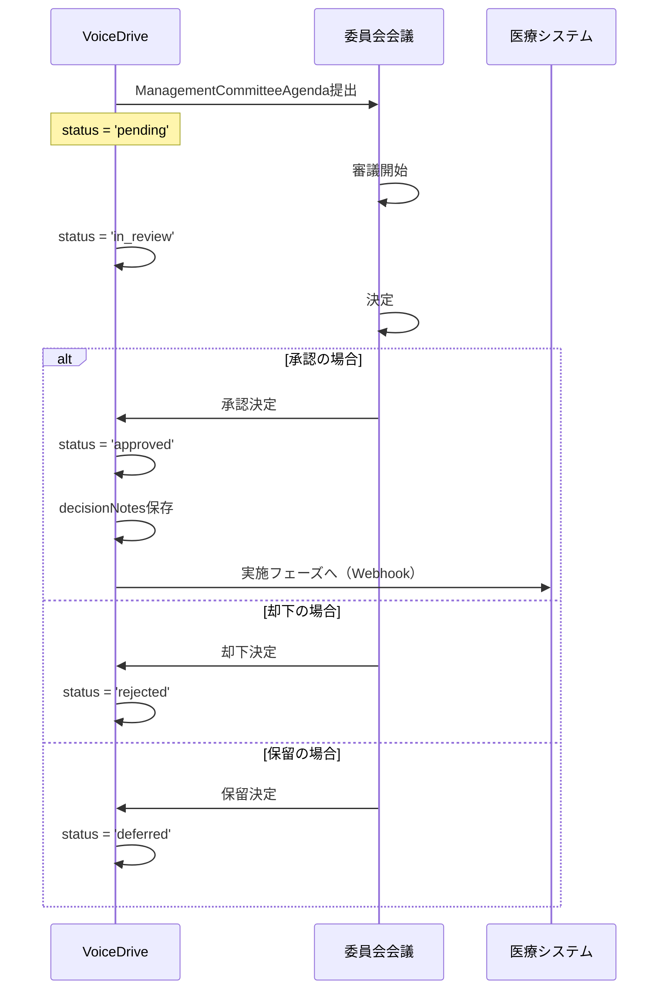
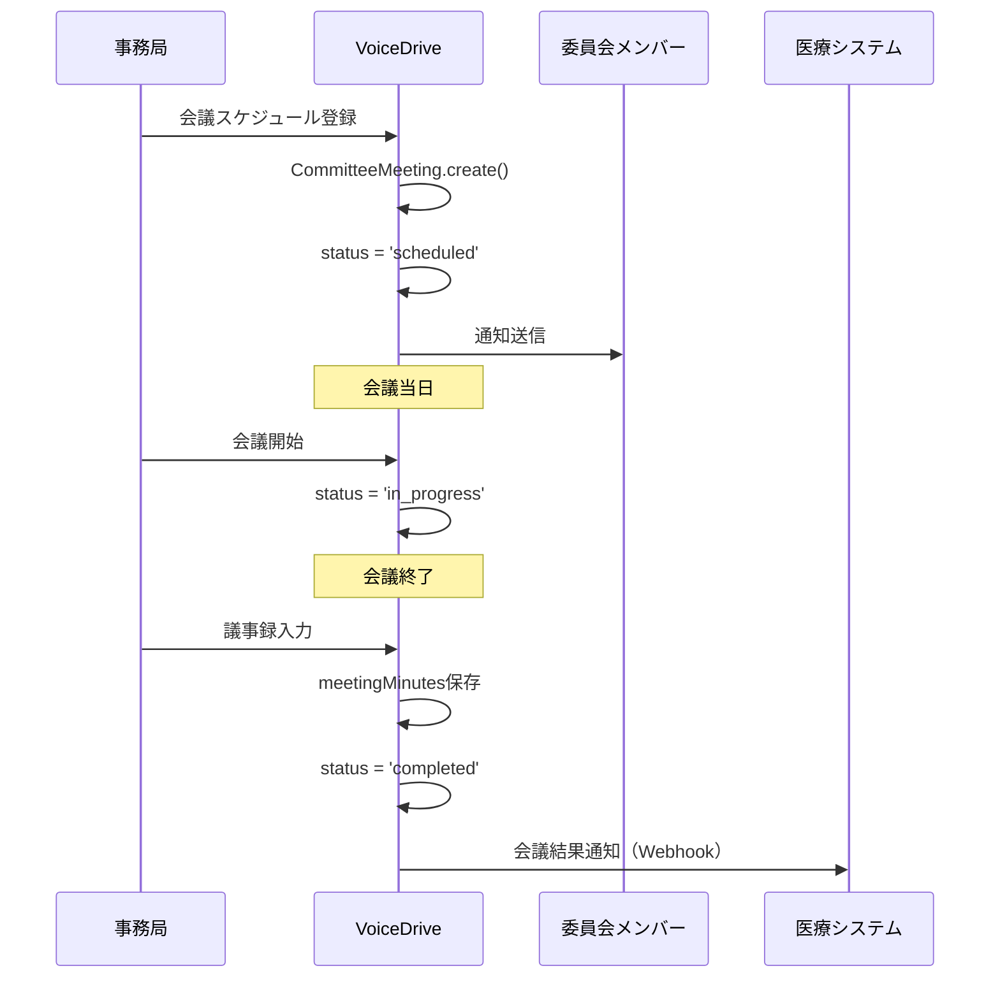

# committee-management ページ DB要件分析

**文書番号**: DB-REQ-CM-2025-1022-001
**作成日**: 2025年10月22日
**対象ページ**: `/committee-management` (CommitteeManagementPage)
**権限レベル**: Level 7以上
**分析者**: VoiceDrive開発チーム

---

## 📋 エグゼクティブサマリー

### ページ概要
**委員会管理ページ**は、医療施設における委員会の統合管理を行うページです。Level 7以上の管理職が、委員会への提出リクエストの承認、議題管理、会議スケジュール管理、委員会運営を一元管理できます。

### 主要機能（4つのタブ）
1. **提出承認タブ**: 委員会提出リクエストの承認・却下（Level 8以上）
2. **議題一覧タブ**: 委員会で審議される議題の一覧・フィルタリング・検索
3. **カレンダータブ**: 委員会の会議スケジュール管理
4. **委員会一覧タブ**: 登録されている委員会の情報表示

### データ管理責任の分担

| データカテゴリ | VoiceDrive管理 | 医療システム管理 | 連携方法 |
|--------------|--------------|----------------|---------|
| 委員会提出リクエスト | ✅ マスタ | ❌ | VoiceDrive管轄 |
| 議題提案書 | ✅ マスタ | ❌ | VoiceDrive管轄 |
| 委員会議題 | ✅ マスタ | キャッシュ | VoiceDrive→医療（実施記録は医療） |
| 委員会マスタ | ✅ マスタ | キャッシュ | VoiceDrive管轄 |
| 委員会メンバー | キャッシュ | ✅ マスタ | 医療→VoiceDrive（Webhook） |
| 会議スケジュール | ✅ マスタ | キャッシュ | VoiceDrive管轄（予約）|
| 会議実施記録 | キャッシュ | ✅ マスタ | 医療→VoiceDrive（Webhook） |
| 職員情報 | キャッシュ | ✅ マスタ | 医療→VoiceDrive（Webhook） |

---

## 🎯 ページ機能の詳細分析

### タブ1: 提出承認（Submission Requests）

#### 機能概要
- Level 7以上が作成した議題提案書の委員会提出リクエストを、Level 8以上が承認・却下
- 承認待ち/全てのフィルター機能
- 提出リクエストの詳細情報表示

#### 必要なデータ
```typescript
interface SubmissionRequest {
  id: string;
  documentId: string;              // 議題提案書ID
  document: ProposalDocument;      // 議題提案書の詳細
  requestedBy: User;               // リクエスト作成者
  requestedDate: Date;             // リクエスト作成日
  targetCommittee: string;         // 提出先委員会名
  status: 'pending' | 'approved' | 'rejected';
  reviewedBy?: User;               // 承認者
  reviewedDate?: Date;             // 承認日
  reviewNotes?: string;            // 承認コメント・却下理由
}
```

#### データソース
- **VoiceDrive DB**: `CommitteeSubmissionRequest` テーブル
- **医療システム**: User情報のみキャッシュ（名前、部署、権限レベル）

#### 画面表示項目
| 項目 | データソース | 備考 |
|-----|------------|------|
| 提案タイトル | ProposalDocument.title | |
| ステータス | CommitteeSubmissionRequest.status | |
| リクエスト作成者 | User.name (キャッシュ) | |
| 権限レベル | User.permissionLevel (キャッシュ) | |
| 提出先委員会 | CommitteeSubmissionRequest.targetCommittee | |
| リクエスト日 | CommitteeSubmissionRequest.requestedDate | |
| 承認者/却下者 | User.name (キャッシュ) | |
| 承認日/却下日 | CommitteeSubmissionRequest.reviewedDate | |
| コメント | CommitteeSubmissionRequest.reviewNotes | |

---

### タブ2: 議題一覧（Agenda）

#### 機能概要
- 委員会で審議される議題の一覧表示
- ステータス、優先度、議題タイプでのフィルタリング
- タイトル、提案者、説明での検索機能
- 決定事項の表示

#### 必要なデータ
```typescript
interface ManagementCommitteeAgenda {
  id: string;
  title: string;
  agendaType: 'committee_proposal' | 'facility_policy' | 'personnel' | 'budget' | 'equipment' | 'other';
  description: string;
  background: string;

  // 提案元情報
  proposedBy: string;
  proposedDate: Date;
  proposerDepartment: string;
  proposerId?: string;

  // 関連投稿
  relatedPostId?: string;
  escalationSource?: 'voting_system' | 'department_proposal' | 'direct_submission';

  // ステータス
  status: 'pending' | 'in_review' | 'approved' | 'rejected' | 'deferred';
  priority: 'urgent' | 'high' | 'normal' | 'low';

  // 審議情報
  scheduledDate?: Date;
  actualReviewDate?: Date;
  decidedDate?: Date;
  decidedBy?: string;
  decision?: 'approved' | 'rejected' | 'deferred';
  decisionNotes?: string;

  // 影響分析
  impactDepartments: string[];
  estimatedCost?: number;
  implementationPeriod?: string;
  expectedEffect: string;

  tags?: string[];
}
```

#### データソース
- **VoiceDrive DB**: `ManagementCommitteeAgenda` テーブル
- **医療システム**: 部署マスタ（impactDepartments）

#### フィルター機能
| フィルター | 値 | データソース |
|----------|---|------------|
| ステータス | pending, in_review, approved, rejected, deferred | ManagementCommitteeAgenda.status |
| 優先度 | urgent, high, normal, low | ManagementCommitteeAgenda.priority |
| 議題タイプ | committee_proposal, facility_policy, personnel, budget, equipment, other | ManagementCommitteeAgenda.agendaType |
| 検索クエリ | 自由テキスト | title, description, proposedBy |

#### 画面表示項目
| 項目 | データソース | 備考 |
|-----|------------|------|
| 議題タイトル | ManagementCommitteeAgenda.title | |
| ステータスバッジ | ManagementCommitteeAgenda.status | |
| 優先度バッジ | ManagementCommitteeAgenda.priority | |
| 議題タイプバッジ | ManagementCommitteeAgenda.agendaType | |
| 説明 | ManagementCommitteeAgenda.description | |
| 提案者 | ManagementCommitteeAgenda.proposedBy | |
| 提案部署 | ManagementCommitteeAgenda.proposerDepartment | |
| 提案日 | ManagementCommitteeAgenda.proposedDate | |
| 決定日 | ManagementCommitteeAgenda.decidedDate | |
| 影響部署 | ManagementCommitteeAgenda.impactDepartments | |
| 予算 | ManagementCommitteeAgenda.estimatedCost | |
| 決定事項 | ManagementCommitteeAgenda.decisionNotes | |

---

### タブ3: カレンダー（Calendar）

#### 機能概要
- 委員会の会議スケジュール表示
- 月別フィルタリング
- 会議ステータス管理（予定/進行中/完了/中止）
- 審議予定議題数の表示

#### 必要なデータ
```typescript
interface MeetingSchedule {
  id: string;
  committeeName: string;
  date: Date;
  venue: string;
  agendaCount: number;
  status: 'scheduled' | 'in_progress' | 'completed' | 'cancelled';
  chairperson?: string;
  participants?: Json;
  meetingMinutes?: string;
}
```

#### データソース
- **VoiceDrive DB**: `CommitteeMeeting` テーブル
- **医療システム**: 会議室マスタ（venue）

#### 画面表示項目
| 項目 | データソース | 備考 |
|-----|------------|------|
| 委員会名 | CommitteeMeeting.committeeName | |
| 開催日時 | CommitteeMeeting.date | |
| 会場 | CommitteeMeeting.venue | |
| ステータス | CommitteeMeeting.status | |
| 審議予定議題数 | CommitteeMeeting.agendaCount | |
| 議長 | CommitteeMeeting.chairperson | |

#### 統計情報
| 項目 | 計算方法 |
|-----|---------|
| 予定会議数 | COUNT(status = 'scheduled') |
| 審議予定議題 | SUM(agendaCount WHERE status = 'scheduled') |
| 完了会議 | COUNT(status = 'completed') |

---

### タブ4: 委員会一覧（Committees）

#### 機能概要
- 登録されている委員会の一覧表示
- 各委員会のメンバー数、総開催回数、審議中議題数
- 委員長情報、次回開催日
- 委員会活動サマリー

#### 必要なデータ
```typescript
interface CommitteeData {
  id: string;
  name: string;
  description: string;
  memberCount: number;
  chairperson: string;
  chairpersonId?: string;
  nextMeetingDate?: Date;
  totalMeetings: number;
  activeAgendas: number;
}

interface CommitteeMember {
  id: string;
  userId: string;
  name: string;
  department: string;
  position: string;
  role: 'chairman' | 'vice_chairman' | 'secretary' | 'member' | 'observer';
  termStart: Date;
  termEnd?: Date;
  isActive: boolean;
  attendanceRate: number;
}
```

#### データソース
- **VoiceDrive DB**: `CommitteeInfo`, `CommitteeMember` テーブル
- **医療システム**: User情報（メンバーの部署、役職）

#### 画面表示項目
| 項目 | データソース | 備考 |
|-----|------------|------|
| 委員会名 | CommitteeInfo.name | |
| 説明 | CommitteeInfo.description | |
| メンバー数 | CommitteeInfo.memberCount | |
| 総開催回数 | CommitteeInfo.totalMeetings | |
| 委員長 | CommitteeInfo.chairperson | |
| 次回開催日 | CommitteeInfo.nextMeetingDate | |
| 審議中議題数 | CommitteeInfo.activeAgendas | |

#### 統計サマリー
| 項目 | 計算方法 |
|-----|---------|
| 総委員会数 | COUNT(CommitteeInfo) |
| 総メンバー数 | SUM(CommitteeInfo.memberCount) |
| 審議中議題 | SUM(CommitteeInfo.activeAgendas) |
| 予定会議 | COUNT(nextMeetingDate > NOW()) |

---

## 📊 既存テーブル分析

### ✅ 既存テーブル（schema.prismaに存在）

#### 1. CommitteeSubmissionRequest
```prisma
model CommitteeSubmissionRequest {
  id              String    @id @default(cuid())
  documentId      String
  requestedById   String
  requestedDate   DateTime  @default(now())
  targetCommittee String
  status          String    @default("pending")
  reviewedById    String?
  reviewedDate    DateTime?
  reviewNotes     String?

  requestedBy User           @relation("SubmissionRequester", ...)
  reviewedBy  User?          @relation("SubmissionApprover", ...)
  document    ProposalDocument @relation(...)
}
```
**状態**: ✅ 実装済み
**用途**: 提出承認タブのメインデータ

#### 2. ProposalDocument
```prisma
model ProposalDocument {
  id          String @id @default(cuid())
  postId      String
  title       String
  agendaLevel String
  createdById String
  status      String @default("draft")

  summary         String
  background      String
  objectives      String
  expectedEffects String
  // ... その他のフィールド
}
```
**状態**: ✅ 実装済み
**用途**: 議題提案書の詳細情報

#### 3. ManagementCommitteeAgenda
```prisma
model ManagementCommitteeAgenda {
  id                  String   @id @default(cuid())
  title               String
  agendaType          String
  description         String
  background          String
  proposedBy          String
  proposedDate        DateTime
  proposerDepartment  String
  status              String
  priority            String
  // ... 審議情報、影響分析フィールド
}
```
**状態**: ✅ 実装済み
**用途**: 議題一覧タブのメインデータ

#### 4. CommitteeInfo
```prisma
model CommitteeInfo {
  id              String    @id @default(cuid())
  name            String    @unique
  description     String
  memberCount     Int       @default(0)
  totalMeetings   Int       @default(0)
  activeAgendas   Int       @default(0)
  chairperson     String?
  chairpersonId   String?
  nextMeetingDate DateTime?

  members  CommitteeMember[]
  meetings CommitteeMeeting[]
}
```
**状態**: ✅ 実装済み
**用途**: 委員会一覧タブのメインデータ

#### 5. CommitteeMember
```prisma
model CommitteeMember {
  id             String   @id @default(cuid())
  committeeId    String
  userId         String
  name           String
  department     String
  position       String
  role           String
  termStart      DateTime
  termEnd        DateTime?
  isActive       Boolean  @default(true)
  attendanceRate Float    @default(0.0)

  user      User          @relation(...)
  committee CommitteeInfo @relation(...)
}
```
**状態**: ✅ 実装済み
**用途**: 委員会メンバー情報

#### 6. CommitteeMeeting
```prisma
model CommitteeMeeting {
  id             String   @id @default(cuid())
  committeeId    String
  committeeName  String
  date           DateTime
  venue          String
  agendaCount    Int      @default(0)
  status         String   @default("scheduled")
  chairperson    String?
  participants   Json?
  meetingMinutes String?

  committee CommitteeInfo @relation(...)
}
```
**状態**: ✅ 実装済み
**用途**: カレンダータブのメインデータ

---

## ❌ 不足しているデータ・機能

### 1. 部門フィルタリング機能（将来要件）

**課題**:
現在は Level 8 以上であれば全てのリクエストを承認・却下できる仕様。
将来的に「自分の管轄（部署）のリクエストだけ」に制限したい場合、以下が必要：

**必要な追加フィールド**:
```prisma
model CommitteeSubmissionRequest {
  // 既存フィールド...

  // 🆕 追加候補
  departmentId String? // リクエスト元の部署ID
  department   Department? @relation(...)
}
```

**実装タイミング**: DB構築後でOK（運用設計時に決定）

---

### 2. 議題の実施状況追跡

**課題**:
承認された議題の実施状況（implementation progress）が一部不足。

**既存フィールド**:
```prisma
model ManagementCommitteeAgenda {
  // 既にある
  implementationStatus   String?
  implementationProgress Int?
  implementationStartDate DateTime?
  implementationEndDate   DateTime?
}
```
**状態**: ✅ 既に実装済み

---

### 3. 会議議事録の詳細管理

**課題**:
会議議事録（meetingMinutes）が `String?` で簡易的。
より詳細な議事録管理が必要な場合は別テーブルが必要。

**将来の拡張案**:
```prisma
model MeetingMinutes {
  id               String   @id @default(cuid())
  meetingId        String   @unique
  summary          String
  decisions        Json     // 決定事項リスト
  actionItems      Json     // アクションアイテム
  attendees        Json     // 出席者リスト
  attachments      Json?    // 添付資料
  recordedBy       String
  recordedAt       DateTime
  approvedBy       String?
  approvedAt       DateTime?

  meeting CommitteeMeeting @relation(...)
}
```

**実装タイミング**: 運用開始後、詳細管理が必要になった時点で追加

---

## 🔄 データフロー図

### フロー1: 提出リクエスト作成→承認



---

### フロー2: 議題の審議→決定



---

### フロー3: 会議スケジュール管理



---

## 🔌 API要件

### VoiceDrive提供API（医療システム向け）

#### API 1: 委員会議題取得
```typescript
GET /api/committees/{committeeId}/agendas

Response: {
  agendas: ManagementCommitteeAgenda[],
  pagination: {...},
  stats: {
    pending: number,
    in_review: number,
    approved: number,
    rejected: number
  }
}
```

#### API 2: 提出リクエスト統計
```typescript
GET /api/committee-submissions/stats

Response: {
  pending: number,
  approved: number,
  rejected: number,
  byCommittee: {
    committeeName: string,
    pending: number,
    approved: number
  }[]
}
```

---

### 医療システム提供API（VoiceDrive向け）

#### API 1: 部署マスタ取得
```typescript
GET /api/departments

Response: {
  departments: [
    {
      id: string,
      name: string,
      facilityId: string,
      parentDepartmentId?: string
    }
  ]
}
```

**用途**: 議題の影響部署フィルター選択肢

#### API 2: 会議室マスタ取得
```typescript
GET /api/meeting-rooms

Response: {
  rooms: [
    {
      id: string,
      name: string,
      capacity: number,
      facilityId: string,
      equipment: string[]
    }
  ]
}
```

**用途**: 会議スケジュール登録時の会場選択

---

## 🔒 セキュリティ・権限管理

### アクセス制御

| 機能 | 必要権限レベル | 備考 |
|-----|--------------|------|
| ページアクセス | Level 7以上 | 主任・係長以上 |
| 提出リクエスト作成 | Level 7以上 | 議題提案書作成後 |
| 提出リクエスト承認・却下 | Level 8以上 | 課長・看護師長以上 |
| 議題一覧閲覧 | Level 7以上 | 全て閲覧可能 |
| 会議スケジュール閲覧 | Level 7以上 | 全て閲覧可能 |
| 会議スケジュール作成 | Level 10以上 | 運営委員会メンバー |
| 委員会情報編集 | Level 10以上 | 運営委員会メンバー |

### データ可視性ルール

```typescript
// 提出リクエストの可視性
function canViewSubmissionRequest(user: User, request: SubmissionRequest): boolean {
  // Level 7以上は全て閲覧可能
  if (user.permissionLevel >= 7) return true;

  // 将来的な部署フィルター（オプション）
  // if (user.department === request.department) return true;

  return false;
}

// 承認・却下権限
function canApproveSubmission(user: User): boolean {
  return user.permissionLevel >= 8;
}
```

---

## 📝 データ整合性チェック

### 定期チェック項目

1. **委員会メンバー数の整合性**
```sql
-- CommitteeInfo.memberCount が実際のメンバー数と一致するか
SELECT
  ci.id,
  ci.name,
  ci.memberCount as recorded_count,
  COUNT(cm.id) as actual_count
FROM CommitteeInfo ci
LEFT JOIN CommitteeMember cm ON cm.committeeId = ci.id AND cm.isActive = true
GROUP BY ci.id
HAVING recorded_count != actual_count;
```

2. **議題数の整合性**
```sql
-- CommitteeInfo.activeAgendas が実際の審議中議題数と一致するか
SELECT
  ci.id,
  ci.name,
  ci.activeAgendas as recorded_count,
  COUNT(mca.id) as actual_count
FROM CommitteeInfo ci
LEFT JOIN ManagementCommitteeAgenda mca
  ON mca.targetCommittee = ci.name
  AND mca.status IN ('pending', 'in_review')
GROUP BY ci.id
HAVING recorded_count != actual_count;
```

3. **会議の議題数**
```sql
-- CommitteeMeeting.agendaCount が実際の議題数と一致するか
SELECT
  cm.id,
  cm.committeeName,
  cm.agendaCount as recorded_count,
  COUNT(DISTINCT mca.id) as actual_count
FROM CommitteeMeeting cm
LEFT JOIN ManagementCommitteeAgenda mca
  ON mca.scheduledDate = cm.date
  AND mca.targetCommittee = cm.committeeName
GROUP BY cm.id
HAVING recorded_count != actual_count;
```

---

## ✅ 実装チェックリスト

### データベース
- [x] CommitteeSubmissionRequest テーブル作成済み
- [x] ProposalDocument テーブル作成済み
- [x] ManagementCommitteeAgenda テーブル作成済み
- [x] CommitteeInfo テーブル作成済み
- [x] CommitteeMember テーブル作成済み
- [x] CommitteeMeeting テーブル作成済み
- [ ] 部門フィルタリング用フィールド追加（将来要件）
- [ ] MeetingMinutes テーブル作成（将来要件）

### API実装
- [ ] 委員会議題取得API（VoiceDrive→医療）
- [ ] 提出リクエスト統計API（VoiceDrive→医療）
- [ ] 部署マスタ取得API（医療→VoiceDrive）
- [ ] 会議室マスタ取得API（医療→VoiceDrive）
- [ ] 会議結果通知Webhook（VoiceDrive→医療）

### 画面実装
- [x] 提出承認タブ
- [x] 議題一覧タブ
- [x] カレンダータブ
- [x] 委員会一覧タブ
- [x] フィルター機能
- [x] 検索機能
- [x] 統計サマリー表示

### テスト
- [ ] 提出リクエスト作成→承認フローテスト
- [ ] 提出リクエスト作成→却下フローテスト
- [ ] 議題フィルタリングテスト
- [ ] 会議スケジュール管理テスト
- [ ] 権限レベル別アクセス制御テスト
- [ ] データ整合性チェックバッチテスト

---

## 🎯 優先度付けと実装順序

### Phase 1: 基本機能（現在完了）
- [x] 全テーブル作成
- [x] 基本CRUD機能
- [x] 画面表示機能

### Phase 2: DB統合準備（次のステップ）
- [ ] 医療システムからの部署マスタ取得API実装
- [ ] User情報キャッシュ機能実装
- [ ] データ整合性チェックバッチ実装

### Phase 3: 高度な機能（将来）
- [ ] 部門別フィルタリング機能
- [ ] 詳細議事録管理機能
- [ ] 実施状況トラッキング機能
- [ ] 委員会活動分析ダッシュボード

---

## 📞 連絡先・レビュー

### 作成者
- VoiceDrive開発チーム
- Slack: #voicedrive-dev

### レビュー依頼先
- 医療システム開発チーム
- Slack: #medical-system-integration

### 質問・フィードバック
- MCP共有フォルダ: `mcp-shared/docs/`
- 定例会議: 毎週月曜 10:00-11:00

---

**文書終了**

最終更新: 2025年10月22日
バージョン: 1.0
ステータス: レビュー待ち
