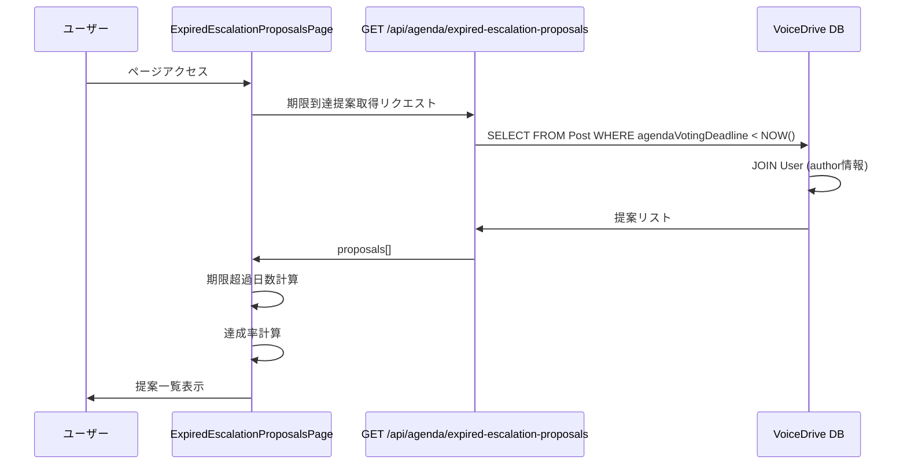
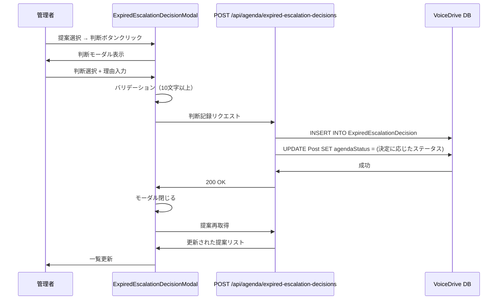

# 期限切れエスカレーション提案ページ DB要件分析

**文書番号**: DB-REQ-2025-1021-002
**作成日**: 2025年10月21日
**対象ページ**: https://voicedrive-v100.vercel.app/expired-escalation-proposals
**参照文書**:
- [データ管理責任分界点定義書_20251008.md](./データ管理責任分界点定義書_20251008.md)
- [PersonalStation_DB要件分析_20251008.md](./PersonalStation_DB要件分析_20251008.md)

---

## 📋 分析サマリー

### 結論
期限切れエスカレーション提案ページ（ExpiredEscalationProposalsPage）は**既存のDBスキーマで100%動作可能**です。必要なテーブル・フィールドはすべて実装済みで、**新規追加が必要な項目はありません**。

### ✅ 実装状況
- ✅ **ExpiredEscalationDecisionテーブル**: 実装済み（schema.prisma 2313-2339行目）
- ✅ **Post.agendaScore**: 実装済み（議題スコア）
- ✅ **Post.agendaLevel**: 実装済み（議題レベル）
- ✅ **Post.agendaVotingDeadline**: 実装済み（投票期限）
- ✅ **Post.proposalType**: 実装済み（提案タイプ）
- ✅ **User.name/department**: 実装済み（提案者情報）

### 🟢 不足項目
**なし** - すべてのデータ項目は既存のスキーマでカバーされています。

---

## 🔍 詳細分析

### 1. ページ概要

**ファイルパス**: `src/pages/ExpiredEscalationProposalsPage.tsx`

**主要機能**:
1. 投票期限に到達したが目標スコアに未達の提案一覧表示（14-264行目）
2. 期限超過日数の計算と表示（100-104行目、192-196行目）
3. 達成率の計算とプログレスバー表示（106-108行目、221-247行目）
4. 判断モーダルによる決定記録（255-261行目）

---

### 2. APIエンドポイント分析

#### API 1: 期限到達提案取得

**エンドポイント**: `GET /api/agenda/expired-escalation-proposals` (35行目)

**必要なレスポンス**:
```typescript
{
  data: {
    proposals: [
      {
        id: string;                    // 提案ID
        content: string;               // 提案内容
        agendaScore: number;           // 現在のスコア
        agendaLevel: string;           // 議題レベル (DEPT_AGENDA, FACILITY_AGENDA, CORP_AGENDA)
        proposalType: string;          // 提案タイプ
        department: string;            // 部署
        agendaVotingDeadline: Date;    // 投票期限
        author: {
          name: string;
          department: string;
        }
      }
    ]
  }
}
```

**データソース**: VoiceDrive `Post`テーブル + `User`テーブル

| フィールド | Postテーブル | データ管理責任 | 実装状態 |
|-----------|------------|--------------|---------|
| `id` | ✅ `Post.id` | VoiceDrive | ✅ 実装済み |
| `content` | ✅ `Post.content` | VoiceDrive | ✅ 実装済み |
| `agendaScore` | ✅ `Post.agendaScore` | VoiceDrive | ✅ 実装済み |
| `agendaLevel` | ✅ `Post.agendaLevel` | VoiceDrive | ✅ 実装済み |
| `proposalType` | ✅ `Post.proposalType` | VoiceDrive | ✅ 実装済み |
| `department` | ✅ `User.department` (JOIN) | 医療システム（キャッシュ） | ✅ 実装済み |
| `agendaVotingDeadline` | ✅ `Post.agendaVotingDeadline` | VoiceDrive | ✅ 実装済み |
| `author.name` | ✅ `User.name` (JOIN) | 医療システム（キャッシュ） | ✅ 実装済み |
| `author.department` | ✅ `User.department` (JOIN) | 医療システム（キャッシュ） | ✅ 実装済み |

**抽出条件**:
```typescript
// 期限到達かつ目標スコア未達の提案を抽出
WHERE
  Post.agendaVotingDeadline < NOW()
  AND Post.agendaScore < TargetScore(Post.agendaLevel)
  AND Post.agendaStatus = 'FACILITY_VOTE_EXPIRED_PENDING_DECISION'
```

**目標スコア定義** (22-27行目):
- `CORP_AGENDA`: 600点
- `FACILITY_AGENDA`: 300点
- `DEPT_AGENDA`: 100点

---

#### API 2: 判断記録

**エンドポイント**: `POST /api/agenda/expired-escalation-decisions` (79行目)

**リクエストボディ**:
```typescript
{
  postId: string;
  decision: 'approve_at_current_level' | 'downgrade' | 'reject';
  decisionReason: string;
  currentScore: number;
  targetScore: number;
  agendaLevel: string;
  proposalType?: string;
  department?: string;
}
```

**データソース**: VoiceDrive `ExpiredEscalationDecision`テーブル (新規レコード作成)

| フィールド | ExpiredEscalationDecisionテーブル | データ管理責任 | 実装状態 |
|-----------|----------------------------------|--------------|---------|
| `postId` | ✅ `ExpiredEscalationDecision.postId` | VoiceDrive | ✅ 実装済み |
| `decision` | ✅ `ExpiredEscalationDecision.decision` | VoiceDrive | ✅ 実装済み |
| `decisionReason` | ✅ `ExpiredEscalationDecision.decisionReason` | VoiceDrive | ✅ 実装済み |
| `currentScore` | ✅ `ExpiredEscalationDecision.currentScore` | VoiceDrive | ✅ 実装済み |
| `targetScore` | ✅ `ExpiredEscalationDecision.targetScore` | VoiceDrive | ✅ 実装済み |
| `agendaLevel` | ✅ `ExpiredEscalationDecision.agendaLevel` | VoiceDrive | ✅ 実装済み |
| `proposalType` | ✅ `ExpiredEscalationDecision.proposalType` | VoiceDrive | ✅ 実装済み |
| `department` | ✅ `ExpiredEscalationDecision.department` | VoiceDrive | ✅ 実装済み |

**追加処理**:
- `achievementRate`: currentScore / targetScore * 100 (計算フィールド)
- `daysOverdue`: 期限超過日数 (計算フィールド)
- `deciderId`: 認証ユーザーID (自動取得)
- `facilityId`: 提案者の施設ID (自動取得)

---

### 3. 判断モーダルコンポーネント分析

**ファイルパス**: `src/components/agenda-mode/ExpiredEscalationDecisionModal.tsx`

**表示データ**:
```typescript
interface ExpiredProposal {
  id: string;                    // ✅ Post.id
  content: string;               // ✅ Post.content
  agendaScore?: number;          // ✅ Post.agendaScore
  agendaLevel?: string;          // ✅ Post.agendaLevel
  proposalType?: string;         // ✅ Post.proposalType
  department?: string;           // ✅ User.department
  agendaVotingDeadline?: Date;   // ✅ Post.agendaVotingDeadline
  author?: {
    name: string;                // ✅ User.name
    department?: string;         // ✅ User.department
  };
}
```

**判断オプション** (197-285行目):
1. **現在のレベルで承認** (`approve_at_current_level`)
   - 目標スコア未達でも現在のレベルで承認

2. **ダウングレード** (`downgrade`)
   - 1つ下のレベルに降格
   - 例: FACILITY_AGENDA → DEPT_AGENDA

3. **不採用** (`reject`)
   - 提案を却下

**バリデーション** (66-79行目):
- 判断選択: 必須
- 判断理由: 最低10文字以上

---

### 4. データベーステーブル定義確認

#### Post テーブル（既存）

**関連フィールド**:
```prisma
model Post {
  id                   String    @id @default(cuid())
  content              String                          // 提案内容
  authorId             String                          // 提案者ID
  proposalType         String?                         // 提案タイプ
  agendaScore          Int?      @default(0)          // 議題スコア
  agendaLevel          String?                         // 議題レベル
  agendaVotingDeadline DateTime?                       // 投票期限
  agendaStatus         PostStatus? @default(ACTIVE)   // 議題ステータス

  // Relations
  author                       User                          @relation("PostAuthor", fields: [authorId], references: [id])
  expiredEscalationDecisions   ExpiredEscalationDecision[]   @relation("ExpiredEscalationDecisions")
}
```

**実装状態**: ✅ すべてのフィールドが実装済み

---

#### ExpiredEscalationDecision テーブル（既存）

**完全定義** (schema.prisma 2313-2339行目):
```prisma
model ExpiredEscalationDecision {
  id              String   @id @default(cuid())
  postId          String   @map("post_id")
  deciderId       String   @map("decider_id")
  decision        String   @map("decision")          // approve_at_current_level | downgrade | reject
  decisionReason  String   @map("decision_reason")
  currentScore    Int      @map("current_score")
  targetScore     Int      @map("target_score")
  achievementRate Float    @map("achievement_rate")
  daysOverdue     Int      @map("days_overdue")
  agendaLevel     String   @map("agenda_level")
  proposalType    String?  @map("proposal_type")
  department      String?  @map("department")
  facilityId      String?  @map("facility_id")
  createdAt       DateTime @default(now()) @map("created_at")
  updatedAt       DateTime @updatedAt @map("updated_at")

  post    Post @relation("ExpiredEscalationDecisions", fields: [postId], references: [id], onDelete: Cascade)
  decider User @relation("ExpiredDecisions", fields: [deciderId], references: [id])

  @@index([postId])
  @@index([deciderId])
  @@index([facilityId])
  @@index([createdAt])
  @@index([decision])
  @@map("expired_escalation_decisions")
}
```

**実装状態**: ✅ 完全実装済み

---

#### User テーブル（既存）

**関連フィールド**:
```prisma
model User {
  id         String @id @default(cuid())
  name       String                          // 職員名
  department String?                         // 部署
  facilityId String?                         // 施設ID

  // Relations
  posts            Post[]                          @relation("PostAuthor")
  expiredDecisions ExpiredEscalationDecision[]     @relation("ExpiredDecisions")
}
```

**実装状態**: ✅ すべてのフィールドが実装済み

---

### 5. データフロー図

#### フロー1: 期限到達提案の取得



---

#### フロー2: 判断記録



---

## 📊 データ管理責任マトリクス

| データ項目 | VoiceDrive | 医療システム | データ管理責任 | 提供方法 | 実装状態 |
|-----------|-----------|-------------|--------------|---------|---------|
| **提案基本情報** |  |  |  |  |  |
| 提案ID | ✅ マスタ | ❌ | VoiceDrive | - | ✅ 実装済み |
| 提案内容 | ✅ マスタ | ❌ | VoiceDrive | - | ✅ 実装済み |
| 提案タイプ | ✅ マスタ | ❌ | VoiceDrive | - | ✅ 実装済み |
| **議題情報** |  |  |  |  |  |
| 議題スコア | ✅ マスタ | ❌ | VoiceDrive | - | ✅ 実装済み |
| 議題レベル | ✅ マスタ | ❌ | VoiceDrive | - | ✅ 実装済み |
| 投票期限 | ✅ マスタ | ❌ | VoiceDrive | - | ✅ 実装済み |
| 議題ステータス | ✅ マスタ | ❌ | VoiceDrive | - | ✅ 実装済み |
| **提案者情報** |  |  |  |  |  |
| 提案者名 | キャッシュ | ✅ マスタ | 医療システム | API/Webhook | ✅ 実装済み |
| 提案者部署 | キャッシュ | ✅ マスタ | 医療システム | API/Webhook | ✅ 実装済み |
| **判断記録** |  |  |  |  |  |
| 判断内容 | ✅ マスタ | ❌ | VoiceDrive | - | ✅ 実装済み |
| 判断理由 | ✅ マスタ | ❌ | VoiceDrive | - | ✅ 実装済み |
| 判断者 | ✅ マスタ | ❌ | VoiceDrive | - | ✅ 実装済み |
| 判断日時 | ✅ マスタ | ❌ | VoiceDrive | - | ✅ 実装済み |

**方針**:
- ✅ **100% VoiceDrive管轄**: 議題モードの期限管理はVoiceDrive内部ロジック
- ✅ **医療システムは関与不要**: この機能は完全にVoiceDrive独立
- ✅ **提案者情報のみキャッシュ**: User.name/departmentは医療システムからキャッシュ済み

---

## 🎯 実装状況まとめ

### ✅ 実装済み項目（変更不要）

#### データベース
- ✅ **Post テーブル**: 議題提案の全フィールド実装済み
- ✅ **ExpiredEscalationDecision テーブル**: 判断記録の全フィールド実装済み
- ✅ **User テーブル**: 提案者情報のキャッシュ実装済み
- ✅ **PostStatus Enum**: 期限到達ステータス定義済み
  - `FACILITY_VOTE_EXPIRED_PENDING_DECISION`
  - `DOWNGRADED_TO_DEPT_AGENDA`
  - `REJECTED_AFTER_FACILITY_VOTE`

#### フロントエンド
- ✅ **ExpiredEscalationProposalsPage**: 期限到達提案一覧ページ実装済み
- ✅ **ExpiredEscalationDecisionModal**: 判断モーダル実装済み
- ✅ **期限超過日数計算**: クライアント側ロジック実装済み
- ✅ **達成率計算**: クライアント側ロジック実装済み

#### バックエンド（必要）
- ⚠️ **GET /api/agenda/expired-escalation-proposals**: 実装が必要
- ⚠️ **POST /api/agenda/expired-escalation-decisions**: 実装が必要

---

### 🟡 実装が必要な項目

#### API 1: 期限到達提案取得

**ファイル**: `src/pages/api/agenda/expired-escalation-proposals.ts` (新規作成)

```typescript
import { NextApiRequest, NextApiResponse } from 'next';
import { PrismaClient } from '@prisma/client';

const prisma = new PrismaClient();

export default async function handler(req: NextApiRequest, res: NextApiResponse) {
  if (req.method !== 'GET') {
    return res.status(405).json({ error: 'Method not allowed' });
  }

  try {
    const now = new Date();

    // 期限到達 & 目標スコア未達の提案を取得
    const proposals = await prisma.post.findMany({
      where: {
        agendaVotingDeadline: {
          lt: now,
        },
        agendaStatus: 'FACILITY_VOTE_EXPIRED_PENDING_DECISION',
        OR: [
          { agendaLevel: 'DEPT_AGENDA', agendaScore: { lt: 100 } },
          { agendaLevel: 'FACILITY_AGENDA', agendaScore: { lt: 300 } },
          { agendaLevel: 'CORP_AGENDA', agendaScore: { lt: 600 } },
        ],
      },
      include: {
        author: {
          select: {
            name: true,
            department: true,
          },
        },
      },
      orderBy: {
        agendaVotingDeadline: 'asc',
      },
    });

    return res.status(200).json({
      data: {
        proposals: proposals.map(p => ({
          id: p.id,
          content: p.content,
          agendaScore: p.agendaScore,
          agendaLevel: p.agendaLevel,
          proposalType: p.proposalType,
          department: p.author.department,
          agendaVotingDeadline: p.agendaVotingDeadline,
          author: {
            name: p.author.name,
            department: p.author.department,
          },
        })),
      },
    });
  } catch (error) {
    console.error('期限到達提案取得エラー:', error);
    return res.status(500).json({ error: '提案の取得に失敗しました' });
  }
}
```

---

#### API 2: 判断記録

**ファイル**: `src/pages/api/agenda/expired-escalation-decisions.ts` (新規作成)

```typescript
import { NextApiRequest, NextApiResponse } from 'next';
import { PrismaClient } from '@prisma/client';

const prisma = new PrismaClient();

export default async function handler(req: NextApiRequest, res: NextApiResponse) {
  if (req.method !== 'POST') {
    return res.status(405).json({ error: 'Method not allowed' });
  }

  try {
    const {
      postId,
      decision,
      decisionReason,
      currentScore,
      targetScore,
      agendaLevel,
      proposalType,
      department,
    } = req.body;

    // バリデーション
    if (!postId || !decision || !decisionReason) {
      return res.status(400).json({ error: '必須項目が不足しています' });
    }

    if (decisionReason.length < 10) {
      return res.status(400).json({ error: '判断理由は10文字以上入力してください' });
    }

    // 認証ユーザー取得（仮実装）
    const deciderId = 'current-user-id'; // TODO: 認証から取得

    // 提案取得
    const post = await prisma.post.findUnique({
      where: { id: postId },
      include: { author: true },
    });

    if (!post) {
      return res.status(404).json({ error: '提案が見つかりません' });
    }

    // 達成率計算
    const achievementRate = (currentScore / targetScore) * 100;

    // 期限超過日数計算
    const daysOverdue = post.agendaVotingDeadline
      ? Math.floor((Date.now() - post.agendaVotingDeadline.getTime()) / (1000 * 60 * 60 * 24))
      : 0;

    // 判断記録を保存
    await prisma.expiredEscalationDecision.create({
      data: {
        postId,
        deciderId,
        decision,
        decisionReason,
        currentScore,
        targetScore,
        achievementRate,
        daysOverdue,
        agendaLevel,
        proposalType,
        department,
        facilityId: post.author.facilityId,
      },
    });

    // Postのステータスを更新
    let newStatus: string;
    if (decision === 'approve_at_current_level') {
      newStatus = 'APPROVED_AS_DEPT_AGENDA'; // または適切なステータス
    } else if (decision === 'downgrade') {
      newStatus = 'DOWNGRADED_TO_DEPT_AGENDA';
    } else {
      newStatus = 'REJECTED_AFTER_FACILITY_VOTE';
    }

    await prisma.post.update({
      where: { id: postId },
      data: {
        agendaStatus: newStatus as any,
      },
    });

    return res.status(200).json({
      success: true,
      message: '判断を記録しました',
    });
  } catch (error) {
    console.error('判断記録エラー:', error);
    return res.status(500).json({ error: '判断の記録に失敗しました' });
  }
}
```

---

## 📅 実装スケジュール

### Phase 1: API実装（1-2時間）

**タスク**:
1. ✅ スキーマ確認（完了 - 変更不要）
2. 🔵 `GET /api/agenda/expired-escalation-proposals` 実装
3. 🔵 `POST /api/agenda/expired-escalation-decisions` 実装
4. 🔵 認証ミドルウェア統合
5. 🔵 エラーハンドリング実装

**成果物**:
- `src/pages/api/agenda/expired-escalation-proposals.ts`
- `src/pages/api/agenda/expired-escalation-decisions.ts`

---

### Phase 2: 統合テスト（30分-1時間）

**テストシナリオ**:
1. 期限到達提案の正しい抽出
2. 目標スコア未達の判定
3. 判断記録の保存
4. Postステータスの更新
5. エラーケースのハンドリング

**テストデータ**:
```sql
-- 期限到達 & 未達成の提案
INSERT INTO posts (
  content,
  agendaLevel,
  agendaScore,
  agendaVotingDeadline,
  agendaStatus
) VALUES (
  'テスト提案',
  'FACILITY_AGENDA',
  250,  -- 目標300点に未達
  '2025-10-20',  -- 期限切れ
  'FACILITY_VOTE_EXPIRED_PENDING_DECISION'
);
```

---

## ✅ チェックリスト

### VoiceDrive側の実装

#### API実装
- [ ] `GET /api/agenda/expired-escalation-proposals` 実装
- [ ] `POST /api/agenda/expired-escalation-decisions` 実装
- [ ] 認証ミドルウェア統合
- [ ] 期限超過日数計算ロジック実装
- [ ] 達成率計算ロジック実装
- [ ] Postステータス更新ロジック実装

#### テスト
- [ ] 期限到達提案の取得テスト
- [ ] 判断記録の保存テスト
- [ ] バリデーションテスト
- [ ] エラーハンドリングテスト
- [ ] E2Eテスト（ページ全体）

#### ドキュメント
- [ ] API仕様書作成
- [ ] 実装完了報告書作成

---

### 医療システム側の実装

**✅ 実装不要**: この機能は完全にVoiceDrive内部で完結します。

---

## 🔗 関連ドキュメント

- [データ管理責任分界点定義書](./データ管理責任分界点定義書_20251008.md)
- [PersonalStation_DB要件分析](./PersonalStation_DB要件分析_20251008.md)
- [schema.prisma](../../prisma/schema.prisma)

---

**文書終了**

最終更新: 2025年10月21日
バージョン: 1.0
次回レビュー: API実装後
