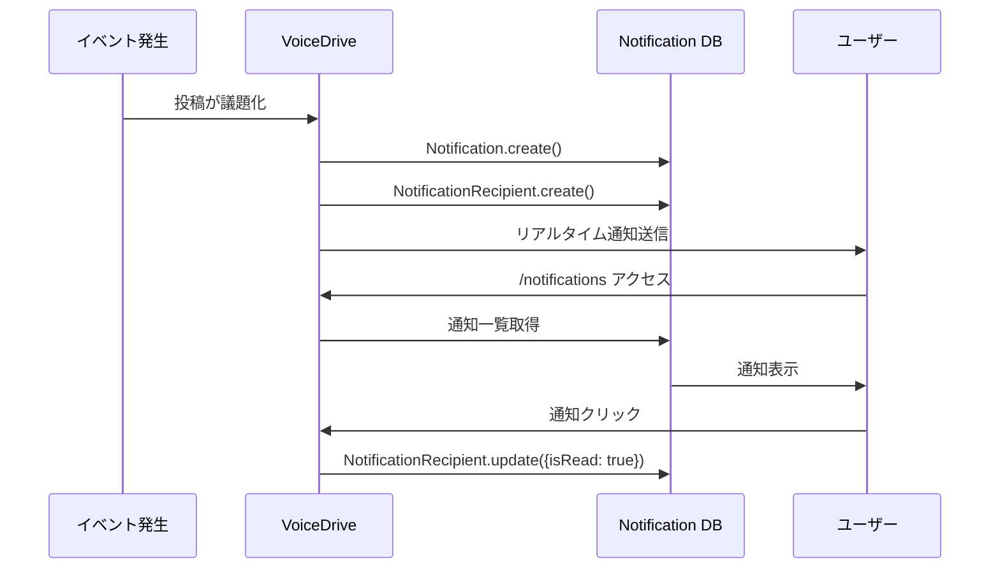
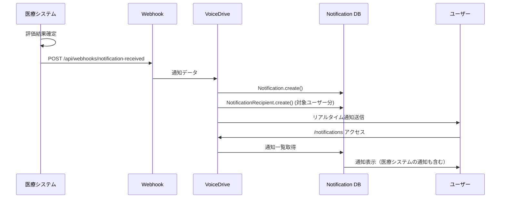

# notifications ページ DB要件分析

**文書番号**: DB-REQ-NOTIF-2025-1022-001
**作成日**: 2025年10月22日
**対象ページ**: `/notifications` (NotificationsPage)
**権限レベル**: 全ユーザー（認証済み）
**分析者**: VoiceDrive開発チーム

---

## 📋 エグゼクティブサマリー

### ページ概要
**通知センターページ**は、全ユーザーが利用できる通知の一元管理ページです。VoiceDrive内の活動通知と、医療システムから送信される人事・評価・面談通知を統合表示します。

### 主要機能
1. **カテゴリ別フィルタリング**: 9つの通知カテゴリ（人事、面談、評価、提案、プロジェクト、シフト、研修、アンケート、システム）
2. **未読管理**: 通知の既読/未読状態管理、一括既読機能
3. **アクション付き通知**: ボタンクリックで関連ページへ遷移
4. **リアルタイム表示**: AppBadgeServiceと連携した未読バッジ表示

### データ管理責任の分担

| データカテゴリ | VoiceDrive管理 | 医療システム管理 | 連携方法 |
|--------------|--------------|----------------|---------|
| VoiceDrive活動通知 | ✅ マスタ | ❌ | VoiceDrive管轄 |
| 人事お知らせ通知 | キャッシュ | ✅ マスタ | 医療→VoiceDrive（Webhook） |
| 面談通知 | キャッシュ | ✅ マスタ | 医療→VoiceDrive（Webhook） |
| 評価通知 | キャッシュ | ✅ マスタ | 医療→VoiceDrive（Webhook） |
| シフト・勤務通知 | ❌ | ✅ マスタ | 医療→VoiceDrive（Webhook） |
| 研修・教育通知 | ❌ | ✅ マスタ | 医療→VoiceDrive（Webhook） |
| システム通知 | ✅ マスタ | ❌ | VoiceDrive管轄 |

---

## 🎯 ページ機能の詳細分析

### 機能1: カテゴリ別通知表示

#### カテゴリ一覧
```typescript
const categoryConfigs = [
  { key: 'all', label: 'すべて', icon: '📋' },
  { key: 'interview', label: '面談・予約', icon: '📅' },
  { key: 'hr_announcement', label: '人事お知らせ', icon: '📢' },
  { key: 'proposal', label: '議題・提案', icon: '💡' },
  { key: 'system', label: 'システム', icon: '⚙️' },
  { key: 'training', label: '研修・教育', icon: '🎓' },
  { key: 'shift', label: 'シフト・勤務', icon: '⏰' },
  { key: 'project', label: 'プロジェクト', icon: '🚀' },
  { key: 'evaluation', label: '評価', icon: '📊' },
];
```

#### 必要なデータ
```typescript
interface Notification {
  id: string;
  category: NotificationCategory;
  subcategory?: string;
  title: string;
  content: string;
  timestamp: Date;
  isRead: boolean;
  icon: string;
  priority?: 'critical' | 'high' | 'medium' | 'low';
  actionUrl?: string;
}
```

### 機能2: 未読管理

#### 既読処理
- 通知クリック時に自動的に既読化
- 「全て既読にする」ボタンで一括既読化
- AppBadgeServiceと連携してバッジ数を更新

#### 必要なデータ
```typescript
interface NotificationRecipient {
  id: string;
  notificationId: string;
  userId: string;
  isRead: boolean;
  readAt?: Date;
  actionTaken?: string;
  actionTakenAt?: Date;
}
```

### 機能3: アクション付き通知

#### アクション例
- 期限到達提案通知 → `/expired-escalation-proposals`へ遷移
- 面談予約確定 → 面談詳細ページへ遷移
- 評価フィードバック → 評価ページへ遷移

#### 必要なデータ
```typescript
interface NotificationAction {
  id: string;
  notificationId: string;
  actionType: string;  // approve, reject, view, etc.
  actionLabel: string;
  actionUrl?: string;
  actionData?: Json;
}
```

---

## 📊 既存テーブル分析

### ✅ 既存テーブル（schema.prismaに存在）

#### 1. Notification
```prisma
model Notification {
  id             String    @id @default(cuid())
  category       String
  subcategory    String?
  priority       String
  title          String
  content        String
  target         String    // all, role:ROLE_NAME, user:USER_ID
  senderId       String
  status         String    @default("pending")
  sentAt         DateTime?
  recipientCount Int       @default(0)
  readCount      Int       @default(0)
  clickCount     Int       @default(0)
  createdAt      DateTime  @default(now())
  updatedAt      DateTime  @updatedAt

  // Phase 2: Approvals page fields
  notificationType  String?
  urgency           String    @default("normal")
  actionRequired    Boolean   @default(false)
  dueDate           DateTime?
  metadata          Json?
  relatedEntityType String?
  relatedEntityId   String?

  sender     User                    @relation(...)
  actions    NotificationAction[]
  recipients NotificationRecipient[]
}
```
**状態**: ✅ 実装済み
**用途**: 通知のマスタ管理

#### 2. NotificationRecipient
```prisma
model NotificationRecipient {
  id             String    @id @default(cuid())
  notificationId String
  userId         String
  isRead         Boolean   @default(false)
  readAt         DateTime?
  actionTaken    String?
  actionTakenAt  DateTime?
  createdAt      DateTime  @default(now())
  updatedAt      DateTime  @updatedAt

  notification Notification @relation(...)
  user         User         @relation(...)

  @@unique([notificationId, userId])
  @@index([userId, isRead])
  @@index([userId, actionTaken])
}
```
**状態**: ✅ 実装済み
**用途**: ユーザーごとの通知受信状態管理

#### 3. NotificationAction
```prisma
model NotificationAction {
  id                   String    @id @default(cuid())
  notificationId       String
  actionType           String
  actionLabel          String
  actionUrl            String?
  actionData           Json?
  isPrimary            Boolean   @default(false)
  isDestructive        Boolean   @default(false)
  requiresConfirmation Boolean   @default(false)
  confirmationMessage  String?
  executedAt           DateTime?
  executedBy           String?
  result               Json?
  createdAt            DateTime  @default(now())
  updatedAt            DateTime  @updatedAt

  notification Notification @relation(...)
  executor     User?        @relation(...)

  @@index([notificationId])
}
```
**状態**: ✅ 実装済み
**用途**: 通知に紐付くアクションボタン管理

#### 4. NotificationSettings
```prisma
model NotificationSettings {
  id                       String   @id @default(cuid())
  userId                   String   @unique
  enableEmailNotifications Boolean  @default(true)
  enablePushNotifications  Boolean  @default(true)
  enableSmsNotifications   Boolean  @default(false)
  reminderDaysBefore       Int      @default(3)
  enableDeadlineReminder   Boolean  @default(true)
  autoMarkAsRead           Boolean  @default(false)
  quietHoursStart          String?
  quietHoursEnd            String?
  enableQuietHours         Boolean  @default(false)
  createdAt                DateTime @default(now())
  updatedAt                DateTime @updatedAt

  user User @relation(...)
}
```
**状態**: ✅ 実装済み
**用途**: ユーザーごとの通知設定

#### 5. EvaluationNotification
```prisma
model EvaluationNotification {
  id                   String    @id @default(cuid())
  employeeId           String
  evaluationPeriod     String
  evaluationScore      Int
  evaluationGrade      String
  disclosureDate       DateTime
  appealDeadline       DateTime
  notificationStatus   String    @default("pending")
  notificationSentAt   DateTime?
  notificationReadAt   DateTime?
  // ... その他のフィールド
}
```
**状態**: ✅ 実装済み
**用途**: 評価通知専用テーブル（医療システムから同期）

---

## ❌ 不足しているデータ・機能

### 1. NotificationsPage の実装状況

**現状**: ページはモックデータで動作
```typescript
// NotificationsPage.tsx:39
const [notifications, setNotifications] = useState<Notification[]>([
  {
    id: '1',
    category: 'interview',
    title: '面談予約確定のお知らせ',
    // ... モックデータ
  }
]);
```

**必要な対応**:
- DBから通知を取得するAPIエンドポイント実装
- NotificationRecipientテーブルとの連携
- リアルタイム通知受信機能

### 2. 通知生成機能

**課題**: 各種イベント発生時に通知を自動生成する仕組みが必要

**必要な実装**:
```typescript
// 例: 投稿が議題化された時の通知生成
async function notifyProposalAdopted(postId: string, userId: string) {
  await prisma.notification.create({
    data: {
      category: 'proposal',
      subcategory: 'adopted',
      title: '議題が正式採用されました',
      content: 'あなたの提案が経営会議で採択されました',
      senderId: 'system',
      target: `user:${userId}`,
      priority: 'high',
      recipients: {
        create: {
          userId: userId,
          isRead: false
        }
      }
    }
  });
}
```

### 3. 医療システムからの通知Webhook

**課題**: 医療システムから送信される通知を受信・保存する仕組み

**必要なAPIエンドポイント**:
```typescript
POST /api/webhooks/notification-received
Content-Type: application/json
X-Medical-System-Signature: sha256=...

Body: {
  eventType: "notification.hr_announcement",
  timestamp: "2025-10-22T10:00:00Z",
  data: {
    category: "hr_announcement",
    title: "賞与支給日のお知らせ",
    content: "冬季賞与は12月10日に支給予定です",
    priority: "medium",
    targetUsers: ["OH-NS-2024-001", "OH-NS-2024-002"],
    actionUrl: "/hr-announcements"
  }
}
```

---

## 🔄 データフロー図

### フロー1: VoiceDrive内部の通知生成



### フロー2: 医療システムからの通知受信



---

## 🔌 API要件

### VoiceDrive提供API

#### 1. 通知一覧取得
```http
GET /api/notifications
Authorization: Bearer {jwt_token}

Query Parameters:
  - category: string (optional)
  - isRead: boolean (optional)
  - limit: number (default: 50)
  - offset: number (default: 0)

Response 200:
{
  "notifications": [
    {
      "id": "notif-001",
      "category": "interview",
      "title": "面談予約確定のお知らせ",
      "content": "1月25日（土）14:00からの面談予約が確定しました",
      "timestamp": "2025-01-20T10:00:00Z",
      "isRead": false,
      "priority": "high",
      "actionUrl": "/interview-station"
    }
  ],
  "unreadCount": 4,
  "pagination": {
    "total": 47,
    "limit": 50,
    "offset": 0
  }
}
```

#### 2. 通知既読化
```http
PUT /api/notifications/{notificationId}/read
Authorization: Bearer {jwt_token}

Response 200:
{
  "success": true,
  "notification": {
    "id": "notif-001",
    "isRead": true,
    "readAt": "2025-01-20T14:30:00Z"
  }
}
```

#### 3. 一括既読化
```http
PUT /api/notifications/mark-all-read
Authorization: Bearer {jwt_token}

Response 200:
{
  "success": true,
  "markedCount": 12
}
```

---

### 医療システム提供Webhook（VoiceDrive向け）

#### 1. 通知送信Webhook
```http
POST {voicedrive_url}/api/webhooks/notification-received
Content-Type: application/json
X-Medical-System-Signature: sha256=...

Body:
{
  "eventType": "notification.send",
  "timestamp": "2025-10-22T10:00:00Z",
  "data": {
    "category": "hr_announcement",
    "subcategory": "important",
    "title": "賞与支給日のお知らせ",
    "content": "冬季賞与は12月10日に支給予定です",
    "priority": "medium",
    "targetUsers": ["OH-NS-2024-001"],
    "actionUrl": "/hr-announcements",
    "expiresAt": "2025-12-15T00:00:00Z"
  }
}
```

---

## ✅ 実装チェックリスト

### データベース
- [x] Notification テーブル作成済み
- [x] NotificationRecipient テーブル作成済み
- [x] NotificationAction テーブル作成済み
- [x] NotificationSettings テーブル作成済み
- [x] EvaluationNotification テーブル作成済み

### API実装
- [ ] 通知一覧取得API
- [ ] 通知既読化API
- [ ] 一括既読化API
- [ ] 通知作成API（内部用）
- [ ] 医療システムからの通知受信Webhook

### 画面実装
- [x] カテゴリ別フィルタリング
- [x] 未読バッジ表示
- [x] 通知クリック時のアクション
- [x] 全て既読ボタン
- [ ] DBからの通知取得（現在はモック）
- [ ] リアルタイム通知受信

### 通知生成機能
- [ ] 投稿議題化時の通知
- [ ] プロジェクト招集時の通知
- [ ] 評価期間開始時の通知
- [ ] 面談予約確定時の通知
- [ ] システムメンテナンス通知

### テスト
- [ ] 通知一覧取得テスト
- [ ] カテゴリ別フィルタリングテスト
- [ ] 未読/既読切り替えテスト
- [ ] 医療システムからの通知受信テスト
- [ ] リアルタイム通知配信テスト

---

## 🎯 優先度付けと実装順序

### Phase 1: 基本API実装（優先度: 高）
- [ ] 通知一覧取得API
- [ ] 通知既読化API
- [ ] NotificationsPage のDB連携

### Phase 2: 通知生成機能（優先度: 中）
- [ ] VoiceDrive内部イベントからの通知生成
- [ ] 医療システムからの通知受信Webhook

### Phase 3: リアルタイム通知（優先度: 中）
- [ ] WebSocket連携
- [ ] ブラウザプッシュ通知

### Phase 4: 高度な機能（優先度: 低）
- [ ] 通知設定カスタマイズ
- [ ] カテゴリ別通知ON/OFF設定
- [ ] サイレント時間設定

---

## 📞 連絡先・レビュー

### 作成者
- VoiceDrive開発チーム
- Slack: #voicedrive-dev

### レビュー依頼先
- 医療システム開発チーム
- Slack: #medical-system-integration

### 質問・フィードバック
- MCP共有フォルダ: `mcp-shared/docs/`
- 定例会議: 毎週月曜 10:00-11:00

---

**文書終了**

最終更新: 2025年10月22日
バージョン: 1.0
ステータス: レビュー待ち
