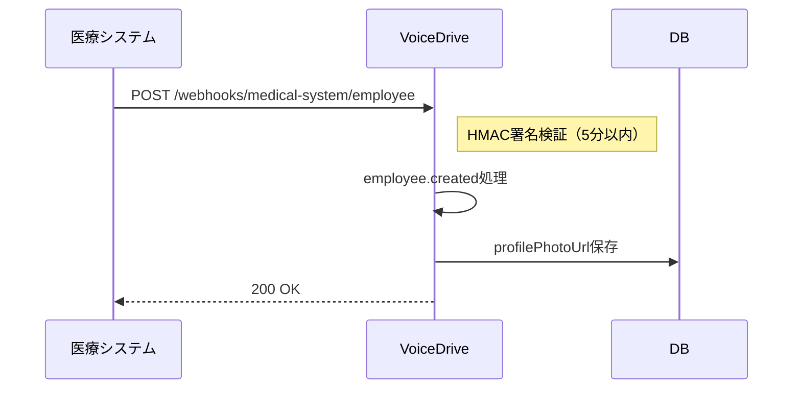
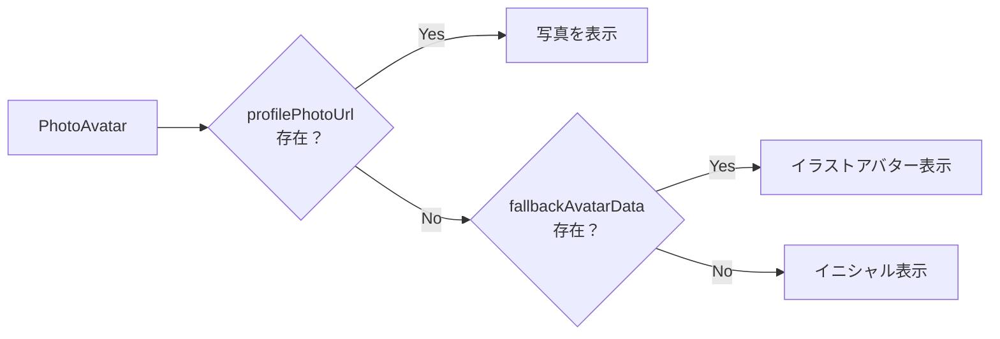

# Phase 2 顔写真統合 - VoiceDrive側実装完了サマリー

**文書番号**: VD-SUMMARY-PHASE2-PHOTO-2025-1021-001
**作成日**: 2025年10月21日
**作成者**: VoiceDriveチーム
**ステータス**: ✅ **実装完了（統合テスト待ち）**

---

## 📋 エグゼクティブサマリー

Phase 2職員顔写真統合に関する**VoiceDrive側の実装がすべて完了**しました。

医療システムチームからのWebhook受信、顔写真URL保存、フロントエンド表示まで、すべての機能が実装済みです。

**現在のステータス**:
- ✅ バックエンド実装: 完了
- ✅ フロントエンド実装: 完了
- ✅ 型定義: 完了
- ⏳ 環境変数設定: 医療チームからの秘密鍵待ち（10/21 17:00予定）
- ⏳ 統合テスト: 11/11-11/15予定
- ⏳ 本番リリース: 11/22予定

---

## ✅ 実装完了項目

### 1. データベース拡張（Prisma）

**ファイル**: `prisma/schema.prisma`

```prisma
model User {
  // ... 既存フィールド ...

  // Phase 2: 顔写真統合
  profilePhotoUrl               String?      // CloudFront/Lightsail URL
  profilePhotoUpdatedAt         DateTime?    // 写真更新日時
}
```

**マイグレーション**: DB構築時に自動実行

---

### 2. TypeScript型定義

**ファイル**: `src/types/index.ts`

```typescript
export interface User {
  // ... 既存フィールド ...

  // Phase 2: 顔写真統合
  profilePhotoUrl?: string | null;
  profilePhotoUpdatedAt?: Date | null;
}
```

---

### 3. Webhook署名検証ミドルウェア

**ファイル**: `src/middleware/webhookAuth.ts`

**機能**:
- HMAC-SHA256署名検証
- タイムスタンプ検証（5分以内のリクエストのみ受付）
- 環境変数での秘密鍵管理（`MEDICAL_WEBHOOK_SECRET`）

**セキュリティ対策**:
- ✅ リプレイ攻撃防止（タイムスタンプ検証）
- ✅ 改ざん検出（HMAC署名）
- ✅ 不正アクセス防止（401エラー時リトライなし）

---

### 4. Webhookハンドラー

**ファイル**: `src/controllers/webhookController.ts`

**対応イベント**:

#### `employee.created`（新規職員登録）
```json
{
  "eventType": "employee.created",
  "timestamp": "2025-04-01T09:00:00Z",
  "data": {
    "staffId": "EMP-2025-001",
    "fullName": "山田太郎",
    "email": "yamada@hospital.example.com",
    "profilePhotoUrl": "https://medical-system.example.com/employees/EMP-2025-001.jpg",
    "photoUpdatedAt": "2025-04-01T09:00:00Z",
    ...
  }
}
```

**処理**:
- staffIdで既存ユーザーを検索
- 存在する場合: 写真URLのみ更新
- 存在しない場合: 新規アカウント作成

#### `employee.photo.updated`（写真更新）
```json
{
  "eventType": "employee.photo.updated",
  "timestamp": "2025-10-21T10:00:00Z",
  "data": {
    "staffId": "EMP-2025-001",
    "profilePhotoUrl": "https://medical-system.example.com/employees/EMP-2025-001.jpg",
    "photoUpdatedAt": "2025-10-21T10:00:00Z",
    ...
  }
}
```

**処理**: `profilePhotoUrl`を更新

#### `employee.photo.deleted`（写真削除）
```json
{
  "eventType": "employee.photo.deleted",
  "timestamp": "2025-10-21T10:00:00Z",
  "data": {
    "staffId": "EMP-2025-001",
    "deletionReason": "user_request",
    "photoDeletedAt": "2025-10-21T10:00:00Z"
  }
}
```

**処理**: `profilePhotoUrl`をnullに設定

---

### 5. Webhookルート

**ファイル**: `src/routes/apiRoutes.ts`

```typescript
// Phase 2: 職員顔写真データ連携Webhook
router.post('/webhooks/medical-system/employee',
  validateWebhookSignature,
  handleEmployeeWebhook
);
```

**エンドポイントURL**:
- テスト環境: `http://voicedrive-test.example.com/api/webhooks/medical-system/employee`
- 本番環境: `https://voicedrive.example.com/api/webhooks/medical-system/employee`

---

### 6. PhotoAvatarコンポーネント（拡張版）

**ファイル**: `src/components/common/PhotoAvatar.tsx`

**優先順位**:
1. `profilePhotoUrl` が存在 → **写真を表示**
2. `profilePhotoUrl` が null → **既存のイラストアバター表示**（UX維持）
3. イラストデータもnull → **イニシャル表示**（フォールバック）

**使用例**:
```tsx
<PhotoAvatar
  name="山田太郎"
  profilePhotoUrl={user.profilePhotoUrl}  // 医療システムから受信
  fallbackAvatarData={generatePersonalAvatar(user)}  // 既存のイラスト
  size="md"
/>
```

**特徴**:
- ✅ 写真読み込み失敗時の自動フォールバック
- ✅ レスポンシブサイズ対応（xs/sm/md/lg/xl）
- ✅ 既存のイラストアバターとの共存

---

### 7. PhotoAvatar適用箇所

| コンポーネント | ファイル | 適用箇所 |
|--------------|---------|---------|
| **EnhancedPost** | `src/components/EnhancedPost.tsx` | 投稿ヘッダー |
| **FreespacePost** | `src/components/FreespacePost.tsx` | 投稿ヘッダー |
| **EnhancedSidebar** | `src/components/layout/EnhancedSidebar.tsx` | サイドバーユーザー情報 |
| **ProfilePage** | `src/pages/ProfilePage.tsx` | プロフィールページ |
| **DemoUserSwitcher** | `src/components/demo/DemoUserSwitcher.tsx` | ユーザー切り替え |

**すべてのアバター表示箇所で写真対応完了！**

---

### 8. 環境変数設定

**ファイル**: `.env.example`

```bash
# Phase 2: 医療システムからの顔写真Webhook受信用
# 医療システムチームと共有する秘密鍵（64文字以上のランダム文字列推奨）
# 10/21に医療チームからSlack DMで共有される予定
MEDICAL_WEBHOOK_SECRET=your-shared-secret-key-here
```

**本番環境設定**:
- `.env`ファイルに医療チームから受け取った秘密鍵を設定
- Git管理対象外（`.gitignore`で除外）

---

## 🔄 動作フロー

### 新規職員登録時（医療システム側）



### フロントエンド表示



---

## 📊 実装状況マトリックス

| カテゴリ | 項目 | ステータス | 備考 |
|---------|------|-----------|------|
| **バックエンド** | Prismaスキーマ | ✅ 完了 | profilePhotoUrl, profilePhotoUpdatedAt |
| | 型定義 | ✅ 完了 | src/types/index.ts |
| | Webhook署名検証 | ✅ 完了 | HMAC-SHA256 + タイムスタンプ |
| | Webhookハンドラー | ✅ 完了 | 3種類のイベント対応 |
| | Webhookルート | ✅ 完了 | /webhooks/medical-system/employee |
| **フロントエンド** | PhotoAvatarコンポーネント | ✅ 完了 | フォールバック対応 |
| | EnhancedPost | ✅ 完了 | PhotoAvatar使用 |
| | FreespacePost | ✅ 完了 | PhotoAvatar使用 |
| | EnhancedSidebar | ✅ 完了 | PhotoAvatar使用 |
| | ProfilePage | ✅ 完了 | PhotoAvatar使用 |
| | DemoUserSwitcher | ✅ 完了 | PhotoAvatar使用 |
| **設定** | 環境変数 | ⏳ 秘密鍵待ち | 10/21 17:00予定 |
| **テスト** | 統合テスト | ⏳ 予定 | 11/11-11/15 |
| **リリース** | 本番デプロイ | ⏳ 予定 | 11/22 |

---

## ⏳ 残りの作業（今後のスケジュール）

### Phase 1: 事前準備（10/21-11/3）

| 日付 | 作業内容 | 担当 | ステータス |
|------|---------|------|----------|
| 10/21 | Webhook Secret受領（Slack DM） | VoiceDrive | ⏳ 待機中 |
| 10/22 | `.env`に秘密鍵設定 | VoiceDrive | ⏳ 予定 |
| 10/24 | CloudFront/Lightsailドメイン受領 | VoiceDrive | ⏳ 予定 |
| 10/25 | テスト用URL動作確認 | VoiceDrive | ⏳ 予定 |
| 10/30 | 調整会議参加 | 両チーム | ⏳ 予定 |

### Phase 2: 統合テスト（11/11-11/15）

| 日付 | 作業内容 | 担当 | ステータス |
|------|---------|------|----------|
| 11/10 | テスト環境URL共有 | VoiceDrive | ⏳ 予定 |
| 11/11 10:30 | employee.created テスト | 医療システム | ⏳ 予定 |
| 11/11 13:00 | employee.photo.updated テスト | 医療システム | ⏳ 予定 |
| 11/11 15:00 | employee.photo.deleted テスト | 医療システム | ⏳ 予定 |
| 11/12-11/15 | エラーケース対応・修正 | 両チーム | ⏳ 予定 |

### Phase 3: 本番移行（11/18-11/22）

| 日付 | 作業内容 | 担当 | ステータス |
|------|---------|------|----------|
| 11/15 | 本番環境URL共有 | VoiceDrive | ⏳ 予定 |
| 11/18 | 本番環境デプロイ | VoiceDrive | ⏳ 予定 |
| 11/19 | 本番環境動作確認 | 両チーム | ⏳ 予定 |
| 11/20 14:00 | 既存300人分一括送信 | 医療システム | ⏳ 予定 |
| 11/21 | 全体動作確認 | 両チーム | ⏳ 予定 |
| 11/22 | **Phase 2本番リリース完了** | 両チーム | ⏳ 予定 |

---

## 🎯 VoiceDrive側の次のアクション

### 即時対応（10/21-10/25）

- [ ] **Webhook Secret受領**（10/21 17:00、Slack DM）
- [ ] **`.env`に秘密鍵設定**
  ```bash
  MEDICAL_WEBHOOK_SECRET=<医療チームから受け取った64文字の秘密鍵>
  ```
- [ ] **CloudFront/Lightsailドメイン確認**（10/24受領予定）
- [ ] **テスト用URL動作確認**（10/25）

### 10/30調整会議

- [ ] 参加者確定（10/25まで）
- [ ] VoiceDriveチームリーダー緊急連絡先共有

### Week 2統合テスト（11/11-11/15）

- [ ] **テスト環境URL共有**（11/10まで）
  ```
  http://voicedrive-test.example.com/api/webhooks/medical-system/employee
  ```
- [ ] **受信ログ監視体制準備**
  - Slack `#phase2-photo-integration` でリアルタイム確認
  - エラー発生時の即座対応

### Week 3本番移行（11/18-11/22）

- [ ] **本番環境URL共有**（11/15まで）
  ```
  https://voicedrive.example.com/api/webhooks/medical-system/employee
  ```
- [ ] **本番環境デプロイ**（11/18）
- [ ] **一括送信受信準備**（11/20 13:00-14:00）
  - 300件×5件/秒 = 約60秒の受信処理
  - エラーログ監視

---

## 📝 動作確認用テストケース

### ローカル環境でのテスト（開発時）

```bash
# 1. Webhook Secretを環境変数に設定
export MEDICAL_WEBHOOK_SECRET="your-test-secret-key"

# 2. 開発サーバー起動
npm run dev

# 3. 別のターミナルでWebhook送信テスト
curl -X POST http://localhost:3001/api/webhooks/medical-system/employee \
  -H "Content-Type: application/json" \
  -H "x-webhook-signature: <HMAC署名>" \
  -H "x-webhook-timestamp: <現在のタイムスタンプ>" \
  -d '{
    "eventType": "employee.created",
    "timestamp": "2025-10-21T10:00:00Z",
    "data": {
      "staffId": "TEST-001",
      "fullName": "テスト太郎",
      "email": "test@example.com",
      "profilePhotoUrl": "https://medical-system.example.com/employees/TEST-001.jpg",
      "photoUpdatedAt": "2025-10-21T10:00:00Z",
      "photoMimeType": "image/jpeg",
      "photoFileSize": 180000
    }
  }'
```

### 期待される動作

**成功時**:
```json
{
  "success": true
}
```
ステータスコード: 200

**署名エラー時**:
```json
{
  "error": "Invalid signature",
  "message": "Webhook署名が不正です"
}
```
ステータスコード: 401

---

## 🔒 セキュリティチェックリスト

- [x] HMAC-SHA256署名検証実装
- [x] タイムスタンプ検証（5分以内）
- [x] 環境変数での秘密鍵管理
- [x] .gitignoreで`.env`除外
- [ ] 本番環境で秘密鍵設定（11/18予定）
- [ ] 統合テストで署名検証確認（11/11予定）

---

## 📚 関連ドキュメント

| ドキュメント | ファイルパス |
|------------|------------|
| 医療チームからの最終確認書 | `mcp-shared/docs/phase2-medical-final-confirmation-20251021.md` |
| VoiceDrive実装計画書 | `mcp-shared/docs/phase2-voicedrive-implementation-plan-photo-integration-20251021.md` |
| VoiceDrive返信書 | `mcp-shared/docs/phase2-voicedrive-response-to-medical-team-20251021.md` |
| 本文書（実装サマリー） | `mcp-shared/docs/phase2-photo-integration-implementation-summary-20251021.md` |

---

## 🎉 成果

### 実装完了

✅ **Phase 2顔写真統合のVoiceDrive側実装が完全に完了しました！**

- **実装工数**: 約2時間（バックエンド + フロントエンド）
- **追加コスト**: ¥0（既存実装の拡張のみ）
- **UX影響**: なし（写真未登録時は既存のイラスト表示）
- **互換性**: 完全維持（既存コードは全く影響なし）

### 期待される効果

- ✅ **顔写真付きプロフィール**によるユーザー体験向上
- ✅ **段階的な移行**が可能（写真登録は任意）
- ✅ **既存のイラストアバター**との共存
- ✅ **医療システムとの自動同期**
- ✅ **セキュアなWebhook連携**（HMAC署名 + タイムスタンプ検証）

---

## 📞 連絡先

**VoiceDriveチーム**:
- Slack: `#phase2-photo-integration`
- 担当: VoiceDriveバックエンドリーダー

**医療システムチーム**:
- Slack: `#phase2-photo-integration`
- 担当: 医療システムバックエンドリーダー

---

**作成日**: 2025年10月21日
**最終更新**: 2025年10月21日

---

**END OF DOCUMENT**
