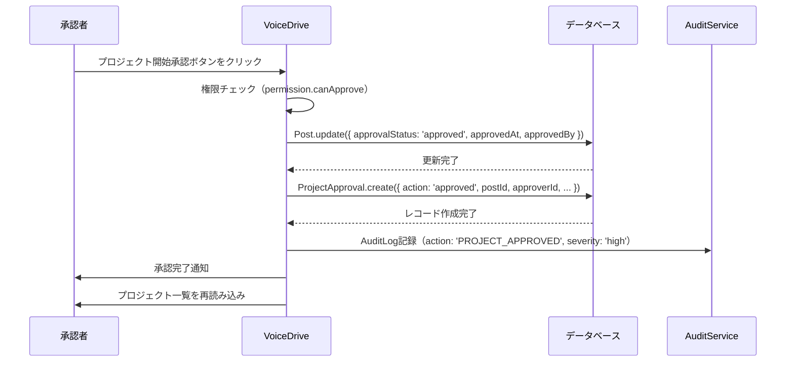
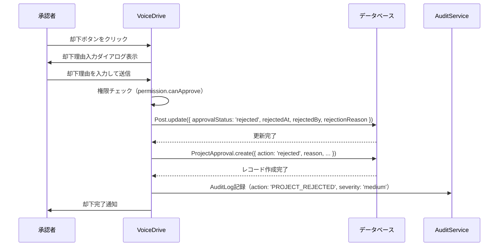
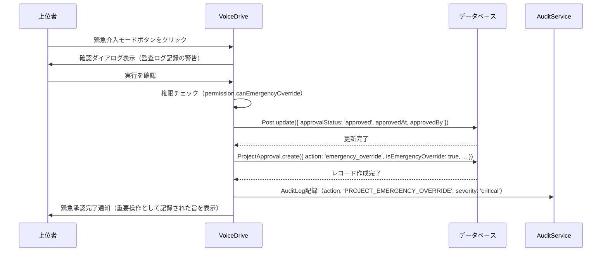
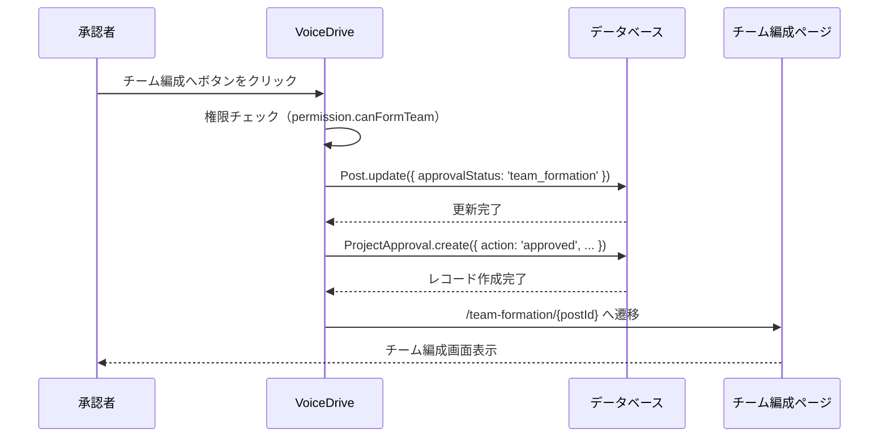

# ProjectApproval（プロジェクト承認）DB要件分析

**文書番号**: VD-DB-ANALYSIS-PROJECT-APPROVAL-20251011
**作成日**: 2025年10月11日
**対象ページ**: https://voicedrive-v100.vercel.app/project-approval
**対象ユーザー**: 承認権限を持つリーダー・管理者（権限レベル 3.5+）
**ページ目的**: プロジェクト提案を承認・却下し、プロジェクト化を判断する

---

## 📋 エグゼクティブサマリー

### ページ概要
- **プロジェクト承認管理**: スコアに基づくプロジェクトレベル（PENDING/TEAM/DEPARTMENT/FACILITY/ORGANIZATION）を判定
- **権限ベース表示**: ユーザーの権限レベルに応じて承認可能・閲覧可能なプロジェクトをフィルタリング
- **承認アクション**: プロジェクト開始承認、保留、却下、緊急介入、チーム編成開始
- **スコア計算**: 投票数（強く賛成+2、賛成+1、中立0、反対-1、強く反対-2）からスコアを動的計算
- **プロジェクト規模推定**: スコアとプロジェクトレベルから推定チーム規模を算出

### データ責任分界
| データ | 責任システム | 理由 |
|--------|------------|------|
| プロジェクト投稿（Post） | VoiceDrive | VoiceDriveで管理 |
| 投票（Vote） | VoiceDrive | VoiceDriveで管理 |
| コメント（Comment） | VoiceDrive | VoiceDriveで管理 |
| 承認履歴 | VoiceDrive | 🆕 新規テーブル必要 |
| プロジェクトステータス | VoiceDrive | Post.statusで管理 |
| 職員権限情報 | 医療システム | User.permissionLevelはキャッシュ |

### 不足項目サマリー
- **新規テーブル**: 1個（ProjectApproval - 承認履歴管理）
- **テーブル拡張**: 1個（Post - プロジェクト承認ステータスフィールド追加）
- **インデックス追加**: 2個（パフォーマンス最適化用）
- **医療システムAPI**: 0個（既存データで対応可能）

---

## 🎯 ページ機能詳細分析

### 1. ヘッダー表示（Lines 191-209）

**機能**: ページタイトルと権限レベル情報を表示

**表示項目**:
- タイトル: "プロジェクト承認"
- アイコン: Rocket 🚀
- 説明文: "管轄範囲のプロジェクト提案を確認・承認"
- 権限レベル表示:
  - 現在のユーザー権限レベル（例: "レベル 8"）
  - 承認可能レベル数（例: "承認可能: 3レベル"）
  - 閲覧可能レベル数（例: "閲覧可能: 5レベル"）

**必要なデータソース**:
- `User.permissionLevel`: 現在のユーザー権限レベル（医療システムからキャッシュ）
- `ProjectPermissionService.getApprovableLevels()`: 承認可能なプロジェクトレベルリスト
- `ProjectPermissionService.getViewableLevels()`: 閲覧可能なプロジェクトレベルリスト

**不足項目**:
- なし（既存データで対応可能）

---

### 2. フィルターコントロール（Lines 212-273）

**機能**: 表示するプロジェクトをフィルタリング

**フィルター種別**:

#### A. 権限フィルター（Lines 224-252）
- **承認可能** (`approvable`): 自分が承認できるプロジェクトのみ表示
- **全て** (`viewable`): 閲覧権限のあるプロジェクトを全て表示

**判定ロジック** (Lines 66-73):
```typescript
if (filter === 'approvable') {
  return permission.canApprove;  // 承認可能
} else {
  return permission.canView;     // 閲覧可能
}
```

#### B. プロジェクトレベルフィルター（Lines 256-270）
- **すべてのレベル** (`all`): 全プロジェクトレベルを表示
- **個別レベル選択**: PENDING, TEAM, DEPARTMENT, FACILITY, ORGANIZATION, STRATEGIC

**プロジェクトレベル判定** (Lines 47-49, 244-250):
```typescript
const projectLevel = projectPermissionService.getProjectLevelFromScore(score);
// スコア 0-99: PENDING
// スコア 100-199: TEAM
// スコア 200-399: DEPARTMENT
// スコア 400-799: FACILITY
// スコア 800+: ORGANIZATION
```

**必要なデータソース**:
- `Post`: プロジェクト投稿データ
- `Vote`: 投票データ（スコア計算用）
- `User.permissionLevel`: ユーザー権限レベル

**不足項目**:
- なし（既存テーブルで対応可能）

---

### 3. プロジェクト一覧表示（Lines 276-310）

**機能**: フィルタリングされたプロジェクトをカード形式で表示

**表示データ** (Lines 149-182):
```typescript
interface ProjectData {
  post: Post;                      // 投稿データ
  currentScore: number;            // 現在のスコア（動的計算）
  projectLevel: ProjectLevel;      // プロジェクトレベル
  permission: ProjectPermission;   // ユーザーの権限情報
  totalVotes: number;              // 総投票数
  supportRate: number;             // 支持率（%）
  projectScale?: ProjectScale;     // プロジェクト規模
  estimatedTeamSize?: number;      // 推定チーム規模
}
```

**スコア計算ロジック** (Lines 150-153):
```typescript
const currentScore = calculateScore(
  convertVotesToEngagements(post.votes || {}),
  post.proposalType
);
```

**投票重み付け** (ProjectScoringサービス):
- 強く賛成 (`strongly-support`): +2
- 賛成 (`support`): +1
- 中立 (`neutral`): 0
- 反対 (`oppose`): -1
- 強く反対 (`strongly-oppose`): -2

**支持率計算** (Lines 162-167):
```typescript
const supportVotes = (post.votes['strongly-support'] || 0) + (post.votes['support'] || 0);
const supportRate = totalVotes > 0 ? Math.round((supportVotes / totalVotes) * 100) : 0;
```

**プロジェクト規模推定** (Lines 170-171):
```typescript
const estimatedTeamSize = Math.max(5, Math.floor(totalVotes * 0.3));
const projectScale = getProjectScale(projectLevel, estimatedTeamSize);
```

**必要なデータソース**:
- `Post`: プロジェクト投稿
- `Vote`: 投票データ
- `Comment`: コメントデータ
- `User`: 投稿者情報

**不足項目**:
- なし（既存テーブルで対応可能）

---

### 4. プロジェクトカード詳細（ProjectApprovalCard）

#### A. プロジェクトレベル表示（Lines 44-100）

**レベル設定**:
```typescript
const levelConfig = {
  'PENDING': {
    label: 'アイデア検討中',
    icon: '💡',
    color: 'gray',
    threshold: '0-99点'
  },
  'TEAM': {
    label: 'チームプロジェクト',
    icon: '👥',
    color: 'blue',
    threshold: '100-199点'
  },
  'DEPARTMENT': {
    label: '部署プロジェクト',
    icon: '🏢',
    color: 'green',
    threshold: '200-399点'
  },
  'FACILITY': {
    label: '施設プロジェクト',
    icon: '🏥',
    color: 'yellow',
    threshold: '400-799点'
  },
  'ORGANIZATION': {
    label: '法人プロジェクト',
    icon: '🏛️',
    color: 'purple',
    threshold: '800点以上'
  },
  'STRATEGIC': {
    label: '戦略プロジェクト',
    icon: '⭐',
    color: 'pink',
    threshold: '戦略指定'
  }
};
```

#### B. 権限バッジ表示（Lines 111-117）

**バッジ種類** (ProjectPermissionService):
- **承認者** (`approver`): "✅ 承認者" - プロジェクト開始を承認できる
- **承認者（代行）** (`approver`): "✅ 承認者（代行）" - フォールバック承認者
- **上位者（閲覧・アドバイス）** (`supervisor`): "👁️ 上位者（閲覧・アドバイス）" - アドバイス可能
- **参考閲覧** (`observer`): "📖 参考閲覧" - 閲覧のみ
- **参考閲覧（学習）** (`observer`): "📖 参考閲覧（学習）" - 学習目的の閲覧

#### C. 基本情報表示（Lines 155-168）

**表示項目**:
- 総投票数 (`totalVotes`)
- 支持率 (`supportRate`) - パーセンテージ
- コメント数 (`post.comments.length`)

#### D. プロジェクト規模情報（Lines 137-152）

**表示項目**:
- プロジェクト規模区分（小規模/中規模/大規模/超大規模）
- 推定チーム規模（人数）

---

### 5. 承認アクション（Lines 170-257）

#### A. プロジェクト開始承認（Lines 174-180）

**機能**: プロジェクトを正式に開始する

**表示条件**:
- `permission.canApprove === true`

**処理内容** (Lines 79-91):
```typescript
handleApprove(postId: string) {
  // TODO: API呼び出し
  // 1. Post.statusを'approved'に更新
  // 2. ProjectApprovalレコード作成
  // 3. AuditLogに記録
  AuditService.log({
    action: 'PROJECT_APPROVED',
    targetId: postId,
    severity: 'high'
  });
}
```

**必要なデータ更新**:
- `Post.status`: 'active' → 'approved'
- 🆕 `ProjectApproval`: 承認履歴レコード作成
- `AuditLog`: 監査ログ記録

#### B. チーム編成へ（Lines 183-191）

**機能**: チーム編成プロセスを開始する

**表示条件**:
- `permission.canApprove === true`
- `permission.canFormTeam === true`
- `projectLevel !== 'PENDING'`

**処理内容** (Lines 135-146):
```typescript
handleFormTeam(postId: string) {
  // TODO: チーム編成ページへ遷移
  // 遷移先: /team-formation/{postId}
  AuditService.log({
    action: 'PROJECT_TEAM_FORMATION_STARTED',
    targetId: postId,
    severity: 'medium'
  });
}
```

#### C. 保留・却下（Lines 194-207）

**機能**: プロジェクトを保留または却下する

**表示条件**:
- `permission.canApprove === true`

**処理内容**:
```typescript
// 保留 (Lines 107-119)
handleHold(postId: string, reason: string) {
  // TODO: API呼び出し
  // 1. Post.statusを'on_hold'に更新
  // 2. ProjectApprovalレコード作成（status: 'held'）
  // 3. 保留理由を記録
  AuditService.log({
    action: 'PROJECT_HELD',
    targetId: postId,
    severity: 'low',
    details: { reason }
  });
}

// 却下 (Lines 93-105)
handleReject(postId: string, reason: string) {
  // TODO: API呼び出し
  // 1. Post.statusを'rejected'に更新
  // 2. ProjectApprovalレコード作成（status: 'rejected'）
  // 3. 却下理由を記録
  AuditService.log({
    action: 'PROJECT_REJECTED',
    targetId: postId,
    severity: 'medium',
    details: { reason }
  });
}
```

**必要なデータ更新**:
- `Post.status`: 'active' → 'on_hold' or 'rejected'
- 🆕 `ProjectApproval`: 承認履歴レコード作成
- `AuditLog`: 監査ログ記録

#### D. アドバイスボタン（Lines 212-218）

**機能**: 上位者がアドバイスコメントを投稿する

**表示条件**:
- `permission.canComment === true`
- `permission.canApprove === false`

**処理内容**:
```typescript
// TODO: コメント投稿ダイアログを表示
// Comment.commentType = 'proposal' または 'support'
```

#### E. 緊急介入モード（Lines 221-256）

**機能**: 上位者が権限外のプロジェクトに緊急介入する

**表示条件**:
- `permission.canEmergencyOverride === true`
- `permission.canApprove === false`

**処理内容** (Lines 121-133):
```typescript
handleEmergencyOverride(postId: string) {
  // TODO: API呼び出し
  // 1. Post.statusを'approved'に更新（緊急承認）
  // 2. ProjectApprovalレコード作成（isEmergencyOverride: true）
  // 3. 監査ログに重要度criticalで記録
  AuditService.log({
    action: 'PROJECT_EMERGENCY_OVERRIDE',
    targetId: postId,
    severity: 'critical',
    details: { reason: '上位者による緊急介入' }
  });
}
```

**必要なデータ更新**:
- `Post.status`: 'active' → 'approved'
- 🆕 `ProjectApproval`: 承認履歴レコード作成（`isEmergencyOverride: true`）
- `AuditLog`: 監査ログ記録（severity: 'critical'）

---

### 6. 空状態表示（Lines 277-286）

**機能**: フィルタ条件に該当するプロジェクトがない場合のメッセージ

**メッセージ種類**:
- 承認可能モード: "承認可能なプロジェクトがありません"
- 閲覧モード: "閲覧可能なプロジェクトがありません"

**不足項目**:
- なし（フロントエンド表示のみ）

---

## 🗄️ データベース設計

### 結論: 1つの新規テーブルと1つのテーブル拡張が必要 ⚠️

ProjectApprovalページは、既存テーブル（Post, Vote, Comment, User）に加えて、**承認履歴を管理する新規テーブル**が必要です。

---

### 🆕 新規テーブル1: ProjectApproval（プロジェクト承認履歴）

**目的**: プロジェクトの承認・却下・保留の履歴を記録し、誰がいつどのような理由で判断したかを追跡する

```prisma
// プロジェクト承認履歴
model ProjectApproval {
  id                  String    @id @default(cuid())

  // 対象プロジェクト
  postId              String    @map("post_id")

  // 承認者情報
  approverId          String    @map("approver_id")          // User.id
  approverName        String    @map("approver_name")        // キャッシュ（表示用）
  approverLevel       Float     @map("approver_level")       // 承認時の権限レベル

  // 承認情報
  action              String                                  // 'approved' | 'rejected' | 'held' | 'emergency_override'
  reason              String?   @db.Text                      // 理由（却下・保留時）
  comment             String?   @db.Text                      // コメント

  // プロジェクト情報（承認時点のスナップショット）
  projectLevel        String    @map("project_level")         // 'PENDING' | 'TEAM' | 'DEPARTMENT' | 'FACILITY' | 'ORGANIZATION'
  projectScore        Int       @map("project_score")         // 承認時のスコア
  totalVotes          Int       @map("total_votes")           // 承認時の総投票数
  supportRate         Float     @map("support_rate")          // 承認時の支持率（%）

  // 緊急介入フラグ
  isEmergencyOverride Boolean   @default(false) @map("is_emergency_override")

  // タイムスタンプ
  createdAt           DateTime  @default(now()) @map("created_at")
  updatedAt           DateTime  @updatedAt @map("updated_at")

  // リレーション
  post                Post      @relation("PostApprovals", fields: [postId], references: [id], onDelete: Cascade)
  approver            User      @relation("ProjectApprover", fields: [approverId], references: [id])

  // インデックス
  @@index([postId])
  @@index([approverId])
  @@index([action])
  @@index([projectLevel])
  @@index([createdAt])
  @@index([postId, createdAt])  // 承認履歴を時系列で取得
  @@map("project_approvals")
}
```

**用途**:
- プロジェクト承認履歴の記録
- 承認者の追跡
- 承認時のプロジェクト状態のスナップショット保存
- 緊急介入の記録（監査用）

---

### 🔧 テーブル拡張1: Post（プロジェクトステータス拡張）

**目的**: プロジェクトの承認ステータスを管理する

```prisma
model Post {
  // ... 既存フィールド

  // 🆕 プロジェクト承認ステータス（project-approval統合 2025-10-11）
  approvalStatus      String?   @default("pending") @map("approval_status")
  // 'pending' | 'approved' | 'rejected' | 'on_hold' | 'team_formation'

  approvedAt          DateTime? @map("approved_at")      // 承認日時
  approvedBy          String?   @map("approved_by")      // 承認者User.id
  rejectedAt          DateTime? @map("rejected_at")      // 却下日時
  rejectedBy          String?   @map("rejected_by")      // 却下者User.id
  rejectionReason     String?   @db.Text @map("rejection_reason")  // 却下理由

  // リレーション
  approvals           ProjectApproval[] @relation("PostApprovals")

  // インデックス
  @@index([approvalStatus])
  @@index([approvedAt])
}
```

**追加理由**:
- 現在の`Post.status`は'active'/'archived'/'deleted'のみ
- プロジェクト承認ステータスを別途管理する必要がある
- 承認・却下の履歴を効率的に追跡

---

### 📊 User テーブルへのリレーション追加

```prisma
model User {
  // ... 既存フィールド

  // ProjectApproval統合実装（2025-10-11）
  projectApprovals    ProjectApproval[]  @relation("ProjectApprover")
}
```

---

### 🔍 複合インデックス追加（パフォーマンス最適化）

#### インデックス1: Post承認ステータス×作成日

```prisma
model Post {
  // ... 既存フィールド

  @@index([approvalStatus, createdAt])  // 🆕 承認待ちプロジェクト取得用
}
```

**用途**: 承認待ちプロジェクトを新しい順に取得
```sql
SELECT * FROM posts
WHERE approval_status = 'pending' AND type = 'improvement'
ORDER BY created_at DESC
```

#### インデックス2: ProjectApproval承認者×プロジェクトレベル

```prisma
model ProjectApproval {
  // ... 既存フィールド

  @@index([approverId, projectLevel])  // 🆕 承認者別レベル別統計取得用
}
```

**用途**: 承認者の承認履歴を取得
```sql
SELECT project_level, COUNT(*) as count
FROM project_approvals
WHERE approver_id = ?
GROUP BY project_level
```

---

## 📊 データフロー図

### フロー1: プロジェクト承認



---

### フロー2: プロジェクト却下



---

### フロー3: 緊急介入



---

### フロー4: チーム編成開始



---

## 🔄 医療システム連携

### 必要なAPI

| API | 用途 | 頻度 | 備考 |
|-----|------|------|------|
| なし | - | - | **医療システムAPIは不要** |

**結論**: ProjectApprovalページは **VoiceDrive内部データのみで完結** します。医療システムとの連携は不要です。

**理由**:
- プロジェクトデータ（Post）は VoiceDrive が管理
- 投票データ（Vote）は VoiceDrive が管理
- 承認データ（ProjectApproval）は VoiceDrive が管理
- 職員情報（User）は既にキャッシュ済み（権限レベル含む）

---

## 🎨 サービス層設計

### ProjectApprovalService

```typescript
class ProjectApprovalService {
  // プロジェクト承認
  async approveProject(
    postId: string,
    approverId: string,
    comment?: string
  ): Promise<{ post: Post; approval: ProjectApproval }> {
    // 1. 権限チェック
    const approver = await prisma.user.findUnique({ where: { id: approverId } });
    if (!approver) throw new Error('承認者が見つかりません');

    // 2. プロジェクト取得
    const post = await prisma.post.findUnique({
      where: { id: postId },
      include: { votes: true }
    });
    if (!post) throw new Error('プロジェクトが見つかりません');

    // 3. スコア計算
    const score = this.calculateScore(post.votes);
    const projectLevel = this.getProjectLevel(score);

    // 4. 権限チェック
    const permission = projectPermissionService.getPermission(approver, projectLevel);
    if (!permission.canApprove) {
      throw new Error('このプロジェクトを承認する権限がありません');
    }

    // 5. トランザクション処理
    return prisma.$transaction(async (tx) => {
      // 5-1. Post更新
      const updatedPost = await tx.post.update({
        where: { id: postId },
        data: {
          approvalStatus: 'approved',
          approvedAt: new Date(),
          approvedBy: approverId
        }
      });

      // 5-2. ProjectApproval作成
      const totalVotes = post.votes.length;
      const supportVotes = post.votes.filter(v =>
        v.option === 'strongly-support' || v.option === 'support'
      ).length;
      const supportRate = totalVotes > 0 ? (supportVotes / totalVotes) * 100 : 0;

      const approval = await tx.projectApproval.create({
        data: {
          postId,
          approverId,
          approverName: approver.name,
          approverLevel: approver.permissionLevel.toNumber(),
          action: 'approved',
          comment,
          projectLevel,
          projectScore: score,
          totalVotes,
          supportRate,
          isEmergencyOverride: false
        }
      });

      return { post: updatedPost, approval };
    });
  }

  // プロジェクト却下
  async rejectProject(
    postId: string,
    approverId: string,
    reason: string
  ): Promise<{ post: Post; approval: ProjectApproval }> {
    // 1. 権限チェック
    const approver = await prisma.user.findUnique({ where: { id: approverId } });
    if (!approver) throw new Error('承認者が見つかりません');

    // 2. プロジェクト取得
    const post = await prisma.post.findUnique({
      where: { id: postId },
      include: { votes: true }
    });
    if (!post) throw new Error('プロジェクトが見つかりません');

    // 3. スコア計算
    const score = this.calculateScore(post.votes);
    const projectLevel = this.getProjectLevel(score);

    // 4. 権限チェック
    const permission = projectPermissionService.getPermission(approver, projectLevel);
    if (!permission.canApprove) {
      throw new Error('このプロジェクトを却下する権限がありません');
    }

    // 5. トランザクション処理
    return prisma.$transaction(async (tx) => {
      // 5-1. Post更新
      const updatedPost = await tx.post.update({
        where: { id: postId },
        data: {
          approvalStatus: 'rejected',
          rejectedAt: new Date(),
          rejectedBy: approverId,
          rejectionReason: reason
        }
      });

      // 5-2. ProjectApproval作成
      const totalVotes = post.votes.length;
      const supportVotes = post.votes.filter(v =>
        v.option === 'strongly-support' || v.option === 'support'
      ).length;
      const supportRate = totalVotes > 0 ? (supportVotes / totalVotes) * 100 : 0;

      const approval = await tx.projectApproval.create({
        data: {
          postId,
          approverId,
          approverName: approver.name,
          approverLevel: approver.permissionLevel.toNumber(),
          action: 'rejected',
          reason,
          projectLevel,
          projectScore: score,
          totalVotes,
          supportRate,
          isEmergencyOverride: false
        }
      });

      return { post: updatedPost, approval };
    });
  }

  // プロジェクト保留
  async holdProject(
    postId: string,
    approverId: string,
    reason: string
  ): Promise<{ post: Post; approval: ProjectApproval }> {
    // 1. 権限チェック
    const approver = await prisma.user.findUnique({ where: { id: approverId } });
    if (!approver) throw new Error('承認者が見つかりません');

    // 2. プロジェクト取得
    const post = await prisma.post.findUnique({
      where: { id: postId },
      include: { votes: true }
    });
    if (!post) throw new Error('プロジェクトが見つかりません');

    // 3. スコア計算
    const score = this.calculateScore(post.votes);
    const projectLevel = this.getProjectLevel(score);

    // 4. 権限チェック
    const permission = projectPermissionService.getPermission(approver, projectLevel);
    if (!permission.canApprove) {
      throw new Error('このプロジェクトを保留する権限がありません');
    }

    // 5. トランザクション処理
    return prisma.$transaction(async (tx) => {
      // 5-1. Post更新
      const updatedPost = await tx.post.update({
        where: { id: postId },
        data: {
          approvalStatus: 'on_hold'
        }
      });

      // 5-2. ProjectApproval作成
      const totalVotes = post.votes.length;
      const supportVotes = post.votes.filter(v =>
        v.option === 'strongly-support' || v.option === 'support'
      ).length;
      const supportRate = totalVotes > 0 ? (supportVotes / totalVotes) * 100 : 0;

      const approval = await tx.projectApproval.create({
        data: {
          postId,
          approverId,
          approverName: approver.name,
          approverLevel: approver.permissionLevel.toNumber(),
          action: 'held',
          reason,
          projectLevel,
          projectScore: score,
          totalVotes,
          supportRate,
          isEmergencyOverride: false
        }
      });

      return { post: updatedPost, approval };
    });
  }

  // 緊急介入
  async emergencyOverride(
    postId: string,
    approverId: string
  ): Promise<{ post: Post; approval: ProjectApproval }> {
    // 1. 権限チェック
    const approver = await prisma.user.findUnique({ where: { id: approverId } });
    if (!approver) throw new Error('承認者が見つかりません');

    // 2. プロジェクト取得
    const post = await prisma.post.findUnique({
      where: { id: postId },
      include: { votes: true }
    });
    if (!post) throw new Error('プロジェクトが見つかりません');

    // 3. スコア計算
    const score = this.calculateScore(post.votes);
    const projectLevel = this.getProjectLevel(score);

    // 4. 権限チェック
    const permission = projectPermissionService.getPermission(approver, projectLevel);
    if (!permission.canEmergencyOverride) {
      throw new Error('緊急介入する権限がありません');
    }

    // 5. トランザクション処理
    return prisma.$transaction(async (tx) => {
      // 5-1. Post更新
      const updatedPost = await tx.post.update({
        where: { id: postId },
        data: {
          approvalStatus: 'approved',
          approvedAt: new Date(),
          approvedBy: approverId
        }
      });

      // 5-2. ProjectApproval作成
      const totalVotes = post.votes.length;
      const supportVotes = post.votes.filter(v =>
        v.option === 'strongly-support' || v.option === 'support'
      ).length;
      const supportRate = totalVotes > 0 ? (supportVotes / totalVotes) * 100 : 0;

      const approval = await tx.projectApproval.create({
        data: {
          postId,
          approverId,
          approverName: approver.name,
          approverLevel: approver.permissionLevel.toNumber(),
          action: 'emergency_override',
          comment: '上位者による緊急介入',
          projectLevel,
          projectScore: score,
          totalVotes,
          supportRate,
          isEmergencyOverride: true
        }
      });

      return { post: updatedPost, approval };
    });
  }

  // 承認可能なプロジェクト取得
  async getApprovableProjects(
    userId: string,
    filter: {
      projectLevel?: ProjectLevel;
      limit?: number;
      offset?: number;
    } = {}
  ): Promise<Post[]> {
    const user = await prisma.user.findUnique({ where: { id: userId } });
    if (!user) throw new Error('ユーザーが見つかりません');

    // 承認可能レベルを取得
    const approvableLevels = projectPermissionService.getApprovableLevels(user);
    const levelStrings = approvableLevels.map(l => l.projectLevel);

    // プロジェクト取得
    const posts = await prisma.post.findMany({
      where: {
        type: 'improvement',
        status: 'active',
        approvalStatus: 'pending',
        // プロジェクトレベルでフィルタ（スコア計算後）
      },
      include: {
        author: true,
        votes: true,
        comments: {
          select: { id: true }
        }
      },
      orderBy: { createdAt: 'desc' },
      take: filter.limit || 50,
      skip: filter.offset || 0
    });

    // スコアベースフィルタリング
    return posts.filter(post => {
      const score = this.calculateScore(post.votes);
      const projectLevel = this.getProjectLevel(score);

      // レベルフィルタ適用
      if (filter.projectLevel && projectLevel !== filter.projectLevel) {
        return false;
      }

      // 承認可能レベルチェック
      return levelStrings.includes(projectLevel);
    });
  }

  // プロジェクトスコア計算
  private calculateScore(votes: Vote[]): number {
    const weights = {
      'strongly-support': 2,
      'support': 1,
      'neutral': 0,
      'oppose': -1,
      'strongly-oppose': -2
    };

    return votes.reduce((sum, vote) => {
      return sum + (weights[vote.option] || 0);
    }, 0);
  }

  // プロジェクトレベル判定
  private getProjectLevel(score: number): ProjectLevel {
    if (score >= 800) return 'ORGANIZATION';
    if (score >= 400) return 'FACILITY';
    if (score >= 200) return 'DEPARTMENT';
    if (score >= 100) return 'TEAM';
    return 'PENDING';
  }
}
```

---

## 📋 API エンドポイント設計

### 1. POST /api/project-approval/approve
プロジェクトを承認する

**Request**:
```json
{
  "postId": "post-001",
  "comment": "チーム編成を開始してください"
}
```

**Response**:
```json
{
  "success": true,
  "post": {
    "id": "post-001",
    "approvalStatus": "approved",
    "approvedAt": "2025-10-11T10:00:00Z",
    "approvedBy": "user-1"
  },
  "approval": {
    "id": "approval-001",
    "action": "approved",
    "projectLevel": "DEPARTMENT",
    "projectScore": 250,
    "totalVotes": 50,
    "supportRate": 85.2
  }
}
```

---

### 2. POST /api/project-approval/reject
プロジェクトを却下する

**Request**:
```json
{
  "postId": "post-002",
  "reason": "予算が確保できないため、来年度に再検討"
}
```

**Response**:
```json
{
  "success": true,
  "post": {
    "id": "post-002",
    "approvalStatus": "rejected",
    "rejectedAt": "2025-10-11T10:05:00Z",
    "rejectedBy": "user-1",
    "rejectionReason": "予算が確保できないため、来年度に再検討"
  },
  "approval": {
    "id": "approval-002",
    "action": "rejected",
    "reason": "予算が確保できないため、来年度に再検討"
  }
}
```

---

### 3. POST /api/project-approval/hold
プロジェクトを保留する

**Request**:
```json
{
  "postId": "post-003",
  "reason": "他のプロジェクトとの調整が必要"
}
```

**Response**:
```json
{
  "success": true,
  "post": {
    "id": "post-003",
    "approvalStatus": "on_hold"
  },
  "approval": {
    "id": "approval-003",
    "action": "held",
    "reason": "他のプロジェクトとの調整が必要"
  }
}
```

---

### 4. POST /api/project-approval/emergency-override
緊急介入（上位者専用）

**Request**:
```json
{
  "postId": "post-004"
}
```

**Response**:
```json
{
  "success": true,
  "post": {
    "id": "post-004",
    "approvalStatus": "approved",
    "approvedAt": "2025-10-11T10:10:00Z",
    "approvedBy": "user-18"
  },
  "approval": {
    "id": "approval-004",
    "action": "emergency_override",
    "isEmergencyOverride": true,
    "comment": "上位者による緊急介入"
  },
  "warning": "この操作は監査ログに記録されました（重要度: critical）"
}
```

---

### 5. GET /api/project-approval/approvable
承認可能なプロジェクト一覧取得

**Request**:
```http
GET /api/project-approval/approvable?projectLevel=DEPARTMENT&limit=20&offset=0
```

**Response**:
```json
{
  "projects": [
    {
      "id": "post-005",
      "type": "improvement",
      "proposalType": "operational",
      "content": "新人教育プログラムの体系化とメンター制度の導入",
      "author": {
        "id": "user-2",
        "name": "田中次郎",
        "department": "看護部"
      },
      "currentScore": 250,
      "projectLevel": "DEPARTMENT",
      "totalVotes": 50,
      "supportRate": 85.2,
      "estimatedTeamSize": 15,
      "projectScale": "medium",
      "permission": {
        "canApprove": true,
        "canFormTeam": true,
        "role": "approver",
        "badge": "✅ 承認者"
      }
    }
  ],
  "pagination": {
    "limit": 20,
    "offset": 0,
    "totalCount": 45
  }
}
```

---

### 6. GET /api/project-approval/history/:postId
プロジェクトの承認履歴取得

**Request**:
```http
GET /api/project-approval/history/post-001
```

**Response**:
```json
{
  "postId": "post-001",
  "history": [
    {
      "id": "approval-001",
      "action": "approved",
      "approver": {
        "id": "user-1",
        "name": "山田太郎",
        "permissionLevel": 8
      },
      "projectLevel": "DEPARTMENT",
      "projectScore": 250,
      "totalVotes": 50,
      "supportRate": 85.2,
      "isEmergencyOverride": false,
      "createdAt": "2025-10-11T10:00:00Z"
    }
  ]
}
```

---

## 📅 実装計画

### Phase 1: DB・サービス層実装（2日間）

**Day 1**:
- [x] DB要件分析書作成 ← 今ここ
- [ ] ProjectApprovalテーブル追加（Prisma schema更新）
- [ ] Post拡張フィールド追加（approvalStatus等）
- [ ] マイグレーション実行
- [ ] ProjectApprovalService 実装
  - approveProject()
  - rejectProject()
  - holdProject()
  - emergencyOverride()
  - getApprovableProjects()
- [ ] ユニットテスト作成

**Day 2**:
- [ ] API実装
  - POST /api/project-approval/approve
  - POST /api/project-approval/reject
  - POST /api/project-approval/hold
  - POST /api/project-approval/emergency-override
  - GET /api/project-approval/approvable
  - GET /api/project-approval/history/:postId
- [ ] APIテスト

---

### Phase 2: フロントエンド統合（1日間）

**Day 3**:
- [ ] ProjectApprovalPage.tsx 修正
  - getDemoPosts() → API呼び出しに変更
  - handleApprove() 実装
  - handleReject() 実装
  - handleHold() 実装
  - handleEmergencyOverride() 実装
  - handleFormTeam() 実装
- [ ] useProjectApproval() カスタムフック作成
- [ ] エラーハンドリング実装
- [ ] 確認ダイアログ実装（却下理由入力、緊急介入警告）

---

### Phase 3: テスト・デプロイ（1日間）

**Day 4**:
- [ ] 統合テスト
- [ ] 権限チェックテスト（各レベルでの表示・操作確認）
- [ ] 監査ログ確認
- [ ] パフォーマンステスト
- [ ] 本番デプロイ

---

**合計**: 4日間（1週間以内）

---

## ✅ チェックリスト

### データベース
- [ ] ProjectApprovalテーブル作成
- [ ] Post.approvalStatus フィールド追加
- [ ] Post.approvedAt フィールド追加
- [ ] Post.approvedBy フィールド追加
- [ ] Post.rejectedAt フィールド追加
- [ ] Post.rejectedBy フィールド追加
- [ ] Post.rejectionReason フィールド追加
- [ ] 複合インデックス追加（Post: approvalStatus + createdAt）
- [ ] 複合インデックス追加（ProjectApproval: approverId + projectLevel）
- [ ] マイグレーション実行

### サービス層
- [ ] ProjectApprovalService 実装
- [ ] approveProject() 実装
- [ ] rejectProject() 実装
- [ ] holdProject() 実装
- [ ] emergencyOverride() 実装
- [ ] getApprovableProjects() 実装
- [ ] calculateScore() 実装
- [ ] getProjectLevel() 実装

### API
- [ ] POST /api/project-approval/approve 実装
- [ ] POST /api/project-approval/reject 実装
- [ ] POST /api/project-approval/hold 実装
- [ ] POST /api/project-approval/emergency-override 実装
- [ ] GET /api/project-approval/approvable 実装
- [ ] GET /api/project-approval/history/:postId 実装

### フロントエンド
- [ ] API統合（デモデータ削除）
- [ ] useProjectApproval() カスタムフック実装
- [ ] エラーハンドリング
- [ ] ローディング状態表示
- [ ] 確認ダイアログ実装
- [ ] 成功・エラー通知実装

### テスト
- [ ] ユニットテスト
- [ ] API統合テスト
- [ ] 権限チェックテスト
- [ ] E2Eテスト
- [ ] 監査ログ確認

---

## 📝 補足事項

### プロジェクトレベル判定基準

**⚠️ 2025-10-11更新**: 組織階層に合わせて承認者レベルを調整

| プロジェクトレベル | スコア範囲 | 承認者レベル | 承認者役職 | 代行可能レベル | 説明 |
|------------------|-----------|------------|-----------|--------------|------|
| PENDING | 0-99点 | **6（主任）** | 主任 | 5（副主任） | アイデア検討中 |
| TEAM | 100-199点 | **8（師長）** | 師長・科長 | 7（副師長） | チームプロジェクト（5-15名） |
| DEPARTMENT | 200-399点 | **10（部長）** | 部長・医局長 | 9（副部長） | 部署プロジェクト（15-30名） |
| FACILITY | 400-799点 | **11（事務長）** | 事務長 | なし | 施設プロジェクト（30-60名） |
| ORGANIZATION | 800点以上 | **13（院長）** | 院長・施設長 | 12（副院長） | 法人プロジェクト（60名以上） |
| STRATEGIC | 戦略指定 | **18（理事長）** | 理事長 | なし | 戦略プロジェクト（理事長承認） |

**変更理由**:
- 主任（6）は現場リーダーとしてアイデア段階の判断に適任
- 師長（8）はチーム（5-15名）を統括する立場で適切
- 部長（10）は部署横断（15-30名）の承認権限を持つ
- 事務長（11）は施設全体の予算・リソース管理の責任者

### 権限判定ロジック

**承認者（Approver）**:
- `userLevel === responsibility.targetPermissionLevel`
- プロジェクト開始を承認できる

**フォールバック承認者**:
- `userLevel >= responsibility.minPermissionLevel && userLevel < responsibility.targetPermissionLevel`
- 本来の承認者が不在の場合に承認可能

**上位監督者（Supervisor）**:
- `userLevel > responsibility.targetPermissionLevel && (userLevel - targetLevel) <= 2`
- アドバイス可能、緊急介入可能

**参考閲覧者（Observer）**:
- `userLevel > responsibility.targetPermissionLevel && (userLevel - targetLevel) > 2`
- または `userLevel < responsibility.targetPermissionLevel && userLevel >= (minLevel - 2)`
- 閲覧のみ

### 監査ログ重要度

| アクション | severity | 理由 |
|----------|----------|------|
| PROJECT_APPROVED | high | プロジェクト開始は重要な意思決定 |
| PROJECT_REJECTED | medium | 却下も記録が必要 |
| PROJECT_HELD | low | 保留は一時的な判断 |
| PROJECT_EMERGENCY_OVERRIDE | critical | 権限外の介入は最重要 |
| PROJECT_TEAM_FORMATION_STARTED | medium | チーム編成開始 |

---

**文書終了**

最終更新: 2025年10月11日
次のステップ: 暫定マスターリスト作成
