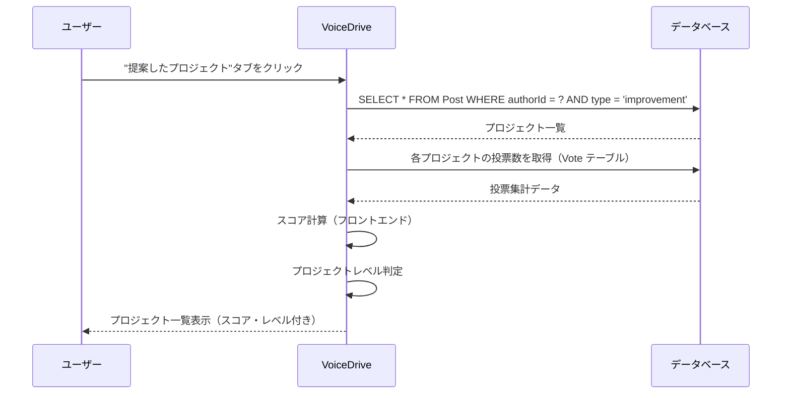
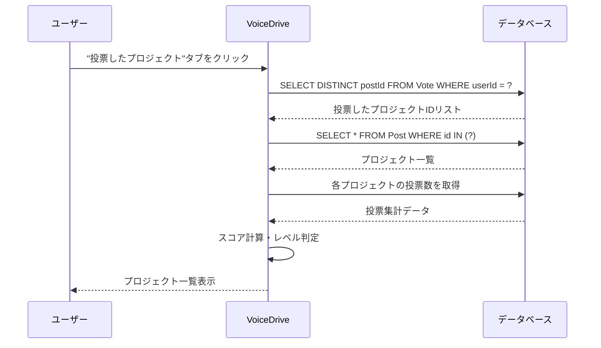
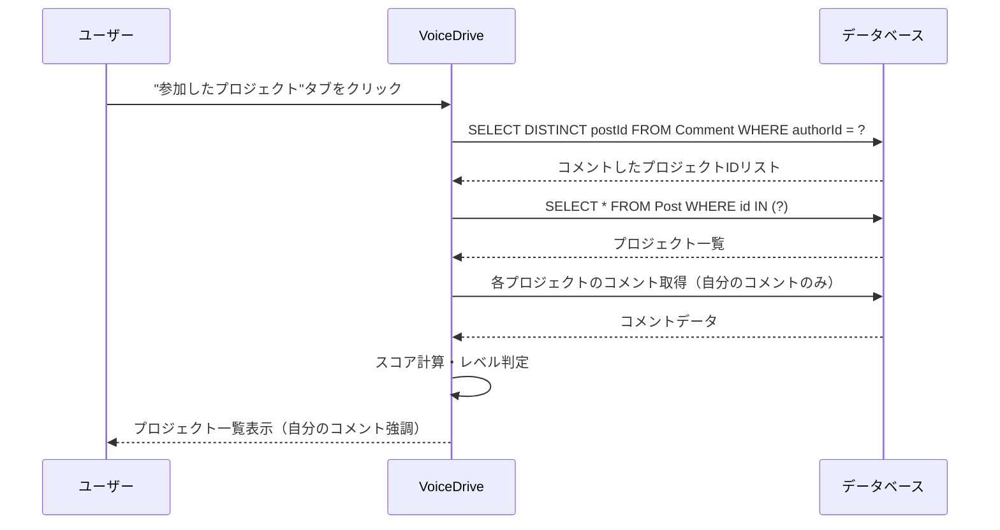

# ProjectTracking（プロジェクト追跡）DB要件分析

**文書番号**: VD-DB-ANALYSIS-PROJECT-TRACKING-20251011
**作成日**: 2025年10月11日
**対象ページ**: https://voicedrive-v100.vercel.app/project-tracking
**対象ユーザー**: 全職員（プロジェクト化モード利用者）
**ページ目的**: プロジェクト化モードでの活動状況を追跡・確認

---

## 📋 エグゼクティブサマリー

### ページ概要
- **プロジェクト活動の追跡**: 提案・投票・参加したプロジェクトを一覧表示
- **統計サマリー**: 提案数、投票数、コメント数、達成数の4指標を表示
- **3つのビュー**: 提案したプロジェクト、投票したプロジェクト、参加したプロジェクト
- **スコア表示**: プロジェクトスコアとレベルをリアルタイム計算
- **進捗追跡**: 各プロジェクトの現状（スコア、投票率、レベル）を可視化

### データ責任分界
| データ | 責任システム | 理由 |
|--------|------------|------|
| プロジェクト投稿 | VoiceDrive | Post テーブルで管理 |
| 投票履歴 | VoiceDrive | Vote テーブルで管理 |
| コメント履歴 | VoiceDrive | Comment テーブルで管理 |
| スコア計算 | VoiceDrive | フロントエンドで動的計算 |
| 職員情報 | 医療システム | 権限レベル等は医療システムから取得 |

### 不足項目サマリー
- **新規テーブル**: 0個（既存テーブルで対応可能）
- **テーブル拡張**: 0個（既存フィールドで対応可能）
- **インデックス追加**: 2個（パフォーマンス最適化用）
- **医療システムAPI**: 0個（既存APIで対応可能）

---

## 🎯 ページ機能詳細分析

### 1. ヘッダー表示（Lines 78-86）

**機能**: ページタイトルと説明を表示

**表示項目**:
- タイトル: "プロジェクトの追跡"
- アイコン: Rocket
- 説明文: "プロジェクト化モードでの活動状況"

**必要なデータソース**:
- なし（静的コンテンツ）

**不足項目**:
- なし

---

### 2. 統計サマリー表示（Lines 88-96）

**機能**: プロジェクト活動の統計情報を表示

**表示項目** (TrackingStats コンポーネント):
- 提案したプロジェクト数 (`myPostsCount`)
- 投票したプロジェクト数 (`votedPostsCount`)
- コメントしたプロジェクト数 (`commentedPostsCount`)
- 達成したプロジェクト数 (`achievedCount`) - スコア100以上

**必要なデータソース**:
```typescript
interface TrackingStats {
  myPostsCount: number;        // 自分が投稿したプロジェクト数
  votedPostsCount: number;     // 自分が投票したプロジェクト数
  commentedPostsCount: number; // 自分がコメントしたプロジェクト数
  achievedCount: number;       // 達成したプロジェクト数（スコア100+）
}
```

**データ取得方法**:
- `myPostsCount`: `Post` テーブルから `authorId = currentUser.id` AND `type = 'improvement'` でカウント
- `votedPostsCount`: `Vote` テーブルから `userId = currentUser.id` でユニークな `postId` をカウント
- `commentedPostsCount`: `Comment` テーブルから `authorId = currentUser.id` でユニークな `postId` をカウント
- `achievedCount`: 提案したプロジェクトのうち、スコア計算結果が100以上のものをカウント

**不足項目**:
- なし（既存テーブルで対応可能）

---

### 3. タブナビゲーション（Lines 98-138）

**機能**: 3つのビューを切り替え

**タブ項目**:
1. **提案したプロジェクト** (`posted`)
   - 自分が投稿したプロジェクト一覧
   - データソース: `Post` テーブル WHERE `authorId = currentUser.id` AND `type = 'improvement'`

2. **投票したプロジェクト** (`voted`)
   - 自分が投票したプロジェクト一覧
   - データソース: `Post` テーブル JOIN `Vote` WHERE `Vote.userId = currentUser.id`

3. **参加したプロジェクト** (`joined`)
   - 自分がコメントしたプロジェクト一覧
   - データソース: `Post` テーブル JOIN `Comment` WHERE `Comment.authorId = currentUser.id`

**不足項目**:
- なし（既存テーブルで対応可能）

---

### 4. プロジェクト一覧表示（Lines 142-203）

**機能**: 選択されたタブのプロジェクトを一覧表示

**表示データ** (Lines 216-260のデモデータより):
```typescript
interface Post {
  id: string;
  type: 'improvement';
  proposalType: 'operational' | 'communication' | 'innovation' | 'strategic';
  content: string;
  author: {
    id: string;
    name: string;
    department: string;
    permissionLevel: number;
  };
  anonymityLevel: string;
  timestamp: Date;
  votes: Record<VoteOption, number>;  // 投票集計
  comments: Comment[];
}
```

**表示要素** (TrackingPostCard):
- プロジェクトタイトル（content）
- 投稿者情報（匿名度により表示制御）
- 投稿日時
- 現在のスコア（動的計算）
- プロジェクトレベル（スコアから判定）
- 投票数・支持率
- コメント数

**データソース**:
- VoiceDrive: `Post` テーブル
- VoiceDrive: `Vote` テーブル（投票集計用）
- VoiceDrive: `Comment` テーブル（コメント数用）
- VoiceDrive: `User` テーブル（投稿者情報）

**不足項目**:
- なし（既存テーブルで対応可能）

---

### 5. スコア計算（Lines 46-73）

**機能**: プロジェクトスコアをリアルタイム計算

**計算ロジック** (Lines 47-50):
```typescript
const currentScore = calculateScore(
  convertVotesToEngagements(post.votes || {}),
  post.proposalType
);
```

**スコア計算に必要なデータ**:
- 投票数（strongly-support, support, neutral, oppose, strongly-oppose）
- プロジェクトタイプ（operational, communication, innovation, strategic）

**プロジェクトレベル判定** (Lines 41-43):
```typescript
const projectLevel = projectPermissionService.getProjectLevelFromScore(score);
```

**レベル判定基準**:
- Level 1: スコア 0-49（部門レベル）
- Level 2: スコア 50-99（施設レベル）
- Level 3: スコア 100+（組織レベル）

**不足項目**:
- なし（既存データで計算可能）

---

### 6. 空状態表示（Lines 144-149, 165-170, 186-191）

**機能**: データがない場合の空状態メッセージ

**3つの空状態**:
1. 提案プロジェクトなし: "まだプロジェクト提案がありません"
2. 投票プロジェクトなし: "まだ投票していません"
3. 参加プロジェクトなし: "まだ参加していません"

**不足項目**:
- なし（フロントエンド表示のみ）

---

## 🗄️ データベース設計

### 結論: 新規テーブル不要 ✅

ProjectTrackingページは**既存のDBテーブル（Post, Vote, Comment, User）のみで実装可能**です。

#### 既存テーブルの活用

**1. Post テーブル**
```prisma
model Post {
  id                    String    @id @default(cuid())
  type                  String    // 'improvement' = プロジェクト
  content               String
  authorId              String
  proposalType          String?   // 'operational' | 'communication' | 'innovation' | 'strategic'
  anonymityLevel        String
  status                String    @default("active")
  createdAt             DateTime  @default(now())
  updatedAt             DateTime  @updatedAt

  author                User      @relation("PostAuthor", fields: [authorId], references: [id])
  votes                 Vote[]
  comments              Comment[]

  @@index([authorId])
  @@index([type])
  @@index([createdAt])
}
```

**2. Vote テーブル**
```prisma
model Vote {
  id        String    @id @default(cuid())
  postId    String
  userId    String
  option    String    // 'strongly-oppose' | 'oppose' | 'neutral' | 'support' | 'strongly-support'
  timestamp DateTime  @default(now())

  post      Post      @relation(fields: [postId], references: [id], onDelete: Cascade)
  user      User      @relation("PostVote", fields: [userId], references: [id])

  @@unique([postId, userId])
  @@index([postId])
  @@index([userId])
}
```

**3. Comment テーブル**
```prisma
model Comment {
  id              String    @id @default(cuid())
  postId          String
  authorId        String
  content         String
  commentType     String    // 'proposal' | 'question' | 'support' | 'concern'
  anonymityLevel  String
  createdAt       DateTime  @default(now())
  updatedAt       DateTime  @updatedAt

  post            Post      @relation(fields: [postId], references: [id], onDelete: Cascade)
  author          User      @relation("CommentAuthor", fields: [authorId], references: [id])

  @@index([postId])
  @@index([authorId])
}
```

---

### パフォーマンス最適化: 複合インデックス追加

ProjectTrackingページのクエリパフォーマンスを向上させるため、以下の複合インデックスを追加推奨:

#### インデックス1: 投稿者×タイプ×作成日

```prisma
model Post {
  // ... 既存フィールド

  @@index([authorId, type, createdAt])  // 🆕 追加推奨
}
```

**用途**: 「提案したプロジェクト」タブでの高速クエリ
```sql
SELECT * FROM posts
WHERE author_id = ? AND type = 'improvement'
ORDER BY created_at DESC
```

#### インデックス2: 投票者×タイムスタンプ

```prisma
model Vote {
  // ... 既存フィールド

  @@index([userId, timestamp])  // 🆕 追加推奨
}
```

**用途**: 「投票したプロジェクト」タブでの高速クエリ
```sql
SELECT DISTINCT post_id FROM votes
WHERE user_id = ?
ORDER BY timestamp DESC
```

---

## 📊 データフロー図

### フロー1: 提案したプロジェクト取得



---

### フロー2: 投票したプロジェクト取得



---

### フロー3: 参加したプロジェクト取得



---

## 🔄 医療システム連携

### 必要なAPI

| API | 用途 | 頻度 | 備考 |
|-----|------|------|------|
| なし | - | - | **医療システムAPIは不要** |

**結論**: ProjectTrackingページは **VoiceDrive内部データのみで完結** します。医療システムとの連携は不要です。

**理由**:
- プロジェクトデータ（Post）は VoiceDrive が管理
- 投票データ（Vote）は VoiceDrive が管理
- コメントデータ（Comment）は VoiceDrive が管理
- 職員情報（User）は既にキャッシュ済み（投稿時に取得済み）

---

## 🎨 サービス層設計

### ProjectTrackingService

```typescript
class ProjectTrackingService {
  // 提案したプロジェクト取得
  async getMyProjects(userId: string): Promise<Post[]> {
    return prisma.post.findMany({
      where: {
        authorId: userId,
        type: 'improvement',
        status: 'active'
      },
      include: {
        author: true,
        votes: true,
        comments: {
          select: { id: true }  // コメント数のみ
        }
      },
      orderBy: { createdAt: 'desc' }
    });
  }

  // 投票したプロジェクト取得
  async getVotedProjects(userId: string): Promise<Post[]> {
    // ステップ1: 投票したプロジェクトIDを取得
    const votes = await prisma.vote.findMany({
      where: { userId },
      select: { postId: true },
      distinct: ['postId'],
      orderBy: { timestamp: 'desc' }
    });

    const postIds = votes.map(v => v.postId);

    // ステップ2: プロジェクト情報を取得
    return prisma.post.findMany({
      where: {
        id: { in: postIds },
        type: 'improvement',
        status: 'active'
      },
      include: {
        author: true,
        votes: true,
        comments: {
          select: { id: true }
        }
      }
    });
  }

  // 参加したプロジェクト取得
  async getJoinedProjects(userId: string): Promise<Post[]> {
    // ステップ1: コメントしたプロジェクトIDを取得
    const comments = await prisma.comment.findMany({
      where: { authorId: userId },
      select: { postId: true },
      distinct: ['postId'],
      orderBy: { createdAt: 'desc' }
    });

    const postIds = comments.map(c => c.postId);

    // ステップ2: プロジェクト情報を取得
    return prisma.post.findMany({
      where: {
        id: { in: postIds },
        type: 'improvement',
        status: 'active'
      },
      include: {
        author: true,
        votes: true,
        comments: {
          where: { authorId: userId },  // 自分のコメントのみ
          take: 1
        }
      }
    });
  }

  // 統計サマリー取得
  async getTrackingStats(userId: string): Promise<TrackingStats> {
    // 提案数
    const myPostsCount = await prisma.post.count({
      where: {
        authorId: userId,
        type: 'improvement',
        status: 'active'
      }
    });

    // 投票数（ユニークなプロジェクト）
    const votedPostsCount = await prisma.vote.count({
      where: { userId },
      distinct: ['postId']
    });

    // コメント数（ユニークなプロジェクト）
    const commentedPostsCount = await prisma.comment.count({
      where: { authorId: userId },
      distinct: ['postId']
    });

    // 達成数（スコア100以上）- フロントエンドで計算
    // ここでは提案数を返し、フロントエンドでフィルタリング
    const myProjects = await this.getMyProjects(userId);
    const achievedCount = myProjects.filter(project => {
      const score = this.calculateProjectScore(project);
      return score >= 100;
    }).length;

    return {
      myPostsCount,
      votedPostsCount,
      commentedPostsCount,
      achievedCount
    };
  }

  // プロジェクトスコア計算（簡易版）
  private calculateProjectScore(post: Post): number {
    if (!post.votes || post.votes.length === 0) return 0;

    const voteWeights = {
      'strongly-support': 2,
      'support': 1,
      'neutral': 0,
      'oppose': -1,
      'strongly-oppose': -2
    };

    const voteCounts = post.votes.reduce((acc, vote) => {
      acc[vote.option] = (acc[vote.option] || 0) + 1;
      return acc;
    }, {} as Record<string, number>);

    const totalScore = Object.entries(voteCounts).reduce((sum, [option, count]) => {
      return sum + (voteWeights[option] || 0) * count;
    }, 0);

    return Math.max(0, totalScore);
  }
}
```

---

## 📋 API エンドポイント設計

### 1. GET /api/project-tracking/my-projects
提案したプロジェクト一覧取得

**Response**:
```json
{
  "projects": [
    {
      "id": "post-001",
      "type": "improvement",
      "proposalType": "operational",
      "content": "新人教育プログラムの体系化とメンター制度の導入",
      "author": {
        "id": "user-1",
        "name": "山田太郎",
        "department": "看護部",
        "permissionLevel": 3.5
      },
      "anonymityLevel": "department_only",
      "timestamp": "2025-10-01T10:00:00Z",
      "votes": {
        "strongly-support": 12,
        "support": 18,
        "neutral": 3,
        "oppose": 1,
        "strongly-oppose": 0
      },
      "commentCount": 5
    }
  ]
}
```

---

### 2. GET /api/project-tracking/voted-projects
投票したプロジェクト一覧取得

**Response**:
```json
{
  "projects": [
    {
      "id": "post-002",
      "type": "improvement",
      "proposalType": "communication",
      "content": "多職種カンファレンスの定期開催プロジェクト",
      "author": {
        "id": "user-2",
        "name": "田中次郎",
        "department": "医療相談部",
        "permissionLevel": 5
      },
      "anonymityLevel": "facility_all",
      "timestamp": "2025-09-15T14:30:00Z",
      "votes": {
        "strongly-support": 25,
        "support": 32,
        "neutral": 5,
        "oppose": 2,
        "strongly-oppose": 0
      },
      "myVote": "strongly-support",  // 自分の投票
      "commentCount": 8
    }
  ]
}
```

---

### 3. GET /api/project-tracking/joined-projects
参加したプロジェクト一覧取得

**Response**:
```json
{
  "projects": [
    {
      "id": "post-003",
      "type": "improvement",
      "proposalType": "innovation",
      "content": "患者安全インシデント報告システムの改善プロジェクト",
      "author": {
        "id": "user-3",
        "name": "佐藤美咲",
        "department": "医療安全部",
        "permissionLevel": 5
      },
      "anonymityLevel": "facility_department",
      "timestamp": "2025-09-20T11:00:00Z",
      "votes": {
        "strongly-support": 18,
        "support": 24,
        "neutral": 4,
        "oppose": 1,
        "strongly-oppose": 0
      },
      "myComments": [
        {
          "id": "comment-1",
          "content": "インシデント報告の心理的ハードルを下げる工夫が必要ですね。",
          "commentType": "proposal",
          "timestamp": "2025-09-22T09:15:00Z",
          "likes": 5
        }
      ],
      "commentCount": 12
    }
  ]
}
```

---

### 4. GET /api/project-tracking/stats
統計サマリー取得

**Response**:
```json
{
  "myPostsCount": 3,
  "votedPostsCount": 12,
  "commentedPostsCount": 8,
  "achievedCount": 1
}
```

---

## 🔄 データ同期・整合性

### リアルタイムスコア計算

ProjectTrackingページでは、スコア計算を **フロントエンドで動的に実行** します。

**理由**:
- 投票数は頻繁に変動する
- スコア計算ロジックは軽量（クライアント側で十分）
- DBに保存すると更新コストが高い

**実装例**:
```typescript
// フロントエンド: useProjectScoring フック
const { calculateScore, convertVotesToEngagements } = useProjectScoring();

const currentScore = calculateScore(
  convertVotesToEngagements(post.votes || {}),
  post.proposalType
);
```

**将来的な最適化案**:
- 高頻度アクセス時は Redis にスコアをキャッシュ（TTL 5分）
- バッチ処理で定期的にスコアを再計算・キャッシュ更新

---

## 📅 実装計画

### Phase 1: API実装（2日間）

**Day 1**:
- [x] DB要件分析書作成 ← 今ここ
- [ ] ProjectTrackingService 実装
  - getMyProjects()
  - getVotedProjects()
  - getJoinedProjects()
  - getTrackingStats()
- [ ] ユニットテスト作成

**Day 2**:
- [ ] API実装
  - GET /api/project-tracking/my-projects
  - GET /api/project-tracking/voted-projects
  - GET /api/project-tracking/joined-projects
  - GET /api/project-tracking/stats
- [ ] APIテスト

---

### Phase 2: フロントエンド統合（1日間）

**Day 3**:
- [ ] ProjectTracking.tsx 修正
  - getDemoMyProjects() → API呼び出しに変更
  - getDemoVotedProjects() → API呼び出しに変更
  - getDemoJoinedProjects() → API呼び出しに変更
- [ ] useProjectTracking() カスタムフック作成
- [ ] エラーハンドリング実装

---

### Phase 3: パフォーマンス最適化（1日間）

**Day 4**:
- [ ] 複合インデックス追加
  - Post: (authorId, type, createdAt)
  - Vote: (userId, timestamp)
- [ ] クエリパフォーマンステスト
- [ ] ページング機能追加（オプション）
- [ ] 本番デプロイ

---

**合計**: 4日間（1週間以内）

---

## ✅ チェックリスト

### データベース
- [ ] 複合インデックス追加（Post）
- [ ] 複合インデックス追加（Vote）
- [ ] マイグレーション実行

### サービス層
- [ ] ProjectTrackingService 実装
- [ ] getMyProjects() 実装
- [ ] getVotedProjects() 実装
- [ ] getJoinedProjects() 実装
- [ ] getTrackingStats() 実装
- [ ] calculateProjectScore() 実装

### API
- [ ] GET /api/project-tracking/my-projects 実装
- [ ] GET /api/project-tracking/voted-projects 実装
- [ ] GET /api/project-tracking/joined-projects 実装
- [ ] GET /api/project-tracking/stats 実装

### フロントエンド
- [ ] API統合（デモデータ削除）
- [ ] useProjectTracking() カスタムフック実装
- [ ] エラーハンドリング
- [ ] ローディング状態表示

### テスト
- [ ] ユニットテスト
- [ ] API統合テスト
- [ ] E2Eテスト
- [ ] パフォーマンステスト

---

## 📝 補足事項

### スコア計算ロジック

**重み付け**:
```typescript
const voteWeights = {
  'strongly-support': +2,
  'support': +1,
  'neutral': 0,
  'oppose': -1,
  'strongly-oppose': -2
};
```

**計算式**:
```typescript
score = (強く賛成 × 2) + (賛成 × 1) + (中立 × 0) + (反対 × -1) + (強く反対 × -2)
```

**プロジェクトレベル判定**:
```typescript
if (score >= 100) return 'organization';  // 組織レベル
if (score >= 50) return 'facility';       // 施設レベル
return 'department';                      // 部門レベル
```

### ページング実装（将来的な拡張）

```typescript
// API: ページング対応
async getMyProjects(userId: string, page: number = 1, limit: number = 20): Promise<{
  projects: Post[];
  pagination: {
    page: number;
    limit: number;
    totalCount: number;
    totalPages: number;
  };
}> {
  const skip = (page - 1) * limit;

  const [projects, totalCount] = await prisma.$transaction([
    prisma.post.findMany({
      where: {
        authorId: userId,
        type: 'improvement',
        status: 'active'
      },
      include: {
        author: true,
        votes: true,
        comments: { select: { id: true } }
      },
      orderBy: { createdAt: 'desc' },
      skip,
      take: limit
    }),
    prisma.post.count({
      where: {
        authorId: userId,
        type: 'improvement',
        status: 'active'
      }
    })
  ]);

  return {
    projects,
    pagination: {
      page,
      limit,
      totalCount,
      totalPages: Math.ceil(totalCount / limit)
    }
  };
}
```

### キャッシュ戦略（将来的な最適化）

```typescript
// Redis キャッシュ例
async getTrackingStats(userId: string): Promise<TrackingStats> {
  const cacheKey = `tracking-stats:${userId}`;

  // キャッシュ確認
  const cached = await redis.get(cacheKey);
  if (cached) {
    return JSON.parse(cached);
  }

  // DB から取得
  const stats = await this.calculateStats(userId);

  // キャッシュ保存（TTL 5分）
  await redis.setex(cacheKey, 300, JSON.stringify(stats));

  return stats;
}
```

---

**文書終了**

最終更新: 2025年10月11日
次のステップ: 暫定マスターリスト作成
